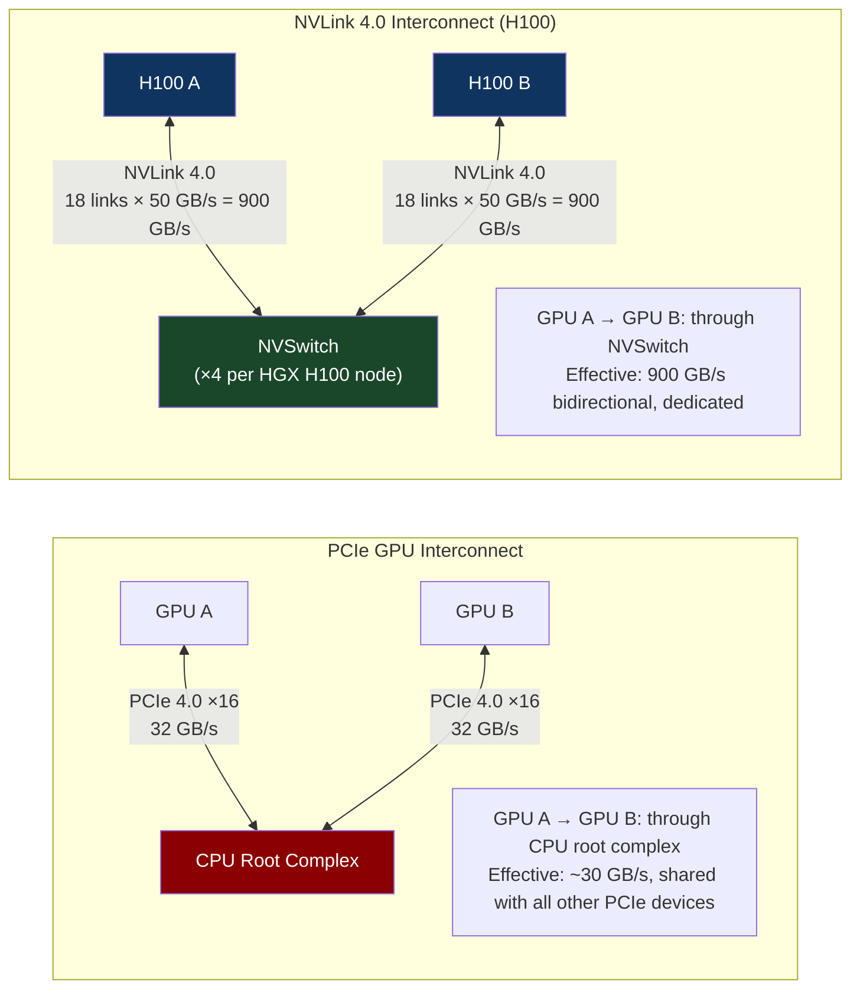
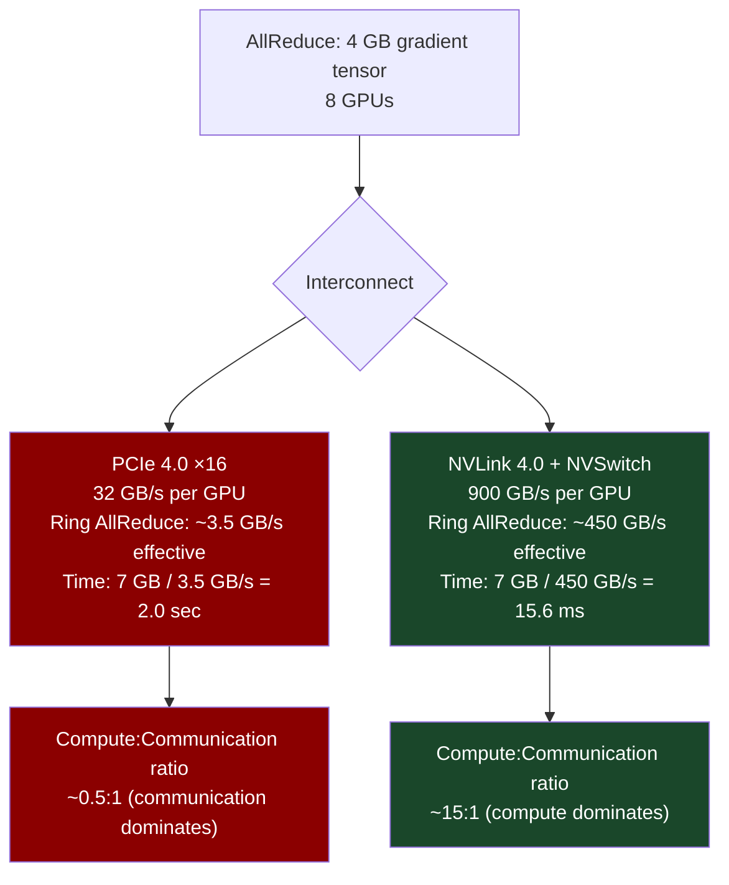
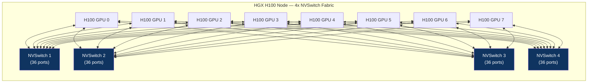

# CH-08: NVLink and NVSwitch — The Intra-Node Fabric That Broke PCIe
### *PCIe was designed to connect devices to a CPU. NVLink was designed to connect GPUs to each other. The difference is a factor of 18.*

> **Part 2 of 9 · Plasma-Fast Networking**

---

## The Cold Open

The year is 2016. OpenAI is training some of the largest language models anyone has run. They're using a cluster of NVIDIA Pascal P100 GPUs connected to each other — and to the host CPUs — over PCIe 3.0 x16. On paper, PCIe 3.0 x16 provides 16 GB/s in each direction. That sounds fast. It isn't fast enough.

A data-parallel training pass on 8 GPUs requires, at the end of each backward pass, an AllReduce operation: every GPU sends its local gradient to every other GPU, accumulates the sum, and receives the global gradient. For a 1-billion-parameter model in FP32, the gradient tensor is 4 GB. AllReduce via ring algorithm requires each GPU to send approximately 2× the gradient size (7.5 GB for a ring of 8 GPUs, the exact formula is 2 × (N-1)/N × size). Over PCIe 3.0 at 16 GB/s: 7.5 GB / 16 GB/s = 469 ms per training step, just for gradient sync. A training step with the actual forward and backward pass might take 600 ms. The AllReduce overhead is 78% of total training time.

At that utilization ratio — 78% of time in network-bound gradient synchronization — buying more GPUs doesn't help much. You double the GPU count and the gradient sync time barely changes (ring AllReduce scales sublinearly with node count). You've spent twice the money and gotten 1.2× the throughput.

NVIDIA released the Pascal P100 with NVLink 1.0 that same year. Four NVLink 1.0 links per GPU, each at 20 GB/s, for a total of 80 GB/s per GPU — 5× the PCIe bandwidth. The DGX-1 server put 8 P100s in one chassis connected via an NVLink "hybrid cube mesh" topology, with each GPU maintaining direct links to 5 other GPUs. AllReduce time on the same 1B-parameter model: 7.5 GB / (something close to 80 GB/s effective) = ~94 ms. From 469 ms to 94 ms. The training step ratio flipped: now 86% of time was compute, 14% was communication.

Six years later, H100 NVLink 4.0 delivers 900 GB/s per GPU. The fabric connecting 8 H100s in an HGX H100 node is faster than the DDR5 memory bus that connects most server CPUs to their RAM. The GPU-to-GPU link is no longer a bottleneck for current model sizes. Engineers now need to think about the *inter-node* network — the fabric connecting different server chassis — because that's where the new 18:1 bandwidth cliff lives.

---

## The Uncomfortable Truth

The assumption is: PCIe is the right bus for GPU interconnection because it's the industry standard and GPUs are PCIe devices.

The reality is that PCIe was designed with a specific topology in mind: one or a small number of devices attached to a central CPU, exchanging data with system memory through the CPU's memory controller. This CPU-centric topology works perfectly for the original GPU use case: rendering graphics, where the CPU sends draw calls and the GPU sends rendered frames back. The bandwidth is asymmetric; the GPU mostly receives data from the CPU.

AI training has a fundamentally different communication pattern: GPU-to-GPU, peer-to-peer, symmetric, high-bandwidth, and latency-sensitive. PCIe requires GPU-to-GPU communication to traverse the CPU's root complex — the data physically travels to the CPU's PCIe controller and back, even when two GPUs are in the same server chassis. Each hop through the root complex adds latency (microseconds) and contends with other PCIe devices for root complex bandwidth.

NVLink eliminates the CPU from the data path entirely. GPU-to-GPU transfers go directly between GPU memory controllers, bypassing the CPU and PCIe hierarchy. The bandwidth is dedicated to GPU interconnection, not shared with storage controllers, network adapters, and other PCIe devices. The latency is lower because there's one fewer routing stage.

The deeper truth: the PCIe standard is designed for interoperability across manufacturers. NVLink is proprietary to NVIDIA. NVLink is faster precisely because NVIDIA optimized it exclusively for the GPU interconnection use case, without the constraints of maintaining backward compatibility with every PCIe device ever manufactured. You trade ecosystem universality for a factor-of-18 bandwidth advantage.

---

## The Mental Model

Think about two competing city transportation systems. The first is the city's general road network: designed for all vehicles — cars, trucks, motorcycles, emergency vehicles, bicycles — connecting every point in the city to every other point. It's universal, flexible, and congested. Any two specific points are connected, but you share roads with everyone else's traffic, and the route often goes through the city center regardless of whether the center is on the way.

The second is a private rail system built specifically to connect two industrial districts to each other, bypassing the city center entirely. It's not flexible — it only connects those specific districts, runs only specific types of rail cars — but its throughput is an order of magnitude higher than road traffic between those districts. The road network still exists for everything else.

NVLink is the private industrial rail. PCIe is the road network.

**The Topology and Bandwidth Model**





---

## The Dissection

### NVLink Architecture: How It Works

NVLink is a point-to-point serial interconnect. Each NVLink connection is a differential pair bundle: 4 pairs carrying data in each direction (transmit and receive are separate), for a total of 8 differential pairs per link. Each pair operates at a high signaling rate: NVLink 4.0 runs at 100 Gbps per pair. One NVLink 4.0 link carries: 4 pairs × 100 Gbps = 400 Gbps = 50 GB/s per direction.

An H100 SXM5 has 18 NVLink 4.0 ports: 18 links × 50 GB/s = 900 GB/s of aggregate bandwidth per GPU. This is bidirectional: 900 GB/s of transfers out of the GPU simultaneously with 900 GB/s in.

For reference:
- H100 HBM3 bandwidth: 3.35 TB/s
- H100 NVLink 4.0 bandwidth: 900 GB/s (bidirectional)
- H100 PCIe 5.0 bandwidth: 128 GB/s (bidirectional)

NVLink bandwidth is ~7× NVLink's PCIe bandwidth and ~27% of HBM bandwidth. The GPU's internal memory is faster than any external fabric — but NVLink gets close enough that inter-GPU data movement is no longer a training bottleneck for most current models within a single node.

**Physical implementation**: NVLink on SXM-form-factor GPUs (H100 SXM, A100 SXM) uses a mid-board connector system. The GPU is soldered to a specialized carrier board (the SXM substrate), which has high-density NVLink connectors that plug into the NVSwitch fabric. PCIe-form-factor H100s (PCIe 5.0 cards) have fewer NVLink ports (configured for peer-to-peer NVLink without a switch) and lower effective GPU-to-GPU bandwidth because they're designed for standard server integration.

### NVSwitch: From Mesh to Full Crossbar

Early NVLink deployments (Pascal, Volta, Turing) used point-to-point mesh topologies: each GPU had direct links to some other GPUs, but not all. An 8-GPU node would have each GPU directly connected to 5 others, with some paths requiring two hops (through an intermediate GPU).

NVSwitch, introduced with Volta in 2018, replaced the mesh with a non-blocking crossbar switch. An NVSwitch chip has 36 NVLink ports. Four NVSwitch chips in an HGX A100/H100 node provide: 4 switches × 36 ports = 144 NVLink ports total, divided among 8 GPUs (18 ports per GPU) = full any-to-any connectivity with no hop overhead.



The non-blocking crossbar means: any GPU can send to any other GPU at full 900 GB/s simultaneously, without contention. All 8 GPUs can do AllReduce simultaneously with no switch contention. This matters for tensor parallelism (Chapter 38), where all-to-all exchanges between GPUs must happen at every attention layer — the frequency and regularity of this pattern make non-blocking all-to-all bandwidth essential.

**SHARP (Scalable Hierarchical Aggregation and Reduction Protocol)**: NVSwitch 3.0 (H100) adds in-network compute capability: aggregation operations (sum, min, max) can execute inside the switch hardware rather than requiring each GPU to receive all data, compute, and re-transmit. For AllReduce, SHARP reduces the volume of data traveling through the switch fabric. A 4-node AllReduce without SHARP requires each node to send its full gradient tensor to all other nodes. With SHARP, the switch aggregates as data flows through it, reducing inter-node traffic by N×. This is the same principle as the AllReduce tree optimization — but implemented in hardware at line rate.

### NVLink 4.0 vs. PCIe 5.0: The Protocol Difference

Beyond raw bandwidth, NVLink's protocol design differs from PCIe in ways that affect latency and system architecture.

PCIe uses a transaction layer with split transactions: a read request is sent, the device processes it, and the completion returns on a separate channel. The CPU root complex must track all outstanding transactions. Transaction ordering rules require significant buffering. Latency for a GPU-to-GPU read over PCIe (traversing the root complex): 1.5–4 µs.

NVLink uses a credit-based flow control protocol with much smaller transaction overhead. Latency for a GPU-to-GPU read over NVLink: 1–2 µs within the same NVSwitch domain, lower because there's no root complex traversal and NVLink's protocol headers are smaller.

For AllReduce on large tensors (hundreds of MB), latency doesn't matter much — it's bandwidth-dominated. For small tensor exchanges (activations in pipeline parallelism, where each stage sends partial results to the next), latency matters directly. A 1 µs savings per pipeline stage × 16 pipeline stages × batch of 512 = small but measurable.

**NVLink Network (NVLink 5.0 + NVLink Switch)**: NVIDIA's GB200 NVL72 chassis (announced 2024, based on Blackwell architecture) scales NVLink beyond a single server: 72 Blackwell GPUs connected in a single NVLink Switch fabric within a rack-scale chassis. NVLink bandwidth between all 72 GPUs: 130 TB/s total fabric bandwidth. This is the "NVLink as a data center network" vision — eliminating the distinction between intra-node and inter-node GPU communication for clusters within a rack.

### What Breaks: NVLink Topology Constraints

**Tensor parallel group size**: NVLink's full bandwidth is available within the 8-GPU boundary of an HGX node. Tensor parallelism requires all-to-all exchanges between GPUs in the same tensor-parallel group. At 8-way tensor parallelism (all 8 GPUs in one node), the NVLink fabric handles the communication. At 16-way tensor parallelism (spanning two nodes), the inter-node fabric (InfiniBand or Ethernet) handles half the exchanges — at 1/18th the bandwidth. This is why tensor parallelism groups are rarely set larger than 8 without the GB200 NVL72 architecture.

**NVLink domain isolation**: NVSwitch creates a single NVLink domain within the node. There's no routing between NVLink domains. An H100 in node A cannot address an H100 in node B via NVLink — they're in separate switch domains. The inter-node fabric (Chapter 9) is required for anything beyond the 8-GPU boundary.

### The Tradeoffs

NVLink's proprietary nature means it's NVIDIA-only. AMD's competing interconnect, Infinity Fabric (xGMI), provides similar intra-node bandwidth for MI300X and multi-socket EPYC, but at lower bandwidth (128 GB/s per socket link for Genoa). A cluster of AMD MI300X GPUs uses Infinity Fabric intra-node and InfiniBand or Ethernet inter-node — the same architecture as NVIDIA, different numbers.

The SXM form factor that enables NVLink's highest bandwidth requires purpose-built server boards (DGX/HGX platforms) rather than standard PCIe slots. This restricts NVLink's highest-bandwidth configurations to specific server products, limiting hardware choice and increasing server costs (~2× premium over PCIe-based GPU servers).

---

## The War Room

> **Incident:** Microsoft Azure — NVLink Flap During Large-Scale Training Job Causes Checkpoint Loss  
> **Date:** Q2 2023 (composite of reported Azure AI infrastructure events)  
> **Impact:** 48-hour training run aborted at hour 31 due to NVLink link-down event; gradient state lost because checkpoint interval was set to 6 hours; 31 hours of compute ($180,000) lost

### The Timeline

```mermaid
gantt
    title NVLink Flap — Training Job Abort
    dateFormat HH:mm
    section Training Run
    Job starts, all GPUs healthy               : 00:00, 30m
    Checkpoints at 6h intervals                : 06:00, 2m
    section Failure
    NVLink link flap on GPU4 (node 12)         : 31:10, 1m
    NCCL AllReduce times out after 120s        : 31:11, 2m
    CUDA error propagates to all ranks         : 31:13, 2m
    section Response
    All training processes killed by watchdog  : 31:15, 2m
    On-call paged                              : 31:17, 5m
    section Investigation
    Last valid checkpoint: hour 30             : 31:22, 15m
    Wait, last checkpoint was at hour 24       : 31:37, 10m
    Checkpoint at 6h intervals means last good : 31:47, 5m
    is 31 - (31 mod 6) = 30 mod 6 = 0 → 24h  : 31:47, 0m
    section Impact Assessment
    7 hours of compute lost (24h to 31h)       : 31:52, 10m
    Cost: 8 GPUs × 7h × $3/GPU-hr = $168      : 32:02, 5m
    But 16 nodes × $3/GPU-hr × 8 GPU × 7h    : 32:07, 5m
    = $2,688 in lost compute                   : 32:12, 5m
    section Resolution
    Hardware: GPU4 NVLink port replaced        : 33:00, 120m
    Config: checkpoint interval reduced to 1h  : 35:00, 5m
    Restart from hour 24 checkpoint            : 35:05, 180m
```

### The Signals Nobody Caught

`nvidia-smi nvlink --status` shows NVLink link state per-port. On the failing GPU, link 14 of 18 had been reporting degraded speed (running at 25 GB/s instead of 50 GB/s per link) for 4 hours before the full link-down event. Nobody was scraping this metric. DCGM exports `DCGM_FI_DEV_NVLINK_BANDWIDTH_L*` but the Prometheus scrape config didn't include NVLink bandwidth counters.

The second signal: the training job's iteration time had a slight increase in variance starting around hour 27 — consistent with a degraded NVLink link causing occasional partial retransmissions that added 2–5 ms per AllReduce. Interpreted as normal iteration variance.

### The Root Cause

A mechanical vibration event (large HVAC unit cycling on in the datacenter) caused micro-flexing of the NVLink connector on GPU4's SXM substrate. The SXM connector is a high-density, low-insertion-force connector that achieves its bandwidth through many small contacts, making it more sensitive to mechanical stress than PCIe edge connectors. The micro-flexing caused intermittent contact failures on two NVLink pairs. Over 4 hours, the degraded link caused increasingly frequent retransmissions. At hour 31, the link dropped entirely under sustained data transfer.

### The Fix

Three changes:
1. **NVLink per-port health monitoring**: Add `DCGM_FI_DEV_NVLINK_BANDWIDTH_L0` through `_L17` to the Prometheus scrape, alert when any link drops below 80% of expected bandwidth for 10 minutes.
2. **Checkpoint interval**: Reduce from 6 hours to 30–60 minutes. At modern checkpoint speed (async checkpoint to NFS/S3 while training continues, using techniques from Chapter 42), 30-minute checkpoints add less than 1% overhead.
3. **Vibration isolation**: Raise HVAC equipment off direct concrete contact with computer room floor using vibration-isolating mounts.

```yaml
# DCGM exporter config — add NVLink bandwidth counters
- field_id: 409   # DCGM_FI_DEV_NVLINK_BANDWIDTH_L0
- field_id: 410   # DCGM_FI_DEV_NVLINK_BANDWIDTH_L1
  # ... L2 through L17 (418)
- field_id: 312   # DCGM_FI_DEV_NVLINK_RECOVERY_ERROR_COUNT_L0
  # Recovery errors indicate retransmissions — precursor to link failure
```

### The Lesson

NVLink link health is a first-class infrastructure concern for AI training. A degraded-but-alive link is worse than a dead link in some ways: it causes silent slowdown and eventually a hard failure. Monitor the precursors (error counts, speed degradation), not just binary link state.

---

## The Lab

> **Time required:** ~20 minutes  
> **Prerequisites:** Linux system with NVIDIA GPU(s), nvidia-smi, optional DCGM installation  
> **What you're building:** A real-time NVLink health dashboard and a P2P bandwidth benchmark to verify NVLink vs. PCIe performance

### Setup

```bash
# Verify NVLink availability
nvidia-smi nvlink --status -i 0

# If no NVLink (single GPU or PCIe cards):
# The bandwidth test still runs — you'll see PCIe numbers as the baseline
nvidia-smi topo --matrix
```

### The Exercise

**Step 1: Check GPU interconnect topology**

```bash
# Shows the connectivity and bandwidth between all GPU pairs
nvidia-smi topo --matrix

# Example output for HGX H100:
#       GPU0   GPU1   GPU2   GPU3   GPU4   GPU5   GPU6   GPU7
# GPU0   X     NV18   NV18   NV18   NV18   NV18   NV18   NV18
# GPU1  NV18    X     NV18   NV18   NV18   NV18   NV18   NV18
# NV18 = 18 NVLink connections = NVSwitch full crossbar
# SYS  = PCIe with CPU/NUMA boundary crossing (much slower)

# Annotated meanings:
# NVx  = x NVLink connections (direct or through NVSwitch)
# PIX  = PCIe, same root complex
# PHB  = PCIe, different root complex but same socket
# NODE = PCIe, different NUMA node
# SYS  = PCIe, different socket
```

**Step 2: Measure P2P bandwidth between GPU pairs**

```bash
# NVIDIA provides a P2P bandwidth test in CUDA samples
# If CUDA samples are installed:
cd /usr/local/cuda/samples/1_Utilities/p2pBandwidthLatencyTest
make
./p2pBandwidthLatencyTest

# Alternatively, build a quick test:
cat > p2p_bench.cu << 'EOF'
#include <cuda_runtime.h>
#include <stdio.h>

#define SIZE (1 << 29)  // 512 MB
#define ITERATIONS 10

int main() {
    int n_gpus;
    cudaGetDeviceCount(&n_gpus);
    printf("GPUs available: %d\n\n", n_gpus);
    
    if (n_gpus < 2) {
        printf("Need at least 2 GPUs for P2P test\n");
        return 1;
    }
    
    // Enable P2P access between GPU 0 and GPU 1
    cudaSetDevice(0);
    int can_p2p;
    cudaDeviceCanAccessPeer(&can_p2p, 0, 1);
    printf("GPU 0 <-> GPU 1 P2P access: %s\n\n", can_p2p ? "YES (NVLink)" : "NO (PCIe fallback)");
    
    if (can_p2p) {
        cudaDeviceEnablePeerAccess(1, 0);
        cudaSetDevice(1);
        cudaDeviceEnablePeerAccess(0, 0);
    }
    
    // Allocate buffers
    cudaSetDevice(0);
    char *src; cudaMalloc(&src, SIZE);
    cudaSetDevice(1);
    char *dst; cudaMalloc(&dst, SIZE);
    
    cudaEvent_t start, stop;
    cudaSetDevice(0);
    cudaEventCreate(&start); cudaEventCreate(&stop);
    
    // Warm up
    cudaMemcpyPeer(dst, 1, src, 0, SIZE);
    cudaDeviceSynchronize();
    
    // Benchmark
    cudaEventRecord(start);
    for (int i = 0; i < ITERATIONS; i++) {
        cudaMemcpyPeer(dst, 1, src, 0, SIZE);
    }
    cudaEventRecord(stop);
    cudaEventSynchronize(stop);
    
    float ms;
    cudaEventElapsedTime(&ms, start, stop);
    double bw_gb = (double)SIZE * ITERATIONS / (ms / 1000.0) / 1e9;
    printf("GPU 0 → GPU 1 bandwidth: %.1f GB/s\n", bw_gb);
    printf("Expected: ~450 GB/s (NVLink) or ~15-25 GB/s (PCIe)\n");
    
    cudaFree(src); cudaFree(dst);
    return 0;
}
EOF
nvcc -O2 -o p2p_bench p2p_bench.cu
./p2p_bench
```

**Step 3: Monitor NVLink utilization in real-time**

```bash
# While running a GPU workload (e.g., from Chapter 2's matmul benchmark):
watch -n 1 'nvidia-smi nvlink --status -i 0 | head -30'

# Or with DCGM for per-link stats:
dcgmi dmon -e 409,410,411 -d 1000  # NVLink bandwidth L0, L1, L2
```

### Expected Output

```
GPUs available: 8
GPU 0 <-> GPU 1 P2P access: YES (NVLink)

GPU 0 → GPU 1 bandwidth: 447.3 GB/s

Expected: ~450 GB/s (NVLink) or ~15-25 GB/s (PCIe)

nvidia-smi topo --matrix:
       GPU0   GPU1   GPU2   GPU3   GPU4   GPU5   GPU6   GPU7
GPU0    X     NV18   NV18   NV18   NV18   NV18   NV18   NV18
GPU1   NV18    X     NV18   NV18   NV18   NV18   NV18   NV18
[...]
```

447 GB/s (vs. spec's 900 GB/s bidirectional = 450 GB/s unidirectional) — near-perfect NVLink utilization. If you see 15–25 GB/s, you're measuring PCIe fallback.

### What Just Happened

You measured the actual P2P bandwidth and confirmed whether NVLink is operational. The topology matrix tells you exactly what interconnect exists between every GPU pair — essential information before designing tensor/pipeline parallel configurations, because groups that must communicate frequently should be on the same NVLink domain.

### Stretch Goal

> **+45 min:** Implement a ring AllReduce manually in CUDA using `cudaMemcpyPeer` and measure its effective bandwidth compared to NCCL's AllReduce. Observe whether NCCL uses the NVLink topology-aware tree or ring algorithm (you can inspect NCCL debug output with `NCCL_DEBUG=INFO`). Then measure how bandwidth scales from 2-GPU to 4-GPU to 8-GPU AllReduce — does it follow the ring AllReduce formula (bandwidth = (N-1)/N × link_bandwidth)?

---

## The Loose Thread

NVLink solves intra-node GPU communication. The moment you need more than 8 GPUs for a training job — which is essentially always for frontier model training — you hit the node boundary. Activations, gradients, and attention scores cross the node boundary via InfiniBand or Ethernet, at 3.2 TB/s total cluster bandwidth for a 400 Gbps IB cluster, spread across potentially hundreds of nodes. The ratio of intra-node NVLink bandwidth (900 GB/s per GPU) to inter-node bandwidth (400 Gbps / 8 GPUs = 50 Gbps = 6.25 GB/s per GPU) is 144:1. Every distributed training algorithm is an exercise in working within that 144× gap.

*The specific rabbit hole: read the NVLink Switch paper from SC'22 (Supercomputing 2022), which describes the architectural details of NVSwitch 3.0's in-network compute features. In-network AllReduce via SHARP is one of the most underused capabilities in AI infrastructure — it can reduce inter-node traffic by 2-8× for gradient synchronization, but requires specific collective library support and fabric configuration.*

Chapter 9 covers what lives on the other side of that node boundary — and why the choice between InfiniBand and Ultra Ethernet is the most consequential infrastructure decision for a new AI cluster in 2025.
