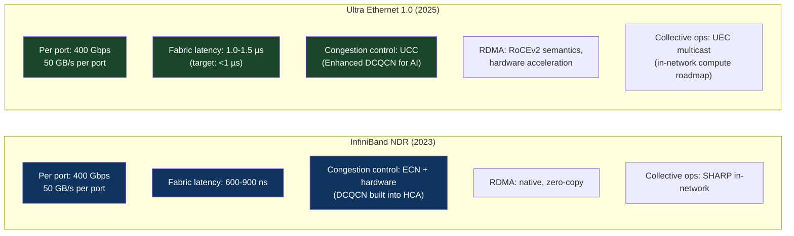
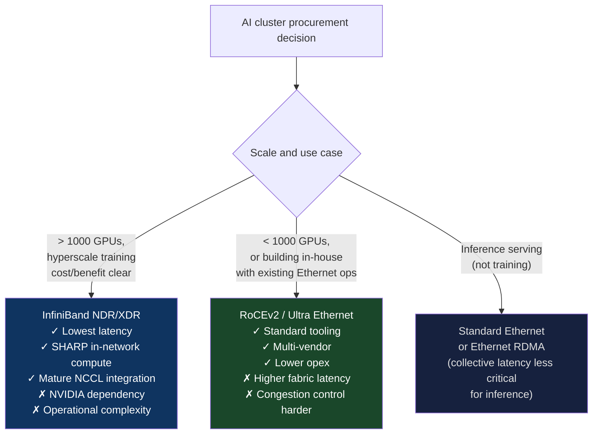
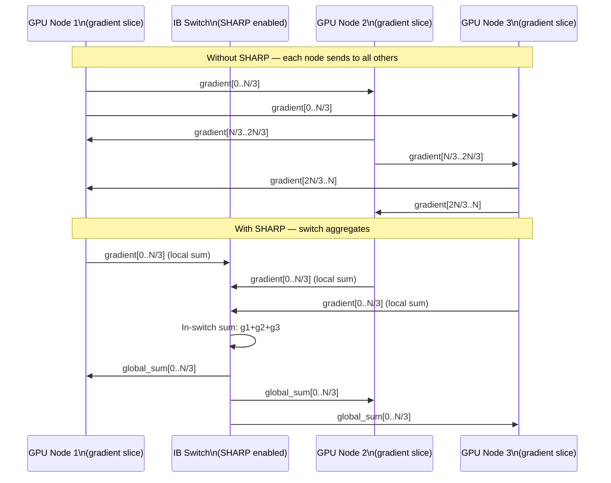

# CH-09: InfiniBand vs Ultra Ethernet — The Great Fabric War
### *InfiniBand dominated AI networking for a decade. Then the Ethernet consortium decided they wanted the market back. The argument is not technical.*

> **Part 2 of 9 · Plasma-Fast Networking**

---

## The Cold Open

In November 2022, AMD, Arista, Broadcom, Cisco, HPE, Intel, Meta, and Microsoft formed the Ultra Ethernet Consortium (UEC). The announcement was matter-of-fact — a standards body, membership list, charter. But what it actually was, was a declaration of war against NVIDIA's MLNX acquisition.

NVIDIA bought Mellanox Technologies in April 2020 for $6.9 billion. Mellanox made InfiniBand — the high-speed, low-latency fabric that had dominated HPC and AI networking for 15 years. After the acquisition, NVIDIA owned the premier AI networking technology and was using it to bundle with GPU sales. Want the fastest H100 training fabric? Buy NDR InfiniBand. Who sells NDR InfiniBand? NVIDIA (formerly Mellanox). Who approves supply allocation? NVIDIA. The companies in the UEC had a word for this situation: dangerous.

InfiniBand is technically excellent. HDR InfiniBand (200 Gbps) and NDR InfiniBand (400 Gbps) offer sub-microsecond fabric latency, hardware-based congestion control, native RDMA semantics, adaptive routing, and a mature software ecosystem (NCCL, OpenMPI, OpenUCX). For AI training — which needs reliable, low-latency, high-bandwidth collective operations between thousands of GPUs — InfiniBand has been the answer for a decade.

The problem, from the UEC members' perspective, is not that InfiniBand doesn't work. The problem is who controls it. When NVIDIA controls both the GPU and the interconnect, the decision to buy a non-NVIDIA GPU becomes significantly harder — you lose NVLink intra-node AND the best inter-node fabric option. The lock-in is structural.

Ultra Ethernet is the response. Take Ethernet — the standard that already connects every data center in the world — and extend it specifically for AI workloads: sub-microsecond latency, hardware RDMA semantics, congestion control tuned for collective operations, and lossless fabric behavior. Make it an open standard so Arista, Cisco, Broadcom, and every switch vendor can implement it. Break NVIDIA's interconnect monopoly.

As of 2025, Ultra Ethernet 1.0 specification is ratified. The first UE hardware is shipping from select vendors. InfiniBand NDR is deployed in production at scale at AWS, Azure, Google, and most hyperscalers' AI clusters. The battle is real, and the technical comparison is more nuanced than the political narrative suggests.

---

## The Uncomfortable Truth

The assumption is: InfiniBand is faster than Ethernet for AI, and that's the end of the comparison.

The reality is that the performance gap between InfiniBand and modern Ethernet for AI training is narrowing, and the operational complexity of InfiniBand — its proprietary management stack, non-standard routing protocols, subnet manager requirements, and specialized driver software — represents a real ongoing cost that the raw bandwidth spec doesn't reflect.

InfiniBand is not TCP/IP networking. It uses a completely different addressing model (LID-based, flat address space), a different routing protocol (subnet manager computes routes centrally rather than distributed routing protocols), and a different transport protocol (IB Verbs, not sockets). Your entire IP-based monitoring stack — snmp, sflow, netflow, standard Prometheus exporters — doesn't work directly on InfiniBand fabric. You need specialized tools (Mellanox UFM for fabric management, IB-specific Prometheus exporters, custom scripts calling `ibstat` and `ibnetdiscover`).

For a team whose expertise is Kubernetes, Terraform, and AWS networking, running InfiniBand is a non-trivial operational capability that requires either in-house expertise or managed service abstraction. AWS, Azure, and Google abstract this by offering IB-backed HPC instance families where the fabric is managed for you. But if you're building a private cluster, IB's operational overhead is real.

Ethernet, conversely, runs over infrastructure your team already understands: standard switches, standard routing protocols, Prometheus exporters, SNMP, familiar observability stack. The question is whether RoCEv2 (RDMA over Converged Ethernet) delivers enough performance to make InfiniBand's operational overhead unnecessary for your scale.

---

## The Mental Model

Think about two airports. Airport A (InfiniBand) is a dedicated private terminal built specifically for a single airline's fleet of wide-body jets. It has bespoke ground equipment optimized for those specific jets, custom fueling systems, dedicated runways, and staff trained exclusively on that airline's procedures. When those jets are running at peak load, the throughput is exceptional: fast boarding, fast turnaround, no conflicts with other aircraft. But if you want to bring in a different aircraft type, you need to retrofit the whole terminal. And the runway computers don't speak ATC standard — you need a specialized air traffic control system that only this terminal uses.

Airport B (Ethernet with RoCEv2) is a standard international airport. It handles hundreds of aircraft types. Standard ATC procedures. Every ground crew knows how to service any plane. The terminal is built for universal compatibility. The tradeoff: some per-aircraft efficiency is lost to the universal protocols. The runway sequencing software wasn't optimized for any specific aircraft — it tries to be fair to all types. But you can bring in any aircraft, any vendor, any airline.

For the specific fleet (AI training at scale), Airport A is faster. For operational flexibility, heterogeneity, and avoiding vendor lock-in, Airport B is saner.

**The Bandwidth and Latency Comparison**





---

## The Dissection

### InfiniBand Architecture

InfiniBand's architecture differs fundamentally from Ethernet in several ways:

**Address model**: IB uses Local IDs (LIDs) for intra-subnet routing and Global IDs (GIDs) for inter-subnet. Unlike IP addresses, LIDs are 16-bit integers assigned by a central Subnet Manager (SM). The SM computes all routing tables centrally and pushes them to each switch. There's no distributed routing protocol — everything goes through the SM. This enables optimal routing but creates an SPOF if the SM fails (SM failover exists but requires explicit configuration).

**Transport types**: IB offers four transport types:
- **RC (Reliable Connection)**: connection-oriented, reliable delivery, sequential ordering. Used by most RDMA operations.
- **UC (Unreliable Connection)**: connection-oriented, no delivery guarantee. Rarely used.
- **UD (Unreliable Datagram)**: connectionless, small message operations. Used by some MPI collectives.
- **RD (Reliable Datagram)**: multicast-capable reliable delivery. Rarely supported.

AI training uses RC heavily for gradient exchange and some UD for small control messages.

**Collective operations and SHARP**: NVIDIA's SHARP (Scalable Hierarchical Aggregation and Reduction Protocol) implements AllReduce entirely within the IB switch fabric, without any data reaching the host CPU. A SHARP-capable switch can aggregate data from multiple sources as it flows through, performing the reduction in the switch ASIC. For AllReduce on N nodes, SHARP reduces the data volume each node sends from O(N × gradient_size) to O(gradient_size) — the aggregation happens in-network, and each node receives only the fully-reduced result. At 1,000-node scale, this is a 1000× reduction in per-node send volume.



### RoCEv2: RDMA Over Ethernet

RoCEv2 (RDMA over Converged Ethernet, version 2) runs the InfiniBand transport layer (RDMA semantics, zero-copy data transfer) over a UDP/IPv4 or IPv6 network. The RDMA verbs API is unchanged — applications written for InfiniBand RDMA can run on RoCEv2 with minimal modification. The physical network is standard Ethernet; the RDMA operations are handled by a RDMA-capable NIC (RNIC).

The critical requirement for RoCEv2: **lossless Ethernet**. RDMA's RC transport does not handle packet loss gracefully — a dropped packet in the middle of an RDMA write operation causes the entire operation to time out and restart. Ethernet is inherently lossy (switches drop packets under congestion). Making Ethernet lossless for RDMA requires:

1. **PFC (Priority Flow Control)**: IEEE 802.1Qbb — a pause mechanism that allows a switch to signal an upstream device to stop sending on a specific traffic class. When a switch buffer fills, it sends a PAUSE frame to the sender, which stops transmitting until a PAUSE-release is received. This prevents drops but can cause headaches (pause storms, HoL blocking).

2. **ECN (Explicit Congestion Notification)**: IEEE 802.1Qau / RFC 3168 — switches mark packets with a Congestion Experienced (CE) bit when buffers are filling. Receivers report CE markings to senders, which reduce their injection rate before drops occur. DCQCN (Data Center Quantized Congestion Notification) is the specific ECN-based algorithm used for RoCEv2 in most deployments.

Getting PFC + ECN right is where RoCEv2 deployments most commonly fail. PFC pause frames can propagate upstream through the fabric, causing a "pause storm" where a single congested port cascades pauses throughout the network. ECN threshold tuning requires understanding your specific traffic patterns — wrong thresholds cause under-reaction (drops still happen) or over-reaction (unnecessary rate limiting that wastes available bandwidth).

```bash
# Check RoCEv2 configuration on a Mellanox/NVIDIA ConnectX NIC
# Verify PFC is enabled on the right priorities
mlnx_qos -i <interface> --trust dscp --pfc "0,0,0,1,0,0,0,0"
# Priority 3 enabled for PFC — matches typical RoCEv2 configuration

# Verify ECN configuration
cat /sys/class/net/<interface>/ecn/roce_np/enable/3
# Should return 1 (ECN enabled for RoCEv2 traffic class)

# Check congestion events
ethtool -S <interface> | grep -E "rx_pause|tx_pause|ecn"
```

### Ultra Ethernet: What's New

Ultra Ethernet 1.0 (specification published 2024) addresses the pain points of running RoCEv2 in large AI clusters. Key additions:

**UEC Congestion Control (UCC)**: A new congestion control algorithm designed specifically for AI collective operations. Standard DCQCN was designed for unicast flows. AllReduce, AllGather, and ReduceScatter are incast patterns — many sources sending to one destination simultaneously. DCQCN mishandles incast because its response time is tuned for steady unicast flows, not bursts. UCC includes incast-specific detection and response, with sub-microsecond reaction time.

**Ordered multicast**: Current RoCEv2 multicast has ordering and reliability limitations. UE 1.0 defines reliable ordered multicast semantics, enabling collective operations without the all-to-all unicast messaging overhead that current AI frameworks use.

**Transport Convergence Layer (TCL)**: An explicit transport layer that maps to both IB semantics (for NCCL) and socket semantics (for standard applications), allowing the same NIC to serve both RDMA and conventional networking from a unified driver stack.

**UE-Native Congestion Control**: Unlike IB's ECN-based approach, UE includes credit-based flow control as an option for the lowest-latency scenarios — similar to IB's send-credit mechanism but over Ethernet physical layer.

### The Congestion Control Comparison

This is where InfiniBand still has a measurable edge. IB's credit-based flow control operates at the chip level with hardware-enforced credits per destination. There is no congestion under normal operation — if no credits are available, the sender simply doesn't transmit until they're returned. Latency is determined by the wire, not by congestion.

RoCEv2's PFC+ECN approach is reactive: congestion must be detected (buffer fills), signaled (ECN mark or PFC frame), and the sender must reduce rate. This reaction loop adds latency under load. In large clusters (1000+ nodes) running all-to-all operations, the time from first-congestion-bit-set to rate reduction is 50–200 µs. In 400 Gbps networks, 200 µs of extra injection before rate reduction means 80 MB of excess data injected, requiring 800 MB of buffer to absorb (since N nodes are all doing this simultaneously). Most switches have 32–64 MB of shared buffer. Drops occur. Retransmissions happen.

IB at scale doesn't have this problem because the credit-based flow control prevents sending beyond available buffer capacity in the first place.

Ultra Ethernet's UCC closes most of this gap, but IB still maintains a few hundred nanoseconds of advantage in fabric latency for small messages — which matters most for the point-to-point operations in pipeline parallelism.

### The Tradeoffs

**InfiniBand**: better raw performance, more mature AI collective support (SHARP), lower fabric latency. Higher operational complexity (subnet manager, proprietary management tools, NVIDIA dependency), more expensive hardware, limited multi-vendor options.

**Ethernet (RoCEv2 / Ultra Ethernet)**: easier operations for teams with Ethernet expertise, multi-vendor ecosystem, standard tooling. Requires careful PFC+ECN tuning, less mature in-network collective support, slightly higher fabric latency for small messages.

For greenfield AI clusters at hyperscale (>1,000 GPUs, training focused): InfiniBand NDR remains the choice for lowest iteration time per dollar of compute. For inference-dominated workloads, moderate scale, or teams building on existing Ethernet infrastructure: RoCEv2 on 100–400G Ethernet is increasingly viable and the operational overhead reduction justifies the marginal performance difference.

---

## The War Room

> **Incident:** A Large Language Model Startup — PFC Pause Storm Collapses Training Fabric  
> **Date:** 2023 (composite of multiple documented RoCEv2 pause-storm incidents)  
> **Impact:** 200-GPU training cluster fabric degraded to near-zero throughput for 47 minutes; training job killed after 19 hours of the 24-hour run; $85,000 in lost compute

### The Timeline

```mermaid
gantt
    title PFC Pause Storm — RoCEv2 Training Fabric Collapse
    dateFormat HH:mm
    section Training
    Training job running normally              : 00:00, 1140m
    section Cascade
    Switch port 24 buffer spike (new job)      : 19:00, 2m
    PFC PAUSE sent to 3 upstream senders       : 19:02, 1m
    Those senders pause and back-propagate     : 19:03, 1m
    Half the fabric paused within 30 seconds   : 19:03, 1m
    Training AllReduce stalls                  : 19:04, 1m
    NCCL timeout (120s) kills all ranks        : 19:06, 2m
    section Investigation
    Switch counters show PFC storm             : 19:10, 15m
    Root cause: single hotspot port            : 19:25, 10m
    section Resolution
    PFC Watchdog enabled (drops PFC storms)    : 19:35, 10m
    Training restarted from 18h checkpoint     : 19:45, 60m
```

### The Signals Nobody Caught

PFC frame counters (`ethtool -S | grep pause`) were not monitored. The monitoring stack only watched link utilization and error rates. PFC pause frames are not errors — they're a normal flow control mechanism. Without a specific "pause frame rate above threshold" alert, the pause storm was invisible until the training job died.

### The Root Cause

A second training job was started on the cluster while the first was running. The second job's first checkpoint write — a large burst of data to shared NFS storage — caused a brief but intense incast at the storage switch. That switch sent PFC PAUSE to multiple upstream server NICs simultaneously. Those NICs' buffers backed up and sent PFC PAUSE further upstream. Within 30 seconds, most of the fabric was paused — not because any link was full, but because PFC pause frames had propagated throughout the network, creating a deadlock where everyone was waiting for everyone else.

### The Fix

Enable PFC Watchdog: a feature on Mellanox/Broadcom switches that automatically drops stuck PFC pause states after a configurable timeout (typically 500 ms). A PFC pause should not last more than a few milliseconds; anything longer indicates a deadlock, not real congestion.

```bash
# Enable PFC Watchdog on Mellanox switch (MLNX-OS)
switch# configure terminal
switch(config)# interface ethernet 1/1
switch(config-if)# pfc watchdog
switch(config-if)# pfc watchdog-action drop
# With watchdog, if a port stays paused for > 500ms, the pause is dropped
# This breaks pause storms at the cost of some packet loss (triggering RoCEv2 retransmit)
# Still better than a complete deadlock

# Monitor for pause events:
switch# show interface ethernet 1/1 counters | grep pause
```

Also: separate storage traffic onto a different priority class (not PFC-protected) to prevent checkpoint writes from injecting into the RDMA fabric.

### The Lesson

RoCEv2 networks require careful traffic class separation. RDMA training traffic, checkpoint/storage traffic, and management traffic should be on different DSCP/priority classes with separate PFC domains. PFC protection applied to all traffic classes is a recipe for pause storms. Apply PFC only to RDMA traffic; let storage traffic be lossy (TCP handles it).

---

## The Lab

> **Time required:** ~30 minutes  
> **Prerequisites:** Linux system with any network interface, iperf3, optional RoCEv2-capable NICs  
> **What you're building:** A network throughput and latency baseline, and an analysis of congestion behavior under load

### Setup

```bash
sudo apt-get install -y iperf3 netperf
# If you have a second machine or can use loopback:
# For RoCEv2 testing: need RDMA-capable NICs (ConnectX, Intel E810, etc.)
# This lab works with standard Ethernet as baseline
```

### The Exercise

**Step 1: Measure raw TCP throughput and latency**

```bash
# On server machine (or use loopback for single-machine):
iperf3 -s &

# TCP throughput (bulk bandwidth):
iperf3 -c localhost -t 30 -P 8

# TCP round-trip latency:
ping -c 1000 -i 0.001 <server_ip> | tail -5
# Or: netperf -H <server_ip> -t TCP_RR -l 30 -- -r 1,1
```

**Step 2: Simulate incast congestion**

```python
# incast_sim.py
# Simulates what happens when N clients all send to one server simultaneously
# This is the AllReduce pattern — N sources to 1 aggregator
import subprocess
import time
import threading
import sys

SERVER = "127.0.0.1"  # use actual server IP in production
N_CLIENTS = int(sys.argv[1]) if len(sys.argv) > 1 else 8

def run_iperf_client(client_id, results):
    result = subprocess.run(
        ["iperf3", "-c", SERVER, "-t", "10", "-J", "--logfile", f"/tmp/iperf_c{client_id}.log"],
        capture_output=True, text=True
    )
    results[client_id] = result.returncode

print(f"Launching {N_CLIENTS} simultaneous iperf3 clients (incast simulation)")
print("This simulates AllReduce incast: all nodes sending to one aggregator\n")

results = {}
threads = [threading.Thread(target=run_iperf_client, args=(i, results)) for i in range(N_CLIENTS)]

t0 = time.time()
for t in threads:
    t.start()
for t in threads:
    t.join()
elapsed = time.time() - t0

# Parse results
import json
total_bw = 0
for i in range(N_CLIENTS):
    try:
        with open(f"/tmp/iperf_c{i}.log") as f:
            data = json.load(f)
            bw = data['end']['sum_received']['bits_per_second'] / 1e9
            print(f"Client {i}: {bw:.2f} Gbps")
            total_bw += bw
    except:
        print(f"Client {i}: error")

print(f"\nTotal incast throughput: {total_bw:.2f} Gbps")
print(f"Per-client fair share: {total_bw/N_CLIENTS:.2f} Gbps")
print(f"(lower = more congestion in incast scenario)")
```

```bash
# Start iperf3 server in multi-client mode
iperf3 -s &

# Test single client vs incast
python3 incast_sim.py 1
python3 incast_sim.py 4
python3 incast_sim.py 8
```

**Step 3: Check NIC RDMA capability (if applicable)**

```bash
# Check if system has RDMA-capable NICs
ibstat 2>/dev/null || echo "No InfiniBand/RoCEv2 HCA found"

# List RDMA devices
rdma link 2>/dev/null || ls /sys/class/infiniband/ 2>/dev/null || echo "No RDMA devices"

# If RoCEv2 NIC present, check RoCEv2 config
rdma link show
# Look for: link <name>/1 state ACTIVE physical_state LINK_UP
```

### Expected Output

```
Launching 8 simultaneous iperf3 clients
Client 0: 1.23 Gbps
Client 1: 1.18 Gbps
Client 2: 1.21 Gbps
...
Total incast throughput: 9.74 Gbps
Per-client fair share: 1.22 Gbps

# vs single client:
# Client 0: 9.82 Gbps (uses full bandwidth)
```

On loopback or a 10G network, incast throughput is near-linear (fair sharing). On a congested switch at 100G with 8 clients, you'd see non-linear degradation and higher latency variance — the congestion signal that RoCEv2 ECN must handle.

### What Just Happened

You measured incast behavior — the pattern that kills RoCEv2 deployments when congestion control isn't tuned correctly. In an ideal network, 8 clients sharing a 100G link each get 12.5 Gbps. In a real network under incast, congestion control determines whether they get 12.5 Gbps each or whether some clients get much more and others get almost nothing (unfairness) or whether the aggregate throughput degrades due to retransmissions and head-of-line blocking.

### Stretch Goal

> **+45 min:** Configure iperf3 with DSCP marking (using `iperf3 --dscp <value>`) to separate RDMA-simulated traffic from bulk traffic. Use Linux `tc` (traffic control) with HTB (Hierarchical Token Bucket) to rate-limit the "RDMA" class and observe how class separation prevents the bulk traffic from congesting the RDMA class. This is the traffic class separation that proper RoCEv2 deployments use to avoid pause storms.

---

## The Loose Thread

InfiniBand vs. Ultra Ethernet is a protocol and ecosystem argument. The underlying physics — bandwidth and latency — are determined by the optical transceivers, cables, and switch ASICs, which are increasingly shared between the two ecosystems. Both now run over the same 400G-PAM4 optical modules. The difference is the protocol layer above the optics.

*The thread worth pulling: look at the EFA (Elastic Fabric Adapter) architecture that AWS uses for their GPU clusters. EFA is neither pure InfiniBand nor standard Ethernet — it's a custom protocol stack with Ethernet-compatible addressing but OS-bypass semantics. It represents a third path: ignore the InfiniBand/Ethernet debate, build a proprietary fabric optimized for your specific collective operations, and amortize the engineering cost across your own scale. This is the hyperscaler approach to the fabric war.*

Chapter 10 goes below the fabric protocol to the mechanism that makes both InfiniBand and RoCEv2 fast: RDMA — Remote Direct Memory Access, the ability to read or write another machine's memory without involving that machine's CPU. Understanding RDMA explains why these fabrics achieve microsecond latency while TCP/IP achieves milliseconds.
