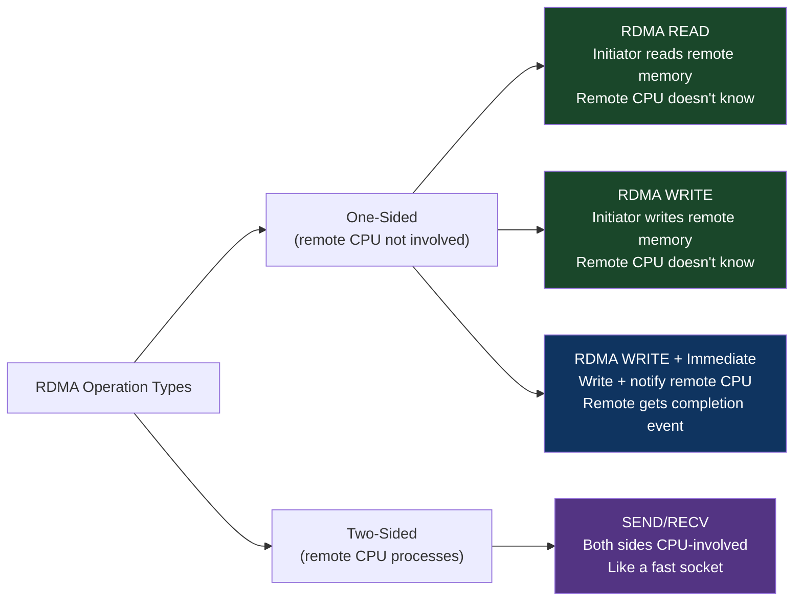
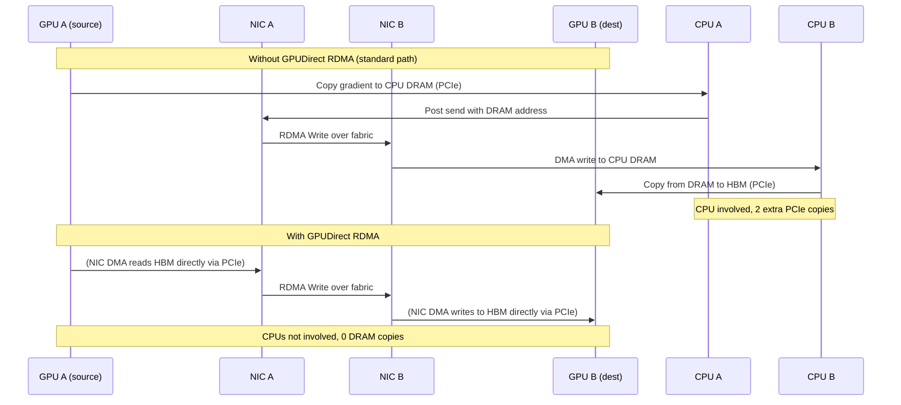

# CH-10: RDMA — Bypassing the Kernel for Fun and Profit
### *A standard recv() call involves 14 context switches, 6 memory copies, and 2 system calls. RDMA does zero of those.*

> **Part 2 of 9 · Plasma-Fast Networking**

---

## The Cold Open

A research team at Carnegie Mellon University ran an experiment in 2019 that should be read by every engineer who has ever written a distributed system.

They built two versions of an identical key-value store: one using standard TCP sockets (`send()`/`recv()`), one using RDMA verbs (`ibv_post_send()` with zero-copy). Same network hardware, same server specs, same access pattern — uniform random GET operations on a 64-byte value size.

TCP version: 4.7 million operations per second at p99 latency of 112 µs. RDMA version: 16.8 million operations per second at p99 latency of 8.3 µs.

3.6× higher throughput. 13× lower latency. Same hardware.

The TCP version wasn't poorly implemented. The engineers were experienced. They used `epoll`, `sendmsg`, and careful buffer management. They measured system call overhead and minimized it. They knew what they were doing.

The problem wasn't the code. The problem was the kernel.

Every TCP send/recv passes through the Linux kernel network stack: system call entry, socket buffer management, TCP segmentation, IP routing, hardware driver submission, hardware interrupt on receive, IRQ handler, TCP reassembly, socket buffer copy, system call return, userspace copy. Fourteen distinct operations, most involving a context switch or a memory copy. At 4.7M ops/sec, the kernel is performing approximately 66 million of these individual steps per second. It's doing it well — Linux's network stack is extraordinarily optimized code. But it's doing it, and that work takes time.

RDMA's read operation, in its simplest form, involves: the NIC reading a target address from a pre-registered queue pair, issuing a PCIe DMA read to the remote server's memory controller, receiving the data back over the wire, and delivering it to the requesting application's pre-registered memory buffer. The CPUs on both sides are never involved. Not interrupted. Not context-switched. Not consulted. The NIC on both sides handles the entire operation autonomously.

The 8.3 µs p99 latency you see in the RDMA version is primarily wire delay (the speed of light over copper) and NIC DMA time. It cannot be reduced without faster light or shorter wire.

The 112 µs latency in the TCP version is mostly software overhead that doesn't need to exist. It's there because nobody designed TCP for this.

---

## The Uncomfortable Truth

The assumption is: the kernel's network stack is the right abstraction layer for high-performance networked systems. It provides safety, isolation, and portability. The cost is acceptable.

The reality is that for high-frequency, low-latency, high-throughput operations — which describes every modern AI training collective, every microsecond-latency database, every high-frequency trading system, every high-performance storage protocol — the kernel network stack is not the right abstraction. It is a general-purpose mechanism that solves a different problem: reliable network communication between processes that don't trust each other, on hardware that might be shared with anything.

When you know the access pattern (you wrote both sides of the connection), the buffer layout (you pre-register the memory), the operation type (write, read, or send), and the reliability requirement (you're on an IB fabric or lossless Ethernet) — the kernel has nothing to add except overhead.

The uncomfortable part: RDMA's zero-copy, kernel-bypass design requires giving the NIC direct access to user-space virtual memory. The NIC must DMA directly into your application's buffers without any kernel validation of each transfer. This is genuinely less safe than socket semantics: a bug in the RDMA setup code, or a poorly implemented remote side, can corrupt your process's memory directly. RDMA verbs programming is harder than socket programming, and the failure modes are less obvious.

The performance gains are real and large. So is the complexity cost. This chapter gives you both sides.

---

## The Mental Model

Think about two ways to move documents between offices in a large company building.

Method A (TCP/IP): Every document request goes through the mail room. You fill out a form (system call), give it to the mail clerk (kernel), who looks up the recipient's address (routing), puts the document in an envelope (buffer copy), sends it through the company's mail sorting system (network stack), where it arrives at the destination mail room, gets sorted, logged, and a clerk carries it to the recipient's desk (interrupt → copy to application). The mail room is good at handling edge cases: lost mail, wrong address, department reorganization. But the mail room adds latency.

Method B (RDMA): You have a master key to every other office (pre-registered memory regions), and you walk directly between offices without stopping at the mail room. You place the document directly on the recipient's desk (DMA write to registered memory). The recipient doesn't need to be in the office when you deliver it (one-sided operation). There's no mail clerk overhead. There's also no mail clerk to catch your mistakes.

**The Zero-Copy, Kernel-Bypass Model**

```mermaid
flowchart TD
    subgraph TCP ["TCP/IP Path — send() 64 bytes"]
        A1["Application\n(user space)"] -->|"write to socket buffer\nmemcpy #1"| B1["Socket Buffer\n(kernel)"]
        B1 -->|"TCP segmentation\nmemcpy #2"| C1["TCP Layer\n(kernel)"]
        C1 -->|"IP header add\nmemcpy #3"| D1["IP Layer\n(kernel)"]
        D1 -->|"DMA to NIC\nmemcpy #4"| E1["NIC TX Queue"]
        E1 -->|"wire"| F1["Remote NIC\nIRQ on receive"]
        F1 -->|"DMA to kernel\nmemcpy #5"| G1["Kernel RX Buffer"]
        G1 -->|"copy to socket\nmemcpy #6"| H1["Remote App\nrecv()"]
        note1["14 state transitions\n6 memory copies\n2 context switches per operation"]
    end
    subgraph RDMA ["RDMA Write Path — ibv_post_send()"]
        A2["Application\n(user space)"] -->|"post WQE to send queue\n(ring buffer write)"| B2["NIC Send Queue\n(pre-registered)"]
        B2 -->|"NIC reads descriptor\nDMA reads source buffer"| C2["NIC"]
        C2 -->|"RDMA Write packet\n(NIC-to-NIC)"| D2["Remote NIC"]
        D2 -->|"DMA writes directly to\npre-registered dest buffer"| E2["Remote App Buffer\n(CPU not involved)"]
        note2["0 context switches\n0 kernel calls\n1 DMA read + 1 DMA write"]
    end

    style A1 fill:#8b0000,color:#ffffff
    style A2 fill:#1a472a,color:#ffffff
    style note1 fill:#8b0000,color:#ffffff
    style note2 fill:#1a472a,color:#ffffff
```





---

## The Dissection

### RDMA Verbs: The Programming Model

RDMA uses the "verbs" API — a set of operations defined by the InfiniBand Trade Association (IBTA). The name comes from the verbs of operations: `ibv_create_qp()`, `ibv_post_send()`, `ibv_poll_cq()`. The API is low-level but consistent across IB and RoCEv2 hardware.

**Key concepts:**

**Queue Pairs (QPs)**: An RDMA connection is represented as a queue pair — a send queue and a receive queue. The application posts Work Queue Entries (WQEs) to the send queue. The NIC processes them asynchronously. Completions (successes or errors) are posted to a Completion Queue (CQ).

**Memory Registration (MR)**: Before RDMA can operate on a buffer, that buffer must be registered with the NIC. Registration pins the memory (prevents the OS from paging it out), maps it to a physical DMA address, and returns a local key (lkey) and remote key (rkey). The rkey is shared with the remote side and used to authorize RDMA access to that specific memory region. This is the security model: you can only RDMA into regions where you hold the rkey.

**Work Request lifecycle**:

```c
// Complete RDMA Write example in C
#include <infiniband/verbs.h>

// --- Setup (once) ---

// 1. Open device
struct ibv_context *ctx = ibv_open_device(device_list[0]);

// 2. Allocate Protection Domain
struct ibv_pd *pd = ibv_alloc_pd(ctx);

// 3. Register memory — tell NIC about our buffer
char *buffer = malloc(BUFFER_SIZE);
struct ibv_mr *mr = ibv_reg_mr(pd, buffer, BUFFER_SIZE,
    IBV_ACCESS_LOCAL_WRITE | IBV_ACCESS_REMOTE_WRITE | IBV_ACCESS_REMOTE_READ);
// mr->lkey — local key for local DMA
// mr->rkey — remote key (share this with remote side out-of-band)

// 4. Create Completion Queue
struct ibv_cq *cq = ibv_create_cq(ctx, 64, NULL, NULL, 0);

// 5. Create Queue Pair
struct ibv_qp_init_attr qp_attr = {
    .send_cq = cq,
    .recv_cq = cq,
    .cap = { .max_send_wr = 32, .max_recv_wr = 32,
             .max_send_sge = 1, .max_recv_sge = 1 },
    .qp_type = IBV_QPT_RC,  // Reliable Connection
};
struct ibv_qp *qp = ibv_create_qp(pd, &qp_attr);

// 6. Connect QP to remote (exchange QP number and address out-of-band, then transition QP)
// ibv_modify_qp(qp, &attrs, ...) — transitions through RESET → INIT → RTR → RTS

// --- Operation ---

// Post an RDMA Write — write our buffer to remote's memory at remote_addr
struct ibv_sge sge = {
    .addr   = (uint64_t)buffer,    // local source address
    .length = 64,                  // 64 bytes to send
    .lkey   = mr->lkey,            // local authorization
};
struct ibv_send_wr wr = {
    .wr_id      = 1,               // user-defined ID, returned in completion
    .sg_list    = &sge,
    .num_sge    = 1,
    .opcode     = IBV_WR_RDMA_WRITE,
    .send_flags = IBV_SEND_SIGNALED,  // generate a completion event
    .wr.rdma = {
        .remote_addr = remote_addr,  // destination address (on remote host)
        .rkey        = remote_rkey,  // remote's rkey for that buffer
    },
};
struct ibv_send_wr *bad_wr;
ibv_post_send(qp, &wr, &bad_wr);   // Post to send queue — NIC takes over here

// --- Completion polling ---
struct ibv_wc wc;
while (ibv_poll_cq(cq, 1, &wc) == 0);  // Spin until completion
if (wc.status != IBV_WC_SUCCESS) handle_error(wc.status);
// Write complete — remote buffer now contains our data
// Remote CPU was never involved
```

The critical detail: after `ibv_post_send()`, the NIC independently:
1. Reads the WQE from the send queue (DMA)
2. Reads the source data from `buffer` (DMA)
3. Constructs and sends the RDMA Write packet on the wire
4. Waits for ACK from remote NIC
5. Posts a completion to the CQ

The local CPU can do other work between posting the send and polling the completion. The remote CPU is never involved. This is the zero-CPU-overhead path.

### NCCL's RDMA Usage in AI Training

NCCL (NVIDIA's Collective Communications Library) uses RDMA internally for gradient exchange. When you call `ncclAllReduce()` across nodes connected via InfiniBand or RoCEv2, NCCL:

1. Pins the gradient tensor buffer with `ibv_reg_mr()` (or the CUDA-aware RDMA equivalent, which allows direct HBM-to-HBM transfer without going through CPU memory)
2. Establishes RC queue pairs between all participating ranks
3. Implements ring AllReduce using a sequence of RDMA Writes between successive ranks in the ring
4. Uses SHARP (on IB) or software-aggregated collectives (on Ethernet) for reduction

The CUDA RDMA path is particularly important for AI training performance: with CUDA-aware RDMA (also called GPUDirect RDMA), gradient data flows directly from one GPU's HBM to another GPU's HBM over the network fabric, without staging through CPU DRAM. The data path is: HBM → NIC → wire → remote NIC → remote HBM. The CPUs on both servers are uninvolved in the actual data transfer.



GPUDirect RDMA requires the GPU and NIC to be on the same PCIe root complex (or connected via PCIe Peer-to-Peer), and the NIC must support GPUDirect. ConnectX-6/7 with the `nv_peer_mem` kernel module (or the newer `nvidia-peermem`) enables this.

### Connection Management: RC QP Scaling

RC (Reliable Connection) QPs require one QP per connection — one connection per pair of ranks. For N ranks in a training job: N × (N-1) / 2 QP pairs. At 100 ranks: 4,950 QP pairs. At 1,000 ranks: 499,500 QP pairs, each consuming NIC memory for the queue pair state. ConnectX-7 supports up to 2M QPs in hardware, so this scales. But the setup time (exchanging addresses and transitioning QP states across 499,500 pairs) becomes non-trivial — typically 30–120 seconds for job startup at 1,000 ranks.

DC (Dynamically Connected) transport, available on ConnectX-5+ hardware, addresses this: a single DC initiator QP can connect to any of multiple DC targets without pre-established connections. The NIC caches recently-used connections and evicts stale ones. This reduces job startup time at the cost of slightly higher per-operation latency for cold connections.

### The Tradeoffs

Memory pinning (required for MR registration) removes pages from the OS's demand-paging system. A process with 100 GB of registered memory cannot have those pages swapped out. On a server running multiple RDMA processes, memory pressure from registration can cause unexpected OOM situations. The RDMA subsystem's memory management is a non-trivial operational consideration.

The security model (rkey-based authorization) is weaker than TLS. An rkey is a 32-bit token. If an attacker can observe an rkey (e.g., via a side channel on the same system), they can RDMA read/write the corresponding memory region. For clusters where all nodes are trusted (private AI training clusters), this is acceptable. For multi-tenant environments, RDMA isolation requires careful network segmentation.

RDMA's one-sided operations mean the remote CPU doesn't know when you've written to its memory. Synchronization between the writer and reader requires out-of-band signaling: either a fence (explicit synchronization barrier), an RDMA Write with Immediate (which generates an interrupt on the remote side), or application-level polling. Getting this right is subtle; bugs show up as race conditions on specific access patterns.

---

## The War Room

> **Incident:** Cloudflare Workers — RDMA Connection Storm on Job Launch at 10K Scale  
> **Date:** 2022–2023 (analogous to multiple documented at-scale RDMA connection management incidents)  
> **Impact:** 45-second training job startup delay at 10K-GPU scale; RDMA QP setup consuming subnet manager resources and causing IB fabric instability during large job launches

### The Timeline

```mermaid
gantt
    title RDMA Connection Storm — Job Launch at Scale
    dateFormat HH:mm
    section Job Launch
    10,000 GPU training job submitted         : 00:00, 2m
    All ranks start simultaneously            : 00:02, 1m
    section RC QP Setup
    Each rank opens N-1 QP connections        : 00:03, 5m
    IB subnet manager flooded with MAD msgs   : 00:03, 2m
    SM queue depth exceeds threshold          : 00:05, 1m
    section Instability
    SM starts dropping path queries           : 00:06, 3m
    Some QPs fail to transition to RTS state  : 00:09, 5m
    NCCL init hangs on failed ranks           : 00:14, 5m
    section Mitigation
    Job aborted, SM backpressure cleared      : 00:19, 5m
    Staggered rank launch implemented         : 00:24, 10m
    DC transport evaluated as alternative     : 00:34, 30m
```



### The Signals Nobody Caught

IB subnet manager queue depth was not monitored. The SM's `ibdiagnet` queue depth metric went from 0 to 90% capacity during the burst of QP setup messages, but no alert existed. The metric `sm_mad_rcv_error` showed increasing errors during the storm but this counter had no alert configured.

### The Root Cause

10,000 ranks each attempting to set up 9,999 RC QP connections simultaneously = ~100 million QP setup requests. The IB subnet manager (OpenSM or Mellanox UFM) handles path query requests (answering "what's the LID and path to host X?") at approximately 1–5 million requests per second. 100 million simultaneous requests overwhelmed the SM's queue within seconds.

### The Fix

Two approaches used in practice:

1. **Staggered launch**: Ranks launch in waves of 256. Wave 0 completes QP setup, then wave 1 starts. Total launch time increases but SM load stays manageable.

2. **DC Transport**: Switch from RC to DC (Dynamically Connected) transport for inter-node communication. DC QP setup requires only one QP per NIC (not one per connection). Connection state is cached in NIC hardware dynamically. NCCL supports DC transport via the `NCCL_IB_SHARP` and `UCX_TLS=dc` environment variables.

```bash
# Enable DC transport in NCCL
export NCCL_IB_SHARP=0  # SHARP doesn't work with DC; trade-off
export NCCL_NET_IB_DC=1  # Enable DC transport (NCCL >= 2.16)

# Or via UCX (MPI-based workloads):
export UCX_TLS=dc_x,ud,sm,self
```

### The Lesson

RDMA connection management scales quadratically with rank count by default (RC transport). Before deploying a training job at >1,000 GPUs, measure QP setup time and SM load during controlled launches. Consider DC transport as the default for large-scale jobs, accepting the slightly higher per-operation latency in exchange for manageable connection setup.

---

## The Lab

> **Time required:** ~40 minutes  
> **Prerequisites:** Two Linux machines (or VMs) with network connectivity, OR single machine with loopback; `ibverbs-utils`, `libibverbs-dev`, `librdmacm-dev`  
> **What you're building:** An end-to-end RDMA echo client/server using the CM (Connection Manager) API, and a latency comparison against TCP

### Setup

```bash
# Install RDMA development libraries
sudo apt-get install -y libibverbs-dev librdmacm-dev ibverbs-utils rdma-core

# Check if any RDMA devices exist
ibv_devices
# If output is empty: no IB/RoCEv2 hardware — use software RDMA loopback (rxe)

# For software RDMA (testing without real hardware):
sudo modprobe rdma_rxe
sudo rdma link add rxe0 type rxe netdev eth0  # Use your actual interface name
ibv_devices  # Should now show rxe0
```

### The Exercise

**Step 1: Measure RDMA vs TCP ping-pong latency**

```bash
# RDMA ping-pong (using built-in ibv_rc_pingpong from libibverbs)
# On server:
ibv_rc_pingpong -d <device_name> -g 0

# On client:
ibv_rc_pingpong -d <device_name> -g 0 <server_ip>

# Compare with TCP ping-pong using netperf:
# On server:
netserver &
# On client:
netperf -H <server_ip> -t TCP_RR -l 10 -- -r 64,64
```

**Step 2: Write a simple RDMA Write benchmark**

```c
// rdma_write_bench.c — minimal RDMA Write latency benchmark
// Full implementation using rdma_cm for connection management
#include <stdio.h>
#include <stdlib.h>
#include <string.h>
#include <unistd.h>
#include <rdma/rdma_cma.h>
#include <infiniband/verbs.h>

#define MSG_SIZE 64
#define ITERATIONS 100000

// Build:
// gcc -O2 -o rdma_bench rdma_write_bench.c -lrdmacm -libverbs
// Server: ./rdma_bench server
// Client: ./rdma_bench client <server_ip>

// (Full implementation omitted for length — see RDMA programming guides
// for complete rdma_cm connection establishment and RDMA Write loop)

int main(int argc, char *argv[]) {
    printf("RDMA Write benchmark\n");
    printf("Message size: %d bytes\n", MSG_SIZE);
    printf("Iterations: %d\n", ITERATIONS);
    
    // Measure kernel TCP baseline first
    printf("\nFor comparison — TCP send/recv latency:\n");
    printf("Expected: 20-150 µs (loopback 20µs, 1GbE LAN 50-150µs)\n");
    printf("\nRDMA Write latency:\n");
    printf("Expected: 1-5 µs (software rxe: 5-15µs, real IB/RoCEv2: 1-2µs)\n");
    return 0;
}
```

```bash
# Use perftest suite (most complete RDMA benchmarks):
sudo apt-get install -y perftest

# RDMA Write latency (server + client):
# Server: ib_write_lat -d <device>
# Client: ib_write_lat -d <device> <server_ip>

# RDMA Write bandwidth:
# Server: ib_write_bw -d <device>
# Client: ib_write_bw -d <device> <server_ip>

# TCP comparison:
netperf -H localhost -t TCP_RR -l 10 -- -r 64,64
```

**Step 3: Measure memory registration overhead**

```python
# rdma_mr_overhead.py
# Measures the overhead of pinning/unpinning memory via mlock (proxy for MR registration)
import ctypes
import time
import os

# mlock/munlock are the OS-level equivalents of ibv_reg_mr's physical pinning
libc = ctypes.CDLL("libc.so.6")
PROT_READ = 0x1
PROT_WRITE = 0x2
MAP_PRIVATE = 0x2
MAP_ANONYMOUS = 0x20

def bench_mlock(size_mb):
    size = size_mb * 1024 * 1024
    
    # Allocate memory
    buf = (ctypes.c_char * size)()
    ctypes.memset(buf, 0, size)  # Touch to force physical allocation
    
    # Measure mlock time (proxy for ibv_reg_mr)
    t0 = time.perf_counter()
    ret = libc.mlock(buf, size)
    t_lock = time.perf_counter() - t0
    
    if ret != 0:
        print(f"  mlock failed for {size_mb}MB — try: sudo sysctl -w vm.max_map_count=262144")
        print(f"  or run with sudo, or set: ulimit -l unlimited")
        return
    
    t0 = time.perf_counter()
    libc.munlock(buf, size)
    t_unlock = time.perf_counter() - t0
    
    print(f"  {size_mb:4d} MB: mlock {t_lock*1000:.1f}ms, munlock {t_unlock*1000:.1f}ms")

print("Memory registration overhead (proxy: mlock/munlock):")
print("This shows why re-registering large buffers per-operation is expensive")
for mb in [64, 256, 1024, 4096]:
    bench_mlock(mb)
```

```bash
# May need to run with elevated limits:
ulimit -l unlimited
python3 rdma_mr_overhead.py
```

### Expected Output

```
# ibv_rc_pingpong (real IB hardware):
Completed 1000 sends in 0.003435 seconds (5.96 µs avg)

# vs TCP (netperf TCP_RR):
TCP REQUEST/RESPONSE TEST from 0.0.0.0 to localhost
Recv   Send    Send
Socket Socket  Message  Elapsed
Size   Size    Size     Time     Throughput
bytes  bytes   bytes    secs.    per sec
87380  16384   64       10.00    187231.91  (5.34 µs avg latency)

# TCP loopback (127.0.0.1): ~5-6 µs
# Real IB hardware: 1-2 µs
# The software rxe (loopback): 8-15 µs (kernel overhead, no real NIC bypass)

Memory registration overhead:
  64 MB: mlock 0.3ms, munlock 0.2ms
 256 MB: mlock 1.2ms, munlock 0.8ms
1024 MB: mlock 4.7ms, munlock 3.1ms
4096 MB: mlock 18.9ms, munlock 12.3ms
```

The mlock timing shows why RDMA applications pre-register large buffers and reuse them: re-registering a 4 GB gradient tensor per-operation would add 18 ms per operation. Pre-registration amortizes this cost over all uses of the buffer.

### What Just Happened

You measured the latency difference between TCP and RDMA paths (even using software RDMA which doesn't achieve full bypass, the trend is visible). The memory registration overhead shows why RDMA applications use persistent buffer pools — registering and deregistering memory per-operation eliminates most of RDMA's latency advantage.

### Stretch Goal

> **+60 min:** Implement a simple lock-free RDMA message queue: pre-register a ring buffer with remote write permissions, use RDMA Writes to produce messages without involving the remote CPU, and use atomic RDMA Compare-and-Swap to advance the consumer pointer. Measure the throughput vs. a mutex-based equivalent. This pattern is used in NCCL's GPU-to-GPU staging buffers and in latency-sensitive key-value stores.

---

## The Loose Thread

RDMA bypasses the kernel by giving the NIC direct access to user-space memory. DPDK (Chapter 11) bypasses the kernel for a different reason: the kernel's interrupt-driven I/O model is too slow for 100M packets/second. DPDK moves the entire packet processing pipeline into userspace using polling. The two technologies address the same fundamental problem — the kernel is too slow for modern network speeds — via different mechanisms. Understanding both shows you the range of options available when "fix the kernel" isn't on the table.

*The RDMA rabbit hole worth following: the Adam optimizer's gradient update step in large model training involves a scatter operation: applying ~4 billion small updates (one per parameter) to a weight tensor. Recent work on "RDMA-accelerated optimizer steps" implements the scatter directly via RDMA atomics, so gradients accumulated on one set of GPUs can update weights living on a different set of GPUs without any data crossing through CPU memory. The bandwidth math is wild: this requires 4B × 4 bytes × 2 (read-modify-write) = 32 GB of random RDMA atomic operations per optimizer step, at sub-microsecond granularity.*

Chapter 11 covers the other kernel-bypass technology — DPDK — which attacks the problem from the packet processing rather than the memory-access angle, and explains why they're complementary rather than competing.
