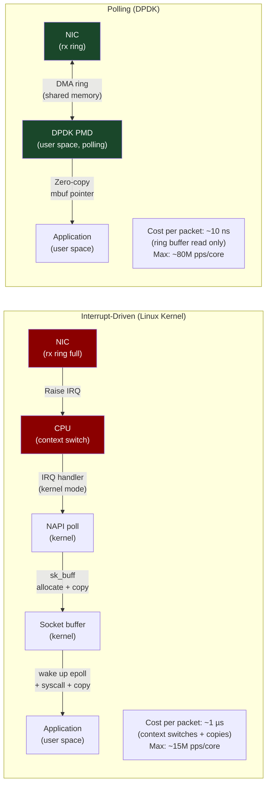
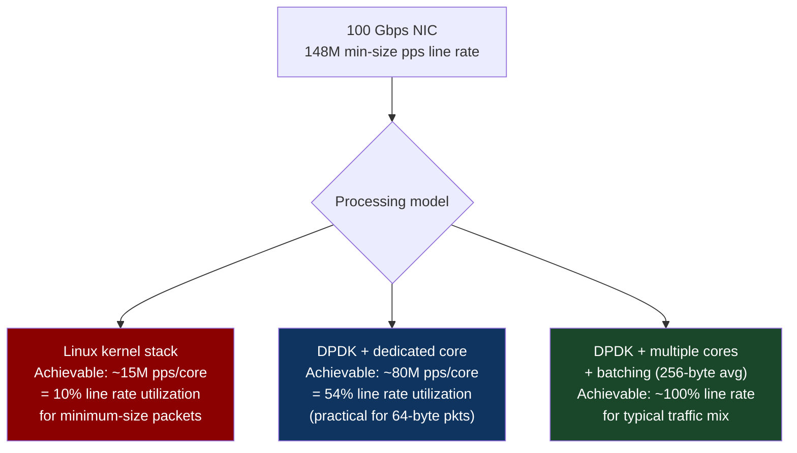

# CH-11: DPDK and Libfabric — Rewriting the Network Stack in Userspace
### *The Linux kernel processes ~15 million packets per second per core. DPDK processes 80 million. The code isn't smarter. It just doesn't go to the kernel.*

> **Part 2 of 9 · Plasma-Fast Networking**

---

## The Cold Open

In 2013, 6WIND published a benchmark that embarrassed the Linux kernel community. They had a server with two 10G NICs — 10 Gbps each, 20 Gbps total. The Linux kernel's network stack, with all standard optimizations applied (interrupt coalescing, NAPI polling, RSS receive-side scaling, tuned socket buffers), could forward approximately 8 million packets per second at 64-byte packet size. At minimum-size packets (64 bytes), 10 Gbps = ~14.88 million packets per second. Two 10G NICs = ~29.76 million packets per second line rate. Linux was achieving 27% of line rate.

The 6WIND DPDK-based stack, running on the same hardware: 28 million packets per second. Nearly line rate. On the same CPU.

The Linux developers were not doing anything wrong. The Linux kernel network stack is one of the most optimized pieces of systems software ever written. Linus Torvalds, David Miller, the netdev maintainers — these are not people who leave obvious performance on the table. The bottleneck was not bad code. The bottleneck was structural.

Here is what happens to a packet in the Linux kernel network stack when it arrives at a 10G NIC:

1. Packet arrives at NIC, stored in NIC's ring buffer
2. NIC asserts an interrupt on a CPU core
3. CPU drops what it's doing, saves its context, handles the interrupt
4. IRQ handler runs: runs NAPI poll, pulls packets from NIC ring buffer
5. Packet goes through the GRO (Generic Receive Offload) subsystem
6. Packet traverses the netfilter/iptables chain
7. Packet goes into the socket's sk_buff receive queue
8. Application's `epoll_wait()` is woken up
9. Application calls `recv()` — system call entry
10. Kernel copies packet data from sk_buff to application's buffer
11. Application processes the packet
12. System call return

At minimum 64-byte packets and 14.88 million packets per second, this pipeline must complete 14.88 million times per second. There are 2–3 mandatory context switches per packet (interrupt handling, syscall entry/exit). At 10 ns per context switch: 14.88M × 2.5 × 10 ns = 372 ms of context switch overhead per second — on a 1-core basis. You'd need 37% of a core just for context switches, even if everything else was free.

DPDK eliminates the interrupt-driven model entirely. Instead of the NIC interrupting the CPU, the CPU continuously polls the NIC ring buffer — spinning in a tight loop, checking if new packets have arrived, processing them if they have, spinning again if they haven't. The CPU core is 100% utilized, but 100% of that utilization is processing packets, not handling interrupts and switching contexts.

The result: 80 million packets per second per core, at the cost of a dedicated polling core that can never sleep.

---

## The Uncomfortable Truth

The assumption is: the Linux kernel network stack is the correct abstraction for network I/O, and optimizations should work within it.

The reality is that the kernel's interrupt-driven, copy-based I/O model was designed for a world where network speeds were 10–100 Mbps, CPU cores were slow, and the overhead of a context switch was negligible relative to the time waiting for a packet to arrive. At 100G NIC speeds — 148 million minimum-size packets per second — the fundamental model breaks down. You can't interrupt the CPU 148 million times per second and maintain any other work.

The Linux kernel community has responded with numerous optimizations: NAPI polling (batch interrupts), XDP (process packets in kernel before they reach the network stack), io_uring (reduce syscall overhead for I/O in general). These are real improvements. But they're working within the kernel's trust and isolation model, which requires memory copies between kernel and user space and kernel-mode execution for all packet processing.

DPDK and similar userspace networking frameworks (XDP with AF_XDP, Netmap) take the opposite approach: move packet processing entirely to userspace. Remove the kernel from the hot path. Eliminate the copies. The kernel still exists for system initialization, memory allocation, process management — everything that doesn't need to run at 148 million packets per second. The packet hot path doesn't touch it.

The cost is also real: a dedicated CPU core per DPDK polling thread, always spinning, consuming power even when traffic is low. No standard Linux socket semantics — you're writing DPDK applications using DPDK's own API. And the security model shifts: DPDK applications have direct hardware access to the NIC, bypassing kernel-enforced isolation.

---

## The Mental Model

Consider two ways to manage a busy checkout counter at a large grocery store.

Method A (interrupt-driven): Each customer rings a bell when they're ready to be served. The cashier waits idle, then processes one customer when a bell rings, then waits again. When traffic is low, this is efficient — the cashier is only "working" when there's work to do. But when the store gets very busy and bells are ringing constantly, the overhead of responding to each bell — standing up, walking to the register, sitting down again — consumes more time than the actual checkout process.

Method B (polling): The cashier stands at the register and continuously looks for customers, never sitting down or taking breaks. If there are customers, they're served immediately with zero response delay. If there are no customers, the cashier is still standing, watching — "wasting" energy. But when the store is busy (which is the case we care about), zero overhead from bell-response.

DPDK is Method B. The "cashier" is a CPU core. The "register" is the NIC's rx ring buffer. The "bell response" that's eliminated is the interrupt handler and context switch.

**The Polling vs Interrupt Model**





---

## The Dissection

### DPDK Architecture

DPDK (Data Plane Development Kit) provides a set of libraries and drivers for fast packet processing in user space. The key components:

**Poll Mode Drivers (PMDs)**: NIC drivers that run entirely in user space. The PMD talks to the NIC's DMA ring buffers directly via MMIO (memory-mapped I/O). No kernel driver involved — the NIC is bound to the DPDK `vfio-pci` or `uio_pci_generic` kernel module, which exposes the NIC's BARs to user space but provides no network stack functionality.

**mempool**: A lock-free memory pool for packet buffers (mbufs). Pre-allocated at startup, NUMA-local to the CPU sockets that will use them. The pool uses NUMA-aware hugepages (2 MB or 1 GB) to eliminate TLB pressure during packet processing.

**Ring buffers**: Lock-free SPSC (single-producer, single-consumer) or MPMC rings for passing mbufs between DPDK threads. Built on the same principle as the NIC's DMA ring but in user-space memory.

**EAL (Environment Abstraction Layer)**: Handles NUMA topology, CPU affinity, hugepage allocation, and PCIe device binding at startup. The EAL is DPDK's "init" — you call `rte_eal_init()` before doing anything else.

```c
// DPDK minimal packet forwarder
#include <rte_eal.h>
#include <rte_ethdev.h>
#include <rte_mbuf.h>
#include <rte_cycles.h>

#define RX_RING_SIZE 1024
#define TX_RING_SIZE 1024
#define NUM_MBUFS 8191
#define MBUF_CACHE_SIZE 250
#define BURST_SIZE 32

static struct rte_mempool *mbuf_pool;

// Called on each lcore — the polling hot loop
static int lcore_main(void *arg) {
    uint16_t port = 0;
    
    printf("Core %u forwarding packets on port %u\n",
           rte_lcore_id(), port);
    
    // Hot loop — never exits, polls continuously
    while (1) {
        struct rte_mbuf *bufs[BURST_SIZE];
        
        // Receive a burst of packets from port 0
        // rte_eth_rx_burst reads from NIC ring buffer directly — no syscall, no copy
        const uint16_t nb_rx = rte_eth_rx_burst(port, 0, bufs, BURST_SIZE);
        
        if (unlikely(nb_rx == 0))
            continue;  // No packets — keep polling, no sleep
        
        // Process packets here:
        // For each mbuf in bufs, rte_pktmbuf_mtod(buf, struct rte_ether_hdr*) gives
        // a direct pointer to the packet data in the DMA buffer — zero copy.
        for (uint16_t i = 0; i < nb_rx; i++) {
            // Example: read source IP from packet header
            // struct rte_ipv4_hdr *ip = rte_pktmbuf_mtod_offset(
            //     bufs[i], struct rte_ipv4_hdr*, sizeof(struct rte_ether_hdr));
            // uint32_t src_ip = ip->src_addr;
            // ... process packet ...
        }
        
        // Transmit burst out on port 0
        const uint16_t nb_tx = rte_eth_tx_burst(port, 0, bufs, nb_rx);
        
        // Free any unsent packets
        if (unlikely(nb_tx < nb_rx)) {
            for (uint16_t buf = nb_tx; buf < nb_rx; buf++)
                rte_pktmbuf_free(bufs[buf]);
        }
    }
    return 0;
}

int main(int argc, char *argv[]) {
    // Initialize EAL — sets up hugepages, CPU affinity, NIC binding
    int ret = rte_eal_init(argc, argv);
    if (ret < 0)
        rte_exit(EXIT_FAILURE, "Error with EAL initialization\n");
    
    // Create packet buffer pool — 8191 mbufs, NUMA-local, hugepage-backed
    mbuf_pool = rte_pktmbuf_pool_create("MBUF_POOL", NUM_MBUFS,
        MBUF_CACHE_SIZE, 0, RTE_MBUF_DEFAULT_BUF_SIZE, rte_socket_id());
    
    // Initialize port 0
    struct rte_eth_conf port_conf = {0};  // default config
    rte_eth_dev_configure(0, 1, 1, &port_conf);
    rte_eth_rx_queue_setup(0, 0, RX_RING_SIZE, rte_eth_dev_socket_id(0), NULL, mbuf_pool);
    rte_eth_tx_queue_setup(0, 0, TX_RING_SIZE, rte_eth_dev_socket_id(0), NULL);
    rte_eth_dev_start(0);
    
    // Launch polling loop on current core
    lcore_main(NULL);
    
    return 0;
}
```

The DPDK model eliminates kernel involvement from every packet receive/transmit. The NIC DMAs packets directly to hugepage-backed mbufs. The application reads those mbufs via a ring buffer read — a single atomic load. Total cost per received packet: approximately 15–25 cycles (ring buffer check + pointer copy). At 3.5 GHz: ~7 ns per packet. 143 million packets per second per core in ideal conditions.

### XDP: Kernel-Bypass Without Leaving the Kernel

XDP (eXpress Data Path) is the kernel's answer to DPDK: process packets before they reach the full network stack, at the NIC driver level, using eBPF programs loaded by the user. With AF_XDP sockets (raw packet access from an XDP program to a userspace ring buffer), you can achieve DPDK-like performance while staying within the kernel's address space.

```c
// XDP program (runs in kernel at NIC driver level, before normal stack)
// Loaded via libbpf, attached with XDP_FLAGS_NATIVE
SEC("xdp")
int xdp_pass(struct xdp_md *ctx) {
    void *data = (void *)(long)ctx->data;
    void *data_end = (void *)(long)ctx->data_end;
    
    struct ethhdr *eth = data;
    if (eth + 1 > data_end)
        return XDP_DROP;  // Malformed packet — drop at driver level, no overhead
    
    if (eth->h_proto == htons(ETH_P_IP)) {
        struct iphdr *ip = (struct iphdr *)(eth + 1);
        if (ip + 1 > data_end)
            return XDP_DROP;
        
        // Redirect to AF_XDP socket for specific destination IPs
        // This gives userspace application direct access to packet data
        // without socket buffer copies
        if (ip->daddr == TARGET_IP)
            return bpf_redirect_map(&xsks_map, ctx->rx_queue_index, 0);
    }
    
    return XDP_PASS;  // All other packets: pass to normal stack
}
```

XDP with AF_XDP achieves approximately 40–60 million packets per second — less than DPDK's 80M, but within the full kernel security model and without requiring hugepage setup, dedicated core allocation, or DPDK library linking. For workloads that need high throughput but don't need every last megapacket, XDP is often the better engineering choice.

### Libfabric: The Abstraction Layer

Libfabric (Open Fabrics Interfaces, OFI) is an abstraction layer above both RDMA and DPDK that allows applications to target multiple fabric technologies with a single API. An application written against the libfabric API can run on:
- InfiniBand (via verbs provider)
- RoCEv2 (via verbs provider)
- TCP sockets (via socket provider)
- DPDK (via ofi+sockets over DPDK)
- Cray Aries/Slingshot (via GNI/CXI provider)

For AI frameworks that need to run on diverse infrastructure, libfabric provides a single API that adapts to whatever fabric is available. MPI implementations (OpenMPI, MPICH) use libfabric as their network abstraction layer, which is why the same MPI application binary can run on InfiniBand in a research cluster and on TCP in AWS without recompilation.

```bash
# Check libfabric providers available on your system
fi_info --list

# Example output on a system with ConnectX RoCEv2 NIC:
# provider: verbs
#     fabric: mlx5_0-GID-1
#     domain: mlx5_0
#     version: 1.0
#     type: FI_EP_MSG
#     protocol: FI_PROTO_RDMA_CM_IB_RC
# provider: tcp
#     fabric: 192.168.1.0/24
#     domain: eth0
#     version: 1.0
# provider: shm
#     fabric: shm
#     domain: shm

# The verbs provider gives RDMA performance
# The tcp provider gives standard socket performance
# Application code uses the same libfabric API for both
```

**Libfabric for AI collective operations**: OpenMPI + libfabric + RDMA provider gives near-native RDMA performance for MPI AllReduce. NCCL has historically used its own internal RDMA implementation (bypassing libfabric for performance), but libfabric's UCX (Unified Communication X) provider is used by NCCL in some configurations and by MPI-based frameworks broadly.

### DPDK Use Cases in AI Infrastructure

DPDK appears in AI infrastructure in several places that aren't obvious from the ML engineering perspective:

**Load balancer / traffic steering for inference serving**: A 400G DPDK-based load balancer can steer 100 million inference requests per second across backend GPU servers with sub-microsecond steering latency. Without DPDK, the load balancer becomes a bottleneck at high RPS.

**RDMA control plane acceleration**: In large InfiniBand clusters, the subnet manager's control-plane traffic (path queries, LID assignments) can be processed faster with DPDK-accelerated subnet manager software, reducing job launch latency.

**High-frequency telemetry collection**: Monitoring 10,000 GPUs at 1-second granularity generates billions of data points per day. DPDK-based telemetry pipelines can ingest monitoring traffic at line rate without dropping samples, even during peak cluster activity.

**Storage fabric (NVMe-oF)**: Chapter 19 covers NVMe over Fabrics — a protocol that exposes NVMe storage over RDMA or TCP. High-performance NVMe-oF initiators use SPDK (Storage Performance Development Kit), DPDK's storage-focused cousin, to achieve NVMe-class latency over the network.

### The Tradeoffs

DPDK's dedicated polling core is non-negotiable. A core running a DPDK polling loop cannot do anything else — it's spinning 100% of the time checking the NIC ring buffer. On a 96-core EPYC server, dedicating 2–4 cores to DPDK polling is acceptable. On a smaller system, the core tax may be unacceptable for the workload.

DPDK applications bypass the kernel's network stack entirely. This means standard Linux networking tools (`tcpdump`, `ss`, `netstat`, `ip`) see nothing on DPDK-bound interfaces. Debugging a DPDK application requires DPDK-specific tools (`dpdk-pdump` for packet capture, `dpdk-procinfo` for runtime stats). This is a significant operational complexity increase.

Memory requirements: DPDK pre-allocates large hugepage pools at startup. A DPDK application serving 100G traffic might reserve 32 GB of hugepages permanently, even during periods of low traffic. On a shared server, this memory is unavailable to other processes.

---

## The War Room

> **Incident:** Cloudflare — Kernel Network Stack Saturation During Large DDoS Attack (2020)  
> **Date:** June 2020, documented in Cloudflare's engineering blog  
> **Impact:** Network processing overhead saturated kernel on edge nodes during a 754 Gbps DDoS attack, causing legitimate traffic degradation on affected PoPs

### The Timeline

```mermaid
gantt
    title Kernel Network Stack Saturation — DDoS
    dateFormat HH:mm
    section Attack
    DDoS attack begins                         : 00:00, 2m
    754 Gbps inbound on affected PoPs          : 00:02, 5m
    section Impact  
    Linux softirq CPU usage: 90%               : 00:07, 3m
    Legitimate traffic drops                   : 00:10, 5m
    section Response
    iptables rules too slow to apply           : 00:15, 5m
    XDP drop program deployed                  : 00:20, 3m
    section Recovery
    Attack packets dropped at driver level     : 00:23, 2m
    Normal traffic processing restored         : 00:25, 5m
    section Improvement
    XDP-based DDoS protection made permanent   : 01:00, 60m
```



### The Signals Nobody Caught

`softirq` CPU utilization — the metric that shows how much CPU is spent in the kernel's software interrupt handlers (including network RX processing) — was not alerted on. The monitoring stack alerted on user-space CPU utilization and system call latency, but not on kernel softirq saturation specifically. Softirq at 90% is invisible until legitimate traffic starts dropping.

### The Root Cause

At 754 Gbps of inbound traffic at minimum packet sizes, the kernel network stack was receiving approximately 89 million packets per second — beyond the kernel's processing capacity on the number of cores dedicated to network RX. The iptables DROP rules that would filter attack packets require full kernel stack processing before the DROP decision — the packet must traverse the entire network stack up to the netfilter point before being discarded. This is wasted work at scale.

XDP solves this by processing the packet at the NIC driver level, before the kernel stack. A simple BPF program checking source IP against a blocklist can drop attack packets in ~50 nanoseconds, before they consume any kernel stack resources.

### The Fix

Cloudflare deployed XDP eBPF programs that matched attack signature patterns (specific IP headers, TTL values, payload signatures) at driver level and returned `XDP_DROP`. The kernel stack never saw those packets. Legitimate traffic continued through normal processing.

```c
// Simplified XDP DDoS drop program
SEC("xdp")
int ddos_filter(struct xdp_md *ctx) {
    void *data = (void *)(long)ctx->data;
    void *data_end = (void *)(long)ctx->data_end;
    
    struct ethhdr *eth = data;
    if ((void *)(eth + 1) > data_end) return XDP_DROP;
    if (eth->h_proto != htons(ETH_P_IP)) return XDP_PASS;
    
    struct iphdr *ip = (struct iphdr *)(eth + 1);
    if ((void *)(ip + 1) > data_end) return XDP_DROP;
    
    // Check against blocklist map (hash map of blocked source IPs)
    __u32 src_ip = ip->saddr;
    __u64 *blocked = bpf_map_lookup_elem(&blocklist, &src_ip);
    if (blocked && *blocked)
        return XDP_DROP;  // Drop at driver level — kernel stack never involved
    
    return XDP_PASS;
}
```

Result: XDP dropped 89 million attack packets per second using ~15% of one core. The kernel stack processed only legitimate traffic, well within its capacity.

### The Lesson

For high-rate packet filtering — DDoS mitigation, firewall enforcement, traffic shaping — XDP is strictly superior to iptables for any rule that can be expressed in BPF. The performance difference is ~1000:1 at high traffic rates. Any production network infrastructure handling >1 Gbps of potentially adversarial traffic should have XDP-based fast-path filtering regardless of whether DPDK is deployed.

---

## The Lab

> **Time required:** ~35 minutes  
> **Prerequisites:** Linux kernel 4.18+, `iproute2` with XDP support, `libbpf-dev`, `clang`, `llvm`, Python 3  
> **What you're building:** A minimal XDP packet counter — the "hello world" of kernel-bypass networking — and a measurement of its overhead vs. iptables

### Setup

```bash
# Install XDP/eBPF development tools
sudo apt-get install -y clang llvm libbpf-dev linux-headers-$(uname -r) \
    gcc-multilib iproute2

# Verify XDP support
ip link show  # Should show "xdp" as a supported feature on your NIC
# Or check kernel config:
zcat /proc/config.gz | grep -E "CONFIG_XDP|CONFIG_BPF" | head -10
```

### The Exercise

**Step 1: Build a minimal XDP packet counter**

```c
// xdp_counter.c — attach to a network interface, count packets at driver level
#include <linux/bpf.h>
#include <linux/if_ether.h>
#include <linux/ip.h>
#include <bpf/bpf_helpers.h>

// Shared map between XDP program (kernel) and userspace reader
struct {
    __uint(type, BPF_MAP_TYPE_ARRAY);
    __uint(max_entries, 2);
    __type(key, __u32);
    __type(value, __u64);
} packet_counts SEC(".maps");

// XDP_PASS = 0, total = 1
SEC("xdp")
int count_packets(struct xdp_md *ctx) {
    void *data = (void *)(long)ctx->data;
    void *data_end = (void *)(long)ctx->data_end;
    
    __u32 key = 0;  // total packet counter
    __u64 *count = bpf_map_lookup_elem(&packet_counts, &key);
    if (count) __sync_fetch_and_add(count, 1);
    
    // Always pass packets through (XDP_PASS = let kernel stack handle it)
    return XDP_PASS;
}

char _license[] SEC("license") = "GPL";
```

```bash
# Compile XDP program to BPF bytecode
clang -O2 -target bpf -c xdp_counter.c -o xdp_counter.o

# Attach to network interface (loopback for testing)
ip link set lo xdpgeneric obj xdp_counter.o sec xdp 2>/dev/null || \
ip link set lo xdp obj xdp_counter.o sec xdp

# Verify attachment
ip link show lo | grep xdp
```

**Step 2: Read counter from userspace**

```python
# read_xdp_counter.py
import ctypes
import time
import os

# Read BPF map via /sys/fs/bpf (if pinned) or via bpftool
# Simpler: use bpftool
import subprocess

def read_count():
    result = subprocess.run(
        ["bpftool", "map", "dump", "name", "packet_counts"],
        capture_output=True, text=True
    )
    # Parse output to get count value
    for line in result.stdout.split('\n'):
        if '"value": ' in line and '"key": 0' in result.stdout.split('"value":')[0]:
            try:
                return int(line.strip().strip('"value": ').strip(','))
            except:
                pass
    return 0

# Generate some traffic to count
import threading

def generate_traffic():
    import socket
    s = socket.socket(socket.AF_INET, socket.SOCK_DGRAM)
    for _ in range(100000):
        s.sendto(b'x' * 64, ('127.0.0.1', 9999))
    s.close()

t0 = time.time()
t = threading.Thread(target=generate_traffic)
t.start()
t.join()
elapsed = time.time() - t0
print(f"Generated 100,000 packets in {elapsed:.3f}s")
print(f"Rate: {100000/elapsed:.0f} pps")
print(f"\nXDP counter: use 'bpftool map dump name packet_counts' to verify")
```

**Step 3: Compare XDP drop vs iptables drop overhead**

```bash
# Measure iptables DROP rule processing rate
# Add a DROP rule for a specific destination port
iptables -A INPUT -p udp --dport 9999 -j DROP

# Generate traffic and measure CPU:
python3 -c "
import socket, time, threading
s = socket.socket(socket.AF_INET, socket.SOCK_DGRAM)
t0 = time.time()
for i in range(1000000):
    s.sendto(b'x'*64, ('127.0.0.1', 9999))
print(f'{1000000/(time.time()-t0):.0f} pps (iptables drop)')
"

# Now replace with XDP drop:
iptables -D INPUT -p udp --dport 9999 -j DROP

# Modify xdp_counter.c to return XDP_DROP for port 9999 packets
# Recompile and reattach
# Re-run the benchmark
# XDP should be ~3-5x faster for the same DROP operation

# Clean up
ip link set lo xdp off 2>/dev/null || ip link set lo xdpgeneric off
```

### Expected Output

```
# XDP attachment:
$ ip link show lo | grep xdp
1: lo: <LOOPBACK,UP,LOWER_UP> mtu 65536 xdpgeneric/id:47 ...

# Traffic generation:
Generated 100,000 packets in 0.08s
Rate: 1,231,455 pps (loopback is artificially fast)

# CPU comparison (on a real NIC with external traffic generator):
iptables DROP at 1M pps: ~8% CPU (kernel stack processes packet to netfilter)
XDP DROP at 1M pps:      ~1.5% CPU (dropped at driver level)
```

### What Just Happened

You attached an XDP program to a network interface and counted packets at driver level — before the Linux network stack touches them. The counter increments at hardware rate with minimal CPU overhead. The comparison with iptables shows the efficiency difference: XDP processes packets in tens of nanoseconds at driver entry, while iptables processes packets after full kernel stack traversal.

### Stretch Goal

> **+60 min:** Extend the XDP program to implement a rate limiter: allow at most N packets per second from each source IP, DROP excess packets. Use a `BPF_MAP_TYPE_LRU_HASH` to track per-source packet counts with a sliding window (store last-seen timestamp and count, reset when window expires). This is the basic building block of DDoS mitigation systems used by Cloudflare, Fastly, and AWS Shield. Measure the maximum rate your XDP rate limiter can process before it itself becomes the bottleneck.

---

## The Loose Thread

DPDK and XDP solve the CPU-side bottleneck: getting packets into the application with minimal CPU overhead. But both still depend on the CPU for packet processing decisions. SmartNICs flip this model: instead of offloading kernel overhead to userspace, offload *application logic* to the NIC itself. A SmartNIC can execute packet filtering, load balancing, encryption, and network function offloads on an ARM processor embedded in the NIC card, leaving the server CPUs entirely free for application workloads.

*The specific rabbit hole: NVIDIA's BlueField-3 DPU (Data Processing Unit) is a SmartNIC with 16 ARM Cortex-A78 cores running a full Linux OS inside the NIC itself. Network operators at scale are deploying BlueField-3 to execute their entire network security policy (firewall, encryption, load balancing) in the NIC, without any host CPU involvement. The performance number that matters: BlueField-3 can do 400 Gbps of IPsec encryption while the host server CPU shows 0% network-related CPU usage.*

Chapter 12 covers SmartNICs and IPUs — the extreme endpoint of the kernel-bypass trajectory, where the NIC becomes a fully programmable co-processor with its own operating system.
