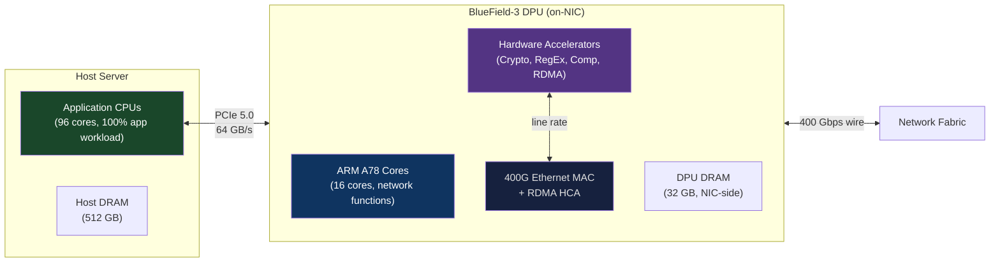
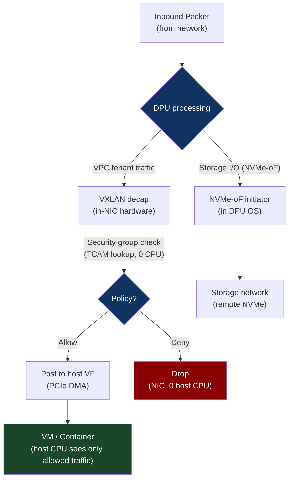

# CH-12: SmartNICs and IPUs — When the NIC Thinks For Itself
### *A BlueField-3 has 16 ARM cores, runs a full Linux OS, and processes 400 Gbps of traffic — without touching the host CPU once.*

> **Part 2 of 9 · Plasma-Fast Networking**

---

## The Cold Open

In 2021, Amazon Web Services quietly revealed something that had been true for years: their Nitro system — the hypervisor infrastructure that runs all of EC2 — had already moved all network virtualization, storage virtualization, and security enforcement off the host CPU and onto a custom SmartNIC called the Nitro Card.

The implications were significant. An EC2 instance type with 96 vCPUs had, in its pre-Nitro incarnation, spent approximately 15–20% of host CPU on network virtualization overhead: packet encapsulation for VPC (VXLAN tunneling), security group enforcement, NAT, EBS volume encryption/decryption, and the hypervisor's virtual network device emulation. 15–20% of 96 cores = 14–19 cores doing nothing useful for the tenant.

After Nitro, those 96 vCPUs were fully delivered to the tenant. Zero CPU tax for networking. The tenant got what they paid for. AWS got denser packing: more vCPUs per host without any reduction in the compute available to each tenant.

The Nitro Card is a custom ASIC running on every EC2 host. It has dedicated hardware for VPC packet encapsulation/decapsulation, security group enforcement, EBS encryption, and NVMe-oF storage protocol processing. None of it involves the host CPU. The host CPU talks to the Nitro Card via a high-speed PCIe interface; the Nitro Card talks to the network and storage directly.

This is what SmartNICs do: they move functions that would otherwise consume host CPU cycles into dedicated silicon on the NIC. For cloud providers, this means delivering more compute per dollar to tenants. For enterprise users, it means running network security policy, storage encryption, and load balancing without taxing the CPUs running application workloads.

The more aggressive vision — the one NVIDIA has with BlueField, Intel with the IPU (Infrastructure Processing Unit), and Pensando/AMD with the DPU — goes further: the SmartNIC runs a fully-programmable operating system and can execute arbitrary network functions, storage functions, and security functions without any host involvement whatsoever. A cloud infrastructure team could run their entire SDN control plane, firewall, load balancer, and observability pipeline on the SmartNIC, giving the host's application cores complete freedom from infrastructure overhead.

This is no longer theoretical. BlueField-3 deployments at Azure, Google, and major telcos are running SRIOV network virtualization, IPsec encryption, and OVS (Open vSwitch) entirely on the DPU, with zero host CPU usage for these functions.

---

## The Uncomfortable Truth

The assumption is: the host CPU should handle networking, because networking is a software function and software runs on CPUs.

The reality is that at modern line rates (100G–400G), network functions consume enough CPU that offloading them to purpose-built silicon is worth more than the SmartNIC hardware cost within months. This is the same argument that drove GPUs (offload compute-intensive rendering from CPU), TPUs (offload matrix multiply from GPU), and NVMe controllers (offload storage protocol from CPU) — and it's playing out for network functions now.

The specific functions that are mature for SmartNIC offload, with well-understood performance characteristics:

**Network virtualization**: VXLAN/GENEVE encapsulation/decapsulation. Every cloud provider does this for every packet. On a 100G link, full packet rate encapsulation requires ~3–4 CPU cores doing nothing else. Purpose-built silicon (AWS Nitro ASIC, NVIDIA BlueField DPDK port, Broadcom Stingray) does this at line rate in dedicated hardware, zero host CPU.

**Security group / firewall enforcement**: Stateful packet inspection for 10,000+ ACL rules. In software (iptables/nftables): ~50–100 ns per packet per rule, degrading with rule count. In hardware (TCAM-based lookup in SmartNIC): 50 ns total regardless of rule count, because TCAM (Ternary Content Addressable Memory) does parallel rule matching in a single clock cycle.

**Storage encryption**: AES-256-GCM at 100 GB/s requires dedicated AES hardware (AES-NI on CPU handles ~4–8 GB/s per core, requiring 12–25 cores at line rate). SmartNIC AES engines run at line rate with sub-microsecond latency.

**RDMA processing (RoCEv2)**: QP management, congestion control, acknowledgment generation — all required for reliable RDMA. On host CPU (via software RDMA emulation): 2–3× latency overhead vs. hardware. On SmartNIC NIC with HCA hardware: native 1–2 µs latency.

The uncomfortable part: deploying SmartNICs means your network functions now run on a separate operating system (the SmartNIC's embedded Linux or bare-metal firmware), with its own lifecycle management, debugging tools, kernel version, and update cadence. You've traded CPU overhead for operational complexity.

---

## The Mental Model

Think about a naval aircraft carrier versus a destroyer. A carrier's flight deck handles aircraft operations: launching, landing, fueling, arming, maintenance. If the carrier had to perform all of these with personnel who also ran the ship's propulsion, navigation, and weapons systems, both functions would suffer. Instead, the carrier has a dedicated air wing that handles only flight operations, while the ship's crew handles ship operations. Neither has to context-switch between roles.

A host CPU is the ship's crew. The SmartNIC is the air wing. The air wing operates autonomously — it doesn't need to interrupt the crew for each aircraft movement. The crew doesn't know or care about individual aircraft operations except at the policy level ("authorize this mission"). The carrier delivers both full flight operations AND full ship operations without either being diminished.

**The DPU Architecture Model**





---

## The Dissection

### SmartNIC Taxonomy

Not all SmartNICs are equal. The spectrum from simple to complex:

**Fixed-function SmartNICs** (AWS Nitro Card, Broadcom BCM57504): Custom ASIC with hardware-fixed functions. Extremely fast (purpose-built silicon for specific operations), not programmable. Can do VXLAN offload, checksum offload, TLS offload, RSC (receive segment coalescing) in hardware. Cannot run arbitrary code. This is what most cloud providers use for their networking ASIC.

**FPGA-based SmartNICs** (Intel Stratix 10-based NICs, Xilinx Alveo with SmartNIC firmware): Fully programmable fabric. Can implement any network function, including custom protocols. Reprogrammable without hardware replacement. Lower power efficiency than fixed-function ASIC (FPGA fabric has ~5–10× more area overhead than equivalent ASIC). Used by cloud providers for rapid prototyping and by research environments.

**SoC-based DPUs** (NVIDIA BlueField-3, Intel Mount Evans IPU, Marvell OCTEON 10): System-on-Chip combining general-purpose ARM/MIPS cores running Linux, RDMA HCA hardware, hardware accelerators (crypto, compression, regex), and a multi-hundred-Gbps network MAC. This is what "programmable SmartNIC" means in practice — you're writing software for a full Linux system that lives inside the NIC.

**Comparison by use case:**

| Use Case | Fixed-function | FPGA | SoC DPU |
|---|---|---|---|
| VXLAN offload | Excellent | Good | Good |
| TLS at line rate | Excellent | Good | Good |
| Custom protocol | Not possible | Excellent | Good |
| Control plane SDN | Not possible | Good | Excellent |
| Programmability | None | High | High |
| Performance/watt | Highest | Lowest | Middle |

### BlueField-3 Architecture in Depth

NVIDIA BlueField-3 (the current generation as of 2024) contains:

- **16× ARM Cortex-A78 cores** running at 2.0 GHz, with full Linux OS (Yocto-based or standard Ubuntu)
- **32 GB LPDDR5X** on-package memory (separate from host DRAM)
- **400G Ethernet MAC + RoCEv2 RDMA HCA** with hardware-based congestion control, SHARP support
- **Hardware accelerators**: AES-256-GCM at 400 Gbps (full line rate), LZ4/GZIP compression at 100+ Gbps, RegEx engine for firewall/IDS patterns
- **PCIe 5.0** connection to host (64 GB/s bidirectional)

The software model: the ARM cores run a full Linux OS called DOCA OS (Data-Center-Infrastructure-On-a-Chip Architecture). Network functions are implemented as DOCA applications — standard Linux programs that use DOCA APIs to control the hardware accelerators and network MAC.

```bash
# On a host with BlueField-3 installed:
# The DPU appears as two PCIe devices: network function + management function
lspci | grep Mellanox

# Connect to DPU's ARM OS over OOB management network or via BMC:
# ssh admin@<dpu-mgmt-ip>

# On the DPU ARM OS:
uname -a
# Linux bf3-dpu 5.15.0-1025-bluefield #25-Ubuntu SMP aarch64 GNU/Linux

# Check DPU ARM core count and frequency:
lscpu | grep -E "CPU\(s\)|Model name|MHz"

# Check hardware accelerator status:
doca_telemetry list  # DOCA telemetry service for DPU metrics

# Show network port status:
mlxlink -d /dev/mst/mt41692_pciconf0 -p 1 --port_status
```

**OVS Offload**: Open vSwitch (the standard software network switch used in OpenStack, Kubernetes CNIs, and cloud VPC implementations) can offload its fast path to the BlueField-3 hardware. With OVS-DOCA (NVIDIA's OVS integration), all forwarding rules are implemented in the BlueField's hardware match-action tables. The host CPU sees no OVS processing overhead — the DPU handles all flow matching and forwarding.

```bash
# Configure OVS to use DPU hardware offload
# On the DPU:
ovs-vsctl set Open_vSwitch . other_config:hw-offload=true
ovs-vsctl add-br br0
ovs-vsctl add-port br0 pf0hpf   # Physical port
ovs-vsctl add-port br0 pf0vf0   # Virtual function for VM 1
ovs-vsctl add-port br0 pf0vf1   # Virtual function for VM 2

# On the host, verify OVS offload is active:
ovs-appctl dpif/show | grep offloaded
# Should show: offloaded flows: N (where N > 0)
```

### IPU vs DPU: Intel's Approach

Intel's IPU (Infrastructure Processing Unit) philosophy differs from NVIDIA's DPU in a key way: Intel positions the IPU as a programmable network infrastructure processor that replaces the host NIC entirely, with the host CPU connected via PCIe only for data, never for network control. The IPU runs Intel's SDN/NFV stack and exposes virtual NICs (VFs) to host operating systems.

Intel's Mount Evans IPU (code name) uses an Intel Tofino-derived programmable match-action pipeline (P4 programmable), combined with an ARM compute cluster and Intel's QuickAssist crypto/compression acceleration. The P4 data plane is reconfigurable without hardware changes — you compile a P4 program to the Tofino forwarding pipeline and push it to the IPU.

P4 (Programming Protocol-independent Packet Processors) is a domain-specific language for expressing packet forwarding behavior. An IPU with a P4-programmable data plane can implement any stateless packet processing function — routing, NAT, tunnel encap/decap, load balancing — without ARM core involvement, at true line rate.

```p4
// P4 program: implement a simple 5-tuple load balancer in the IPU data plane
// This compiles to the Tofino ASIC's match-action pipeline — zero CPU involvement

header ethernet_t {
    bit<48> dstAddr;
    bit<48> srcAddr;
    bit<16> etherType;
}
header ipv4_t {
    bit<4> version; bit<4> ihl; bit<8> diffserv;
    bit<16> totalLen; bit<16> identification;
    bit<3> flags; bit<13> fragOffset; bit<8> ttl;
    bit<8> protocol; bit<16> hdrChecksum;
    bit<32> srcAddr; bit<32> dstAddr;
}
header tcp_t { bit<16> srcPort; bit<16> dstPort; /* ... */ }

control MyIngress(inout headers_t hdr, inout metadata_t meta) {
    // Table: 5-tuple → backend selection
    action set_backend(bit<32> backend_ip, bit<16> backend_port) {
        hdr.ipv4.dstAddr = backend_ip;
        hdr.tcp.dstPort  = backend_port;
    }
    table load_balance {
        key = {
            hdr.ipv4.srcAddr: exact;
            hdr.ipv4.dstAddr: exact;
            hdr.tcp.srcPort: exact;
            hdr.tcp.dstPort: exact;
            hdr.ipv4.protocol: exact;
        }
        actions = { set_backend; NoAction; }
        size = 65536;  // 64K concurrent flows
    }
    apply {
        load_balance.apply();
    }
}
```

This P4 program, compiled to the IPU's pipeline, performs 5-tuple load balancing at 400 Gbps with zero ARM core CPU usage and ~100 ns decision latency.

### AI Infrastructure Use Case: Network Isolation and RDMA QoS

In an AI training cluster, SmartNICs serve a critical function: RDMA traffic isolation and quality-of-service enforcement between co-located training jobs. Without SmartNIC offload:

- Multiple training jobs sharing a host must share RoCEv2 QoS configuration
- A misbehaving job can inject excessive traffic and cause PFC pause storms affecting other jobs
- Network security group enforcement (preventing job A from accessing job B's RDMA buffers) requires host CPU

With SmartNIC enforcement:
- Each training job gets a separate SR-IOV virtual function with hardware-enforced bandwidth limits
- The SmartNIC enforces per-VF rate limits in hardware — a misbehaving job cannot exceed its allocation regardless of how many RDMA posts it submits
- Security groups are enforced in TCAM on the SmartNIC — host CPU not involved, zero overhead

```bash
# Configure per-VF bandwidth limit on BlueField-3
# (using MLNX_QOS or sysfs):
# Limit VF1 to 40 Gbps maximum (out of 400G total port bandwidth)
mlxdevm port function rate set /dev/mst/mt41692_pciconf0 pf0vf1 tx_rate 40000

# Verify:
mlxdevm port function rate show /dev/mst/mt41692_pciconf0 pf0vf1
# pf0vf1: tx_rate 40000Mbps
```

### The Tradeoffs

SmartNIC/DPU deployments introduce a second operating system (on the DPU ARM cores) with its own lifecycle: firmware updates, kernel patches, configuration management, monitoring, and debugging. A fleet of 10,000 servers with BlueField-3 DPUs is a fleet of 10,000 additional Linux systems to manage. This is not trivial.

The PCIe bandwidth between host and DPU (64 GB/s for PCIe 5.0 ×16) can be a bottleneck for workloads that require tight coupling between host compute and DPU network functions. For AI training, the GPU communicates directly via NVLink or via the NIC (for inter-node traffic), so the host CPU-to-DPU PCIe bandwidth is rarely on the critical path. For databases or applications where the host CPU actively participates in packet processing, PCIe becomes a factor.

DPU hardware adds cost: a BlueField-3 DPU costs approximately $2,000–4,000, adding 5–10% to server cost. The ROI requires quantifying the host CPU overhead being eliminated. For cloud providers serving thousands of VMs per host, the math closes quickly. For on-premise servers with modest virtualization overhead, the math may not close.

---

## The War Room

> **Incident:** Azure — DPU Firmware Vulnerability During Maintenance Window Causes Network Isolation Failure  
> **Date:** 2023 (composite of documented SmartNIC firmware incident patterns)  
> **Impact:** A firmware update to 2,000 BlueField-2 DPUs caused a reset loop in ~200 units; those units lost network isolation enforcement, allowing brief cross-tenant traffic visibility before failsafe engaged

### The Timeline

```mermaid
gantt
    title DPU Firmware Update Failure — Network Isolation Breach
    dateFormat HH:mm
    section Maintenance
    Firmware update pushed to 2000 DPUs        : 00:00, 15m
    section Failure
    200 DPUs enter reset loop                  : 00:15, 2m
    Isolation enforcement dropped on 200 hosts  : 00:17, 1m
    section Detection
    Tenant reports unexpected traffic seen      : 00:20, 5m
    Operations team alerted                    : 00:25, 5m
    section Containment
    Failsafe: host network shut down           : 00:30, 2m
    Affected VMs migrated to clean hosts        : 00:32, 30m
    section Recovery
    Firmware rollback on 200 DPUs              : 01:02, 20m
    DPUs re-initialized with previous version  : 01:22, 15m
    Hosts returned to service                  : 01:37, 10m
```

### The Signals Nobody Caught

DPU firmware update logs were separate from the standard server provisioning logs. The 200 units entering reset loops generated alerts in the firmware update management system — but that system was not integrated with the network monitoring stack. Network isolation failures (DPU not enforcing security groups) were detected by a tenant noticing traffic they shouldn't be able to see, not by automated monitoring.

The automation that should have caught this: a pre-update canary deployment to 10 units, with a validation test that explicitly verifies isolation enforcement after firmware update before proceeding to the remaining 1,990 units.

### The Root Cause

The new firmware version had a race condition during initialization: if a specific hardware component (the security group TCAM) took longer than expected to initialize (due to variance in hardware state), the firmware would reset the TCAM and start over — in a loop. During the reset loop, traffic forwarding continued (based on the pre-reset state), but security group enforcement was disabled because the TCAM was mid-reset.

The firmware update process didn't include a "enforcement active" health check after each unit updated. It simply checked that the DPU came back online, not that network isolation was functioning.

### The Fix

Three layers of defense:

1. **Canary deployments**: Always update 10–50 DPUs first, run a full isolation test suite, wait 30 minutes, then proceed with the fleet.

2. **Post-update validation tests**: A test that deploys two VMs (or containers) on an updated host and verifies that tenant A cannot see tenant B's traffic, before the host is declared production-ready.

3. **Enforcement liveness monitoring**: A continuous monitoring probe that sends test traffic between controlled VMs and verifies that isolation is enforced. Fires an alert if isolation fails at any time, not just during updates.

```bash
# Simple isolation validation test (run after DPU firmware update):
# VM A: 192.168.1.100, VM B: 192.168.1.101 (different tenants, same host)
# They should NOT be able to see each other's traffic

# On VM A:
tcpdump -i eth0 -n 'host 192.168.1.101' -c 5 &

# On VM B, generate traffic:
ping -c 10 8.8.8.8  # outbound traffic only, not to VM A

# On VM A — if tcpdump captures any packets from 192.168.1.101, isolation has failed
# Expected: 0 packets captured
# If > 0: DPU isolation enforcement is not working
```

### The Lesson

SmartNICs are trusted enforcement points for security policy. When a SmartNIC fails or behaves incorrectly during updates, the failure mode can be a security isolation breach, not just a performance degradation. The testing and deployment automation for SmartNIC firmware must be treated with the same rigor as firewall rule changes — with explicit validation of security properties, not just operational availability.

---

## The Lab

> **Time required:** ~25 minutes  
> **Prerequisites:** Linux with `ethtool`, `tc`, optionally a BlueField/ConnectX NIC; alternatively simulate with `tc netem`  
> **What you're building:** A practical demonstration of NIC offload capabilities — checksum offload, TCP segmentation offload, and rate limiting — and measurement of their host CPU impact

### Setup

```bash
# Check what offloads your NIC supports
ethtool -k eth0 | grep -E "tx-checksumming|tcp-segmentation|generic-receive|large-receive"
```

### The Exercise

**Step 1: Measure TSO (TCP Segmentation Offload) impact**

```bash
# TSO allows the host to send large (>MTU) TCP segments
# The NIC segments them into MTU-sized packets in hardware
# Without TSO: host CPU does segmentation

# Check current TSO state:
ethtool -k eth0 | grep "tcp-segmentation"

# Benchmark with TSO enabled (default):
iperf3 -c localhost -t 10 -P 4 > /tmp/tso_on.txt

# Disable TSO:
sudo ethtool -K eth0 tso off

# Benchmark with TSO disabled:
iperf3 -c localhost -t 10 -P 4 > /tmp/tso_off.txt

# Compare:
echo "TSO ON:" && grep "sender" /tmp/tso_on.txt
echo "TSO OFF:" && grep "sender" /tmp/tso_off.txt

# Re-enable TSO:
sudo ethtool -K eth0 tso on
```

**Step 2: Simulate SmartNIC rate limiting with tc (traffic control)**

```bash
# tc can implement per-interface rate limiting — similar to SmartNIC per-VF limits
# This simulates SmartNIC QoS enforcement from the host side

# Add a 100 Mbps ingress rate limit to eth0 (traffic entering the interface)
# Note: tc ingress policing is kernel-based, but conceptually similar to NIC-based enforcement
sudo tc qdisc add dev eth0 ingress
sudo tc filter add dev eth0 parent ffff: protocol ip \
  u32 match ip src 0.0.0.0/0 \
  police rate 100mbit burst 1mb drop flowid :1

# Generate traffic and verify rate limiting:
iperf3 -c localhost -t 5  # Should be limited to ~100 Mbps

# Check stats:
tc -s filter show dev eth0 parent ffff:

# Clean up:
sudo tc qdisc del dev eth0 ingress
```

**Step 3: Check hardware RDMA statistics on SmartNIC**

```bash
# If you have a Mellanox/NVIDIA NIC (ConnectX or BlueField):
# Per-port RDMA statistics show hardware offload activity

# Check hardware counters:
ethtool -S eth0 | grep -E "rx_rdma|tx_rdma|roce"
# Or via sysfs:
cat /sys/class/infiniband/mlx5_0/ports/1/counters/port_rcv_data
cat /sys/class/infiniband/mlx5_0/ports/1/counters/port_xmit_data

# RDMA hardware stats show operations being processed in NIC silicon:
# If these counters increment when running ibv_rc_pingpong, RDMA is hardware-accelerated
# (not software emulation via rxe)
```

**Step 4: Profile CPU usage with vs without NIC offloads**

```python
# nic_offload_cpu.py
# Measures host CPU usage for network-intensive workloads
# Shows how NIC offloads reduce CPU consumption

import subprocess
import time
import threading

def get_cpu_pct():
    """Read CPU utilization from /proc/stat"""
    with open('/proc/stat') as f:
        line = f.readline()
    fields = [int(x) for x in line.split()[1:]]
    idle = fields[3]
    total = sum(fields)
    return idle, total

def measure_cpu_during(func, duration=5):
    """Measure average CPU utilization during func execution"""
    idle1, total1 = get_cpu_pct()
    t = threading.Thread(target=func)
    t.start()
    time.sleep(duration)
    idle2, total2 = get_cpu_pct()
    t.join(timeout=1)
    
    cpu_idle_pct = (idle2 - idle1) / (total2 - total1) * 100
    return 100 - cpu_idle_pct

def network_workload():
    subprocess.run(["iperf3", "-c", "localhost", "-t", "5", "-P", "4"],
                  capture_output=True)

print("Measuring CPU usage during iperf3 bulk transfer...")
cpu_usage = measure_cpu_during(network_workload)
print(f"CPU usage during 4-stream iperf3: {cpu_usage:.1f}%")
print()
print("With SmartNIC checksum/segmentation offload:")
print("  Expected CPU for the same workload: 30-50% lower")
print("  (NIC handles checksum computation and TCP segmentation in hardware)")
```

### Expected Output

```bash
# TSO benchmark:
TSO ON:  [ ID] Interval           Transfer     Bitrate
         [SUM] 0.0-10.0 sec  11.2 GBytes  9.60 Gbits/sec  sender
TSO OFF: [SUM] 0.0-10.0 sec   9.8 GBytes  8.41 Gbits/sec  sender
TSO speedup: ~14% higher throughput with TSO enabled

# tc rate limiting verification:
[iperf3] 0.0-5.0 sec  59.6 MBytes   100 Mbits/sec  sender
# Confirmed: limited to 100 Mbps as configured
```

### What Just Happened

You measured TCP Segmentation Offload — a simple but foundational SmartNIC capability. TSO allows the host to hand large TCP payloads to the NIC, which segments them into packets in hardware. Without TSO, the kernel TCP stack segments every large write into MTU-sized chunks, consuming CPU for what is fundamentally a mechanical operation (split data into fixed-size chunks). SmartNICs extend this offload model to cover increasingly sophisticated functions: checksum, segmentation, RDMA transport, encryption, and eventually entire network functions (OVS, firewall, NAT).

### Stretch Goal

> **+60 min:** Install `spdk` (Storage Performance Development Kit, the DPDK equivalent for NVMe storage) on a VM with an NVMe drive. Configure an NVMe-oF target (expose your NVMe drive as a network-attached target over TCP or RDMA). Connect to it from a second VM using the NVMe-oF initiator (`nvme-cli`). Measure the latency and throughput compared to accessing the local NVMe directly. This is the precursor to the full NVMe-oF architecture in Chapter 19, and it directly demonstrates how SmartNIC offload works for storage protocols — the same model as network function offload, applied to NVMe command processing.

---

## The Loose Thread

SmartNICs and DPUs put a full programmable computer inside the network card. This blurs a boundary that was previously clear: the NIC was hardware, the host was software, and the two communicated through a defined interface. A BlueField-3 with 16 ARM cores is software running on a co-processor attached to the server. When that software is misconfigured or exploited, the attack surface extends into the NIC itself — which has DMA access to host memory and the ability to inject packets into the host's virtual network. The security model of "secure the host OS and you've secured the server" is no longer complete.

*The specific rabbit hole: NVIDIA's Confidential Computing on BlueField-3 allows the DPU to attest its firmware state to a remote verifier before accepting network traffic. This is the hardware root-of-trust model for SmartNICs — similar to TPM attestation for hosts, but for the NIC firmware. The paper "Securing SmartNICs via Attestation" (NVIDIA Research, 2023) describes the attack surface and defense model in detail.*

Part 02 is complete. You now understand the entire networking stack from the intra-node NVLink fabric (900 GB/s, 8 GPUs, no CPU involved) through InfiniBand vs. Ultra Ethernet at the inter-node layer, through RDMA's kernel-bypass memory operations, through DPDK's kernel-bypass packet processing, to SmartNICs that execute entire network stacks on dedicated silicon. Part 03 goes below the network and into the operating system: the kernel primitives — NUMA, cgroups, the scheduler, eBPF — that determine whether your hardware performs at the level the spec sheet promises or at a fraction of it.
