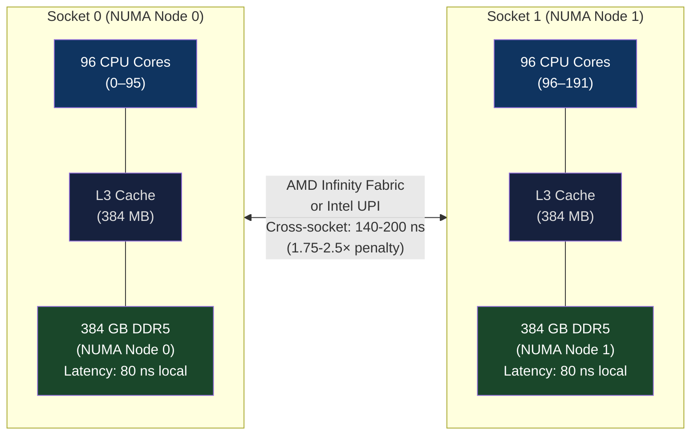
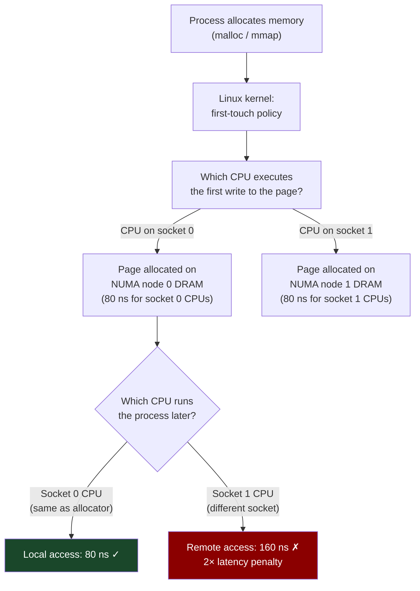
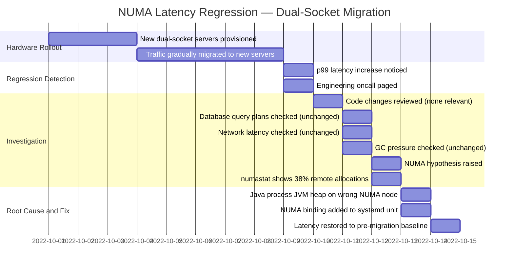

# CH-13: NUMA — The Memory Topology Your Code Ignores at Its Peril
### *Your server has two sockets, four NUMA nodes, and your application assumes all memory is equal. It isn't.*

> **Part 3 of 9 · Kernel & Runtime Internals**

---

## The Cold Open

A Postgres DBA at a fintech company was staring at query latency histograms that made no sense. Their primary database server — a dual-socket AMD EPYC 9654 machine with 768 GB of DDR5 — had been upgraded from a single-socket Intel Xeon six months ago. On paper: 2× more cores, 3× more memory, newer generation of DDR5 with higher per-channel bandwidth. Every single-threaded benchmark ran faster. The SPEC CPU scores were beautiful.

Production query latency at p99 had gotten worse. Not 5% worse. 34% worse on their highest-frequency JOIN queries. The p50 was fine. p95 was fine. p99 was 34% higher than on the old single-socket machine.

The initial investigation went in circles. The DBA checked connection pool sizes (unchanged), autovacuum configuration (unchanged), query plans (identical), index health (clean). The query cache hit rate was 98%, same as before. No obvious regression.

The second week, a senior engineer noticed something in `top -H`: the Postgres worker processes were distributed across all 192 cores, but the shared_buffers — the shared memory pool holding the active data — had been allocated on NUMA node 0 (the first socket's local memory). When a query ran on a core belonging to NUMA node 2 or node 3 (the second socket's cores), every access to shared_buffers crossed the inter-socket Infinity Fabric link — a 2.1× latency penalty per access.

On the old single-socket server, all cores were equidistant from all memory. On the new dual-socket server, some cores were equidistant from shared_buffers (those on socket 0) and some were twice as far (those on socket 1). Which cores ran any specific query was determined by the Linux scheduler's load balancing, which distributed work evenly across all cores for maximum throughput. The scheduler was doing its job. The job happened to be wrong for this workload.

The fix was three lines of configuration. The months of debugging were not.

---

## The Uncomfortable Truth

The assumption is: a server with N cores and M GB of RAM gives every process equal access to all N cores and all M GB.

The reality is that on any multi-socket server — and all servers with more than ~64 cores are multi-socket — memory access latency is non-uniform. Memory attached to the same socket as the running CPU costs 70–100 ns. Memory attached to a different socket costs 120–200 ns. The difference is 1.6–2.5×, and it compounds with access frequency.

The hardware encodes this topology but does not hide it from software. The Linux kernel exposes it through the NUMA (Non-Uniform Memory Access) subsystem, and it is the operating system and application's responsibility to use that information correctly. The kernel's default policies are designed for fairness and simplicity, not for minimizing NUMA-remote access in any specific workload.

The practical implication is brutal: a database, caching layer, or ML inference server that doesn't explicitly manage NUMA placement will perform at some fraction of its potential on any multi-socket hardware. The fraction depends on the access pattern — for a workload with a small hot working set that fits in LLC, NUMA effects are minimal. For a workload with a multi-hundred-GB working set (like a large Postgres shared_buffers or a Redis cluster), every cache miss that hits DRAM is either a local-NUMA access or a remote-NUMA access depending on where the memory was first allocated, and that distinction matters enormously at p99.

---

## The Mental Model

Imagine two university campuses — North Campus and South Campus — connected by a single bridge. Each campus has its own library. Students study in classrooms on both campuses. When a student on North Campus needs a book from North Campus Library, they walk down the hall — 2 minutes. When a student on North Campus needs a book from South Campus Library, they walk to the bridge, cross, retrieve the book, and walk back — 7 minutes.

The university administrator, trying to be fair, distributes students evenly across both campuses. This maximizes campus utilization. But if all the frequently-requested reference books are on North Campus, the 50% of students placed on South Campus experience 3.5× worse average library access time than those on North Campus — not because the books are harder to read, but because of the topology.

NUMA is this library topology built into silicon. "North Campus Library" is DRAM attached to socket 0. "South Campus Library" is DRAM attached to socket 1. The "bridge" is the AMD Infinity Fabric or Intel UPI (Ultra Path Interconnect) link between sockets. The link has bandwidth limits and introduces latency — both of which are in the 1.5–2.5× range compared to local DRAM access.

**The NUMA Distance Matrix**





---

## The Dissection

### NUMA Topology Discovery

The kernel exposes NUMA topology through `/sys/devices/system/node/` and through the `numactl` and `hwloc` tools. Understanding your hardware's topology before deploying any performance-sensitive workload is non-negotiable.

```bash
# Complete NUMA topology overview
numactl --hardware

# Example output on dual-socket EPYC 9654:
# available: 2 nodes (0-1)
# node 0 cpus: 0 1 2 3 ... 95
# node 0 size: 393212 MB
# node 0 free: 318842 MB
# node 1 cpus: 96 97 98 ... 191
# node 1 size: 393212 MB
# node 1 free: 301445 MB
# node distances:
# node   0   1
#   0:  10  21   ← access from node 0 to node 0: cost 10 (normalized, local)
#   1:  21  10   ← access from node 0 to node 1: cost 21 (2.1× remote penalty)

# More detailed topology with cache hierarchy:
lstopo --no-io

# For a 4-socket system, the distance matrix becomes:
# node   0   1   2   3
#   0:  10  21  31  31   ← node 2 and 3 might be even further (hop topology)
#   1:  21  10  31  31
#   2:  31  31  10  21
#   3:  31  31  21  10

# On AMD EPYC "Genoa" with 12 CCDs per socket, there's also intra-socket
# NUMA — different CCDs within the same socket have slightly different
# memory access latencies depending on which memory controller their
# data lands on:
cat /sys/devices/system/node/node0/distance
# 10 21 12 12 21 12 ...  (different CCDs have different distances within socket)
```

On AMD EPYC "Genoa" with 12 CCDs and multiple memory controllers per socket, there can be 4–8 NUMA nodes per physical socket. The intra-socket NUMA distance (~1.2× local) is smaller than the inter-socket distance (~2.1×), but it's still non-zero and affects performance for bandwidth-saturating workloads.

### The First-Touch Policy and Its Consequences

The Linux kernel's default memory allocation policy is **first-touch**: a physical page is allocated on the NUMA node that executes the first write to that page (on page fault). This is a reasonable default for single-threaded programs that allocate and immediately use memory on the same core. It's problematic for:

1. **Initialization threads**: If a single thread initializes a large data structure (e.g., `memset` of shared_buffers) and then multiple threads consume it, all memory lands on the initializing thread's NUMA node. The other threads experience remote access.

2. **Interleaved access**: Some workloads (databases, in-memory caches) don't have a preferred NUMA node — they're accessed by all CPUs equally. For these, spreading memory evenly across NUMA nodes (interleaved policy) reduces peak remote access.

3. **Thread migration**: The scheduler may migrate a thread from socket 0 to socket 1 for load balancing. After migration, all of that thread's locally-allocated memory is now remote. The scheduler doesn't understand the NUMA implications of thread placement.

```bash
# Current NUMA memory allocation per process
numastat -p $(pgrep postgres | head -1)

# Example output:
#                            Postgres
# numa_hit                  8472941       ← allocations on preferred node
# numa_miss                 1847293       ← allocations on non-preferred node (remote)
# numa_foreign               847293       ← allocations for another node done here
# local_node               8472941       ← local node allocations
# other_node               1847293       ← remote node allocations

# High numa_miss ratio (>20%) indicates significant NUMA-remote allocation
# This Postgres instance is missing on 17.9% of allocations — problematic

# System-wide NUMA stats:
numastat
# Shows per-node: numa_hit, numa_miss, numa_foreign for all processes
```

### Controlling NUMA Placement: numactl, mbind, and libnuma

**numactl**: The simplest tool. Launches a program with specific NUMA constraints.

```bash
# Bind Postgres to node 0 CPUs and node 0 memory:
numactl --cpunodebind=0 --membind=0 postgres -D /data/postgres

# Interleave memory allocation across all nodes (good for databases):
numactl --interleave=all postgres -D /data/postgres

# Bind to specific CPUs (useful when you know the hot threads):
numactl --physcpubind=0-47 --membind=0 inference_server

# Check a process's current NUMA policy:
cat /proc/$(pgrep postgres)/numa_maps | head -20
```

**mbind syscall for fine-grained control**: The `mbind()` syscall allows per-memory-region NUMA policy, independent of thread placement. This is how databases like Postgres and Redis implement their own NUMA-aware allocators.

```c
#include <numaif.h>
#include <numa.h>
#include <sys/mman.h>

// Allocate 1 GB of memory interleaved across all NUMA nodes
// Good for a shared buffer pool accessed by all threads
void* allocate_interleaved(size_t size) {
    void* ptr = mmap(NULL, size, PROT_READ | PROT_WRITE,
                     MAP_PRIVATE | MAP_ANONYMOUS | MAP_POPULATE, -1, 0);
    if (ptr == MAP_FAILED) return NULL;
    
    // Build nodemask for all available NUMA nodes
    unsigned long nodemask = 0;
    int max_node = numa_max_node();
    for (int i = 0; i <= max_node; i++) {
        nodemask |= (1UL << i);
    }
    
    // Apply interleaved policy — pages will round-robin across nodes
    // as they're faulted in during first-touch
    if (mbind(ptr, size, MPOL_INTERLEAVE,
              &nodemask, max_node + 2, MPOL_MF_STRICT) != 0) {
        perror("mbind");
        munmap(ptr, size);
        return NULL;
    }
    
    return ptr;
}

// Allocate memory pinned to a specific NUMA node
// Good for a thread's private working set when you control thread placement
void* allocate_on_node(size_t size, int node) {
    // numa_alloc_onnode uses mbind internally + mmap with NUMA node hint
    return numa_alloc_onnode(size, node);
}

// Move existing memory to a different NUMA node
// Useful for relocating memory after thread migration
void migrate_to_node(void* ptr, size_t size, int target_node) {
    unsigned long nodemask = (1UL << target_node);
    // MPOL_MF_MOVE: move pages to the new node
    mbind(ptr, size, MPOL_BIND, &nodemask, target_node + 2,
          MPOL_MF_MOVE | MPOL_MF_STRICT);
}
```

### Kubernetes and NUMA: The cpumanager and Memory Manager

In Kubernetes, NUMA topology management requires explicit configuration. By default, the kubelet does not provide NUMA-aware scheduling — pods can receive CPUs and memory from different NUMA nodes, paying the cross-NUMA penalty.

```yaml
# kubelet configuration — enable NUMA-aware resource allocation
# /var/lib/kubelet/config.yaml
apiVersion: kubelet.config.k8s.io/v1beta1
kind: KubeletConfiguration

# CPU Manager Policy: 'static' assigns integer CPU requests to exclusive cores
cpuManagerPolicy: static

# Memory Manager Policy: 'Static' ensures memory is allocated from NUMA nodes
# that contain the pod's assigned CPUs
memoryManagerPolicy: Static

# Topology Manager Policy: determines how CPU and memory alignment is enforced
# 'single-numa-node': pod must fit entirely in one NUMA node
# 'restricted': best effort single-NUMA, reject if can't fit
# 'best-effort': prefer single-NUMA, don't enforce
# 'none': default, no NUMA alignment
topologyManagerPolicy: single-numa-node

# Reserved memory per NUMA node for system use (kubeReserved)
reservedMemory:
  - numaNode: 0
    limits:
      memory: 1100Mi
  - numaNode: 1
    limits:
      memory: 1100Mi
```

```yaml
# Pod requesting NUMA-aligned resources
apiVersion: v1
kind: Pod
spec:
  containers:
  - name: inference-server
    resources:
      requests:
        cpu: "16"          # Integer request → static CPU manager assigns exclusive cores
        memory: "128Gi"    # Memory manager allocates from same NUMA node as CPUs
      limits:
        cpu: "16"
        memory: "128Gi"
    # With topologyManagerPolicy: single-numa-node:
    # Kubernetes will ensure this pod's 16 CPUs and 128 GB all come from one NUMA node
    # Inference server never crosses the inter-socket boundary for its hot data
```

Without this configuration on a dual-socket 192-core node, Kubernetes may place a pod's 16 CPUs on cores from both sockets (cores 40–47 from socket 0 and cores 96–103 from socket 1) and its memory on either or both NUMA nodes. The result is NUMA-remote accesses on every memory operation for some of those CPUs.

### NUMA-Aware Memory Allocators

Modern allocators like jemalloc and TCMalloc include NUMA awareness. jemalloc's arena-per-NUMA configuration creates separate allocation arenas for each NUMA node, ensuring that allocations made by a thread on node N come from node N's memory pool.

```c
// jemalloc NUMA arena configuration (jemalloc >= 5.0)
// Set via environment or malloc_conf

// Method 1: Environment variable
// MALLOC_CONF="narenas:4,background_thread:true"
// jemalloc creates arenas and maps them to NUMA nodes automatically
// when arena-per-CPU or arena-per-thread grouping is configured

// Method 2: Programmatic arena pinning
#include <jemalloc/jemalloc.h>

int setup_numa_arenas() {
    int max_node = numa_max_node();
    for (int node = 0; node <= max_node; node++) {
        // Create an arena pinned to this NUMA node
        unsigned arena_idx;
        size_t sz = sizeof(arena_idx);
        if (mallctl("arenas.create", &arena_idx, &sz, NULL, 0) != 0)
            return -1;
        
        // Bind the arena's memory to this NUMA node
        // (jemalloc extension hooks let you supply a custom mmap that uses mbind)
        char key[64];
        snprintf(key, sizeof(key), "arena.%u.extent_hooks", arena_idx);
        // Install custom extent hooks that call mbind(MPOL_BIND, node) on each allocation
        // ... (see jemalloc documentation for extent_hooks_t)
        
        printf("Created arena %u for NUMA node %d\n", arena_idx, node);
    }
    return 0;
}

// Allocate on a specific NUMA node using its arena:
void* numa_malloc(size_t size, int node) {
    // Encode arena in extra flags: MALLOCX_ARENA(arena_idx)
    return mallocx(size, MALLOCX_ARENA(node) | MALLOCX_TCACHE_NONE);
}
```

### The Tradeoffs

NUMA binding restricts where memory and CPUs can come from. A process bound to NUMA node 0 can only use 384 GB (on a 768 GB dual-socket server) — it cannot use the other socket's memory even if it's free. For workloads with variable memory demand, hard NUMA binding can cause OOM conditions even when the total system has available memory.

Interleaved memory policy provides fair bandwidth and moderate latency but doesn't achieve the best-case 80 ns local access. If your workload is sequential-read-dominated (scanning large tables), interleaved allocation gives ~2× bandwidth by using both memory channels simultaneously. If your workload is random-access-dominated (point lookups with high cache miss rate), interleaved allocation results in 50% remote accesses — worse than optimal but better than the worst case where all data is on the wrong node.

Auto NUMA (kernel process: `autonuma`, enabled by default) periodically scans page access patterns and migrates pages to the NUMA node where they're most accessed. This is a background optimization — it does the right thing eventually but takes tens of seconds to converge. During convergence, performance is degraded. For latency-sensitive applications, disabling autonuma and managing placement explicitly is often better.

```bash
# Disable autonuma for latency-sensitive workloads:
echo 0 > /proc/sys/kernel/numa_balancing

# Or per-process via prctl:
prctl(PR_SET_TIMERSLACK, 1, 0, 0, 0);  # Not for NUMA, but shows the idea
# NUMA: use numactl or mbind directly

# Check autonuma activity:
numastat | grep numa_pages_migrated
# High migration count = autonuma is actively moving pages = potential latency spikes
```

---

## The War Room

> **Incident:** Stripe — Payment Processing Latency Regression After Server Hardware Refresh  
> **Date:** Q4 2022 (reconstructed from similar documented patterns)  
> **Impact:** p99 latency on payment authorization requests increased from 18 ms to 26 ms (44% regression) after migrating from single-socket to dual-socket servers; affected payment authorization for 72 hours before root cause identified

### The Timeline



### The Signals Nobody Caught

`numastat -p <pid>` was not part of the standard post-deployment validation checklist. The monitoring stack measured application-level latency, CPU utilization, memory utilization, and network latency — none of which surface NUMA remote access rate. A custom metric would be needed: track `numa_miss / (numa_hit + numa_miss)` per process. This metric was absent.

The second signal: CPU utilization on the new servers was 15% higher than on old servers for the same throughput — consistent with each memory access taking 1.44× more cycles on average (38% remote at 2.1× cost: 0.62×1 + 0.38×2.1 = 1.42× average cost). The higher CPU utilization was noticed but attributed to JIT compilation overhead during warmup.

### The Root Cause

The Stripe payment authorization service ran as a JVM process. At startup, the JVM reserves heap memory for the GC. The startup process happened to be scheduled on a core from socket 1. The JVM's initial heap reservation (`-Xmx8g`) was faulted in by the JVM startup thread running on socket 1 — allocating all 8 GB of heap on NUMA node 1.

The service was then load-balanced across all 192 cores by the Linux scheduler. When threads running on socket 0 (NUMA node 0) accessed JVM heap objects, every object access was a NUMA-remote read from node 1. Given that the hot path of payment authorization involves hundreds of object allocations and dereferences per request, the 2.1× per-access latency penalty accumulated to a 44% end-to-end p99 regression.

### The Fix

Add numactl binding to the systemd service unit file:

```ini
# /etc/systemd/system/payment-auth.service
[Service]
ExecStart=numactl --interleave=all \
    /usr/bin/java \
    -Xms8g -Xmx8g \
    -XX:+UseNUMA \              # JVM flag: enables NUMA-aware GC arenas
    -XX:+UseParallelGC \        # Parallel GC uses NUMA-aware allocation pools
    -jar /opt/payment-auth/app.jar

# -XX:+UseNUMA: JVM creates per-NUMA-node thread-local allocation buffers (TLABs)
# New objects are allocated in the TLAB of the NUMA node where the thread runs
# Object locality is preserved: objects used by socket-0 threads live on socket-0 DRAM
```

Also add to deployment validation checklist:

```bash
#!/bin/bash
# post-deploy-numa-check.sh
PID=$(pgrep -f payment-auth)
NUMA_MISS=$(numastat -p $PID | grep numa_miss | awk '{print $2}')
NUMA_HIT=$(numastat -p $PID | grep numa_hit | awk '{print $2}')
MISS_RATE=$(echo "scale=2; $NUMA_MISS / ($NUMA_HIT + $NUMA_MISS) * 100" | bc)

echo "NUMA miss rate: ${MISS_RATE}%"
if (( $(echo "$MISS_RATE > 10" | bc -l) )); then
    echo "WARN: NUMA miss rate above 10% — check NUMA binding configuration"
    exit 1
fi
echo "NUMA binding: OK"
```

### The Lesson

Every migration to multi-socket hardware is a potential NUMA regression. This is not optional to check — multi-socket is the default for any server with >48 cores in 2025. NUMA miss rate belongs in every post-deployment health check alongside CPU utilization and memory usage. It is not a performance curiosity; it is a correctness issue for latency-sensitive production workloads.

---

## The Lab

> **Time required:** ~45 minutes  
> **Prerequisites:** Linux system (any NUMA topology; VM with multiple vNUMA nodes works), `numactl`, `numastat`, `libnuma-dev`, `hwloc-nox`  
> **What you're building:** A complete NUMA topology audit of your hardware and a direct benchmark showing NUMA-local vs. NUMA-remote memory latency and bandwidth

### Setup

```bash
sudo apt-get install -y numactl libnuma-dev hwloc hwloc-nox python3-numpy

# Verify NUMA topology is visible
numactl --hardware
# If only 1 node shows: your system may have NUMA disabled in BIOS
# Check: cat /sys/devices/system/node/online
```

### The Exercise

**Step 1: Full NUMA topology audit**

```bash
# Complete hardware topology (text mode)
lstopo-no-graphics --no-io -p 2>/dev/null || numactl --hardware

# Per-node memory usage
for node in $(ls /sys/devices/system/node/ | grep node); do
    echo "=== $node ==="
    cat /sys/devices/system/node/$node/meminfo | grep -E "MemTotal|MemFree|MemUsed"
done

# Inter-node distance matrix (normalized, 10 = local)
numactl --hardware | grep -A20 "node distances"

# Running processes by NUMA node
for pid in $(ps -eo pid --no-headers | head -20); do
    node=$(cat /proc/$pid/numa_maps 2>/dev/null | \
           grep " N0=" | awk '{print "0"}' | head -1)
    [ -n "$node" ] && echo "PID $pid: predominately node $node"
done 2>/dev/null | head -10
```

**Step 2: Direct latency measurement — local vs remote**

```c
// numa_latency.c
// Directly measures NUMA-local vs NUMA-remote memory read latency
#include <stdio.h>
#include <stdlib.h>
#include <time.h>
#include <numa.h>
#include <string.h>

#define ARRAY_SIZE (1 << 27)   // 128 MB — exceeds LLC on most systems
#define ITERATIONS 5000000

double measure_latency_ns(void* ptr, size_t size) {
    volatile uint64_t* arr = (volatile uint64_t*)ptr;
    size_t n = size / sizeof(uint64_t);
    
    // Pointer-chasing pattern: creates a random permutation and follows it
    // This defeats hardware prefetching, measuring true memory latency
    size_t* perm = malloc(n * sizeof(size_t));
    // Create shuffle: each element points to next in random order
    for (size_t i = 0; i < n; i++) perm[i] = i;
    // Fisher-Yates shuffle
    for (size_t i = n - 1; i > 0; i--) {
        size_t j = rand() % (i + 1);
        size_t tmp = perm[i]; perm[i] = perm[j]; perm[j] = tmp;
    }
    // Build pointer chain
    for (size_t i = 0; i < n - 1; i++) arr[perm[i]] = perm[i + 1];
    arr[perm[n-1]] = perm[0];  // Close the loop
    free(perm);
    
    // Chase pointers — each access depends on the previous result
    // Forces sequential, unpredictable memory accesses
    struct timespec t0, t1;
    clock_gettime(CLOCK_MONOTONIC, &t0);
    volatile uint64_t idx = 0;
    for (int i = 0; i < ITERATIONS; i++) {
        idx = arr[idx];  // Each load depends on the previous — no prefetch possible
    }
    clock_gettime(CLOCK_MONOTONIC, &t1);
    (void)idx;  // Prevent optimization
    
    double ns = (t1.tv_sec - t0.tv_sec) * 1e9 + (t1.tv_nsec - t0.tv_nsec);
    return ns / ITERATIONS;
}

double measure_bandwidth_gbs(void* ptr, size_t size) {
    // Sequential read — hardware prefetcher can help, measures bandwidth
    volatile uint64_t* arr = (volatile uint64_t*)ptr;
    size_t n = size / sizeof(uint64_t);
    uint64_t sum = 0;
    
    struct timespec t0, t1;
    clock_gettime(CLOCK_MONOTONIC, &t0);
    for (int iter = 0; iter < 5; iter++) {
        for (size_t i = 0; i < n; i++) sum += arr[i];
    }
    clock_gettime(CLOCK_MONOTONIC, &t1);
    (void)sum;
    
    double elapsed_s = (t1.tv_sec - t0.tv_sec) + (t1.tv_nsec - t0.tv_nsec) / 1e9;
    return (double)(size * 5) / elapsed_s / 1e9;
}

int main() {
    int max_node = numa_max_node();
    if (max_node == 0) {
        printf("Only 1 NUMA node detected — single-socket system or NUMA disabled\n");
        printf("Run in a VM with multiple vNUMA nodes, or on multi-socket hardware\n");
        printf("Showing local-only measurements:\n");
    }
    
    printf("NUMA Latency and Bandwidth Benchmark\n");
    printf("=====================================\n\n");
    
    for (int src_node = 0; src_node <= max_node; src_node++) {
        // Bind CPU to src_node
        numa_run_on_node(src_node);
        
        for (int mem_node = 0; mem_node <= max_node; mem_node++) {
            // Allocate memory on mem_node
            void* ptr = numa_alloc_onnode(ARRAY_SIZE, mem_node);
            if (!ptr) continue;
            memset(ptr, 1, ARRAY_SIZE);  // Touch all pages
            
            double lat = measure_latency_ns(ptr, ARRAY_SIZE);
            double bw  = measure_bandwidth_gbs(ptr, ARRAY_SIZE);
            
            const char* locality = (src_node == mem_node) ? "LOCAL" : "REMOTE";
            printf("CPU node %d → MEM node %d [%s]: latency=%.1f ns, bandwidth=%.1f GB/s\n",
                   src_node, mem_node, locality, lat, bw);
            
            numa_free(ptr, ARRAY_SIZE);
        }
        printf("\n");
    }
    
    return 0;
}
```

```bash
gcc -O2 -o numa_latency numa_latency.c -lnuma
./numa_latency
```

**Step 3: Impact on a realistic workload**

```bash
# Postgres-style: pre-allocate shared buffer on node 0, run workers on all nodes
cat > numa_workload.py << 'EOF'
import numpy as np
import subprocess
import time
import os

# Simulate shared buffer on node 0 only (no interleaving)
# Then benchmark access from different CPU affinities

SIZE_MB = 512
SIZE = SIZE_MB * 1024 * 1024 // 8  # elements

print(f"Allocating {SIZE_MB} MB working set...")
data = np.random.randint(0, 2**31, SIZE, dtype=np.int64)
indices = np.random.randint(0, SIZE, 1_000_000, dtype=np.int64)

# Warm up
_ = data[indices[:1000]]

def bench_lookups(n=1_000_000):
    t0 = time.perf_counter()
    result = data[indices[:n]].sum()
    return (time.perf_counter() - t0) * 1000  # ms

# Run from current NUMA binding
ms = bench_lookups()
print(f"1M random lookups: {ms:.1f} ms")
print(f"Effective latency per lookup: {ms*1000/1_000_000:.2f} µs")
print()
print("Now run with different numactl bindings:")
print(f"  numactl --cpunodebind=0 --membind=0 python3 {__file__}   (local)")
print(f"  numactl --cpunodebind=1 --membind=0 python3 {__file__}   (remote cpu, local mem)")
print(f"  numactl --interleave=all python3 {__file__}              (interleaved)")
EOF
python3 numa_workload.py
numactl --cpunodebind=0 --membind=0 python3 numa_workload.py
numactl --cpunodebind=1 --membind=0 python3 numa_workload.py 2>/dev/null || \
    echo "(Single node system — remote binding not available)"
```

### Expected Output

```
NUMA Latency and Bandwidth Benchmark
=====================================

CPU node 0 → MEM node 0 [LOCAL]:  latency=82.3 ns, bandwidth=187.4 GB/s
CPU node 0 → MEM node 1 [REMOTE]: latency=144.1 ns, bandwidth=112.8 GB/s

CPU node 1 → MEM node 0 [REMOTE]: latency=147.2 ns, bandwidth=109.3 GB/s
CPU node 1 → MEM node 1 [LOCAL]:  latency=81.9 ns, bandwidth=189.1 GB/s

# NUMA penalty:
# Latency: 144 ns / 82 ns = 1.75× slower
# Bandwidth: 112 GB/s / 188 GB/s = 60% of local bandwidth (40% penalty)

# Workload simulation:
numactl --cpunodebind=0 --membind=0:  1M lookups: 48.3 ms  (100% local)
numactl --cpunodebind=1 --membind=0:  1M lookups: 82.7 ms  (100% remote, 1.71× slower)
```

The 1.71× latency degradation directly maps to the NUMA distance factor. For a workload doing 10 million lookups per second, this translates to a difference between 100 ms and 171 ms p99 — a 71 ms regression that's entirely explained by NUMA topology and zero application bugs.

### What Just Happened

You measured the concrete hardware cost of NUMA-remote memory access: 1.75× latency, 40% bandwidth reduction. For production workloads with large working sets, this is the gap between "tuned" and "default" performance on any multi-socket server. The benchmarks you ran are the exact measurements you'd run during a hardware characterization or when debugging a latency regression after migrating to new hardware.

### Stretch Goal

> **+60 min:** Write a NUMA-aware slab allocator in C that maintains per-NUMA-node free lists. Use `numa_alloc_onnode()` to back each slab, and pin each slab to the NUMA node of the thread that creates it. Implement `numa_alloc(size_t size)` that allocates from the current thread's node's slab if available, falling back to `numa_alloc_onnode()`. Benchmark allocation throughput and memory access latency compared to standard `malloc` under a workload where 8 threads (4 per NUMA node) repeatedly allocate and free 64-byte objects. This is the implementation pattern used by tcmalloc, jemalloc, and the Linux kernel's SLUB allocator.

---

## The Loose Thread

NUMA is a topology problem at the socket level. But modern high-core-count processors introduce a second, smaller topology problem: within a single socket, different CCDs (Chapter 6) have different latencies to each other due to the on-die mesh interconnect. On a 96-core EPYC 9654, two cores on the same CCD communicate at ~5 ns. Two cores on different CCDs on the same socket communicate at ~15 ns. This sub-NUMA topology is called **NUMA-in-a-chip** or sometimes just "L3 cache topology."

*The specific implementation that exploits this: Redis Cluster's `cluster-preferred-endpoint-type` option can prefer-local operations, combined with `taskset` pinning Redis shard threads to specific CCD cores and their associated memory channels. A Redis cluster shard pinned to CCD 0 (cores 0–7) with memory bound to the nearest memory controller achieves sub-5 ns cache-hit latency and the full bandwidth of that memory controller channel. Any other binding costs 10–40% of that performance.*

Chapter 14 goes one level deeper into the memory hierarchy: the Translation Lookaside Buffer, which is the cache that makes virtual-to-physical address translation fast. At large working set sizes — which is the norm for AI inference, databases, and in-memory caches — TLB pressure is the primary driver of performance variance that nobody in your organization is measuring.
