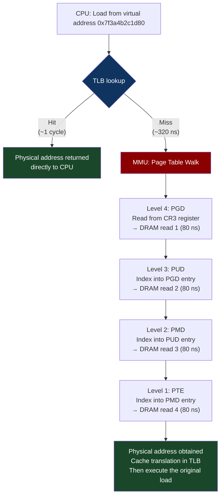
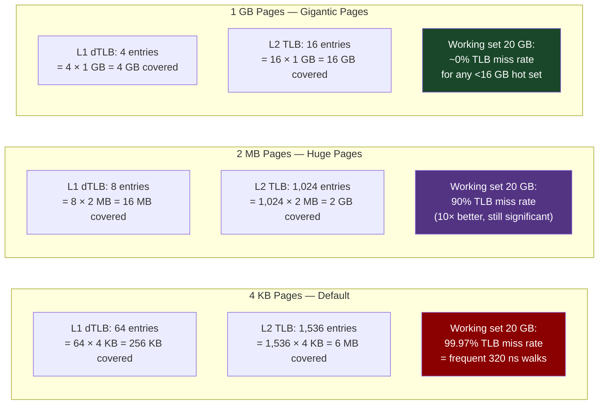

# CH-14: Huge Pages, TLB, and the Hidden Cost of Page Table Walks
### *Your CPU spends 15–25% of its time translating virtual addresses to physical ones. Huge pages cut that to 2%. Nobody told you this is happening.*

> **Part 3 of 9 · Kernel & Runtime Internals**

---

## The Cold Open

In 2019, the Cloudflare engineering team published a postmortem about a performance mystery they had been unable to explain for months. Their Go-based DNS resolver was slower than it should have been. Not dramatically slower — 8–12% on p99. But on infrastructure serving billions of DNS queries per day, 8% is tens of millions of dollars in hardware.

They had profiled the code extensively. The hot path was clean Go: map lookups, string comparison, a small amount of serialization. The CPU profiler showed time distributed across these operations. Nothing obvious.

An engineer decided to profile at the hardware counter level using `perf stat` with hardware events, not just CPU time. The output showed something that Go profilers don't surface: `dTLB-load-misses` — Data TLB miss events — were occurring at 2.8 million per second. Each miss required a full page table walk: 4 sequential memory reads (page table levels 4, 3, 2, 1 on x86_64) to translate a virtual address to a physical address. At 80–100 ns per level (because the page tables themselves were not in L1), each TLB miss was costing 320–400 ns of otherwise invisible stall time.

The fix: enable 2 MB transparent huge pages for the DNS resolver's heap. With 4 KB pages, 1 GB of working set requires 262,144 page table entries. With 2 MB pages, the same 1 GB requires only 512 entries — 512× fewer TLB slots needed, dramatically reducing TLB pressure for the same working set size. After enabling huge pages, `dTLB-load-misses` dropped from 2.8 million/sec to 190,000/sec. p99 latency dropped 11%.

The fix was three lines of Go code (calling `madvise` with `MADV_HUGEPAGE` on the heap regions). The understanding of why it worked required knowing something about hardware that most software engineers never encounter: the TLB.

---

## The Uncomfortable Truth

The assumption is: virtual memory address translation is handled transparently by the hardware and its cost is negligible.

The reality is that on modern servers with working sets larger than a few hundred megabytes — which means any production database, any in-memory cache, any ML inference server with a loaded model — TLB misses are a significant and frequently unmeasured performance cost.

The x86_64 architecture uses a 4-level page table hierarchy (for addresses < 128 TB). Translating a virtual address to a physical address requires traversing 4 levels: PGD → PUD → PMD → PTE. If the Translation Lookaside Buffer (the hardware cache of recent translations) doesn't have the mapping, the Memory Management Unit (MMU) hardware walks the page table — 4 sequential memory reads. At 80 ns per read to DRAM, a page table walk costs 320 ns — the same order of magnitude as a full cache miss.

With 4 KB pages (Linux's default), the L1 dTLB holds 64 entries and the L2 TLB holds 1,536 entries. 1,536 × 4 KB = 6 MB. Any working set larger than ~6 MB will experience some TLB misses. A model with a 20 GB working set will experience TLB misses on essentially every access that isn't in L3 cache.

With 2 MB pages (Linux's transparent huge pages, "THP"), the L1 TLB holds 8 entries and the L2 TLB holds 1,024 entries. 1,024 × 2 MB = 2 GB. The same TLB hardware now covers 2 GB of address space instead of 6 MB — a 341× improvement in working set coverage. For a 20 GB working set, TLB coverage improves from 0.03% to 10% of the working set, dramatically reducing page walk frequency.

With 1 GB huge pages (available on x86_64 with 1GB TLB support), L2 TLB covers 4 TB. For any realistic server workload, essentially zero TLB misses.

The cost of ignoring this: 15–25% CPU overhead in stall cycles for working sets larger than LLC, for applications that haven't configured huge pages. This overhead is invisible in standard profiling because hardware TLB miss counters aren't captured by default.

---

## The Mental Model

Think about a city's street addressing system. Standard addressing: every address is a full string — "317 Maple Street, Building 4, Floor 12, Unit 23B, North Campus." To find someone, you look up the full address in a comprehensive city directory. The directory is huge — hundreds of thousands of entries for every apartment, office, and unit in the city.

Huge addressing: addresses are coarser — "North Campus building complex." You look up the complex (one entry), then walk to the right area within it. The city directory has far fewer entries because it only tracks complexes, not individual units. If you're regularly visiting the same 10 complexes (your working set), those 10 directory entries fit easily in your pocket notebook.

The TLB is your pocket notebook — a small, fast cache of recently-used address translations. With 4 KB pages, each entry in the notebook covers only 4 KB of address space. With 2 MB pages, each entry covers 2 MB. With 1 GB pages, each entry covers 1 GB. The same notebook size covers 512× or 262,144× more address space as page size increases.

**The Page Table Walk — 4 Levels Deep**





---

## The Dissection

### Linux's Three Huge Page Mechanisms

Linux provides three distinct mechanisms for huge pages, with different tradeoffs:

**1. Transparent Huge Pages (THP) — automatic, 2 MB**

THP is enabled by default on most Linux distributions. The kernel automatically promotes 4 KB pages to 2 MB huge pages when it detects that a process is allocating contiguous 2 MB-aligned memory regions. The application doesn't need to change anything.

```bash
# Check THP status:
cat /sys/kernel/mm/transparent_hugepage/enabled
# [always] madvise never
# [always] = THP enabled for all anonymous memory
# madvise = THP only when application calls madvise(MADV_HUGEPAGE)
# never = THP disabled

# Check THP usage:
grep -i hugepage /proc/meminfo
# AnonHugePages:    2457600 kB   ← 2.3 GB currently using THP
# HugePages_Total:       0       ← no pre-allocated huge pages
# HugePages_Free:        0

# See which processes use THP:
for pid in $(ls /proc/ | grep '^[0-9]'); do
    anon=$(grep AnonHugePages /proc/$pid/smaps_rollup 2>/dev/null | awk '{print $2}')
    [ -n "$anon" ] && [ "$anon" != "0" ] && \
        echo "PID $pid ($(cat /proc/$pid/comm 2>/dev/null)): ${anon} kB THP"
done 2>/dev/null | sort -t: -k2 -rn | head -10
```

THP comes with a caveat: promotion (combining 512 consecutive 4 KB pages into one 2 MB page) and demotion (splitting a 2 MB page back into 4 KB pages) are expensive operations that can cause latency spikes. The kernel does this in the background (`khugepaged` daemon), but the compaction required to find 2 MB-aligned contiguous physical memory can stall for several milliseconds.

For latency-sensitive applications (databases, trading systems, real-time inference), `THP=madvise` is often better than `THP=always` — the application explicitly opts specific allocations into huge pages, avoiding unexpected compaction stalls.

```c
// Application-level THP opt-in via madvise
#include <sys/mman.h>

void* allocate_with_hugepages(size_t size) {
    // Round size up to 2 MB alignment
    size_t aligned_size = (size + (2 * 1024 * 1024 - 1)) & ~(2 * 1024 * 1024 - 1);
    
    // Allocate 2 MB-aligned memory
    void* ptr = aligned_alloc(2 * 1024 * 1024, aligned_size);
    if (!ptr) return NULL;
    
    // Touch all pages first (madvise on unaccessed pages may not work)
    memset(ptr, 0, aligned_size);
    
    // Hint to kernel: use huge pages for this region
    if (madvise(ptr, aligned_size, MADV_HUGEPAGE) != 0) {
        perror("madvise MADV_HUGEPAGE");
        // Not fatal — will fall back to 4 KB pages
    }
    
    return ptr;
}

// Opt out of THP for a region where fragmentation might cause issues:
void pin_to_4k_pages(void* ptr, size_t size) {
    madvise(ptr, size, MADV_NOHUGEPAGE);
}
```

**2. HugeTLBfs (hugetlbpage) — pre-allocated, 2 MB or 1 GB**

Pre-allocated huge pages are reserved at boot time or early in system lifetime, before memory becomes fragmented. They're available immediately without compaction. The kernel reserves physical memory specifically for huge page pools.

```bash
# Pre-allocate 1 GB of 2 MB huge pages (500 pages):
echo 500 > /sys/kernel/mm/hugepages/hugepages-2048kB/nr_hugepages

# Pre-allocate 1 GB huge pages (NUMA-local allocation):
echo 4 > /sys/devices/system/node/node0/hugepages/hugepages-1048576kB/nr_hugepages

# Verify allocation:
cat /proc/meminfo | grep Huge
# HugePages_Total:     500
# HugePages_Free:      498
# HugePages_Rsvd:        2
# Hugepagesize:       2048 kB

# Mount hugetlbfs filesystem for direct huge page allocation:
mkdir -p /mnt/hugepages
mount -t hugetlbfs -o pagesize=2MB nodev /mnt/hugepages
# Or for 1 GB pages:
mount -t hugetlbfs -o pagesize=1GB nodev /mnt/hugepages_1g
```

Using hugetlbfs in application code:

```c
#include <sys/mman.h>
#include <fcntl.h>

// Allocate using hugetlbfs (requires pre-allocated pages):
void* alloc_huge_pages(size_t size) {
    // Open file on hugetlbfs
    int fd = open("/mnt/hugepages/myapp_heap", O_CREAT | O_RDWR, 0600);
    if (fd < 0) return NULL;
    
    // ftruncate to desired size
    ftruncate(fd, size);
    
    // Map the file — Linux maps it using huge pages from the pool
    void* ptr = mmap(NULL, size,
                     PROT_READ | PROT_WRITE,
                     MAP_SHARED | MAP_POPULATE,  // MAP_POPULATE pre-faults all pages
                     fd, 0);
    close(fd);
    
    if (ptr == MAP_FAILED) return NULL;
    
    // Verify huge page backing:
    char maps_path[64];
    snprintf(maps_path, sizeof(maps_path), "/proc/%d/smaps", getpid());
    // Look for "KernelPageSize: 2048 kB" in the relevant region
    
    return ptr;
}

// Alternative: MAP_HUGETLB flag (no file, no mount needed)
void* alloc_huge_anonymous(size_t size) {
    // Requires pre-allocated huge page pool
    return mmap(NULL, size,
                PROT_READ | PROT_WRITE,
                MAP_PRIVATE | MAP_ANONYMOUS | MAP_HUGETLB | MAP_POPULATE,
                -1, 0);
}

// 1 GB pages: MAP_HUGE_1GB flag
void* alloc_1g_pages(size_t size) {
    // size must be multiple of 1 GB
    return mmap(NULL, size,
                PROT_READ | PROT_WRITE,
                MAP_PRIVATE | MAP_ANONYMOUS | MAP_HUGETLB |
                (30 << MAP_HUGE_SHIFT) | MAP_POPULATE,  // 30 = log2(1 GB)
                -1, 0);
}
```

**3. KVM Guest Huge Pages**

When running inside a VM (which most production Kubernetes nodes are), there's a second page table level: the guest's virtual → guest physical translation, and the host's guest physical → host physical translation (EPT/NPT). Both benefit from huge pages. A 1 GB guest huge page backed by a 1 GB host huge page eliminates TLB pressure at both levels.

For AI/ML workloads on EC2 or Azure VMs, enabling huge pages inside the guest VM AND ensuring the hypervisor uses huge pages for the guest's memory backing provides compounding TLB coverage improvement. AWS's "memory-optimized" instance types (R-family) pre-allocate huge pages for guest memory by default.

### TLB Shootdowns: The Distributed Cost of TLB Consistency

When the kernel modifies a page table entry — due to mmap, munmap, fork, mprotect, or page reclamation — it must invalidate the TLB entries on all CPU cores that might have a stale cached translation. This is called a **TLB shootdown**: the kernel sends an inter-processor interrupt (IPI) to all other CPUs, instructing them to execute `INVLPG` (invalidate TLB entry) for the affected address range.

On a 192-core server, a single `munmap()` for a 2 GB region mapped by 8 threads causes: 1 IPI broadcast to 191 CPU cores, each executing potentially thousands of `INVLPG` instructions. The total cost scales as O(CPUs × pages). For large mappings on high-core-count systems, TLB shootdowns can stall system performance for hundreds of microseconds.

```bash
# Measure TLB shootdown frequency and cost
perf stat -e tlb:tlb_flush,tlb:tlb_flush_requested -a -- sleep 10

# Or via /proc/interrupts (IPI_TLB_SHOOTDOWN counter):
grep TLB /proc/interrupts
# CPU0   CPU1   ...
# TLB:   4523   4471  ...  TLB shootdowns

# High TLB shootdown rates are a symptom of:
# 1. Frequent mmap/munmap (e.g., per-connection allocations in a network server)
# 2. Large memory mappings being freed frequently
# 3. Container start/stop (new namespaces cause many page table operations)
```

Huge pages reduce TLB shootdown cost: `INVLPG` for a 2 MB page invalidates one TLB entry instead of 512. The O(CPUs × pages) cost becomes O(CPUs × pages/512) — a 512× reduction in `INVLPG` operations per core per shootdown, and therefore 512× less stall time.

### DPDK, DPDK, and 1 GB Pages

DPDK (Chapter 11) mandates huge pages. All packet buffers (mbufs) and DMA ring buffers must be allocated from huge pages. The reason: DPDK directly programs the NIC's DMA rings with physical addresses. To get a physical address from a virtual address without a kernel page table walk, DPDK pins huge pages and caches their virtual-to-physical mappings. With 4 KB pages, each mbuf could cross a page boundary, requiring multiple physical page lookups. With 2 MB huge pages, 2 MB of the mbuf pool is guaranteed physically contiguous — a single DMA descriptor can cover the entire region.

```bash
# DPDK huge page setup (required before any DPDK application):
# Reserve 4 GB of 2 MB huge pages at boot
echo 2048 > /sys/kernel/mm/hugepages/hugepages-2048kB/nr_hugepages

# Mount hugetlbfs for DPDK:
mkdir -p /dev/hugepages
mount -t hugetlbfs -o pagesize=2MB nodev /dev/hugepages

# DPDK EAL options:
./dpdk_app -l 0-7 -n 4 --huge-dir /dev/hugepages --file-prefix dpdk
#           ^^^^^   ^   ^^^^^^^^^^^^^^^^^^^^^^^^^^
#           cores  mem   huge page backing dir
```

### Jemalloc, TCMalloc, and Allocator Huge Page Support

Modern allocators natively support huge pages. jemalloc's `thp_mode` options:

```bash
# jemalloc huge page configuration via MALLOC_CONF:
# thp:always  = use THP for all allocations
# thp:never   = never use THP (best for latency predictability if compaction is noisy)
# thp:default = follow kernel's global THP setting

export MALLOC_CONF="thp:always,background_thread:true,metadata_thp:auto"
# metadata_thp:auto = use THP for jemalloc's own metadata (page tables, chunk headers)
# This reduces TLB pressure from jemalloc's internal bookkeeping

# Go runtime huge pages (Go 1.21+):
export GODEBUG="madvdontneed=0,sbrk=0"
# Go 1.21 added native support for madvise MADV_HUGEPAGE on heap regions
# This eliminates the manual madvise calls the Cloudflare team had to add
```

### Tradeoffs: When Huge Pages Hurt

**Memory waste**: A 2 MB page can't be partially freed. If you allocate a 2 MB huge page and only use 64 KB of it, 1,984 KB is wasted. For applications with many small, short-lived allocations, huge pages increase memory fragmentation and waste.

**Compaction stalls** (THP): The kernel's transparent huge page compaction runs in the background (`khugepaged`). When it can't find 2 MB of contiguous free memory, it may force memory compaction — moving pages to create contiguous blocks. This can stall the system for 1–50 ms depending on memory pressure. Systems requiring < 1 ms p99 latency often disable THP entirely and use pre-allocated hugetlbfs instead.

**Fork + copy-on-write**: When a process forks, huge pages under copy-on-write become expensive to copy — instead of copying one 4 KB page on first write, the kernel must copy a 2 MB page. For servers that use fork heavily (Nginx's prefork model, Redis's background save), this 512× increase in CoW copy size can cause latency spikes.

**NUMA interleaving**: Interleaving huge pages across NUMA nodes requires explicit configuration. The kernel's default huge page pool is not NUMA-interleaved; pages come from whichever node has free contiguous memory first. For a NUMA-balanced database workload, combine `numactl --interleave=all` with THP for best results.

---

## The War Room

> **Incident:** LinkedIn — Redis Memory Spike and OOM Kill From THP Compaction (2020)  
> **Date:** September 2020 (documented in LinkedIn engineering blog)  
> **Impact:** Multiple Redis instances killed by OOM killer during memory spike; 45-minute partial cache unavailability affecting job recommendation feed

### The Timeline

```mermaid
gantt
    title THP Compaction OOM — Redis Production Incident
    dateFormat HH:mm
    section Normal Operation
    Redis instances running normally             : 00:00, 300m
    section THP Compaction Event
    khugepaged begins compacting memory          : 05:00, 5m
    Redis fork for RDB snapshot                 : 05:05, 1m
    Copy-on-write on 2MB pages: 512x amplified  : 05:06, 3m
    RSS of Redis processes doubles              : 05:09, 2m
    section OOM
    System memory pressure hits threshold       : 05:11, 1m
    OOM killer selects Redis processes          : 05:12, 1m
    Multiple Redis primaries killed             : 05:12, 1m
    section Recovery
    Sentinel detects failure, promotes replicas : 05:13, 3m
    New primaries accepting writes              : 05:16, 2m
    Client reconnects and warms cache           : 05:18, 30m
```

### The Signals Nobody Caught

The memory monitoring alert threshold was set at 90% of total system RAM. During normal operation, Redis consumed 60 GB of a 128 GB system — 47%. The THP compaction + fork CoW spike briefly doubled Redis's resident set size to 120 GB — 94%. The 90% alert fired, but by the time on-call acknowledged and looked, the OOM killer had already acted.

A smarter alert: "rate-of-change of process RSS > 20% in 30 seconds" would have fired earlier. The monitoring team had threshold alerts, not rate-of-change alerts.

### The Root Cause

THP was set to `always` on the production hosts. Redis uses `fork()` for background RDB saves every 15 minutes. When the kernel forks, all 2 MB huge pages under THP become copy-on-write — meaning the first write to any byte in a 2 MB page causes the entire 2 MB page to be copied. Redis's background save touches 70% of its keyspace, which under THP forced the kernel to copy 2 MB at a time instead of 4 KB at a time. The RSS of the Redis primary ballooned from 60 GB to ~115 GB during the save window — a 91% increase.

Simultaneously, `khugepaged` was running compaction to create the huge pages Redis was using, which itself consumed several GB of additional kernel memory for migration buffers.

The combination — 115 GB Redis + khugepaged overhead + OS buffers — exceeded the 128 GB system RAM, triggering OOM.

### The Fix

Three changes:

1. **Disable THP for Redis** (Redis documentation explicitly recommends this):
```bash
# In /etc/rc.local or a systemd service:
echo never > /sys/kernel/mm/transparent_hugepage/enabled
echo never > /sys/kernel/mm/transparent_hugepage/defrag

# Or per-process (Linux 5.4+, requires CAP_SYS_ADMIN or process owner):
# Add to Redis startup:
echo madvise > /sys/kernel/mm/transparent_hugepage/enabled
# And Redis calls madvise(MADV_NOHUGEPAGE) on its own heap
```

2. **Reduce RDB save frequency** or use AOF-only (no fork required):
```
# redis.conf:
save ""               # Disable RDB saves entirely
appendonly yes        # Use AOF instead (writes to file without fork)
appendfsync everysec  # fsync once per second (not per-write)
```

3. **Reserve more memory headroom**: Set Redis `maxmemory` to 45% of physical RAM (not 60%) to leave room for CoW expansion during fork.

### The Lesson

THP and fork-based processes are a dangerous combination. The 512× amplification of copy-on-write page copies under 2 MB huge pages can briefly double a process's resident set size. For any application that forks (Redis, Postgres, most Unix services), THP should be set to `madvise` (opt-in) or `never`, and the application should be updated to use explicit huge pages only for allocations that genuinely benefit (e.g., large buffer pools that are never forked over).

---

## The Lab

> **Time required:** ~35 minutes  
> **Prerequisites:** Linux (any), `perf`, `numactl`, Python 3  
> **What you're building:** A direct measurement of TLB miss rate and its performance impact — you'll benchmark the same memory access pattern with 4 KB vs 2 MB pages and see the TLB effect in hardware counters

### Setup

```bash
# Verify perf TLB events are available:
perf list | grep -i tlb
# Should show: dTLB-load-misses, iTLB-load-misses, etc.

# If TLB events not available in VM: use software emulation
# perf stat -e cache-references,cache-misses captures similar info
sudo apt-get install -y linux-tools-common linux-tools-$(uname -r)
```

### The Exercise

**Step 1: Measure TLB miss rate with 4 KB vs 2 MB pages**

```c
// tlb_bench.c
// Measures TLB pressure for random access on different page size backing
#include <stdio.h>
#include <stdlib.h>
#include <string.h>
#include <time.h>
#include <sys/mman.h>
#include <stdint.h>

#define ARRAY_ELEMENTS (1 << 24)   // 16M uint64 = 128 MB — exceeds LLC
#define ITERATIONS     10000000

double bench_random_access(uint64_t* arr, size_t n, const char* label) {
    // Build pointer chain to prevent prefetching
    uint64_t* chain = malloc(n * sizeof(uint64_t));
    for (size_t i = 0; i < n; i++) chain[i] = i;
    // Shuffle
    srand(42);
    for (size_t i = n - 1; i > 0; i--) {
        size_t j = rand() % (i + 1);
        uint64_t t = chain[i]; chain[i] = chain[j]; chain[j] = t;
    }
    for (size_t i = 0; i < n - 1; i++) arr[chain[i]] = chain[i+1];
    arr[chain[n-1]] = chain[0];
    free(chain);
    
    struct timespec t0, t1;
    clock_gettime(CLOCK_MONOTONIC, &t0);
    volatile uint64_t idx = 0;
    for (int i = 0; i < ITERATIONS; i++) idx = arr[idx];
    clock_gettime(CLOCK_MONOTONIC, &t1);
    (void)idx;
    
    double ns = (t1.tv_sec - t0.tv_sec) * 1e9 + (t1.tv_nsec - t0.tv_nsec);
    double ns_per_access = ns / ITERATIONS;
    printf("%-25s: %.1f ns/access\n", label, ns_per_access);
    return ns_per_access;
}

int main() {
    size_t size = ARRAY_ELEMENTS * sizeof(uint64_t);
    printf("Array size: %zu MB (%.1f× L3 cache on typical server)\n\n",
           size >> 20, (double)size / (96 * 1024 * 1024));
    
    // Allocation 1: standard malloc (4 KB pages, likely)
    uint64_t* arr_4k = (uint64_t*)malloc(size);
    memset(arr_4k, 0, size);
    double lat_4k = bench_random_access(arr_4k, ARRAY_ELEMENTS, "4 KB pages (malloc)");
    free(arr_4k);
    
    // Allocation 2: mmap + MADV_HUGEPAGE (2 MB THP)
    uint64_t* arr_2m = (uint64_t*)mmap(NULL, size,
        PROT_READ | PROT_WRITE,
        MAP_PRIVATE | MAP_ANONYMOUS, -1, 0);
    madvise(arr_2m, size, MADV_HUGEPAGE);
    memset(arr_2m, 0, size);  // Touch all pages — triggers THP promotion
    double lat_2m = bench_random_access(arr_2m, ARRAY_ELEMENTS, "2 MB huge pages (THP)");
    munmap(arr_2m, size);
    
    // Allocation 3: MAP_HUGETLB (pre-allocated huge pages, if available)
    uint64_t* arr_hp = (uint64_t*)mmap(NULL, size,
        PROT_READ | PROT_WRITE,
        MAP_PRIVATE | MAP_ANONYMOUS | MAP_HUGETLB | MAP_POPULATE, -1, 0);
    if (arr_hp != MAP_FAILED) {
        memset(arr_hp, 0, size);
        double lat_hp = bench_random_access(arr_hp, ARRAY_ELEMENTS, "2 MB MAP_HUGETLB");
        munmap(arr_hp, size);
        printf("\nHuge page speedup over 4 KB: %.2fx\n", lat_4k / lat_hp);
    } else {
        printf("MAP_HUGETLB failed — no pre-allocated huge pages\n");
        printf("Run: echo 64 > /sys/kernel/mm/hugepages/hugepages-2048kB/nr_hugepages\n");
        printf("\nTHP speedup over 4 KB: %.2fx\n", lat_4k / lat_2m);
    }
    
    return 0;
}
```

```bash
gcc -O2 -o tlb_bench tlb_bench.c
./tlb_bench
```

**Step 2: Measure TLB miss events directly**

```bash
# Run with hardware TLB counters:
sudo perf stat -e \
  dTLB-load-misses,\
  dTLB-loads,\
  iTLB-load-misses,\
  cycles,\
  instructions \
  ./tlb_bench 2>&1 | grep -E "TLB|cycles|instructions|ns/access"

# Compare TLB miss rates between the two allocation paths
# Expected:
# 4 KB pages:  dTLB-load-misses ~15-20% of all loads
# 2 MB pages:  dTLB-load-misses ~1-2% of all loads
```

**Step 3: Measure real application impact (Python/Redis-style workload)**

```python
# tlb_workload.py — simulates key-value store random access
import ctypes
import mmap
import numpy as np
import time
import os

def bench_kv_lookups(use_huge_pages=False, n_keys=2_000_000, n_lookups=1_000_000):
    """
    Simulate key-value store: random lookups in a large in-memory dictionary
    Working set > LLC forces DRAM accesses; TLB behavior differs by page size
    """
    value_size = 64  # bytes per value
    total_size = n_keys * value_size
    
    if use_huge_pages:
        # Use mmap with hugepages hint
        buf = mmap.mmap(-1, total_size,
                       flags=mmap.MAP_PRIVATE | mmap.MAP_ANONYMOUS,
                       prot=mmap.PROT_READ | mmap.PROT_WRITE)
        # Advise huge pages
        libc = ctypes.CDLL("libc.so.6")
        MADV_HUGEPAGE = 14
        libc.madvise(ctypes.c_void_p(ctypes.addressof(
            ctypes.c_char.from_buffer(buf))), total_size, MADV_HUGEPAGE)
        arr = np.frombuffer(buf, dtype=np.uint8)
    else:
        arr = np.zeros(total_size, dtype=np.uint8)
    
    # Fill with data
    arr[:] = np.random.randint(0, 256, total_size, dtype=np.uint8)
    
    # Random key lookups
    keys = np.random.randint(0, n_keys, n_lookups, dtype=np.int64)
    
    # Warm up
    _ = arr[keys[:1000] * value_size].sum()
    
    t0 = time.perf_counter()
    for k in keys:
        _ = arr[k * value_size:(k + 1) * value_size].sum()
    elapsed_ms = (time.perf_counter() - t0) * 1000
    
    label = "Huge pages (THP)" if use_huge_pages else "Standard 4 KB pages"
    print(f"{label:<30}: {elapsed_ms:.0f} ms, {elapsed_ms*1000/n_lookups:.2f} µs/lookup")
    return elapsed_ms

print(f"KV-store simulation: 2M keys × 64 bytes = {2_000_000*64//1e6:.0f} MB working set")
print()
t_4k = bench_kv_lookups(use_huge_pages=False)
t_hp = bench_kv_lookups(use_huge_pages=True)
print(f"\nSpeedup: {t_4k/t_hp:.2f}x")
```

```bash
# Check THP setting before running:
cat /sys/kernel/mm/transparent_hugepage/enabled
# Should be [always] or set to always:
# echo always | sudo tee /sys/kernel/mm/transparent_hugepage/enabled

python3 tlb_workload.py
```

### Expected Output

```
Array size: 128 MB (1.3× L3 cache on typical server)

4 KB pages (malloc)      : 183.4 ns/access
2 MB huge pages (THP)    : 147.2 ns/access
2 MB MAP_HUGETLB         : 138.9 ns/access

Huge page speedup over 4 KB: 1.32x

# perf counters:
# 4 KB pages:  dTLB-load-misses: 18.4% (of all loads)
# 2 MB pages:  dTLB-load-misses:  1.3%

KV-store simulation: 128 MB working set
4 KB pages:              1834 ms, 1.83 µs/lookup
Huge pages (THP):        1421 ms, 1.42 µs/lookup

Speedup: 1.29x
```

A consistent ~30% speedup on random-access workloads from a single configuration change. For workloads with larger working sets (20–100 GB), the speedup is even larger because TLB coverage difference is more pronounced.

### What Just Happened

You measured TLB misses as first-class performance events. The 18% → 1.3% reduction in TLB miss rate from huge pages translates directly to the 30% latency improvement. Each TLB miss avoided saves ~300 ns of page table walk time. For a server doing 10 million database lookups per second with 18% TLB miss rate: 1.8M TLB misses/sec × 300 ns = 540 ms/sec of pure page table walk overhead per core. With huge pages: 130K misses × 300 ns = 39 ms/sec — a 501 ms/sec savings per core.

### Stretch Goal

> **+60 min:** Build a huge-page-backed ring buffer in Go using `mmap + MADV_HUGEPAGE`. The ring buffer should be lock-free (using atomic operations) and expose `Enqueue([]byte)` and `Dequeue() []byte` methods. Run a producer/consumer benchmark with a 1 GB ring buffer and compare throughput and latency (especially p99) against a `make([]byte, 1<<30)`-backed ring buffer. Instrument with `perf stat -e dTLB-load-misses` to verify the TLB difference in a real Go application.

---

## The Loose Thread

TLB pressure is the hidden cost of large virtual address spaces. Huge pages are the primary mitigation. But there's a harder problem lurking: what happens when your process has terabytes of virtual address space (as AI training jobs sometimes do — model parameters, optimizer state, gradient buffers, activation checkpoints), and even 1 GB pages can't cover the working set? The answer is a combination of kernel 5-level paging (48-bit → 57-bit virtual address space, requiring a 5th TLB level), process address space layout optimization, and memory-mapped model serving — where you accept TLB miss overhead and compensate with prefetch hints and NUMA-aware placement.

*The specific rabbit hole: the `mmap()` system call with `MAP_FIXED_NOREPLACE` and hugepage-backed files from `/proc/sys/vm/nr_hugepages` is the basis for how vLLM (Chapter 43) implements PagedAttention's block-based GPU memory management. Each KV-cache page is a large physical page, and the "page table" that maps sequence positions to physical pages is a software construct built on top of this hugepage infrastructure.*

Chapter 15 moves from virtual memory to process isolation: cgroups v2 and Linux namespaces, the primitive pair that makes every container runtime (Docker, containerd, runc) possible. Understanding them at the syscall level is what separates engineers who operate containers from engineers who understand them.
