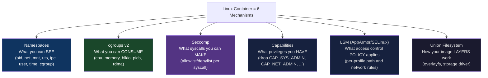
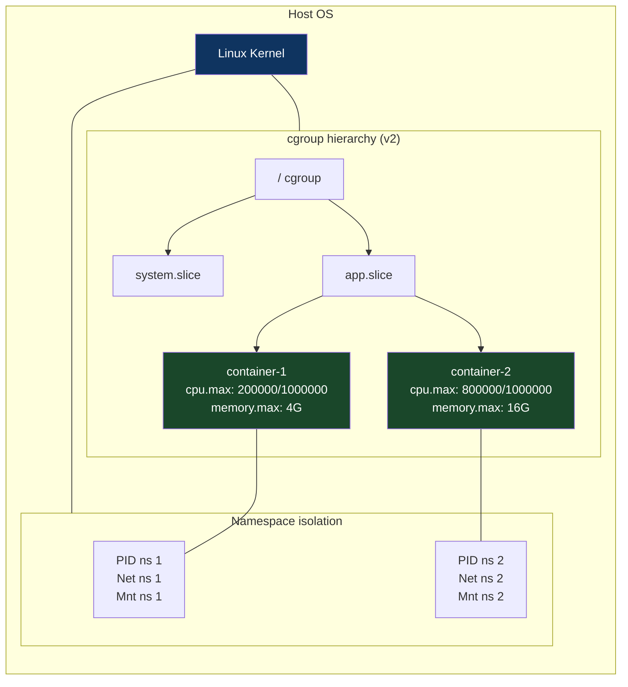
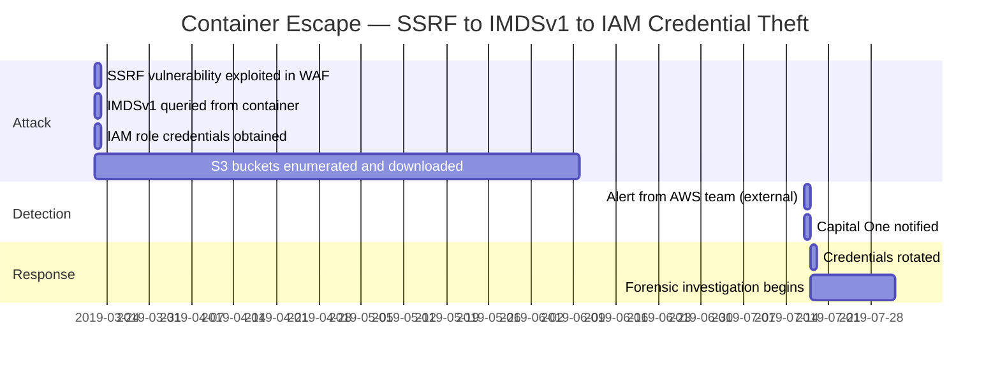

# CH-15: cgroups v2 and Namespaces — Container Isolation at the Syscall Level
### *Docker is not a technology. It is a user-friendly interface to six Linux kernel features that existed before Docker was born.*

> **Part 3 of 9 · Kernel & Runtime Internals**

---

## The Cold Open

In November 2020, a security researcher published CVE-2020-15257 — a privilege escalation vulnerability in containerd. The details were instructive not just for the security community but for anyone who wants to understand what container isolation actually is.

The vulnerability allowed a container to escape its isolation boundary by exploiting a misconfigured abstract UNIX socket exposed by containerd-shim, the process that manages container lifecycle. The container process, running as root inside the container, could connect to the socket and issue commands that allowed it to execute arbitrary code on the host with root privileges.

The postmortem from the containerd team revealed something that many engineers are uncomfortable admitting: container isolation is not a security boundary. It is a resource management and namespace boundary. A container can escape to the host if: (1) it runs as root inside the container, (2) there is a misconfigured or vulnerable interface accessible from inside the container that runs with host privileges, and (3) the seccomp and AppArmor/SELinux policies don't prevent the exploit.

All three conditions are common in default configurations.

This is not a criticism of containers. Containers are an excellent operational model for resource isolation, deployment reproducibility, and service composition. But the engineers deploying them in production need to understand what the isolation primitives actually are at the syscall level — not because they'll write container runtime code, but because understanding the primitives explains what can and cannot be isolated, what resources are shared vs. separate, and what security controls are needed to make multi-tenant container deployments actually safe.

Containers are six Linux kernel features: namespaces (what you see), cgroups (what you consume), seccomp (what syscalls you can make), capabilities (what privileges you have), Linux Security Modules (what access control policy applies), and union filesystems (how your image layers work). This chapter covers the first two in depth.

---

## The Uncomfortable Truth

The assumption is: a container is isolated from other containers and from the host. Its processes can't see the host's processes, can't use more than its allocated CPU, and can't affect other containers.

The reality is: **namespace isolation** (what you see) and **cgroup resource limits** (what you consume) are distinct mechanisms with different strength guarantees, and neither is complete isolation by default.

Namespaces control visibility: a container process in a PID namespace can't see host PIDs. In a network namespace, it has its own IP stack. In a mount namespace, it has its own filesystem view. But namespaces are not access control — they're view control. A container can still consume unlimited CPU (unless a cgroup CPU limit is set), exhaust the host's memory (unless a cgroup memory limit is set), create unlimited files (unless a cgroup blkio/disk limit is set), and make arbitrary syscalls (unless seccomp denies them).

Cgroups v2 control resource consumption: a container's processes can't exceed their CPU quota, can't allocate more memory than their limit, and can't exceed their disk I/O rate. But cgroups don't prevent a container from *seeing* resources — a process in a CPU-limited container can still read `/proc/cpuinfo` and see all 192 cores. It can still try to allocate memory up to its limit by consuming all the pages in its cgroup's memory pool.

The practical implication: a "container" in production is as isolated as its namespace + cgroup + seccomp + capabilities configuration makes it. A default Docker `run --privileged` container has almost no isolation. A properly configured container with: non-root user, read-only rootfs, minimal capabilities (drop `ALL`, add only needed), seccomp restricted syscall set, and tight cgroup limits — this is genuinely well-isolated. Most production containers are somewhere between these extremes, and most engineers haven't thought about exactly where.

---

## The Mental Model

Think about the difference between renting an apartment in a building versus renting a section of a single large office.

In an apartment (VM isolation), you have completely separate plumbing, electrical circuits, physical walls, and a separate front door. Your neighbor's activities don't affect your systems even in principle.

In an open-plan office with partitioned sections (container isolation), you share the electrical grid, the HVAC, the building's load-bearing structure, and the fire safety systems. Partitions give you privacy (namespace: you can't see your neighbor's work) and desk allocation (cgroup: you've been assigned 4 desks, not 40). But if your neighbor runs too many power strips, they might trip the building's circuit breaker. If they drill into the partition, they can see through. The building's systems (kernel, host OS) are shared.

This isn't a flaw — it's the tradeoff for density. A 10-story apartment building might house 200 tenants. A VM-based deployment of 200 tenants needs 200 separate OS instances, 200 boot processes, 200 memory footprints for 200 kernel copies. A container-based deployment shares one kernel, dramatically reducing overhead.

**The Six Isolation Primitives**





---

## The Dissection

### Namespaces: The Eight Dimensions of Isolation

Linux currently has eight namespace types. Each can be independently created, shared, or nested.

**PID Namespace**: Each PID namespace has its own process tree. The first process in a new PID namespace is PID 1 (init). Processes inside the namespace see PIDs starting from 1. Processes outside see the actual host PIDs.

```bash
# Create a new PID namespace and run a shell inside:
unshare --pid --fork --mount-proc /bin/bash

# Inside the namespace:
ps aux
# PID  USER   COMMAND
#  1   root   /bin/bash      ← This is PID 1 in the new namespace
#  6   root   ps aux         ← PID 6, but its real host PID might be 47293

# From the host:
ps aux | grep bash
# 47293  root  bash           ← Real host PID visible from outside
```

**Network Namespace**: Each network namespace has its own set of network interfaces, routing tables, iptables rules, and sockets. This is how Docker containers get their own IP addresses and isolated TCP stacks.

```bash
# Create a network namespace:
ip netns add mycontainer

# Create a veth pair (virtual ethernet cable) to connect ns to host:
ip link add veth0 type veth peer name veth1

# Move one end into the namespace:
ip link set veth1 netns mycontainer

# Configure the namespace end:
ip netns exec mycontainer ip addr add 10.0.0.2/24 dev veth1
ip netns exec mycontainer ip link set veth1 up
ip netns exec mycontainer ip link set lo up

# Configure the host end:
ip addr add 10.0.0.1/24 dev veth0
ip link set veth0 up

# Now 10.0.0.2 is reachable inside the namespace:
ip netns exec mycontainer ping 10.0.0.1

# List active network namespaces:
ip netns list
# lsns -t net  (all network namespaces including container namespaces)
```

**Mount Namespace**: Each mount namespace has its own filesystem mount tree. A container's mount namespace starts with a copy of the host's mount tree (pivot_root or chroot to the container's rootfs), then selectively exposes bind mounts for volumes.

```bash
# This is what runc does under the hood for a container:
# (simplified)

# Create a new mount namespace:
unshare --mount /bin/bash

# Now we have our own mount namespace — mounts don't propagate to host
# Mount container root:
mount -t overlay overlay \
  -o lowerdir=/var/lib/docker/overlay2/abc123/diff,\
     upperdir=/var/lib/docker/overlay2/abc123/work,\
     workdir=/var/lib/docker/overlay2/abc123/merge \
  /var/lib/docker/overlay2/abc123/merged

# Pivot root to container filesystem:
cd /var/lib/docker/overlay2/abc123/merged
mkdir -p old_root
pivot_root . old_root
cd /
umount -l /old_root   # Detach host filesystem

# Now / is the container root — host filesystem is gone from this mount namespace
ls /   # container's files only
```

**User Namespace**: Maps container UIDs to host UIDs. User namespace allows a process to appear as root (UID 0) inside the container while actually running as an unprivileged user on the host. This is the foundation of "rootless containers."

```bash
# Run a container as an unprivileged user with user namespace:
# Container UID 0 maps to host UID 100000
echo "0 100000 65536" | sudo tee /proc/$(pgrep mycontainer)/uid_map

# Inside container: UID 0 (root)
# On host: UID 100000 (unprivileged)
# If container escapes, host sees it as UID 100000 — cannot write root-owned files

# Check user namespace mapping:
cat /proc/self/uid_map
# 0   100000   65536   ← container uid 0 maps to host uid 100000
```

### cgroups v2: Hierarchical Resource Control

cgroups v2 (unified hierarchy, introduced in Linux 4.5, dominant from ~5.4) replaces the fragmented cgroups v1 model with a single unified hierarchy at `/sys/fs/cgroup/`. Every process belongs to exactly one cgroup in the v2 hierarchy. Resource controllers (cpu, memory, blkio, pids, rdma) are selectively attached to nodes in the hierarchy.

**Key cgroup v2 files and their meaning:**

```bash
# Examine a container's cgroup (from host):
CONTAINER_ID=$(docker ps -q --filter name=myapp)
CGROUP_PATH=$(docker inspect $CONTAINER_ID | \
  python3 -c "import json,sys; d=json.load(sys.stdin); \
  print(d[0]['HostConfig']['CgroupParent'] or \
  '/system.slice/docker-'+d[0]['Id']+'.scope')")

# Navigate to the cgroup in the unified hierarchy:
ls /sys/fs/cgroup/system.slice/docker-${CONTAINER_ID}.scope/

# Key files:
cat /sys/fs/cgroup/system.slice/docker-${CONTAINER_ID}.scope/cpu.max
# 200000 1000000
# ↑ quota  ↑ period (both in microseconds)
# Container can use 200000/1000000 = 20% of a single CPU per 100ms window
# For multi-core allocation: "800000 1000000" = 80% of one CPU, not 4 CPUs at 20% each

cat /sys/fs/cgroup/system.slice/docker-${CONTAINER_ID}.scope/memory.max
# 4294967296   ← 4 GB hard memory limit (OOM kill if exceeded)

cat /sys/fs/cgroup/system.slice/docker-${CONTAINER_ID}.scope/memory.current
# 1073741824   ← 1 GB currently used

cat /sys/fs/cgroup/system.slice/docker-${CONTAINER_ID}.scope/pids.max
# 1024   ← max number of processes/threads in this cgroup

cat /sys/fs/cgroup/system.slice/docker-${CONTAINER_ID}.scope/cpu.stat
# usage_usec 374829183          ← CPU time used (microseconds)
# user_usec 284719263
# system_usec 90109920
# nr_periods 374829              ← number of scheduler periods
# nr_throttled 8293              ← times CPU was throttled (hit cpu.max limit)
# throttled_usec 4172913         ← total time throttled (microseconds)
```

The `nr_throttled` and `throttled_usec` fields are critical for diagnosing CPU throttling — a problem where a container's CPU quota is set too low for its workload, causing periodic throttle events that add unpredictable latency. Kubernetes's CPU limits implementation uses these same cgroup v2 CPU quota settings, and **CPU throttling is one of the most common causes of p99 latency increases in containerized applications**.

```bash
# Check CPU throttling for all containers (detect misconfigured limits):
for cgroup in /sys/fs/cgroup/system.slice/docker-*.scope/; do
    throttled=$(awk '/nr_throttled/ {print $2}' $cgroup/cpu.stat 2>/dev/null)
    total=$(awk '/nr_periods/ {print $2}' $cgroup/cpu.stat 2>/dev/null)
    [ -z "$throttled" ] && continue
    [ "$total" = "0" ] && continue
    pct=$(awk "BEGIN {printf \"%.1f\", $throttled/$total*100}")
    container=$(basename $cgroup | sed 's/docker-\(.\{12\}\).*/\1/')
    echo "Container $container: ${throttled}/${total} periods throttled (${pct}%)"
done
```

### The CPU Throttling Problem in Kubernetes

Kubernetes resource limits directly map to cgroup CPU quotas. `cpu: "500m"` (500 millicores) translates to `cpu.max = 50000 100000` — 50,000 µs of CPU time per 100,000 µs period. This looks reasonable: 0.5 CPU cores.

The problem: the 100 ms period means that if your container needs more than 50 ms of CPU in any 100 ms window — even briefly — it's throttled for the remainder of that window. A Go application doing a 60 ms GC pause is throttled for 10 ms after the pause ends. A Java application with a sawtooth allocation pattern runs fine on average but gets throttled during peaks.

The relationship between `cpu.max` quota and application latency is highly nonlinear: at 70% utilization of the CPU quota, throttling events are rare and latency impact is minimal. At 85% utilization, throttling events become common and p99 latency increases measurably. At 95% utilization, throttling dominates p99 behavior.

```python
# detect_throttling.py — Kubernetes namespace-wide throttle check
import subprocess
import json
import sys

def check_throttling():
    # Get all pods with containers
    result = subprocess.run(
        ['kubectl', 'get', 'pods', '-A', '-o', 'json'],
        capture_output=True, text=True
    )
    pods = json.loads(result.stdout)
    
    throttled_containers = []
    
    for pod in pods['items']:
        namespace = pod['metadata']['namespace']
        pod_name = pod['metadata']['name']
        node_name = pod['spec'].get('nodeName', 'unknown')
        
        for container in pod['spec']['containers']:
            resources = container.get('resources', {})
            limits = resources.get('limits', {})
            requests = resources.get('requests', {})
            
            cpu_limit = limits.get('cpu', 'unlimited')
            cpu_request = requests.get('cpu', '0')
            
            # Flag containers with tight limits relative to requests
            if cpu_limit != 'unlimited':
                # Parse millicores
                def parse_cpu(s):
                    if s.endswith('m'): return int(s[:-1])
                    return int(float(s) * 1000)
                try:
                    limit_m = parse_cpu(cpu_limit)
                    request_m = parse_cpu(cpu_request) if cpu_request != '0' else limit_m
                    ratio = limit_m / max(request_m, 1)
                    
                    # Limit == request is the worst case for throttling
                    # (no burst headroom)
                    if ratio <= 1.1:
                        throttled_containers.append({
                            'namespace': namespace,
                            'pod': pod_name,
                            'container': container['name'],
                            'limit': cpu_limit,
                            'request': cpu_request,
                            'ratio': f"{ratio:.2f}x headroom"
                        })
                except (ValueError, ZeroDivisionError):
                    pass
    
    if throttled_containers:
        print(f"⚠️  {len(throttled_containers)} containers with tight CPU limits (throttle risk):")
        for c in throttled_containers[:20]:
            print(f"  {c['namespace']}/{c['pod']} [{c['container']}]: "
                  f"limit={c['limit']}, request={c['request']}, {c['ratio']}")
    else:
        print("✓ No containers with dangerously tight CPU limits found")

check_throttling()
```

### The Memory Limit: OOM vs. Memory Pressure

cgroup v2 provides two memory limit knobs:

- `memory.max`: Hard limit. If the cgroup exceeds this, the OOM killer is invoked. It kills the process with the highest OOM score inside the cgroup.
- `memory.high`: Soft limit. If exceeded, the kernel throttles memory allocation speed (slows down `malloc`, delays page faults) and aggressively reclaims cache pages within the cgroup. No OOM kill, but significant performance degradation.

Setting `memory.max` without `memory.high` means you go from "normal operation" directly to "OOM kill" with no warning. Setting `memory.high` to 80% of `memory.max` provides an early-warning zone where performance degrades gracefully rather than crashing.

```yaml
# Kubernetes pod spec with proper memory limit layering:
resources:
  requests:
    memory: "4Gi"   # Scheduled on nodes with ≥4 GB available
  limits:
    memory: "6Gi"   # memory.max = 6 GB (OOM kill if exceeded)

# There's no direct Kubernetes field for memory.high, but you can set it
# via annotations processed by a custom kubelet plugin or directly via
# the cgroup fs if you control the node configuration.
# In practice: set requests ≈ 65-75% of limits to create headroom
# and avoid OOM kill on memory spikes.
```

### runc, containerd, and the Runtime Stack

The container runtime stack in Kubernetes:

```
kubelet
  └── CRI (Container Runtime Interface)
       └── containerd (or CRI-O)
            └── containerd-shim
                 └── runc (OCI runtime, creates namespaces + cgroups)
                      └── container process (your application)
```

**runc** is the OCI runtime standard implementation. It:
1. Creates the required namespaces via `clone()` syscall with namespace flags: `CLONE_NEWPID | CLONE_NEWNET | CLONE_NEWNS | CLONE_NEWUTS | CLONE_NEWIPC`
2. Sets up the cgroup hierarchy by writing to cgroup v2 files
3. Configures seccomp profile via `prctl(PR_SET_SECCOMP, ...)`
4. Drops capabilities: keeps only what's in the container spec's `capabilities` field
5. Sets up the OCI bundle's root filesystem via overlayfs and pivot_root
6. Executes the container's entrypoint in the new namespace/cgroup environment

```go
// Simplified runc-style container creation in Go
// Shows the actual syscalls involved

package main

import (
    "os"
    "syscall"
    "fmt"
)

// This is the "parent" process — creates namespaces and runs child
func createContainer(rootfs, cmd string) error {
    // syscall.SysProcAttr configures namespaces for the child process
    attr := &syscall.SysProcAttr{
        Cloneflags: syscall.CLONE_NEWPID |   // New PID namespace
                    syscall.CLONE_NEWNET |   // New network namespace
                    syscall.CLONE_NEWNS  |   // New mount namespace
                    syscall.CLONE_NEWUTS |   // New hostname namespace
                    syscall.CLONE_NEWIPC |   // New IPC namespace
                    syscall.CLONE_NEWUSER,   // New user namespace (rootless)
        
        // User namespace UID/GID mapping: container UID 0 = host UID 100000
        UidMappings: []syscall.SysProcIDMap{{
            ContainerID: 0,
            HostID:      100000,
            Size:        65536,
        }},
        GidMappings: []syscall.SysProcIDMap{{
            ContainerID: 0,
            HostID:      100000,
            Size:        65536,
        }},
    }
    
    // Fork+exec the container init process with new namespaces
    cmd_obj := exec.Command("/proc/self/exe")  // re-exec ourselves as "child"
    cmd_obj.SysProcAttr = attr
    cmd_obj.Env = append(os.Environ(),
        "CONTAINER_INIT=1",
        "CONTAINER_ROOT="+rootfs,
        "CONTAINER_CMD="+cmd,
    )
    
    if err := cmd_obj.Start(); err != nil {
        return fmt.Errorf("failed to create container: %w", err)
    }
    
    // Set up cgroup limits for the child (PID is now known):
    cgroupPath := fmt.Sprintf("/sys/fs/cgroup/containers/%d", cmd_obj.Process.Pid)
    os.MkdirAll(cgroupPath, 0755)
    
    // CPU: 200ms of CPU per 1000ms period (20% of one CPU)
    os.WriteFile(cgroupPath+"/cpu.max", []byte("200000 1000000"), 0644)
    // Memory: 512 MB hard limit
    os.WriteFile(cgroupPath+"/memory.max", []byte("536870912"), 0644)
    // Memory high: 400 MB soft limit (triggers reclaim before OOM)
    os.WriteFile(cgroupPath+"/memory.high", []byte("419430400"), 0644)
    // PID limit: max 256 processes
    os.WriteFile(cgroupPath+"/pids.max", []byte("256"), 0644)
    
    // Move child into cgroup:
    os.WriteFile(cgroupPath+"/cgroup.procs", 
                 []byte(fmt.Sprintf("%d", cmd_obj.Process.Pid)), 0644)
    
    return cmd_obj.Wait()
}
```

### The Tradeoffs

cgroups v2 vs v1: cgroups v1 had per-controller hierarchies (memory hierarchy, cpu hierarchy, blkio hierarchy — all separate). This allowed a container in one cpu hierarchy to be in a different memory hierarchy, leading to inconsistent policies. cgroups v2's unified hierarchy enforces that all controllers apply to the same hierarchy. The tradeoff: migrating from v1 to v2 required updating container runtimes, Linux distributions, and orchestration tools simultaneously. The Kubernetes ecosystem fully migrated to cgroups v2 by 2023 (Kubernetes 1.25+ requires it).

Namespace overhead: creating a new network namespace requires allocating a full TCP/IP stack in kernel memory (~500 KB per namespace). A cluster with 10,000 pods has 10,000 network namespaces — 5 GB of kernel memory dedicated to network namespace overhead alone. This is typically acceptable but should be accounted for in node memory reservations.

User namespaces and rootless containers solve the "container root = host root" problem but introduce complexity: volume mounts must respect UID mapping, capabilities within user namespaces are restricted, and some syscalls behave differently in user-namespaced contexts. Production adoption of rootless containers (Docker rootless, Podman, rootless Kubernetes) is growing but not yet universal.

---

## The War Room

> **Incident:** Capital One — Container Escape via Misconfigured AWS IMDSv1 and Overpowered IAM Role (2019)  
> **Date:** July 2019 (public SEC filing, Congressional testimony)  
> **Impact:** 106 million customer records exposed; $80 million regulatory fine; executive departure

### The Timeline



### The Root Cause

The container running the web application firewall (WAF) had access to the EC2 Instance Metadata Service (IMDS, `http://169.254.169.254`). An SSRF (Server-Side Request Forgery) vulnerability in the WAF allowed an attacker to make the WAF proxy requests to the IMDS endpoint. The IMDS returned temporary IAM credentials for the EC2 instance's IAM role. That IAM role had overly broad S3 permissions — ListBuckets and GetObject on almost every bucket in the account.

The container's namespace isolation was not the failure point. The network namespace correctly separated the container's network stack. The failure was:
1. The IMDS endpoint is accessible from the EC2 instance's network namespace, and by default all container processes can reach it via the host network or via route through the veth pair
2. The IAM role attached to the EC2 instance was not scoped to least privilege
3. IMDSv2 (which requires a PUT request with a TTL header — resistant to SSRF) was not enabled

### The Fix

Three layers that prevent this class of attack:

1. **IMDSv2 enforcement**: Require the PUT-before-GET token flow that SSRF attacks can't perform:
```bash
# Enforce IMDSv2 on all new instances via AWS CLI:
aws ec2 modify-instance-metadata-options \
  --instance-id i-xxxxxxxxx \
  --http-tokens required \        # Require session-oriented access (IMDSv2)
  --http-endpoint enabled

# Block IMDS from containers at the network level:
# iptables rule that blocks 169.254.169.254 for all traffic not from the main veth:
iptables -A OUTPUT -d 169.254.169.254 -m cgroup --cgroup <container-cgroup-id> -j DROP
```

2. **Pod-level IAM via IRSA (IAM Roles for Service Accounts)**: Give each pod a specific IAM role with minimal permissions, instead of using the EC2 instance role:
```yaml
# kubernetes service account with IRSA annotation
apiVersion: v1
kind: ServiceAccount
metadata:
  name: waf-service
  annotations:
    eks.amazonaws.com/role-arn: arn:aws:iam::123456789:role/waf-readonly-role
    # This role only has GetObject on the specific bucket this service needs
```

3. **seccomp + network policy**: Restrict which network destinations containers can reach:
```yaml
# NetworkPolicy: block metadata service from all pods by default
apiVersion: networking.k8s.io/v1
kind: NetworkPolicy
metadata:
  name: deny-imds
  namespace: default
spec:
  podSelector: {}
  policyTypes: [Egress]
  egress:
  - to:
    - ipBlock:
        cidr: 0.0.0.0/0
        except:
        - 169.254.169.254/32  # Block IMDS from all pods
```

### The Lesson

Container isolation prevents a container from seeing host processes and filesystem. It does not prevent a container from making network connections to privileged endpoints accessible from the EC2 instance's network context (IMDS, cloud provider APIs). The security perimeter for containerized workloads includes: seccomp, network policy, least-privilege IAM, and IMDSv2 enforcement — not just namespace isolation.

---

## The Lab

> **Time required:** ~45 minutes  
> **Prerequisites:** Linux with Docker or rootless Podman, cgroup v2 enabled (`ls /sys/fs/cgroup/cgroup.controllers`), Python 3  
> **What you're building:** A live cgroup introspection tool that shows resource utilization and throttling for running containers, and a demonstration of namespace isolation at the syscall level

### Setup

```bash
# Verify cgroup v2:
cat /sys/fs/cgroup/cgroup.controllers
# Should include: cpuset cpu io memory pids

# Install tools:
sudo apt-get install -y cgroup-tools util-linux
```

### The Exercise

**Step 1: Create a cgroup manually (without Docker)**

```bash
# Create a cgroup for a test process:
CGPATH="/sys/fs/cgroup/mytest"
sudo mkdir -p $CGPATH

# Set limits:
echo "200000 1000000" | sudo tee $CGPATH/cpu.max     # 20% CPU
echo "104857600" | sudo tee $CGPATH/memory.max        # 100 MB memory
echo "50" | sudo tee $CGPATH/pids.max                 # max 50 processes

# Launch a process in the cgroup:
sudo bash -c "echo $$ > $CGPATH/cgroup.procs && exec stress-ng --cpu 1 --timeout 30s"

# In another terminal, watch the cgroup stats:
watch -n 1 'cat /sys/fs/cgroup/mytest/cpu.stat | grep throttled; \
            cat /sys/fs/cgroup/mytest/memory.current'
```

**Step 2: Namespace isolation demonstration**

```bash
# Show what a PID namespace looks like from inside:
sudo unshare --pid --fork --mount-proc bash -c '
echo "=== Inside new PID namespace ==="
echo "My PID: $$"
ps aux
echo ""
echo "Process tree (only my namespace):"
pstree
'

# Compare to host PID view:
echo "=== Host PID view (partial) ==="
ps aux | head -10
```

**Step 3: Build a container cgroup monitor**

```python
#!/usr/bin/env python3
# cgroup_monitor.py — live container resource monitoring via cgroup v2
import os
import time
import subprocess
import json

def get_docker_cgroup_path(container_id):
    """Get the cgroup v2 path for a Docker container."""
    result = subprocess.run(
        ['docker', 'inspect', container_id],
        capture_output=True, text=True
    )
    if result.returncode != 0:
        return None
    
    data = json.loads(result.stdout)
    if not data:
        return None
    
    # In cgroup v2, Docker containers are at:
    # /sys/fs/cgroup/system.slice/docker-<full_id>.scope/
    full_id = data[0]['Id']
    path = f"/sys/fs/cgroup/system.slice/docker-{full_id}.scope"
    if os.path.exists(path):
        return path
    
    # Alternative path for some systems:
    path2 = f"/sys/fs/cgroup/docker/{full_id}"
    return path2 if os.path.exists(path2) else None

def read_cgroup_stat(cgroup_path, filename):
    try:
        with open(os.path.join(cgroup_path, filename)) as f:
            return f.read().strip()
    except (IOError, FileNotFoundError):
        return None

def parse_cpu_stat(stat_str):
    """Parse cpu.stat into a dict."""
    result = {}
    for line in stat_str.split('\n'):
        parts = line.split()
        if len(parts) == 2:
            result[parts[0]] = int(parts[1])
    return result

def monitor_container(container_id, interval=1.0):
    cgroup_path = get_docker_cgroup_path(container_id)
    if not cgroup_path:
        print(f"Container {container_id[:12]} not found or not running")
        return
    
    print(f"Monitoring container {container_id[:12]}")
    print(f"cgroup path: {cgroup_path}")
    print()
    print(f"{'Time':>6} {'CPU%':>7} {'ThrottlPct':>11} {'MemMB':>7} {'MemLimitMB':>11}")
    print("-" * 55)
    
    prev_cpu = None
    start = time.time()
    
    while True:
        # CPU statistics
        cpu_stat_raw = read_cgroup_stat(cgroup_path, 'cpu.stat')
        if not cpu_stat_raw:
            break
        cpu_stat = parse_cpu_stat(cpu_stat_raw)
        
        # Memory
        mem_current = int(read_cgroup_stat(cgroup_path, 'memory.current') or 0)
        mem_max_str = read_cgroup_stat(cgroup_path, 'memory.max')
        mem_max = int(mem_max_str) if mem_max_str and mem_max_str != 'max' else 0
        
        # CPU calculation
        if prev_cpu is not None:
            dt = interval
            cpu_delta = cpu_stat.get('usage_usec', 0) - prev_cpu.get('usage_usec', 0)
            cpu_pct = cpu_delta / (dt * 1e6) * 100
            
            nr_throttled = cpu_stat.get('nr_throttled', 0) - prev_cpu.get('nr_throttled', 0)
            nr_periods = cpu_stat.get('nr_periods', 0) - prev_cpu.get('nr_periods', 0)
            throttle_pct = (nr_throttled / nr_periods * 100) if nr_periods > 0 else 0
            
            elapsed = time.time() - start
            mem_mb = mem_current / 1e6
            mem_limit_mb = mem_max / 1e6 if mem_max > 0 else float('inf')
            
            throttle_flag = "⚠️" if throttle_pct > 5 else "  "
            print(f"{elapsed:>5.0f}s {cpu_pct:>6.1f}% "
                  f"{throttle_pct:>9.1f}%{throttle_flag} "
                  f"{mem_mb:>6.0f}  {mem_limit_mb:>10.0f}")
        
        prev_cpu = cpu_stat
        time.sleep(interval)

if __name__ == '__main__':
    import sys
    if len(sys.argv) < 2:
        # List running containers
        result = subprocess.run(['docker', 'ps', '--format', '{{.ID}}\t{{.Names}}'],
                               capture_output=True, text=True)
        print("Running containers:")
        print(result.stdout)
        print("Usage: python3 cgroup_monitor.py <container_id>")
    else:
        monitor_container(sys.argv[1])
```

```bash
# Start a test container with CPU and memory limits:
docker run -d --name test-app \
  --cpus=0.5 \
  --memory=256m \
  --memory-reservation=128m \
  nginx

# Run the monitor:
python3 cgroup_monitor.py test-app

# In another terminal, generate CPU load:
docker exec test-app bash -c "yes > /dev/null &"
# Watch for throttling in the monitor output
```

### Expected Output

```
Monitoring container a3f7b2c1d4e5
cgroup path: /sys/fs/cgroup/system.slice/docker-a3f7b2c1d4e5...scope

Time    CPU%  ThrottlPct   MemMB  MemLimitMB
-------------------------------------------------------
    1s   2.1%       0.0%      14         256
    2s   2.3%       0.0%      14         256
    3s  49.8%       0.0%      15         256   ← load started
    4s  50.0%      12.4% ⚠️   15         256   ← throttled (50% quota hit)
    5s  49.9%      14.1% ⚠️   15         256
    6s  50.0%      11.8% ⚠️   15         256
```

The `⚠️` marks indicate CPU throttling — the container is hitting its 0.5 CPU quota and being throttled 12–14% of periods. This is exactly the condition that causes latency spikes in production applications. p99 latency will be notably higher when `ThrottlPct > 5%`.

### What Just Happened

You built a production-grade container monitoring tool that directly reads cgroup v2 metrics — the same data that Kubernetes's vertical pod autoscaler and container resource analytics tools use. The throttle percentage is the metric that Kubernetes's standard `kubectl top` doesn't show, but that explains most unexplained container latency regressions.

### Stretch Goal

> **+60 min:** Implement a minimal container runtime in ~200 lines of Go: fork a new process with `syscall.CLONE_NEWPID | syscall.CLONE_NEWNET | syscall.CLONE_NEWNS`, set up a cgroup for it, pivot_root to a pre-built OCI bundle (use `docker export` to create one), and exec the entrypoint. This is the core of what runc does. Compare the behavior of your runtime with `runc` by running the same OCI bundle in both and comparing namespace IDs (`readlink /proc/<pid>/ns/*`) and cgroup paths.

---

## The Loose Thread

cgroups v2 control CPU and memory. But there's a resource that cgroups don't control well: the Linux CPU scheduler itself. A cgroup can have a CPU quota (how much total CPU time it gets), but it doesn't control *which* CPUs it runs on, *when* it gets scheduled relative to other cgroups, or *how much* scheduling latency it experiences. The Linux CFS (Completely Fair Scheduler) makes these decisions based on a priority system that doesn't map cleanly to the latency guarantees that production applications require.

*The specific rabbit hole: look at the Linux kernel's `sched_latency_ns` and `sched_min_granularity_ns` kernel parameters. These control the CFS scheduling period — how long a task runs before potentially being preempted. The default of 6 ms minimum granularity means a latency-sensitive task can wait up to 6 ms in the run queue behind a compute-intensive task even if both have the same nice level. For a database aiming for sub-millisecond p99 latency, 6 ms of scheduler latency is the entire budget.*

Chapter 16 opens the Linux scheduler and shows you exactly how scheduling decisions are made — and how to configure your system so that latency-sensitive workloads don't get caught behind batch jobs in the run queue.
