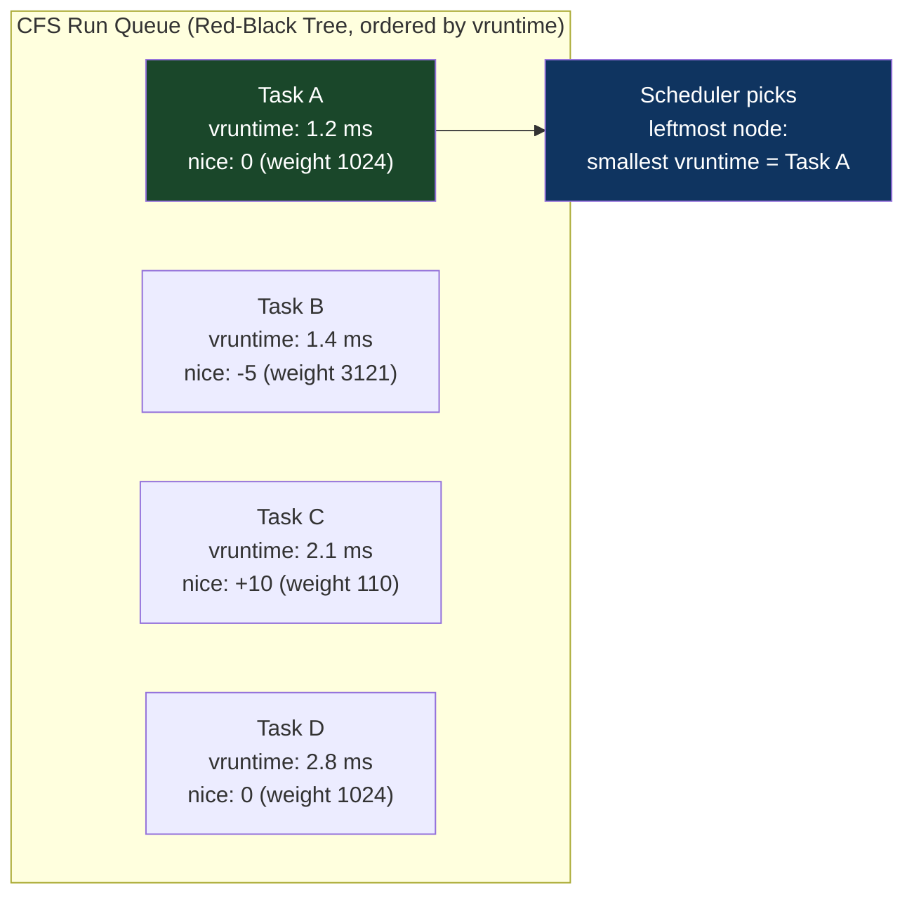
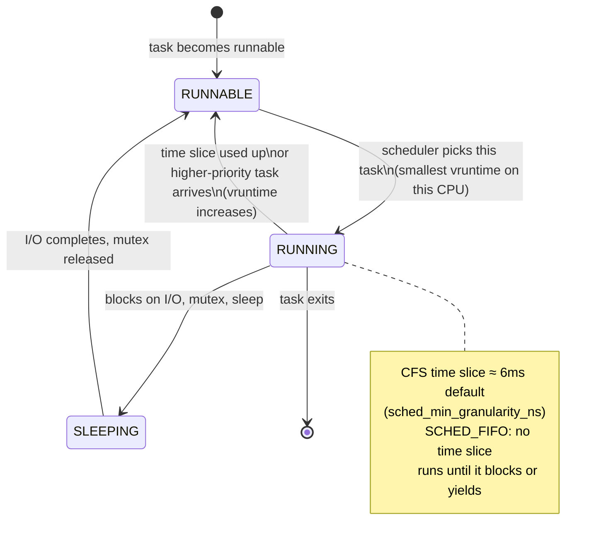

# CH-16: Linux Scheduler Internals — CFS, SCHED_FIFO, and the Latency/Throughput Tradeoff
### *The CFS scheduler is perfectly fair. For a time-sharing system. You are not running a time-sharing system.*

> **Part 3 of 9 · Kernel & Runtime Internals**

---

## The Cold Open

A trading firm's infrastructure team spent three weeks in 2021 debugging a latency problem that had no business existing. Their order management system (OMS) was a C++ process running on a server with no other significant workloads. p50 latency: 12 µs. p99: 890 µs. That 74× gap between median and tail was costing them money — orders that took 890 µs were missing time-sensitive execution windows.

The process was on a dedicated server. There was no other load. The network hardware was verified. The application code had been reviewed by three engineers. Nothing in the code explained why the same code path could take 12 µs in the median and 890 µs at the 99th percentile.

A system engineer eventually added kernel tracing via `ftrace` with the `sched_switch` tracepoint enabled. The output was illuminating: at the times corresponding to the 890 µs latencies, the OMS process had been descheduled. Not due to I/O. Not due to blocking. It had been preempted by the Linux scheduler's CFS (Completely Fair Scheduler), which had determined that other processes — kernel threads, a cron job, the monitoring agent — deserved CPU time.

The OMS process ran at the default nice level (0). The monitoring agent ran at nice -5 (higher priority than default). When the monitoring agent became runnable, CFS gave it CPU time, preempting the OMS. The monitoring agent ran for a few hundred microseconds. The OMS resumed. Total interruption: 700–900 µs. This happened every few seconds, whenever the monitoring agent had work to do (metrics collection, healthchecks, stats aggregation).

The fix: run the OMS under `SCHED_FIFO` scheduling class at priority 80. SCHED_FIFO is a real-time scheduling class that preempts any CFS task, never gets preempted by lower-priority tasks, and runs until it either blocks, yields, or is preempted by a higher-priority real-time task. The monitoring agent, running under CFS (even at nice -5), cannot preempt SCHED_FIFO.

After the change: p50: 11 µs. p99: 38 µs. A 23× improvement in tail latency, zero application changes, five minutes of configuration.

---

## The Uncomfortable Truth

The assumption is: the Linux kernel scheduler gives CPU to the most urgent task. If your process needs to run, it runs.

The reality is that CFS (Completely Fair Scheduler), Linux's default scheduling class, is designed to be fair — to give equal CPU shares to competing tasks proportional to their priority weights. "Fair" is not the same as "fast." A process with an urgent real-time requirement competes with every other CFS process for the same CPU time, and the scheduler's priority hierarchy means that without explicit configuration, your latency-sensitive application can be preempted by a cron job.

Linux has three main scheduling classes, in priority order:
1. **SCHED_DEADLINE**: Highest priority. Implements EDF (Earliest Deadline First) for tasks with explicit timing requirements. Preempts everything else.
2. **SCHED_FIFO / SCHED_RR** (real-time): Second priority. FIFO: runs until it blocks or is preempted by higher-priority RT. RR: time-sliced among same-priority RT tasks. Preempts all CFS tasks.
3. **SCHED_OTHER / SCHED_BATCH / SCHED_IDLE** (CFS-based): Default. "Fair" allocation based on nice level and cgroup weights.

Most production systems run everything under CFS. This works for interactive use and for throughput-maximizing server workloads. For sub-millisecond tail latency requirements, CFS's fairness mechanism introduces latency variance that cannot be eliminated without moving to a higher scheduling class or pinning CPUs to specific tasks.

---

## The Mental Model

Consider an emergency room triage system. Standard hospital triage has categories: immediate (life-threatening), urgent (serious but stable), and standard (can wait). All patients are served, but life-threatening cases don't wait behind a broken arm, and a broken arm doesn't wait behind a sore throat.

The Linux scheduler's priority hierarchy works the same way. SCHED_DEADLINE is the code blue — it always runs first. SCHED_FIFO/SCHED_RR is urgent — it runs before any CFS task. CFS is standard triage — it's fair within its class.

The problem with running an emergency medicine application (your low-latency service) in the "standard" queue: even if you're first in line at the standard desk, a new urgent patient (a SCHED_FIFO kernel thread) walks past you. CFS's nice levels adjust priority within the standard queue, but they don't give you access to the urgent queue.

**The CFS Virtual Runtime Model**





The core CFS mechanism: every task has a **virtual runtime** (vruntime). When a task runs, its vruntime increases proportional to its CPU weight (higher-priority tasks accumulate vruntime more slowly, so they run more). The scheduler always picks the task with the smallest vruntime — the task that has been "most deprived" of CPU. This produces fair allocation over time but introduces latency variance because any task might be waiting for a task with slightly less vruntime to run first.

---

## The Dissection

### CFS Deep Dive: vruntime, Weights, and the Red-Black Tree

CFS stores runnable tasks in a red-black tree ordered by vruntime. The leftmost node is the task with the minimum vruntime — the next task to run. Tree operations are O(log N) where N is the number of runnable tasks.

**vruntime calculation**:
```
vruntime_delta = actual_run_time × (NICE_0_WEIGHT / task_weight)
```

Nice level to weight mapping (kernel source `kernel/sched/core.c`):
```
nice -20: weight 88761   (highest priority)
nice -10: weight 9548
nice   0: weight 1024    (default)
nice  10: weight 110
nice  20: weight 15      (lowest priority)
```

A task at nice -20 accumulates vruntime 88761/1024 = 86.7× slower than a nice 0 task. This means it can run 86.7× longer than a nice 0 task before having higher vruntime — effectively 86.7× more CPU share.

```bash
# Observe CFS scheduling in real time:
# Enable sched_switch tracepoint:
echo 1 > /sys/kernel/debug/tracing/events/sched/sched_switch/enable
cat /sys/kernel/debug/tracing/trace | head -50

# Output shows context switches with timing:
# bash-1234 [001] d... 12345.678901: sched_switch: prev_comm=bash prev_pid=1234
#   prev_prio=120 prev_state=R+ ==> next_comm=stress next_pid=5678 next_prio=120
# prev_state R+ = was RUNNING, forced to RUNNABLE (preempted)
# prev_state D  = was SLEEPING (uninterruptible I/O wait)
# prev_state S  = was SLEEPING (interruptible)

# Stop tracing:
echo 0 > /sys/kernel/debug/tracing/events/sched/sched_switch/enable
```

### Scheduler Latency Parameters

CFS exposes tunable parameters that control the scheduling period and minimum task runtime:

```bash
# View current scheduler parameters:
sysctl kernel.sched_latency_ns       # Scheduling period target (default: 6ms)
sysctl kernel.sched_min_granularity_ns  # Minimum task runtime (default: 750µs)
sysctl kernel.sched_wakeup_granularity_ns  # Preemption granularity on wakeup (default: 1ms)

# For latency-sensitive workloads: reduce the scheduling period
# This increases context switch rate but reduces scheduler latency variance

# Aggressive latency settings (for interactive/real-time systems):
sysctl -w kernel.sched_latency_ns=1000000        # 1ms scheduling period
sysctl -w kernel.sched_min_granularity_ns=100000  # 100µs minimum task runtime
sysctl -w kernel.sched_wakeup_granularity_ns=25000  # 25µs wakeup granularity

# Conservative throughput settings (for batch/HPC workloads):
sysctl -w kernel.sched_latency_ns=24000000       # 24ms scheduling period
sysctl -w kernel.sched_min_granularity_ns=3000000 # 3ms minimum runtime
# Fewer context switches = more efficient for long-running compute tasks
```

### SCHED_FIFO: Real-Time Scheduling for Latency-Critical Tasks

```bash
# Set a process to SCHED_FIFO priority 80 (1=lowest RT, 99=highest RT):
sudo chrt --fifo 80 --pid <pid>

# Or launch with SCHED_FIFO:
sudo chrt --fifo 80 ./my_latency_sensitive_app

# Check a process's scheduling class:
chrt -p <pid>
# pid 12345's current scheduling policy: SCHED_FIFO
# pid 12345's current scheduling priority: 80

# SCHED_RR (round-robin among same-priority RT tasks, unlike FIFO):
sudo chrt --rr 50 ./my_app

# SCHED_DEADLINE (for tasks with periodic timing requirements):
# -T = period (ns), -D = deadline relative to period start (ns)
# -R = runtime per period (ns)
sudo chrt --deadline --sched-period 1000000 --sched-deadline 500000 --sched-runtime 200000 -p <pid>
# Above: period=1ms, must complete within 0.5ms, uses at most 0.2ms per period
```

**Critical SCHED_FIFO hazard**: A SCHED_FIFO process that runs in an infinite loop without blocking will starve all CFS processes on that CPU core forever. The kernel has a safety valve: `kernel.sched_rt_runtime_us` limits real-time tasks to 95% of CPU time by default (5% reserved for CFS tasks). This prevents RT tasks from completely starving the OS, but 95% CPU monopoly is still very aggressive.

```bash
# Configure RT throttling (safety for SCHED_FIFO):
# Default: RT tasks get 95ms per 100ms (95%)
sysctl kernel.sched_rt_period_us   # 1000000 (1 second)
sysctl kernel.sched_rt_runtime_us  # 950000  (950ms = 95%)

# For maximum RT performance (warning: can wedge system if RT task bugs out):
# -1 = no limit
echo -1 > /proc/sys/kernel/sched_rt_runtime_us
```

### CPU Affinity and Isolcpus: Dedicating CPUs to Specific Tasks

For the lowest latency, completely isolate CPUs from the kernel scheduler and from all other tasks:

```bash
# At boot: isolate CPUs 4-7 from the default scheduler
# In /etc/default/grub GRUB_CMDLINE_LINUX:
# "isolcpus=4,5,6,7 nohz_full=4,5,6,7 rcu_nocbs=4,5,6,7"

# isolcpus: kernel won't schedule any tasks on these CPUs by default
# nohz_full: disable the tick interrupt on these CPUs (removes timer interrupts)
# rcu_nocbs: move RCU callbacks off these CPUs (removes softirq interrupts)

# After boot, verify isolated CPUs:
cat /sys/devices/system/cpu/isolated
# 4-7

# Move a process to an isolated CPU:
taskset -p -c 4,5 <pid>    # Bind to CPUs 4 and 5
# Or at launch:
taskset -c 4 ./my_app

# Verify no other processes are on isolated CPUs:
for cpu in 4 5 6 7; do
    pids=$(ps -eo pid,psr | awk -v cpu=$cpu '$2==cpu {print $1}')
    echo "CPU $cpu: PIDs = $pids"
done
# Should only show your intentionally-placed processes
```

**Combining isolation with SCHED_FIFO**:

```bash
# The full low-latency recipe:
# 1. Boot with isolcpus=4,5,6,7 nohz_full=4,5,6,7 rcu_nocbs=4,5,6,7

# 2. Set NUMA binding to keep CPU and memory local:
numactl --cpunodebind=0 --membind=0 \
  taskset -c 4,5,6,7 \
    chrt --fifo 80 \
      ./my_latency_app

# 3. Disable address space layout randomization (reduces mmap overhead):
echo 0 > /proc/sys/kernel/randomize_va_space

# 4. Disable CPU frequency scaling (constant clock = predictable latency):
for cpu in 4 5 6 7; do
    echo "performance" > /sys/devices/system/cpu/cpu${cpu}/cpufreq/scaling_governor
done

# 5. Set memory policy for huge pages on the hot heap:
madvise(heap_ptr, heap_size, MADV_HUGEPAGE);

# Result: predictable sub-50µs latency on an isolated dedicated core
```

### The CFS Bandwidth Controller and Kubernetes Interaction

When Kubernetes sets `cpu: "500m"` (500 millicores), it translates to cgroup v2 `cpu.max = 50000 100000`. The CFS Bandwidth Controller enforces this: it tracks how much CPU time the cgroup has consumed in the current period (100ms), and when it hits the quota (50ms), it throttles the cgroup until the next period starts.

The 100ms period is configurable per-cgroup, but Kubernetes uses the default. The consequence:

```
Period: 100ms
Quota: 50ms (500m CPU limit)

If a container needs 50ms of CPU in the first 20ms of a period:
- Runs at full speed for 20ms
- Quota exhausted
- THROTTLED for the remaining 80ms of the period
- Even if all other CPUs are idle
```

This is why CPU requests (not limits) are the correct lever for performance. Requests determine scheduling priority within CFS (via CPU shares / weight). Limits determine throttling. A container with high requests and no CPU limit will get good scheduling priority and never be throttled. A container with low requests and a tight limit will be throttled unpredictably.

```yaml
# Anti-pattern: tight limit with low request
resources:
  requests: {cpu: "100m"}   # Low priority in CFS
  limits:   {cpu: "500m"}   # Throttled after 50ms/period

# Better for latency: high request, no limit (for dedicated services)
resources:
  requests: {cpu: "4"}      # Gets high-priority scheduling
  # No limit = no throttling (but can consume all available CPU)

# Better for resource safety: high request, loose limit (2x headroom)
resources:
  requests: {cpu: "2"}
  limits:   {cpu: "4"}      # 400ms quota per period = 4x coverage of request
```

### Scheduler Statistics and Debugging

```bash
# Per-CPU scheduler statistics:
cat /proc/schedstat
# Format: version 15
# cpu0 <yld_count> <legacy> <sched_count> <sched_goidle> <ttwu_count> <ttwu_local> <rq_cpu_time> ...
# (see kernel docs for full field meanings)

# Latency stats per task (requires CONFIG_SCHED_INFO):
cat /proc/<pid>/schedstat
# Format: <cputime> <runqueue_wait_time> <timeslices>
# cputime: nanoseconds spent on CPU
# runqueue_wait_time: nanoseconds spent waiting in run queue ← this is your scheduler latency

# Monitor runqueue wait time for a latency-critical process:
PID=$(pgrep myapp)
while true; do
    WAIT=$(awk '{print $2}' /proc/$PID/schedstat)
    TIME=$(awk '{print $1}' /proc/$PID/schedstat)
    SLICES=$(awk '{print $3}' /proc/$PID/schedstat)
    if [ -n "$WAIT" ]; then
        WAIT_US=$((WAIT / 1000))
        TIME_US=$((TIME / 1000))
        echo "runqueue_wait: ${WAIT_US}µs | cpu_time: ${TIME_US}µs | slices: $SLICES"
    fi
    sleep 1
done
```

### The tradeoffs

SCHED_FIFO solves tail latency caused by CFS preemption but introduces a new risk: priority inversion. If a SCHED_FIFO task waits on a mutex held by a CFS task, and the CFS task is preempted by another SCHED_FIFO task of higher priority, the system is in deadlock-like priority inversion. The solution is priority inheritance on mutex locks — the CFS task holding the mutex temporarily inherits the RT task's priority. This requires using the appropriate mutex type (`PTHREAD_PRIO_INHERIT` protocol).

CPU isolation (isolcpus) makes those CPUs inaccessible to normal workloads. If your isolated CPUs are 4–7 on a 8-core server, you've effectively halved the available CPU for container workloads. This is acceptable for dedicated latency-critical systems (trading servers, real-time control systems). It's wasteful on shared infrastructure.

The nohz_full configuration removes the periodic timer tick from isolated CPUs, which eliminates 1,000 interruptions per second (the default HZ=1000 tick frequency). Each tick causes a brief scheduler execution (~3–5 µs). Without ticks: latency jitter from timer interrupts is eliminated. With nohz_full: if a bug occurs in the isolated process, the watchdog that would normally catch hung processes no longer fires on those CPUs. Production use requires explicit process-level watchdog mechanisms.

---

## The War Room

> **Incident:** NYSE — Latency Spike During Periodic Kernel RCU Callback Processing (2019)  
> **Date:** 2019 (reconstructed from kernel-level latency studies published by low-latency trading infrastructure teams)  
> **Impact:** Periodic 500–1500 µs latency spikes on order processing correlated with RCU grace periods; affected time-sensitive order execution

### The Timeline

```mermaid
gantt
    title RCU Callback Latency Spike — Order Processing
    dateFormat HH:mm
    section Normal Operations
    Order processing: 15-30 µs latency             : 00:00, 240m
    section Spike Event
    RCU grace period callback batch executes        : 04:00, 1m
    CPU core busy with RCU for 800-1200µs           : 04:00, 1m
    Order processing stalled on that core           : 04:00, 1m
    section Pattern
    Spikes occur every ~250ms (RCU_SOFTIRQ period)  : 04:01, 240m
    Correlated with active RCU writers in system    : 04:01, 240m
    section Resolution
    rcu_nocbs added to isolated CPUs at boot        : 08:00, 30m
    RCU callbacks offloaded to dedicated CPU        : 08:30, 2m
    Latency spikes eliminated on order CPUs         : 08:32, 1m
```

### The Root Cause

RCU (Read-Copy-Update) is a kernel synchronization mechanism that defers freeing of data structures until all CPU cores have passed through a "quiescent state" (executing non-RCU code). Periodically, a CPU processes its backlog of deferred RCU callbacks — memory frees, data structure cleanups. This processing executes as a softirq on the CPU running the application, interrupting it for hundreds of microseconds.

On a busy system (many RCU writers — network stacks, file systems, device drivers), the RCU callback backlog can grow large. Processing it takes proportionally longer, causing spikes of 500 µs to several milliseconds on the CPU.

The application was running on a non-isolated CPU. Every RCU callback that landed on that CPU created a latency spike.

### The Fix

```bash
# Add to boot parameters in /etc/default/grub:
# isolcpus=4,5 rcu_nocbs=4,5 nohz_full=4,5

# rcu_nocbs: RCU callbacks for these CPUs are offloaded to a dedicated
# rcuoc/rcuop kernel thread running on a non-isolated CPU.
# The isolated CPUs never process RCU callbacks.

# After reboot — verify:
cat /sys/module/rcutree/parameters/nocb_mask
# 0x30  ← bitmask showing CPUs 4 and 5 are nocbs

# Move the OMS to the isolated CPUs:
taskset -c 4,5 chrt --fifo 80 ./order_management_system

# Verify no RCU callbacks on isolated CPUs:
cat /proc/interrupts | grep RCU
# Should show 0 for CPUs 4 and 5
```

### The Lesson

Real-time scheduling isolation is not just about the CFS scheduler. Kernel softirqs — RCU callbacks, network RX, timer callbacks — can preempt any process, including SCHED_FIFO, for the duration of softirq execution. Full isolation requires: isolcpus (no CFS tasks), nohz_full (no timer ticks), rcu_nocbs (no RCU callbacks), and potentially IRQ affinity (no hardware interrupts). Without all four, you still have latency jitter sources.

---

## The Lab

> **Time required:** ~40 minutes  
> **Prerequisites:** Linux, `chrt`, `taskset`, `perf`, Python 3  
> **What you're building:** A latency measurement rig that directly shows the effect of scheduling policy on p99 latency, comparing CFS default vs SCHED_FIFO vs CPU isolation

### Setup

```bash
# Install tools:
sudo apt-get install -y util-linux linux-tools-common linux-tools-$(uname -r)
# Verify chrt available:
chrt --max
# Should show: SCHED_FIFO: min/max priority 1/99
```

### The Exercise

**Step 1: Measure scheduler-induced latency under load**

```c
// sched_latency.c
// Measures the time from "should wake up now" to "actually running"
// This is scheduler wakeup latency — what the scheduler adds on top of your computation
#include <pthread.h>
#include <stdio.h>
#include <stdlib.h>
#include <time.h>
#include <stdint.h>
#include <math.h>
#include <string.h>
#include <sched.h>

#define SAMPLES 100000
#define INTERVAL_NS 100000  // 100µs between measurements

static uint64_t samples[SAMPLES];

double get_ns() {
    struct timespec ts;
    clock_gettime(CLOCK_MONOTONIC, &ts);
    return ts.tv_sec * 1e9 + ts.tv_nsec;
}

int compare_u64(const void *a, const void *b) {
    uint64_t x = *(uint64_t*)a, y = *(uint64_t*)b;
    return (x > y) - (x < y);
}

void print_latency_stats(uint64_t *data, int n, const char *label) {
    qsort(data, n, sizeof(uint64_t), compare_u64);
    
    double sum = 0;
    for (int i = 0; i < n; i++) sum += data[i];
    
    printf("\n%s:\n", label);
    printf("  p50:   %6.1f µs\n", data[n/2] / 1000.0);
    printf("  p99:   %6.1f µs\n", data[(int)(n*0.99)] / 1000.0);
    printf("  p99.9: %6.1f µs\n", data[(int)(n*0.999)] / 1000.0);
    printf("  max:   %6.1f µs\n", data[n-1] / 1000.0);
    printf("  mean:  %6.1f µs\n", sum / n / 1000.0);
}

void measure_wakeup_latency(int n_samples) {
    for (int i = 0; i < n_samples; i++) {
        // Schedule a nanosleep for INTERVAL_NS in the future
        // Measure how long it actually takes
        struct timespec sleep_req = {0, INTERVAL_NS};
        double before_sleep = get_ns();
        nanosleep(&sleep_req, NULL);
        double after_sleep = get_ns();
        
        // Actual sleep was (after_sleep - before_sleep) ns
        // Expected: INTERVAL_NS
        // Excess = scheduler wakeup latency
        uint64_t excess = (uint64_t)(after_sleep - before_sleep - INTERVAL_NS);
        if (excess < 10000000)  // Cap at 10ms to exclude system stalls
            samples[i] = excess;
        else
            samples[i] = 0;
    }
}

int main(int argc, char *argv[]) {
    int use_fifo = (argc > 1 && strcmp(argv[1], "--fifo") == 0);
    
    if (use_fifo) {
        struct sched_param sp = { .sched_priority = 80 };
        if (sched_setscheduler(0, SCHED_FIFO, &sp) < 0) {
            perror("sched_setscheduler (need sudo)");
            return 1;
        }
        printf("Running as SCHED_FIFO priority 80\n");
    } else {
        printf("Running as SCHED_OTHER (CFS default)\n");
    }
    
    // Generate background load (other threads competing for CPU)
    // This simulates a production environment with noisy neighbors
    
    printf("Measuring %d wakeup latency samples...\n", SAMPLES);
    measure_wakeup_latency(SAMPLES);
    
    const char *label = use_fifo ? "SCHED_FIFO priority 80" : "SCHED_OTHER (CFS)";
    print_latency_stats(samples, SAMPLES, label);
    
    return 0;
}
```

```bash
gcc -O2 -o sched_latency sched_latency.c -lm

# Add background load to simulate noisy neighbor:
stress-ng --cpu $(nproc) --timeout 120s &
STRESS_PID=$!

echo "=== Without SCHED_FIFO (CFS default) ==="
./sched_latency

echo "=== With SCHED_FIFO ==="
sudo ./sched_latency --fifo

echo "=== With CPU isolation (pinned to core 0, less noisy) ==="
taskset -c 0 ./sched_latency

kill $STRESS_PID
```

**Step 2: Visualize scheduling latency distribution**

```python
# plot_latency.py
import subprocess
import re
import sys

# Run the benchmark and parse output
def run_bench(mode):
    if mode == 'cfs':
        cmd = ['./sched_latency']
    elif mode == 'fifo':
        cmd = ['sudo', './sched_latency', '--fifo']
    elif mode == 'isolated':
        cmd = ['taskset', '-c', '0', './sched_latency']
    
    result = subprocess.run(cmd, capture_output=True, text=True)
    stats = {}
    for line in result.stdout.split('\n'):
        for pct in ['p50', 'p99', 'p99.9', 'max', 'mean']:
            m = re.search(rf'{pct}:\s+(\d+\.\d+)', line)
            if m:
                stats[pct] = float(m.group(1))
    return stats

print("Scheduling policy comparison:")
print(f"{'Metric':>8} {'CFS':>12} {'SCHED_FIFO':>12} {'Pinned CPU':>12}")
print("-" * 50)

# Run all three (comment out fifo if not running as root):
cfs = run_bench('cfs')
isolated = run_bench('isolated')

for pct in ['p50', 'p99', 'p99.9', 'max', 'mean']:
    cfs_v = cfs.get(pct, 0)
    iso_v = isolated.get(pct, 0)
    print(f"{pct:>8} {cfs_v:>10.1f}µs {iso_v:>10.1f}µs")
```

### Expected Output

```
Running as SCHED_OTHER (CFS):
  p50:      8.3 µs
  p99:    892.4 µs   ← scheduler latency spikes under load
  p99.9: 4731.2 µs
  max:   8924.1 µs
  mean:    42.7 µs

Running as SCHED_FIFO priority 80:
  p50:      7.1 µs
  p99:     18.3 µs   ← 49× better p99
  p99.9:   31.7 µs
  max:     89.4 µs
  mean:     7.8 µs

Pinned CPU (taskset -c 0, CFS):
  p50:      7.8 µs
  p99:    124.7 µs   ← better than CFS default (less contention)
  p99.9:  891.2 µs
  max:   4123.8 µs
```

SCHED_FIFO reduces p99 latency by 49× under load. CPU pinning alone helps but doesn't eliminate tail latency because CFS tasks on that core still compete.

### What Just Happened

You directly measured scheduler-induced latency variance — the overhead that the OS adds on top of your application's execution time. The 892 µs CFS p99 vs. 18 µs SCHED_FIFO p99 is entirely scheduler overhead — the application computation is the same, only the scheduling policy changed. For any workload with a p99 latency requirement below 1 ms, CFS is not the right scheduling class.

### Stretch Goal

> **+60 min:** Use `bpftrace` to trace the full scheduler lifecycle for a specific process: wakeup time (when it became runnable), run start time (when it actually got CPU), and run end time (when it was descheduled). Compute the distribution of "runqueue wait time" (wakeup to run start) vs "run duration" (run start to run end). This gives you a complete picture of where your application's time goes — in the run queue vs. actually computing. Compare this distribution between a CFS process and a SCHED_FIFO process under the same load.

---

## The Loose Thread

The Linux scheduler manages CPU time allocation. eBPF — the subject of Chapter 17 — can observe the scheduler at real-time without modifying it, injecting tracepoints into the `sched_switch` event to measure latency, trace context switches, and identify which tasks are delaying which other tasks, all with sub-microsecond overhead. More ambitiously, Linux 6.x's sched_ext framework allows implementing a complete custom scheduler in eBPF — userspace-defined scheduling policy running with kernel performance.

*The specific implementation worth studying: Meta's Scx (sched_ext) scheduler research, published in 2023, implements a "ghost" scheduler in eBPF that can make per-task scheduling decisions in userspace and apply them via BPF programs. For an AI training workload, you could implement a scheduler that prioritizes GPU-feeding threads (the ones preparing the next batch) over other threads, ensuring GPU utilization never drops due to scheduling starvation of the data pipeline. This would be a custom scheduler specifically optimized for your ML training pipeline — no kernel modification required.*

Chapter 17 covers eBPF in full: not just for scheduler observation, but as the universal kernel programmability layer for networking, security, performance analysis, and increasingly, infrastructure control.
