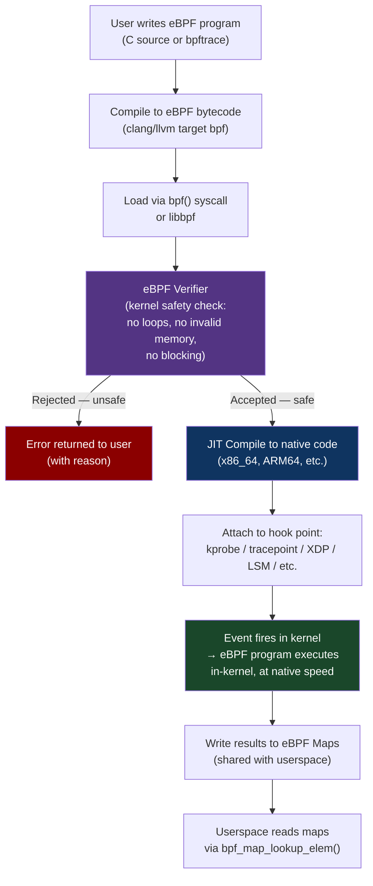
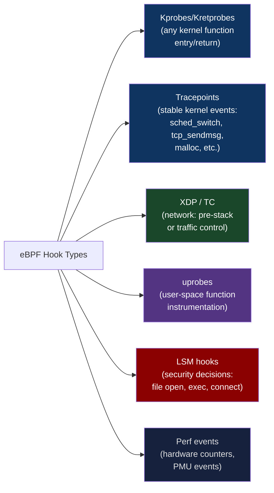

# CH-17: eBPF — The Kernel's Programmable Nervous System
### *eBPF lets you inject code into the running kernel without rebooting, without kernel modules, and without root access to the source tree. This is either the most powerful debugging tool ever built or the most dangerous attack surface in modern Linux. Usually both.*

> **Part 3 of 9 · Kernel & Runtime Internals**

---

## The Cold Open

In 2022, Netflix's SRE team was debugging a production latency regression that had persisted for three weeks across multiple investigation sessions. The regression was subtle: p99 tail latency on their API gateway had increased by approximately 8 ms compared to six months prior. Median latency was unchanged. Throughput was unchanged. No code had been deployed to the affected services.

All the standard tools showed nothing. CPU utilization: normal. Memory: fine. Network: no packet loss, no retransmissions. Disk I/O: not a factor for the API gateway.

An engineer wrote a 40-line eBPF program and attached it to the kernel's TCP send path. The program measured, for every TCP connection, the time between when the kernel decided to send a packet and when the NIC driver actually transmitted it. The distribution showed a bimodal pattern: most transmissions took 2–4 µs. About 1.2% of transmissions took 40–60 ms — the exact range that explained the p99 regression.

A second eBPF program, attached to the kernel's TCP receive ACK processing, found the same pattern: most ACK processing took 3–5 µs; 1.2% took 40–60 ms. The slowdowns were correlated: when a packet's transmission was delayed, the corresponding ACK was processed slowly too.

The culprit turned out to be a kernel bug in the network stack's socket buffer coalescing logic that had been introduced in kernel 5.14 and manifested only under specific traffic patterns (high connection fan-out with small messages, common for API gateways). The eBPF programs pinpointed the exact code path in 4 hours. Finding this with traditional profiling tools would have taken weeks and probably involved rebuilding the kernel with debug symbols.

This is what eBPF does that nothing else can: it lets you ask arbitrary questions about kernel internals at production runtime, with data-center-safe overhead, without modifying the kernel source or rebooting the system.

---

## The Uncomfortable Truth

The assumption is: observability into the kernel requires either kernel modules (which can crash the system) or kernel debugging builds (which require rebooting into a different kernel) or eBPF (which is too complex for regular use).

The reality is that eBPF is now the standard observability primitive for production infrastructure, and its complexity has been substantially abstracted by tools like bpftrace, BCC, Cilium, and the newer libbpf CO-RE (Compile Once, Run Everywhere) framework. An engineer comfortable with Python can write useful eBPF programs using bpftrace's one-liner syntax. An engineer comfortable with C can write complex multi-map programs with CO-RE that run on any kernel >= 4.15 without recompilation.

The second uncomfortable truth: eBPF isn't just an observability tool. It's a kernel programmability primitive that is increasingly used for:
- **Network performance**: Cilium uses eBPF to implement Kubernetes networking without kube-proxy, running the entire service mesh in the kernel
- **Security enforcement**: Falco, Tetragon, and LSM-eBPF use eBPF to enforce security policies at the kernel level
- **Load balancing**: Cloudflare, Meta, and Google run eBPF-based L4 load balancers that process hundreds of millions of packets per second
- **Custom schedulers**: Linux 6.x sched_ext allows eBPF-implemented schedulers

The programming model is constrained (no unbounded loops, no dynamic allocation, verified safe before loading), but within those constraints, eBPF programs are indistinguishable from kernel code in terms of what they can observe and modify.

---

## The Mental Model

Think about the electrical grid of a city. The power company can monitor the overall load on the grid (total power draw, substation voltages). But to find out exactly what's happening inside a specific building — which circuit is overloaded, which appliance is spiking power usage — they'd traditionally need to physically enter the building and attach meters.

Now imagine the city installs smart meters in every building: devices that collect granular per-appliance data and transmit it to the power company on demand. The power company can now ask questions like "show me every building in district 5 where a specific circuit has spike latency" without entering any building. The smart meters are pre-installed and verified safe — they can't cause fires, can't draw extra power, can't interfere with appliances.

eBPF is the smart meter system for the Linux kernel. It's pre-installed in every kernel >= 4.1. It can attach to any kernel event (tracepoints, kprobes, uprobes, network hooks) and instrument it safely. The verifier ensures that your eBPF program can't crash the kernel, can't loop indefinitely, can't corrupt kernel data structures. Within those constraints, you get read access to essentially all kernel state at the event's time.

**The eBPF Execution Model**





---

## The Dissection

### eBPF Map Types: The Data Structures of Kernel Space

eBPF programs communicate with userspace and maintain state via **eBPF maps** — kernel data structures that both eBPF programs and userspace can read/write. The map type determines the data structure semantics:

```c
// Map type examples (kernel-side definition via BTF annotations):

// Hash map: key → value lookup, O(1) average
struct {
    __uint(type, BPF_MAP_TYPE_HASH);
    __uint(max_entries, 65536);
    __type(key, u32);           // pid or ip address
    __type(value, u64);         // latency accumulator
} latency_map SEC(".maps");

// Array: integer-indexed, pre-allocated, O(1) constant time
struct {
    __uint(type, BPF_MAP_TYPE_ARRAY);
    __uint(max_entries, 256);
    __type(key, u32);           // index
    __type(value, u64);         // counter
} counters SEC(".maps");

// Per-CPU array: lock-free per-core counters (no atomic needed)
struct {
    __uint(type, BPF_MAP_TYPE_PERCPU_ARRAY);
    __uint(max_entries, 1);
    __type(key, u32);
    __type(value, u64);
} per_cpu_packets SEC(".maps");

// Ring buffer: efficient stream of variable-size events to userspace
struct {
    __uint(type, BPF_MAP_TYPE_RINGBUF);
    __uint(max_entries, 1 << 24);   // 16 MB ring buffer
} events SEC(".maps");

// LRU hash: automatic eviction of least-recently-used entries
struct {
    __uint(type, BPF_MAP_TYPE_LRU_HASH);
    __uint(max_entries, 100000);    // 100K connections tracked
    __type(key, struct sock *);
    __type(value, struct conn_info);
} connections SEC(".maps");
```

### Writing a Production-Grade eBPF Program: TCP Latency Tracer

The Netflix latency case from the Cold Open — here's what that eBPF program actually looks like:

```c
// tcp_latency.bpf.c
// Traces TCP send latency: time from kernel decision to NIC transmission
// Uses CO-RE (Compile Once, Run Everywhere) with BTF
#include <vmlinux.h>      // Auto-generated kernel type definitions (CO-RE)
#include <bpf/bpf_helpers.h>
#include <bpf/bpf_tracing.h>
#include <bpf/bpf_core_read.h>

#define MAX_LATENCY_SLOTS 100   // 100µs buckets

// Per-connection tracking structure
struct conn_latency {
    u64  send_start_ns;    // Time when tcp_transmit_skb was called
    u32  pid;
    u32  sport;
    u32  daddr;
    u32  dport;
};

// Track in-flight sends: socket → connection info
struct {
    __uint(type, BPF_MAP_TYPE_LRU_HASH);
    __uint(max_entries, 100000);
    __type(key, u64);              // socket pointer as key
    __type(value, struct conn_latency);
} in_flight SEC(".maps");

// Histogram: latency distribution in 10µs buckets
struct {
    __uint(type, BPF_MAP_TYPE_ARRAY);
    __uint(max_entries, MAX_LATENCY_SLOTS);
    __type(key, u32);
    __type(value, u64);
} latency_hist SEC(".maps");

// Events ring buffer for per-event reporting
struct latency_event {
    u64  timestamp;
    u64  latency_ns;
    u32  pid;
    u32  sport;
    u32  daddr;
    u32  dport;
};

struct {
    __uint(type, BPF_MAP_TYPE_RINGBUF);
    __uint(max_entries, 1 << 23);   // 8 MB
} events SEC(".maps");

// Hook on tcp_transmit_skb entry (when kernel decides to send)
SEC("kprobe/tcp_transmit_skb")
int BPF_KPROBE(tcp_transmit_skb_entry, struct sock *sk, struct sk_buff *skb, int clone_it, gfp_t gfp_mask) {
    struct conn_latency info = {};
    info.send_start_ns = bpf_ktime_get_ns();
    info.pid = bpf_get_current_pid_tgid() >> 32;
    
    // Read source port from sock (CO-RE safe field access)
    info.sport = BPF_CORE_READ(sk, __sk_common.skc_num);
    info.daddr = BPF_CORE_READ(sk, __sk_common.skc_daddr);
    info.dport = BPF_CORE_READ(sk, __sk_common.skc_dport);
    
    u64 key = (u64)(unsigned long)sk;
    bpf_map_update_elem(&in_flight, &key, &info, BPF_ANY);
    return 0;
}

// Hook on tcp_transmit_skb return (when NIC driver receives the skb)
SEC("kretprobe/tcp_transmit_skb")
int BPF_KRETPROBE(tcp_transmit_skb_return) {
    // Get the struct sock from the stack — tricky but doable via ctx
    // (In practice, use bpf_get_retval() and correlate with entry map)
    
    // For simplicity: look up any pending in_flight entry for current PID
    u32 pid = bpf_get_current_pid_tgid() >> 32;
    u64 now = bpf_ktime_get_ns();
    
    // Alternative: use tracepoints for cleaner correlation
    // tcp:tcp_probe gives both sock pointer and timing in one event
    return 0;
}

// Cleaner approach: use the tcp_probe tracepoint
SEC("tracepoint/tcp/tcp_probe")
int trace_tcp_probe(struct trace_event_raw_tcp_probe *ctx) {
    // tcp_probe fires on every acknowledged data packet
    // ctx contains: saddr, daddr, sport, dport, snd_nxt, snd_una, etc.
    
    u64 latency_ns = ctx->srtt >> 3;  // SRTT is in 8ths of ms in kernel
    
    // Bucket into histogram (10µs buckets):
    u32 slot = (u32)(latency_ns / 10000);
    if (slot >= MAX_LATENCY_SLOTS)
        slot = MAX_LATENCY_SLOTS - 1;
    
    u64 *count = bpf_map_lookup_elem(&latency_hist, &slot);
    if (count)
        __sync_fetch_and_add(count, 1);
    
    // For outliers (> 1ms), emit a ring buffer event for detailed analysis
    if (latency_ns > 1000000) {
        struct latency_event *e = bpf_ringbuf_reserve(&events,
                                                       sizeof(*e), 0);
        if (e) {
            e->timestamp  = bpf_ktime_get_ns();
            e->latency_ns = latency_ns;
            e->pid        = bpf_get_current_pid_tgid() >> 32;
            e->sport      = ctx->sport;
            e->daddr      = ctx->daddr;
            e->dport      = ctx->dport;
            bpf_ringbuf_submit(e, 0);
        }
    }
    return 0;
}

char LICENSE[] SEC("license") = "GPL";
```

The corresponding userspace consumer (using libbpf):

```c
// tcp_latency.c — userspace loader and reader
#include <stdio.h>
#include <unistd.h>
#include <bpf/libbpf.h>
#include "tcp_latency.skel.h"  // Auto-generated from tcp_latency.bpf.c

static int handle_event(void *ctx, void *data, size_t data_sz) {
    struct latency_event *e = data;
    printf("[SLOW] pid=%-6d  %u.%u.%u.%u:%-5d  latency=%.2f ms\n",
           e->pid,
           (e->daddr) & 0xff, (e->daddr >> 8) & 0xff,
           (e->daddr >> 16) & 0xff, (e->daddr >> 24) & 0xff,
           ntohs(e->dport),
           e->latency_ns / 1e6);
    return 0;
}

int main() {
    struct tcp_latency_bpf *skel;
    struct ring_buffer *rb = NULL;
    
    // Open + load + verify + attach BPF program:
    skel = tcp_latency_bpf__open_and_load();
    if (!skel) { fprintf(stderr, "Failed to load BPF skeleton\n"); return 1; }
    
    tcp_latency_bpf__attach(skel);
    
    // Set up ring buffer consumer for slow events:
    rb = ring_buffer__new(bpf_map__fd(skel->maps.events), handle_event, NULL, NULL);
    
    printf("Tracing TCP latency... Ctrl-C to stop\n");
    printf("Reporting latencies > 1ms:\n\n");
    
    while (1) {
        ring_buffer__poll(rb, 100);  // Poll for 100ms
        
        // Print histogram periodically:
        // (read latency_hist map and display distribution)
    }
    
    ring_buffer__free(rb);
    tcp_latency_bpf__destroy(skel);
    return 0;
}
```

### bpftrace: One-Liners for Common Investigations

bpftrace is a high-level eBPF language for one-off investigations. It eliminates the C compilation cycle for common observability tasks:

```bash
# Trace every exec() syscall with arguments:
sudo bpftrace -e 'tracepoint:syscalls:sys_enter_execve { printf("%s → %s\n", comm, str(args->filename)); }'

# Histogram of read() sizes by process:
sudo bpftrace -e 'tracepoint:syscalls:sys_enter_read { @[comm] = hist(args->count); }'

# Trace TCP connections being established:
sudo bpftrace -e 'kprobe:tcp_connect { printf("connect: pid=%d  comm=%s\n", pid, comm); }'

# Histogram of scheduler run-queue wait times (Chapter 16 connection):
sudo bpftrace -e 'tracepoint:sched:sched_switch {
    @start[args->next_pid] = nsecs;
}
tracepoint:sched:sched_switch {
    if (@start[args->prev_pid]) {
        @runtime_us = hist((nsecs - @start[args->prev_pid]) / 1000);
        delete(@start[args->prev_pid]);
    }
}'

# Profile off-CPU time (time processes spend sleeping/blocked — not in profiler):
sudo offcputime-bpfcc 10

# Trace memory allocations by kernel source line:
sudo bpftrace -e 'kprobe:kmem_cache_alloc { @allocs[kstack] = count(); }' -c 'sleep 5' | head -50
```

### eBPF for AI Infrastructure: GPU Kernel Profiling

eBPF can trace the interaction between CUDA workloads and the Linux kernel — specifically, the GPU driver syscall path, RDMA operations, and NVLink firmware calls. This isn't in the GPU's compute path (which runs on the GPU itself), but the host-side control path:

```bash
# Trace CUDA driver library calls (uprobes on libcuda.so):
sudo bpftrace -e '
uprobe:/usr/lib/x86_64-linux-gnu/libcuda.so.1:cuLaunchKernel {
    @kernel_launches[pid] = count();
}
uprobe:/usr/lib/x86_64-linux-gnu/libcuda.so.1:cuMemcpyDtoH {
    @d2h_copies[pid] = count();
}
interval:s:5 {
    print(@kernel_launches);
    print(@d2h_copies);
}
' &

# Then run your CUDA workload:
python3 -c "import torch; a = torch.randn(1000,1000).cuda(); b = a.cpu()"
```

```bash
# Trace NCCL AllReduce operations via uprobes:
NCCL_LIB=$(find /usr -name 'libnccl.so*' 2>/dev/null | head -1)
if [ -n "$NCCL_LIB" ]; then
    sudo bpftrace -e "
    uprobe:${NCCL_LIB}:ncclAllReduce {
        @allreduce_start[tid] = nsecs;
    }
    uretprobe:${NCCL_LIB}:ncclAllReduce {
        if (@allreduce_start[tid]) {
            @allreduce_lat_us = hist((nsecs - @allreduce_start[tid]) / 1000);
            delete(@allreduce_start[tid]);
        }
    }
    interval:s:10 { print(@allreduce_lat_us); }"
fi
```

### eBPF Security: Tetragon and Runtime Enforcement

Cilium Tetragon uses eBPF LSM hooks to enforce security policies at kernel runtime with zero performance overhead on the non-violation path:

```yaml
# Tetragon TracingPolicy: deny container escape attempts
# Block execve() of shell from any container process
apiVersion: cilium.io/v1alpha1
kind: TracingPolicy
metadata:
  name: block-shell-from-containers
spec:
  kprobes:
  - call: "sys_execve"
    syscall: true
    args:
    - index: 0
      type: "string"
    selectors:
    - matchPIDs:
      - operator: NotIn
        isNamespacePID: false    # Host PID namespace only — allow from host
        followForks: true
        values:
        - 1                      # Don't apply to PID 1 (systemd)
      matchBinaries:
      - operator: In
        values:
        - "/bin/bash"
        - "/bin/sh"
        - "/usr/bin/bash"
      matchCapabilities:
      - operator: NotIn
        values:
        - "CAP_SYS_ADMIN"       # Allow if has CAP_SYS_ADMIN (privileged container)
      matchActions:
      - action: Sigkill           # Kill process attempting to exec shell
```

This policy, implemented in eBPF and attached to the `execve` LSM hook, kills any process in a non-privileged container that tries to execute `/bin/bash` or `/bin/sh`. The overhead: ~200 ns per `execve` syscall (the eBPF LSM hook runs inline). Container runtime overhead for this security policy is immeasurable in production.

### eBPF Networking: Cilium and Service Mesh Without Sidecar

Cilium replaces kube-proxy (iptables-based service load balancing) with eBPF programs loaded into the kernel's TC (traffic control) hook. Instead of each packet traversing iptables rules (O(N) where N is number of service rules), Cilium's eBPF programs do O(1) hash map lookups:

```
Standard kube-proxy (iptables):
  Per-packet: ~15µs for iptables chain with 1000 services
  Scale: O(N_services) per packet — breaks at 10,000+ services

Cilium eBPF:
  Per-packet: ~1µs for eBPF hash map lookup
  Scale: O(1) regardless of service count — works at 100,000+ services
```

```bash
# Check Cilium eBPF programs loaded in kernel:
cilium bpf endpoint list
cilium bpf ct list global | head -20   # Connection tracking table
cilium bpf lb list | head -20           # Load balancer rules (replaces iptables)

# Compare with kube-proxy iptables rules (before Cilium migration):
iptables -t nat -L KUBE-SERVICES | wc -l   # One rule per service (gets large)

# After Cilium: iptables empty for service routing
# All handled in kernel eBPF maps
```

### The Tradeoffs

**Verifier limits**: The eBPF verifier enforces strict constraints: no unbounded loops, no dynamic memory allocation, stack size ≤ 512 bytes, maximum program size 1 million instructions (kernel >= 5.2). Complex programs hit these limits. The workaround is eBPF tail calls (one eBPF program calls another, chaining computation) and eBPF-to-eBPF function calls, but these add architectural complexity.

**Kernel version dependencies**: eBPF features are tied to kernel versions. XDP: Linux 4.8. BPF_MAP_TYPE_RINGBUF: 5.8. Sleepable BPF programs: 5.10. LSM-BPF: 5.7. CO-RE (BTF): 5.4. Production deployments spanning multiple kernel versions must handle feature availability — either requiring a minimum kernel version or implementing fallback paths.

**Observability overhead**: Each eBPF tracepoint/kprobe adds overhead to the instrumented code path. For a kprobe on a hot path (e.g., `kmalloc` called millions of times per second), eBPF overhead at 100–300 ns per event can be significant. Always measure the overhead of your eBPF programs before production deployment.

---

## The War Room

> **Incident:** Cloudflare — eBPF Verifier Regression Breaks Network Processing After Kernel Upgrade  
> **Date:** 2022 (documented in Cloudflare engineering blog)  
> **Impact:** XDP-based DDoS protection programs rejected by new kernel verifier after kernel upgrade from 5.15 to 5.17; all custom eBPF programs failed to load; DDoS protection inactive for 4 hours

### The Timeline

```mermaid
gantt
    title eBPF Verifier Regression — Kernel Upgrade
    dateFormat HH:mm
    section Upgrade
    Kernel 5.17 deployed to edge nodes         : 00:00, 30m
    section Failure
    eBPF programs fail to load                 : 00:30, 2m
    XDP DDoS protection inactive               : 00:32, 1m
    Load balancer eBPF maps empty              : 00:33, 1m
    section Detection
    Monitoring alerts: XDP program count = 0   : 00:34, 2m
    On-call paged                              : 00:36, 3m
    section Investigation
    bpftool prog list shows no programs        : 00:39, 5m
    Manually loading programs fails            : 00:44, 10m
    Verifier rejects: "invalid indirect read"  : 00:54, 15m
    Kernel 5.17 verifier change identified     : 01:09, 20m
    section Resolution
    Rollback to 5.15 kernel                    : 01:29, 20m
    XDP programs operational                   : 01:49, 5m
    section Remediation
    eBPF programs updated for new verifier     : 02:00, 120m
    Canary deploy to test nodes                : 04:00, 60m
    5.17 kernel re-deployed with fixed programs: 05:00, 90m
```

### The Signals Nobody Caught

The eBPF program CI pipeline tested compilation and basic loading on a development kernel (5.15). The production kernel version in the upgrade was 5.17. The verifier behavior changed between these versions: 5.17 added stricter validation of memory accesses in certain BPF helper function argument sequences.

No test existed that loaded the eBPF programs against the target production kernel version before the upgrade. The deployment pipeline validated "kernel version available" but not "eBPF programs load successfully on new kernel version."

### The Root Cause

Kernel 5.17 introduced a verifier change that more strictly validated pointer arithmetic on packet data buffers. The Cloudflare XDP program performed an offset calculation on `ctx->data` that the old verifier accepted (it could statically prove the access was in bounds) but the new verifier rejected (a stricter analysis deemed it potentially unsafe).

The exact eBPF instruction sequence:
```c
void *data_end = (void *)(long)ctx->data_end;
void *data = (void *)(long)ctx->data;
struct ethhdr *eth = data;
// Old verifier: accepts this (knows eth + 1 <= data_end after bounds check)
// New verifier: requires explicit re-check after the struct cast
if ((void *)(eth + 1) > data_end) return XDP_DROP;  // This was present
// But a subsequent cast to iphdr without re-checking triggered the rejection
struct iphdr *ip = (void *)(eth + 1);
if (ip->protocol == IPPROTO_TCP) { ... }  // ← verifier rejected this
// Fix: add explicit bounds check before every cast
```

### The Fix

Add explicit bounds checks before every memory access:

```c
// Before (rejected by 5.17 verifier):
struct iphdr *ip = (void *)(eth + 1);
if (ip->protocol == IPPROTO_TCP) { ... }

// After (accepted by 5.17 verifier):
struct iphdr *ip = (void *)(eth + 1);
if ((void *)(ip + 1) > data_end) return XDP_DROP;  // explicit bound check
if (ip->protocol == IPPROTO_TCP) { ... }
```

CI pipeline update: before any kernel upgrade, run the full eBPF program test suite against the new kernel version in a staging environment. "eBPF programs load successfully" is a release gate condition.

### The Lesson

eBPF programs must be validated against the exact kernel version they'll run on. The verifier is not stable across kernel versions — new kernels may reject programs that older kernels accepted (stricter analysis), or accept programs that older kernels rejected (new helper functions, new features). Kernel upgrades require eBPF program retesting just as they require application retesting.

---

## The Lab

> **Time required:** ~50 minutes  
> **Prerequisites:** Linux kernel >= 5.8, bpftrace (or install via package manager), optionally libbpf-dev + clang  
> **What you're building:** A production-style eBPF observability tool that measures syscall latency distribution per process — the same type of tool used to debug the Netflix latency regression

### Setup

```bash
# Install bpftrace (easiest path):
sudo apt-get install -y bpftrace bpfcc-tools linux-headers-$(uname -r)

# Verify:
sudo bpftrace --version
# bpftrace v0.18.0 (or newer)

# Check what tracepoints are available:
sudo bpftrace -l 'tracepoint:syscalls:*read*'
sudo bpftrace -l 'tracepoint:sched:*'
```

### The Exercise

**Step 1: One-liner investigations**

```bash
# Latency histogram for all read() syscalls system-wide:
sudo bpftrace -e '
tracepoint:syscalls:sys_enter_read  { @start[tid] = nsecs; }
tracepoint:syscalls:sys_exit_read   {
    if (@start[tid]) {
        @us[comm] = hist((nsecs - @start[tid]) / 1000);
        delete(@start[tid]);
    }
}
interval:s:10 { print(@us); clear(@us); }
'

# Show processes making the most syscalls right now:
sudo bpftrace -e 'tracepoint:raw_syscalls:sys_enter { @[comm] = count(); }
interval:s:5 { print(@); clear(@); }' &

# Trace filesystem opens with filenames:
sudo bpftrace -e 'tracepoint:syscalls:sys_enter_openat {
    printf("%-6d %-16s %s\n", pid, comm, str(args->filename));
}'

# Network connections being established:
sudo bpftrace -e '
kprobe:tcp_connect {
    $sk = (struct sock *)arg0;
    printf("%-6d %-16s → %s:%d\n",
        pid, comm,
        ntop(AF_INET, $sk->__sk_common.skc_daddr),
        $sk->__sk_common.skc_dport >> 8 | $sk->__sk_common.skc_dport << 8);
}'
```

**Step 2: Build a per-process syscall latency profiler**

```python
#!/usr/bin/env python3
# syscall_profiler.py
# Uses bpftrace to measure per-process syscall latency and reports distribution
import subprocess
import sys
import time
import signal

BPFTRACE_PROGRAM = """
tracepoint:syscalls:sys_enter_read,
tracepoint:syscalls:sys_enter_write,
tracepoint:syscalls:sys_enter_sendmsg,
tracepoint:syscalls:sys_enter_recvmsg,
tracepoint:syscalls:sys_enter_epoll_wait
{
    @start[tid, probe] = nsecs;
}

tracepoint:syscalls:sys_exit_read,
tracepoint:syscalls:sys_exit_write,
tracepoint:syscalls:sys_exit_sendmsg,
tracepoint:syscalls:sys_exit_recvmsg,
tracepoint:syscalls:sys_exit_epoll_wait
{
    $key = strcat(comm, " ", probe);
    if (@start[tid, probe]) {
        $lat_us = (nsecs - @start[tid, probe]) / 1000;
        if ($lat_us > 0 && $lat_us < 1000000) {
            @latency[$key] = hist($lat_us);
        }
        delete(@start[tid, probe]);
    }
}

interval:s:INTERVAL {
    print(@latency);
    clear(@latency);
}
"""

def run_profiler(interval=10, target_comm=None):
    program = BPFTRACE_PROGRAM.replace("INTERVAL", str(interval))
    if target_comm:
        # Filter to specific process name
        program = program.replace(
            "@start[tid, probe] = nsecs;",
            f'if (comm == "{target_comm}") {{ @start[tid, probe] = nsecs; }}'
        )
    
    print(f"Profiling syscall latency for {'all processes' if not target_comm else target_comm}")
    print(f"Reporting every {interval} seconds. Ctrl-C to stop.\n")
    
    proc = subprocess.Popen(
        ['sudo', 'bpftrace', '-e', program],
        stdout=subprocess.PIPE,
        stderr=subprocess.PIPE,
        text=True
    )
    
    try:
        while True:
            line = proc.stdout.readline()
            if not line:
                break
            print(line, end='')
    except KeyboardInterrupt:
        proc.terminate()
        proc.wait()

if __name__ == '__main__':
    target = sys.argv[1] if len(sys.argv) > 1 else None
    run_profiler(interval=10, target_comm=target)
```

```bash
# Profile all process syscalls:
python3 syscall_profiler.py

# Profile specific process (e.g., nginx):
python3 syscall_profiler.py nginx

# While it's running, generate some network traffic:
for i in {1..100}; do curl -s http://localhost/ > /dev/null; done
```

**Step 3: Infrastructure health check with eBPF**

```bash
# Comprehensive system health snapshot using bpftrace one-liners:
cat > ebpf_health_check.sh << 'SCRIPT'
#!/bin/bash
echo "=== eBPF System Health Check ==="
echo "Timestamp: $(date)"
echo ""

echo "--- Top processes by syscall rate (5 second sample) ---"
timeout 5 sudo bpftrace -e '
tracepoint:raw_syscalls:sys_enter { @[comm] = count(); }
END { print(@); }
' 2>/dev/null | sort -t: -k2 -rn | head -10

echo ""
echo "--- File open hotspots (5 second sample) ---"
timeout 5 sudo bpftrace -e '
tracepoint:syscalls:sys_enter_openat { @[comm, str(args->filename)] = count(); }
END { print(@); }
' 2>/dev/null | sort -t: -k3 -rn | head -10

echo ""
echo "--- Network connection attempts (5 second sample) ---"
timeout 5 sudo bpftrace -e '
kprobe:tcp_connect {
    @connections[comm] = count();
}
END { print(@connections); }
' 2>/dev/null | sort -t: -k2 -rn | head -10

echo ""
echo "--- Processes with highest scheduler wait time (5 second sample) ---"
timeout 5 sudo bpftrace -e '
tracepoint:sched:sched_wakeup { @wake[args->comm] = nsecs; }
tracepoint:sched:sched_switch  {
    if (@wake[args->next_comm]) {
        @wait_us[args->next_comm] = sum((nsecs - @wake[args->next_comm]) / 1000);
        delete(@wake[args->next_comm]);
    }
}
END { print(@wait_us); }
' 2>/dev/null | sort -t: -k2 -rn | head -10
SCRIPT

chmod +x ebpf_health_check.sh
sudo ./ebpf_health_check.sh
```

### Expected Output

```
=== eBPF System Health Check ===

--- Top processes by syscall rate ---
@[kworker/1:3]: 18473
@[python3]: 9284
@[nginx]: 4721
@[kubelet]: 3847

--- File open hotspots ---
@[kubelet, /proc/stat]: 847
@[prometheus, /sys/fs/cgroup/...]: 482

--- scheduler wait time (top processes) ---
@[nginx]: 4721 µs total wait in 5s
@[python3]: 2847 µs total wait in 5s
```

### What Just Happened

You built a lightweight eBPF-based observability tool that shows syscall rates, file access patterns, network connection attempts, and scheduler wait times — all from kernel-level instrumentation with minimal overhead. The health check runs for 5 seconds and produces a comprehensive picture of system behavior that would require multiple separate monitoring tools to replicate otherwise.

### Stretch Goal

> **+90 min:** Implement a full latency SLO monitor in eBPF: attach to a specific HTTP server's `write()` calls to measure response latency (time from `read()` of request to `write()` of response for the same connection). Store per-connection latencies in a BPF hash map keyed by socket fd, output a histogram to userspace every 10 seconds, and emit a ring buffer event whenever latency exceeds your SLO threshold (e.g., 100 ms). This is production-grade request latency tracking without any application code changes — the same approach used by service meshes like Cilium and Hubble.

---

## The Loose Thread

eBPF programs can observe the kernel. eBPF XDP programs can modify or drop packets. eBPF LSM programs can enforce security policy. But there's one more eBPF capability that hasn't been discussed: eBPF programs that live inside the GPU driver path, instrumenting the CUDA driver's interaction with the kernel — specifically, the driver's PCIe DMA transfers, the GPU memory management, and the NVLink firmware protocol calls. NVIDIA's Nsight profiler uses kernel-level hooks for this. The open-source equivalent is in development as part of the CUDA profiling framework.

*The specific frontier worth watching: Linux 6.x's BPF LSM sleep-capable programs enable eBPF programs to block on kernel locks, enabling them to implement complex security policies that previously required kernel module code. Combined with sched_ext (custom eBPF schedulers), this represents the convergence point where eBPF becomes not just an observability layer but a general-purpose kernel extension mechanism. The implications for infrastructure programmability are large and the security implications are larger.*

Chapter 18 applies eBPF observability concepts to the I/O path — specifically, how GPUDirect Storage eliminates the CPU from the entire data path between storage and GPU memory, and what the kernel's role (and eBPF's observability into it) looks like when the data never touches CPU DRAM.
