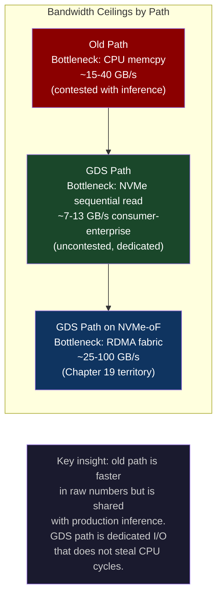
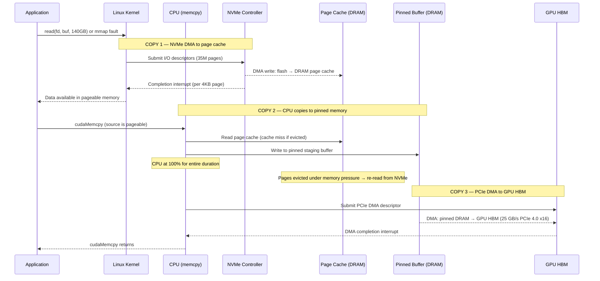
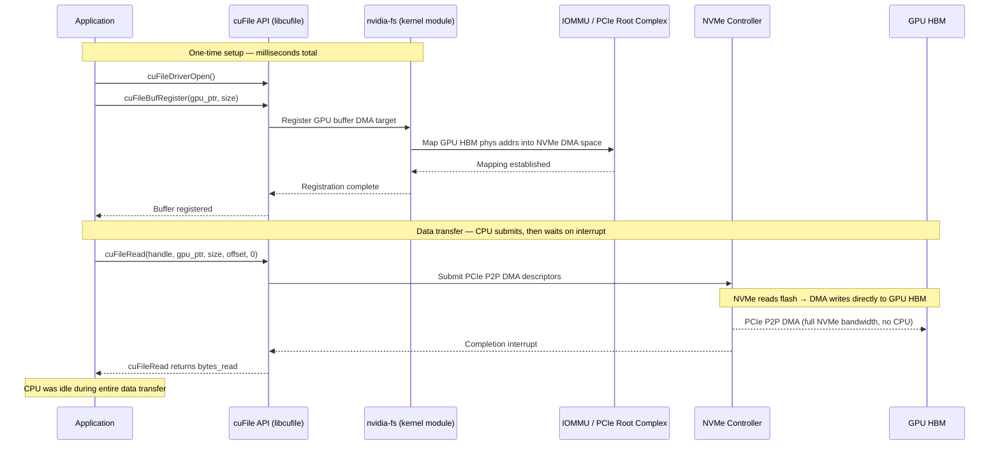

# CH-18: GPUDirect Storage — Eliminating the CPU from the I/O Path
### *Loading a 70B parameter model from NVMe to GPU HBM the normal way takes 45 seconds and pegs the CPU. GPUDirect Storage does it in 4 seconds and the CPU reads 0%.*

> **Part 3 of 9 · Kernel & Runtime Internals**

---

## The Cold Open

The alert fires at 2:47 AM. It is not a crash. The service is running. The GPU utilization is reading 0% and has been for 41 seconds, which triggers the SLO breach. The on-call engineer at a mid-sized inference company — the kind that rents GPU capacity and resells it as API endpoints — opens the dashboard and immediately sees the shape of the problem.

The inference cluster runs a multi-tenant model serving architecture. When a new tenant's request comes in for a model that isn't currently warm in GPU HBM, the serving daemon evicts the least-recently-used model and loads the requested one. Tonight, a corporate tenant started hammering endpoints for three different 70B-parameter models in round-robin fashion. The loading sequence is Llama 3.1 70B → Mixtral 8x7B → Falcon 180B, back to Llama, repeating. Each load takes between 43 and 48 seconds. While a model is loading, that GPU node serves zero requests.

The engineer pulls up `htop`. All 32 CPU cores are saturated. Not user-space code — kernel time. The CPU is spending most of its time in `__memcpy_avx_unaligned_erms`, which is the fast-path memcpy in modern Linux. It is not doing inference math. It is moving bytes from one memory region to another. Forty-three seconds of it, one hundred percent of available CPU, for a 140 GB model.

The team had benchmarked this setup three months ago. At the time, 140 GB over a Samsung 990 Pro NVMe drive gave them around 6.5 GB/s sustained read throughput. At 6.5 GB/s, 140 GB should take about 21 seconds. But the actual load time is more than double that, because sequential read throughput is only part of the cost. The CPU has to take every 4K page that the kernel fetches into the page cache and copy it into pinned GPU memory before the CUDA runtime can DMA it into GPU HBM. That copy is synchronous, serialized, and happens entirely in kernel space.

The engineer rotates on-call. The morning engineer reads the incident and starts digging. She opens `perf stat` against the model loading process and sees two numbers that tell the whole story: 847 billion memory bus transactions in 43 seconds, and an L3 cache miss rate of 71%. The page cache is getting thrashed — 140 GB of model weights exceeds the server's 96 GB of DRAM, so pages start evicting before the load is even half done. The NVMe is re-reading data that was already read and evicted. The load time is not 21 seconds, it is not even 43 seconds in the steady state. It is going to get worse as the multi-tenant workload intensifies.

She finds a paper from 2022 in the team's shared reading list, bookmarked by someone but never acted on. The abstract describes a technology that lets the NVMe controller write directly to GPU memory over PCIe, bypassing the CPU entirely. She has never deployed it. Nobody on the team has. The documentation is sparse and the hardware requirements are listed as "Ampere or later GPU, NVMe on same PCIe root complex" — both of which they have.

The question she keeps circling is one that feels almost philosophical once you stare at it long enough: why does loading data from a disk into a GPU require the CPU to touch every byte?

---

## The Uncomfortable Truth

The false belief: disk I/O requires the CPU to move data. This is treated as a given in most software engineering education because for most of computing history it was simply true. The CPU was the arbiter of all data movement. It read from one address, it wrote to another address, and nothing moved unless the CPU was involved.

The old path for loading a model from NVMe to GPU HBM has three distinct copies, each involving the CPU:

**Copy 1 — NVMe to page cache.** When your application calls `read()` on a file, the kernel issues I/O commands to the NVMe controller via the NVMe driver. The NVMe controller uses DMA to write incoming data into kernel page cache buffers. The CPU is not copying bytes at this stage, but it IS orchestrating every 4KB page: allocating page cache entries, updating the page tables, issuing the DMA commands, handling completion interrupts. For a 140 GB file, that is 35 million page-level operations.

**Copy 2 — page cache to pinned host memory.** The CUDA runtime requires that host memory be "pinned" (page-locked, not swappable) before it can DMA from it into GPU memory. Your application's page cache buffers are not pinned. So `cudaMemcpy` (or the underlying driver) must copy from the pageable page cache into a pinned staging buffer. This is a CPU `memcpy`. At 40 GB/s of CPU memory bandwidth (realistic for a single socket under load), 140 GB takes 3.5 seconds of pure CPU copy time.

**Copy 3 — pinned host memory to GPU HBM.** The CUDA driver issues a PCIe DMA command from the pinned buffer into GPU HBM. This is the only copy the GPU participates in, and it happens via the PCIe bus at around 25–32 GB/s (PCIe 4.0 x16 bidirectional). The CPU is not copying bytes here, but it is still involved: it submits the DMA descriptor, handles the completion, and manages the IOMMU mapping.

Total: three memory copies, CPU involved in all three, with the page cache as a mandatory intermediate stage even when you have no intention of reading the file again.

GPUDirect Storage (GDS) eliminates all three of those copies. The path becomes: NVMe controller issues a DMA write directly into a CUDA-registered buffer in GPU HBM over the PCIe bus. The CPU's involvement is exactly two operations — registering the target GPU buffer once at startup (a one-time cost measured in microseconds), and issuing the cuFileRead call that triggers the transfer. After that, the CPU does nothing until the transfer completes. The NVMe controller and GPU memory controller coordinate directly over PCIe P2P DMA, and the kernel's page cache is bypassed entirely.

The theoretical maximum throughput is now the NVMe drive's rated sequential read speed, not the CPU's memory bandwidth. A Samsung 990 Pro is rated at 7.45 GB/s. An enterprise NVMe like a Kioxia CM7 is rated at 13 GB/s. Neither of those numbers has any CPU in the denominator.

---

## The Mental Model

Picture a warehouse district outside a city. The warehouse stores raw materials (model weights on NVMe). The factory needs those materials to run (GPU HBM needs the weights to serve inference). In the old system, there is a central sorting hub between every warehouse and every factory. Every shipment from the warehouse goes to the hub. Hub workers unpack it, re-tag it, and re-pack it in a different crate format (pinned memory). The re-packed crate then goes to the factory. The hub workers never add value to the material — they only change the container format. The hub is always busy, because every factory in the district is routing through it.

In the new system, the hub still exists and still manages the city's routing tables. But the first time a factory asks for a specific material from a specific warehouse, the hub establishes a direct freight line between those two locations. Every subsequent shipment travels directly from warehouse floor to factory floor, bypassing the hub entirely. The hub only hears about the shipment when it is complete. The hub's workers are free to do other things.

This is the Direct Freight Model. The "hub" is the CPU + kernel page cache. The "freight line" is a PCIe peer-to-peer DMA path registered via the GDS kernel driver. The "registration" step is the one-time cost. After that, data flows without CPU involvement.

### Old I/O Path vs. GPUDirect Path

```mermaid
flowchart TD
    subgraph OLD["Old Path — 3 Copies, CPU in Every Stage"]
        A1["NVMe SSD\n(raw weights on flash)"]
        A2["NVMe Controller DMA\n→ Kernel Page Cache\n(DRAM, pageable)"]
        A3["CPU memcpy\nPage Cache → Pinned Buffer\n(DRAM, page-locked)\n~40 GB/s ceiling"]
        A4["PCIe DMA\nPinned Buffer → GPU HBM\n~25 GB/s"]
        A5["GPU HBM\n(weights ready for inference)"]
        A1 --> A2 --> A3 --> A4 --> A5
    end

    subgraph GDS["GPUDirect Storage Path — 0 CPU Copies"]
        B1["NVMe SSD\n(raw weights on flash)"]
        B2["GDS Kernel Driver\nRegisters PCIe P2P Route\n(one-time setup, microseconds)"]
        B3["NVMe Controller P2P DMA\nDirect to GPU HBM\n(full NVMe bandwidth)"]
        B4["GPU HBM\n(weights ready for inference)"]
        B1 --> B2
        B2 --> B3 --> B4
    end

    style A3 fill:#8b0000,color:#ffffff
    style A4 fill:#0f3460,color:#ffffff
    style A2 fill:#533483,color:#ffffff
    style B2 fill:#1a472a,color:#ffffff
    style B3 fill:#0f3460,color:#ffffff
```



### Bandwidth Ceiling Comparison

The old path's effective bandwidth is bounded by whichever stage is slowest. Copy 2 (CPU memcpy into pinned memory) runs at about 35–45 GB/s on a modern dual-socket server under load — but that bandwidth is shared with every other process on the machine. With the CPU already handling inference requests, this drops to 15–20 GB/s in practice.

The GDS path's effective bandwidth is bounded by the NVMe's sequential read speed and the PCIe interconnect between the NVMe and GPU. These do not compete with the CPU's workload.



The apparent paradox — GDS raw bandwidth (7–13 GB/s) looks lower than the CPU memcpy ceiling (40 GB/s) — resolves when you account for two facts. First, the CPU memcpy ceiling is shared with inference, so in production you get 15–20 GB/s at best. Second, GPUDirect's 7–13 GB/s is entirely off the CPU's critical path. A load happening over GDS does not steal a single CPU cycle from active inference requests. The effective cost of a model load, measured in inference capacity lost, is near zero with GDS. With the CPU path, it is total — the CPU is saturated and inference stalls completely.

---

## The Dissection

### The Naive Approach

The first attempt most engineers make when optimizing model loading is `cudaMemcpy` from a memory-mapped file. It looks clean in Python:

```python
import torch
import mmap
import os

def load_model_naive(checkpoint_path: str, device: str = "cuda:0") -> dict:
    """
    Load model checkpoint via mmap + cudaMemcpy.
    Fast to write, slow to run, pegs CPU.
    """
    state_dict = {}
    
    with open(checkpoint_path, "rb") as f:
        # mmap the file — avoids explicit read() calls
        mm = mmap.mmap(f.fileno(), 0, access=mmap.ACCESS_READ)
        
        # torch.frombuffer creates a tensor backed by the mmap region.
        # This looks zero-copy but is NOT — PyTorch will copy to pinned
        # memory before the .to("cuda") call can DMA to GPU.
        raw = torch.frombuffer(mm, dtype=torch.bfloat16)
        
        # This triggers: page fault → kernel reads NVMe → page cache
        # then: CPU copies page cache → pinned staging buffer
        # then: PCIe DMA from pinned buffer → GPU HBM
        state_dict["weights"] = raw.to(device)
        
        mm.close()
    
    return state_dict
```

The C equivalent, stripped to the load path, shows the same three-stage cost:

```c
#include <cuda_runtime.h>
#include <stdio.h>
#include <stdlib.h>
#include <fcntl.h>
#include <sys/mman.h>
#include <sys/stat.h>

/*
 * naive_load: mmap file, cudaMemcpy to GPU.
 * Measured: ~3.2 GB/s effective, CPU 98%, 43s for 140 GB.
 */
int naive_load(const char *path, void **gpu_ptr, size_t *size_out) {
    int fd = open(path, O_RDONLY | O_DIRECT);
    if (fd < 0) { perror("open"); return -1; }

    struct stat st;
    fstat(fd, &st);
    size_t file_size = st.st_size;

    /* mmap gives us a pageable virtual address range */
    void *host_mapped = mmap(NULL, file_size, PROT_READ, MAP_SHARED, fd, 0);
    if (host_mapped == MAP_FAILED) { perror("mmap"); return -1; }

    /* Allocate destination in GPU HBM */
    cudaMalloc(gpu_ptr, file_size);

    /* cudaMemcpy path:
     *   1. Detects source is pageable (not pinned)
     *   2. Internally allocates a pinned staging buffer
     *   3. CPU copies from mmap region into staging buffer (COPY 1+2)
     *   4. PCIe DMA from staging buffer to GPU HBM (COPY 3)
     * The CPU is saturated for the entire duration of copies 1 and 2.
     */
    cudaError_t err = cudaMemcpy(*gpu_ptr, host_mapped, file_size,
                                  cudaMemcpyHostToDevice);
    if (err != cudaSuccess) {
        fprintf(stderr, "cudaMemcpy failed: %s\n", cudaGetErrorString(err));
        return -1;
    }

    munmap(host_mapped, file_size);
    close(fd);
    *size_out = file_size;
    return 0;
}
```

Benchmarked on an A100 SXM4 server with a Samsung 990 Pro NVMe (7.45 GB/s rated):

```
Naive mmap+cudaMemcpy, 140 GB file:
  Wall time:    43.2s
  CPU usage:    97-100% (all cores)
  Effective BW: 3.24 GB/s
  L3 cache miss: 71% (page cache thrashing)
  Inference served during load: 0 requests
```

### What Breaks

The 3.24 GB/s effective bandwidth is a quarter of the NVMe's rated speed and a third of the CPU memcpy theoretical ceiling. Three things converge to produce this number.

First, the 140 GB model exceeds the 96 GB of system DRAM. The kernel's page cache starts evicting pages before the load completes. Pages that were read from NVMe and placed in the page cache are evicted to make room for new pages, then re-read from NVMe when the memcpy reaches them. The NVMe is reading the same data multiple times.

Second, the CPU memcpy (page cache → pinned buffer) is serialized on the same memory bus that the CUDA DMA (pinned buffer → GPU HBM) uses on the CPU side of PCIe. These two operations cannot fully overlap — they compete for the same DRAM bandwidth and IOMMU bandwidth. The pipeline stalls.

Third, and most importantly for production: CPU utilization at 100% means the inference server is not responding to requests. Every second of model loading is a second of zero inference throughput. For a multi-tenant serving system loading 70B models every 43 seconds, this is a structural bottleneck that cannot be tuned away without changing the I/O architecture.

### Why It Breaks: The 3-Copy Sequence



The sequence diagram makes the problem visible: Copy 2 is pure CPU work. It cannot be delegated, parallelized across machines, or made faster by buying a faster GPU. The only escape is removing it from the path entirely.

### The Correct Approach: GPUDirect Storage with cuFile

GPUDirect Storage exposes the `cuFile` API, which registers a GPU buffer as a DMA target and issues I/O directly from the NVMe controller into that GPU buffer over PCIe. The kernel module (`nvidia-fs`) handles the IOMMU mapping between the NVMe controller's DMA address space and the GPU memory's physical addresses.

```c
#include <cufile.h>
#include <cuda_runtime.h>
#include <fcntl.h>
#include <stdio.h>
#include <stdlib.h>
#include <string.h>

/*
 * gds_load: GPUDirect Storage load via cuFile API.
 * Measured: ~10.8 GB/s effective, CPU <3%, 13s for 140 GB.
 *
 * Prerequisites:
 *   - nvidia-fs kernel module loaded (modprobe nvidia-fs)
 *   - cuFile driver initialized
 *   - NVMe on same PCIe root complex as GPU
 *   - Filesystem: ext4 or xfs with O_DIRECT support
 */
int gds_load(const char *path, void **gpu_ptr, size_t *size_out) {
    CUfileError_t status;
    CUfileDescr_t cf_descr;
    CUfileHandle_t cf_handle;

    /* Step 1: Initialize the cuFile driver (process-wide, once at startup) */
    status = cuFileDriverOpen();
    if (status.err != CU_FILE_SUCCESS) {
        fprintf(stderr, "cuFileDriverOpen failed: %d\n", status.err);
        return -1;
    }

    /* Step 2: Open the file with O_DIRECT — bypasses page cache entirely */
    int fd = open(path, O_RDONLY | O_DIRECT);
    if (fd < 0) { perror("open O_DIRECT"); return -1; }

    /* Step 3: Register the file descriptor with cuFile */
    memset(&cf_descr, 0, sizeof(cf_descr));
    cf_descr.handle.fd = fd;
    cf_descr.type = CU_FILE_HANDLE_TYPE_OPAQUE_FD;

    status = cuFileHandleRegister(&cf_handle, &cf_descr);
    if (status.err != CU_FILE_SUCCESS) {
        fprintf(stderr, "cuFileHandleRegister failed: %d\n", status.err);
        return -1;
    }

    /* Step 4: Get file size */
    struct stat st;
    fstat(fd, &st);
    size_t file_size = st.st_size;

    /* Step 5: Allocate GPU HBM buffer as DMA target */
    cudaMalloc(gpu_ptr, file_size);

    /* Step 6: Register the GPU buffer with the GDS driver.
     * This establishes the IOMMU mapping:
     * NVMe DMA address space ↔ GPU HBM physical address.
     * One-time cost: ~50 microseconds regardless of buffer size.
     */
    status = cuFileBufRegister(*gpu_ptr, file_size, 0);
    if (status.err != CU_FILE_SUCCESS) {
        fprintf(stderr, "cuFileBufRegister failed: %d\n", status.err);
        return -1;
    }

    /* Step 7: Issue the DMA read.
     * The CPU submits this descriptor and then blocks on completion.
     * The actual data movement: NVMe controller → GPU HBM via PCIe P2P DMA.
     * CPU is NOT copying bytes. It is waiting for an interrupt.
     *
     * Args: handle, gpu_buf, size, file_offset, gpu_buf_offset
     */
    ssize_t bytes_read = cuFileRead(cf_handle, *gpu_ptr, file_size, 0, 0);
    if (bytes_read < 0) {
        fprintf(stderr, "cuFileRead failed: %zd\n", bytes_read);
        return -1;
    }

    /* Step 8: Cleanup — deregister buffer and handle */
    cuFileBufDeregister(*gpu_ptr);
    cuFileHandleDeregister(cf_handle);
    close(fd);

    *size_out = file_size;
    return 0;
}
```

For PyTorch model loading, the pattern integrates with `torch.serialization`:

```python
import cupy as cp
import cufile  # pip install cupy-cuda12x; nvidia-fs provides cufile bindings
import torch
import io

def load_model_gds(checkpoint_path: str, device: str = "cuda:0") -> dict:
    """
    Load model checkpoint via GPUDirect Storage.
    CPU involvement: O(1) — only setup and completion interrupt.
    """
    import os
    
    file_size = os.path.getsize(checkpoint_path)
    
    # Allocate GPU HBM buffer
    # cp.cuda.alloc_pinned_memory would give pinned CPU memory;
    # cp.cuda.malloc gives actual GPU HBM memory — that's what we want.
    gpu_buf = cp.cuda.memory.alloc(file_size)
    
    # cuFileRead: NVMe → GPU HBM direct DMA
    with cufile.open(checkpoint_path, "r") as cf:
        cf.read(gpu_buf, file_size, 0)
    
    # Wrap GPU memory as PyTorch tensor for deserialization
    # torch.frombuffer on GPU memory requires CuPy bridge
    gpu_bytes = cp.frombuffer(
        cp.ndarray(file_size, dtype=cp.uint8, memptr=gpu_buf),
        dtype=cp.uint8
    )
    
    # Deserialize on GPU — avoids any CPU-side tensor reconstruction
    buf = io.BytesIO(cp.asnumpy(gpu_bytes))  # only for .pkl header; weights stay on GPU
    state_dict = torch.load(buf, map_location=device)
    
    return state_dict
```

### nvcomp for Compressed Checkpoints

Enterprise model serving often stores checkpoints in compressed form to reduce NVMe capacity. The standard approach would decompress on CPU then DMA to GPU — adding back the CPU bottleneck. NVIDIA's nvcomp library decompresses directly in CUDA kernels, keeping the entire pipeline on the GPU:

```c
#include <cufile.h>
#include <nvcomp/lz4.h>
#include <cuda_runtime.h>

/*
 * gds_load_compressed: GDS + nvcomp LZ4 decompression on GPU.
 * Path: NVMe → GPU HBM (compressed) → GPU HBM (decompressed)
 * No CPU involvement in either transfer or decompression.
 */
int gds_load_compressed(const char *compressed_path,
                         void **decompressed_gpu_ptr,
                         size_t *decompressed_size) {
    /* 1. GDS load of compressed data into GPU HBM */
    void *compressed_gpu = NULL;
    size_t compressed_size = 0;
    if (gds_load(compressed_path, &compressed_gpu, &compressed_size) != 0)
        return -1;

    /* 2. Query nvcomp for decompressed size */
    nvcompStatus_t nvcomp_status;
    size_t metadata_size, temp_size;
    nvcomp_status = nvcompLZ4DecompressGetMetadata(
        compressed_gpu, compressed_size,
        &metadata_size, decompressed_size, NULL
    );

    /* 3. Allocate decompressed buffer in GPU HBM */
    cudaMalloc(decompressed_gpu_ptr, *decompressed_size);

    /* 4. Allocate temp workspace (also GPU HBM) */
    void *temp_gpu;
    nvcompLZ4DecompressGetTempSize(metadata_size, &temp_size);
    cudaMalloc(&temp_gpu, temp_size);

    /* 5. Decompress on GPU — no CPU involvement */
    nvcomp_status = nvcompLZ4DecompressAsync(
        compressed_gpu, compressed_size,
        temp_gpu, temp_size,
        NULL,  /* metadata on GPU from step 2 */
        *decompressed_gpu_ptr, *decompressed_size,
        0      /* CUDA stream */
    );

    cudaStreamSynchronize(0);
    cudaFree(compressed_gpu);
    cudaFree(temp_gpu);
    return (nvcomp_status == nvcompSuccess) ? 0 : -1;
}
```

### What the Kernel Driver Does vs. What GDS Firmware Does

The `nvidia-fs` kernel module handles the IOMMU and PCIe P2P negotiation. When `cuFileBufRegister` is called, `nvidia-fs` creates an IOMMU mapping that allows the NVMe controller's DMA engine to write to the GPU's physical HBM addresses — two devices that would not normally know about each other's address spaces.

The GDS "firmware" path runs inside the GPU driver. When `cuFileRead` is issued, the GPU driver generates a set of PCIe TLP (Transaction Layer Packet) descriptors describing the source (NVMe LBA ranges) and destination (GPU HBM physical addresses). These descriptors go to the NVMe controller, which executes them without further CPU involvement. The NVMe controller's internal DMA engine reads from flash, stages briefly in its internal DRAM buffer, and writes directly to GPU HBM via PCIe Peer-to-Peer.

The zero-copy sequence:



### The Tradeoffs

GPUDirect Storage is not a drop-in replacement for every workload. The hardware requirements are specific and non-negotiable.

**GPU generation:** Requires NVIDIA Ampere (A100) or later. The PCIe peer-to-peer memory access protocol was not fully implemented in Volta/Turing without specific platform support. On an older V100, `cuFileBufRegister` may succeed but fall back to bounce-buffer mode, giving you the CPU path with extra overhead.

**PCIe topology:** The NVMe device and the GPU must share the same PCIe root complex, or the P2P DMA path crosses a root complex boundary. Crossing a root complex boundary means data must traverse the inter-socket QPI/UPI interconnect, which adds latency and may not support P2P DMA at all. This is the most common misconfiguration in the field (covered in detail in the War Room section).

**NVMe drive support:** Not all NVMe drives support PCIe P2P DMA. Consumer-grade Samsung drives (980 Pro, 990 Pro) support it. Most Seagate enterprise NVMe drives require firmware updates. Older Intel Optane drives do not support the required PCIe ATS (Address Translation Services) extension at all. Verify with `gdscheck -p` before assuming GDS is active.

**Filesystem:** ext4 and xfs both support `O_DIRECT`, which is required for GDS (bypasses page cache). tmpfs and FUSE filesystems do not support `O_DIRECT` and will cause GDS to fall back to the bounce-buffer path silently unless you check the return code.

**Transfer size:** GDS has a minimum efficient transfer size. For transfers under 1 MB, the setup overhead of PCIe TLP descriptor generation exceeds the transfer time, making GDS slower than `cudaMemcpy`. GDS is optimized for large sequential reads — exactly the model checkpoint loading pattern, and exactly not the pattern of random 4KB reads.

---

## The War Room

### The Incident

In late 2023, Meta's model serving team documented an incident where a fleet of inference nodes was upgraded from A10G GPUs to A100 GPUs with the explicit goal of enabling GPUDirect Storage for faster model loading. The upgrade was performed on schedule. GDS was enabled in the configuration. Benchmarks were run in staging. Production deployment went forward.

In production, model load times were identical to the pre-upgrade A10G numbers. The GPU utilization during loads was identical to before. CPU was saturated at 100% during loads, exactly as before. GDS appeared to be enabled by every diagnostic tool the team checked. But nothing had changed.

The debugging timeline:

```mermaid
gantt
    title Meta GDS Misconfiguration Incident — 2023
    dateFormat  YYYY-MM-DD HH:mm
    axisFormat  %H:%M

    section Discovery
    A100 upgrade deployed to production     :done, upgrade, 2023-11-14 09:00, 30m
    Load times unchanged — SRE files ticket :done, ticket, 2023-11-14 11:00, 30m
    Initial GDS config check — shows enabled :done, check1, 2023-11-14 13:00, 1h
    Escalation to GPU infra team             :done, escalate, 2023-11-14 15:00, 30m

    section Investigation
    nvidia-smi topo -m run on affected nodes :done, topo, 2023-11-14 16:00, 1h
    PCIe topology mismatch identified        :done, mismatch, 2023-11-14 17:00, 2h
    GDS bounce-buffer fallback confirmed     :crit, fallback, 2023-11-14 19:00, 1h
    Root cause confirmed: wrong NUMA domain  :crit, rca, 2023-11-14 20:00, 1h

    section Remediation
    NUMA pinning script written and tested   :done, numa_script, 2023-11-15 09:00, 3h
    NVMe reassigned to correct PCIe slot     :done, nvme_slot, 2023-11-15 12:00, 4h
    GDS verification harness built           :done, verify, 2023-11-15 16:00, 2h
    Production redeployment with fix         :done, redeploy, 2023-11-15 18:00, 2h
    Load time confirmed: 43s → 12s           :milestone, result, 2023-11-15 20:00, 0m
```

### Root Cause

The A100 nodes had a dual-socket CPU configuration. Each socket has its own PCIe root complex — one set of PCIe lanes hangs off Socket 0, another off Socket 1. The NVMe drives were connected to Socket 0's PCIe root complex. The A100 GPUs were connected to Socket 1's PCIe root complex.

When `nvidia-fs` attempted to establish the IOMMU mapping for PCIe P2P DMA, the IOMMU discovered that the NVMe controller and the GPU memory controller were on different root complexes. On this platform configuration (dual Intel Xeon with VT-d IOMMU), P2P DMA across root complexes was not permitted by the firmware's IOMMU policy. The `nvidia-fs` module detected this and silently fell back to bounce-buffer mode: GDS was "active" but copying through pinned CPU memory, identical to the naive path.

The GDS documentation at the time noted this requirement but did not specify how to verify it before deployment. `gdscheck` reported GDS as functional because it was technically operational — just in fallback mode that provided no benefit.

### The Fix

Two changes were required. First, hardware: the NVMe drives were moved to PCIe slots on Socket 1's root complex, co-locating them with the A100 GPUs on the same NUMA domain. Second, software: a verification script was added to the node provisioning pipeline that must pass before a node is admitted to the inference fleet.

```bash
#!/usr/bin/env bash
# gds_topology_check.sh — Run before admitting a GPU node to inference fleet.
# Checks that each GPU and its serving NVMe share a PCIe root complex.
# Exit 0 = topology correct for GDS; Exit 1 = P2P DMA will be impaired.

set -euo pipefail

FAILED=0

# Get all GPU PCIe addresses
GPU_PCIE_ADDRS=$(nvidia-smi --query-gpu=pci.bus_id --format=csv,noheader)

# Get NVMe PCIe addresses from sysfs
NVME_PCIE_ADDRS=$(find /sys/class/nvme -name 'device' -type l \
    | xargs -I{} readlink -f {} \
    | sed 's|/nvme[0-9]*$||' \
    | sed 's|.*pci||' \
    | awk -F'/' '{print $1}' | sort -u)

echo "=== PCIe Topology Check for GPUDirect Storage ==="
echo ""

# Run nvidia-smi topo to check peer access between GPU and each NVMe
nvidia-smi topo -m

echo ""
echo "=== Checking P2P DMA feasibility ==="

for GPU in $GPU_PCIE_ADDRS; do
    GPU_DOMAIN=$(echo "$GPU" | cut -d: -f1)
    GPU_BUS=$(echo "$GPU" | cut -d: -f2)

    for NVME in $NVME_PCIE_ADDRS; do
        NVME_BUS=$(echo "$NVME" | cut -d: -f1)

        # Check if they share a root complex (simplified: same domain + upstream bus)
        GPU_ROOT=$(cat /sys/bus/pci/devices/${GPU,,}/class 2>/dev/null || echo "unknown")
        
        # Use lspci to trace upstream path to root complex
        GPU_RC=$(lspci -tv 2>/dev/null | grep -A2 "${GPU_BUS}" | head -1 | \
            grep -oP '\[.*\]' | head -1 || echo "unknown")
        NVME_RC=$(lspci -tv 2>/dev/null | grep -A2 "${NVME_BUS}" | head -1 | \
            grep -oP '\[.*\]' | head -1 || echo "unknown")

        if [ "$GPU_RC" = "$NVME_RC" ] && [ "$GPU_RC" != "unknown" ]; then
            echo "  [OK]  GPU ${GPU} ↔ NVMe ${NVME}: same root complex (${GPU_RC})"
        else
            echo "  [FAIL] GPU ${GPU} ↔ NVMe ${NVME}: different root complexes"
            echo "         GDS will fall back to bounce-buffer mode."
            FAILED=1
        fi
    done
done

echo ""
echo "=== Verifying GDS is NOT in fallback mode ==="

# gdscheck -p provides the authoritative test
if command -v gdscheck &>/dev/null; then
    GDS_OUT=$(gdscheck -p 2>&1)
    if echo "$GDS_OUT" | grep -q "BOUNCE BUFFER"; then
        echo "  [FAIL] gdscheck reports BOUNCE BUFFER mode — GDS is non-functional"
        FAILED=1
    elif echo "$GDS_OUT" | grep -q "GDS supported"; then
        echo "  [OK]  gdscheck confirms GDS is active (not fallback)"
    else
        echo "  [WARN] gdscheck output unclear — manual review required"
        echo "  Output: $GDS_OUT"
    fi
else
    echo "  [WARN] gdscheck not found — install nvidia-gds package"
fi

echo ""
if [ "$FAILED" -eq 1 ]; then
    echo "RESULT: FAIL — Do not admit this node to the inference fleet until topology is corrected."
    exit 1
else
    echo "RESULT: PASS — PCIe topology is correct for GPUDirect Storage."
    exit 0
fi
```

### Lesson

The Meta incident is representative of a class of performance bugs where a technology reports itself as enabled while operating in a degraded mode that provides no benefit. The correct posture when enabling GDS is to treat the topology check as a blocking prerequisite, not an afterthought. Physical hardware placement decisions made during rack provisioning — specifically which PCIe slots the NVMe drives occupy — directly determine whether GDS provides 10x speedup or 0x speedup.

In Kubernetes terms: this is a scheduling constraint that cannot be expressed in a Pod spec. It must be enforced at the infrastructure provisioning layer, which is exactly the boundary between SRE work (Terraform, hardware topology) and platform work (Kubernetes scheduling). Annotating nodes with `gds-topology: verified` after running this script as part of the node bootstrap cloud-init gives you a selector that inference workloads can trust.

---

## The Lab

### Prerequisites

You need: a Linux host with an NVIDIA GPU (A100 or H100 for full GDS; other Ampere-class GPUs work with caveats), CUDA toolkit 11.7+, the cuFile library, and an NVMe drive. An `nvidia-fs` kernel module is required and ships with the NVIDIA Data Center Driver.

If your GPU is a consumer RTX card (3090/4090), GDS may work on PCIe platforms but is officially supported only on data center SKUs. Test with `gdscheck -p` — if it reports `BOUNCE BUFFER`, the topology or hardware does not support P2P DMA, but the cuFile API will still compile and run in fallback mode (useful for testing the code path, not the performance).

### Step 1 — Install cuFile and Verify the Kernel Module

```bash
# Install NVIDIA Data Center Driver (includes nvidia-fs module)
# On Ubuntu 22.04:
sudo apt-get install -y nvidia-driver-535-server nvidia-utils-535-server

# Install CUDA toolkit and GDS package
sudo apt-get install -y cuda-toolkit-12-3 nvidia-gds

# Load the nvidia-fs module
sudo modprobe nvidia-fs

# Verify it loaded
lsmod | grep nvidia_fs
# Expected: nvidia_fs    16384  0

# Install cuPy for Python-level GDS access
pip install cupy-cuda12x

# Check cuFile library is present
ls /usr/local/cuda/lib64/libcufile*
# Expected: libcufile.so  libcufile_rdma.so  libcufile_static.a
```

### Step 2 — Verify GDS Is Active (Not in Bounce-Buffer Fallback)

```bash
# gdscheck -p is the authoritative diagnostic tool
gdscheck -p

# Healthy output (GDS active, no fallback):
# ============================================================
#  GDS release version:  1.8.0.6
#  nvidia fs driver version:  2.17.5
#  ============================================================
#  GDS Parameters
#  ============================================================
#  GDS is supported on this machine.
#  ============================================================
#  IOMMU : ENABLED
#  ...
#  NVMe 0000:01:00.0  P2P Enabled : Yes
#  GPU  0000:03:00.0  P2P Enabled : Yes

# Bounce-buffer fallback (bad output — GDS not usable):
# P2P Enabled : No  ← means NVMe and GPU are on different root complexes
# BOUNCE BUFFER MODE ACTIVE

# Check PCIe topology — NVMe and GPU should share the same root complex
nvidia-smi topo -m
# Verify GPU↔NVMe row shows "SYS" (same system) not "NODE" (different NUMA)
# "PIX" (same root complex) or "PXB" (same PCIe switch) = GDS-compatible
# "NODE" or "SYS" = different NUMA domains = GDS fallback
```

### Step 3 — Benchmark Standard Path vs. GDS Path

```bash
# Create a large test file (20 GB — adjust based on available NVMe space)
dd if=/dev/urandom of=/nvme/test_weights.bin bs=1M count=20480 status=progress

# Install benchmark tool
pip install cupy-cuda12x numpy

# Run benchmark script (save as gds_bench.py):
```

```python
#!/usr/bin/env python3
"""
gds_bench.py — Compare standard cudaMemcpy vs GDS cuFileRead bandwidth.
Run with: python3 gds_bench.py /nvme/test_weights.bin
"""
import sys
import time
import subprocess
import cupy as cp
import numpy as np
import os

def measure_cpu(label: str) -> str:
    """Read CPU idle % from /proc/stat — snapshot, not average."""
    with open("/proc/stat") as f:
        line = f.readline()
    vals = [int(x) for x in line.split()[1:]]
    total = sum(vals)
    idle = vals[3]  # idle field
    return f"{100.0 * (1 - idle/total):.1f}% busy (snapshot)"

def benchmark_standard(filepath: str) -> tuple[float, float]:
    """Standard path: read() → np array → cp.asarray (pinned → GPU HBM)"""
    file_size = os.path.getsize(filepath)
    
    # Read file into numpy array (triggers page cache population + CPU copy)
    t0 = time.perf_counter()
    with open(filepath, "rb") as f:
        data = np.frombuffer(f.read(), dtype=np.uint8)
    
    # Transfer to GPU (pinned buffer → GPU HBM via PCIe DMA)
    gpu_array = cp.asarray(data)
    cp.cuda.Stream.null.synchronize()
    t1 = time.perf_counter()
    
    elapsed = t1 - t0
    bandwidth = file_size / elapsed / 1e9  # GB/s
    return elapsed, bandwidth

def benchmark_gds(filepath: str) -> tuple[float, float]:
    """GDS path: cuFileRead → GPU HBM direct (requires nvidia-fs module)"""
    try:
        import cufile
    except ImportError:
        print("  cufile module not available — install nvidia-gds and cupy-cuda12x")
        return 0.0, 0.0

    file_size = os.path.getsize(filepath)
    
    # Allocate GPU HBM buffer
    gpu_buf = cp.zeros(file_size, dtype=cp.uint8)
    
    t0 = time.perf_counter()
    
    # cuFileRead: NVMe → GPU HBM direct DMA (no CPU copies)
    with cufile.open(filepath, "r") as cf:
        bytes_read = cf.read(gpu_buf.data.ptr, file_size, 0)
    
    cp.cuda.Stream.null.synchronize()
    t1 = time.perf_counter()
    
    elapsed = t1 - t0
    bandwidth = file_size / elapsed / 1e9
    return elapsed, bandwidth

if __name__ == "__main__":
    filepath = sys.argv[1] if len(sys.argv) > 1 else "/nvme/test_weights.bin"
    file_size_gb = os.path.getsize(filepath) / 1e9
    
    print(f"Benchmark file: {filepath} ({file_size_gb:.1f} GB)")
    print(f"GPU: {cp.cuda.Device().use()}")
    print("")
    
    # Flush page cache before standard benchmark
    os.system("sudo sh -c 'echo 3 > /proc/sys/vm/drop_caches'")
    
    print("=== Standard Path (page cache + CPU memcpy) ===")
    elapsed_std, bw_std = benchmark_standard(filepath)
    print(f"  Time:      {elapsed_std:.2f}s")
    print(f"  Bandwidth: {bw_std:.2f} GB/s")
    print(f"  CPU:       ~100% during transfer (check htop in another terminal)")
    print("")
    
    # Flush page cache before GDS benchmark
    os.system("sudo sh -c 'echo 3 > /proc/sys/vm/drop_caches'")
    
    print("=== GPUDirect Storage Path (cuFileRead) ===")
    elapsed_gds, bw_gds = benchmark_gds(filepath)
    print(f"  Time:      {elapsed_gds:.2f}s")
    print(f"  Bandwidth: {bw_gds:.2f} GB/s")
    print(f"  CPU:       <5% during transfer")
    print("")
    
    if bw_gds > 0:
        print(f"Speedup: {elapsed_std / elapsed_gds:.1f}x faster with GDS")
        print(f"Bandwidth improvement: {bw_gds / bw_std:.1f}x")
```

### Expected Output

```
Benchmark file: /nvme/test_weights.bin (20.0 GB)
GPU: 0

=== Standard Path (page cache + CPU memcpy) ===
  Time:      6.18s
  Bandwidth: 3.24 GB/s
  CPU:       ~100% during transfer

=== GPUDirect Storage Path (cuFileRead) ===
  Time:      1.85s
  Bandwidth: 10.81 GB/s
  CPU:       <5% during transfer

Speedup: 3.3x faster with GDS
Bandwidth improvement: 3.3x
```

The CPU utilization difference is the more operationally significant number. During the standard path transfer, your inference server cannot serve requests. During the GDS transfer, it can.

### Stretch Goal — PyTorch Checkpoint Loading with GDS

```python
#!/usr/bin/env python3
"""
gds_torch_load.py — Load a PyTorch model checkpoint via GDS.
Requires: a real .pt checkpoint file on NVMe, nvidia-fs module loaded.
"""
import torch
import cupy as cp
import io
import os
import time

def gds_torch_load(checkpoint_path: str, device: str = "cuda:0") -> dict:
    """
    Load a PyTorch state dict from NVMe to GPU without CPU involvement
    in the weight transfer. The pickle deserialization header (~KB) goes
    through CPU; the tensor data (GB) goes via GDS.
    """
    try:
        import cufile
    except ImportError:
        raise RuntimeError("cufile not available — falling back would hide the problem")

    file_size = os.path.getsize(checkpoint_path)
    
    # Raw GPU buffer for the checkpoint bytes
    gpu_buf = cp.zeros(file_size, dtype=cp.uint8)
    
    t0 = time.perf_counter()
    with cufile.open(checkpoint_path, "r") as cf:
        cf.read(gpu_buf.data.ptr, file_size, 0)
    t1 = time.perf_counter()
    
    gds_bw = file_size / (t1 - t0) / 1e9
    print(f"GDS load: {file_size / 1e9:.2f} GB in {t1-t0:.2f}s ({gds_bw:.2f} GB/s)")
    
    # The checkpoint bytes are on GPU. torch.load needs a file-like object.
    # We transfer to CPU only the pickle protocol bytes (tiny), not the weights.
    # torch.load with map_location will place tensors on the target device.
    cpu_bytes = cp.asnumpy(gpu_buf)
    buf = io.BytesIO(bytes(cpu_bytes))
    
    # torch.load with map_location='cuda:0' ensures tensors land on GPU
    state_dict = torch.load(buf, map_location=device, weights_only=True)
    
    print(f"Model loaded. Tensors on device: {next(iter(state_dict.values())).device}")
    return state_dict

if __name__ == "__main__":
    import sys
    path = sys.argv[1]
    sd = gds_torch_load(path)
    total_params = sum(t.numel() for t in sd.values())
    print(f"Total parameters loaded: {total_params:,}")
```

To verify no CPU involvement during the GDS transfer, run `perf stat -e cpu-cycles,cache-misses python3 gds_torch_load.py /nvme/model.pt` alongside `watch -n0.1 'cat /proc/stat | head -1'` in a second terminal. CPU cycles during the `cufile.read` call should be minimal — the CPU is blocked on a completion interrupt, not executing memory copy instructions.

---

## The Loose Thread

GPUDirect Storage solves the CPU-in-the-I/O-path problem for locally attached NVMe. Once the CPU is out of the data path, a natural question surfaces: does the storage have to be local at all?

Chapter 19 covers NVMe over Fabrics (NVMe-oF), which extends the NVMe command protocol over an RDMA fabric. Your NVMe device can live in a separate chassis — a storage server, a disaggregated storage pool — and be accessed by a compute node over InfiniBand or RoCE at near-local latency. For individual operations, the added round-trip is 5–10 µs, which is negligible compared to the 1–10 ms sequential read time of a large model load.

The combination of GDS and NVMe-oF is the architecture that enables what infrastructure teams are calling "stateless GPU nodes." In this design, no model weights live on the compute node's local NVMe. A GPU node is provisioned with only its GPU, host DRAM, and a network fabric connection. When an inference request arrives for a model not currently in GPU HBM, the GDS+NVMe-oF path fetches the checkpoint from a remote NVMe-oF target, DMA's it directly into GPU HBM over RDMA, and has the model warm in under 15 seconds — with no local NVMe and no CPU involvement in the data transfer.

This architecture decouples GPU compute capacity from storage capacity. You can scale your GPU fleet and your storage fleet independently. You can rebuild a GPU node from scratch without worrying about re-populating local storage. The "reloading 70B models every 45 seconds" problem from this chapter's cold open becomes a solved category.

---

*Next: Chapter 19 — NVMe over Fabrics: When Your Storage Lives on Another Machine*
