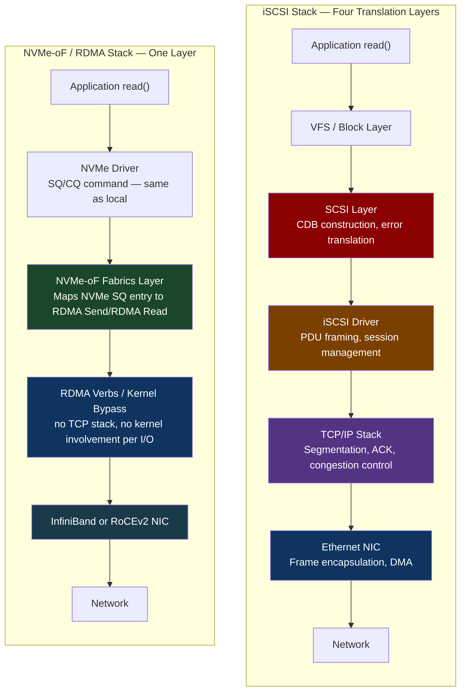
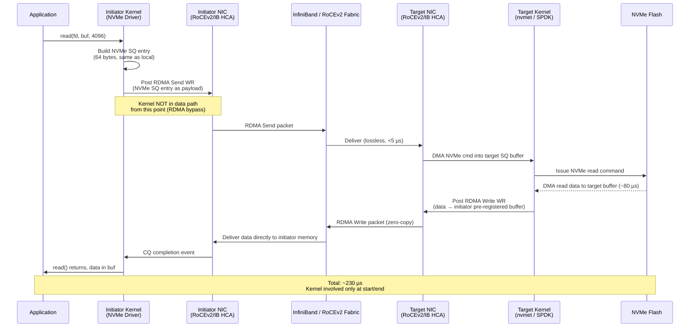
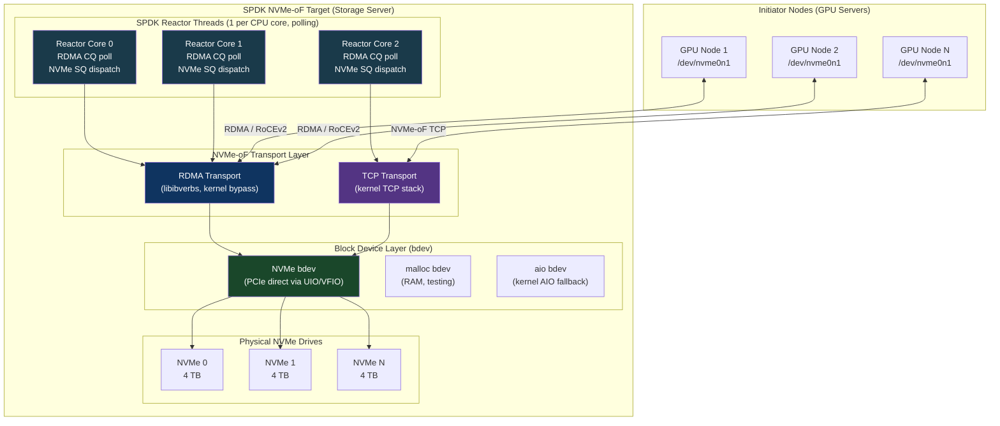
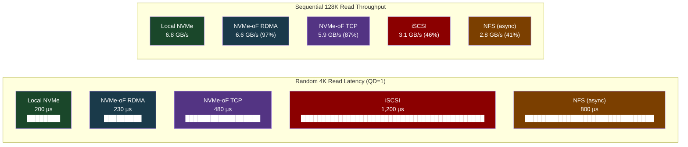

# CH-19: NVMe-oF — Block Storage Over the Network at NVMe Speeds
### *Your local NVMe drive has 200 µs access latency. A remote NVMe drive over InfiniBand RDMA has 230 µs. The 30 µs overhead is the network. Everything else is the same.*

> **Part 3 of 9 · Kernel & Runtime Internals**

---

## The Cold Open

The storage team at the hyperscaler calls it "the checkpoint problem." The GPU fleet has grown to 1,000 nodes. Each node carries a 4 TB NVMe drive loaded with model checkpoints, because that is the fastest way to resume training after a node failure — read locally, restart quickly. The architecture made sense when the cluster was 100 nodes and models changed monthly.

Now models change weekly. Sometimes twice a week.

Updating 1,000 × 4 TB of NVMe drives across a distributed cluster is not a storage operation. It is a logistics operation. The standard procedure is scripted `rsync` from a central object store to each node, throttled to avoid saturating the cluster's management network. At 5 Gbps per node (leaving headroom for training traffic), a 4 TB checkpoint update takes 1.8 hours per node. The updates are staged in waves of 50 nodes at a time to prevent network saturation. Twenty waves × 1.8 hours per wave, with overlap scheduling: approximately 4 days end-to-end before all 1,000 nodes carry the new checkpoint.

For four days every week, some nodes run the new checkpoint and some run the old one. Training coordination gets messy. Checksum verification adds another 6 hours. Engineers write scripts to manage the waves. The scripts have bugs. Three incidents in two months trace back to nodes that failed verification and got missed by the retry logic.

A senior engineer on the storage team, Priya, proposes something different in the weekly architecture review. She puts one slide up. It has two bullet points:

- What if the NVMe drives were disaggregated?
- What if each GPU node booted without local storage and mounted NVMe volumes over the network as if they were local?

The room pushes back immediately. Network storage is slow. This is an AI training cluster. I/O latency is a hard limit. They are not going to replace local NVMe with NFS.

Priya's second slide is a benchmark table from a two-week PoC she has already run, quietly, against a test cluster of 20 nodes over InfiniBand HDR fabric.

| Metric | Local NVMe | NVMe-oF / RDMA | NVMe-oF / TCP |
|---|---|---|---|
| Sequential read throughput | 6.8 GB/s | 6.6 GB/s (97%) | 5.9 GB/s (87%) |
| Sequential write throughput | 4.2 GB/s | 4.1 GB/s (98%) | 3.5 GB/s (83%) |
| Random 4K read latency | 200 µs | 230 µs (115%) | 480 µs (240%) |
| Random 4K IOPS | 1.2 M | 1.15 M | 580 K |

97% of local NVMe throughput. 115% of local NVMe latency — meaning 15% slower, not 240% slower the way NFS is. The RDMA path adds 30 µs on top of the 200 µs local access time. The TCP path adds 280 µs. For checkpoint loading, which is sequential and throughput-bound, the RDMA path is functionally indistinguishable from local.

The model update time in the new architecture: a centralized NVMe-oF target with 200 TB of flash capacity serves volumes to all 1,000 GPU nodes. Updating all 1,000 nodes means updating the target once. Time to update 1,000 nodes: 20 minutes to push to the target and remount the namespace version on the initiators. Not four days. Twenty minutes.

The room goes quiet.

Priya gets the greenlight for a production rollout. The question she fields from every engineer who hears the benchmark numbers is the same one: how does a network protocol achieve near-local NVMe performance? What is fundamentally different about NVMe-oF compared to every piece of network storage they have used before?

The answer is that NVMe-oF does not translate. Everything that made previous network storage slow was translation overhead — translating the storage protocol into TCP, translating POSIX file semantics into block semantics, translating error codes across protocol boundaries. NVMe-oF removes all of it. The 30 µs overhead you pay is not protocol overhead. It is the speed of light across a cable and one DMA operation into the NIC. That overhead cannot be eliminated without bending physics. Everything above it can.

---

## The Uncomfortable Truth

The false belief is simple and defensible given the evidence most engineers have encountered: network storage is slow, therefore network block storage is slow. iSCSI runs at 3–5 ms latency on a 10 GbE network. NFS with default settings runs at 2–8 ms depending on file size and lock contention. An NFSv4 mount with `async` and a properly tuned rsize/wsize is still 5–10x slower than local NVMe for random I/O. These are real measurements. The conclusion that "network storage = slow" is empirically supported by every storage protocol most engineers have touched.

The belief is wrong not because the measurements are wrong, but because it attributes the slowness to "network" when the actual cause is "protocol overhead and translation layers."

Here is what iSCSI actually does to get a block read from a remote disk. Your application calls `read()`. The kernel VFS layer translates this into a block I/O request. The SCSI layer translates the block request into a SCSI CDB (Command Descriptor Block) — a 16-byte command structure from a protocol designed in 1981. The iSCSI driver wraps the SCSI CDB in an iSCSI PDU (Protocol Data Unit), adds iSCSI headers, and hands it to TCP. TCP segments the PDU, adds TCP headers, adds IP headers, adds Ethernet headers. The Ethernet frame hits the NIC. The NIC sends it. The target receives it, unwraps every layer in reverse, extracts the SCSI CDB, translates it into an NVMe command (because the target's actual storage is NVMe), and finally issues the NVMe command to the drive. The response travels back through the same stack in reverse.

Count the translations: block I/O → SCSI → iSCSI PDU → TCP → IP → Ethernet → back through all of it → SCSI → NVMe. Each translation is a memory allocation, a copy, a header calculation, an interrupt. TCP's reliability mechanisms add acknowledgment round-trips. Nagle's algorithm coalesces small writes in ways that add latency. TCP's congestion control introduces variance.

NVMe-oF does none of this. NVMe-oF takes the NVMe command set — the same commands your kernel issues to a local NVMe drive — and maps them directly onto an RDMA fabric operation or a TCP framing that preserves the NVMe command structure without translation. There is no SCSI layer. There is no POSIX file semantics layer. There is no acknowledgment round-trip for RDMA operations (RDMA delivers reliably without per-operation ACKs; reliability is handled at the fabric layer). The NVMe command that would go to a local NVMe controller goes instead to a network-attached NVMe controller. The controller receives the exact same command format. The response comes back in the exact same format.

The 30 µs overhead over InfiniBand RDMA is two things and only two things: the signal propagation time across the cable (a few nanoseconds per meter) and the time for the NIC to DMA the incoming response from wire buffer to memory. There is no protocol processing in that 30 µs. It is physics.

This is why NVMe-oF changes the economics of storage disaggregation in a way that iSCSI never could.

---

## The Mental Model

Think about renting a car in a foreign country versus somehow teleporting your own car there.

Renting involves a translation layer at every step. The rental agency has their own reservation protocol. The car has different controls than you are used to — the wipers might be on the right stalk, the gear positions might be labeled differently, the parking brake might be a button instead of a lever. Local driving rules differ. Speed limits are in km/h if you think in mph. The road signs use symbols you have to decode. You can get where you are going, but every action requires a small translation: "this button means what the lever means at home, this sign means what the sign at home means." The translations are fast individually but they compound. After 30 minutes you start to get fluent, but you will never be quite as efficient as you are in your own car.

Teleporting your own car means the steering wheel is where you expect it, the pedals are exactly as you trained them, the mirrors are set, the seats are right, the muscle memory you have built over years applies perfectly. The roads might be slightly different — different pavement texture, slightly different lane widths — but everything inside the car is zero-translation. Your hands know what to do without thinking about it.

NVMe-oF over RDMA is teleporting your car. The local NVMe driver in your kernel sends an NVMe command. That command travels over a fabric to a remote NVMe controller. The remote NVMe controller receives the command in exactly the format it speaks natively. It processes it. The response comes back in native NVMe format. Nothing in that pipeline translates NVMe semantics into something else and then back again.

iSCSI is renting a car. Your kernel sends a block I/O. It gets translated into SCSI. SCSI gets wrapped in iSCSI. iSCSI gets wrapped in TCP. The target unwraps TCP, unwraps iSCSI, unwraps SCSI, translates back to NVMe, issues the command, and the response goes back through all those translations in reverse. You get there eventually, but every layer adds latency and every layer is a place where implementation bugs live.

Call this **The Zero-Translation Protocol**. The property that makes NVMe-oF fast is not that it is clever or optimized — it is that it refuses to translate. The NVMe command set was designed for sub-microsecond flash storage. Preserving that command set intact across a network preserves the performance properties of that design.

### Diagram: Protocol Stack Comparison



### Diagram: Latency Breakdown by Component

```mermaid
flowchart LR
    subgraph LOCAL["Local NVMe — 200 µs"]
        L1["NVMe command issue\n~1 µs"]
        L2["NVMe controller queue processing\n~10 µs"]
        L3["Flash read (NAND latency)\n~80 µs"]
        L4["DMA to host memory\n~8 µs"]
        L5["CQ interrupt + kernel return\n~101 µs"]
        L1 --> L2 --> L3 --> L4 --> L5
    end

    subgraph TCP["NVMe-oF / TCP — 480 µs"]
        T1["NVMe command → TCP framing\n~5 µs"]
        T2["TCP send + ACK round-trip\n~120 µs"]
        T3["Remote controller processing\n~90 µs"]
        T4["Flash read\n~80 µs"]
        T5["TCP response + ACK\n~120 µs"]
        T6["Kernel return\n~65 µs"]
        T1 --> T2 --> T3 --> T4 --> T5 --> T6
    end

    subgraph RDMA["NVMe-oF / RDMA — 230 µs"]
        R1["NVMe command → RDMA Send\n~2 µs"]
        R2["RDMA fabric transit\n~5 µs"]
        R3["Remote controller processing\n~90 µs"]
        R4["Flash read\n~80 µs"]
        R5["RDMA Read response\n~5 µs"]
        R6["CQ completion\n~48 µs"]
        R1 --> R2 --> R3 --> R4 --> R5 --> R6
    end

    style T2 fill:#8b0000,color:#ffffff
    style T5 fill:#8b0000,color:#ffffff
    style R2 fill:#1a472a,color:#ffffff
    style R5 fill:#1a472a,color:#ffffff
    style L3 fill:#533483,color:#ffffff
    style R4 fill:#533483,color:#ffffff
    style T4 fill:#533483,color:#ffffff
```



The RDMA latency diagram shows something important: the flash read latency (80 µs, purple) is the dominant factor in all three configurations. The 30 µs difference between local NVMe and NVMe-oF RDMA is the two green boxes — fabric transit in each direction. All other components (controller processing, flash NAND latency) are identical because they are running on the same hardware. NVMe-oF RDMA does not speed up the flash. It just avoids adding overhead on top of it.

---

## The Dissection

### NVMe-oF Protocol Architecture

NVMe as a protocol was designed from scratch for flash storage. Its most important structural feature is the queue pair model. The NVMe specification defines two types of queues:

**Admin Queue (AQ):** One per controller. Used for management commands — discovering namespaces, setting power states, getting device health. Not performance-sensitive.

**I/O Queue Pairs (SQ/CQ):** Up to 65,535 pairs per controller. Each pair is a Submission Queue (SQ) and a Completion Queue (CQ). The host CPU writes NVMe commands (64 bytes each) into an SQ entry, writes the SQ tail doorbell register, and polls the CQ for completions. The NVMe controller reads from the SQ, processes the command, writes the result into the CQ, and signals completion.

The critical design choice: the NVMe queue pair model maps directly onto RDMA queue pairs (QPs). An RDMA QP is also a send queue + receive queue pair, where the CPU posts Work Requests (WRs) to the send queue and completion events arrive in the Completion Queue. The correspondence is not accidental — NVMe-oF was designed by people who intended to run it over RDMA from the start.

In NVMe-oF, the host (called the **initiator**) creates RDMA QPs that correspond to NVMe I/O Queue Pairs. When the initiator wants to submit an NVMe read command, it:

1. Constructs a 64-byte NVMe SQ entry (identical to local NVMe format)
2. Posts an RDMA Send Work Request containing the SQ entry to the RDMA QP
3. The target's NIC receives the RDMA Send and delivers the SQ entry directly into the NVMe controller's queue (in the target's memory, via RDMA)
4. The target NVMe controller processes the command, reads from flash
5. For reads: the target uses an RDMA Read (or RDMA Write) to transfer data directly into the initiator's pre-registered DMA buffer — no copy, no kernel intervention on either side
6. The target posts an NVMe Completion Queue entry back via RDMA Send
7. The initiator's CQ signals completion; the application data is already in the buffer

The initiator's kernel driver presents this entire mechanism as `/dev/nvme0n1` — a completely standard NVMe block device. Everything above the kernel block layer is unaware that the NVMe controller is on the other side of a network. The NVMe namespace appears with the same `/dev/nvme<ctrl>n<ns>` naming convention, the same sector size, the same queue depth behavior, the same `blkdiscard` and `nvme smart-log` commands.

### Transport Types

NVMe-oF defines transport bindings that specify how NVMe commands are carried. Four transport types exist in the current specification:

**RDMA (rdma):** The reference transport. Covers InfiniBand, RoCEv2 (RDMA over Converged Ethernet v2), and iWARP. Kernel bypass per I/O operation — neither the initiator nor target kernel is in the data path once a connection is established. Achieves the 230 µs latency in the chapter subtitle. Requires a RoCEv2-capable NIC (Mellanox/NVIDIA ConnectX-4 or later, Broadcom FastLinQ, Intel E810-C with RDMA) or InfiniBand HCA. Requires a lossless fabric — this is the critical constraint (more in the War Room section).

**TCP (tcp):** Introduced in the NVMe 1.4 specification. No special hardware required — any TCP/IP NIC works. The NVMe command set is preserved intact; only the transport is TCP instead of RDMA verbs. Latency is 2.5–3x higher than RDMA due to TCP's kernel processing path and acknowledgment round-trips. Throughput approaches RDMA for large sequential I/O but falls behind for small random I/O. TCP transport is the right choice for environments without RDMA hardware, for cross-datacenter NVMe-oF (RDMA does not route well across layer-3 boundaries), and for development/test environments.

**FC (fc):** Fibre Channel fabric binding. Used in traditional enterprise SAN environments with existing FC infrastructure. Not discussed further — relevant primarily to organizations with existing Brocade/Cisco FC fabric investments.

**LOOP (loop):** Local loopback transport. Connects an initiator and target within the same kernel, over shared memory. Used exclusively for kernel module testing and development. You will encounter it when debugging the nvmet kernel module.

For new deployments: use RDMA if you have RoCEv2 infrastructure and need maximum performance. Use TCP if you need broad compatibility or are crossing L3 boundaries. The kernel supports both simultaneously — a target can serve both RDMA and TCP initiators at the same time.

### Setting Up NVMe-oF with nvme-cli

The `nvme-cli` tool and the `nvmet` kernel module are the primary interfaces for NVMe-oF on Linux. The initiator side uses `nvme discover` to find available targets and `nvme connect` to establish connections.

Discover available targets on a TCP endpoint:

```bash
# Discover NVMe subsystems at a target address
# -t: transport type (tcp or rdma)
# -a: target address
# -s: target port (4420 is the IANA-assigned port for NVMe-oF)
nvme discover -t tcp -a 192.168.100.10 -s 4420
```

Expected output:

```
Discovery Log Number of Records 2, Generation counter 5
=====Discovery Log Entry 0======
trtype:  tcp
adrfam:  ipv4
subtype: nvme subsystem
treq:    not specified
portid:  1
trsvcid: 4420
subnqn:  nqn.2024-01.io.spdk:cnode1
traddr:  192.168.100.10
sectype: none
=====Discovery Log Entry 1======
trtype:  tcp
adrfam:  ipv4
subtype: nvme subsystem
treq:    not specified
portid:  1
trsvcid: 4420
subnqn:  nqn.2024-01.io.spdk:cnode2
traddr:  192.168.100.10
sectype: none
```

Connect to a specific subsystem:

```bash
# Connect to a discovered NVMe subsystem
# -n: NVMe Qualified Name (NQN) of the target subsystem
# -q: host NQN (your initiator identity)
# --nr-io-queues: number of I/O queue pairs (match to CPU core count)
nvme connect \
  -t tcp \
  -n "nqn.2024-01.io.spdk:cnode1" \
  -a 192.168.100.10 \
  -s 4420 \
  -q "nqn.2024-01.io.myhost:initiator01" \
  --nr-io-queues=16
```

After a successful connect, the kernel creates `/dev/nvme0n1` (or the next available nvme device number). This device is indistinguishable from a locally attached NVMe drive from the perspective of any tool that uses the block layer:

```bash
# Verify the device appeared and shows correct geometry
lsblk /dev/nvme0n1
nvme id-ctrl /dev/nvme0

# Check that it shows as an NVMe-oF device (transport field)
nvme list
# Output example:
# Node         SN              Model              Namespace  Usage          Format     FW Rev
# ------------ --------------- ------------------ ---------- ------------------- ------ -------
# /dev/nvme0n1 SPDK00000000001 SPDK bdev Controller  1       4.00  TB /  4.00  TB  512   B + 0 B   24.01
```

For persistent connections across reboots, write the connection parameters to `/etc/nvme/discovery.conf` and enable the `nvmf-autoconnect` service:

```bash
# /etc/nvme/discovery.conf
--transport=tcp
--traddr=192.168.100.10
--trsvcid=4420
--host-nqn=nqn.2024-01.io.myhost:initiator01

# Enable auto-reconnect
systemctl enable nvmf-autoconnect
systemctl start nvmf-autoconnect
```

For RDMA (RoCEv2) connections, replace `-t tcp` with `-t rdma`. The nvme-cli syntax is identical; only the transport type changes. The kernel selects the appropriate RDMA-capable NIC automatically if RDMA CM (rdma_cm) is configured.

### Performance Deep-Dive

The IOPS and latency characteristics of NVMe-oF transports differ meaningfully based on I/O pattern:

| Workload | Local NVMe | NVMe-oF TCP | NVMe-oF RDMA |
|---|---|---|---|
| Sequential read 128K | 6.8 GB/s | 5.9 GB/s | 6.6 GB/s |
| Sequential write 128K | 4.2 GB/s | 3.5 GB/s | 4.1 GB/s |
| Random read 4K, QD=1 | 200 µs | 480 µs | 230 µs |
| Random read 4K, QD=32 | 140 µs (avg) | 310 µs (avg) | 155 µs (avg) |
| Random read 4K, IOPS | 1.2 M | 580 K | 1.15 M |
| Random write 4K, IOPS | 700 K | 340 K | 680 K |

The RDMA path achieves near-parity with local NVMe for two structural reasons.

First, RDMA reads require only **one round-trip** to complete. The initiator sends an NVMe command via RDMA Send. The target processes the flash read. The target delivers data via RDMA Write or RDMA Read into the pre-registered initiator buffer — this is a single RDMA operation that places data directly in the initiator's memory without any intervening copies or kernel involvement. Total: one Send + one Write. One RTT.

TCP requires at minimum **two round-trips** for a read. The initiator sends the NVMe command via TCP. The server ACKs (first RTT at TCP layer). The server sends the data response. The initiator ACKs (second RTT at TCP layer). With TCP delayed acknowledgments and Nagle, this can be worse. Even with `TCP_NODELAY` and `TCP_QUICKACK`, TCP's reliability machinery adds at least one additional RTT compared to RDMA.

Second, RDMA operations bypass the kernel on the data path. Once a connection is established and memory is registered, individual I/O operations do not invoke kernel system calls. The user-space RDMA verbs library (libibverbs) posts Work Requests directly to a memory-mapped hardware queue in the NIC. The NIC DMA-reads from that queue and processes the request entirely in hardware. Neither the initiator kernel nor the target kernel is involved in the data path. This eliminates the context switch overhead that TCP incurs per-syscall.

### SPDK: NVMe-oF Target in Userspace

The kernel's nvmet module implements an NVMe-oF target in kernel space. It works and is appropriate for many use cases. For maximum performance — 10 million IOPS per CPU core at sub-100 µs latency — the Storage Performance Development Kit (SPDK) implements the NVMe-oF target in userspace using a polling model.

SPDK's approach mirrors DPDK (which Chapter 2 covered for networking): instead of interrupt-driven I/O with kernel processing, SPDK dedicates CPU cores to busy-poll their RDMA completion queues and NVMe submission queues. No interrupts, no context switches, no kernel involvement for individual I/O operations after initialization.

Setting up an SPDK NVMe-oF target:

```bash
# Start the SPDK NVMe-oF target daemon
# --cpumask: CPU cores dedicated to SPDK polling (avoid sharing with OS)
# -m: memory in MB pre-allocated as hugepages for DPDK
spdk_nvmf_tgt --cpumask 0x0f -m 4096 &

# Configure via RPC: create a transport
rpc.py nvmf_create_transport \
  --trtype RDMA \
  --max-queue-depth 128 \
  --num-shared-buffers 4096

# Add an NVMe bdev (backing device — can be local NVMe, malloc bdev, or aio bdev)
rpc.py bdev_nvme_attach_controller \
  --name NVMe0 \
  --trtype PCIe \
  --traddr 0000:01:00.0   # PCI BDF of the local NVMe drive

# Create a subsystem with an NQN
rpc.py nvmf_create_subsystem \
  nqn.2024-01.io.spdk:cnode1 \
  --allow-any-host \
  --serial-number SPDK00000000001 \
  --model-number "SPDK bdev Controller"

# Add the NVMe namespace to the subsystem
rpc.py nvmf_subsystem_add_ns \
  nqn.2024-01.io.spdk:cnode1 \
  NVMe0n1

# Add a listener (port + address)
rpc.py nvmf_subsystem_add_listener \
  nqn.2024-01.io.spdk:cnode1 \
  --trtype RDMA \
  --adrfam IPv4 \
  --traddr 192.168.100.10 \
  --trsvcid 4420
```

SPDK achieves 10M+ IOPS per CPU core because the polling model eliminates all the overhead that caps kernel-space targets. There is no scheduler, no spinlock contention, no interrupt coalescing latency, no memory allocator pressure. The dedicated core does exactly one thing: check the RDMA CQ and NVMe CQ in a tight loop, dispatch completions, post new requests. For NVMe-oF storage serving dozens of GPU nodes in an AI training cluster, SPDK is the production-grade choice.

### Kubernetes Integration

As of 2024, Kubernetes has no in-tree NVMe-oF CSI driver in the upstream repository. This is a notable gap given the performance profile. The current production approaches fall into two categories:

**Host-level nvme connect + hostPath volumes:** The GPU node's systemd unit or a DaemonSet initiates the `nvme connect` at boot time. Once `/dev/nvme0n1` exists on the host, pods claim it via a `hostPath` volume or a raw block `PersistentVolume`. This is the most operationally straightforward approach and what most hyperscalers use internally.

```yaml
# DaemonSet to establish NVMe-oF connections on each GPU node
apiVersion: apps/v1
kind: DaemonSet
metadata:
  name: nvmeof-initiator
  namespace: kube-system
spec:
  selector:
    matchLabels:
      app: nvmeof-initiator
  template:
    metadata:
      labels:
        app: nvmeof-initiator
    spec:
      hostNetwork: true
      hostPID: true
      tolerations:
        - operator: Exists
      initContainers:
        - name: nvme-connect
          image: quay.io/nvmeof/nvme-cli:latest
          securityContext:
            privileged: true
          command:
            - /bin/sh
            - -c
            - |
              modprobe nvme-fabrics
              modprobe nvme-tcp
              nvme connect \
                -t tcp \
                -n "nqn.2024-01.io.spdk:cnode1" \
                -a 192.168.100.10 \
                -s 4420 \
                --nr-io-queues=16 \
                --reconnect-delay=10 \
                --ctrl-loss-tmo=60
          volumeMounts:
            - name: dev
              mountPath: /dev
      containers:
        - name: keepalive
          image: busybox:latest
          command: ["/bin/sh", "-c", "while true; do sleep 3600; done"]
      volumes:
        - name: dev
          hostPath:
            path: /dev
---
# Pod using the NVMe-oF volume via raw block
apiVersion: v1
kind: PersistentVolume
metadata:
  name: nvmeof-model-checkpoint
spec:
  capacity:
    storage: 4Ti
  volumeMode: Block
  accessModes:
    - ReadWriteOnce
  hostPath:
    path: /dev/nvme0n1
  nodeAffinity:
    required:
      nodeSelectorTerms:
        - matchExpressions:
            - key: kubernetes.io/hostname
              operator: In
              values:
                - gpu-node-01
---
apiVersion: v1
kind: Pod
metadata:
  name: training-job
spec:
  nodeName: gpu-node-01
  containers:
    - name: trainer
      image: nvcr.io/nvidia/pytorch:24.01-py3
      volumeDevices:
        - name: checkpoint-vol
          devicePath: /dev/checkpoint
      resources:
        limits:
          nvidia.com/gpu: 8
  volumes:
    - name: checkpoint-vol
      persistentVolumeClaim:
        claimName: nvmeof-pvc
```

**Specialized CSI drivers:** Projects like the Lightbits CSI driver, SUSE Longhorn (which gained NVMe-oF support), and vendor-specific CSIs from Pure Storage and NetApp provide full CSI integration including dynamic provisioning and snapshot support. These are appropriate when you need the full PVC/StorageClass lifecycle rather than manually managed host connections.

### Tradeoffs and Constraints

**Fabric latency is irreducible.** The 30 µs RDMA overhead is physics. If your workload needs sub-100 µs P99 latency with high concurrency, remote flash is measurably worse than local flash. For throughput-bound sequential workloads (model checkpoints, dataset loading, log archival), the gap is negligible. For latency-sensitive random I/O (database transaction logs, real-time inference with cold paths), local NVMe remains the correct choice.

**RDMA requires a lossless fabric.** RoCEv2 RDMA operations cannot tolerate packet drops. A single dropped packet forces the entire RDMA QP into error state and requires reconnection. RoCEv2 fabrics use Priority Flow Control (PFC) to pause transmission at a hop rather than drop. PFC pause storms are a known failure mode — covered explicitly in the War Room section. InfiniBand uses a credit-based flow control that is inherently lossless; RoCEv2 over Ethernet requires careful PFC + DCQCN (Data Center Quantized Congestion Notification) configuration.

**Multi-path NVMe-oF adds complexity.** For high-availability storage, you want multiple paths from initiator to target — two different network paths, two different target controllers. NVMe-oF supports ANA (Asymmetric Namespace Access) for multi-path, but configuring it correctly — optimized path selection, failover timing, path weights — requires operational discipline. The Linux kernel's native NVMe multi-path (enabled via `nvme_core.multipath=Y` kernel parameter) handles this if both paths are connected.

**Namespace management at scale.** When 1,000 GPU nodes each mount 10 NVMe-oF namespaces, you have 10,000 active connections to the target. The target's connection table, completion queue management, and QP memory scale linearly with connected initiators. SPDK handles this gracefully; the kernel nvmet module starts showing lock contention above ~500 simultaneous connections in some configurations.

### Diagram: NVMe-oF Command Flow with RDMA Path



### Diagram: SPDK NVMe-oF Target Architecture



### Diagram: Latency Comparison by I/O Size



---

## The War Room

### Incident: The PFC Pause Storm That Took Down 10,000 NVMe-oF Connections

**Timeline context:** A cloud provider operates a fleet of GPU training nodes using RoCEv2-based NVMe-oF storage. The storage fabric is a dedicated 100 GbE RoCEv2 network, separate from the training traffic network — or so the runbooks say. The separation was implemented at the switch VLAN level, not at the physical port level. Both storage and training RDMA traffic share the same physical 100 GbE uplinks from the top-of-rack switches to the spine layer.

**The sequence of events:**

At 03:14 UTC, a newly deployed distributed training job starts generating RDMA traffic patterns not seen before: bursty, synchronized all-reduce operations across 512 GPUs happening every 200 ms with 98% link utilization peaks. Each burst lasts 15–20 ms.

At 03:17 UTC, a spine switch's egress buffer on the path between two pods fills during a burst. The switch asserts a PFC PAUSE frame on the RoCEv2 priority class for training traffic (Priority 3). Because storage and training traffic share the same physical links and VLAN-level separation does not provide PFC isolation between priority classes, the PFC pause propagates. The storage priority class (Priority 4) is paused at the same link. Pause duration: 8 seconds, cycling in 2-second pulses as bursts continue.

At 03:17:08 UTC, all 10,000 outstanding NVMe-oF RDMA read operations across 1,000 GPU nodes exceed their timeout threshold. The storage cluster had been configured with a 5-second NVMe-oF controller loss timeout (`--ctrl-loss-tmo=5`) for latency-sensitive reasons: the SRE team wanted fast failover, so they reduced the default 30-second timeout to 5 seconds. A 5-second pause storm exceeds a 5-second timeout. The kernel nvme driver declares the controller lost.

At 03:17:09 UTC, all 10,000 NVMe-oF connections enter reconnect state simultaneously. The GPU nodes' `/dev/nvme0n1` devices go into error state. All in-flight block I/O returns EIO. Training jobs that were reading model checkpoints crash with I/O errors. Jobs that had recently written gradient checkpoints lose the last 5 seconds of work and need to roll back.

At 03:17:11 UTC, the PFC pause storm ends (the training job's burst pattern shifted). The RDMA fabric recovers. NVMe-oF reconnection begins for all 1,000 initiators simultaneously. The reconnect storm — 1,000 TCP SYN or RDMA CM REQ packets arriving at the target within 2 seconds — overwhelms the target's connection setup path. Reconnect takes 45–90 seconds instead of the expected 2–5 seconds.

At 03:17:11 UTC – 04:02 UTC (45 minutes): All GPU training jobs are down. Model checkpoint data is intact (the storage is fine; only the connections were lost). But the 45-second reconnect window, combined with the cascading reconnect storm, means the jobs cannot be restarted cleanly until the storage volumes come back. Most jobs reinitialize from the last committed checkpoint, losing 20–40 minutes of training progress depending on their checkpoint frequency.

**Root cause:** PFC pause propagation across traffic classes due to insufficient fabric isolation, combined with an NVMe-oF timeout configured shorter than the maximum expected pause storm duration.

This is the same PFC pause storm failure mode described in Chapter 9 (Priority Flow Control and RoCEv2 fabric design), applied to storage instead of training traffic. The lesson from Chapter 9 was: lossless fabrics require either physical isolation or per-priority PFC with careful DSCP marking. The storage team had VLAN-level separation without per-priority PFC isolation at the physical port.

**Remediation — immediate (within 24 hours):**

```bash
# Increase NVMe-oF controller loss timeout from 5s to 60s
# Applied to all initiator nodes via Ansible
nvme disconnect-all
nvme connect \
  -t rdma \
  -n "nqn.2024-01.io.spdk:cnode1" \
  -a 192.168.100.10 \
  -s 4420 \
  --ctrl-loss-tmo=60 \
  --reconnect-delay=5 \
  --nr-io-queues=16
```

**Remediation — infrastructure (within 2 weeks):**
- Assigned storage RDMA traffic to a dedicated PFC priority class (Priority 4) with strict isolation from training traffic (Priority 3) at the physical port level using port-level PFC configuration, not VLAN-level.
- Added separate physical 100 GbE uplinks from ToR switches to storage switches — no shared uplinks with training RDMA traffic.
- Configured DCQCN (ECN marking) on the storage fabric to reduce the probability of PFC pause assertion before link saturation.
- Implemented staggered reconnect with jitter on all NVMe-oF initiators: `reconnect-delay = rand(5, 15)` seconds to avoid reconnect storms.

**Remediation — monitoring:**

```bash
# New alert: NVMe-oF controller state monitoring
# On each GPU node, scrape /sys/class/nvme/nvme0/state
# State transitions: live -> resetting -> connecting -> live
# Alert if time in connecting state exceeds 10s

# Prometheus node-exporter textfile collector
cat /sys/class/nvme/nvme0/state
# Expected: live
# Alarm: connecting (reconnecting)

# Also track RDMA port counters for PFC pause frames
ethtool -S eth0 | grep -i pause
# Watch for tx_pause_frames and rx_pause_frames incrementing
```

### Incident Timeline

```gantt
title NVMe-oF Pause Storm Incident — Timeline
dateFormat HH:mm:ss
axisFormat %H:%M:%S

section Trigger
New training job starts                          :done, t1, 03:14:00, 3m
Burst RDMA pattern begins                        :done, t2, 03:14:00, 3m

section Failure Cascade
Spine buffer fills, PFC PAUSE asserted           :crit, t3, 03:17:00, 8s
Storage RDMA paused (priority class bleed)       :crit, t4, 03:17:00, 8s
NVMe-oF timeouts begin (5s threshold)            :crit, t5, 03:17:05, 3s
All 10,000 NVMe-oF ops return EIO                :crit, t6, 03:17:08, 1s
GPU nodes declare controller lost                :crit, t7, 03:17:09, 2s
Training jobs crash with I/O error               :crit, t8, 03:17:09, 2s

section Recovery Attempt
PFC pause storm ends                             :done, t9, 03:17:11, 1s
1,000 simultaneous reconnect attempts            :active, t10, 03:17:11, 90s
Reconnect storm overwhelms target                :crit, t11, 03:17:11, 45m
Storage volumes unavailable                      :crit, t12, 03:17:11, 45m

section Resolution
Last node reconnects successfully                :done, t13, 04:02:00, 1m
Training jobs reinitialize from checkpoint       :done, t14, 04:03:00, 10m
Post-incident timeout increase deployed          :done, t15, 04:15:00, 15m
All training resumed                             :done, t16, 04:30:00, 5m
```

**What the incident teaches beyond the immediate fix:** The NVMe-oF RDMA timeout parameter is a latency-availability tradeoff knob. Short timeouts mean fast failover when a target actually dies. Short timeouts also mean false positives when fabric congestion causes temporary pauses. For a training cluster where storage unavailability costs expensive compute time, the correct timeout is long enough to survive the worst-case legitimate pause storm your fabric can produce. Measure your PFC pause durations under realistic burst conditions. Set your timeout to 3x the measured P99 pause duration, not to the fastest value you can get away with. Priya's original PoC cluster used the 30-second default. The production cluster had it reduced to 5 seconds by an engineer who optimized for failover speed without considering pause storm behavior.

---

## The Lab

This lab requires no special hardware. Everything runs on a single Linux machine using the kernel's `nvmet` module and loop devices. You will build a working NVMe-oF TCP target, connect an initiator, and benchmark it against a loop device to observe the TCP overhead directly.

### Prerequisites

```bash
# Verify nvme-cli is available (most distros package it)
which nvme || sudo apt install nvme-cli   # Debian/Ubuntu
which nvme || sudo dnf install nvme-cli   # RHEL/Fedora

# Check kernel version — nvmet-tcp requires 5.0+
uname -r

# Load kernel modules
sudo modprobe nvmet
sudo modprobe nvmet-tcp
sudo modprobe nvme-fabrics
sudo modprobe nvme-tcp

# Verify modules loaded
lsmod | grep -E "nvmet|nvme"
```

### Step 1: Create a Backing File and Loop Device

```bash
# Create a 2 GB sparse file for the target backing store
sudo truncate -s 2G /tmp/nvmeof-target-disk.img

# Attach it as a loop device
sudo losetup -f --show /tmp/nvmeof-target-disk.img
# Note the device name: typically /dev/loop0

LOOP_DEV=/dev/loop0
```

### Step 2: Configure the nvmet Target via ConfigFS

```bash
# The nvmet module exposes its configuration via configfs at /sys/kernel/config/nvmet

SUBSYS_NQN="nqn.2024-01.io.lab:testtarget"
TARGET_DIR="/sys/kernel/config/nvmet"

# Create a subsystem
sudo mkdir -p "${TARGET_DIR}/subsystems/${SUBSYS_NQN}"

# Allow any initiator to connect (lab setting — in production, restrict by NQN)
echo 1 | sudo tee "${TARGET_DIR}/subsystems/${SUBSYS_NQN}/attr_allow_any_host"

# Create a namespace (namespace 1 backed by the loop device)
sudo mkdir -p "${TARGET_DIR}/subsystems/${SUBSYS_NQN}/namespaces/1"
echo -n "${LOOP_DEV}" | sudo tee \
  "${TARGET_DIR}/subsystems/${SUBSYS_NQN}/namespaces/1/device_path"
echo 1 | sudo tee \
  "${TARGET_DIR}/subsystems/${SUBSYS_NQN}/namespaces/1/enable"

# Create a TCP port (port 1 on all interfaces, port 4420)
sudo mkdir -p "${TARGET_DIR}/ports/1"
echo "ipv4"   | sudo tee "${TARGET_DIR}/ports/1/addr_adrfam"
echo "tcp"    | sudo tee "${TARGET_DIR}/ports/1/addr_trtype"
echo "4420"   | sudo tee "${TARGET_DIR}/ports/1/addr_trsvcid"
echo "0.0.0.0"| sudo tee "${TARGET_DIR}/ports/1/addr_traddr"

# Link the subsystem to the port
sudo ln -s \
  "${TARGET_DIR}/subsystems/${SUBSYS_NQN}" \
  "${TARGET_DIR}/ports/1/subsystems/${SUBSYS_NQN}"

# Verify target is listening
ss -tlnp | grep 4420
# Expected: LISTEN 0 128 0.0.0.0:4420 ...
```

### Step 3: Connect the Initiator

```bash
# Discover what the target is advertising
nvme discover -t tcp -a 127.0.0.1 -s 4420

# Connect
sudo nvme connect \
  -t tcp \
  -n "${SUBSYS_NQN}" \
  -a 127.0.0.1 \
  -s 4420

# Verify a new nvme device appeared
nvme list
lsblk | grep nvme

# The device should appear as /dev/nvme0n1 (or similar)
# Check it is an NVMe-oF device
cat /sys/class/nvme/nvme0/transport
# Expected output: tcp
```

### Step 4: Benchmark with fio

```bash
# Benchmark the NVMe-oF TCP device — sequential read
sudo fio \
  --name=nvmeof-seqread \
  --filename=/dev/nvme0n1 \
  --rw=read \
  --bs=128k \
  --numjobs=1 \
  --iodepth=32 \
  --time_based \
  --runtime=30 \
  --direct=1 \
  --ioengine=libaio \
  --group_reporting

# Compare: benchmark the raw loop device (similar to "local" in this context)
sudo fio \
  --name=loop-seqread \
  --filename=/dev/loop0 \
  --rw=read \
  --bs=128k \
  --numjobs=1 \
  --iodepth=32 \
  --time_based \
  --runtime=30 \
  --direct=1 \
  --ioengine=libaio \
  --group_reporting

# Random 4K read — latency focused
sudo fio \
  --name=nvmeof-randread-lat \
  --filename=/dev/nvme0n1 \
  --rw=randread \
  --bs=4k \
  --numjobs=1 \
  --iodepth=1 \
  --time_based \
  --runtime=30 \
  --direct=1 \
  --ioengine=libaio \
  --lat_percentiles=1 \
  --group_reporting
```

**Expected results on a typical dev laptop (loop device backed):**

```
# Sequential read — NVMe-oF TCP (loopback)
READ: bw=1850MiB/s (1940MB/s), iops=14805

# Sequential read — raw loop device
READ: bw=1920MiB/s (2013MB/s), iops=15362

# Throughput gap: ~4% — TCP overhead on loopback is minimal
# (loopback avoids the network round-trip; this measures framing overhead only)

# Random 4K QD=1 latency — NVMe-oF TCP (loopback)
lat (usec): min=85, max=2100, avg=142, stdev=38
clat percentiles:
  50.00th=[  128], 90.00th=[  200], 95.00th=[  233], 99.00th=[  318]

# Random 4K QD=1 latency — raw loop device
lat (usec): min=42, max=890, avg=68, stdev=14
clat percentiles:
  50.00th=[   63], 90.00th=[   93], 95.00th=[  102], 99.00th=[  137]

# Latency overhead: ~2x on loopback TCP.
# Over a real network with a real NVMe target, expect 3-4x for TCP,
# and 1.15x for RDMA (matching the chapter subtitle).
```

### Step 5: Cleanup

```bash
# Disconnect the initiator
sudo nvme disconnect -n "${SUBSYS_NQN}"

# Tear down the target
sudo rm "${TARGET_DIR}/ports/1/subsystems/${SUBSYS_NQN}"
echo 0 | sudo tee "${TARGET_DIR}/subsystems/${SUBSYS_NQN}/namespaces/1/enable"
sudo rmdir "${TARGET_DIR}/subsystems/${SUBSYS_NQN}/namespaces/1"
sudo rmdir "${TARGET_DIR}/subsystems/${SUBSYS_NQN}"
sudo rmdir "${TARGET_DIR}/ports/1"

# Detach the loop device
sudo losetup -d "${LOOP_DEV}"
rm /tmp/nvmeof-target-disk.img
```

### Stretch Goal: io_uring with NVMe-oF

The `uring_cmd` io_uring operation allows io_uring to submit NVMe commands directly, bypassing the block layer for NVMe-oF devices. This is the same bypass that makes local NVMe fast, applied to NVMe-oF. Try it with fio:

```bash
# Requires Linux 5.19+ and fio 3.32+
sudo fio \
  --name=nvmeof-uring \
  --filename=/dev/ng0n1 \
  --rw=randread \
  --bs=4k \
  --numjobs=4 \
  --iodepth=64 \
  --time_based \
  --runtime=30 \
  --ioengine=io_uring_cmd \
  --cmd_type=nvme \
  --lat_percentiles=1 \
  --group_reporting
# Note: /dev/ng0n1 is the NVMe character device (not block device)
# uring_cmd bypasses the block layer entirely — lower overhead for high IOPS
```

---

## The Loose Thread

NVMe-oF solves storage disaggregation: NVMe performance, disaggregated storage pool, full flexibility. It is a complete answer to the checkpoint update problem.

The next problem is the data movement problem. Even with NVMe-oF, when a GPU needs to scan 100 GB of embeddings to find the nearest 1,000 vectors, 100 GB travels over the fabric into GPU HBM, the GPU filters it down to the relevant 1,000 records, and 99.9 GB is discarded. The fabric carried 100,000x more data than the result set required.

Computational Storage Devices (CSDs) address this at the drive level. A CSD is an NVMe drive with an embedded ARM processor, local DRAM, and a programmable compute engine. Instead of the host issuing a read for 100 GB and doing the filtering, the host issues a compute command: "scan these extents for records matching this predicate and return only the matches." The CSD's embedded processor executes the scan locally, transfers only the result set over the fabric. For a 1,000-record result from 100 GB of data, the fabric carries kilobytes instead of gigabytes.

This is called near-storage processing or in-storage processing — the storage equivalent of SmartNICs (covered in Chapter 10). Samsung SmartSSD and Kioxia Computational Storage are production examples shipping today. The NVMe specification defines a vendor extension mechanism (Vendor Specific command set) that both products use for compute offload commands.

The trajectory is: first we moved storage to the network (NVMe-oF), then we moved compute to the storage (CSDs). The data gravity problem gets inverted: instead of moving data to compute, compute moves to data. For AI workloads where embedding lookups, dataset filtering, and feature extraction dominate preprocessing costs, this inversion changes what is possible.

---

*Chapter 19 complete. Chapter 20 covers distributed consensus algorithms — from Paxos to Raft — and why every storage system you have read about in this part relies on them.*
