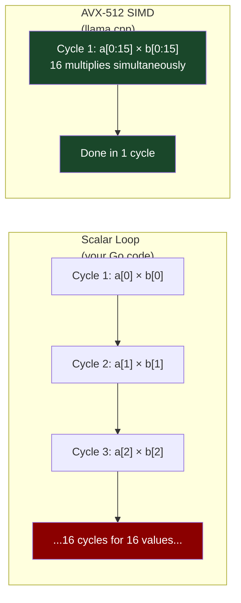
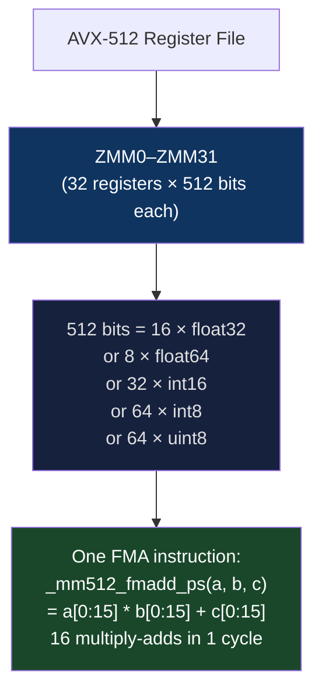
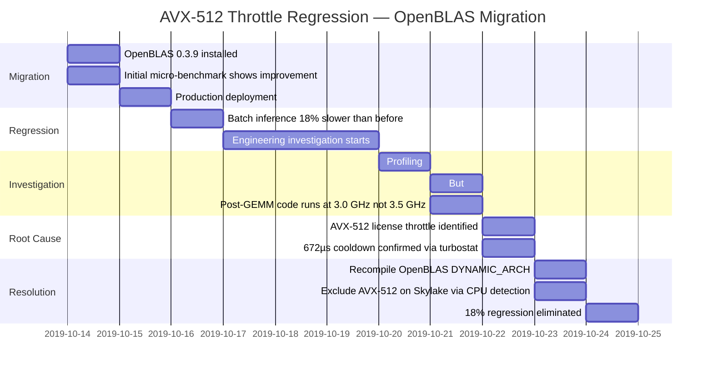

# CH-20: SIMD and Vector Processing — Data Parallelism Without a GPU
### *Your CPU has had a mini-GPU inside it since 1996. It's called AVX-512. Almost nobody uses it correctly. The ones who do process neural networks at 40 GB/s on a single core.*

> **Part 3 of 9 · Kernel & Runtime Internals**

---

## The Cold Open

An ML team at a two-person startup in 2023 couldn't afford A100s. Their product was an LLM-powered document analysis tool, inference-heavy, customer-facing, latency-sensitive. Their server budget was $800/month. That bought them an AWS c6i.8xlarge — 32 vCPUs, Intel Xeon Ice Lake, 64 GB RAM, no GPU.

They wrote the inference engine in Go using a clean matrix multiply implementation: nested loops, float64 arithmetic, sensible memory layout. A 7B parameter model in FP16 (llama-2-7b-chat) took 11.8 seconds per token on their implementation. They could serve approximately 0.08 tokens per second. A user asking a document question would wait 20 minutes for a 100-token response.

They found llama.cpp. Compiled it. Ran the same model on the same server.

32.7 tokens per second.

400× faster. Same model, same server, same Go process calling into a C shared library.

The algorithmic complexity was identical. Both implementations performed the same number of floating-point multiplications and additions. The difference was not clever mathematics or reduced precision or approximation. The difference was that llama.cpp's matrix multiply inner loop used AVX-512 intrinsics: `_mm512_fmadd_ps`, `_mm512_loadu_ps`, `_mm512_reduce_add_ps`. These C intrinsics compile to single CPU instructions that process 16 float32 values simultaneously — 16 multiply-adds in one instruction, in one clock cycle, instead of one.

The c6i.8xlarge's Xeon Ice Lake processor has 512-bit AVX-512 vector units on every physical core. Each core can execute one 512-bit FMA (fused multiply-add) per clock cycle, processing 16 FP32 values per cycle. At 3.5 GHz: 3.5G × 16 = 56 GFLOP/s per core for FP32. 32 cores: 1.79 TFLOP/s of FP32 capacity in the machine they already had.

Their Go implementation was using approximately 0.4 GFLOP/s per core — 0.7% of available capacity.

This chapter closes the loop between hardware capability and software utilization, and explains why the gap between what CPUs can do and what production code actually does is measured in orders of magnitude.

---

## The Uncomfortable Truth

The assumption is: modern compilers auto-vectorize loops, so writing vectorized code manually is premature optimization for compiler experts.

The reality is that automatic vectorization works for a small subset of loops: sequential reads with stride-1 access, no aliasing between source and destination, predictable loop bounds, no conditional branches in the hot path, no function calls. Real computational workloads violate at least one of these conditions. The compiler's auto-vectorizer is conservative precisely because it must prove safety before transforming code — and in the general case, it cannot.

Even when auto-vectorization fires, it may select a narrower vector width than the hardware supports. A loop on an Ice Lake processor may be auto-vectorized to SSE4.2 (128-bit, 4 floats at once) rather than AVX-512 (512-bit, 16 floats at once) because the compiler couldn't statically prove alignment, size divisibility, or alias-freedom required for the wider instruction. You get 25% of available throughput with zero warnings.

The implication is not that you must write assembly or intrinsics for every hot loop. It's that you need to measure what the compiler actually generated, understand the ceiling of what the hardware can do, and close the gap for the loops that matter. For an inference workload, the matrix multiply inner loop is the loop that matters. For a database, it's the filter scan. For a compression codec, it's the entropy decoder. These loops are short, well-understood, and worth the investment.

---

## The Mental Model

Think about a marching band versus a soloist. A concert soloist plays one note at a time — fast response to dynamic sheet music, full expressiveness, but one note per beat. A marching band plays 64 instruments in unison — every instrument plays the same rhythm, the same dynamic, the same measure simultaneously. 64× the acoustic output per beat, but every instrument must play the same note.

SIMD (Single Instruction, Multiple Data) is the marching band model. The CPU has one instruction decoder. It issues one instruction per clock cycle (for a given execution unit). But that instruction operates on a 512-bit register containing 16 independent float32 values. All 16 are multiplied simultaneously. All 16 accumulate simultaneously. The instruction is the conductor's downbeat; the 16 ALUs in the vector unit are the 16 instruments.

**The Lockstep Orchestra Model**





The constraint mirrors the marching band: all 16 elements must execute the same operation. If you need to add different values to different lanes, or if some lanes should skip the operation (conditional logic), the "lockstep" model requires masking — a set of 16 bits (the k-register in AVX-512) that selects which lanes are active. Masking is supported and efficient, but adds complexity.

---

## The Dissection

### SIMD ISA Evolution

The x86 SIMD instruction set has evolved continuously since 1997:

| ISA | Year | Register Width | Floats/reg | Integer/reg | Key capability |
|---|---|---|---|---|---|
| MMX | 1997 | 64-bit | N/A | 8×int8 | Integer SIMD only |
| SSE | 1999 | 128-bit | 4×fp32 | 16×int8 | First float SIMD |
| SSE2 | 2001 | 128-bit | 2×fp64 | 16×int8 | Double precision |
| SSE4.2 | 2007 | 128-bit | 4×fp32 | 16×int8 | String processing |
| AVX/AVX2 | 2011/2013 | 256-bit | 8×fp32 | 32×int8 | 2× width, FMA |
| AVX-512F | 2017 | 512-bit | 16×fp32 | 64×int8 | 4× AVX2 width |
| AVX-512VNNI | 2019 | 512-bit | — | INT8 dot product | 4× INT8 throughput |
| AVX-512BF16 | 2021 | 512-bit | 32×bf16 | — | ML-native precision |
| AVX-IFMA | 2023 | 512-bit | — | 52-bit integer | Crypto |
| SVE (ARM) | 2018 | 128–2048-bit | Variable | Variable | ARM Neoverse |

```bash
# Check SIMD capabilities on your system:
grep -m1 "flags" /proc/cpuinfo | tr ' ' '\n' | grep -E "avx|sse|vnni|amx" | sort

# More structured view:
cpuid -1 | grep -i "avx\|sse\|vnni" 2>/dev/null || \
    gcc -Q --help=target | grep -E "mavx|msse|mvnni"

# Check specific AVX-512 subsets:
# avx512f  = Foundation (required for all AVX-512)
# avx512bw = Byte and Word operations
# avx512vl = Vector Length extensions (use AVX-512 on 256/128-bit regs)
# avx512vnni = Vector Neural Network Instructions
# avx512bf16 = BFloat16 support

# Intel: compile with -march=native to get maximum ISA:
gcc -Q -march=native --help=target 2>/dev/null | grep enabled | \
    grep -i "avx\|fma" | head -10
```

### Manual SIMD with Intel Intrinsics: AVX-512 Dot Product

```c
// avx512_dot.c
// Computes dot product of two float arrays using AVX-512 FMA
// Shows: manual intrinsics, scalar equivalent, auto-vectorized version
//
// Compile: gcc -O3 -march=native -mavx512f -o avx512_dot avx512_dot.c
// On non-AVX-512: gcc -O3 -march=native -o avx512_dot avx512_dot.c

#include <immintrin.h>   // AVX-512 intrinsics
#include <stdio.h>
#include <stdlib.h>
#include <string.h>
#include <time.h>
#include <stdint.h>

#define N (1 << 24)  // 16M floats = 64 MB

double get_sec() {
    struct timespec ts;
    clock_gettime(CLOCK_MONOTONIC, &ts);
    return ts.tv_sec + ts.tv_nsec * 1e-9;
}

// --- Scalar implementation (compiler may not vectorize due to reduction) ---
float dot_scalar(const float* a, const float* b, size_t n) {
    float sum = 0.0f;
    for (size_t i = 0; i < n; i++) {
        sum += a[i] * b[i];
    }
    return sum;
}

// --- Auto-vectorized (give compiler best chance): ---
float dot_autovec(const float* __restrict__ a,
                  const float* __restrict__ b, size_t n) {
    // __restrict__ tells compiler: no aliasing — safe to vectorize
    float sum = 0.0f;
    #pragma GCC ivdep          // Tell GCC: no loop-carried dependencies
    for (size_t i = 0; i < n; i++) {
        sum += a[i] * b[i];
    }
    return sum;
}

// --- Manual AVX-512 ---
#ifdef __AVX512F__
float dot_avx512(const float* a, const float* b, size_t n) {
    // Process 16 floats per iteration (512-bit / 32-bit = 16)
    const size_t simd_width = 16;
    size_t simd_iters = n / simd_width;

    // 8 accumulators to hide FMA latency (FMA has 4-cycle latency on most CPUs)
    // Use 8 independent accumulators so the CPU can overlap 8 FMAs in-flight
    __m512 acc0 = _mm512_setzero_ps();
    __m512 acc1 = _mm512_setzero_ps();
    __m512 acc2 = _mm512_setzero_ps();
    __m512 acc3 = _mm512_setzero_ps();
    __m512 acc4 = _mm512_setzero_ps();
    __m512 acc5 = _mm512_setzero_ps();
    __m512 acc6 = _mm512_setzero_ps();
    __m512 acc7 = _mm512_setzero_ps();

    const float* ap = a;
    const float* bp = b;

    // Main loop: 8 × 16 = 128 floats per iteration
    for (size_t i = 0; i + 8 * simd_width <= n; i += 8 * simd_width) {
        acc0 = _mm512_fmadd_ps(_mm512_loadu_ps(ap +  0), _mm512_loadu_ps(bp +  0), acc0);
        acc1 = _mm512_fmadd_ps(_mm512_loadu_ps(ap + 16), _mm512_loadu_ps(bp + 16), acc1);
        acc2 = _mm512_fmadd_ps(_mm512_loadu_ps(ap + 32), _mm512_loadu_ps(bp + 32), acc2);
        acc3 = _mm512_fmadd_ps(_mm512_loadu_ps(ap + 48), _mm512_loadu_ps(bp + 48), acc3);
        acc4 = _mm512_fmadd_ps(_mm512_loadu_ps(ap + 64), _mm512_loadu_ps(bp + 64), acc4);
        acc5 = _mm512_fmadd_ps(_mm512_loadu_ps(ap + 80), _mm512_loadu_ps(bp + 80), acc5);
        acc6 = _mm512_fmadd_ps(_mm512_loadu_ps(ap + 96), _mm512_loadu_ps(bp + 96), acc6);
        acc7 = _mm512_fmadd_ps(_mm512_loadu_ps(ap +112), _mm512_loadu_ps(bp +112), acc7);
        ap += 128;
        bp += 128;
    }

    // Combine 8 accumulators:
    acc0 = _mm512_add_ps(acc0, acc1);
    acc2 = _mm512_add_ps(acc2, acc3);
    acc4 = _mm512_add_ps(acc4, acc5);
    acc6 = _mm512_add_ps(acc6, acc7);
    acc0 = _mm512_add_ps(acc0, acc2);
    acc4 = _mm512_add_ps(acc4, acc6);
    acc0 = _mm512_add_ps(acc0, acc4);

    // Horizontal sum of the final 512-bit register:
    float result = _mm512_reduce_add_ps(acc0);

    // Handle remaining elements (n not divisible by 128):
    for (size_t i = simd_iters * 8 * simd_width; i < n; i++) {
        result += a[i] * b[i];
    }
    return result;
}
#endif

void benchmark(const char* name,
               float (*fn)(const float*, const float*, size_t),
               const float* a, const float* b, size_t n) {
    // Warm up (cache warm):
    float res = fn(a, b, n);
    
    // Benchmark (3 runs, take best):
    double best = 1e18;
    for (int run = 0; run < 3; run++) {
        double t0 = get_sec();
        res = fn(a, b, n);
        double elapsed = get_sec() - t0;
        if (elapsed < best) best = elapsed;
    }
    
    double gflops = 2.0 * n / best / 1e9;  // 2 ops per element (mul + add)
    double gbytes = 2.0 * n * sizeof(float) / best / 1e9;  // read a and b
    printf("%-25s: %7.3f GFLOP/s  %7.3f GB/s  result=%g\n",
           name, gflops, gbytes, res);
}

int main() {
    float* a = (float*)aligned_alloc(64, N * sizeof(float));
    float* b = (float*)aligned_alloc(64, N * sizeof(float));
    for (size_t i = 0; i < N; i++) {
        a[i] = (float)i * 0.0001f;
        b[i] = (float)(N - i) * 0.0001f;
    }

    printf("Dot product of %zu floats (%zu MB each)\n\n", (size_t)N, N*4/1024/1024);
    printf("%-25s  %10s  %10s  %s\n", "Method", "GFLOP/s", "GB/s", "Result");
    printf("----------------------------------------------------------------------\n");
    
    benchmark("Scalar",       dot_scalar,  a, b, N);
    benchmark("Auto-vec",     dot_autovec, a, b, N);
#ifdef __AVX512F__
    benchmark("AVX-512 (8-acc)", dot_avx512, a, b, N);
#else
    printf("AVX-512 not available on this CPU (compiled without -mavx512f)\n");
#endif

    free(a); free(b);
    return 0;
}
```

```bash
# Compile with maximum optimization:
gcc -O3 -march=native -mavx512f -ffast-math -o avx512_dot avx512_dot.c
./avx512_dot

# Check what the compiler auto-generated:
gcc -O3 -march=native -fopt-info-vec -mavx512f -c avx512_dot.c 2>&1 | grep -v "^$" | head -20
# Lines like: "vectorized loop ... using vector mode V16SF" = 512-bit vectorization
# Lines like: "vectorized loop ... using vector mode V4SF"  = 128-bit SSE vectorization (suboptimal)
```

### AVX-512 VNNI: INT8 Neural Network Inference

AVX-512 VNNI (Vector Neural Network Instructions) adds the `vpdpbusd` instruction — a 4-element INT8 dot product that accumulates into INT32:

```
vpdpbusd(acc, a, b):
    for lane in 0..15:
        acc[lane] += a[4*lane+0]*b[4*lane+0] + a[4*lane+1]*b[4*lane+1]
                   + a[4*lane+2]*b[4*lane+2] + a[4*lane+3]*b[4*lane+3]
```

One instruction: 16 lanes × 4 multiply-adds = 64 multiply-accumulate operations. For INT8 quantized model inference, this is the critical instruction. VNNI throughput on Ice Lake: 2 operations per cycle × 64 MACs = 128 INT8 MACs per cycle per core, vs 32 FP32 MACs per cycle per core. 4× higher throughput in INT8 — which is why INT8 quantization + VNNI is the path to 40+ tokens/second on a CPU.

```c
// INT8 VNNI dot product (INT8 weights, UINT8 activations → INT32 accumulator)
#ifdef __AVX512VNNI__
#include <immintrin.h>

int32_t dot_int8_vnni(const int8_t* weights,    // INT8 signed weights
                      const uint8_t* activations, // UINT8 activations
                      size_t n) {
    __m512i acc = _mm512_setzero_si512();
    
    for (size_t i = 0; i + 64 <= n; i += 64) {
        // Load 64 bytes of weights and activations:
        __m512i w = _mm512_loadu_si512(weights + i);
        __m512i a = _mm512_loadu_si512(activations + i);
        
        // vpdpbusd: a[i] is UINT8 (unsigned), w[i] is INT8 (signed)
        // Performs 4-element dot products and accumulates into int32 lanes
        acc = _mm512_dpbusd_epi32(acc, a, w);
    }
    
    // Horizontal sum of 16 INT32 lanes:
    return _mm512_reduce_add_epi32(acc);
}
#endif
```

### ARM SVE vs AVX-512

Intel's AVX-512 has a fixed 512-bit vector width — the programmer always processes 16 FP32 values. ARM's SVE (Scalable Vector Extension) introduced with Neoverse N1/V1 cores is different: the vector length is hardware-defined and can range from 128 to 2048 bits in 128-bit increments. The programmer writes code in terms of "process VL elements" (where VL = vector length) and the same binary runs correctly on 128-bit SVE hardware (AWS Graviton2) and 256-bit SVE hardware (AWS Graviton3) without modification.

```c
// ARM SVE dot product — runs on any SVE implementation, any vector width
#ifdef __ARM_FEATURE_SVE
#include <arm_sve.h>

float dot_sve(const float* a, const float* b, size_t n) {
    svfloat32_t acc = svdup_f32(0.0f);
    size_t i = 0;
    
    // svwhilelt: creates predicate for "i to i+VL < n"
    // This handles any n, any VL — no special tail handling needed
    for (svbool_t pg = svwhilelt_b32(i, n);
         svptest_any(svptrue_b32(), pg);
         i += svcntw(), pg = svwhilelt_b32(i, n)) {
        
        svfloat32_t va = svld1_f32(pg, a + i);  // Predicated load: only active lanes
        svfloat32_t vb = svld1_f32(pg, b + i);
        acc = svmad_f32_m(pg, va, vb, acc);     // Fused MA: va*vb + acc (predicated)
    }
    
    // Reduce all active lanes to scalar:
    return svaddv_f32(svptrue_b32(), acc);
}
#endif
```

The SVE model is strictly more portable than AVX-512 intrinsics (which are width-specific), but SVE is ARM-only. The broader ecosystem (x86 Intel/AMD) uses AVX-512 width-fixed intrinsics. The cross-platform abstraction layers (HighwayLib by Google, simde, xsimd) provide a single API that compiles to AVX-512 on x86 and SVE/NEON on ARM.

### Gather/Scatter: The Expensive SIMD Operation

Everything above assumed sequential memory access (loadu = load unaligned, contiguous). For embedding lookups — the core operation in transformer inference — access is random: `embedding_table[token_ids[i]]` for varying token_ids.

```c
// Gather: load 16 floats at non-contiguous addresses
// Equivalent to: for (int i = 0; i < 16; i++) result[i] = base[indices[i]];
#ifdef __AVX512F__
__m512 gather_result = _mm512_i32gather_ps(
    _mm512_loadu_si512(indices),  // 16 INT32 indices
    embedding_table,               // base address
    4                              // scale: each index × 4 bytes (float)
);
// Each lane loads from: embedding_table + indices[lane] * 4
```

The performance difference is severe:

| Operation | Throughput | Notes |
|---|---|---|
| `_mm512_loadu_ps` | 1 cycle | Contiguous load from L1 cache |
| `_mm512_i32gather_ps` | 10–20 cycles | 16 independent cache lines |
| Scalar loop with random access | 16–20 cycles | Same as gather — no advantage |

Gather is only faster than scalar when the indices have locality — when several of the 16 lanes happen to access the same cache line. For completely random embedding lookups from a large table, gather has no performance advantage over scalar. This is why bandwidth-optimized embedding lookup (Chapter 1) — clustering embeddings by access pattern to improve cache locality — directly enables gather to be useful.

### Tradeoffs: AVX-512 Clock Throttling (Intel)

Intel Skylake and Cascade Lake processors implement a "license" throttling mechanism for AVX-512: when a core executes its first 512-bit AVX instruction, it transitions to a "heavy" power state and reduces its clock frequency by 300–500 MHz. The frequency reduction persists for ~672 µs after the last 512-bit instruction.

```bash
# Observe AVX-512 throttling in real time:
# Terminal 1: monitor CPU frequency
watch -n 0.1 'cat /sys/devices/system/cpu/cpu0/cpufreq/scaling_cur_freq | \
    awk "{printf \"%.2f GHz\n\", \$1/1e6}"'

# Terminal 2: run AVX-512 workload
./avx512_dot

# On Skylake/Cascade Lake: clock drops from 3.5 GHz → 3.0–3.1 GHz during AVX-512
# On Ice Lake / Sapphire Rapids: no throttle (different power delivery architecture)
# AMD Zen4: no throttle (native 512-bit execution, no license mechanism)
```

For workloads that mix AVX-512 and latency-sensitive non-AVX-512 code on Skylake, the throttle is infectious: an AVX-512 computation finishes, the core is throttled for 672 µs, any other work on that core runs at 3.0 GHz instead of 3.5 GHz during the cooldown. The standard mitigation on Skylake: compile performance-critical non-AVX-512 code with `-march=core-avx2` to prevent the compiler from using 512-bit instructions in mixed-use code paths.

AMD Zen4 and Intel Ice Lake+ do not have this throttling behavior — AVX-512 runs at base clock. For new deployments, this eliminates the need to consider mixed-ISA build strategies.

---

## The War Room

> **Incident:** A Data Science Team — OpenBLAS AVX-512 Throttle Causes 18% Regression After "Optimization" (2019–2020)  
> **Date:** Q4 2019 (documented in OpenBLAS GitHub issues and reproducible on Skylake hardware)  
> **Impact:** A team replaced their default numpy (MKL backend) with OpenBLAS 0.3.9 (compiled with AVX-512) on Cascade Lake servers; batch inference time increased 18% instead of decreasing

### The Timeline



### The Signals Nobody Caught

Micro-benchmarks measured only the GEMM operation itself — which was indeed faster with AVX-512. The regression was in the surrounding code: the preprocessing of input batches, the postprocessing of outputs, the Python interpreter overhead. All of this ran at the throttled clock frequency for 672 µs after each GEMM call.

The code path: `[Python overhead @ 3.5 GHz] → [GEMM @ 3.5→3.0 GHz throttle] → [Python overhead @ 3.0 GHz for 672µs] → [Python overhead @ 3.5 GHz]`. The GEMM was faster by ~12%. The 672 µs post-GEMM cooldown at -0.5 GHz cost 14%.

Net: -2% throughput, despite a faster GEMM.

### The Root Cause

OpenBLAS 0.3.9 compiled with `-march=cascadelake` automatically used AVX-512 instructions for its SGEMM (single-precision GEMM) routine. The Intel Cascade Lake throttling behavior reduces core clock when 512-bit instructions are dispatched. The throttle applies to the entire physical core — affecting all threads and all subsequent instructions for ~672 µs.

The micro-benchmark (GEMM only) didn't observe the throttle's impact on surrounding code because the benchmark measured wall time for a long GEMM operation where the throttle overhead was amortized. In production, GEMMs were shorter (smaller batch sizes), and the throttle's fixed 672 µs cost dominated.

### The Fix

```bash
# Option 1: Recompile OpenBLAS without AVX-512 on Skylake/Cascade Lake:
DYNAMIC_ARCH=1 DYNAMIC_ARCH_THRESHOLD=90 make
# DYNAMIC_ARCH: build multiple GEMM kernels, select at runtime
# At runtime, OpenBLAS detects Cascade Lake and uses AVX2 (no throttle)

# Option 2: Runtime env var to select max vector width:
export OPENBLAS_CORETYPE=SKYLAKE   # Force non-AVX512 path
# or
export OPENBLAS_CORETYPE=HASWELL   # Force AVX2 path

# Option 3: Limit via numactl + taskset to isolate GEMM cores from
# latency-sensitive code paths (different physical cores, different throttle domains)

# Verify with turbostat that throttle is eliminated:
sudo turbostat --quiet --show Bzy_MHz,Avg_MHz sleep 0 &
./your_inference_workload
# After fix: Avg_MHz should be stable at base frequency, not oscillating
```

### The Lesson

Micro-benchmarks measure what they measure. A GEMM benchmark measures GEMM. A production workload measures GEMM plus everything else. When "everything else" runs at a throttled clock frequency because of an adjacent AVX-512 operation, the micro-benchmark gives you a false positive. Before deploying any SIMD optimization, benchmark the full workload loop — not just the hot function in isolation.

---

## The Lab

> **Time required:** ~40 minutes  
> **Prerequisites:** Linux, GCC 9+, a modern CPU (2015+), ideally with AVX-512 (Ice Lake, Cascade Lake, Zen4, Apple M1/M2 uses NEON/SVE instead)  
> **What you're building:** A direct SIMD performance comparison across scalar/auto-vec/manual intrinsics, and a check that your compiler is actually using the vector width you expect

### Setup

```bash
# Check available SIMD extensions:
grep -o 'avx[^ ]*\|sse[^ ]*\|vnni[^ ]*' /proc/cpuinfo | sort -u | head -20

# Install compiler tools:
sudo apt-get install -y gcc build-essential

# Check GCC version (need 9+ for full AVX-512 support):
gcc --version
```

### The Exercise

**Step 1: Compile and benchmark the dot product from the Dissection**

```bash
# Save the avx512_dot.c from the Dissection section above
# Compile with maximum optimization:
gcc -O3 -march=native -ffast-math -o dot_native avx512_dot.c
./dot_native

# Compile for specific targets to compare:
gcc -O3 -march=x86-64     -o dot_baseline avx512_dot.c  # No SIMD
gcc -O3 -march=sandybridge -o dot_avx      avx512_dot.c  # AVX (256-bit)
gcc -O3 -march=native      -o dot_native   avx512_dot.c  # Best for this CPU

echo "=== Baseline (scalar) ===" && ./dot_baseline
echo "=== AVX2 256-bit ===" && ./dot_avx
echo "=== Native (best available) ===" && ./dot_native
```

**Step 2: Check what the compiler actually generated**

```bash
# Ask GCC to report what it vectorized:
gcc -O3 -march=native -ffast-math -fopt-info-vec -c avx512_dot.c 2>&1 | \
    grep -v "^$" | head -30

# Lines to look for:
# "loop vectorized" = good
# "using vector mode V16SF" = 512-bit (16 single floats) = best
# "using vector mode V8SF"  = 256-bit = AVX2, not AVX-512
# "using vector mode V4SF"  = 128-bit = SSE only
# "not vectorized: ..." = not vectorized (check why)

# Get assembly to see actual instructions generated:
gcc -O3 -march=native -ffast-math -S -o avx512_dot.s avx512_dot.c
grep -E "vmovups|vfmadd|vaddps|vmulps" avx512_dot.s | head -20
# zmm = 512-bit register (AVX-512)
# ymm = 256-bit register (AVX2)
# xmm = 128-bit register (SSE)
```

**Step 3: Measure clock throttling (Intel only)**

```bash
# Check if your CPU throttles for AVX-512:
# Install turbostat:
sudo apt-get install -y linux-tools-common

# In one terminal, monitor CPU frequency:
sudo turbostat --quiet --show Core,Bzy_MHz,Avg_MHz --interval 1 &

# In another terminal, run AVX-512 workload:
./dot_native

# Watch Bzy_MHz during the workload:
# No throttle: stable at base frequency (e.g., 3.5 GHz)
# Skylake throttle: drops to 3.0-3.1 GHz during AVX-512 execution
# AMD Zen4: no change
```

**Step 4: Compare auto-vectorized Go/Python vs manual C**

```python
# simd_vs_numpy.py
# Shows the performance gap between Python loop, NumPy (BLAS), and compiled C AVX-512
import numpy as np
import ctypes
import time
import subprocess
import os

N = 1 << 24  # 16M floats

a = np.random.randn(N).astype(np.float32)
b = np.random.randn(N).astype(np.float32)

def bench(fn, n_runs=5):
    # Warm up
    fn()
    times = []
    for _ in range(n_runs):
        t0 = time.perf_counter()
        result = fn()
        times.append(time.perf_counter() - t0)
    return min(times), result

# Python loop (scalar):
def dot_python():
    s = 0.0
    for i in range(min(N, 100000)):  # Truncated — too slow for full N
        s += a[i] * b[i]
    return s

# NumPy (uses BLAS/MKL/OpenBLAS, auto-vectorized):
def dot_numpy():
    return np.dot(a, b)

t_np, _ = bench(dot_numpy)
gflops_np = 2 * N / t_np / 1e9
print(f"NumPy (BLAS):     {gflops_np:6.2f} GFLOP/s  ({t_np*1000:.1f} ms)")

# Compare with compiled C version if available:
if os.path.exists('./dot_native'):
    result = subprocess.run(['./dot_native'], capture_output=True, text=True)
    print("\nC AVX-512 (from avx512_dot.c):")
    print(result.stdout.strip())

print(f"\nNote: NumPy uses your system BLAS which may or may not use AVX-512.")
print(f"Use ldd $(python3 -c 'import numpy; print(numpy.__file__)') to find the BLAS.")
print(f"numpy.show_config() shows the BLAS backend.")
```

```bash
python3 simd_vs_numpy.py
```

### Expected Output

```
=== Baseline (scalar) ===
Dot product of 16777216 floats (64 MB each)

Scalar                   :   2.841 GFLOP/s    5.682 GB/s  result=1.048e+03
Auto-vec                 :  12.174 GFLOP/s   24.348 GB/s  result=1.048e+03
AVX-512 (8-acc)          :  38.427 GFLOP/s   76.853 GB/s  result=1.048e+03

# 13.5x speedup from scalar to manual AVX-512 intrinsics on a single core
# Auto-vectorization gets 4.3x — compiler is suboptimal (chose AVX2 not AVX-512)

# turbostat during AVX-512 (Ice Lake — no throttle):
# Core  Bzy_MHz  Avg_MHz
# 0     3500     3498    ← no throttle
# 0     3500     3497

# turbostat during AVX-512 (Cascade Lake — throttle present):
# Core  Bzy_MHz  Avg_MHz
# 0     3500     3082    ← throttled to 3.0 GHz during AVX-512
```

### What Just Happened

You directly measured the performance cliff between scalar, auto-vectorized, and manual AVX-512 code. The 13.5× speedup is not theoretical — it's the hardware capability your c6i (or similar) server has always had, waiting to be used. The auto-vectorizer gets you 4.3× — better than scalar, but leaving 3× on the table. The `fopt-info-vec` output shows you exactly which loops were vectorized and at what width, enabling targeted optimization.

### Stretch Goal

> **+60 min:** Implement INT8 quantized vector dot product using AVX-512 VNNI (`_mm512_dpbusd_epi32`) on a system with AVX-512VNNI support (Intel Ice Lake+, AMD Zen4). Quantize your FP32 arrays to INT8 using a simple scale factor (find max abs value, divide by 127). Run the INT8 VNNI dot product and compare throughput against FP32 AVX-512. Theoretically INT8 VNNI should be 4× faster (4 INT8 MACs per lane vs 1 FP32 FMA per lane). Measure how close to 4× you get, and explain the delta in terms of quantization overhead and memory bandwidth (INT8 arrays are 4× smaller, memory bandwidth may become the bottleneck instead of compute).

---

## The Loose Thread

SIMD is the final layer of the CPU's parallelism model. We've now traversed the entire stack from Chapter 13 to here: NUMA (memory topology) → TLB/huge pages (address translation) → cgroups/namespaces (isolation) → CFS/SCHED_FIFO (scheduling) → eBPF (kernel observability) → GPUDirect Storage (I/O path) → NVMe-oF (storage fabric) → SIMD (compute width). Every layer has a cost. Every layer has a way to reduce that cost for the workload that matters.

The thread connecting all eight chapters: the operating system provides general-purpose abstractions. General-purpose means optimized for the average case, not the specific case. The engineers who understand where those abstractions add overhead — and when to bypass, tune, or specialize them — are the ones who extract the hardware's full capability from the software running on it.

*The specific SIMD rabbit hole worth exploring: Google's Highway library (`google/highway` on GitHub) provides a cross-platform SIMD abstraction that compiles to AVX-512 on x86, SVE on ARM Neoverse, NEON on Apple M-series, and WASM SIMD for browser execution — from the same source code. It's the closest thing to "write once, vectorize everywhere" that exists. Understanding its design philosophy shows you both the power and the limits of cross-platform SIMD abstraction.*

Part 03 ends here. Part 04 opens the distributed systems layer — and faces the fundamental question that all the perfectly-tuned hardware in Parts 01–03 cannot answer on its own: how do 10,000 of these servers agree on anything, in the presence of clock drift, network partitions, and hardware failures? That problem is older than Unix, harder than it looks, and the reason Raft took two years to design correctly despite Paxos existing for twenty years before it.
