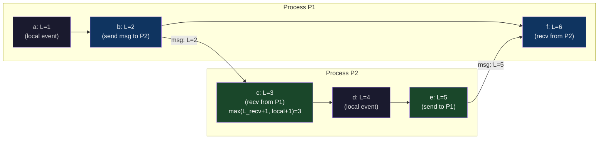
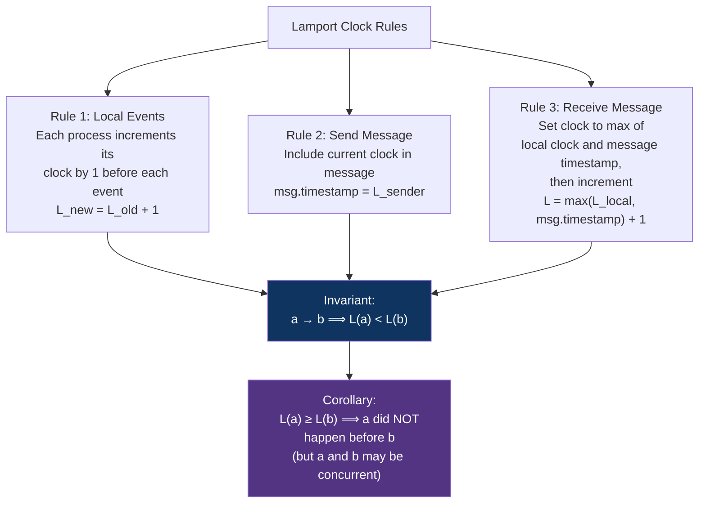

# CH-21: Lamport Clocks — Ordering Events Across Machines That Lie About Time
### *Physical clocks drift. NTP corrects to within a few milliseconds. A few milliseconds is an eternity when you're trying to decide which database write came first.*

> **Part 4 of 9 · Distributed Consensus & Formal Correctness**

---

## The Cold Open

It is 2013, and a developer at a gaming company is debugging what should be a simple problem. Their leaderboard service runs on two database replicas for high availability. Players submit scores. Scores write to whichever replica is closest. Replicas sync with each other. The leaderboard shows the highest score per player.

A player named "SpeedrunKing" finishes a run, submits a score of 94,201 points. The request lands on Replica A. Replica A records the score with timestamp `2013-09-14T15:42:31.847Z` — the time on Replica A's system clock.

Six milliseconds later, from SpeedrunKing's perspective, he gets a cheat-detection penalty that reduces his score to 47,100 points. That request lands on Replica B, which records it with timestamp `2013-09-14T15:42:31.839Z` — 8 milliseconds earlier than Replica A's timestamp, because Replica B's NTP sync ran slightly behind.

The replication system processes events in timestamp order. It sees: score = 47,100 at 15:42:31.839, then score = 94,201 at 15:42:31.847. The second event is later, so it wins. The leaderboard shows 94,201.

SpeedrunKing has bypassed the penalty. Not via a hack. Via clock drift.

The fix the team implemented — "sync clocks more frequently with tighter NTP bounds" — addressed the symptom and not the disease. Clock synchronization can reduce drift to milliseconds, but it cannot eliminate it. As long as clocks on separate machines are set independently, no global ordering guarantee is possible from physical timestamps alone.

The engineer who truly fixed it — six months and a production incident later — replaced physical timestamps with a logical clock. Two lines of conceptual code: increment on every local event; take the maximum of your clock and the received timestamp plus one on every message receive. The result: a total order of events that doesn't depend on any machine's physical clock being accurate.

That algorithm was described by Leslie Lamport in 1978. It took the team thirty-five years to rediscover why they needed it.

---

## The Uncomfortable Truth

The assumption is: distributed systems can use physical timestamps to order events. Clocks are accurate enough. NTP keeps them synchronized. If two events have different timestamps, the later timestamp happened after.

The reality is that physical clocks on separate machines cannot be trusted for event ordering. NTP synchronizes clocks to within 1–100 ms under normal conditions (and much worse during network congestion or NTP pool issues). Two events separated by less than the synchronization error can have inverted timestamps — the second event showing an earlier time than the first.

This is not an implementation deficiency you can engineer away by buying better hardware or running tighter NTP. It is a physical constraint: time propagates at the speed of light. Information about one machine's clock state reaches another machine after some delay. During that delay, both clocks continue running independently, and they run at slightly different rates (oscillator imprecision is real; even atomic-clock-backed servers drift relative to each other). The gap between what two machines believe "now" is can never be reduced to zero without physically co-locating them.

For event ordering, this matters in a specific way: if you want to know whether event A on machine M1 happened before event B on machine M2, physical timestamps can give you the wrong answer. Logical clocks — Lamport clocks and their descendants — give you a provably correct answer for the weaker question "did A causally precede B?" which is actually the question you care about for correctness.

---

## The Mental Model

Think about two authors collaborating on a novel over postal mail. Each author has a draft with chapter numbers and revision dates. Author A sends chapter 3 to Author B on Monday. Author B reads it, incorporates changes, writes chapter 4 in response, and sends it back on Wednesday. Author A receives chapter 4 on Friday.

Now: does the revision date on the letter matter for understanding the causality? No. What matters is: Chapter 4 from B was written *in response to* chapter 3 from A. The causal relationship is encoded in the letters themselves, not in the postal dates.

If both authors also live in different time zones, or if postal dates are sometimes stamped inaccurately, using the postal date to determine order of composition is unreliable. But the causal chain — A's chapter 3 caused B's chapter 4 — is deterministic from the content of the letters.

Lamport clocks encode this causal relationship. Each event gets a counter. Sending a message includes the counter. Receiving a message updates the counter to be at least as large as the sender's counter. The counter value captures the "happened before" relationship regardless of physical time.

**The Happened-Before Relation and Lamport's Three Rules**





The critical insight — and the limitation — of Lamport clocks: the implication runs one direction. If A happened-before B, then L(A) < L(B). But the converse is NOT guaranteed: L(A) < L(B) does not mean A happened-before B. Two concurrent events (neither caused the other) can have any clock relationship.

---

## The Dissection

### Formal Definition of Happened-Before

Lamport's 1978 paper "Time, Clocks, and the Ordering of Events in a Distributed System" defines the **happened-before** relation (→) as the smallest relation satisfying:

1. If A and B are events in the same process and A comes before B in execution, then A → B.
2. If A is the sending of a message and B is the receipt of that same message, then A → B.
3. If A → B and B → C, then A → C (transitivity).

Events A and B are **concurrent** (written A ∥ B) if neither A → B nor B → A. Concurrent events have no causal relationship — neither caused the other, and reordering them does not violate causality.

### Lamport Clock Implementation

```go
// lamport.go — Thread-safe Lamport clock in Go
package lamport

import (
    "sync/atomic"
    "encoding/json"
)

// Clock is a Lamport logical clock.
// All operations are safe for concurrent use.
type Clock struct {
    val uint64
}

// Tick increments the clock for a local event and returns the new value.
// Rule 1: called before each local event.
func (c *Clock) Tick() uint64 {
    return atomic.AddUint64(&c.val, 1)
}

// Send returns the clock value to attach to an outgoing message.
// Rule 2: called when sending a message.
func (c *Clock) Send() uint64 {
    return atomic.AddUint64(&c.val, 1) // tick before send
}

// Receive updates the clock upon receiving a message with timestamp t.
// Rule 3: called when receiving a message.
// Returns the new clock value.
func (c *Clock) Receive(t uint64) uint64 {
    for {
        current := atomic.LoadUint64(&c.val)
        // New value: max(current, received) + 1
        var newVal uint64
        if t >= current {
            newVal = t + 1
        } else {
            newVal = current + 1
        }
        // CAS loop for thread safety:
        if atomic.CompareAndSwapUint64(&c.val, current, newVal) {
            return newVal
        }
        // Another goroutine updated c.val; retry
    }
}

// Value returns the current clock value without incrementing.
func (c *Clock) Value() uint64 {
    return atomic.LoadUint64(&c.val)
}

// --- Message envelope that carries the Lamport timestamp ---

type Message struct {
    Timestamp uint64          `json:"ts"`
    Payload   json.RawMessage `json:"payload"`
}

// --- Example: distributed key-value store using Lamport clock for event ordering ---

type KVEvent struct {
    Timestamp uint64 // Lamport clock value
    ServerID  string // Tie-break: server ID when timestamps are equal
    Key       string
    Value     string
    Op        string // "set" or "delete"
}

// Lamport total order: sort by (Timestamp, ServerID) for deterministic ordering
// This gives a total order that is consistent with the happened-before relation
func (a KVEvent) Before(b KVEvent) bool {
    if a.Timestamp != b.Timestamp {
        return a.Timestamp < b.Timestamp
    }
    // Tie-break by ServerID (arbitrary but deterministic)
    return a.ServerID < b.ServerID
}
```

### Why Tie-Breaking Matters

Lamport clocks produce a **partial order** that can be extended to a **total order** by tie-breaking on process ID when timestamps are equal. This total order is useful for constructing a consistent global history of events, but it introduces an important subtlety: events with equal Lamport timestamps are *necessarily concurrent* — neither happened-before the other. The tie-break order among concurrent events is *arbitrary*. Different tie-break rules produce different total orders, all of which are consistent with the happened-before relation. None is "more correct" than another.

This matters for distributed databases: if you use Lamport timestamps to resolve write conflicts, two concurrent writes to the same key will be resolved arbitrarily. The lower-ID server "wins" (or whichever side of the tie-break you choose). This is **last-write-wins with logical clocks** — it provides a consistent total order but not necessarily the *user's intended* order.

### Practical Application: Distributed Logging and Tracing

Lamport clocks appear in production systems in several forms:

**1. Consistent log ordering across microservices**

When a request spans multiple services (A calls B calls C), the log entries from each service have their own timestamps. If timestamps are physical, the ordering may be inverted during display. With Lamport clocks propagated via HTTP headers:

```go
// HTTP middleware: propagate Lamport clock in request/response headers
func LamportMiddleware(lc *Clock) func(http.Handler) http.Handler {
    return func(next http.Handler) http.Handler {
        return http.HandlerFunc(func(w http.ResponseWriter, r *http.Request) {
            // Receive: update clock from incoming request header
            if tsStr := r.Header.Get("X-Lamport-Clock"); tsStr != "" {
                var ts uint64
                fmt.Sscanf(tsStr, "%d", &ts)
                lc.Receive(ts)
            } else {
                lc.Tick()
            }
            
            // Attach current Lamport timestamp to response context for logging
            ctx := context.WithValue(r.Context(), lamportKey, lc.Value())
            
            // Pass to handler
            next.ServeHTTP(w, r.WithContext(ctx))
            
            // Send: include current clock in response
            w.Header().Set("X-Lamport-Clock", fmt.Sprintf("%d", lc.Send()))
        })
    }
}

// Structured log entry with Lamport timestamp:
type LogEntry struct {
    LamportTS uint64    `json:"lts"`
    PhysicalTS time.Time `json:"pts"`  // Still useful for human readability
    Service   string    `json:"svc"`
    TraceID   string    `json:"trace_id"`
    Message   string    `json:"msg"`
}
// To reconstruct causally-ordered logs: sort by (TraceID, LamportTS, Service)
```

**2. CRDTs (Conflict-free Replicated Data Types)**

Many CRDTs use Lamport timestamps to order concurrent operations:

```go
// Last-Write-Wins Register: a register that takes the value of the
// write with the highest (Lamport timestamp, node ID) tuple
type LWWRegister struct {
    Value     interface{}
    Timestamp uint64
    NodeID    string
}

func (r *LWWRegister) Write(value interface{}, ts uint64, nodeID string) {
    // Accept if incoming write is later than current
    if ts > r.Timestamp || (ts == r.Timestamp && nodeID > r.NodeID) {
        r.Value = value
        r.Timestamp = ts
        r.NodeID = nodeID
    }
}

// Merge two replicas: take the state with the higher timestamp
func (r *LWWRegister) Merge(other *LWWRegister) {
    r.Write(other.Value, other.Timestamp, other.NodeID)
}
```

**3. Cassandra's internal ordering**

Cassandra uses a hybrid: physical timestamps for user-visible writes (with the assumption that clients have approximately synchronized clocks), but Lamport-clock-like mechanisms for internal coordination. Cassandra's lightweight transactions (LWT) use Paxos internally, which is built on logical ordering rather than physical time.

### What Breaks: The Limitation of Lamport Clocks

Lamport clocks can detect when A → B (if L(A) < L(B) after transmission, we know A might have happened before B). They cannot determine whether two events are concurrent — L(A) < L(B) could mean A → B *or* A ∥ B. To distinguish these cases, you need vector clocks (Chapter 22).

```
Lamport clock state: L(A) = 5, L(B) = 7
What does this tell us? Only that B did NOT happen before A.
Did A happen before B? Maybe. Are they concurrent? Maybe.
No way to know from Lamport timestamps alone.

Why it matters for conflict resolution:
If you're deciding whether to overwrite a value, you need to know if the
overwrites are concurrent (conflict = user error, resolve arbitrarily)
or causally ordered (overwrite is correct, take the later one).
Lamport clocks don't give you this information.
```

### Tradeoffs

Lamport clocks are cheap: one integer per message, one comparison per receive. The overhead is negligible. The limitation — inability to detect concurrency — is fundamental and cannot be fixed by making the clock more accurate. The solution is vector clocks, which increase message overhead from O(1) to O(N) where N is the number of processes.

In large distributed systems (thousands of microservices), O(N) clock state is impractical. Hybrid approaches use Lamport clocks for cheap approximate ordering and fall back to out-of-band causality tracking (span IDs, event chains) when precise causal reasoning is needed.

---

## The War Room

> **Incident:** Apache Cassandra — Clock Skew Causes LWT Transaction Failure and Silent Data Loss (2015)  
> **Date:** 2015 (documented in CASSANDRA-9754 and related JIRAs)  
> **Impact:** Cassandra lightweight transactions (LWT) using physical timestamps produced incorrect results when client clocks skewed by more than 1 second relative to server clocks; "compare-and-swap" operations silently failed to apply, losing user updates

### The Timeline

```mermaid
gantt
    title Cassandra Clock Skew — LWT Data Loss
    dateFormat HH:mm
    section Normal Operation
    LWT transactions working normally        : 00:00, 120m
    section Clock Skew Event
    Client VM clock drifts +2.3 seconds      : 02:00, 5m
    LWT conditional writes use future ts     : 02:05, 30m
    section Failure Mode
    Server sees write with future timestamp  : 02:05, 30m
    Server's own writes appear to be older   : 02:05, 30m
    Subsequent reads return stale data       : 02:35, 15m
    section Detection
    Application sees CAS failures            : 02:50, 10m
    "applied: false" responses logged        : 03:00, 20m
    section Investigation
    NTP service found stopped on client VM   : 03:20, 15m
    Clock drift measured: +2.3 seconds       : 03:35, 10m
    section Resolution
    NTP restarted and synchronized           : 03:45, 5m
    LWT operations resumed correctly         : 03:50, 5m
    Data audit: 847 lost updates identified  : 04:00, 60m
```

### The Signals Nobody Caught

Cassandra's `applied: false` response to CAS operations was being logged but not alerted on. The application treated `applied: false` as a conflict (expected in CAS workflows) and silently retried — retrying with the correct data, but the LWT machinery used the client's future timestamp to resolve the "conflict," consistently choosing the stale data because its physical timestamp was "earlier."

### The Root Cause

Cassandra LWT uses Paxos for its consensus mechanism (read: Chapter 25), but the value comparison in "IF column = X SET column = Y" uses physical timestamps for the paxos value. When the client had a clock skewed +2.3 seconds into the future, writes from this client had future timestamps. The Cassandra coordinator saw: "client wrote value V2 at T+2.3s; server has value V1 at T+0s; T+2.3s > T+0s; V2 wins." Even after the client's write was "replaced" by a correct subsequent write at T+0.1s, the CAS would fail: "I want V2 to become V3, but the coordinator sees T+2.3s > T+0.1s so it keeps V2."

### The Fix

Cassandra's HLC (Hybrid Logical Clock) was proposed as the long-term fix — use a logical clock that is bounded relative to physical time, providing both causality tracking and approximate synchronization with NTP.

Short-term fix: monitor clock skew per client via `nodetool tpstats` and alert when skew exceeds 500ms. Any client with skew > 1000ms should be quarantined from LWT operations.

```bash
# Check clock skew on Cassandra nodes:
nodetool info | grep "Timestamp"

# Monitor NTP status on all servers:
chronyc tracking | grep "System time"
# "System time: 0.000042318 seconds fast of NTP time" ← acceptable
# "System time: 2.342891231 seconds fast of NTP time" ← unacceptable

# Prometheus alert for clock skew:
# node_timex_offset_seconds > 0.5 for 5 minutes → fire CRITICAL
```

### The Lesson

Any distributed system that uses physical timestamps for conflict resolution is vulnerable to clock skew. "We sync with NTP" is not sufficient — NTP can fail silently (daemon stops, network partition to NTP servers, VM live migration resets clocks). Clock skew monitoring must be a first-class production signal, not an afterthought. If your system's correctness depends on clock synchronization, you should alert at 100 ms skew, not at 1 second.

---

## The Lab

> **Time required:** ~35 minutes  
> **Prerequisites:** Go 1.18+ or Python 3.8+  
> **What you're building:** A multi-process Lamport clock simulation that demonstrates causality ordering and the limitation (inability to detect concurrency)

### Setup

```bash
mkdir -p ~/lamport_lab && cd ~/lamport_lab
# Either Go or Python version below
```

### The Exercise

**Step 1: Implement and test Lamport clocks**

```go
// main.go — Lamport clock simulation with network delay
package main

import (
    "fmt"
    "math/rand"
    "sort"
    "sync"
    "time"
)

type Event struct {
    LamportTS uint64
    PhysicalTS time.Time
    ProcessID  int
    EventType  string
    Details    string
}

type Process struct {
    ID    int
    clock uint64
    mu    sync.Mutex
    log   []Event
    inbox chan Event
}

func (p *Process) tick(eventType, details string) Event {
    p.mu.Lock()
    defer p.mu.Unlock()
    p.clock++
    e := Event{
        LamportTS:  p.clock,
        PhysicalTS: time.Now(),
        ProcessID:  p.ID,
        EventType:  eventType,
        Details:    details,
    }
    p.log = append(p.log, e)
    return e
}

func (p *Process) send(to *Process, payload string) {
    sendEvent := p.tick("SEND", fmt.Sprintf("to P%d: %s", to.ID, payload))
    // Simulate network delay (5-50ms random)
    delay := time.Duration(5+rand.Intn(45)) * time.Millisecond
    go func() {
        time.Sleep(delay)
        to.inbox <- sendEvent
    }()
}

func (p *Process) run() {
    for {
        select {
        case msg := <-p.inbox:
            p.mu.Lock()
            // Lamport receive rule: max(local, received) + 1
            if msg.LamportTS >= p.clock {
                p.clock = msg.LamportTS + 1
            } else {
                p.clock++
            }
            e := Event{
                LamportTS:  p.clock,
                PhysicalTS: time.Now(),
                ProcessID:  p.ID,
                EventType:  "RECV",
                Details:    fmt.Sprintf("from P%d (msg.L=%d)", msg.ProcessID, msg.LamportTS),
            }
            p.log = append(p.log, e)
            p.mu.Unlock()
        case <-time.After(2 * time.Second):
            return
        }
    }
}

func main() {
    rand.Seed(42)
    
    p1 := &Process{ID: 1, inbox: make(chan Event, 10)}
    p2 := &Process{ID: 2, inbox: make(chan Event, 10)}
    p3 := &Process{ID: 3, inbox: make(chan Event, 10)}
    
    // Start all processes in background
    go p1.run()
    go p2.run()
    go p3.run()
    
    // Choreograph some events with deliberate causal relationships:
    // P1 does local event, then sends to P2
    // P2 receives, does local event, sends to P3
    // P3 receives, does local event
    // P1 does another local event (concurrent with P2 and P3 activity)
    
    time.Sleep(10 * time.Millisecond)
    p1.tick("LOCAL", "database write: key=user123 value=alice")
    time.Sleep(10 * time.Millisecond)
    p1.send(p2, "replicate: user123=alice")
    p1.tick("LOCAL", "concurrent local event — no causal link to P2/P3 yet")
    
    time.Sleep(100 * time.Millisecond) // Let P2 receive
    p2.tick("LOCAL", "processing replication")
    p2.send(p3, "forward: user123=alice")
    
    time.Sleep(100 * time.Millisecond) // Let P3 receive
    p3.tick("LOCAL", "applying replication")
    
    // Now P1 sends a second message to P2 (after P2's local event)
    p1.send(p2, "update: user123=bob")
    
    time.Sleep(500 * time.Millisecond) // Let all messages settle
    
    // Collect all events and sort by Lamport timestamp
    allEvents := append(p1.log, append(p2.log, p3.log...)...)
    sort.Slice(allEvents, func(i, j int) bool {
        if allEvents[i].LamportTS != allEvents[j].LamportTS {
            return allEvents[i].LamportTS < allEvents[j].LamportTS
        }
        return allEvents[i].ProcessID < allEvents[j].ProcessID
    })
    
    fmt.Println("=== Lamport-Ordered Event Log ===")
    fmt.Printf("%-4s %-10s %-6s %s\n", "L", "Physical", "PID", "Details")
    fmt.Println(string(make([]byte, 70)))
    
    for _, e := range allEvents {
        age := e.PhysicalTS.Format("15:04:05.000")
        fmt.Printf("%-4d %s  P%d    [%s] %s\n",
            e.LamportTS, age, e.ProcessID, e.EventType, e.Details)
    }
    
    fmt.Println("\n=== Demonstrating the Limitation ===")
    fmt.Println("Events on P1 and P3 at similar Lamport timestamps:")
    fmt.Println("Lamport ordering tells us their relative position but NOT concurrency.")
    fmt.Println("For that, you need vector clocks (Chapter 22).")
}
```

```bash
go run main.go
```

**Step 2: Observe clock skew breaking physical timestamp ordering**

```python
# clock_skew_demo.py
# Demonstrates why physical timestamps are insufficient for distributed ordering
import time
import random
import threading

class PhysicalClockEvent:
    def __init__(self, ts, pid, op, data):
        self.ts = ts
        self.pid = pid
        self.op = op
        self.data = data
    def __repr__(self):
        return f"[{self.ts:.3f}] P{self.pid} {self.op}: {self.data}"

class LamportEvent:
    def __init__(self, lts, pts, pid, op, data):
        self.lts = lts
        self.pts = pts
        self.pid = pid
        self.op = op
        self.data = data
    def __repr__(self):
        return f"L={self.lts:3d} [{self.pts:.3f}] P{self.pid} {self.op}: {self.data}"

def simulate_clock_skew():
    """Show that physical clock skew can invert causal order."""
    print("=== Physical Clock Ordering (with simulated skew) ===")
    
    base_time = time.time()
    
    # Process 1: 0ms skew (reference)
    # Process 2: +50ms skew (clock is ahead)
    skews = [0.0, 0.050]  # seconds
    
    events = []
    
    # P1 writes value at T=0
    t1 = base_time + skews[0] + 0.0
    events.append(PhysicalClockEvent(t1, 1, "WRITE", "user=alice"))
    
    # Network delay: message from P1 to P2 takes 10ms
    # P2 receives at T=10ms (physical) but P2's clock says T=60ms (50ms ahead)
    t2 = base_time + skews[1] + 0.010  # P2's skewed clock
    events.append(PhysicalClockEvent(t2, 2, "RECV_WRITE", "user=alice"))
    
    # P2 immediately writes an update (causally AFTER receiving P1's write)
    t3 = base_time + skews[1] + 0.020
    events.append(PhysicalClockEvent(t3, 2, "WRITE", "user=alice_updated"))
    
    # P1 does another write slightly later (AFTER the first write, physically)
    t4 = base_time + skews[0] + 0.030  # P1 is behind P2's clock
    events.append(PhysicalClockEvent(t4, 1, "WRITE", "user=alice_v2"))
    
    # Sort by physical timestamp (what a naive system does):
    events.sort(key=lambda e: e.ts)
    
    print("Physical timestamp ordering:")
    for e in events:
        print(f"  {e}")
    
    # Note: P2's write at t=0.070 (0.050 + 0.020) appears AFTER P1's write at t=0.030
    # But P2's write CAUSALLY DEPENDS ON P1's first write!
    # Correct causal order: P1[WRITE] → P2[RECV] → P2[WRITE]
    # Physical order shows: P1[WRITE] → P1[WRITE_v2] → P2[RECV] → P2[WRITE]
    # This is wrong! P1's second write didn't cause P2's receive — it came after.
    
    print("\n=== Lamport Clock Ordering (causal) ===")
    
    class LClock:
        def __init__(self, skew=0):
            self.c = 0
            self.skew = skew
        def tick(self):
            self.c += 1
            return self.c, time.time() + self.skew
        def recv(self, remote_c):
            self.c = max(self.c, remote_c) + 1
            return self.c, time.time() + self.skew
    
    lc1 = LClock(skew=skews[0])
    lc2 = LClock(skew=skews[1])
    
    levents = []
    lts, pts = lc1.tick()
    levents.append(LamportEvent(lts, pts - base_time, 1, "WRITE", "user=alice"))
    send_ts = lts
    
    # P2 receives P1's message:
    lts, pts = lc2.recv(send_ts)  # max(0, 1) + 1 = 2
    levents.append(LamportEvent(lts, pts - base_time, 2, "RECV_WRITE", "user=alice"))
    
    lts, pts = lc2.tick()  # 3
    levents.append(LamportEvent(lts, pts - base_time, 2, "WRITE", "user=alice_updated"))
    
    lts, pts = lc1.tick()  # 2 (P1's clock is still at 1, increments to 2)
    levents.append(LamportEvent(lts, pts - base_time, 1, "WRITE", "user=alice_v2"))
    
    levents.sort(key=lambda e: (e.lts, e.pid))
    
    print("Lamport timestamp ordering:")
    for e in levents:
        print(f"  {e}")
    
    print("\nLamport ordering correctly captures: P1[L=1] → P2[L=2] → P2[L=3]")
    print("P1's second write [L=2] is concurrent with P2[L=2] (tie → sorted by PID)")
    print("→ Lamport clocks correctly order the causal chain,")
    print("  regardless of which server's clock was ahead.")

simulate_clock_skew()
```

```bash
python3 clock_skew_demo.py
```

### Expected Output

```
=== Lamport-Ordered Event Log ===
L    Physical    PID    Details
----------------------------------------------------------------------
1    14:23:01.012  P1    [LOCAL] database write: key=user123 value=alice
2    14:23:01.022  P1    [SEND] to P2: replicate: user123=alice
3    14:23:01.023  P1    [LOCAL] concurrent local event
4    14:23:01.067  P2    [RECV] from P1 (msg.L=2)
5    14:23:01.077  P2    [LOCAL] processing replication
6    14:23:01.087  P2    [SEND] to P3: forward: user123=alice
7    14:23:01.131  P3    [RECV] from P2 (msg.L=6)
8    14:23:01.141  P3    [LOCAL] applying replication

=== Clock Skew Demo ===
Lamport ordering correctly captures: P1[L=1] → P2[L=2] → P2[L=3]
Physical ordering would misorder P2's receive and P1's second write.
```

### What Just Happened

You built a working Lamport clock implementation and directly observed the scenario where physical clocks produce incorrect causal ordering while Lamport clocks maintain correctness. The key insight from the output: P2's `RECV_WRITE` (L=2) always correctly follows P1's `WRITE` (L=1) in the Lamport-ordered log, regardless of what the physical clocks say. Physical timestamps with 50ms skew would have reversed this order.

### Stretch Goal

> **+45 min:** Extend the implementation to simulate a distributed key-value store that uses Lamport timestamps for last-write-wins conflict resolution. Create a scenario where three nodes each write the same key concurrently (no causal relationship between the writes). Show that the Lamport LWW order is deterministic (given the same initial clock states and tie-break rule) but arbitrary (the "winner" has no causal claim to being the "correct" value). Then implement a simple counter CRDT that uses commutative operations to avoid this ambiguity — showing that causality-safe conflict resolution requires the data structure to be designed for it, not just the clock.

---

## The Loose Thread

Lamport clocks give you a total order that is consistent with causality, but they cannot tell you which events are concurrent. This matters when you're trying to detect or resolve conflicts: if you merge two replica states, you need to know whether the divergence is a conflict (concurrent writes to the same key — resolve by policy) or a cascade (one write caused the other — take the later one). Vector clocks encode enough information to distinguish these cases.

*The specific implementation worth reading: Riak's vector clock implementation (in its Erlang source), and Basho's 2012 blog post "Why Vector Clocks Are Hard." The blog post explains why even vector clocks, with their stronger guarantees, require careful operational management to avoid "sibling explosion" — unbounded growth of the vector clock as unique writers multiply. Real production systems almost always compromise between the theoretical guarantees of vector clocks and the operational burden of maintaining them.*

Chapter 22 builds directly on the Lamport clock foundation and answers the question Lamport clocks leave open: how do you determine whether two events are concurrent, and what does that mean for building systems that tolerate concurrent writes correctly?
