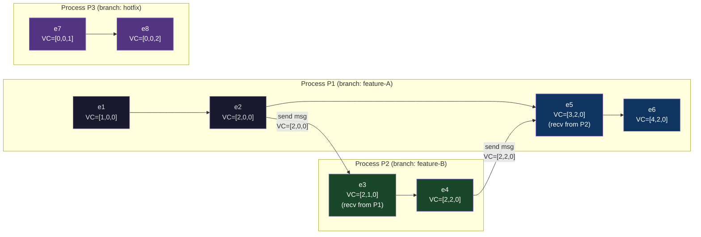
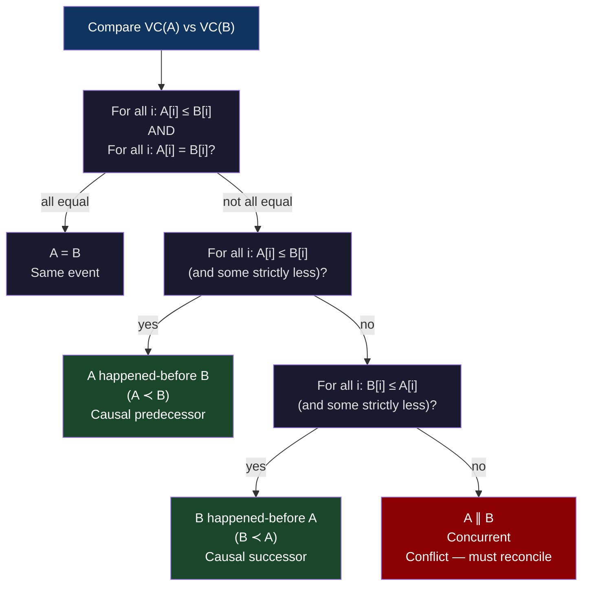
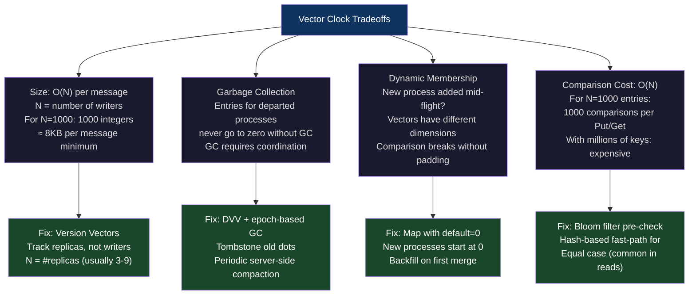

# CH-22: Vector Clocks and Causal Consistency — When "Happened Before" Gets Complicated
### *A Lamport clock tells you event order. A vector clock tells you whether two events are causally related or just happened to get similar timestamps.*

> **Part 4 of 9 · Distributed Consensus & Formal Correctness**

---

## The Cold Open

It is the summer of 2007. Amazon's engineers are presenting the Dynamo paper internally before its submission to SOSP. The system they've built is the backbone of Amazon's shopping cart — the one piece of infrastructure that, if it goes down, stops people from buying anything.

A user opens Amazon on their laptop, adds three items to their cart. The request goes to a Dynamo node in us-east-1. The node writes the cart: `{headphones, USB cable, power strip}`. Version 1. The user leaves for the airport.

At the airport, they open the Amazon app on their phone. The phone's request routes to a different Dynamo node — or maybe the same node, but through a different path. Either way, the app loads the cart and shows all three items. The user removes the USB cable. The cart now reads `{headphones, power strip}`. Version 2.

Then the plane boards. The phone goes into airplane mode. The user, bored at 35,000 feet, reopens the Amazon app. The cached cart state updates optimistically — but it's still `{headphones, power strip}` from version 2. The user adds a book. Locally, the cart is now `{headphones, power strip, book}`. A background thread queues the write for when connectivity returns.

The laptop, back at home, also had a queued operation from a spotty WiFi moment at the airport: the user had also added a charging cable from the laptop. That write had been retried and successfully committed to a Dynamo replica while the user was boarding. The laptop's version: `{headphones, USB cable, power strip, charging cable}`.

Now the plane lands. The phone reconnects. Two writes arrive at the Dynamo cluster almost simultaneously: the phone's `{headphones, power strip, book}` and the laptop's `{headphones, USB cable, power strip, charging cable}`.

The system has two conflicting versions of the cart. The phone version has `book` added; the laptop version has `USB cable` re-added (or never removed) and `charging cable` added. Both versions branched from Version 2 — but the laptop version was written while the phone was offline, and the phone version was assembled offline.

Physical timestamps are useless here. The phone's write commits at T=14:32:17.441. The laptop's write commits at T=14:32:17.019. The laptop write has an earlier physical timestamp — but that means nothing. Both writes happened *after* Version 1, and both happened *after* Version 2. The question isn't which timestamp is larger. The question is: *did either of these writes know about the other when it was created?*

If the laptop's write knew about the phone's write, and still produced a different result, that's a bug. But if neither write knew about the other — if they both branched from Version 2 independently — they're concurrent conflicting writes, and the system must reconcile them by merging (union of items, in this case, giving `{headphones, USB cable, power strip, charging cable, book}`).

Lamport clocks cannot answer that question. A Lamport clock can tell you that one event has a lower logical timestamp than another, but it cannot tell you whether those events are *causally related* or just *sequentially numbered*. You cannot detect conflicts without knowing causality. You cannot safely merge replicas without knowing what each version "knew about."

Vector clocks make this determination possible. Each version of an object carries a vector of `{nodeId: counter}` pairs. Looking at two versions' vectors, you can determine: did one dominate the other (causal succession), or did neither dominate (concurrent conflict requiring reconciliation)?

The Dynamo paper published the problem statement. The shopping cart is still one of the clearest examples of why Lamport clocks are insufficient for real distributed systems.

---

## The Uncomfortable Truth

The false belief: Lamport clocks solve the ordering problem, so nothing more is needed. You assign a logical timestamp to every event, take the max on receive, and now you have a total order. Done.

The problem is that a total order on Lamport timestamps is not the same as a causal order on events. Two events can have Lamport timestamps `LC(A) = 5` and `LC(B) = 7` and you'd conclude that A happened before B — but this conclusion is wrong if A and B were written concurrently on different nodes with no knowledge of each other.

Here's the specific failure mode: Lamport's rule guarantees that if A causally preceded B, then `LC(A) < LC(B)`. The contrapositive is safe: if `LC(A) >= LC(B)`, then A did not causally precede B. But the *converse* is not guaranteed: `LC(A) < LC(B)` does *not* mean A causally preceded B. It might just mean A happened to get assigned a lower counter.

In the shopping cart scenario: both the phone write and the laptop write get assigned Lamport timestamps. One will be lower than the other. A system using Lamport clocks would declare the lower-timestamp version "older" and discard it, silently losing the user's items. This is not a hypothetical edge case. This is the default behavior of last-write-wins with logical timestamps.

Vector clocks solve this. With a vector clock, you can determine whether two versions are in a happened-before relationship (causal succession, no conflict) or concurrent (true conflict, requires reconciliation). Only with this distinction can you implement correct conflict detection, correct replica merging, and causal consistency — the guarantee that a client always sees the effects of its own prior actions.

The cost is that vector clocks are larger. A Lamport clock is one integer. A vector clock is N integers, where N is the number of processes. At small scale this is fine. At scale, the size of vector clocks becomes a significant engineering problem, which is why production systems often use *version vectors* (a related but distinct concept) and *dotted version vectors* for compactness.

---

## The Mental Model

Think about a Git repository with multiple contributors. Each branch is a process. Each commit is an event. A merge commit records both parent commit SHAs — it knows exactly which version of the code it was derived from.

When you look at two commits and want to know if one "happened before" the other, you don't look at the commit timestamps (those are physical wall-clock times and can be forged, backdated, or wrong due to timezone issues). You look at the ancestry graph. If commit B has A somewhere in its ancestor chain — A is reachable by following parent pointers from B — then A happened before B. If neither is an ancestor of the other, they're concurrent: independent branches that diverged from some common ancestor.

This is exactly what vector clocks encode, formally. Each "process" maintains a counter. Each "commit" (event) carries the current state of all counters. When two events are compared, you're asking the same question as Git's merge-base computation: is one reachable from the other, or did they diverge?

**The Causal History Graph** — this is the named model. Each node in the graph is an event. Each directed edge represents "causally preceded." A vector clock comparison is a traversal of this graph, compressed into a single comparison operation on integer vectors.



Notice P3's events: `e7` and `e8` have vector clocks `[0,0,1]` and `[0,0,2]`. Compare `e8=[0,0,2]` with `e6=[4,2,0]`. Neither dominates the other: P3's third component (2) exceeds P1's third component (0) in one version, but P1's first component (4) exceeds P3's first component (0) in the other. These events are concurrent — they have no causal relationship.

Now compare `e3=[2,1,0]` with `e6=[4,2,0]`. Every component of e3 is ≤ every component of e6, and at least one is strictly less. e3 happened-before e6.



The algorithm is a pairwise comparison. No graph traversal at runtime — the vector encodes the full causal history in O(N) integers. The comparison itself is O(N). This is the compression that makes vector clocks practical.

---

## The Dissection

### Naive: Lamport Clocks for Conflict Detection

The naive approach is to stamp every write with a Lamport clock and use last-write-wins. It's simple:

```go
// Naive: last-write-wins with Lamport clock
type LamportStore struct {
    mu    sync.Mutex
    data  map[string]string
    clock map[string]int64 // key -> Lamport timestamp of last write
}

func (s *LamportStore) Put(key, value string, ts int64) {
    s.mu.Lock()
    defer s.mu.Unlock()
    if ts > s.clock[key] {
        s.data[key] = value
        s.clock[key] = ts
    }
    // If ts <= s.clock[key], silently discard. This is the bug.
}
```

### Breaks: Concurrent Writes with Lamport LWW

Consider two nodes, N1 and N2, both receive a user's cart at the same Lamport time from a common version, then independently modify it. N1 sees Lamport clock 10 and adds item A. N2 sees Lamport clock 10 and adds item B. N1 sends its version with Lamport clock 11. N2 sends its version with Lamport clock 11.

Whichever version arrives at the coordinator last wins. The other is silently discarded. One user's item disappears. No error. No conflict notification. The system "works" from an availability perspective and silently corrupts data.

### Why: Lamport Clocks Cannot Distinguish Concurrent from Sequential

The fundamental limitation is that Lamport's algorithm only guarantees `A happened-before B → LC(A) < LC(B)`. The converse doesn't hold. `LC(A) < LC(B)` tells you nothing about whether A and B are causally related or concurrent.

A system that uses LWW with Lamport clocks will silently drop concurrent writes. A system that uses vector clocks can *detect* concurrent writes and route them to a conflict resolution path.

### Correct: Vector Clock Implementation in Go

```go
package vectorclock

import (
    "fmt"
    "sync"
)

// VectorClock is a thread-safe vector clock for N processes.
// ProcessID is a string (node hostname, pod name, etc.)
type VectorClock struct {
    mu      sync.RWMutex
    id      string
    clocks  map[string]uint64
}

func New(id string) *VectorClock {
    return &VectorClock{
        id:     id,
        clocks: map[string]uint64{id: 0},
    }
}

// Tick increments this process's own counter.
// Call before every local event.
func (vc *VectorClock) Tick() {
    vc.mu.Lock()
    defer vc.mu.Unlock()
    vc.clocks[vc.id]++
}

// Send returns a copy of the current vector clock to attach to an outgoing message.
// Also ticks the local clock (send is itself an event).
func (vc *VectorClock) Send() map[string]uint64 {
    vc.mu.Lock()
    defer vc.mu.Unlock()
    vc.clocks[vc.id]++
    // Return a deep copy — the caller owns this map.
    snapshot := make(map[string]uint64, len(vc.clocks))
    for k, v := range vc.clocks {
        snapshot[k] = v
    }
    return snapshot
}

// Receive merges an incoming vector clock and ticks local counter.
// pairwise max of each component, then increment own.
func (vc *VectorClock) Receive(incoming map[string]uint64) {
    vc.mu.Lock()
    defer vc.mu.Unlock()
    for k, v := range incoming {
        if v > vc.clocks[k] {
            vc.clocks[k] = v
        }
    }
    vc.clocks[vc.id]++
}

// Snapshot returns a deep copy of the current vector clock state.
func (vc *VectorClock) Snapshot() map[string]uint64 {
    vc.mu.RLock()
    defer vc.mu.RUnlock()
    snapshot := make(map[string]uint64, len(vc.clocks))
    for k, v := range vc.clocks {
        snapshot[k] = v
    }
    return snapshot
}

// CausalRelation describes the relationship between two vector clocks.
type CausalRelation int

const (
    Equal       CausalRelation = iota // A == B: identical
    HappenedBefore                    // A ≺ B: A causally precedes B
    HappenedAfter                     // B ≺ A: B causally precedes A
    Concurrent                        // A ∥ B: neither precedes the other
)

func (r CausalRelation) String() string {
    switch r {
    case Equal:
        return "Equal"
    case HappenedBefore:
        return "HappenedBefore (A ≺ B)"
    case HappenedAfter:
        return "HappenedAfter (B ≺ A)"
    case Concurrent:
        return "Concurrent (A ∥ B) — CONFLICT"
    }
    return "Unknown"
}

// Compare determines the causal relationship between two vector clock snapshots.
// This is the core algorithm: pairwise component comparison.
func Compare(a, b map[string]uint64) CausalRelation {
    // Collect the union of all process IDs.
    keys := make(map[string]struct{})
    for k := range a {
        keys[k] = struct{}{}
    }
    for k := range b {
        keys[k] = struct{}{}
    }

    aLessB := false // some component of A is strictly less than B
    bLessA := false // some component of B is strictly less than A

    for k := range keys {
        av, bv := a[k], b[k] // missing keys default to 0
        if av < bv {
            aLessB = true
        } else if bv < av {
            bLessA = true
        }
        // If we've found both directions, it's definitely concurrent.
        if aLessB && bLessA {
            return Concurrent
        }
    }

    switch {
    case !aLessB && !bLessA:
        return Equal
    case aLessB && !bLessA:
        return HappenedBefore
    case !aLessB && bLessA:
        return HappenedAfter
    default:
        return Concurrent
    }
}

func (r CausalRelation) IsConflict() bool {
    return r == Concurrent
}
```

### DynamoDB-Style Sibling Detection

Using vector clocks, a distributed KV store can detect when two writes are concurrent (siblings) versus sequential:

```go
package kvstore

import (
    "fmt"
    "sync"
    "vectorclock"
)

// VersionedValue holds a value with its causal context.
type VersionedValue struct {
    Value   string
    Context map[string]uint64 // the vector clock at write time
}

// ConflictingValues represents siblings that need reconciliation.
type ConflictingValues struct {
    Key     string
    Siblings []VersionedValue
}

// CausalStore detects concurrent writes and stores siblings.
type CausalStore struct {
    mu      sync.Mutex
    nodeID  string
    vc      *vectorclock.VectorClock
    store   map[string][]VersionedValue // key -> list of siblings
}

func NewCausalStore(nodeID string) *CausalStore {
    return &CausalStore{
        nodeID: nodeID,
        vc:     vectorclock.New(nodeID),
        store:  make(map[string][]VersionedValue),
    }
}

// Put writes a value with a client-provided causal context.
// If the incoming context is concurrent with an existing value, both are kept as siblings.
func (s *CausalStore) Put(key, value string, clientContext map[string]uint64) error {
    s.mu.Lock()
    defer s.mu.Unlock()

    s.vc.Receive(clientContext) // merge client's causal context
    newCtx := s.vc.Snapshot()

    existing := s.store[key]
    if len(existing) == 0 {
        s.store[key] = []VersionedValue{{Value: value, Context: newCtx}}
        return nil
    }

    var survivors []VersionedValue
    hasConcurrent := false

    for _, existing := range existing {
        rel := vectorclock.Compare(existing.Context, newCtx)
        switch rel {
        case vectorclock.HappenedBefore:
            // Existing version is superseded. Drop it.
        case vectorclock.Equal, vectorclock.HappenedAfter:
            // New write is superseded or identical. Discard the new write.
            return fmt.Errorf("write rejected: causal context is stale")
        case vectorclock.Concurrent:
            // Conflict! Keep existing as sibling.
            survivors = append(survivors, existing)
            hasConcurrent = true
        }
    }

    survivors = append(survivors, VersionedValue{Value: value, Context: newCtx})
    s.store[key] = survivors

    if hasConcurrent {
        fmt.Printf("[CONFLICT] key=%q has %d siblings requiring reconciliation\n",
            key, len(survivors))
    }
    return nil
}

// Get returns all current versions of a key.
// If len > 1, the caller must reconcile siblings.
func (s *CausalStore) Get(key string) []VersionedValue {
    s.mu.Lock()
    defer s.mu.Unlock()
    result := make([]VersionedValue, len(s.store[key]))
    copy(result, s.store[key])
    return result
}
```

### Version Vectors vs. Vector Clocks

A frequent source of confusion: **version vectors** and **vector clocks** solve related but different problems.

A *vector clock* tracks every event across all processes. If you have 1,000 clients each doing 10 writes, the vector clock has 1,000 entries. Every message carries 1,000 integers. This is fine for a handful of processes; it's catastrophic for thousands of independent clients.

A *version vector* tracks only the server-side replicas that hold a copy of the data, not every individual client. Instead of one entry per writer, you have one entry per replica. If you have 5 replicas, every value carries a 5-integer vector — regardless of how many clients have written to it.

```
// Vector clock (per-event, per-writer):
// After 3 clients each write once:
VC = {client-A: 1, client-B: 1, client-C: 1}  // 3 entries

// Version vector (per-replica):
// After those same 3 writes land on replicas R1, R2, R3:
VV = {R1: 1, R2: 1, R3: 1}                      // still 3 entries, but fixed at #replicas
// After 1000 clients write to those same 3 replicas:
VV = {R1: 334, R2: 333, R3: 333}                 // still 3 entries
```

DynamoDB's original design actually used version vectors per object, not true vector clocks. The paper conflates the terms, which has caused widespread confusion in the literature.

### Dotted Version Vectors: Compactness with Correctness

Dotted Version Vectors (DVV) are a further refinement for databases where values are overwritten rather than accumulated. A DVV captures not just the counter but the specific "dot" (replica, counter) that produced the write, making it possible to garbage-collect old entries without losing causal information.

```
// DVV structure: (dot, version_vector)
// dot = (replica_id, counter) — identifies this specific write
// vv  = the causal context this write knew about
DVV = { dot: (R1, 5), vv: {R2: 3, R3: 4} }
// Means: "written by R1 at counter 5, having seen R2 up to 3 and R3 up to 4"
```

### Tradeoffs



---

## The War Room

### Incident: The Sibling Explosion

**Date:** February (year redacted). **System:** Internal distributed shopping-cart service modeled on Dynamo principles. **Duration:** 14 hours of degraded performance, 2 hours of partial outage.

**Background:** The team built a cart service using vector clocks where each unique client session ID was a "process" in the vector. This seemed correct: each client is a writer, each client gets its own slot in the vector. The system worked in staging. It worked in production for two years.

**The signal:** At 02:14 UTC, p99 latency on cart reads spiked from 12ms to 340ms. No deployment. No config change. The on-call engineer opened dashboards, saw the latency spike correlated with no obvious cause. CPU was fine. Memory was fine. Network was fine.

**The investigation:** At 02:31 UTC, the engineer added a debug log to the comparison function and discovered that vector clock comparisons were taking 4ms per operation rather than the expected sub-millisecond. At 02:47 UTC, a query of the cart data structure revealed that some cart records had vector clocks with 18,000+ entries — one entry per unique session ID that had ever written to that cart.

A power user with 18,000 sessions over 4 years had accumulated a vector clock larger than a typical HTTP response body. Operations against their cart serialized a 144KB vector clock on every read and write. But the actual problem was broader: the p50 vector clock size had grown from 8 entries (when the service launched) to 4,200 entries (four years of accumulated session IDs, never garbage-collected).

**Root cause:** The team had used client session IDs as process IDs in vector clocks. Session IDs are never reused and never expire. The GC procedure described in the internal design doc was never implemented. Over four years, vector clocks grew monotonically.

**Resolution timeline:**

```mermaid
gantt
    title Cart Service Sibling Explosion — Incident Timeline
    dateFormat HH:mm
    axisFormat %H:%M

    section Detection
    Latency alert fires (p99 > 200ms)          :alert,    02:14, 5m
    On-call engineer paged                     :page,     02:16, 3m
    Initial dashboard review (no obvious cause):review,   02:19, 12m

    section Investigation
    Add debug logging to compare function      :debug,    02:31, 16m
    Identify 4ms comparison time anomaly       :anomaly,  02:47, 8m
    Query vector clock sizes in production     :query,    02:55, 22m
    Discover 18000-entry vector clocks         :discover, 03:17, 10m
    Confirm O(N) comparison is root cause      :confirm,  03:27, 18m

    section Mitigation
    Deploy vector clock size limit (cap at 50) :capfix,   03:45, 25m
    Truncation causes false Concurrent results :broken,   04:10, 30m
    Rollback size cap — makes things worse     :rollback, 04:40, 15m
    Switch to version vectors (replica-keyed)  :vvswitch, 04:55, 90m
    Migrate hot keys to new format             :migrate,  06:25, 120m
    Full rollout of version vector scheme      :rollout,  08:25, 180m

    section Resolution
    Latency returns to baseline                :resolved, 11:25, 5m
    Postmortem initiated                       :postmortem, 11:30, 30m
    Backfill GC job deployed for old records   :gcjob,    12:00, 120m
    All records migrated to version vectors    :complete, 14:00, 30m
```



**What went wrong with the first mitigation:** The team's first instinct was to cap vector clock size at 50 entries and silently truncate older entries. This is tempting — it bounds the size. But it breaks correctness: when you truncate a vector clock, you lose causal information. Two versions that were causally ordered might now appear concurrent (because the entry that established the causal link was truncated). The system began generating false conflicts for correctly-sequential writes, which made the conflict rate skyrocket and caused application-level errors.

**The correct fix:** Switch from client-session-ID-keyed vector clocks to server-replica-keyed version vectors. The number of replicas is bounded (5 in their setup) and doesn't grow with usage. Client causal context is conveyed differently: the client echoes the version vector it last read, and the server uses that as its causal context for the write. This is exactly what modern systems like Riak call the "causal context" or "context token."

**Lessons:**
1. If your "process" count can grow without bound, you don't want vector clocks — you want version vectors.
2. Never implement GC as a future task. Bounded growth must be designed in from day one.
3. Capping vector clock size without GC destroys correctness. Size bounds and causal correctness require proper compaction, not truncation.

---

## The Lab

Build a vector clock library in Go, simulate three processes, and demonstrate where Lamport clocks give the wrong answer.

```go
package main

import (
    "fmt"
    "sync"
)

// ─── Vector Clock ────────────────────────────────────────────────────────────

type VC map[string]uint64

func (v VC) Clone() VC {
    c := make(VC, len(v))
    for k, val := range v {
        c[k] = val
    }
    return c
}

func (v VC) Tick(id string) VC {
    c := v.Clone()
    c[id]++
    return c
}

func (v VC) Merge(other VC) VC {
    c := v.Clone()
    for k, val := range other {
        if val > c[k] {
            c[k] = val
        }
    }
    return c
}

func (v VC) Receive(id string, incoming VC) VC {
    return v.Merge(incoming).Tick(id)
}

type Relation string

const (
    Before     Relation = "happened-before"
    After       Relation = "happened-after"
    Identical   Relation = "identical"
    Concurrent  Relation = "CONCURRENT (conflict)"
)

func Compare(a, b VC) Relation {
    keys := map[string]struct{}{}
    for k := range a { keys[k] = struct{}{} }
    for k := range b { keys[k] = struct{}{} }

    aLtB, bLtA := false, false
    for k := range keys {
        av, bv := a[k], b[k]
        if av < bv { aLtB = true }
        if bv < av { bLtA = true }
        if aLtB && bLtA { return Concurrent }
    }
    if !aLtB && !bLtA { return Identical }
    if aLtB { return Before }
    return After
}

// ─── Lamport Clock ───────────────────────────────────────────────────────────

type LC struct {
    mu    sync.Mutex
    id    string
    clock uint64
}

func NewLC(id string) *LC { return &LC{id: id} }

func (l *LC) Tick() uint64 {
    l.mu.Lock(); defer l.mu.Unlock()
    l.clock++
    return l.clock
}

func (l *LC) Receive(incoming uint64) uint64 {
    l.mu.Lock(); defer l.mu.Unlock()
    if incoming >= l.clock {
        l.clock = incoming + 1
    } else {
        l.clock++
    }
    return l.clock
}

// ─── Simulation ──────────────────────────────────────────────────────────────

type Event struct {
    name    string
    process string
    vc      VC
    lc      uint64
}

func main() {
    fmt.Println("=== Simulating 3 processes: P1, P2, P3 ===\n")

    // Lamport clocks (one per process)
    lc1, lc2, lc3 := NewLC("P1"), NewLC("P2"), NewLC("P3")

    // Vector clocks start empty — missing keys default to 0
    vc1 := VC{"P1": 0}
    vc2 := VC{"P2": 0}
    vc3 := VC{"P3": 0}

    events := []Event{}

    // e1: P1 local event
    vc1 = vc1.Tick("P1")
    l1 := lc1.Tick()
    events = append(events, Event{"e1", "P1", vc1.Clone(), l1})
    fmt.Printf("[P1] e1: VC=%v  LC=%d\n", vc1, l1)

    // e2: P1 sends message to P2
    vc1 = vc1.Tick("P1")
    l2 := lc1.Tick()
    msg12VC := vc1.Clone()
    msg12LC := l2
    events = append(events, Event{"e2 (send→P2)", "P1", vc1.Clone(), l2})
    fmt.Printf("[P1] e2: VC=%v  LC=%d  (sending to P2)\n", vc1, l2)

    // e3: P3 local event — independent, no message exchange with P1 or P2
    vc3 = vc3.Tick("P3")
    l3 := lc3.Tick()
    events = append(events, Event{"e3", "P3", vc3.Clone(), l3})
    fmt.Printf("[P3] e3: VC=%v  LC=%d  (independent of P1/P2)\n", vc3, l3)

    // e4: P2 receives message from P1
    vc2 = vc2.Receive("P2", msg12VC)
    l4 := lc2.Receive(msg12LC)
    events = append(events, Event{"e4 (recv←P1)", "P2", vc2.Clone(), l4})
    fmt.Printf("[P2] e4: VC=%v  LC=%d  (received from P1)\n", vc2, l4)

    // e5: P2 local event
    vc2 = vc2.Tick("P2")
    l5 := lc2.Tick()
    events = append(events, Event{"e5", "P2", vc2.Clone(), l5})
    fmt.Printf("[P2] e5: VC=%v  LC=%d\n", vc2, l5)

    // e6: P3 second local event
    vc3 = vc3.Tick("P3")
    l6 := lc3.Tick()
    events = append(events, Event{"e6", "P3", vc3.Clone(), l6})
    fmt.Printf("[P3] e6: VC=%v  LC=%d  (still independent)\n\n", vc3, l6)

    // ─── Comparison Analysis ─────────────────────────────────────────────────

    fmt.Println("=== Causal Relationships ===\n")

    pairs := [][2]int{
        {0, 3}, // e1 vs e4 — e1 causally precedes e4 (P1 sent to P2)
        {1, 3}, // e2 vs e4 — e2 is the send event, e4 is the recv — causal
        {1, 2}, // e2 vs e3 — P1 send vs P3 event — concurrent
        {2, 4}, // e3 vs e5 — P3 event vs P2 event — concurrent
        {3, 5}, // e4 vs e6 — P2 recv vs P3 event — concurrent
    }

    for _, p := range pairs {
        a, b := events[p[0]], events[p[1]]
        vcRel := Compare(a.vc, b.vc)
        // Lamport comparison: a.lc < b.lc implies "a before b" in LWW systems
        var lcVerdict string
        if a.lc < b.lc {
            lcVerdict = "LWW would say: A before B"
        } else if a.lc > b.lc {
            lcVerdict = "LWW would say: B before A"
        } else {
            lcVerdict = "LWW would say: tie (undefined)"
        }

        correct := "✓"
        // If VC says concurrent but LC says ordered, that's a wrong answer
        if vcRel == Concurrent && (a.lc != b.lc) {
            correct = "✗ WRONG"
        }

        fmt.Printf("  %s (LC=%d) vs %s (LC=%d)\n", a.name, a.lc, b.name, b.lc)
        fmt.Printf("    Vector Clock: %s\n", vcRel)
        fmt.Printf("    Lamport:      %s %s\n\n", lcVerdict, correct)
    }

    // ─── Conflict Detector Demo ──────────────────────────────────────────────

    fmt.Println("=== Distributed KV Store Conflict Detection ===\n")

    cart := map[string][]struct {
        value   string
        context VC
    }{}

    // Initial write from P1
    initialCtx := VC{"P1": 1}
    cart["cart:user42"] = append(cart["cart:user42"], struct {
        value   string
        context VC
    }{"[headphones, usb-cable]", initialCtx})
    fmt.Println("Initial write: [headphones, usb-cable]  ctx=", initialCtx)

    // P2 reads and writes (causal — it saw the initial write)
    p2Write := struct {
        value   string
        context VC
    }{"[headphones]", VC{"P1": 1, "P2": 1}} // removes usb-cable, knows about P1:1
    fmt.Println("P2 causal write: [headphones]  ctx=", p2Write.context)

    // P3 writes concurrently WITHOUT reading the initial version
    p3Write := struct {
        value   string
        context VC
    }{"[headphones, usb-cable, book]", VC{"P3": 1}} // P3 didn't see P1's write
    fmt.Println("P3 concurrent write: [headphones, usb-cable, book]  ctx=", p3Write.context)

    // Compare P2 vs P3
    rel := Compare(p2Write.context, p3Write.context)
    fmt.Printf("\nP2 write vs P3 write: %s\n", rel)
    if rel == Concurrent {
        fmt.Println("→ Conflict detected. Both versions kept as siblings.")
        fmt.Println("→ Application must merge: union = [headphones, usb-cable, book]")
        fmt.Println("  (Correct: usb-cable stays, book is added, no items lost)")
    }
}
```

**Expected output:**

```
=== Simulating 3 processes: P1, P2, P3 ===

[P1] e1: VC=map[P1:1]  LC=1
[P1] e2: VC=map[P1:2]  LC=2  (sending to P2)
[P3] e3: VC=map[P3:1]  LC=1  (independent of P1/P2)
[P2] e4: VC=map[P1:2 P2:1]  LC=3  (received from P1)
[P2] e5: VC=map[P1:2 P2:2]  LC=4
[P3] e6: VC=map[P3:2]  LC=2  (still independent)

=== Causal Relationships ===

  e1 (LC=1) vs e4 (recv←P1) (LC=3)
    Vector Clock: happened-before
    Lamport:      LWW would say: A before B ✓

  e2 (send→P2) (LC=2) vs e4 (recv←P1) (LC=3)
    Vector Clock: happened-before
    Lamport:      LWW would say: A before B ✓

  e2 (send→P2) (LC=2) vs e3 (LC=1)
    Vector Clock: CONCURRENT (conflict)
    Lamport:      LWW would say: B before A ✗ WRONG

  e3 (LC=1) vs e5 (LC=4)
    Vector Clock: CONCURRENT (conflict)
    Lamport:      LWW would say: A before B ✗ WRONG

  e4 (recv←P1) (LC=3) vs e6 (LC=2)
    Vector Clock: CONCURRENT (conflict)
    Lamport:      LWW would say: B before A ✗ WRONG

=== Distributed KV Store Conflict Detection ===

Initial write: [headphones, usb-cable]  ctx= map[P1:1]
P2 causal write: [headphones]  ctx= map[P1:1 P2:1]
P3 concurrent write: [headphones, usb-cable, book]  ctx= map[P3:1]

P2 write vs P3 write: CONCURRENT (conflict)
→ Conflict detected. Both versions kept as siblings.
→ Application must merge: union = [headphones, usb-cable, book]
  (Correct: usb-cable stays, book is added, no items lost)
```

Key observations from the output:
- Events e2 and e3 are concurrent (P1 sent a message, P3 did something independently). Lamport says B before A — a completely wrong ordering that a LWW system would act on incorrectly.
- Three of the five pairs are concurrent. A Lamport-LWW system gets all three wrong.
- The conflict detector correctly identifies that P2 and P3 wrote concurrently, preserves both versions as siblings, and enables a correct union merge.

---

## The Loose Thread

Vector clocks answer "did A causally precede B?" using pure logical reasoning — no physical clock needed, no globally synchronized time. This is powerful precisely because it's cheap: a few integers, a comparison algorithm, and you have causal consistency across an arbitrarily distributed system.

But there's a class of problem that vector clocks fundamentally cannot address: *real-time ordering*. A vector clock can tell you that transaction T1 happened before T2 in causal terms. It cannot tell you that T1 happened before 3:00 PM UTC, or that T1 and T2 were separated by at most 10 milliseconds of wall-clock time.

For advertising systems, financial transactions, and audit logs, real-time ordering matters. A bank needs to know not just that debit D1 causally preceded credit C2, but that both occurred within the same calendar day. A globally-distributed database offering "external consistency" — the guarantee that transaction ordering is consistent with real-world clock time, not just causal time — needs something more.

That something is TrueTime. Google's Spanner doesn't ask "did T1 causally precede T2?" It asks "can we prove, using bounded physical clock uncertainty, that T1 happened in real time before T2?" The mechanism is different, the guarantee is stronger, and the price is GPS receivers in every datacenter. Chapter 23 shows exactly what that buys you and what happens when the GPS antenna fails.
