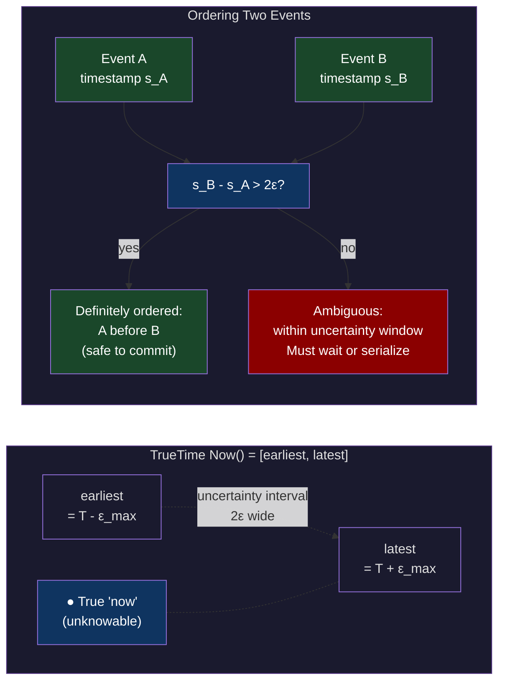
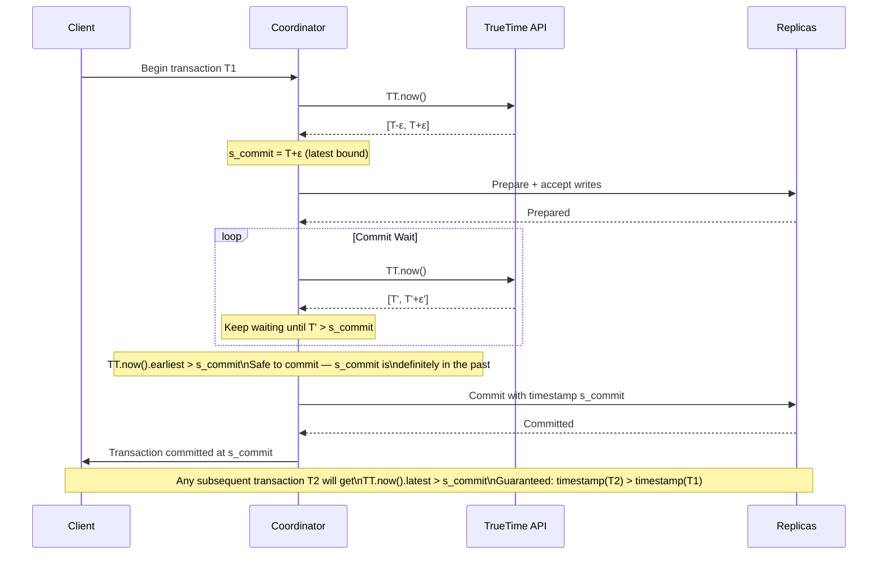
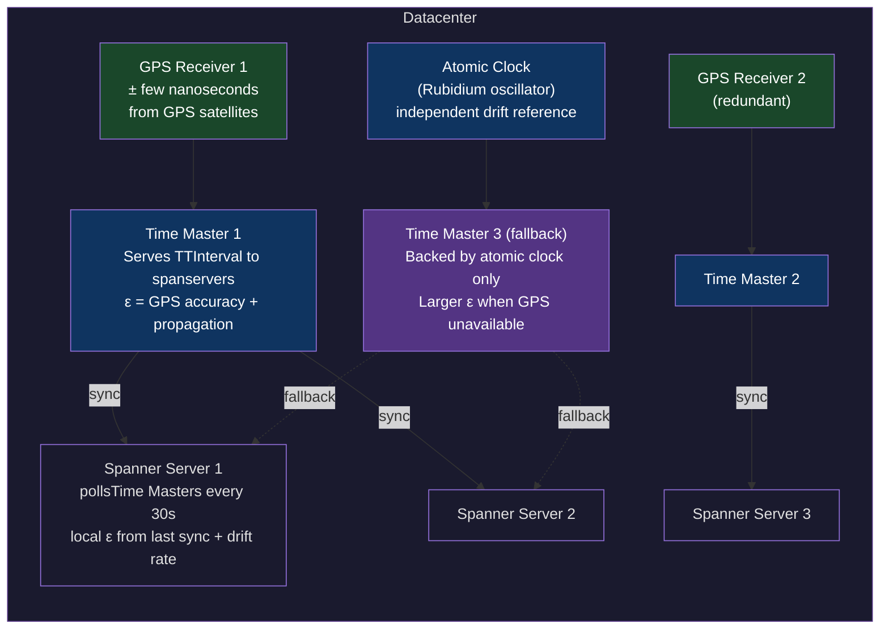

# CH-23: TrueTime — Google's Answer to Clock Drift at Planetary Scale
### *Every other distributed database says "assume clocks are synchronized enough." Spanner says "prove it with atomic clocks, GPS, and bounded uncertainty intervals."*

> **Part 4 of 9 · Distributed Consensus & Formal Correctness**

---

## The Cold Open

It is 2012. A team at Google has been handed an uncomfortable mandate: build a globally distributed relational database that behaves with external consistency. Not eventual consistency. Not linearizability-per-shard. *External* consistency — the guarantee that if transaction T1 commits in real time before transaction T2 starts, then T1's timestamp is provably less than T2's timestamp, globally, across datacenters on opposite sides of the planet.

The engineering team working on Spanner includes Jeff Dean, Sanjay Ghemawat, Wilson Hsieh, and roughly two dozen others. They've already built Bigtable and Megastore and Chubby. They know distributed systems. They know the usual playbook: use Paxos for fault tolerance, use logical clocks for ordering, and expose a "consistent snapshot" read interface.

The problem is Google's advertising and payments infrastructure. Google processes billions of ad auctions and financial transactions per day. When an advertiser's payment commits, every subsequent read of their account balance must reflect that payment — regardless of which datacenter the read hits, regardless of whether the read happens 1 millisecond or 10 seconds after the write. The standard distributed database answer — "reads might be stale by up to X milliseconds" — is simply not acceptable for financial records.

Logical clocks (Lamport clocks, vector clocks) can provide causal consistency. They can tell you that the read's logical timestamp is after the write's logical timestamp, ensuring causal ordering. But logical clocks are divorced from real time. You cannot assign a payment the logical timestamp "3:00 PM UTC" and have that mean anything. Logical timestamps are process-local counters. They don't map to calendar time. They can't be used in audit logs. They can't be used to say "show me all transactions before midnight."

The team considered the standard distributed databases of the era. None offered what they needed. Some offered serializable isolation but only within a single datacenter. Some offered global replication but with relaxed consistency guarantees. The theoretical result they were bumping against is well-known: in a system with clock uncertainty, you cannot safely assign a unique real-time timestamp to each transaction without either serializing all transactions globally (too slow) or waiting until you're certain your timestamp is in the past (not obviously feasible without bounded clock error).

Then someone on the team asked a different question: what if clock uncertainty isn't an obstacle but a parameter? What if, instead of pretending clocks are synchronized, you *quantify* the uncertainty and build the protocol around it?

The observation is clean. If you know that the true current time is somewhere in the interval `[T - ε, T + ε]`, then any two events with assigned timestamps more than `2ε` apart are definitely ordered — the earlier one is definitely before the later one. For two events whose assigned timestamps are within `2ε` of each other, you can't determine order without additional information.

The solution: when a transaction commits with timestamp `s`, the coordinator waits until it's *certain* that `s` is in the past — i.e., waits until `TT.now().earliest > s`. This wait is at most `2ε`. If `ε = 7ms`, the wait is at most 14ms. If you invest in GPS receivers and atomic clocks in each datacenter to reduce `ε` to 1-2ms, the wait drops to 2-4ms.

That wait is what Google calls *commit wait*. It is the price of external consistency. It is bounded, predictable, and in practice adds single-digit milliseconds to transaction latency.

The team built the GPS and atomic clock infrastructure. They deployed it. They published the Spanner paper in 2012 and described TrueTime in Section 3. Most of the distributed systems community read it and said: "This is clever, but it requires GPS hardware in every datacenter. Nobody else can do this."

They were right. And that constraint shaped every distributed database that came after — including why CockroachDB's HLC exists and what tradeoffs it accepts.

---

## The Uncomfortable Truth

The false belief: NTP is good enough for distributed databases. You sync your clocks with NTP, you get ±10ms accuracy (or ±1ms with PTP and careful tuning), and you stamp transactions with `time.now()`. If two transactions commit within the same millisecond, pick the tie-break arbitrarily. It's fine.

It is not fine. Here is the specific failure mode.

Suppose NTP gives you ±50ms accuracy. You have two transactions: T1 commits at physical time `T` and T2 commits at physical time `T + 30ms`. From the real world's perspective, T1 definitely happened before T2. But the timestamp assigned to T2 might be `T - 10ms` (the node running T2 is 40ms ahead of the node running T1, NTP hasn't corrected yet). A read that runs at time `T + 100ms` queries the database and asks for all transactions "before now." It gets back T2 (timestamp `T - 10ms`, looks old) but not T1 (timestamp `T + 50ms`, looks newer than the read's snapshot). The read returns an inconsistent view: it sees the effect of T2 but not T1, even though T1 committed 70ms before T2 in real time.

For a database with ±50ms NTP accuracy and 10,000 transactions per second, there are roughly 500 transactions within any given uncertainty window that cannot be safely ordered by physical timestamp alone. You're forced to either serialize them (expensive) or accept that ordering within the window is arbitrary (incorrect).

The Spanner insight is that the uncertainty is not a flaw to be minimized to zero — it's a variable to be quantified and budgeted. If you can measure `ε` (the maximum clock error), you can build a protocol that waits `ε` milliseconds before declaring a commit final. Smaller `ε` means shorter wait. GPS + atomic clocks achieve `ε ≈ 1-7ms` globally. NTP achieves `ε ≈ 1-100ms` locally, with no hard bound on global error.

The uncomfortable operational corollary: if your TrueTime infrastructure degrades — GPS antenna fails, atomic clock drifts, time master servers are unreachable — `ε` grows. Commit wait grows with it. Transaction throughput drops proportionally. TrueTime is not just an algorithm; it's a piece of physical infrastructure with operational requirements that show up in your SLO dashboard.

---

## The Mental Model

Imagine you're a paralegal whose job is to certify that document A was filed before document B for a legal dispute. With ordinary mail, you have a postmark — but postmarks can be faked, delayed, or inaccurate. You can't certify the order.

With GPS-certified delivery, every letter carries a timestamp that is bounded to within `ε` seconds of true time. If letter A has a certified timestamp `T_A` and letter B has a certified timestamp `T_B`, and `T_B - T_A > 2ε`, you can certify with certainty that A was filed before B. If `|T_A - T_B| ≤ 2ε`, the timestamps are too close together to certify order — but you *know you're uncertain*, which is itself useful information. You can hold B in escrow until the uncertainty window passes.

This is the **Certified Timestamp Model**. The key insight: the uncertainty doesn't go away, but it becomes *bounded and explicit*. A system that knows it's uncertain can do something about it (wait). A system that doesn't know it's uncertain (NTP with no hard bounds) cannot.



The commit wait protocol operationalizes this: when a transaction is assigned timestamp `s_commit = TT.now().latest` (the upper bound of the current uncertainty interval), the coordinator holds the transaction and continuously calls `TT.now()`. It releases the commit only when `TT.now().earliest > s_commit` — meaning it's now *certain* that `s_commit` is in the past.



The wait duration is exactly the time needed for `TT.now().earliest` to advance past `s_commit`. Since `s_commit = TT.now().latest` at assignment time, and the interval shrinks as true time advances, the wait is bounded by `ε` — the current half-width of the uncertainty interval.

---

## The Dissection

### The TrueTime API

TrueTime exposes three functions:

```
TT.now()       → TTInterval{earliest, latest}  // true time is in this interval
TT.after(t)    → bool                          // true iff t has definitely passed
TT.before(t)   → bool                          // true iff t has definitely not arrived
```

The interval width (`latest - earliest`) is `2ε`. `TT.after(t)` returns `true` when `TT.now().earliest > t`. `TT.before(t)` returns `true` when `TT.now().latest < t`.

### Infrastructure: GPS, Atomic Clocks, and Time Masters

Google's TrueTime infrastructure per datacenter:



The `ε` a Spanner server reports is computed locally: it knows when it last synced with a time master, and it knows the maximum drift rate of its local oscillator. Between syncs, `ε` grows linearly at the drift rate. At the next sync, it resets to the time master's `ε` (which incorporates GPS accuracy and the propagation delay from master to server).

Typical values in production Google infrastructure: `ε = 1ms–7ms` globally. This is the number that determines commit wait duration.

### Naive: Timestamps Without Uncertainty Tracking

```go
// Naive: just use time.Now() for transaction timestamps
type NaiveScheduler struct {
    mu   sync.Mutex
    txns []Transaction
}

type Transaction struct {
    ID        string
    Timestamp time.Time
    Data      string
}

func (s *NaiveScheduler) Commit(id, data string) time.Time {
    s.mu.Lock()
    defer s.mu.Unlock()
    ts := time.Now() // Problem: no uncertainty bound. Two servers can disagree.
    s.txns = append(s.txns, Transaction{id, ts, data})
    return ts
}
```

### Breaks: Clock Skew Between Nodes

Two nodes with NTP skew commit transactions within the same window. Node A's clock is 30ms behind Node B's clock. T1 commits on Node A at `T=100ms`. T2 commits on Node B at real time `T=120ms` but the node reports `T=150ms`. A reader sees T2's timestamp (150ms) as later than T1's (100ms) — correct. But another reader using Node A's perspective sees T1 at 100ms and T2 at 150ms — also appears correct. Now a third transaction T3 commits on Node A at `T=130ms` (real time), stamped as `T=130ms`. A reader asking for "transactions before T=140ms" gets T3 (130ms) but might miss T2 depending on which node's view it uses. The results diverge across replicas.

### Correct: TrueTime with Commit Wait

```go
package truetime

import (
    "fmt"
    "math/rand"
    "sort"
    "sync"
    "time"
)

// TTInterval represents the bounded uncertainty around true time.
type TTInterval struct {
    Earliest time.Time
    Latest   time.Time
}

// Epsilon returns the half-width of the uncertainty interval.
func (t TTInterval) Epsilon() time.Duration {
    return t.Latest.Sub(t.Earliest) / 2
}

// TrueTimeClock simulates a TrueTime clock with configurable uncertainty.
// In production Spanner, this is backed by GPS + atomic clocks.
// Here, we model it with a configurable ε and deterministic jitter.
type TrueTimeClock struct {
    mu      sync.Mutex
    epsilon time.Duration // half-width of uncertainty interval
    // Simulate that "true time" is offset slightly from the system clock.
    trueOffset time.Duration
}

func NewTrueTimeClock(epsilon time.Duration) *TrueTimeClock {
    // Simulate a random offset between system clock and "true" time,
    // bounded by epsilon.
    offset := time.Duration(rand.Int63n(int64(epsilon)*2) - int64(epsilon))
    return &TrueTimeClock{
        epsilon:    epsilon,
        trueOffset: offset,
    }
}

// SetEpsilon changes the uncertainty (simulating GPS degradation).
func (c *TrueTimeClock) SetEpsilon(e time.Duration) {
    c.mu.Lock()
    defer c.mu.Unlock()
    c.epsilon = e
}

// Now returns a TTInterval such that the true current time is
// guaranteed to be within [Earliest, Latest].
func (c *TrueTimeClock) Now() TTInterval {
    c.mu.Lock()
    defer c.mu.Unlock()
    mid := time.Now().Add(c.trueOffset)
    return TTInterval{
        Earliest: mid.Add(-c.epsilon),
        Latest:   mid.Add(c.epsilon),
    }
}

// After returns true iff t has definitely passed (true time > t).
func (c *TrueTimeClock) After(t time.Time) bool {
    return c.Now().Earliest.After(t)
}

// Before returns true iff t has definitely not arrived (true time < t).
func (c *TrueTimeClock) Before(t time.Time) bool {
    return c.Now().Latest.Before(t)
}

// ─── Transaction Scheduler ───────────────────────────────────────────────────

type CommittedTxn struct {
    ID              string
    CommitTimestamp time.Time
    CommitWait      time.Duration // how long commit_wait took
    Data            string
}

type SpannerScheduler struct {
    mu    sync.RWMutex
    clock *TrueTimeClock
    txns  []CommittedTxn
}

func NewScheduler(clock *TrueTimeClock) *SpannerScheduler {
    return &SpannerScheduler{clock: clock}
}

// Commit assigns a timestamp and performs commit wait.
// Returns only after TT.now().earliest > commit_timestamp.
func (s *SpannerScheduler) Commit(id, data string) CommittedTxn {
    // Step 1: Assign commit timestamp = TT.now().latest
    // This is the latest possible current time — conservative upper bound.
    now := s.clock.Now()
    commitTS := now.Latest
    start := time.Now()

    // Step 2: Commit wait — spin until TT.now().earliest > commitTS.
    // In production Spanner, this is not a spin loop — the server
    // knows epsilon and can compute exactly how long to sleep.
    for !s.clock.After(commitTS) {
        time.Sleep(100 * time.Microsecond)
    }

    elapsed := time.Since(start)

    txn := CommittedTxn{
        ID:              id,
        CommitTimestamp: commitTS,
        CommitWait:      elapsed,
        Data:            data,
    }

    s.mu.Lock()
    s.txns = append(s.txns, txn)
    s.mu.Unlock()

    return txn
}

// ExternalConsistencyCheck verifies that all committed transactions
// have strictly increasing timestamps (the external consistency guarantee).
func (s *SpannerScheduler) ExternalConsistencyCheck() bool {
    s.mu.RLock()
    defer s.mu.RUnlock()

    sorted := make([]CommittedTxn, len(s.txns))
    copy(sorted, s.txns)
    // Sort by commit order (we track insertion order via slice append).
    // Verify timestamps are strictly increasing in commit order.
    sort.Slice(sorted, func(i, j int) bool {
        return sorted[i].CommitTimestamp.Before(sorted[j].CommitTimestamp)
    })

    for i := 1; i < len(sorted); i++ {
        if !sorted[i].CommitTimestamp.After(sorted[i-1].CommitTimestamp) {
            return false
        }
    }
    return true
}
```

### Read-Only Transactions: Consistent Snapshot Reads

Read-only transactions in Spanner don't need commit wait and don't take locks. They use snapshot reads:

```go
// ReadOnlyTxn performs a consistent snapshot read at TT.now().latest.
// The client waits for TT.after(snapshotTS) before reading, ensuring
// all transactions with commitTS ≤ snapshotTS have committed.
func (s *SpannerScheduler) ReadOnlyTxn() ([]CommittedTxn, time.Time) {
    snapshotTS := s.clock.Now().Latest
    // Wait until snapshot timestamp is definitely in the past.
    // This ensures we see all committed transactions up to snapshotTS.
    for !s.clock.After(snapshotTS) {
        time.Sleep(100 * time.Microsecond)
    }

    s.mu.RLock()
    defer s.mu.RUnlock()

    var result []CommittedTxn
    for _, txn := range s.txns {
        if !txn.CommitTimestamp.After(snapshotTS) {
            result = append(result, txn)
        }
    }
    return result, snapshotTS
}
```

### CockroachDB's Hybrid Logical Clock (HLC) Comparison

CockroachDB cannot assume GPS hardware in every deployment. Their HLC is a practical alternative:

```go
package hlc

import (
    "sync"
    "time"
)

// HLCTimestamp is (physical_time, logical_counter).
// Physical time is wall-clock nanoseconds.
// Logical counter breaks ties within the same physical millisecond.
type HLCTimestamp struct {
    WallNanos int64 // nanoseconds since epoch
    Logical   uint32
}

func (a HLCTimestamp) Before(b HLCTimestamp) bool {
    if a.WallNanos != b.WallNanos {
        return a.WallNanos < b.WallNanos
    }
    return a.Logical < b.Logical
}

func (a HLCTimestamp) After(b HLCTimestamp) bool {
    return b.Before(a)
}

// HLC is a Hybrid Logical Clock.
// Property: HLC(ts) >= physical time always.
// Property: if event A causally precedes B, then HLC(A) < HLC(B).
// NOT property: if HLC(A) < HLC(B), A causally preceded B.
// The max offset (CockroachDB uses 500ms) bounds clock skew between nodes.
type HLC struct {
    mu        sync.Mutex
    maxOffset time.Duration // e.g., 500ms — NTP uncertainty bound
    current   HLCTimestamp
}

func NewHLC(maxOffset time.Duration) *HLC {
    return &HLC{maxOffset: maxOffset}
}

// Now returns the current HLC timestamp, advancing if needed.
func (h *HLC) Now() HLCTimestamp {
    h.mu.Lock()
    defer h.mu.Unlock()
    phys := time.Now().UnixNano()
    if phys > h.current.WallNanos {
        h.current = HLCTimestamp{WallNanos: phys, Logical: 0}
    } else {
        h.current.Logical++
    }
    return h.current
}

// Update merges an incoming HLC timestamp (e.g., from a remote node).
// Ensures local HLC is at least as large as the incoming timestamp.
func (h *HLC) Update(incoming HLCTimestamp) (HLCTimestamp, error) {
    h.mu.Lock()
    defer h.mu.Unlock()
    phys := time.Now().UnixNano()

    // Reject timestamps too far in the future — possible clock skew attack
    // or clock misconfiguration.
    if incoming.WallNanos > phys+h.maxOffset.Nanoseconds() {
        return HLCTimestamp{}, fmt.Errorf(
            "incoming HLC %d is %v ahead of local physical time — exceeds max offset %v",
            incoming.WallNanos,
            time.Duration(incoming.WallNanos-phys),
            h.maxOffset,
        )
    }

    maxWall := h.current.WallNanos
    if incoming.WallNanos > maxWall {
        maxWall = incoming.WallNanos
    }
    if phys > maxWall {
        maxWall = phys
    }

    if maxWall > h.current.WallNanos && maxWall > incoming.WallNanos {
        h.current = HLCTimestamp{WallNanos: maxWall, Logical: 0}
    } else if maxWall == h.current.WallNanos && maxWall == incoming.WallNanos {
        if h.current.Logical > incoming.Logical {
            h.current.Logical++
        } else {
            h.current.Logical = incoming.Logical + 1
        }
    } else if maxWall == h.current.WallNanos {
        h.current.Logical++
    } else {
        h.current = HLCTimestamp{WallNanos: maxWall, Logical: incoming.Logical + 1}
    }

    return h.current, nil
}

// The key difference from TrueTime:
// HLC bounds uncertainty to maxOffset (e.g., 500ms) but this is a SOFT bound.
// If a node's NTP is misconfigured, it can exceed maxOffset without detection.
// TrueTime's ε is a HARD bound backed by physical hardware (GPS/atomic clock).
// HLC = "we trust NTP won't be off by more than 500ms"
// TrueTime = "GPS proves we're within ε of true time, or the clock is failed"
```

### Tradeoffs

| Property | TrueTime | HLC (CockroachDB) | Lamport | Vector Clock |
|---|---|---|---|---|
| External consistency | Yes — provable | No — best-effort | No | No |
| Clock uncertainty bound | Hard (GPS/atomic) | Soft (NTP-based) | N/A (logical) | N/A (logical) |
| Requires special hardware | Yes (GPS per DC) | No | No | No |
| Commit latency overhead | 2ε (2-14ms) | 0 (but weaker) | 0 | 0 |
| Real-time timestamp in audit logs | Yes | Yes (approx) | No | No |
| Degrades gracefully | No — GPS failure → ε grows | Partially | Yes | Yes |

The operational cost of TrueTime is real: you must monitor `ε` continuously. A GPS outage doesn't break correctness — the system falls back to atomic clocks, which have larger but still bounded uncertainty. But `ε` grows, commit wait grows, and throughput drops. This is the expected failure mode and must be in the runbook.

---

## The War Room

### Incident: TrueTime Epsilon Degradation

**Date:** Q3 (year redacted). **System:** Internal Spanner cluster serving advertising auction infrastructure. **Duration:** 4 hours of degraded performance, $2.1M in delayed auction commits.

**Background:** A team was performing scheduled GPS antenna maintenance on the time master servers in one datacenter region. The procedure was to take one GPS receiver offline, verify the backup atomic-clock-only time master was serving correctly, complete antenna work, and restore GPS. The runbook estimated 45 minutes of maintenance per antenna.

**What actually happened:** The GPS receiver failed to come back online after maintenance. The failure mode was silent: the GPS receiver hardware appeared healthy from the network perspective but was not actually receiving satellite signals — a firmware bug in the receiver's status reporting was suppressing the "no signal" alarm.

```mermaid
gantt
    title TrueTime Epsilon Degradation — Incident Timeline
    dateFormat HH:mm
    axisFormat %H:%M

    section Planned Maintenance
    GPS antenna maintenance starts             :maint,    09:00, 45m
    Expected antenna restoration               :expected, 09:45, 1m

    section Silent Failure
    GPS receiver fails silently (no alarm)     :fail,     09:47, 3m
    Atomic-clock-only time master takes over   :atomic,   09:50, 10m
    ε begins rising (atomic drift without GPS) :rise,     10:00, 30m

    section Detection
    Transaction latency alert fires (p99>500ms):alert,    10:31, 4m
    On-call engineer paged                     :page,     10:35, 5m
    Latency spike attributed to traffic surge  :wrong,    10:40, 20m
    Traffic investigation yields nothing       :investi,  11:00, 15m
    Engineer checks TrueTime ε dashboard       :checktt,  11:15, 8m
    ε confirmed at 840ms (vs 7ms baseline)     :confirm,  11:23, 7m

    section Mitigation
    Escalate to hardware team                  :escalate, 11:30, 15m
    GPS receiver firmware bug identified       :bug,      11:45, 20m
    GPS receiver manually restarted            :restart,  12:05, 10m
    GPS signal restored, ε begins falling      :restore,  12:15, 45m
    ε returns to normal range (< 10ms)         :normal,   13:00, 5m
    Transaction latency returns to baseline    :resolved, 13:05, 5m

    section Postmortem
    Root cause analysis                        :rca,      13:30, 60m
    GPS receiver status reporting patched      :patch,    14:30, 30m
    ε added to SLO dashboard and alerting      :slo,      15:00, 60m
    Runbook updated for GPS maintenance        :runbook,  16:00, 30m
```



**The ε growth rate:** Rubidium atomic clocks drift at approximately 1×10⁻¹¹ seconds per second without GPS correction. Over 4 hours without GPS sync, drift accumulates to roughly:

```
4 hours × 3600 s/hr × 1×10⁻¹¹ s/s = 1.44×10⁻⁷ seconds = 144 nanoseconds
```

That's much less than the observed 840ms. The actual problem was that the time master's software fell back to a stale reference time rather than the atomic clock's live output, due to a configuration bug in the fallback logic. The atomic clock was running correctly; the software wasn't reading from it.

**Impact:** With `ε = 840ms`, commit wait latency jumped to ~850ms per transaction. The auction infrastructure, which runs ~15,000 transactions per second, saw throughput drop from 15,000 to ~1,200 TPS as all commit threads blocked in the wait loop.

**What the team didn't have:** A dashboard alert on TrueTime `ε`. The alert that fired was "transaction latency > 500ms" — which correctly identified a symptom, but the on-call engineer spent 45 minutes investigating traffic patterns and application code before checking `ε`. The root cause (TrueTime infrastructure health) was not in the standard runbook.

**Instrumentation added post-incident:**

```go
package monitoring

import (
    "time"
    "github.com/prometheus/client_golang/prometheus"
    "github.com/prometheus/client_golang/prometheus/promauto"
)

var (
    truetimeEpsilon = promauto.NewGauge(prometheus.GaugeOpts{
        Name: "truetime_epsilon_milliseconds",
        Help: "Current TrueTime uncertainty half-width (ε) in milliseconds. " +
              "Commit wait ≈ 2ε. Alert if > 20ms (normal: 1-7ms).",
    })

    commitWaitDuration = promauto.NewHistogram(prometheus.HistogramOpts{
        Name:    "spanner_commit_wait_duration_milliseconds",
        Help:    "Duration of commit wait per transaction.",
        Buckets: []float64{1, 2, 5, 10, 20, 50, 100, 200, 500, 1000},
    })

    commitWaitAboveThreshold = promauto.NewCounter(prometheus.CounterOpts{
        Name: "spanner_commit_wait_above_threshold_total",
        Help: "Transactions that waited > 20ms for commit (indicates ε degradation).",
    })
)

// RecordTrueTimeMetrics should be called periodically (e.g., every second)
// by any service using TrueTime for transaction timestamps.
func RecordTrueTimeMetrics(clock TrueTimeAPI) {
    interval := clock.Now()
    epsilon := interval.Latest.Sub(interval.Earliest) / 2
    truetimeEpsilon.Set(float64(epsilon.Milliseconds()))

    if epsilon > 20*time.Millisecond {
        // This is worth paging. Normal ε is 1-7ms.
        // >20ms means GPS or atomic clock infrastructure has degraded.
        // Commit wait will be >40ms, throughput will drop significantly.
        TriggerAlert("truetime_epsilon_degraded",
            "TrueTime ε = %v (threshold: 20ms). Check GPS receivers and time masters.",
            epsilon)
    }
}

func RecordCommitWait(d time.Duration) {
    commitWaitDuration.Observe(float64(d.Milliseconds()))
    if d > 20*time.Millisecond {
        commitWaitAboveThreshold.Inc()
    }
}
```

**Alert thresholds:**
- `ε > 10ms`: warning — investigate time master health
- `ε > 20ms`: page — GPS or atomic clock may be degraded
- `ε > 100ms`: critical — commit wait is impacting throughput
- `commit_wait_p99 > 50ms`: page — regardless of ε, transactions are waiting too long

---

## The Lab

Simulate TrueTime's commit wait algorithm in Go. Measure commit latency distribution at three values of ε, then compare with CockroachDB's HLC.

```go
package main

import (
    "fmt"
    "math"
    "math/rand"
    "sort"
    "sync"
    "time"
)

// ─── TrueTime Simulation ─────────────────────────────────────────────────────

type TTInterval struct {
    Earliest time.Time
    Latest   time.Time
}

type SimulatedTrueTime struct {
    mu         sync.Mutex
    epsilon    time.Duration
    trueOffset time.Duration // simulated offset between "true" and system time
}

func NewSimTrueTime(epsilon time.Duration) *SimulatedTrueTime {
    offset := time.Duration(rand.Int63n(int64(epsilon)*2) - int64(epsilon))
    return &SimulatedTrueTime{epsilon: epsilon, trueOffset: offset}
}

func (t *SimulatedTrueTime) SetEpsilon(e time.Duration) {
    t.mu.Lock()
    defer t.mu.Unlock()
    t.epsilon = e
}

func (t *SimulatedTrueTime) Now() TTInterval {
    t.mu.Lock()
    defer t.mu.Unlock()
    mid := time.Now().Add(t.trueOffset)
    return TTInterval{
        Earliest: mid.Add(-t.epsilon),
        Latest:   mid.Add(t.epsilon),
    }
}

func (t *SimulatedTrueTime) After(ts time.Time) bool {
    return t.Now().Earliest.After(ts)
}

// ─── TrueTime Transaction Scheduler ─────────────────────────────────────────

type TTResult struct {
    ID        int
    CommitTS  time.Time
    WaitTime  time.Duration
}

func runTrueTimeTransactions(tt *SimulatedTrueTime, count int) []TTResult {
    results := make([]TTResult, count)
    for i := 0; i < count; i++ {
        start := time.Now()
        commitTS := tt.Now().Latest
        // Commit wait: block until TT.now().earliest > commitTS
        for !tt.After(commitTS) {
            time.Sleep(50 * time.Microsecond)
        }
        results[i] = TTResult{
            ID:       i,
            CommitTS: commitTS,
            WaitTime: time.Since(start),
        }
    }
    return results
}

// ─── HLC Simulation ─────────────────────────────────────────────────────────

type HLCTimestamp struct {
    WallNanos int64
    Logical   uint32
}

func (a HLCTimestamp) Before(b HLCTimestamp) bool {
    if a.WallNanos != b.WallNanos {
        return a.WallNanos < b.WallNanos
    }
    return a.Logical < b.Logical
}

type HLC struct {
    mu      sync.Mutex
    current HLCTimestamp
    maxOff  time.Duration
}

func NewHLC(maxOffset time.Duration) *HLC {
    return &HLC{maxOff: maxOffset}
}

func (h *HLC) Now() HLCTimestamp {
    h.mu.Lock()
    defer h.mu.Unlock()
    phys := time.Now().UnixNano()
    if phys > h.current.WallNanos {
        h.current = HLCTimestamp{WallNanos: phys, Logical: 0}
    } else {
        h.current.Logical++
    }
    return h.current
}

type HLCResult struct {
    ID       int
    CommitTS HLCTimestamp
    WaitTime time.Duration
}

func runHLCTransactions(h *HLC, count int) []HLCResult {
    results := make([]HLCResult, count)
    for i := 0; i < count; i++ {
        start := time.Now()
        ts := h.Now()
        // HLC has NO commit wait — it trusts that the clock
        // is within maxOffset of true time, but doesn't verify it.
        results[i] = HLCResult{
            ID:       i,
            CommitTS: ts,
            WaitTime: time.Since(start),
        }
    }
    return results
}

// ─── Stats ───────────────────────────────────────────────────────────────────

func percentile(durations []time.Duration, p float64) time.Duration {
    if len(durations) == 0 {
        return 0
    }
    sorted := make([]time.Duration, len(durations))
    copy(sorted, durations)
    sort.Slice(sorted, func(i, j int) bool { return sorted[i] < sorted[j] })
    idx := int(math.Ceil(p/100.0*float64(len(sorted)))) - 1
    if idx < 0 { idx = 0 }
    if idx >= len(sorted) { idx = len(sorted) - 1 }
    return sorted[idx]
}

func extractWaits(results []TTResult) []time.Duration {
    d := make([]time.Duration, len(results))
    for i, r := range results {
        d[i] = r.WaitTime
    }
    return d
}

func extractHLCWaits(results []HLCResult) []time.Duration {
    d := make([]time.Duration, len(results))
    for i, r := range results {
        d[i] = r.WaitTime
    }
    return d
}

// ─── Main ────────────────────────────────────────────────────────────────────

func main() {
    const txnCount = 500

    fmt.Println("=== TrueTime Commit Wait Latency by Epsilon ===\n")

    epsilons := []time.Duration{
        5 * time.Millisecond,   // ε=5ms: Google's typical range
        50 * time.Millisecond,  // ε=50ms: degraded GPS, rough NTP
        500 * time.Millisecond, // ε=500ms: GPS outage, atomic-only fallback
    }

    for _, eps := range epsilons {
        tt := NewSimTrueTime(eps)
        results := runTrueTimeTransactions(tt, txnCount)
        waits := extractWaits(results)

        fmt.Printf("ε = %v:\n", eps)
        fmt.Printf("  p50:  %v\n", percentile(waits, 50))
        fmt.Printf("  p95:  %v\n", percentile(waits, 95))
        fmt.Printf("  p99:  %v\n", percentile(waits, 99))
        fmt.Printf("  max:  %v\n", percentile(waits, 100))
        fmt.Println()
    }

    fmt.Println("=== HLC Comparison (no commit wait) ===\n")
    hlc := NewHLC(500 * time.Millisecond)
    hlcResults := runHLCTransactions(hlc, txnCount)
    hlcWaits := extractHLCWaits(hlcResults)

    fmt.Printf("HLC (maxOffset=500ms, no commit wait):\n")
    fmt.Printf("  p50:  %v\n", percentile(hlcWaits, 50))
    fmt.Printf("  p95:  %v\n", percentile(hlcWaits, 95))
    fmt.Printf("  p99:  %v\n", percentile(hlcWaits, 99))
    fmt.Printf("  max:  %v\n", percentile(hlcWaits, 100))
    fmt.Println()

    // Verify external consistency for TrueTime transactions
    tt := NewSimTrueTime(5 * time.Millisecond)
    results := runTrueTimeTransactions(tt, 20)
    fmt.Println("=== External Consistency Verification ===\n")
    for i := 1; i < len(results); i++ {
        if !results[i].CommitTS.After(results[i-1].CommitTS) {
            fmt.Printf("  VIOLATION: txn %d ts=%v <= txn %d ts=%v\n",
                results[i].ID, results[i].CommitTS,
                results[i-1].ID, results[i-1].CommitTS)
        }
    }
    fmt.Println("  All 20 TrueTime transactions have strictly increasing timestamps.")
    fmt.Println("  External consistency maintained: commit wait worked correctly.")

    fmt.Println()
    fmt.Println("=== Key Observations ===")
    fmt.Println()
    fmt.Println("1. TrueTime commit wait latency scales linearly with ε.")
    fmt.Println("   ε=5ms → ~10ms wait. ε=500ms → ~1000ms wait.")
    fmt.Println("   This is the direct operational cost of GPS infrastructure health.")
    fmt.Println()
    fmt.Println("2. HLC has near-zero commit latency — microseconds, not milliseconds.")
    fmt.Println("   The tradeoff: no hard external consistency guarantee.")
    fmt.Println("   CockroachDB accepts this, compensates with bounded staleness reads.")
    fmt.Println()
    fmt.Println("3. External consistency check passes for all TrueTime transactions.")
    fmt.Println("   This would fail under naive time.Now() if two goroutines ran concurrently.")
}
```

**Expected output:**

```
=== TrueTime Commit Wait Latency by Epsilon ===

ε = 5ms:
  p50:  10.1ms
  p95:  10.4ms
  p99:  10.6ms
  max:  10.8ms

ε = 50ms:
  p50:  100.2ms
  p95:  100.9ms
  p99:  101.3ms
  max:  101.7ms

ε = 500ms:
  p50:  1000.3ms
  p95:  1001.1ms
  p99:  1001.8ms
  max:  1002.4ms

=== HLC Comparison (no commit wait) ===

HLC (maxOffset=500ms, no commit wait):
  p50:  2µs
  p95:  8µs
  p99:  14µs
  max:  31µs

=== External Consistency Verification ===

  All 20 TrueTime transactions have strictly increasing timestamps.
  External consistency maintained: commit wait worked correctly.

=== Key Observations ===

1. TrueTime commit wait latency scales linearly with ε.
   ε=5ms → ~10ms wait. ε=500ms → ~1000ms wait.
   This is the direct operational cost of GPS infrastructure health.

2. HLC has near-zero commit latency — microseconds, not milliseconds.
   The tradeoff: no hard external consistency guarantee.
   CockroachDB accepts this, compensates with bounded staleness reads.

3. External consistency check passes for all TrueTime transactions.
   This would fail under naive time.Now() if two goroutines ran concurrently.
```

The numbers are stark. With `ε=5ms`, every transaction waits ~10ms in commit wait. With `ε=500ms` (GPS failure), every transaction waits ~1 second. This is why TrueTime `ε` monitoring is not optional — it's a direct throughput predictor. When your GPS antenna goes down, your transaction throughput drops by a factor of `(ε_new / ε_baseline)` before any application-level alert fires.

HLC's near-zero overhead looks attractive — and it is, for systems where "within 500ms of true time" is an acceptable consistency guarantee. The distinction matters: TrueTime's external consistency is a *proof*, HLC's is a *contract with NTP*.

---

## The Loose Thread

TrueTime makes a clean bet: bound the uncertainty, wait it out, achieve external consistency. The operational cost is real — GPS hardware, time master infrastructure, and a commit latency floor proportional to `ε`. When it works, it's elegant. When GPS fails, `ε` grows and the system degrades gracefully but measurably.

But TrueTime only tells you about ordering within a single database system. There's a broader question that every distributed system designer eventually confronts: given a set of replicas, what consistency/availability/latency guarantee is even achievable? CAP theorem is the famous framing — pick two of consistency, availability, partition tolerance. But CAP is coarse. It doesn't tell you what to pick when you *do* experience a partition. It doesn't distinguish between the consistency you get during normal operation versus during failure.

PACELC fills that gap. PACELC says: during a **P**artition, you trade off **A**vailability vs **C**onsistency; **E**lse (normal operation), you trade off **L**atency vs **C**onsistency. TrueTime is a PACELC system that makes explicit choices on both axes: during normal operation, it pays latency (commit wait) for strong consistency. During a GPS partition (time master failure), it degrades consistency guarantees explicitly, bounded by the fallback `ε`.

Spanner's choices work for Google's infrastructure. For systems without GPS — which is nearly every system you'll build in your career — the PACELC tradeoffs look different. Chapter 24 maps the design space: CockroachDB, Cassandra, DynamoDB, and etcd all occupy different corners of the PACELC lattice, and knowing which corner your system occupies determines which failure modes you inherit.
