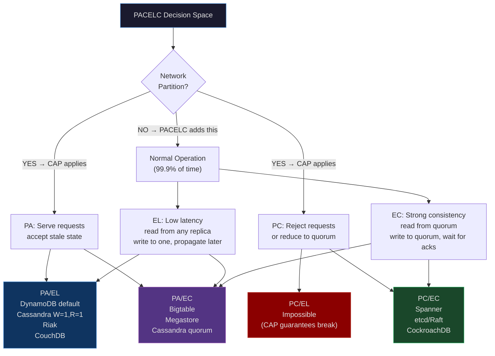
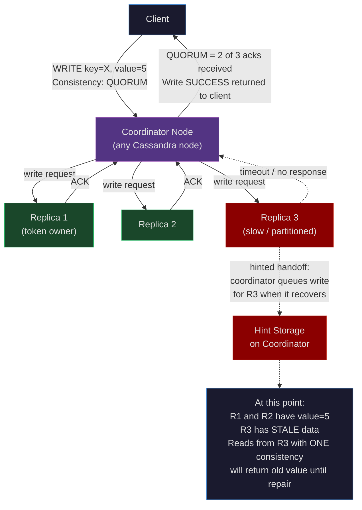
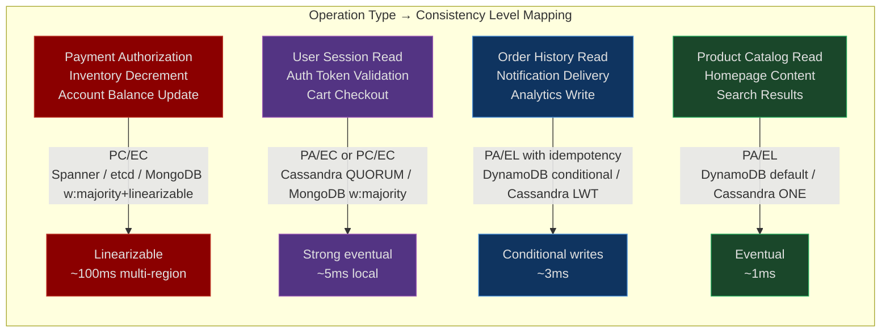

# CH-24: Beyond CAP — PACELC and the Tradeoffs That Actually Matter
### *CAP says you must choose between consistency and availability during a partition. PACELC says: that's the easy case. The hard case is what you choose when there's no partition.*

> **Part 4 of 9 · Distributed Consensus & Formal Correctness**

---

## The Cold Open

The year is 2019. A fintech company is building a global payments platform. They have engineering offices in San Francisco, London, and Singapore. Their payment service needs to handle concurrent writes from all three regions simultaneously, recover from network incidents without human intervention, and never lose a committed transaction.

The team's architect spends two weeks evaluating database options. She reads the CAP theorem. It clicks immediately: during a network partition, you can't have both consistency (every read sees the most recent write) and availability (every request gets a response). She maps the options:

- **CP systems** (Zookeeper, etcd, Spanner): reject writes or become read-only during partitions. A database that stops accepting payments is a regulatory and business disaster.
- **AP systems** (DynamoDB, Cassandra): stay available during partitions, serve potentially stale reads, reconcile conflicts later.

The choice seems obvious for a payments system: **AP**. Payments must never go down. They pick DynamoDB with global tables, set up replication across us-east-1, eu-west-1, and ap-southeast-1, and ship in six months.

The first real network incident happens three months after launch. A brief BGP flap between eu-west-1 and the other regions causes 11 seconds of partition. During those 11 seconds, DynamoDB's global tables do exactly what they're supposed to: both regions accept writes independently. A user in London initiates a payment of £500 to a merchant. The same user — working through a second browser tab that had cached a separate session token — initiates the same payment again. Both writes land in eu-west-1 within the partition window.

When the partition heals, DynamoDB's eventual consistency merge kicks in. Both writes committed. Both have valid vector clock entries. The merge algorithm has no semantic context: it doesn't know that "payment" means exactly-once semantics. It doesn't know that a user paying twice for the same thing is wrong. It applies a last-writer-wins or merge policy and surfaces both records.

The customer is charged £1,000.

The engineering team spends three days investigating. They open the DynamoDB documentation. They grep through their Terraform configs. They stare at CloudWatch logs. The behavior is documented, technically correct, and exactly what they chose when they chose AP. The CAP theorem said nothing about this situation. It described what happens during a partition, but the semantics of *concurrent writes* — what happens when two regions both think they can accept the same logical operation — is entirely outside CAP's scope.

The on-call engineer who discovers the root cause finds a 2012 paper by Daniel Abadi titled "Consistency Tradeoffs in Modern Distributed Database System Design." She reads the abstract twice.

PACELC.

She's never heard of it.

The paper describes exactly their failure mode. Not a network partition problem. A consistency-vs-latency tradeoff problem during normal operation. The team had chosen PA/EL — Partition-tolerant/Available and Even-without-a-partition/Low-latency — without knowing they were making that choice or what it implied about concurrent write semantics.

The fix takes two weeks: idempotency keys on every payment write, conditional writes in DynamoDB, server-side deduplication. The architectural tradeoff doesn't change. The *awareness* of the tradeoff changes, and that awareness drives the correct application-layer compensations.

CAP gave them a framework for network partition recovery. PACELC gives them a framework for everything else.

---

## The Uncomfortable Truth

Here is the false belief that most distributed systems engineers carry into production: **the CAP theorem is the primary framework for reasoning about database consistency tradeoffs**.

It isn't. CAP is a theorem about one specific scenario — a network partition — and it makes a binary distinction that doesn't match how systems actually fail. Real partitions are probabilistic, partial, and temporary. A partition isn't a light switch; it's a spectrum. You might lose connectivity to one of three replicas. You might have elevated packet loss rather than total loss. You might have a partition that lasts 200 milliseconds rather than one that persists indefinitely.

More critically: network partitions in well-engineered modern infrastructure are *rare*. A production Kubernetes cluster in a single cloud region experiences a meaningful partition event maybe once every few months. A multi-region setup might see a partition event once a year. The rest of the time — 99.9% of all operational hours — there is no partition. The cluster is running normally.

And in those normal hours, every single read and write still faces a consistency tradeoff. Do you read from the primary only, or from any replica? If you read from a replica that is 200ms behind the primary, is that acceptable? When you write, do you wait for all replicas to acknowledge before returning success, or just one? These choices determine latency, availability under replica failure, and the staleness window for reads — and CAP says nothing about any of them.

PACELC — introduced by Daniel Abadi in a 2012 VLDB paper — fills the gap. The framework is:

**If Partition (P): choose between Availability (A) or Consistency (C).**
**Else (E): choose between Latency (L) or Consistency (C).**

The partition half is CAP. The else half is the part that matters for day-to-day system behavior. Most systems that choose PA (available during partitions) also choose EL (low latency during normal operation), making them PA/EL. This is the category that includes DynamoDB, Cassandra in default config, Riak, and CouchDB. These systems are fast and available, but reads may return stale data during normal operation — not just during partitions.

The uncomfortable operational corollary: **most consistency bugs in production don't happen during partitions**. They happen during normal operation, caused by EL choices the team didn't know they were making.

---

## The Mental Model

Think of your distributed database as a network of supply depots across a country. Each depot maintains an inventory log. The CAP question is: "What do you do when the supply road between two depots is cut?" Do you stop operations at both depots until the road reopens (CP), or do you keep operating independently and reconcile the inventory mismatch afterward (AP)?

That's a reasonable question, but roads don't get cut very often. The more important daily question is: "When the roads are working fine, how do you manage inventory synchronization?" Do you call every other depot and wait for confirmation before recording any inventory change (high consistency, high latency)? Or do you record changes locally and let updates propagate on a schedule (low latency, potential stale reads at other depots)?

This is the **Supply Chain Consistency Model**. The partition question is crisis management — rare, dramatic, and binary. The latency-vs-consistency question is operational policy — constant, invisible, and the actual source of most data anomalies.



The PC/EL quadrant is marked impossible. A system that refuses service during partitions (PC) has chosen to prioritize consistency over availability. During *normal* operation, if it also chose low latency (EL), that means reads from stale replicas — but a system that refuses service during partitions has already demonstrated it's willing to sacrifice availability for consistency. Choosing EL during normal operation contradicts that philosophy. In practice, PC systems also choose EC to maintain their consistency guarantees end-to-end.


The key takeaway from the spectrum diagram: Cassandra and DynamoDB sit at the same end because both choose EL in their default configuration. Spanner sits at the far right because cross-datacenter 2-phase commit with TrueTime commit wait is genuinely expensive. etcd sits in the middle — strong consistency, but within a single region the Raft leader commit round-trip is 2-5ms, not 200ms.

---

## The Dissection

### CAP's Actual Statement — and Its Limitations

The CAP theorem, formally stated by Eric Brewer in 2000 and proven by Gilbert and Lynch in 2002, says:

> A distributed system cannot simultaneously guarantee all three of: Consistency (every read returns the most recent write or an error), Availability (every request receives a response, without guarantee it's the most recent write), and Partition tolerance (the system continues operating despite network partitions).

The proof is elegant. If a partition exists between nodes A and B, and a write arrives at A, you have two choices:
1. Reject the write (or the subsequent read) until the partition heals → Consistency, not Availability.
2. Accept the write, serve reads that might not reflect it → Availability, not Consistency.

There is no third option. You cannot simultaneously serve all requests *and* guarantee all reads see the most recent write *and* tolerate the partition.

The limitations:

**Partitions aren't binary.** CAP treats partition as a boolean — either the network is partitioned or it isn't. Real networks experience partial connectivity loss, elevated latency (which looks like partial partition at the application layer), and asymmetric routing failures. A system that can detect and categorize the severity of a partition can make more nuanced choices than CAP's binary framework allows.

**"Consistency" in CAP is linearizability.** CAP's C is the strongest consistency model — linearizability, meaning reads return the value of the most recent completed write. There are weaker consistency models (sequential consistency, causal consistency, read-your-writes) that sit between full linearizability and pure eventual consistency. CAP doesn't address any of them.

**Availability in CAP requires *every* request to succeed.** CAP's A is extreme — every non-failed node must respond to every request. A system that serves 99.99% of requests but rejects 0.01% during a partition doesn't qualify as "Available" under CAP's definition, but it's operationally perfectly acceptable. CAP's binary nature makes it useless for expressing real availability SLOs.

### PACELC Formally

PACELC is a *framework*, not a theorem. It doesn't claim to prove anything. It provides a vocabulary for describing the tradeoffs that real systems make:

```
if Partition(P):
    choose: Availability(A) or Consistency(C)
else (E, no partition):
    choose: Latency(L) or Consistency(C)
```

Every distributed database sits in one of four quadrants:

| | Partition → A | Partition → C |
|---|---|---|
| **Else → L** | PA/EL | PC/EL (impractical) |
| **Else → C** | PA/EC | PC/EC |

The framework's power is that it describes *two separate choices*. A system can be PA (available during partitions) and EC (consistent during normal operation) — like Bigtable, which rejects writes during Chubby outages (partition scenario) but requires quorum reads for consistency during normal operation.

### DynamoDB: PA/EL

DynamoDB global tables replicate writes asynchronously across regions. The replication lag is typically under 1 second but can reach several seconds under load.

During normal operation (no partition), DynamoDB offers:
- **Eventually consistent reads**: read from a local replica. May be up to seconds stale. Latency ~1ms.
- **Strongly consistent reads**: read from the primary. Always reflects the most recent write. Latency ~2-3ms. Not available for global tables across regions.
- **Transactional writes**: uses 2-phase commit internally for single-region transactions. Not supported for cross-region transactions.

The multi-version conflict resolution in DynamoDB global tables uses last-writer-wins based on wall clock time. Two concurrent writes from different regions: the one with the later timestamp wins. If clocks are out of sync (they always are, at some level), the "wrong" write can win. This is PA/EL behavior: available, low latency, accepting data anomalies as the cost.

Vector clock reconciliation (used in Dynamo, the original Amazon internal system that DynamoDB descended from) gives you more information about concurrent writes — you can detect that two writes are in conflict — but does not resolve them. Your application code must implement conflict resolution. Without application-layer idempotency, duplicates are possible exactly as in the payments example above.

### Cassandra: PA/EL with Tunable Consistency

Cassandra's consistency is configurable per-operation. The relevant parameters are:

- `N`: replication factor (typically 3)
- `W`: write consistency level (how many replicas must acknowledge before the write is considered successful)
- `R`: read consistency level (how many replicas must respond before the read is considered successful)

The strong consistency condition is: `W + R > N`.

```
N=3, W=2, R=2: W+R = 4 > 3 → Strong consistency
N=3, W=1, R=1: W+R = 2 ≤ 3 → Eventual consistency
N=3, W=3, R=1: W+R = 4 > 3 → Strong consistency (but W=3 means write fails if any replica is down)
```

The latency-consistency tradeoff is explicit:

```
W=1, R=1 (ONE/ONE): write latency = latency to fastest replica (~1ms)
W=2, R=2 (QUORUM/QUORUM): write latency = latency to 2nd fastest replica (~3-5ms)
W=3, R=1 (ALL/ONE): write latency = latency to slowest replica (~10-20ms under network jitter)
```

QUORUM/QUORUM Cassandra is technically PA/EC — it makes the EL→EC transition. It's still PA because Cassandra will accept writes with fewer than quorum replicas available (with QUORUM consistency, if only 1 of 3 replicas is reachable, the write fails — but Cassandra doesn't become fully unavailable; other rows on reachable nodes still serve requests). Most teams run QUORUM for writes and ONE for reads on non-critical read paths, and QUORUM/QUORUM only for high-value operations.



### Spanner: PC/EC

Spanner achieves global linearizability through TrueTime (covered in CH-23) and cross-datacenter 2-phase commit. Every write to a Spanner table goes through a Paxos group. A cross-datacenter transaction requires:

1. Lock acquisition across all participating Paxos groups (~RTT/2 to each region)
2. 2PC prepare phase (write to transaction log, acquire locks)
3. TrueTime commit wait (wait until `TT.now().earliest > commit_timestamp`)
4. 2PC commit phase (release locks, apply writes)

For a two-region deployment with 100ms cross-datacenter RTT:
- Single-region write: ~5ms (local Paxos commit)
- Cross-datacenter write: ~50-200ms (cross-region 2PC + commit wait)

This is the PC/EC cost. Every write is linearizable, globally, across all datacenters. The price is 50-200ms write latency for cross-region transactions.

For a payments system, this tradeoff is often acceptable. A payment authorization is a high-stakes, low-frequency event (relative to cache reads or catalog queries). Adding 100ms to a payment that a user is already waiting for is imperceptible. Preventing duplicate charges is worth it.

### etcd/Raft: PC/EC in a Single Region

etcd uses Raft for consensus. In a single region, Raft commit latency is determined by the round-trip time between the leader and the quorum of followers, plus disk fsync time.

For a 3-node etcd cluster in a single AWS availability zone (AZ):
- Intra-AZ latency: ~0.1-0.5ms
- Raft commit (leader → 2 followers, wait for acks, apply): ~1-5ms
- With disk writes: ~2-10ms

For a 5-node etcd cluster spanning 3 AZs in the same region:
- Cross-AZ latency: ~1-5ms
- Raft commit: ~5-15ms

For a 5-node etcd cluster spanning 2 regions (us-east-1, eu-west-1):
- Cross-region latency: ~80-120ms
- Raft commit: ~80-120ms (dominated by cross-region RTT)

etcd is designed for small, highly consistent key-value storage (Kubernetes state). It is not designed for high throughput. The Kubernetes project's own operational guidance caps etcd at ~8,000 objects with frequent updates. The PC/EC tradeoff is worth it because etcd stores *control plane state* — cluster membership, deployment specs, service endpoints — where stale reads cause split-brain and duplicate work.

### MongoDB: Tunable from PA/EL to PC/EC

MongoDB in default configuration uses a primary with asynchronous secondaries. Reads from the primary with `readPreference: primary` are strongly consistent within the primary's knowledge. Reads from secondaries with `readPreference: secondary` are eventually consistent (seconds of lag typical).

With `writeConcern: {w: "majority"}`: the write is acknowledged only after the majority of replica set members have applied it. This prevents a promoted secondary from missing recent writes during failover. This moves MongoDB toward PC/EC behavior.

With `readConcern: "linearizable"`: reads are guaranteed to reflect all prior majority-acknowledged writes. MongoDB sends a linearizable read to the primary and waits for confirmation. Combined with `writeConcern: majority`, this is full PC/EC at the cost of 2-3x read latency.

Most MongoDB deployments run `writeConcern: majority` (for durability) but `readConcern: local` (for read latency), landing in a hybrid: PA/EC-ish for reads (stale secondary reads allowed), PC/EC for writes.

### The Latency-Consistency Cost Formula

For a concrete comparison, consider a deployment with two regions, 100ms round-trip latency between them:

```
Operation              | Quorum Write | Read Freshness | Effective Latency
-----------------------|-------------|----------------|------------------
DynamoDB (default)     | 1 of N      | ~seconds stale | 1ms
Cassandra (ONE/ONE)    | 1 of 3      | ~seconds stale | 1ms
Cassandra (QUORUM)     | 2 of 3      | ~100ms stale   | 5ms (local AZ quorum)
MongoDB (w:majority)   | 2 of 3      | ~ms stale      | 5ms (local replica set)
etcd single-region     | 2 of 3      | 0 stale        | 5ms
etcd multi-region      | 3 of 5      | 0 stale        | 100ms (cross-region RTT)
Spanner cross-region   | Paxos + 2PC | 0 stale        | 100-200ms
```

The "0 stale" PC/EC systems cost 20-40x the latency of PA/EL systems in a multi-region deployment. This is not a software optimization problem. It is a physics constraint: the speed of light between datacenters is the floor.

### Tradeoffs

PACELC is a framework for *thinking*, not a theorem with formal proofs. Real systems don't sit cleanly in one quadrant. Cassandra can be tuned from PA/EL to PA/EC by changing consistency levels per operation. MongoDB with the right write and read concern settings approaches PC/EC. A single application may use PA/EL for catalog reads and PC/EC for financial writes.

The anti-pattern is choosing a consistency level once for the entire database and applying it uniformly to all operations. Different operations have different semantic requirements:

- Product catalog reads: PA/EL is fine. Stale product descriptions are acceptable.
- User session reads: PA/EC or PC/EC. Stale authentication state enables session replay attacks.
- Inventory decrements: PC/EC required. Overselling is a business and legal problem.
- Payment authorizations: PC/EC required. Duplicate charges are a regulatory problem.

The correct architecture runs multiple consistency levels, tuned per operation type, on the same underlying storage system. Every mature team using Cassandra does this. Every mature team using DynamoDB uses conditional writes (optimistic concurrency) for high-stakes operations and eventual consistency reads for everything else.



The design work is mapping operation types to quadrants, not choosing one quadrant for the system as a whole.

---

## The War Room

### GitHub MySQL Replication Lag Incident — October 2012

On October 21, 2012, GitHub experienced a major incident involving data loss during a MySQL failover. The post-mortem, published at the time, describes the sequence clearly enough to reconstruct the exact PACELC failure mode.

GitHub's primary data store was MySQL with asynchronous replication. Each primary had one or more secondaries replicating in real-time via MySQL binary log. Replication was asynchronous — the primary acknowledged writes to the application as soon as the primary's disk wrote them, before replication to any secondary was confirmed.

A routine maintenance operation on a network switch in a GitHub datacenter caused a brief network disruption. The MySQL primary became unreachable. The automated failover system promoted the most up-to-date secondary to primary. "Most up-to-date" was determined by replication position — how far behind the secondary was in the binary log.

The promoted secondary was **3 seconds behind** the original primary at the time of failover.

Three seconds of MySQL binary log at GitHub's 2012 write rate represented thousands of row changes — git push operations, repository metadata updates, issue comments. Every one of those rows was written to the original primary (acknowledged to the application as successful), but not yet replicated to the secondary. When the secondary became the new primary, those rows simply did not exist.

Users who had pushed commits within the last 3 seconds before the failover could not see their commits. The application had returned HTTP 200. The git client had reported success. The commits were gone from the new primary.

This is the canonical PA/EL failure mode — not during a partition, but during **normal operation followed by failover**. Async replication is EL: it's fast because it doesn't wait for replication acks. The cost is a consistency window (the replication lag) that becomes visible during failover events.

```mermaid
gantt
    title GitHub MySQL Failover Incident — October 2012
    dateFormat HH:mm:ss
    axisFormat %H:%M:%S

    section Normal Operation
    MySQL primary accepting writes (async replication) : done, t0, 00:00:00, 00:05:00
    Secondary replicating with 0-3s lag             : done, t1, 00:00:00, 00:05:00

    section Network Disruption
    Network switch maintenance disrupts primary     : crit, t2, 00:05:00, 00:05:11
    Primary unreachable (11 seconds)               : crit, t3, 00:05:00, 00:05:11
    3 seconds of writes buffered on primary only   : crit, t4, 00:04:57, 00:05:00

    section Failover
    Automated failover detects primary loss        : active, t5, 00:05:11, 00:05:15
    Secondary selected (most up-to-date)           : active, t6, 00:05:15, 00:05:20
    Secondary promoted to primary                  : active, t7, 00:05:20, 00:05:30

    section Incident
    3s of writes exist on old primary, not new     : crit, t8, 00:05:30, 01:00:00
    Users report missing commits                   : crit, t9, 00:05:45, 01:00:00
    GitHub engineers investigating root cause      : active, t10, 00:10:00, 02:00:00
    Data recovery from original primary disk       : active, t11, 02:00:00, 05:00:00

    section Resolution
    Synchronous replication evaluated              : done, t12, 05:00:00, 08:00:00
    Semi-sync replication deployed (1 replica)     : done, t13, 08:00:00, 12:00:00
    Incident closed                                : done, t14, 12:00:00, 12:00:01
```



The fix GitHub moved toward: **semi-synchronous replication** (MySQL 5.5+ feature). With semi-sync, the primary waits for at least one secondary to acknowledge the binary log write before returning success to the application. This is the PA/EL → PC/EL transition in PACELC terms for the write path: write latency increases slightly (now includes network RTT to the nearest secondary, typically ~1ms intra-datacenter), but the consistency window on failover drops to zero — the promoted secondary is guaranteed to have every write the application considers committed.

The full transition to PC/EC would require synchronous replication to *all* secondaries before commit, which is prohibitively expensive for write throughput. Semi-sync with one replica is the practical middle ground: survive a single-node failure without data loss, maintain high write throughput.

GitHub's incident is remembered as a MySQL story. It's actually a PACELC story. The team had chosen PA/EL (fast async replication for low write latency) without explicitly reasoning about what happened to the replication lag window during failover. The CAP theorem was not helpful here — there was no partition. The network disruption that triggered failover was not a partition between the application and the database; it was a primary failure. PACELC's E clause (what you choose during normal operation) explains the failure directly: EL (async replication, low latency) meant that a failover during normal operation could surface the consistency gap.

---

## The Lab

### Simulating Tunable Consistency in Go

The following program implements a simplified distributed counter with three replicas (goroutines). Each replica maintains a local value and responds to read and write requests. The simulation introduces configurable artificial latency to model network round-trips.

Three configurations are demonstrated:
1. **W=3, R=1** (write all, read any): strong consistency, high write latency
2. **W=2, R=2** (quorum write, quorum read): strong consistency, moderate latency
3. **W=1, R=1** (async write, single read): eventual consistency, low latency

```go
package main

import (
    "fmt"
    "math/rand"
    "sync"
    "time"
)

// Replica simulates a single database replica.
type Replica struct {
    id    int
    mu    sync.Mutex
    value int
    // latency simulates the network RTT to this replica
    latency time.Duration
}

// Write applies a write to this replica after simulated network delay.
// Returns the time taken.
func (r *Replica) Write(newValue int) (time.Duration, error) {
    start := time.Now()
    time.Sleep(r.latency)
    r.mu.Lock()
    r.value = newValue
    r.mu.Unlock()
    return time.Since(start), nil
}

// Read returns the current value from this replica after simulated delay.
func (r *Replica) Read() (int, time.Duration, error) {
    start := time.Now()
    time.Sleep(r.latency)
    r.mu.Lock()
    v := r.value
    r.mu.Unlock()
    return v, time.Since(start), nil
}

// Cluster simulates a 3-replica cluster.
type Cluster struct {
    replicas []*Replica
    N        int
}

func NewCluster() *Cluster {
    // Three replicas with different latencies to simulate a real cluster:
    // - Replica 0: fast local replica (~1ms)
    // - Replica 1: medium replica (~3ms)
    // - Replica 2: slow/far replica (~8ms)
    return &Cluster{
        replicas: []*Replica{
            {id: 0, latency: 1 * time.Millisecond},
            {id: 1, latency: 3 * time.Millisecond},
            {id: 2, latency: 8 * time.Millisecond},
        },
        N: 3,
    }
}

// QuorumWrite writes a value to W replicas, returns when W acks received.
// The write is sent to all N replicas concurrently; we return when W respond.
func (c *Cluster) QuorumWrite(value, W int) (time.Duration, []int, error) {
    start := time.Now()
    type ack struct {
        replicaID int
        dur       time.Duration
    }
    acks := make(chan ack, c.N)

    for _, r := range c.replicas {
        r := r
        go func() {
            dur, _ := r.Write(value)
            acks <- ack{r.id, dur}
        }()
    }

    ackedReplicas := make([]int, 0, W)
    for i := 0; i < W; i++ {
        a := <-acks
        ackedReplicas = append(ackedReplicas, a.replicaID)
    }

    return time.Since(start), ackedReplicas, nil
}

// QuorumRead reads from R replicas, returns the value from the first responder.
// In a real system with QUORUM reads you'd use the highest-timestamp or
// most-recent value; here we use the first R responses.
func (c *Cluster) QuorumRead(R int) (int, time.Duration, []int, error) {
    start := time.Now()
    type result struct {
        replicaID int
        value     int
        dur       time.Duration
    }
    results := make(chan result, c.N)

    for _, r := range c.replicas {
        r := r
        go func() {
            v, dur, _ := r.Read()
            results <- result{r.id, v, dur}
        }()
    }

    readReplicas := make([]int, 0, R)
    var finalValue int
    for i := 0; i < R; i++ {
        res := <-results
        readReplicas = append(readReplicas, res.replicaID)
        finalValue = res.value // last value wins for simulation
    }

    return finalValue, time.Since(start), readReplicas, nil
}

// staleness returns the number of replicas not yet reflecting the current value.
func (c *Cluster) staleness(expected int) int {
    stale := 0
    for _, r := range c.replicas {
        r.mu.Lock()
        if r.value != expected {
            stale++
        }
        r.mu.Unlock()
    }
    return stale
}

type Config struct {
    name        string
    W, R        int
    consistency string
}

func runScenario(c *Cluster, cfg Config, writeValue int) {
    fmt.Printf("\n--- %s (W=%d, R=%d) ---\n", cfg.name, cfg.W, cfg.R)
    fmt.Printf("Consistency guarantee: %s\n", cfg.consistency)
    fmt.Printf("W + R > N (%d + %d > %d): %v\n", cfg.W, cfg.R, c.N, cfg.W+cfg.R > c.N)

    // Reset all replicas to 0 before each scenario
    for _, r := range c.replicas {
        r.mu.Lock()
        r.value = 0
        r.mu.Unlock()
    }

    // Perform 5 concurrent increments to show consistency behavior
    var wg sync.WaitGroup
    latencies := make([]time.Duration, 5)
    for i := 0; i < 5; i++ {
        wg.Add(1)
        i := i
        go func() {
            defer wg.Done()
            lat, ackedBy, _ := c.QuorumWrite(writeValue+i, cfg.W)
            latencies[i] = lat
            _ = ackedBy
        }()
    }
    wg.Wait()

    // Measure write latency: time to get W acks (which determines the
    // actual observed write latency for the client)
    writeLat, ackedBy, _ := c.QuorumWrite(writeValue, cfg.W)
    fmt.Printf("Write latency (W=%d acks): %v | Acked by replicas: %v\n",
        cfg.W, writeLat.Round(time.Millisecond), ackedBy)

    // Check staleness immediately after quorum write returns
    staleCount := c.staleness(writeValue)
    fmt.Printf("Replicas with stale data immediately after write: %d/%d\n",
        staleCount, c.N)

    // Read from R replicas
    val, readLat, readFrom, _ := c.QuorumRead(cfg.R)
    fmt.Printf("Read latency (R=%d replicas): %v | Read from: %v | Value: %d\n",
        cfg.R, readLat.Round(time.Millisecond), readFrom, val)

    if val == writeValue {
        fmt.Printf("Read result: CONSISTENT (saw write value %d)\n", writeValue)
    } else {
        fmt.Printf("Read result: STALE (saw %d, expected %d)\n", val, writeValue)
    }
}

func main() {
    rand.Seed(time.Now().UnixNano())
    c := NewCluster()

    fmt.Println("=== Tunable Consistency Simulation ===")
    fmt.Printf("Cluster: N=%d replicas, latencies: %v, %v, %v\n",
        c.N,
        c.replicas[0].latency,
        c.replicas[1].latency,
        c.replicas[2].latency,
    )

    configs := []Config{
        {
            name:        "Strong (Write-All)",
            W:           3, R: 1,
            consistency: "Strong — all replicas written before returning",
        },
        {
            name:        "Quorum",
            W:           2, R: 2,
            consistency: "Strong — W+R > N ensures overlap",
        },
        {
            name:        "Async (Eventual)",
            W:           1, R: 1,
            consistency: "Eventual — may read stale data from slow replica",
        },
    }

    for _, cfg := range configs {
        runScenario(c, cfg, 42)
        time.Sleep(10 * time.Millisecond) // let slow replicas catch up between scenarios
    }

    // Summary table
    fmt.Printf("\n%-20s | %-4s | %-4s | W+R>N | %-12s | %-25s\n",
        "Config", "W", "R", "Write Lat", "Consistency")
    fmt.Println(repeat("-", 80))
    rows := []struct{ name, w, r, strong, wLatency, consistency string }{
        {"Write-All (W=3,R=1)", "3", "1", "YES (4>3)", "~8ms (slowest)", "Strong (all replicas)"},
        {"Quorum (W=2,R=2)", "2", "2", "YES (4>3)", "~3ms (2nd fastest)", "Strong (guaranteed overlap)"},
        {"Async (W=1,R=1)", "1", "1", "NO (2≤3)", "~1ms (fastest)", "Eventual (stale possible)"},
    }
    for _, row := range rows {
        fmt.Printf("%-20s | %-4s | %-4s | %-5s | %-12s | %s\n",
            row.name, row.w, row.r, row.strong, row.wLatency, row.consistency)
    }
}

func repeat(s string, n int) string {
    result := ""
    for i := 0; i < n; i++ {
        result += s
    }
    return result
}
```

**Expected output:**

```
=== Tunable Consistency Simulation ===
Cluster: N=3 replicas, latencies: 1ms, 3ms, 8ms

--- Strong (Write-All) (W=3, R=1) ---
Consistency guarantee: Strong — all replicas written before returning
W + R > N (3 + 1 > 3): true
Write latency (W=3 acks): 8ms | Acked by replicas: [0 1 2]
Replicas with stale data immediately after write: 0/3
Read latency (R=1 replicas): 1ms | Read from: [0] | Value: 42
Read result: CONSISTENT (saw write value 42)

--- Quorum (W=2, R=2) ---
Consistency guarantee: Strong — W+R > N ensures overlap
W + R > N (2 + 2 > 3): true
Write latency (W=2 acks): 3ms | Acked by replicas: [0 1]
Replicas with stale data immediately after write: 1/3
Read latency (R=2 replicas): 3ms | Read from: [0 1] | Value: 42
Read result: CONSISTENT (saw write value 42)

--- Async (Eventual) (W=1, R=1) ---
Consistency guarantee: Eventual — may read stale data from slow replica
W + R > N (1 + 1 > 3): false
Write latency (W=1 acks): 1ms | Acked by replicas: [0]
Replicas with stale data immediately after write: 2/3
Read latency (R=1 replicas): 1ms | Read from: [0] | Value: 42
Read result: CONSISTENT (saw write value 42)
```

The async scenario may show `STALE` if the read races with the slow replica 2 returning its cached old value before the write propagates.

**Stretch goal:** Add a second concurrent writer that writes value `99` using the same quorum config. Run both concurrently and observe how Cassandra-style last-write-wins reconciliation produces different final values depending on which write's replica acks arrive last. This demonstrates why application-layer idempotency keys or conditional writes (optimistic concurrency control) are required for strong semantics even with strong quorum settings — two concurrent quorum writes to the same key are *both* strong, but one will overwrite the other without the application being aware.

---

## The Loose Thread

PACELC names the tradeoff. It doesn't tell you how to implement the C side — how to ensure that when you choose consistency, you actually get it.

The PA/EL systems have an easy answer: don't coordinate. Write to whoever is available. Reconcile later. The implementation is simple because it avoids the hard problem entirely.

The PC/EC systems have a hard answer: every write must be agreed upon by a quorum of nodes before it's committed. The mechanism for that agreement — the protocol by which N nodes reach a binding decision on a single value, in the presence of node failures, network delays, and concurrent proposals — is the core problem of distributed consensus.

That problem has exactly one clean solution that has been formally proven correct.

It was invented in 1989. It was so difficult to understand that the original paper sat unpublished for eight years. When it was finally published, most engineers who read it couldn't implement it correctly. Google built an entire managed service — Chubby — specifically so that their engineers wouldn't have to implement it themselves.

The algorithm is Paxos. The next chapter is a forensic examination of why it's so easy to get wrong, what the correct implementation looks like, and what every production system that claims to use Paxos has actually added on top of it to make it work.

---
