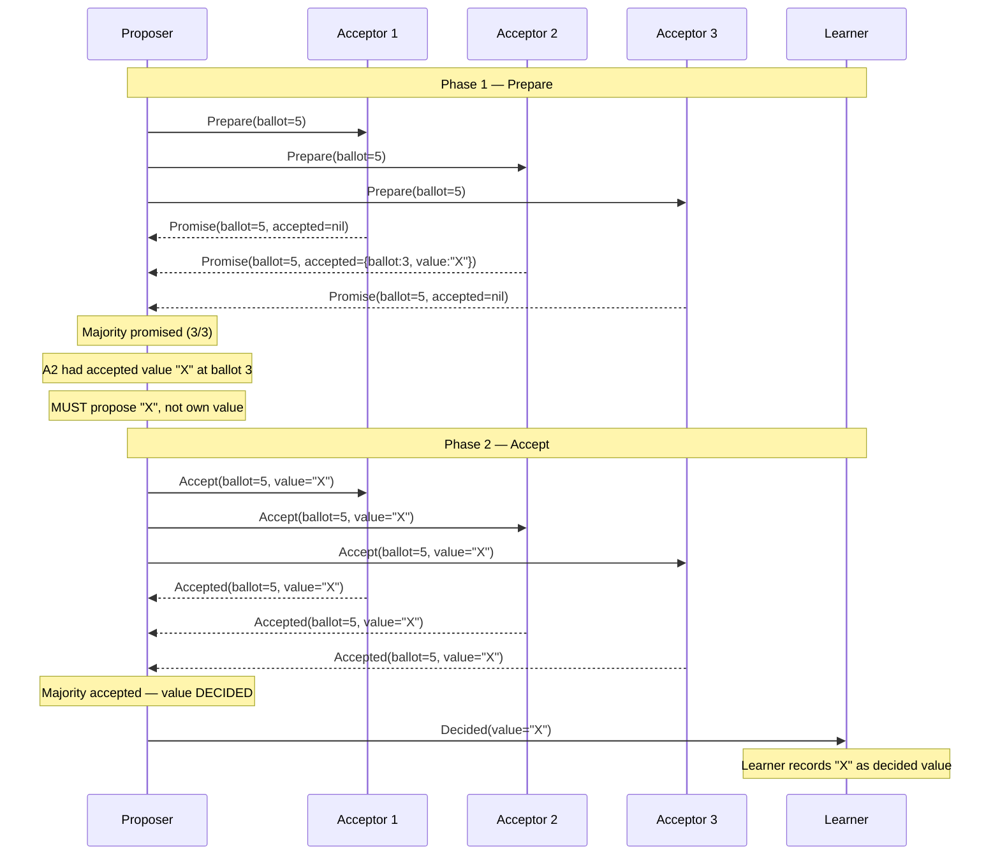
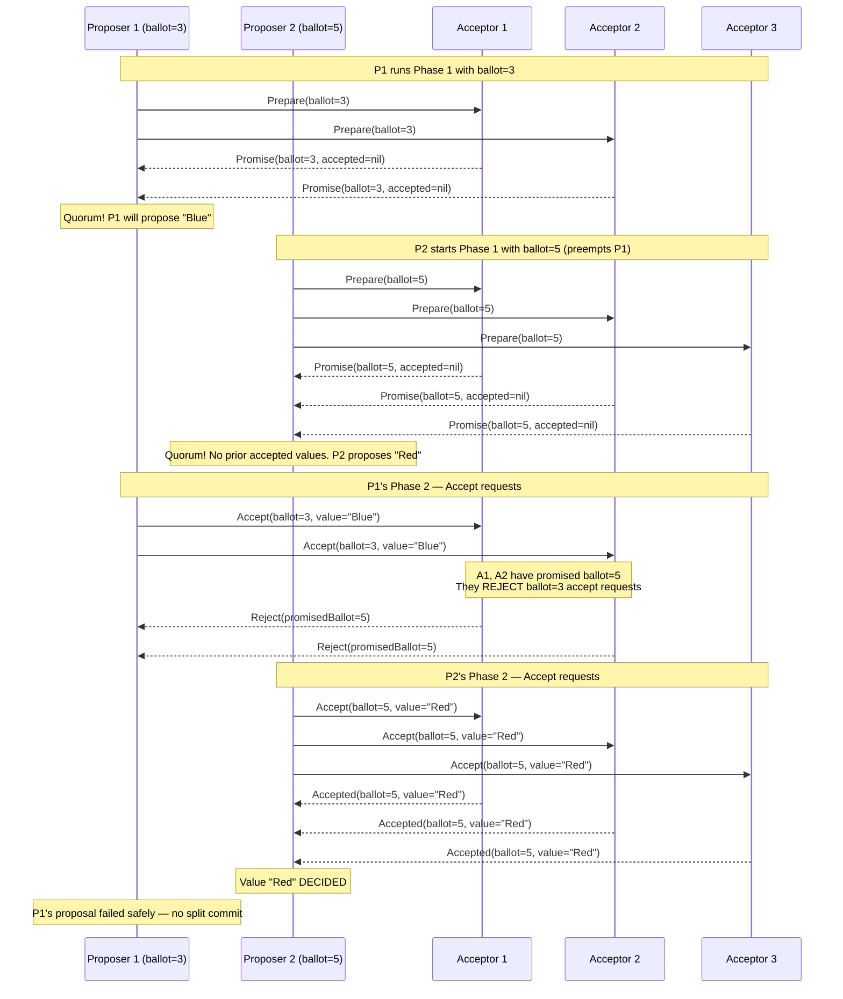
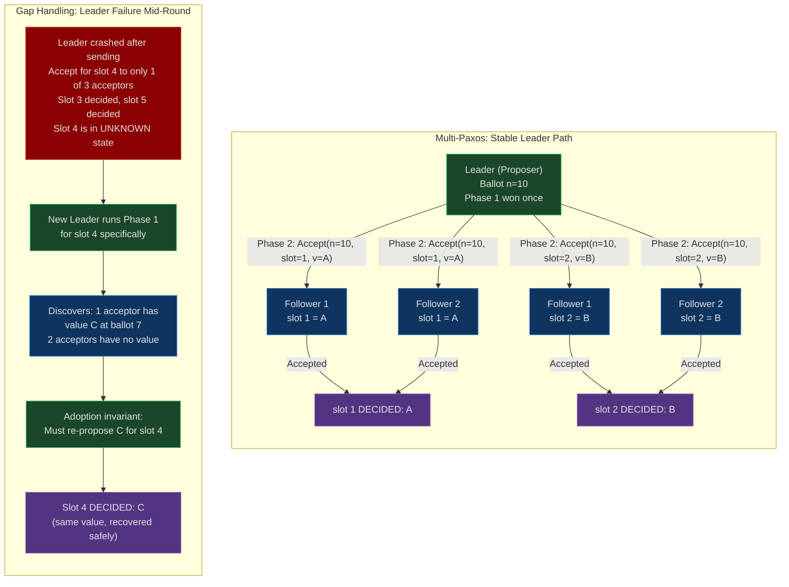

# CH-25: Paxos — The Algorithm Everyone Gets Wrong
### *Lamport's original Paxos paper was so difficult that it was rejected for years. The simplified version is easier to understand and wrong to implement. This chapter gives you the version that actually works.*

> **Part 4 of 9 · Distributed Consensus & Formal Correctness**

---

## The Cold Open

The year is 2006. Mike Burrows has just published the Chubby paper, describing Google's distributed lock service that underpins Bigtable, Megastore, and dozens of internal systems. The paper is candid in a way academic papers rarely are: "Paxos is surprisingly easy to implement, but the required extensions are not."

A new engineer — call him D — joins a team at a different company that is building a distributed coordination service. Management is not willing to take a dependency on Chubby (it's Google-internal), but D has read Burrows's paper and understands the problem. D reads Lamport's original 1998 paper, "The Part-Time Parliament." He reads it twice. He cannot tell whether the second reading helped. The paper is written as a fantasy about a Greek parliament where legislators come and go at arbitrary intervals, and the protocol is specified through that metaphor for the first thirty pages before the actual algorithm appears. The notation is non-standard. The proofs are dense.

D reads "Paxos Made Simple," Lamport's 2001 follow-up, written specifically to be accessible. It is seven pages. It is much clearer. D feels confident. He implements Single-Decree Paxos in Java over a weekend. He writes unit tests. All tests pass.

He shows the implementation to a senior engineer on the team, who looks at the proposer logic and asks one question: "What happens in Phase 2 if the acceptor has already responded to a higher-numbered prepare from a different proposer?"

D checks the code. The acceptor ignores the accept request from the lower-numbered proposer, which is correct. But the proposer doesn't handle the case where its Phase 2 accept requests are rejected — it just retries with the same ballot number. If a second proposer has already run Phase 1 with a higher ballot, D's proposer will spin forever, issuing Phase 2 accept requests that every acceptor will reject, and never detecting that it's been superseded.

This is not a livelock. This is a silent correctness violation. Under certain timing conditions, D's proposer would believe a value was committed when it wasn't.

D fixes that bug. Three weeks later the senior engineer finds another: the Phase 2 proposer, on receiving a Phase 1 promise that includes a previously accepted value, was checking `acceptedValue != nil` but failing to propagate `acceptedValue` when the promise contained a value accepted by a *different* ballot than the one D was tracking. The invariant — "adopt the value associated with the highest ballot number from all promises received" — was stated in the paper. D had read it. He had not realized that "highest ballot number" applied to the set of *all* promises in aggregate, not just the most recent promise received.

This bug would produce a safety violation: two different values could be committed for the same instance if two proposers happened to complete Phase 1 concurrently and each adopted the wrong value in their Phase 2.

The fix is three lines. Finding the bug takes three months because the failure mode requires a specific concurrent timing that doesn't occur in unit tests and occurs only occasionally in integration tests. The bug is found by a senior engineer who has been reading Paxos proofs for six years.

D's implementation passes all tests after the fix. The team deploys it. The implementation runs in production for four years. As far as anyone knows, it is correct.

"As far as anyone knows" is the phrase that haunts every team that has ever implemented Paxos.

---

## The Uncomfortable Truth

"Paxos Made Simple" is a description of **Single-Decree Paxos**: a protocol for reaching agreement among N processes on a single value, in the presence of process failures and message delays. The paper is correct. The algorithm it describes is proven safe and live (under the assumption that a majority of processes are running and can communicate).

That protocol is not useful by itself.

Real distributed systems need to agree on a *sequence* of values — a log of operations. "The value of key X after operation 1, then the value of key X after operation 2, ..." — this is Multi-Paxos, and "Paxos Made Simple" says approximately two paragraphs about it. The two paragraphs describe the key optimization (skip Phase 1 once you're the stable leader), but leave every other design decision to the reader:

- **Leader election**: How does a node know it's the leader? What prevents two nodes from simultaneously believing they're the leader?
- **Log slot assignment**: How do you assign operation indices? What if slots arrive out of order?
- **Gap handling**: Slot 5 can be decided before slot 4 if the proposer for slot 4 failed mid-round. How does the new leader discover and fill gaps?
- **Log compaction**: A replicated log that grows forever is not viable. When do you snapshot? How do you bootstrap a new replica from a snapshot?
- **Membership changes**: How do you safely add or remove servers from the Paxos group without violating the quorum invariant?
- **Client sessions**: How do you ensure exactly-once execution of client requests? What happens if the client retries a request and it's been applied twice?
- **Recovery after leader failure**: The new leader must discover all uncommitted log slots from the previous leader. How?

Each of these problems has multiple valid solutions. Each solution introduces new invariants that can be violated if the implementation is not careful. The "Paxos as folklore" phenomenon — Lamport's own characterization in a later paper — means that the distributed systems community has developed solutions to these problems through practice and experience, not through formal specification. Different teams implement different solutions. Some of those solutions are subtly wrong and the bugs take years to surface.

Google built Chubby as a managed service specifically so that other engineering teams would not have to implement Paxos. This is not an overcautious corporate policy. It reflects the realistic assessment of engineers who have implemented Paxos correctly and watched other teams fail to do so.

The uncomfortable corollary: if you use etcd, you're not using Paxos. You're using Raft, which is a complete, formally specified consensus protocol that makes all of the above design decisions explicitly. The reason Raft exists is that Diego Ongaro and John Ousterhout set out to design a consensus protocol that was *understandable* — where every design choice was justified in the specification, not left to folklore. That Raft is now the standard choice for new implementations of distributed consensus is not because it is algorithmically superior to Paxos. It is because it is implementable without a PhD in distributed systems.

---

## The Mental Model

Imagine a parliament where any member can call a new legislative session at any time, but every member is bound by commitments made in prior sessions. A member who calls Session 7 must honor any bills that were provisionally accepted in Sessions 1 through 6 — even bills that were never finalized. If a member in Session 4 provisionally approved Bill A, any new session leader who discovers that provisional approval must propose Bill A in their own session before proposing anything new. They are not allowed to propose Bill B and pretend Bill A never happened.

This is the **Parliamentary Commitment Protocol**. The safety invariant of Paxos maps directly to it: once any acceptor has accepted a value in any ballot, that value must be proposed in all subsequent ballots with higher numbers, until the value is fully committed. No proposer is allowed to "overwrite" a previously accepted value with a new one — they must adopt it.

The mechanism that enforces this is Phase 1. A proposer that wins Phase 1 (receives promises from a majority) learns about any previously accepted values from those promises and is *required* to use the highest-ballot-number accepted value as its Phase 2 proposal. This is what makes Paxos safe: even if a previous proposer crashed mid-round, the committed value cannot be lost because any new proposer that wins a majority in Phase 1 will discover and re-propose it.



The critical constraint illustrated above: in Phase 1, A2 reports it had previously accepted value `"X"` at ballot 3. The proposer in ballot 5 discovers this and *must* propose `"X"` in Phase 2, even if it had originally intended to propose a different value. This is the invariant that prevents two different values from being committed to the same instance.



The second diagram shows the safety mechanism in action: P1's Phase 2 is blocked because A1 and A2 have already promised ballot 5. The safety invariant holds — only one value ("Red") gets committed. P1's "Blue" was never accepted by any majority.

---

## The Dissection

### Single-Decree Paxos: Formal Description

Single-Decree Paxos solves the following problem: N processes (called acceptors) must agree on a single value from a set of proposed values, such that:

- **Safety**: at most one value is ever committed ("decided")
- **Liveness**: if a majority of acceptors are running, some value is eventually decided

The protocol has two phases, three message types, and three roles:

| Role | Responsibility |
|------|---------------|
| Proposer | Initiates rounds, drives consensus |
| Acceptor | Votes on proposals, maintains persistent state |
| Learner | Observes the decided value (may be same node as proposer) |

**Phase 1a — Prepare**: A proposer selects a ballot number `n` (must be globally unique and higher than any it has used before) and sends `Prepare(n)` to all acceptors.

**Phase 1b — Promise**: Each acceptor, on receiving `Prepare(n)`:
- If `n` is greater than any ballot it has previously promised: record `n` as the highest promised ballot, respond `Promise(n, accepted_ballot, accepted_value)` where `accepted_ballot` and `accepted_value` are the ballot and value of the last `Accept` message this acceptor responded to (or `nil` if none).
- Otherwise: reject (or ignore) the prepare.

**Phase 2a — Accept**: If the proposer receives promises from a majority of acceptors:
- Let `v` = the value associated with the highest `accepted_ballot` among all promises received. If no promise contained an accepted value, `v` = the proposer's own desired value.
- Send `Accept(n, v)` to all acceptors.

**Phase 2b — Accepted**: Each acceptor, on receiving `Accept(n, v)`:
- If `n >= highest_promised_ballot`: accept the value, update persistent state, respond `Accepted(n, v)`.
- Otherwise: reject.

**Decision**: Once any acceptor has sent `Accepted(n, v)` and the proposer has received `Accepted` from a majority, value `v` is decided. The proposer notifies learners.

The correctness invariants:

1. **Promise invariant**: An acceptor that promises ballot `n` will never accept any ballot `m < n`.
2. **Adoption invariant**: A proposer that wins Phase 1 with ballot `n` must use the value associated with the highest accepted ballot among all promises. It cannot substitute its own value if any acceptor reports a prior acceptance.
3. **Persistence invariant**: Acceptors must persist their promise and acceptance state to durable storage before sending any response. A crash and restart must recover this state.

### Complete Go Implementation: Single-Decree Paxos

```go
package paxos

import (
    "fmt"
    "math/rand"
    "sync"
    "time"
)

// BallotNumber uniquely identifies a proposal round.
// Using (sequence, proposerID) ensures global uniqueness without coordination.
type BallotNumber struct {
    Seq        int
    ProposerID int
}

func (b BallotNumber) GreaterThan(other BallotNumber) bool {
    if b.Seq != other.Seq {
        return b.Seq > other.Seq
    }
    return b.ProposerID > other.ProposerID
}

func (b BallotNumber) GreaterOrEqual(other BallotNumber) bool {
    return b == other || b.GreaterThan(other)
}

func zeroBallot() BallotNumber { return BallotNumber{0, 0} }

// PrepareMsg is Phase 1a: proposer → acceptors.
type PrepareMsg struct {
    Ballot BallotNumber
}

// PromiseMsg is Phase 1b: acceptor → proposer.
type PromiseMsg struct {
    Ballot          BallotNumber // the ballot being promised
    AcceptedBallot  BallotNumber // highest ballot for which this acceptor accepted a value
    AcceptedValue   interface{}  // the value accepted at AcceptedBallot (nil if none)
    AcceptorID      int
}

// AcceptMsg is Phase 2a: proposer → acceptors.
type AcceptMsg struct {
    Ballot BallotNumber
    Value  interface{}
}

// AcceptedMsg is Phase 2b: acceptor → proposer.
type AcceptedMsg struct {
    Ballot     BallotNumber
    Value      interface{}
    AcceptorID int
    Rejected   bool // true if acceptor had a higher promised ballot
}

// Acceptor maintains persistent state.
type Acceptor struct {
    id             int
    mu             sync.Mutex
    promisedBallot BallotNumber // highest ballot promised in Phase 1
    acceptedBallot BallotNumber // ballot of last accepted value
    acceptedValue  interface{}  // last accepted value (nil if none)

    // simulated network latency and failure probability
    latency       time.Duration
    failureChance float64
}

// Prepare handles a Phase 1a message. Returns nil if rejected.
func (a *Acceptor) Prepare(msg PrepareMsg) *PromiseMsg {
    time.Sleep(a.latency)
    if rand.Float64() < a.failureChance {
        return nil // simulate network drop
    }

    a.mu.Lock()
    defer a.mu.Unlock()

    if msg.Ballot.GreaterThan(a.promisedBallot) {
        // Persist before responding — in a real system this is an fsync
        a.promisedBallot = msg.Ballot
        return &PromiseMsg{
            Ballot:         msg.Ballot,
            AcceptedBallot: a.acceptedBallot,
            AcceptedValue:  a.acceptedValue,
            AcceptorID:     a.id,
        }
    }
    // Reject: we've promised a higher ballot already
    return nil
}

// Accept handles a Phase 2a message. Returns an AcceptedMsg (possibly rejected).
func (a *Acceptor) Accept(msg AcceptMsg) AcceptedMsg {
    time.Sleep(a.latency)

    a.mu.Lock()
    defer a.mu.Unlock()

    if msg.Ballot.GreaterOrEqual(a.promisedBallot) {
        // Persist before responding
        a.acceptedBallot = msg.Ballot
        a.acceptedValue = msg.Value
        a.promisedBallot = msg.Ballot
        return AcceptedMsg{Ballot: msg.Ballot, Value: msg.Value, AcceptorID: a.id}
    }
    return AcceptedMsg{
        Ballot:     msg.Ballot,
        AcceptorID: a.id,
        Rejected:   true,
    }
}

// Proposer drives the Paxos protocol.
type Proposer struct {
    id        int
    acceptors []*Acceptor
    quorum    int
    currentSeq int
}

func NewProposer(id int, acceptors []*Acceptor) *Proposer {
    return &Proposer{
        id:        id,
        acceptors: acceptors,
        quorum:    len(acceptors)/2 + 1,
    }
}

func (p *Proposer) nextBallot() BallotNumber {
    p.currentSeq++
    return BallotNumber{p.currentSeq, p.id}
}

// Propose runs one complete round of Single-Decree Paxos.
// Returns the decided value (may differ from proposed if a prior value exists).
func (p *Proposer) Propose(value interface{}) (interface{}, error) {
    maxRetries := 10
    backoff := 10 * time.Millisecond

    for attempt := 0; attempt < maxRetries; attempt++ {
        ballot := p.nextBallot()

        // === Phase 1: Prepare ===
        type promiseResult struct{ msg *PromiseMsg }
        promiseCh := make(chan promiseResult, len(p.acceptors))

        for _, a := range p.acceptors {
            a := a
            go func() {
                msg := a.Prepare(PrepareMsg{Ballot: ballot})
                promiseCh <- promiseResult{msg}
            }()
        }

        promises := make([]*PromiseMsg, 0, len(p.acceptors))
        for range p.acceptors {
            res := <-promiseCh
            if res.msg != nil {
                promises = append(promises, res.msg)
            }
        }

        if len(promises) < p.quorum {
            fmt.Printf("Proposer %d ballot %v: Phase 1 failed (%d/%d promises), retrying\n",
                p.id, ballot, len(promises), p.quorum)
            time.Sleep(backoff + time.Duration(rand.Intn(int(backoff))))
            backoff *= 2
            continue
        }

        // Adoption invariant: use value from highest-ballot promise, if any.
        proposeValue := value
        highestAcceptedBallot := zeroBallot()
        for _, promise := range promises {
            if promise.AcceptedValue != nil &&
                promise.AcceptedBallot.GreaterThan(highestAcceptedBallot) {
                highestAcceptedBallot = promise.AcceptedBallot
                proposeValue = promise.AcceptedValue
            }
        }
        if proposeValue != value {
            fmt.Printf("Proposer %d: adopting prior value %v (from ballot %v)\n",
                p.id, proposeValue, highestAcceptedBallot)
        }

        // === Phase 2: Accept ===
        acceptCh := make(chan AcceptedMsg, len(p.acceptors))
        for _, a := range p.acceptors {
            a := a
            go func() {
                result := a.Accept(AcceptMsg{Ballot: ballot, Value: proposeValue})
                acceptCh <- result
            }()
        }

        acceptCount := 0
        rejected := false
        for range p.acceptors {
            result := <-acceptCh
            if result.Rejected {
                rejected = true
            } else {
                acceptCount++
            }
        }

        if acceptCount >= p.quorum {
            fmt.Printf("Proposer %d: value %v DECIDED at ballot %v\n",
                p.id, proposeValue, ballot)
            return proposeValue, nil
        }

        if rejected {
            fmt.Printf("Proposer %d ballot %v: Phase 2 rejected, retrying with higher ballot\n",
                p.id, ballot)
        }
        time.Sleep(backoff + time.Duration(rand.Intn(int(backoff))))
        backoff *= 2
    }

    return nil, fmt.Errorf("proposer %d failed to reach consensus after %d attempts", p.id, maxRetries)
}
```

### The Livelock Problem

Two proposers, each with their own desired value, can prevent each other from making progress indefinitely:

1. P1 runs Phase 1 with ballot `n=3`, wins promises
2. P2 runs Phase 1 with ballot `n=5`, preempts P1's promises
3. P1's Phase 2 accept requests are rejected (promised ballot 5 > 3)
4. P1 increments to `n=7`, wins new promises
5. P2's Phase 2 accept requests are rejected (promised ballot 7 > 5)
6. Repeat forever

The liveness guarantee in Paxos requires that *eventually* only one proposer is active. In practice this means:

- **Designated leader**: only one node acts as proposer at a time. Other nodes forward proposals to the leader.
- **Exponential backoff**: competing proposers add random jitter before retrying, reducing simultaneous contention.
- **Timeout + lease**: the leader holds a timed lease. Other nodes don't start a new election until the lease expires.

The Go implementation above uses exponential backoff with jitter, which resolves livelock probabilistically but not deterministically. A production system requires explicit leader election.

### Multi-Paxos: From One Value to a Log

Multi-Paxos extends Single-Decree Paxos to agree on a sequence of values (a log). Each log slot is an independent Paxos instance. The key optimization: once a leader wins Phase 1 for any ballot, it can skip Phase 1 for subsequent slots by reusing the same ballot number. This is the "stable leader" optimization:

```
Without optimization: 2 round-trips per log entry (Phase 1 + Phase 2)
With stable leader:   1 round-trip per log entry (Phase 2 only, Phase 1 amortized)
```

The stable leader wins Phase 1 once for ballot `n`, then drives Phase 2 for slots 1, 2, 3, ... without re-running Phase 1. If the leader fails, a new node runs Phase 1 for a higher ballot to establish leadership, then resumes Phase 2.



### What "Paxos Made Simple" Doesn't Tell You

Each of the following is required for a production implementation and absent from Lamport's paper:

**Log compaction**: The Paxos log grows unboundedly. A new replica that joins must replay the entire log. Snapshots solve this: periodically serialize the application state, record the log index at which the snapshot was taken, and discard all prior log entries. New replicas bootstrap from the most recent snapshot and replay only the delta. The snapshot transfer protocol must be atomic — a partially-applied snapshot is worse than no snapshot.

**Membership changes**: Adding a server to a 3-node Paxos group changes the quorum from 2 to 3. If you add the server before it has caught up on the log, you now have a quorum requirement of 3 nodes where one node (the new one) may not have the complete log. The joint consensus approach (used in Multi-Paxos and Raft) transitions through a configuration where both the old and new configurations must both achieve quorum during the transition period.

**Exactly-once client semantics**: A client sends a request to the leader. The leader applies it to the log. Before the leader can send the response, it crashes. The client retries. The new leader receives the retry and applies the request again. The operation is now applied twice. Solving this requires client-side sequence numbers and server-side deduplication of recent client requests, stored in the log alongside operations.

**Recovery after leader failure**: When a new leader wins Phase 1, it discovers the state of all in-progress log slots from the promises it receives. For each slot where at least one acceptor has accepted a value, the new leader must re-propose that value. For slots where no acceptor has accepted anything, the new leader must determine whether the slot is "safe to skip" or whether a value might exist that wasn't covered by the Phase 1 quorum. The no-op technique — proposing a special no-op entry for uncertain slots — is standard but has subtle correctness requirements around ordering.

### Paxos vs. Raft: The Design Decision Gap

Raft (Ongaro and Ousterhout, 2014) was designed as a response to the "Paxos is folklore" problem. Raft makes explicit, documented choices for every component that Multi-Paxos leaves to the implementer:

| Component | Multi-Paxos | Raft |
|-----------|------------|------|
| Leader election | Not specified | Term-based election with randomized timeouts |
| Log replication | Not specified | AppendEntries RPC with strict log matching |
| Safety invariant | Informal ("ballot number ordering") | Formally specified (Election Restriction + Log Matching) |
| Membership changes | Not specified | Joint consensus (§6 of Raft paper) |
| Log compaction | Not specified | InstallSnapshot RPC (§7 of Raft paper) |
| Client sessions | Not specified | Session tracking with sequence numbers (§8) |

Raft is not algorithmically superior to Multi-Paxos — Heidi Howard's work on Flexible Paxos shows that Paxos can achieve the same throughput with smaller quorums under certain conditions. Raft's advantage is that an engineer who reads the Raft paper and implements it carefully is much more likely to get a correct implementation than an engineer who reads "Paxos Made Simple" and tries to extend it.

This is why etcd, CockroachDB, TiKV, and Consul all use Raft. Not because Paxos is wrong. Because the full specification of what-to-implement is in one paper, not spread across twenty years of conference proceedings.

---

## The War Room

### Cassandra Lightweight Transactions Livelock Under Contention — 2014–2016

Cassandra's Lightweight Transactions (LWT) implement Paxos for single-row conditional updates. The feature was introduced in Cassandra 2.0 (2013). The design allows any coordinator node to act as proposer for any LWT operation. There is no designated leader for a given row.

This is a deliberate architectural choice: Cassandra is a leaderless system. Adding a designated leader per row would require distributed state about which node "owns" each row, which conflicts with Cassandra's consistent hashing + gossip design.

The consequence: under high concurrency on a single row, multiple coordinators simultaneously propose Paxos ballots for the same Paxos instance. Each preempts the other. None makes progress.

In production workloads with high-contention keys — account balance updates, inventory counters, distributed locks implemented with LWT — this manifested as multi-second timeouts on operations that should complete in milliseconds.

CASSANDRA-8318 and related tickets documented the symptom: LWT requests timing out after 30-60 seconds under contention on a single partition key. Cassandra's internal metrics showed Paxos round counts per request spiking to hundreds of attempts before either succeeding or timing out.

```mermaid
gantt
    title Cassandra LWT Livelock Incident — Production Timeline
    dateFormat HH:mm:ss
    axisFormat %H:%M:%S

    section Baseline
    Normal LWT latency p99 below 20ms        : done, t1, 00:00:00, 00:10:00
    5 concurrent writers to hot partition    : done, t2, 00:00:00, 00:10:00

    section Contention Begins
    Load spike: 50 concurrent writers       : crit, t3, 00:10:00, 00:10:30
    Paxos round counts per request spike     : crit, t4, 00:10:00, 00:10:30
    p99 latency rises to 500ms              : crit, t5, 00:10:15, 00:11:00

    section Livelock Develops
    Proposers repeatedly preempting each other : crit, t6, 00:11:00, 00:20:00
    p99 latency exceeds 10s                  : crit, t7, 00:11:30, 00:20:00
    Requests begin timing out (30s default)  : crit, t8, 00:12:00, 00:20:00
    Application error rate climbs to 40%    : crit, t9, 00:12:30, 00:20:00

    section Diagnosis
    On-call engineer checks Cassandra metrics : active, t10, 00:20:00, 00:35:00
    paxos_prepare_requests metric abnormal   : active, t11, 00:25:00, 00:35:00
    Hot partition identified                 : active, t12, 00:30:00, 00:35:00

    section Mitigation
    Client-side backoff implemented (fix A)  : active, t13, 00:35:00, 01:00:00
    LWT retry limit reduced to 3 attempts    : active, t14, 00:40:00, 01:00:00
    Load reduced by disabling batch jobs     : active, t15, 00:45:00, 01:00:00
    p99 latency drops below 100ms           : done, t16, 01:00:00, 01:05:00

    section Long-term Fix
    Partition key redesign to reduce hotspot : done, t17, 24:00:00, 48:00:00
    Read-modify-write replaced with CRDTs    : done, t18, 48:00:00, 96:00:00
    Monitoring alert on paxos_round_count   : done, t19, 24:00:00, 25:00:00
```

The root cause matches the livelock analysis exactly. Cassandra's LWT implementation, as of Cassandra 2.x and 3.x, had no leader election mechanism for Paxos. Any coordinator could start a new Paxos round at any time. Under high contention, every coordinator was simultaneously running Phase 1, each with a higher ballot number than the last. No coordinator ever reached Phase 2 with a ballot number that hadn't already been superseded by another coordinator's Phase 1.

The mitigations:

**Client-side exponential backoff with jitter**: Each failed LWT request backs off `min(2^attempt * base, maxBackoff) + jitter` before retrying. The jitter desynchronizes concurrent proposers. This is the same technique used in distributed election protocols to prevent synchronized collisions.

**Server-side contention limits**: Cassandra 3.x added configuration to limit in-flight LWT operations per partition. This caps the number of concurrent proposers, reducing contention at the cost of increased client-visible latency for the excess requests.

**Architectural fix**: The correct solution is to avoid hot-partition LWT entirely. Operations on a single logical entity (account balance, inventory count) that require compare-and-swap should use:
- A dedicated coordination service (etcd, Zookeeper) with a proper leaded Raft/Paxos implementation
- Application-level conflict detection (optimistic locking with version numbers)
- CRDTs for operations that are semantically commutative (counters, sets)

The Cassandra LWT incident is a direct consequence of omitting leader election from a Paxos implementation. "Paxos Made Simple" doesn't specify leader election. Cassandra didn't add it. The livelock Lamport described is exactly the failure mode that resulted.

---

## The Lab

### Single-Decree Paxos: Three Scenarios

The following program demonstrates the three scenarios that every Paxos implementation must handle correctly. It extends the implementation from The Dissection with explicit message tracing.

```go
package main

import (
    "fmt"
    "math/rand"
    "sync"
    "time"
)

// === Message Types ===

type Ballot struct {
    Seq int
    ID  int
}

func (b Ballot) GT(o Ballot) bool {
    if b.Seq != o.Seq {
        return b.Seq > o.Seq
    }
    return b.ID > o.ID
}

func (b Ballot) GE(o Ballot) bool { return b == o || b.GT(o) }

var zeroBallot = Ballot{}

type PrepareMsg struct{ B Ballot }
type PromiseMsg struct {
    B        Ballot
    AccB     Ballot
    AccV     interface{}
    From     int
    Rejected bool
}
type AcceptMsg struct {
    B Ballot
    V interface{}
}
type AcceptedMsg struct {
    B        Ballot
    V        interface{}
    From     int
    Rejected bool
}

// === Acceptor ===

type Acceptor struct {
    id    int
    mu    sync.Mutex
    promB Ballot
    accB  Ballot
    accV  interface{}
    dead  bool // simulates a crashed acceptor
}

func (a *Acceptor) Prepare(m PrepareMsg) PromiseMsg {
    a.mu.Lock()
    defer a.mu.Unlock()
    if a.dead {
        return PromiseMsg{Rejected: true, From: a.id}
    }
    if m.B.GT(a.promB) {
        a.promB = m.B
        return PromiseMsg{B: m.B, AccB: a.accB, AccV: a.accV, From: a.id}
    }
    return PromiseMsg{B: m.B, Rejected: true, From: a.id}
}

func (a *Acceptor) Accept(m AcceptMsg) AcceptedMsg {
    a.mu.Lock()
    defer a.mu.Unlock()
    if a.dead {
        return AcceptedMsg{Rejected: true, From: a.id}
    }
    if m.B.GE(a.promB) {
        a.promB = m.B
        a.accB = m.B
        a.accV = m.V
        return AcceptedMsg{B: m.B, V: m.V, From: a.id}
    }
    return AcceptedMsg{B: m.B, Rejected: true, From: a.id}
}

// === Proposer ===

type Proposer struct {
    id       int
    seq      int
    acceptors []*Acceptor
    quorum   int
    trace    bool
}

func (p *Proposer) nextBallot() Ballot {
    p.seq += 10 // leave room for other proposers
    return Ballot{p.seq, p.id}
}

func (p *Proposer) Propose(value interface{}) (interface{}, bool) {
    for attempt := 0; attempt < 8; attempt++ {
        b := p.nextBallot()
        if p.trace {
            fmt.Printf("  [P%d] Phase 1: Prepare ballot=%v\n", p.id, b)
        }

        // Phase 1
        promises := make([]PromiseMsg, 0)
        for _, a := range p.acceptors {
            pm := a.Prepare(PrepareMsg{B: b})
            if p.trace {
                if pm.Rejected {
                    fmt.Printf("  [P%d] A%d REJECTED prepare ballot=%v\n", p.id, pm.From, b)
                } else {
                    fmt.Printf("  [P%d] A%d promised ballot=%v (prevAccepted: ballot=%v value=%v)\n",
                        p.id, pm.From, b, pm.AccB, pm.AccV)
                }
            }
            if !pm.Rejected {
                promises = append(promises, pm)
            }
        }

        if len(promises) < p.quorum {
            backoff := time.Duration(rand.Intn(20)+5) * time.Millisecond
            if p.trace {
                fmt.Printf("  [P%d] Phase 1 failed (%d/%d), backing off %v\n",
                    p.id, len(promises), p.quorum, backoff)
            }
            time.Sleep(backoff)
            continue
        }

        // Adoption invariant
        propV := value
        highestAccB := zeroBallot
        for _, pm := range promises {
            if pm.AccV != nil && pm.AccB.GT(highestAccB) {
                highestAccB = pm.AccB
                propV = pm.AccV
            }
        }
        if propV != value && p.trace {
            fmt.Printf("  [P%d] ADOPTING prior value=%v (ballot=%v)\n", p.id, propV, highestAccB)
        }

        if p.trace {
            fmt.Printf("  [P%d] Phase 2: Accept ballot=%v value=%v\n", p.id, b, propV)
        }

        // Phase 2
        accepted := 0
        for _, a := range p.acceptors {
            am := a.Accept(AcceptMsg{B: b, V: propV})
            if p.trace {
                if am.Rejected {
                    fmt.Printf("  [P%d] A%d REJECTED accept ballot=%v\n", p.id, am.From, b)
                } else {
                    fmt.Printf("  [P%d] A%d accepted ballot=%v value=%v\n", p.id, am.From, b, am.V)
                }
            }
            if !am.Rejected {
                accepted++
            }
        }

        if accepted >= p.quorum {
            return propV, true
        }

        backoff := time.Duration(rand.Intn(20)+5) * time.Millisecond
        time.Sleep(backoff)
    }
    return nil, false
}

// === Scenarios ===

func scenario1_normal() {
    fmt.Println("\n===== SCENARIO 1: Normal Case (single proposer, all acceptors respond) =====")
    acceptors := []*Acceptor{{id: 1}, {id: 2}, {id: 3}}
    p := &Proposer{id: 1, seq: 0, acceptors: acceptors, quorum: 2, trace: true}
    v, ok := p.Propose("commit-transaction-42")
    fmt.Printf("\nResult: decided=%v value=%v\n", ok, v)
    // Expected: value decided on first attempt, all 3 acceptors accept
}

func scenario2_recovery() {
    fmt.Println("\n===== SCENARIO 2: Proposer Failure After Phase 1 (recovery scenario) =====")
    acceptors := []*Acceptor{{id: 1}, {id: 2}, {id: 3}}

    // Simulate: P1 runs Phase 1, crashes before sending Phase 2
    // We do this by running Phase 1 manually and crashing P1 (setting it dead)
    // then having P2 discover and adopt the prior ballot

    // P1 runs Phase 1 with ballot {5, 1}, wins promises
    b1 := Ballot{5, 1}
    fmt.Printf("  [P1] Phase 1 with ballot=%v\n", b1)
    for _, a := range acceptors {
        pm := a.Prepare(PrepareMsg{B: b1})
        fmt.Printf("  [P1] A%d promised: %v\n", pm.From, pm)
    }

    // P1 crashes before Phase 2 — simulate by doing nothing with Phase 2
    fmt.Printf("  [P1] <<< CRASH: P1 fails before sending Phase 2 >>>\n")

    // P2 starts with a higher ballot, discovers P1's Phase 1 won
    fmt.Printf("\n  [P2] Starting with higher ballot to take over...\n")
    p2 := &Proposer{id: 2, seq: 6, acceptors: acceptors, quorum: 2, trace: true}
    v, ok := p2.Propose("value-from-P2")
    fmt.Printf("\nResult: decided=%v value=%v\n", ok, v)
    // Expected: P2 wins Phase 1, discovers no prior accepted value (P1 never sent Phase 2)
    // P2 can propose its own value — "value-from-P2" is decided
}

func scenario3_livelock() {
    fmt.Println("\n===== SCENARIO 3: Competing Proposers (livelock + exponential backoff) =====")
    acceptors := []*Acceptor{{id: 1}, {id: 2}, {id: 3}}

    // Two proposers start simultaneously with interleaved ballot numbers
    // P1 uses ballots 10, 20, 30... P2 uses ballots 15, 25, 35...
    p1 := &Proposer{id: 1, seq: 0, acceptors: acceptors, quorum: 2, trace: true}
    p2 := &Proposer{id: 2, seq: 5, acceptors: acceptors, quorum: 2, trace: true}

    var wg sync.WaitGroup
    results := make(chan string, 2)

    wg.Add(2)
    go func() {
        defer wg.Done()
        v, ok := p1.Propose("blue")
        if ok {
            results <- fmt.Sprintf("P1 decided: %v", v)
        } else {
            results <- "P1 failed to decide"
        }
    }()
    go func() {
        defer wg.Done()
        v, ok := p2.Propose("red")
        if ok {
            results <- fmt.Sprintf("P2 decided: %v", v)
        } else {
            results <- "P2 failed to decide"
        }
    }()

    wg.Wait()
    close(results)
    for r := range results {
        fmt.Printf("\nFinal: %s\n", r)
    }
    // Expected: after some preemption rounds, exponential backoff desynchronizes
    // the proposers and one wins. ONLY ONE VALUE is decided. Safety holds.
    // Both proposers converge on the same decided value.
}

func main() {
    rand.Seed(time.Now().UnixNano())
    scenario1_normal()
    scenario2_recovery()
    scenario3_livelock()
}
```

**Expected output (Scenario 1):**
```
[P1] Phase 1: Prepare ballot={10 1}
[P1] A1 promised ballot={10 1} (prevAccepted: ballot={0 0} value=<nil>)
[P1] A2 promised ballot={10 1} (prevAccepted: ballot={0 0} value=<nil>)
[P1] A3 promised ballot={10 1} (prevAccepted: ballot={0 0} value=<nil>)
[P1] Phase 2: Accept ballot={10 1} value=commit-transaction-42
[P1] A1 accepted ballot={10 1} value=commit-transaction-42
[P1] A2 accepted ballot={10 1} value=commit-transaction-42
[P1] A3 accepted ballot={10 1} value=commit-transaction-42
Result: decided=true value=commit-transaction-42
```

**Expected output (Scenario 2, critical section):**
```
[P2] ADOPTING prior value=<nil>
[P2] Phase 2: Accept ballot={70 2} value=value-from-P2
Result: decided=true value=value-from-P2
```

Scenario 2 demonstrates that when P1 crashes *before Phase 2*, no acceptor has accepted any value. P2 discovers no prior acceptances and is free to propose its own value. If P1 had crashed *mid-Phase-2* (after some but not all acceptors accepted), P2 would adopt P1's value and re-commit it — the adoption invariant preserves safety.

**Expected output (Scenario 3):** Two proposers will preempt each other 2-5 times on average before exponential backoff with jitter separates their retry timing. One value ("blue" or "red") is decided, and the other proposer's subsequent Phase 1 will discover the accepted value and adopt it — both proposers will eventually observe the same decided value.

**Stretch goal:** Add a `dead` flag to one acceptor in Scenario 3 (simulating a node crash) to verify that consensus is still reached with 2 of 3 acceptors responding — demonstrating Paxos's fault tolerance at quorum threshold.

---

## The Loose Thread

Paxos defines the invariants. It does not define the protocol for everything else.

Two engineers can read the same paper and implement two systems that differ in leader election strategy, log compaction trigger, membership change safety, and client session tracking — and both claim to be "running Paxos." Only one of them might be correct, and neither can easily check the other because the full specification of what's required is distributed across two decades of academic papers, production post-mortems, and institutional knowledge at companies that have never published their implementation.

This is the problem that Raft was designed to solve. Not algorithmically — Raft's safety proofs reduce to the same invariants as Multi-Paxos. The problem Raft solves is *specification completeness*. Every component is named. Every invariant is stated. Every edge case — split votes, log gaps, snapshot installation, membership changes — has a documented, testable protocol.

The next chapter is Raft: a complete walkthrough of all the components Paxos left as an exercise, what the correct solutions look like, and how etcd (which runs inside every Kubernetes control plane you will ever operate) implements them. After this chapter you will be able to read the etcd source code and understand exactly what happens when a leader election fires during a deployment rollout — and why it doesn't corrupt your cluster state.

---
