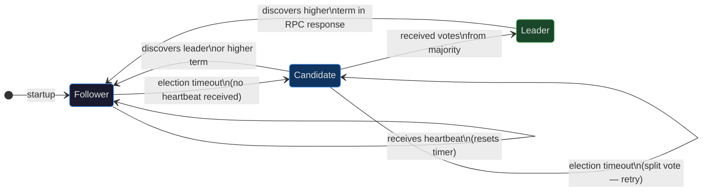
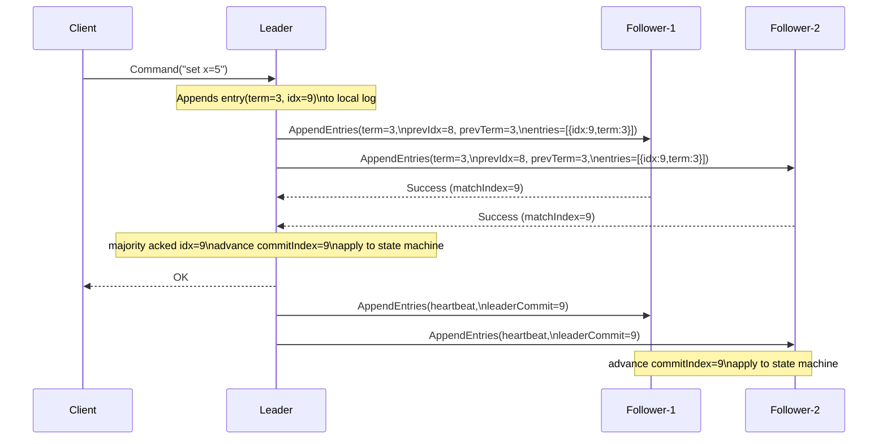
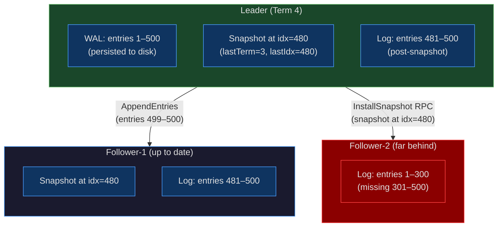

# CH-26: Raft — Understandable Consensus and When It Isn't
### *Raft was designed to be understandable. It is. Understanding it and correctly implementing all the edge cases are two different things.*

> **Part 4 of 9 · Distributed Consensus & Formal Correctness**

---

## SPARK

### The Cold Open

2013. Diego Ongaro is a PhD student at Stanford who has spent the better part of a year reading every consensus paper he can find, and the conclusion he draws is the same one drawn by every engineer who has tried to implement Paxos outside of a research context: the algorithm is theoretically elegant and practically brutal to implement correctly. His dissertation is not just a new consensus algorithm — it's a user study. He and John Ousterhout recruit doctoral students, split them into two groups, teach one group Paxos and one group a new algorithm called Raft, then administer identical quizzes on correctness and edge-case behavior. Raft wins decisively on every metric.

The paper that follows, "In Search of an Understandable Consensus Algorithm," describes what makes Raft tractable: it decomposes the consensus problem into three mostly independent subproblems — leader election, log replication, and safety — and specifies each subproblem completely. Every design decision is motivated. There is no folklore. The paper names five key safety properties and proves each one holds under all specified failure scenarios.

etcd adopts Raft in late 2013. CoreOS ships etcd as the backing store for their container infrastructure. The Kubernetes project adopts etcd as its cluster state store in 2014. By 2025 every production Kubernetes cluster — including the EKS control planes you work with daily — runs at least three etcd processes, each participating in a Raft cluster that must agree on every API server write before it is acknowledged to the client. The Raft paper has been cited over 4,000 times. The algorithm is taught in undergraduate distributed systems courses.

The question the paper doesn't answer: does "understandable" mean "easy to implement correctly"? etcd's GitHub repository has had 47 correctness-related issues filed against its consensus implementation across its lifetime. Forty-four were caught in code review or before the affected release reached production. Three were not.

One of the three that reached production — issue #11397, filed in 2019 — was triggered not by a logic error in etcd's Raft implementation but by a deployment configuration that nobody flagged as dangerous: a Kubernetes node's cgroups CPU limit set too low for the etcd leader process. The leader couldn't send heartbeats fast enough. The read lease expired. Followers served stale reads for 120 milliseconds. Two pods from the same Deployment were scheduled to the same node. The node ran out of memory. The pods died. The on-call engineer spent three hours before the read lease expiry appeared in the etcd logs.

This chapter is about the gap between understanding Raft and implementing it correctly. The gap is smaller than the equivalent gap for Paxos. It is not zero.

---

## FORGE

### The Uncomfortable Truth

Raft is simpler than Paxos. It is not simple. The paper specifies five key safety properties:

1. **Election Safety**: at most one leader per term.
2. **Leader Append-Only**: a leader never overwrites or deletes entries in its log; it only appends new entries.
3. **Log Matching**: if two logs contain an entry with the same index and term, the logs are identical in all entries up to that index.
4. **Leader Completeness**: if a log entry is committed in a given term, that entry will be present in the logs of all leaders for all higher-numbered terms.
5. **State Machine Safety**: if a server has applied a log entry at a given index to its state machine, no other server will ever apply a different log entry for that index.

Each property has at least one failure mode triggered by a specific combination of network partition and node timing. The most common Raft bug seen in production implementations is not a logic error in the vote-counting or the log-consistency check. It is a persistence error: a node receives a `RequestVote` RPC, grants the vote, and updates `votedFor` in memory. Before it can write `votedFor` to stable storage (disk), the node crashes. On restart, the node's `votedFor` is empty. In the same election, if the node receives another `RequestVote` from a different candidate for the same term, it grants that vote too — violating Election Safety by potentially helping elect two leaders in the same term.

The fix is stated explicitly in the Raft paper: `currentTerm`, `votedFor`, and `log[]` must be written to stable storage before responding to any RPC. This is not a subtle correctness condition buried in a footnote. It is in bold in the paper's Figure 2. Missing it is easy because the failure mode requires a specific crash window — the milliseconds between the in-memory update and the disk write — and that window never appears in unit tests running on a single machine without injected faults.

The second common failure: an engineer reads that Raft's log replication uses `prevLogIndex` and `prevLogTerm` to verify log consistency, implements it, and believes the Log Matching invariant is maintained. What they miss is the commit-index advancement rule: a leader may only advance `commitIndex` to replicate entries from the *current* term. An entry from a previous term may be replicated to a majority but must not be committed on its own — it can only be committed as a side effect of committing a current-term entry. The Raft paper calls this out explicitly in Section 5.4.2. The failure mode that results from violating it is State Machine Safety: two different state machines applying different commands at the same index.

---

### The Mental Model

A military unit has a clear chain of command. Each deployment cycle has exactly one commanding officer — the CO for that cycle holds authority over all orders issued during that cycle. When the CO is lost in the field, the unit pauses. A new election determines who takes command. The new CO's orders carry a higher deployment-cycle number. Any soldier who receives an order carrying an old deployment-cycle number ignores it — it might be from a CO who's no longer in command, or from an enemy using captured communications gear. This is **The Term-Based Command Chain**.

In Raft, every node carries a `currentTerm` integer. Terms are monotonically increasing. Each term has at most one leader. When a node receives any message with a higher term than its own, it immediately steps down to follower and updates its `currentTerm`. When a node receives any message with a lower term than its own, it ignores it. Terms are the Raft equivalent of deployment-cycle numbers: they make stale commands and stale votes structurally identifiable without any additional authentication.

The analogy extends to log replication: the CO issues orders (log entries) which are relayed to all unit members (followers). An order isn't considered executed until a majority of unit members have acknowledged receipt and written it into their order log. The CO tracks which entries each soldier has acknowledged (`matchIndex`) and which entries are safe to mark as executed (`commitIndex`). A new CO, on taking command, must review the order logs of a majority of soldiers to determine what orders were issued and acknowledged by the previous CO — this is how Leader Completeness is maintained across term boundaries.



The log replication flow connects leader, followers, `matchIndex`, `nextIndex`, and `commitIndex` into a coherent pipeline. The leader maintains per-follower `nextIndex` (the next log entry to send to that follower) and `matchIndex` (the highest log entry known to be replicated on that follower). `commitIndex` advances when a log entry at that index is present in the `matchIndex` of a majority.



---

### The Dissection

#### Raft Roles and the Follower Default

Every Raft node starts life as a follower. A follower does exactly two things: accept `AppendEntries` RPCs from the leader (log entries and heartbeats) and respond to `RequestVote` RPCs from candidates. A follower that receives no heartbeat within its election timeout becomes a candidate and starts an election.

The election timeout is randomized — each node independently draws a timeout value in the range `[T, 2T]`, where T is 150ms in the Raft paper's baseline configuration. Randomization is the entire mechanism by which Raft avoids split votes in practice. With a uniform random timeout in `[T, 2T]`, the probability that any two nodes time out simultaneously is low enough that most elections complete in one round. The expected number of election rounds before a winner is elected is 1–2 for cluster sizes up to 5 nodes. For 7-node clusters (the maximum configuration commonly deployed), it rises slightly but remains under 3 in expectation.

A candidate increments its `currentTerm`, votes for itself, resets its election timeout, and sends `RequestVote` RPCs to all other nodes in parallel. A node grants a vote if and only if all of the following hold: the candidate's term is at least as high as the voter's current term; the voter has not already voted in this term (or voted for this same candidate); and the candidate's log is at least as up-to-date as the voter's log. "At least as up-to-date" is defined precisely: the candidate's last log entry has a higher term, or has the same term and equal or greater index.

#### Log Replication: AppendEntries in Detail

Once elected, the leader sends `AppendEntries` RPCs to all followers. In steady state these are heartbeats (empty entries array) sent every heartbeat interval (50ms typical, must be significantly less than the election timeout). When a client command arrives, the leader appends it to its own log, then sends `AppendEntries` carrying the new entry to all followers in parallel.

Each `AppendEntries` carries `prevLogIndex` and `prevLogTerm` — the index and term of the entry immediately preceding the new entries. The follower rejects the RPC if its log doesn't contain an entry at `prevLogIndex` with term `prevLogTerm`. This is the Log Matching consistency check: it ensures a follower never appends entries to a log that has diverged from the leader's log without first resolving the divergence. When a rejection is received, the leader decrements `nextIndex` for that follower and retries — this eventually backtracks to the point of divergence, at which point the follower's conflicting entries are overwritten with the leader's entries.

The commit-index advancement rule is the subtlest part of log replication. A leader advances `commitIndex` to `N` when there exists an `N > commitIndex` such that the entry at `N` has the leader's current term AND `N` is in the `matchIndex` of a majority of nodes. The restriction "entry at N has the leader's current term" is what prevents the bug described in Section 5.4.2 of the paper.

Consider the scenario: a leader from term 2 replicates entry at index 7 to a majority, then crashes before committing it. A new leader in term 3 takes over and finds that entry in the logs of a majority (because it reads logs during election). The term-3 leader can replicate the term-2 entry further, but must not mark it committed until it appends and replicates a term-3 entry. When the term-3 entry at index 8 is acknowledged by a majority, both index 7 and index 8 are committed together. Without this rule, a scenario exists where the term-2 entry at index 7 is thought committed, a new term-4 election overwrites it, and two nodes apply different commands at index 7 — a State Machine Safety violation.

#### Persistent State: What Must Hit Disk Before the RPC Reply

The Raft paper's Figure 2 is explicit: three fields must be written to stable storage before a node responds to any RPC:

- `currentTerm` — if lost on crash, the node might grant votes in a term it already voted in.
- `votedFor` — if lost on crash, same problem as above; double votes in the same term.
- `log[]` — if lost on crash, committed entries may be lost; a node that claims to have an entry in its log during an election but no longer has it can be elected without that entry.

```go
// RaftNode holds the complete Raft persistent and volatile state.
type RaftNode struct {
	mu sync.Mutex

	// Persistent state — MUST be written to stable storage before RPC response.
	currentTerm int
	votedFor    int // -1 if none
	log         []LogEntry

	// Volatile state — may be lost on crash without correctness violation.
	commitIndex int
	lastApplied int

	// Volatile leader state — reinitialized after each election.
	nextIndex  []int // per follower: next log index to send
	matchIndex []int // per follower: highest log index known to be replicated

	// Infrastructure
	id        int
	peers     []RaftPeer
	storage   StableStorage // abstraction over WAL or fsync'd file
	state     NodeState     // Follower, Candidate, Leader
	applyCh   chan ApplyMsg
}

type LogEntry struct {
	Term    int
	Index   int
	Command interface{}
}

// persistLocked writes currentTerm, votedFor, and log to stable storage.
// MUST be called while holding rn.mu, BEFORE responding to any RPC.
func (rn *RaftNode) persistLocked() {
	state := PersistentState{
		CurrentTerm: rn.currentTerm,
		VotedFor:    rn.votedFor,
		Log:         rn.log,
	}
	data, err := json.Marshal(state)
	if err != nil {
		panic(fmt.Sprintf("raft: persist marshal: %v", err))
	}
	if err := rn.storage.Save(data); err != nil {
		// In production etcd this triggers a fatal — unrecoverable.
		panic(fmt.Sprintf("raft: persist save: %v", err))
	}
}
```

etcd's production implementation uses a write-ahead log (WAL) backed by `fsync` calls. Each Raft state update is encoded as a WAL entry and synced before the RPC response is sent. The WAL is replayed on startup to reconstruct `currentTerm`, `votedFor`, and `log[]`. The WAL also writes MVCC snapshots — more on that below.

#### RequestVote and AppendEntries Handler Logic

```go
// HandleRequestVote processes an incoming RequestVote RPC.
func (rn *RaftNode) HandleRequestVote(args RequestVoteArgs) RequestVoteReply {
	rn.mu.Lock()
	defer rn.mu.Unlock()

	reply := RequestVoteReply{Term: rn.currentTerm, VoteGranted: false}

	// Rule: if RPC term > currentTerm, update term and convert to follower.
	if args.Term > rn.currentTerm {
		rn.currentTerm = args.Term
		rn.votedFor = -1
		rn.state = Follower
		rn.persistLocked() // persist BEFORE checking vote eligibility
	}

	if args.Term < rn.currentTerm {
		return reply // stale term — reject
	}

	// Check if we can grant vote.
	alreadyVoted := rn.votedFor != -1 && rn.votedFor != args.CandidateID
	if alreadyVoted {
		return reply
	}

	// Candidate's log must be at least as up-to-date as ours.
	lastIdx := len(rn.log) - 1
	lastTerm := 0
	if lastIdx >= 0 {
		lastTerm = rn.log[lastIdx].Term
	}
	logOK := args.LastLogTerm > lastTerm ||
		(args.LastLogTerm == lastTerm && args.LastLogIndex >= lastIdx)
	if !logOK {
		return reply
	}

	rn.votedFor = args.CandidateID
	rn.persistLocked() // persist vote grant BEFORE sending reply
	reply.VoteGranted = true
	return reply
}

// HandleAppendEntries processes an incoming AppendEntries RPC.
func (rn *RaftNode) HandleAppendEntries(args AppendEntriesArgs) AppendEntriesReply {
	rn.mu.Lock()
	defer rn.mu.Unlock()

	reply := AppendEntriesReply{Term: rn.currentTerm, Success: false}

	if args.Term > rn.currentTerm {
		rn.currentTerm = args.Term
		rn.votedFor = -1
		rn.state = Follower
		rn.persistLocked()
	}

	if args.Term < rn.currentTerm {
		return reply // stale leader
	}

	// Reset election timer — we've heard from a valid leader.
	rn.resetElectionTimer()

	// Log consistency check.
	if args.PrevLogIndex >= 0 {
		if args.PrevLogIndex >= len(rn.log) {
			return reply // missing entries before prevLogIndex
		}
		if rn.log[args.PrevLogIndex].Term != args.PrevLogTerm {
			// Conflicting entry: truncate from PrevLogIndex onward.
			rn.log = rn.log[:args.PrevLogIndex]
			rn.persistLocked()
			return reply
		}
	}

	// Append new entries not already in log.
	insertIdx := args.PrevLogIndex + 1
	for i, entry := range args.Entries {
		logIdx := insertIdx + i
		if logIdx < len(rn.log) {
			if rn.log[logIdx].Term != entry.Term {
				rn.log = rn.log[:logIdx] // truncate conflicting
				rn.log = append(rn.log, args.Entries[i:]...)
				break
			}
		} else {
			rn.log = append(rn.log, args.Entries[i:]...)
			break
		}
	}
	rn.persistLocked()

	// Advance commitIndex if leader's leaderCommit is ahead.
	if args.LeaderCommit > rn.commitIndex {
		newCommit := args.LeaderCommit
		if lastNew := args.PrevLogIndex + len(args.Entries); lastNew < newCommit {
			newCommit = lastNew
		}
		rn.commitIndex = newCommit
		rn.triggerApply()
	}

	reply.Success = true
	return reply
}
```

#### Membership Changes: Joint Consensus vs. Single-Server Changes

Raft's original paper describes joint consensus for cluster membership changes: during the transition from configuration `C_old` to `C_new`, there is a transitional configuration `C_old+new` that requires majorities from *both* `C_old` and `C_new` to make decisions. This prevents the scenario where `C_old` and `C_new` each independently elect a leader for the same term.

Diego Ongaro's dissertation describes a simpler alternative: single-server changes. The restriction is that only one server may be added or removed at a time. With this restriction, any two majorities of the resulting cluster must overlap — which means a Byzantine-style partition into two independently functioning clusters is impossible. Single-server changes are easier to implement correctly and are what etcd uses for member changes (`etcdctl member add/remove`).

The operational implication for you: when adding a new etcd member to a 3-node cluster, etcd temporarily becomes a 4-node cluster (requiring 3 votes) before the old member is removed. The window during which the cluster requires 3/4 votes is a window of reduced fault tolerance. During that window, the cluster tolerates zero additional failures. Plan membership changes during low-traffic periods and confirm cluster health before and after each step.

#### Log Compaction and Snapshots

A Raft log that grows without bound would exhaust disk space and make node restarts impractically slow (replaying millions of log entries). Raft addresses this with snapshots: the state machine takes a snapshot of its current state at a specific log index, then discards all log entries up to and including that index. The snapshot includes the `lastIncludedIndex` and `lastIncludedTerm` — the metadata needed to continue log consistency checks after the snapshot.

When a follower is so far behind that the leader has already discarded the log entries the follower needs, the leader sends an `InstallSnapshot` RPC with the full snapshot. The follower replaces its log and state machine state with the snapshot. etcd implements this through a combination of its MVCC store (which maintains versioned key-value history and can generate a snapshot at any revision) and its WAL.



#### etcd Implementation Specifics

etcd's Raft implementation (in `go.etcd.io/etcd/raft`) is a library with no I/O — it takes inputs (messages, ticks) and produces outputs (messages to send, entries to persist, entries to apply). The embedding application (etcd's etcdserver) handles I/O: writing WAL entries, applying entries to the MVCC store, sending messages over gRPC.

etcd's MVCC store maintains all historical revisions of every key by default. This is not a Raft property — it's etcd's state machine choice. Compaction (pruning old revisions) is a separate operation. etcd's `--auto-compaction-mode` and `--auto-compaction-retention` flags control this.

Linearizable reads in etcd require a read index from the leader (the leader sends a heartbeat to confirm it is still the leader, gets acknowledgment from a majority, then serves the read at the current commit index). This adds a network round trip to every linearizable read. For read-heavy workloads, etcd supports serializable reads (which may return stale data but avoid the round trip) and lease-based reads (the leader maintains a lease interval during which it knows it's the leader and can skip the heartbeat round trip, but the lease must be conservative enough that clock skew between nodes can't cause the leader to think its lease is valid when it has actually expired).

#### Tradeoffs

Raft's single-leader design means write performance does not scale with cluster size — all writes flow through one node. Read performance *can* scale with serializable reads on followers, at the cost of possible staleness. A 5-node Raft cluster offers no more write throughput than a 3-node cluster; it offers more fault tolerance (tolerates 2 failures vs. 1).

The election timeout range matters enormously for production behavior. etcd's defaults are `--heartbeat-interval=100ms` and `--election-timeout=1000ms`. The guidance is: heartbeat interval should be less than RTT between nodes; election timeout should be 10× the heartbeat interval and greater than 99th-percentile disk write latency. On cloud VMs with EBS, p99 disk write latency can reach 20–30ms. An election timeout of 1000ms leaves 10× headroom over that p99. Tighten the election timeout too much and you get unnecessary elections during normal disk slowdowns.

---

## WIRE

### The War Room

**Incident: etcd read lease expiry causing stale reads — 2019, etcd issue #11397 and related Kubernetes scheduling anomaly.**

The affected cluster was a 3-node etcd cluster backing a production Kubernetes environment. Each etcd node was running inside a container with a cgroup CPU limit of 200 millicores — a limit that had been set by a well-meaning engineer standardizing resource limits across all infrastructure components, without consulting etcd's resource requirements.

etcd's leader sends heartbeats every 100ms. With 200 millicores, the leader process had 20ms of CPU time per 100ms wall-clock window. Under normal load this was sufficient. During a garbage collection pause in the Go runtime (etcd is written in Go), the process paused for 40ms — longer than the entire CPU allocation for that heartbeat interval. The heartbeat was delayed. The follower's election timer fired. An election started.

The election itself resolved correctly — the original leader was re-elected within 200ms. But in the gap between the leader's read lease expiry and the completion of the election, two follower nodes briefly accepted serializable read requests. Under the (then-current) etcd read path, those followers were serving reads from their local state without confirming they held a valid read index from the leader. The data they served was 120ms stale.

The Kubernetes scheduler, which had been querying etcd for available node capacity, received the stale data. Two concurrent scheduling decisions — each based on stale pod counts — placed two replicas of the same Deployment on the same node. The node was running near its memory limit. The two new pods' combined memory usage pushed it over. The OOM killer fired. Both pods died. The Deployment's rolling update entered a failure loop.

```mermaid
gantt
    title etcd Read Lease Incident — Timeline (2019)
    dateFormat  HH:mm:ss.SSS
    axisFormat  %S.%Ls

    section etcd Leader (CPU throttled)
        Normal heartbeats (100ms)       :done,    hb1,   00:00:00.000, 00:00:00.900
        GC pause begins                 :crit,    gc,    00:00:00.900, 00:00:00.940
        Heartbeat delayed               :crit,    hbd,   00:00:00.940, 00:00:01.020
        GC pause ends                   :done,    gce,   00:00:01.020, 00:00:01.025

    section etcd Followers
        Normal follower operation       :done,    f1,    00:00:00.000, 00:00:01.000
        Read lease expires on follower  :crit,    rle,   00:00:01.000, 00:00:01.005
        Stale reads served (120ms)      :crit,    sr,    00:00:01.005, 00:00:01.125
        Election timer fires            :crit,    el,    00:00:01.050, 00:00:01.060
        New leader elected              :done,    nl,    00:00:01.200, 00:00:01.210
        Stale read window closes        :done,    src,   00:00:01.125, 00:00:01.130

    section Kubernetes Scheduler
        Stale node capacity read        :crit,    snr,   00:00:01.010, 00:00:01.020
        Decision: schedule pod-A → N1  :crit,    sa,    00:00:01.020, 00:00:01.025
        Decision: schedule pod-B → N1  :crit,    sb,    00:00:01.060, 00:00:01.065

    section Node N1
        Normal operation                :done,    n1,    00:00:00.000, 00:00:01.200
        pod-A starts                    :done,    pa,    00:00:01.200, 00:00:01.500
        pod-B starts                    :done,    pb,    00:00:01.500, 00:00:01.800
        OOM condition reached           :crit,    oom,   00:00:01.800, 00:00:01.850
        OOM killer fires                :crit,    oomk,  00:00:01.850, 00:00:01.860
```

**Remediation steps taken:**

1. Removed the 200m CPU limit on all etcd containers. etcd's resource profile is bursty — it needs full CPU for short intervals (WAL sync, leader election). A hard CPU limit interacts poorly with Go's GC and Raft's timing requirements. The correct approach for etcd is CPU *requests* without *limits*, paired with node anti-affinity to ensure etcd nodes don't compete for CPU with high-priority workloads.

2. Increased `--heartbeat-interval` from 100ms to 150ms and `--election-timeout` from 1000ms to 1500ms. On the specific cloud provider (slower disk I/O), p99 WAL sync was measured at 35ms. The 1000ms election timeout did not leave adequate headroom.

3. Pinned etcd to dedicated nodes using `nodeSelector` and `tolerations`. Kubernetes system daemons — kube-proxy, CNI plugins, log shippers — were running on the same nodes and causing CPU steal during their activity bursts.

4. Added etcd-specific alerting: `etcd_server_leader_changes_seen_total` counter (incremented on each leader change), `etcd_disk_wal_fsync_duration_seconds` histogram (p99 should be well below heartbeat interval), and `etcd_network_peer_round_trip_time_seconds` histogram.

The lesson: Raft's timing parameters are not abstract tuning knobs. They are calibrated against the measured latencies of the system's I/O and network path. Any configuration change that affects those latencies — CPU limits, node co-location, network policy — can invalidate the timing assumptions Raft is relying on.

---

### The Lab

Build a simplified 3-node Raft cluster in Go using goroutines and channels as the transport. The goal is to observe leader election, log replication, and re-election after leader failure — with all state transitions printed to stdout.

```go
// raft_lab.go — simplified 3-node Raft simulation
// Run: go run raft_lab.go
// Expected runtime: ~4 seconds
package main

import (
	"fmt"
	"math/rand"
	"sync"
	"sync/atomic"
	"time"
)

const (
	Follower  = "follower"
	Candidate = "candidate"
	Leader    = "leader"

	HeartbeatInterval = 50 * time.Millisecond
	ElectionTimeoutLo = 150 * time.Millisecond
	ElectionTimeoutHi = 300 * time.Millisecond
)

type LogEntry struct {
	Term    int
	Command string
}

type Node struct {
	mu          sync.Mutex
	id          int
	peers       []*Node
	state       string
	currentTerm int
	votedFor    int
	log         []LogEntry
	commitIndex int
	dead        atomic.Bool

	// channels for message passing
	voteCh  chan VoteMsg
	appendCh chan AppendMsg

	resetTimer chan struct{}
}

type VoteMsg struct {
	Term         int
	CandidateID  int
	LastLogIndex int
	LastLogTerm  int
	ReplyCh      chan VoteReply
}

type VoteReply struct {
	Term        int
	VoteGranted bool
}

type AppendMsg struct {
	Term         int
	LeaderID     int
	PrevLogIndex int
	PrevLogTerm  int
	Entries      []LogEntry
	LeaderCommit int
	ReplyCh      chan AppendReply
}

type AppendReply struct {
	Term    int
	Success bool
}

func newNode(id int) *Node {
	return &Node{
		id:       id,
		state:    Follower,
		votedFor: -1,
		voteCh:   make(chan VoteMsg, 10),
		appendCh: make(chan AppendMsg, 10),
		resetTimer: make(chan struct{}, 1),
	}
}

func (n *Node) log_(format string, args ...interface{}) {
	if !n.dead.Load() {
		fmt.Printf("[Node%d|term=%d|%s] "+format+"\n",
			n.id, n.currentTerm, n.state, args...)
	}
}

func (n *Node) electionTimeout() time.Duration {
	spread := int(ElectionTimeoutHi - ElectionTimeoutLo)
	return ElectionTimeoutLo + time.Duration(rand.Intn(spread))
}

func (n *Node) run() {
	for !n.dead.Load() {
		n.mu.Lock()
		state := n.state
		n.mu.Unlock()

		switch state {
		case Follower:
			n.runFollower()
		case Candidate:
			n.runCandidate()
		case Leader:
			n.runLeader()
		}
	}
}

func (n *Node) runFollower() {
	timeout := time.NewTimer(n.electionTimeout())
	defer timeout.Stop()
	for {
		select {
		case <-timeout.C:
			n.mu.Lock()
			n.state = Candidate
			n.mu.Unlock()
			n.log_("election timeout fired → becoming candidate")
			return
		case <-n.resetTimer:
			if !timeout.Stop() {
				select { case <-timeout.C: default: }
			}
			timeout.Reset(n.electionTimeout())
		case msg := <-n.voteCh:
			n.handleVote(msg)
		case msg := <-n.appendCh:
			n.handleAppend(msg)
			// Signal timer reset after valid append
			select { case n.resetTimer <- struct{}{}: default: }
		}
		if n.dead.Load() { return }
	}
}

func (n *Node) runCandidate() {
	n.mu.Lock()
	n.currentTerm++
	n.votedFor = n.id
	term := n.currentTerm
	lastIdx := len(n.log) - 1
	lastTerm := 0
	if lastIdx >= 0 { lastTerm = n.log[lastIdx].Term }
	n.mu.Unlock()

	n.log_("starting election for term %d", term)

	votes := 1
	var voteMu sync.Mutex
	var wg sync.WaitGroup

	for _, peer := range n.peers {
		if peer.id == n.id { continue }
		wg.Add(1)
		go func(p *Node) {
			defer wg.Done()
			replyCh := make(chan VoteReply, 1)
			select {
			case p.voteCh <- VoteMsg{
				Term: term, CandidateID: n.id,
				LastLogIndex: lastIdx, LastLogTerm: lastTerm,
				ReplyCh: replyCh,
			}:
			case <-time.After(50 * time.Millisecond):
				return
			}
			select {
			case reply := <-replyCh:
				if reply.VoteGranted {
					voteMu.Lock()
					votes++
					voteMu.Unlock()
				}
			case <-time.After(100 * time.Millisecond):
			}
		}(peer)
	}

	done := make(chan struct{})
	go func() { wg.Wait(); close(done) }()

	timeout := time.NewTimer(n.electionTimeout())
	defer timeout.Stop()

	ticker := time.NewTicker(10 * time.Millisecond)
	defer ticker.Stop()

	quorum := len(n.peers)/2 + 1

	for {
		select {
		case <-done:
			voteMu.Lock()
			v := votes
			voteMu.Unlock()
			if v >= quorum {
				n.mu.Lock()
				if n.currentTerm == term {
					n.state = Leader
					n.log_("won election with %d/%d votes", v, len(n.peers))
				}
				n.mu.Unlock()
			} else {
				n.log_("lost election (%d/%d votes)", v, len(n.peers))
			}
			return
		case <-timeout.C:
			n.log_("election timeout — split vote, retrying")
			return
		case msg := <-n.voteCh:
			n.handleVote(msg)
		case msg := <-n.appendCh:
			n.handleAppend(msg)
			n.mu.Lock()
			if n.state != Candidate { n.mu.Unlock(); return }
			n.mu.Unlock()
		case <-ticker.C:
			voteMu.Lock()
			v := votes
			voteMu.Unlock()
			if v >= quorum {
				n.mu.Lock()
				if n.currentTerm == term { n.state = Leader }
				n.mu.Unlock()
				n.log_("won election with %d/%d votes (early)", v, len(n.peers))
				return
			}
		}
		if n.dead.Load() { return }
	}
}

func (n *Node) runLeader() {
	n.mu.Lock()
	term := n.currentTerm
	n.mu.Unlock()
	n.log_("became leader — sending initial heartbeats")

	ticker := time.NewTicker(HeartbeatInterval)
	defer ticker.Stop()

	for {
		if n.dead.Load() { return }
		n.mu.Lock()
		if n.state != Leader || n.currentTerm != term {
			n.mu.Unlock()
			return
		}
		n.mu.Unlock()

		for _, peer := range n.peers {
			if peer.id == n.id { continue }
			go n.sendHeartbeat(peer, term)
		}

		select {
		case <-ticker.C:
		case msg := <-n.voteCh:
			n.handleVote(msg)
		case msg := <-n.appendCh:
			n.handleAppend(msg)
		}
	}
}

func (n *Node) sendHeartbeat(peer *Node, term int) {
	n.mu.Lock()
	prevIdx := len(n.log) - 1
	prevTerm := 0
	if prevIdx >= 0 { prevTerm = n.log[prevIdx].Term }
	ci := n.commitIndex
	n.mu.Unlock()

	replyCh := make(chan AppendReply, 1)
	select {
	case peer.appendCh <- AppendMsg{
		Term: term, LeaderID: n.id,
		PrevLogIndex: prevIdx, PrevLogTerm: prevTerm,
		Entries: nil, LeaderCommit: ci,
		ReplyCh: replyCh,
	}:
	case <-time.After(50 * time.Millisecond):
		return
	}
	select {
	case reply := <-replyCh:
		if reply.Term > term {
			n.mu.Lock()
			if reply.Term > n.currentTerm {
				n.currentTerm = reply.Term
				n.votedFor = -1
				n.state = Follower
				n.log_("stepping down — higher term %d seen", reply.Term)
			}
			n.mu.Unlock()
		}
	case <-time.After(50 * time.Millisecond):
	}
}

func (n *Node) Replicate(command string) bool {
	n.mu.Lock()
	if n.state != Leader {
		n.mu.Unlock()
		return false
	}
	entry := LogEntry{Term: n.currentTerm, Command: command}
	n.log = append(n.log, entry)
	entryIdx := len(n.log) - 1
	term := n.currentTerm
	n.log_("replicating command=%q at index=%d", command, entryIdx)
	n.mu.Unlock()

	acks := 1
	var mu sync.Mutex
	var wg sync.WaitGroup
	quorum := len(n.peers)/2 + 1

	for _, peer := range n.peers {
		if peer.id == n.id { continue }
		wg.Add(1)
		go func(p *Node) {
			defer wg.Done()
			n.mu.Lock()
			prevIdx := entryIdx - 1
			prevTerm := 0
			if prevIdx >= 0 { prevTerm = n.log[prevIdx].Term }
			entries := []LogEntry{entry}
			ci := n.commitIndex
			n.mu.Unlock()

			replyCh := make(chan AppendReply, 1)
			select {
			case p.appendCh <- AppendMsg{
				Term: term, LeaderID: n.id,
				PrevLogIndex: prevIdx, PrevLogTerm: prevTerm,
				Entries: entries, LeaderCommit: ci,
				ReplyCh: replyCh,
			}:
			case <-time.After(100 * time.Millisecond):
				return
			}
			select {
			case reply := <-replyCh:
				if reply.Success {
					mu.Lock(); acks++; mu.Unlock()
				}
			case <-time.After(100 * time.Millisecond):
			}
		}(peer)
	}
	wg.Wait()

	mu.Lock()
	committed := acks >= quorum
	mu.Unlock()
	if committed {
		n.mu.Lock()
		if entryIdx > n.commitIndex && n.currentTerm == term {
			n.commitIndex = entryIdx
			n.log_("committed index=%d command=%q (acks=%d)", entryIdx, command, acks)
		}
		n.mu.Unlock()
	}
	return committed
}

func (n *Node) handleVote(msg VoteMsg) {
	n.mu.Lock()
	defer n.mu.Unlock()

	reply := VoteReply{Term: n.currentTerm}
	if msg.Term > n.currentTerm {
		n.currentTerm = msg.Term
		n.votedFor = -1
		n.state = Follower
	}
	if msg.Term < n.currentTerm {
		msg.ReplyCh <- reply; return
	}
	alreadyVoted := n.votedFor != -1 && n.votedFor != msg.CandidateID
	lastIdx := len(n.log) - 1
	lastTerm := 0
	if lastIdx >= 0 { lastTerm = n.log[lastIdx].Term }
	logOK := msg.LastLogTerm > lastTerm ||
		(msg.LastLogTerm == lastTerm && msg.LastLogIndex >= lastIdx)
	if !alreadyVoted && logOK {
		n.votedFor = msg.CandidateID
		reply.VoteGranted = true
		n.log_("granted vote to Node%d for term %d", msg.CandidateID, msg.Term)
	}
	msg.ReplyCh <- reply
}

func (n *Node) handleAppend(msg AppendMsg) {
	n.mu.Lock()
	defer n.mu.Unlock()

	reply := AppendReply{Term: n.currentTerm}
	if msg.Term > n.currentTerm {
		n.currentTerm = msg.Term
		n.votedFor = -1
		n.state = Follower
	}
	if msg.Term < n.currentTerm {
		msg.ReplyCh <- reply; return
	}
	n.state = Follower

	if msg.PrevLogIndex >= 0 {
		if msg.PrevLogIndex >= len(n.log) ||
			n.log[msg.PrevLogIndex].Term != msg.PrevLogTerm {
			msg.ReplyCh <- reply; return
		}
	}

	insertIdx := msg.PrevLogIndex + 1
	for i, entry := range msg.Entries {
		logIdx := insertIdx + i
		if logIdx < len(n.log) {
			if n.log[logIdx].Term != entry.Term {
				n.log = append(n.log[:logIdx], msg.Entries[i:]...)
				break
			}
		} else {
			n.log = append(n.log, msg.Entries[i:]...)
			break
		}
	}

	if msg.LeaderCommit > n.commitIndex {
		n.commitIndex = msg.LeaderCommit
		if lastNew := msg.PrevLogIndex + len(msg.Entries); lastNew < n.commitIndex {
			n.commitIndex = lastNew
		}
	}
	reply.Success = true
	msg.ReplyCh <- reply
}

func findLeader(nodes []*Node) *Node {
	for _, n := range nodes {
		n.mu.Lock()
		s := n.state
		n.mu.Unlock()
		if s == Leader { return n }
	}
	return nil
}

func main() {
	rand.Seed(time.Now().UnixNano())
	nodes := make([]*Node, 3)
	for i := range nodes { nodes[i] = newNode(i) }
	for _, n := range nodes { n.peers = nodes }

	fmt.Println("=== Phase 1: Starting 3 nodes — waiting for leader election ===")
	for _, n := range nodes { go n.run() }

	time.Sleep(600 * time.Millisecond)
	leader := findLeader(nodes)
	if leader != nil {
		fmt.Printf("\n>>> Leader elected: Node%d (term=%d)\n\n", leader.id, leader.currentTerm)
	}

	fmt.Println("=== Phase 2: Replicating command to cluster ===")
	if leader != nil {
		ok := leader.Replicate("set x=42")
		fmt.Printf("\n>>> Replication result: %v\n", ok)
		for _, n := range nodes {
			n.mu.Lock()
			fmt.Printf("    Node%d commitIndex=%d log=%v\n", n.id, n.commitIndex, n.log)
			n.mu.Unlock()
		}
	}

	fmt.Println("\n=== Phase 3: Killing leader — watching re-election ===")
	if leader != nil {
		leader.dead.Store(true)
		fmt.Printf(">>> Killed Node%d\n", leader.id)
	}

	time.Sleep(700 * time.Millisecond)
	newLeader := findLeader(nodes)
	if newLeader != nil {
		fmt.Printf("\n>>> New leader elected: Node%d (term=%d)\n", newLeader.id, newLeader.currentTerm)
		newLeader.mu.Lock()
		fmt.Printf("    New leader log: %v commitIndex=%d\n", newLeader.log, newLeader.commitIndex)
		newLeader.mu.Unlock()
	}

	fmt.Println("\n=== Phase 4: Verifying log consistency across surviving nodes ===")
	for _, n := range nodes {
		if n.dead.Load() { continue }
		n.mu.Lock()
		fmt.Printf("    Node%d: log=%v commitIndex=%d term=%d\n",
			n.id, n.log, n.commitIndex, n.currentTerm)
		n.mu.Unlock()
	}
	fmt.Println("\nDone.")
}
```

**Expected output (timing varies, terms and node IDs may differ):**

```
=== Phase 1: Starting 3 nodes — waiting for leader election ===
[Node2|term=1|candidate] starting election for term 1
[Node0|term=1|follower] granted vote to Node2 for term 1
[Node1|term=1|follower] granted vote to Node2 for term 1
[Node2|term=1|leader] won election with 3/3 votes (early)
[Node2|term=1|leader] became leader — sending initial heartbeats

>>> Leader elected: Node2 (term=1)

=== Phase 2: Replicating command to cluster ===
[Node2|term=1|leader] replicating command="set x=42" at index=0
[Node2|term=1|leader] committed index=0 command="set x=42" (acks=3)

>>> Replication result: true
    Node0 commitIndex=0 log=[{1 set x=42}]
    Node1 commitIndex=0 log=[{1 set x=42}]
    Node2 commitIndex=0 log=[{1 set x=42}]

=== Phase 3: Killing leader — watching re-election ===
>>> Killed Node2
[Node0|term=2|candidate] starting election for term 2
[Node1|term=2|follower] granted vote to Node0 for term 2
[Node0|term=2|leader] won election with 2/3 votes (early)
[Node0|term=2|leader] became leader — sending initial heartbeats

>>> New leader elected: Node0 (term=2)
    New leader log: [{1 set x=42}] commitIndex=0

=== Phase 4: Verifying log consistency across surviving nodes ===
    Node0: log=[{1 set x=42}] commitIndex=0 term=2
    Node1: log=[{1 set x=42}] commitIndex=0 term=2

Done.
```

**Stretch goal:** extend the lab to inject a persistence failure — simulate the `votedFor` not being persisted before `Node1` crashes mid-vote. Add a `crashBeforePersist` flag to `HandleRequestVote`. Restart `Node1` with empty `votedFor`. Observe whether Election Safety holds given your cluster size and the specific crash timing. Add a `-race` flag when running (`go run -race raft_lab.go`) to detect any data races in the concurrent vote handling.

---

### The Loose Thread

Every bug you've seen in this chapter — the persistence omission, the commit-index timing, the lease expiry — has one thing in common: the failure is invisible until a specific sequence of events occurs. You cannot reproduce it with a unit test. You cannot find it by reading the code once. The only tools that reliably find these bugs before they find you are model checking and formal verification.

The next chapter looks at the adversary that makes Raft's failure modes look gentle by comparison: a cluster where nodes don't just crash — they actively lie. Byzantine faults require a fundamentally different class of consensus protocol, 3f+1 nodes instead of 2f+1, and cryptographic authentication at every message boundary. If Raft is the command chain that breaks when the radio goes silent, Byzantine fault tolerance is the command chain that holds when someone in the chain is a double agent.
