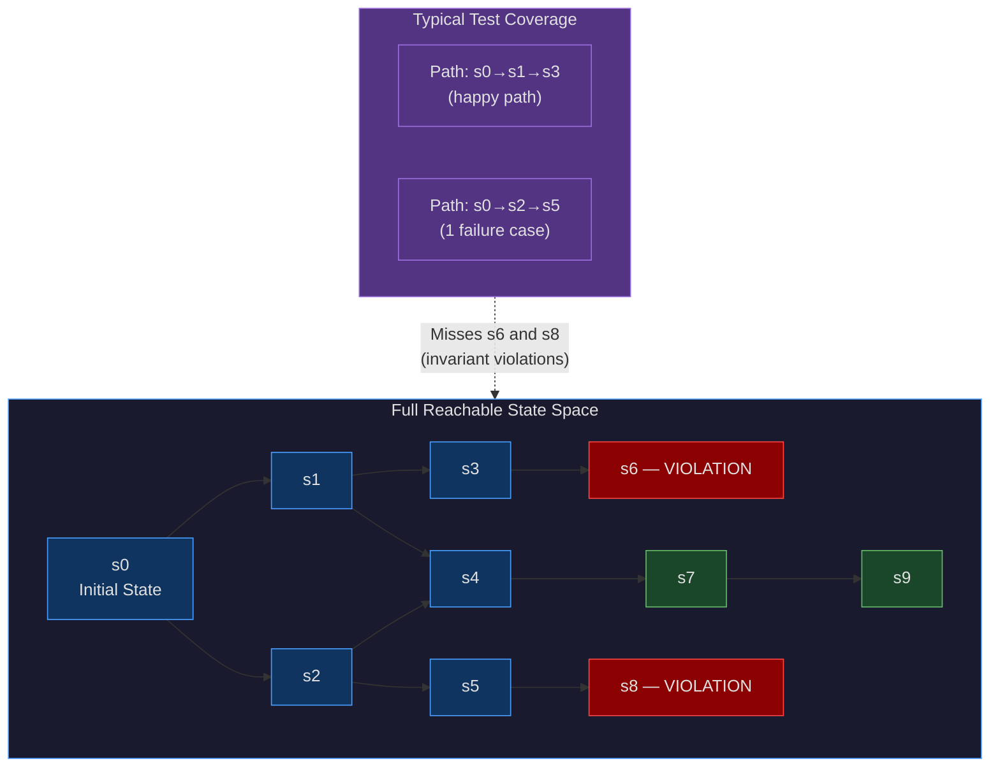
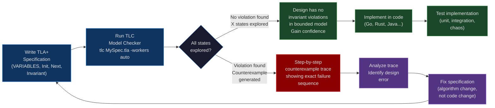
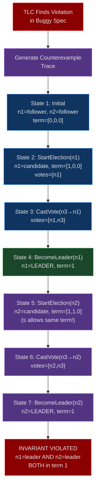
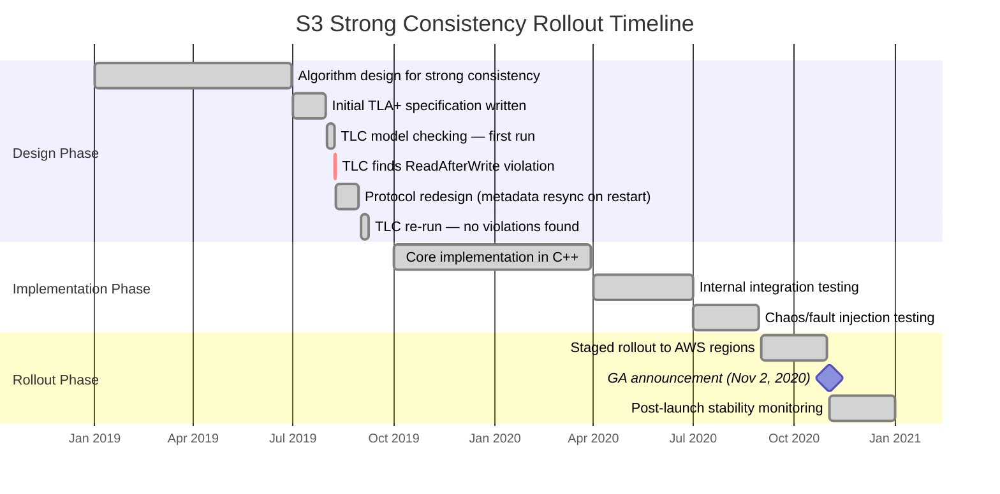

# CH-28: TLA+ — Formal Verification for Engineers Who Hate Surprises
### *Amazon engineers found 10 critical bugs in their distributed systems designs before writing a line of code. The tool that found them was TLA+. The bugs would have taken years to find in production.*

> **Part 4 of 9 · Distributed Consensus & Formal Correctness**

---

## SPARK

### The Cold Open

2014. A paper lands on the distributed systems community with the weight of something that should not exist. The authors are Chris Newcombe, Tim Rath, Fan Zhang, Bogdan Munteanu, Marc Brooker, and Michael Deardeuff. The institution is not MIT or Carnegie Mellon. It is Amazon Web Services. The paper is titled "Use of Formal Methods at Amazon Web Services," and it describes something that the academic formal methods community had spent 30 years claiming industry would never adopt: a team of production engineers using mathematical specification languages to verify the designs of their distributed systems before writing a line of code.

The numbers in the paper are the part that make people stop reading and start re-reading. TLA+ had been applied to 10 systems: S3, DynamoDB, EBS, internal distributed lock managers, and others. The result was 10 bugs found — not test failures, not production incidents. Design bugs. Logical errors in the algorithms themselves, found by exhaustively exploring the reachable state space of a formal model. Two of those bugs would have caused silent data loss if they had reached production code. Silent data loss: the failure mode where customer data disappears and no error is returned, no alarm fires, and no log entry indicates that anything went wrong.

One bug stands out above the others. It would have caused data loss only during a specific sequence of failure recovery steps. The sequence: a partial write to a storage node, followed by a node failure, followed by a specific interleaving of recovery and compaction operations on two other nodes. In a cluster running at S3's scale, that sequence occurs roughly once every 10 million operations. At S3's actual operation rate in 2014, that translates to approximately once every few weeks — often enough to see in production, rare enough to be classified as "random data corruption" and trigger an investigation that would last months before isolating the exact causal sequence. The TLA+ model checker found it in minutes, by automatically generating the counterexample trace showing every step that leads to the invariant violation.

The part of the paper that the distributed systems community found more surprising than the bugs was the adoption story. Engineers who had never heard of TLA+ before being asked to use it reported becoming productive within 2-3 weeks. They described the process not as a formal proof exercise but as a design clarification exercise: writing the spec forced them to be precise about what the system was supposed to do, and the model checker found cases where what the system was supposed to do was actually impossible to do correctly given their chosen protocol. The paper did not claim TLA+ replaced testing. It claimed something more specific and more useful: that TLA+ found an entire category of bugs that testing cannot reach, and that it found them at the cheapest possible moment — before any code exists.

---

## FORGE

### The Uncomfortable Truth

The false belief is foundational and widespread: formal methods are for academics, and production engineers prove correctness with tests. The belief has a surface plausibility. Tests run against real code. Tests catch real bugs. A test suite that exercises a distributed system's failure paths — network partitions, leader elections, node crashes, message delays — feels like thorough verification.

Tests are samples from the state space. A test is a sequence of operations that you thought to construct, running in the order you chose to schedule them, exercising the code paths you decided to exercise. The state space of a distributed system with 5 nodes, 3 concurrent operations, and 4 possible failure events contains on the order of 10^12 distinct states — by a conservative estimate. A comprehensive test suite might explicitly construct a few thousand paths through that state space. That is roughly 0.000001% coverage of the reachable states.

TLA+ with the TLC model checker is exhaustive enumeration of the state space for bounded models. You specify the number of nodes, the range of operation counts, and the set of possible failures. TLC then explores every state reachable from the initial state via every possible transition. It does not sample. It does not choose interesting paths. It generates every path and checks the invariant at every state on every path. The states that cause silent data loss at Amazon, the states that cause etcd to elect two leaders, the states that cause your distributed lock to grant the same lock to two holders simultaneously — those states are reachable only through specific sequences of concurrent failures that no human test author would construct, but that production traffic eventually reaches.

TLA+ does not replace tests. Tests verify the implementation of code. TLA+ verifies the design of an algorithm. The code can correctly implement a broken algorithm, in which case tests against the code will faithfully reproduce the algorithm's broken behavior. The code can incorrectly implement a correct algorithm, in which case TLA+ on the spec will not catch the implementation error. The two tools address different failure modes: TLA+ catches invariant violations in the protocol design; tests catch discrepancies between the design and the implementation.

---

### The Mental Model

Before a bridge is built, structural engineers do not build a small bridge and drive trucks across it to see if it holds. They model the load distribution mathematically: what forces act on which members under which load combinations, what the safety margin is at every joint, whether any combination of load, temperature, and wind produces a failure mode. The testing — physical load testing, material testing — comes after the design has been verified to be structurally sound. Discovering a design error by physically loading a bridge is not an acceptable testing strategy.

TLA+ applies the same principle to distributed systems designs. Before any code exists, you model the system: the state variables, the valid initial states, the transitions that the system can make, and the invariants that must hold in every reachable state. The TLC model checker then does what no human would do manually: it exhaustively explores every reachable state and every possible transition sequence, checking the invariants at each step. This is **The Blueprint Verification Model** — you verify that the design is correct before committing to an implementation.



The second diagram shows the TLA+ workflow from specification to verified design. The key insight is the feedback loop: TLC either confirms that no invariant is violated in the bounded state space (which gives confidence, not proof), or it produces a concrete counterexample — a step-by-step trace of every state transition that leads to the violation. That counterexample is not a probability or an indication of a potential issue. It is the exact sequence of events that breaks the system, rendered as a numbered list of states, ready to guide a design fix.



---

## WIRE

### The Dissection

#### TLA+ Syntax Fundamentals

TLA+ is a mathematical language for describing system behavior as sequences of states. The core concepts map directly to what engineers already think about when reasoning about distributed systems:

- **VARIABLES**: the mutable state of the system. In a distributed lock manager, this might be `leader`, `term`, `votes`.
- **Init**: a predicate that is true of the initial state. In TLA+ syntax: `Init == leader = "none" /\ term = 0 /\ votes = {}`.
- **Next**: a formula that defines the valid transitions. `Next` is a disjunction of action formulas, each describing one type of state transition.
- **Spec**: the complete behavioral specification. `Spec == Init /\ [][Next]_vars` — "start in an Init state, and every step is either a Next transition or a stuttering step (no change)."
- **INVARIANT**: a predicate that must hold in every reachable state.

The syntax uses mathematical set notation and logical operators. `/\` is logical AND, `\/` is logical OR, `=>` is implication, `\in` is set membership, `\A` is universal quantification ("for all"), `\E` is existential quantification ("there exists"). After a few hours with the syntax, the notation feels less alien than most people expect — it is closer to the mathematical notation in distributed systems papers (which you are already reading in this book) than to any programming language.

#### Peterson's Algorithm: Mutual Exclusion

Peterson's algorithm achieves mutual exclusion for two processes without hardware atomic operations. A TLA+ model of it demonstrates the core TLA+ workflow concisely. The algorithm uses two variables: `flag[1..2]` (each process signals intent to enter the critical section) and `turn` (which process has priority when both want to enter simultaneously).

```tla
---- MODULE Peterson ----
EXTENDS Naturals

VARIABLES flag, turn, pc  \* program counter for each process

Init ==
    /\ flag = [i \in {1, 2} |-> FALSE]
    /\ turn \in {1, 2}
    /\ pc   = [i \in {1, 2} |-> "start"]

\* Process i takes a step
SetFlag(i) ==
    /\ pc[i] = "start"
    /\ flag' = [flag EXCEPT ![i] = TRUE]
    /\ pc'   = [pc   EXCEPT ![i] = "set_turn"]
    /\ UNCHANGED turn

SetTurn(i) ==
    /\ pc[i] = "set_turn"
    /\ turn' = 3 - i    \* give priority to the other process
    /\ pc'   = [pc EXCEPT ![i] = "wait"]
    /\ UNCHANGED flag

Wait(i) ==
    /\ pc[i] = "wait"
    /\ ~flag[3-i] \/ turn = i    \* safe to proceed
    /\ pc' = [pc EXCEPT ![i] = "crit"]
    /\ UNCHANGED <<flag, turn>>

ExitCrit(i) ==
    /\ pc[i] = "crit"
    /\ flag' = [flag EXCEPT ![i] = FALSE]
    /\ pc'   = [pc   EXCEPT ![i] = "start"]
    /\ UNCHANGED turn

Next ==
    \E i \in {1, 2} :
        \/ SetFlag(i)
        \/ SetTurn(i)
        \/ Wait(i)
        \/ ExitCrit(i)

Spec == Init /\ [][Next]_<<flag, turn, pc>>

\* Safety invariant: at most one process in critical section at a time
MutualExclusion ==
    ~(pc[1] = "crit" /\ pc[2] = "crit")

THEOREM Spec => []MutualExclusion
====
```

Running TLC on this spec with `Processes = {1, 2}` produces: "Model checking completed. No error has been found." TLC explores all reachable states — on the order of a few hundred for this bounded model — and confirms `MutualExclusion` holds in every one. Now introduce a bug: remove the `turn = i` check from `Wait`, leaving only `~flag[3-i]`. Both processes can proceed when the other has not set its flag yet. TLC immediately produces a counterexample trace, showing the exact interleaving where both processes enter the critical section.

#### The Distributed Lock Manager: A Raft-Adjacent Example

The scenario relevant to your EKS clusters: etcd is a distributed key-value store that provides distributed locking and leader election. Its consensus protocol is Raft. The safety invariant for any leader election protocol is **AtMostOneLeader**: at any point in time, at most one node believes it is the current leader for the current term.

```tla
---- MODULE DistributedLock ----
EXTENDS Naturals, FiniteSets

CONSTANTS Nodes   \* e.g., {"n1", "n2", "n3"}

VARIABLES
    state,    \* each node's state: "follower", "candidate", "leader"
    term,     \* each node's current term
    votes,    \* each node's set of received votes
    votedFor  \* each node's vote cast in current term (or "none")

Init ==
    /\ state    = [n \in Nodes |-> "follower"]
    /\ term     = [n \in Nodes |-> 0]
    /\ votes    = [n \in Nodes |-> {}]
    /\ votedFor = [n \in Nodes |-> [t \in 0..10 |-> "none"]]

Quorum(S) == 2 * Cardinality(S) > Cardinality(Nodes)

StartElection(n) ==
    /\ state[n] = "follower"
    /\ state'    = [state    EXCEPT ![n] = "candidate"]
    /\ term'     = [term     EXCEPT ![n] = term[n] + 1]
    /\ votes'    = [votes    EXCEPT ![n] = {n}]        \* vote for self
    /\ UNCHANGED votedFor

CastVote(voter, candidate) ==
    /\ state[candidate] = "candidate"
    /\ term[voter] <= term[candidate]   \* BUG: should be strict less-than
    /\ votedFor[voter][term[candidate]] = "none"
    /\ votedFor' = [votedFor EXCEPT ![voter][term[candidate]] = candidate]
    /\ votes'    = [votes    EXCEPT ![candidate] = votes[candidate] \cup {voter}]
    /\ UNCHANGED <<state, term>>

BecomeLeader(n) ==
    /\ state[n] = "candidate"
    /\ Quorum(votes[n])
    /\ state' = [state EXCEPT ![n] = "leader"]
    /\ UNCHANGED <<term, votes, votedFor>>

Next ==
    \/ \E n          \in Nodes            : StartElection(n)
    \/ \E voter, cand \in Nodes            : CastVote(voter, cand)
    \/ \E n          \in Nodes            : BecomeLeader(n)

Spec == Init /\ [][Next]_<<state, term, votes, votedFor>>

\* THE CRITICAL SAFETY INVARIANT
AtMostOneLeader ==
    \A n1, n2 \in Nodes :
        (state[n1] = "leader" /\ state[n2] = "leader")
            => (n1 = n2 \/ term[n1] # term[n2])

INVARIANT AtMostOneLeader
====
```

The bug on line marked `\* BUG`: `term[voter] <= term[candidate]` should be `term[voter] < term[candidate]`. With `<=`, a voter can cast a vote in a term that equals their own current term — but their own current term means they may have already voted for themselves as a candidate. Run TLC on the buggy version with `Nodes = {"n1", "n2", "n3"}`. TLC finds a violation in seconds and produces a counterexample trace: n1 starts an election in term 1, votes for itself, then n2 starts an election also in term 1 (valid under `<=`), n2 gets a vote from n3, and both n1 and n2 satisfy `Quorum` and become leaders in the same term.

#### Safety vs. Liveness

TLA+ distinguishes two classes of correctness properties, and the distinction matters enormously for distributed systems design.

**Safety properties** say "a bad thing never happens." `AtMostOneLeader` is a safety property. `MutualExclusion` is a safety property. Absence of data loss is a safety property. A safety violation always has a finite counterexample — a sequence of steps that leads to a bad state. TLC can find safety violations by exploring the reachable state space.

**Liveness properties** say "a good thing eventually happens." "If a client submits a write, that write is eventually committed" is a liveness property. "If the leader crashes, a new leader is eventually elected" is a liveness property. Liveness violations are harder to find because they require reasoning about infinite behaviors — you cannot demonstrate liveness failure with a finite counterexample in the general case.

TLA+ handles liveness through **temporal formulas** and **fairness constraints**. `WF_vars(A)` (weak fairness) says: if action `A` is continuously enabled, it must eventually execute. `SF_vars(A)` (strong fairness) says: if action `A` is enabled infinitely often, it must eventually execute. A Raft liveness property — "if a quorum of nodes is alive and connected, a leader is eventually elected" — requires adding weak fairness on the `StartElection` and `CastVote` actions. Without fairness constraints, TLC's state exploration can satisfy a specification by finding behaviors where the system simply never takes any steps.

#### PlusCal: For Engineers Who Think in Algorithms

TLA+ syntax can feel unfamiliar to engineers more comfortable with pseudocode or C-like languages. PlusCal is an algorithmic notation that compiles to TLA+. It supports sequential and concurrent algorithms, with an explicit program counter model. The same distributed lock `CastVote` action in PlusCal reads more like a function:

```tla
---- MODULE DistributedLockPlusCal ----
EXTENDS Naturals, FiniteSets, TLC

CONSTANTS Nodes
(*--algorithm election
variables
    state    = [n \in Nodes |-> "follower"],
    term     = [n \in Nodes |-> 0],
    votes    = [n \in Nodes |-> {}];

process node \in Nodes
begin
  Idle:
    while TRUE do
      either
        \* Start an election
        StartElection:
          state[self] := "candidate";
          term[self]  := term[self] + 1;
          votes[self] := {self};
      or
        \* Vote for a candidate with a higher term
        CastVote:
          with cand \in Nodes do
            if state[cand] = "candidate" /\ term[self] < term[cand] then
              votes[cand] := votes[cand] \cup {self};
            end if;
          end with;
      or
        \* Become leader if quorum achieved
        BecomeLeader:
          if state[self] = "candidate" /\
             2 * Cardinality(votes[self]) > Cardinality(Nodes) then
            state[self] := "leader";
          end if;
      end either;
    end while;
end process;
end algorithm;*)
====
```

The PlusCal compiler (`pcal`) generates a TLA+ translation from the `(*-- ... *)` comment block. The `INVARIANT` and `THEOREM` declarations are then added to the generated TLA+. Most engineers who start with PlusCal migrate toward native TLA+ within a few weeks, finding that the mathematical notation maps more directly to the systems papers they are reading.

#### The TLC Model Checker in Practice

TLC is a finite-state model checker. Its primary configuration parameters are the model values (e.g., `Nodes = {"n1", "n2", "n3"}`), which bound the state space to something enumerable. Running TLC:

```bash
# Install TLA+ Toolbox or use the tla2tools.jar directly
java -jar tla2tools.jar -workers auto DistributedLock.tla

# Output on a clean model:
# Model checking completed. No error has been found.
# The depth of the complete state graph search is 12.
# The number of states generated: 3,847
# Distinct states found: 1,204
# State space progress: 1204 states generated, 1204 distinct states found, depth 12

# Output on the buggy model (wrong <= instead of <):
# Invariant AtMostOneLeader is violated.
# The behavior up to this point is:
# 1: <Initial predicate>
#    state = [n1 |-> "follower", n2 |-> "follower", n3 |-> "follower"]
#    term  = [n1 |-> 0, n2 |-> 0, n3 |-> 0]
# 2: <StartElection n1>
#    state = [n1 |-> "candidate", ...]
#    term  = [n1 |-> 1, ...]
#    votes = [n1 |-> {"n1"}, ...]
# 3: <CastVote n3 n1>
#    votes = [n1 |-> {"n1","n3"}, ...]
# 4: <BecomeLeader n1>
#    state = [n1 |-> "leader", ...]
# 5: <StartElection n2>
#    state = [n2 |-> "candidate", ...]
#    term  = [n2 |-> 1, ...]    <- same term as n1!
# 6: <CastVote n3 n2>
#    votes = [n2 |-> {"n2","n3"}, ...]
# 7: <BecomeLeader n2>
#    state = [n2 |-> "leader", ...]  <- n1 AND n2 are both leaders in term 1
# Error: AtMostOneLeader violated.
```

Symmetric reduction — the `SYMMETRY` configuration option — treats the set of node names as equivalent (any permutation produces an equivalent state). With `Nodes = {"n1", "n2", "n3"}`, symmetric reduction reduces the state space by a factor of `|Nodes|! = 6`. For larger node sets, this reduction is the difference between a model check that completes in minutes and one that runs for days.

State space explosion is the principal limitation of TLC. For a 3-node Raft cluster with bounded terms and log entries, TLC might explore 50,000 states in a few minutes. For a 5-node cluster with the same bounds, the state space grows combinatorially — often by 10x to 100x. The mitigation strategy used at Amazon and other production users of TLA+: model the protocol with 3 nodes and 3 distinct term values rather than the production scale of 100 nodes. The invariants you care about — `AtMostOneLeader`, `LogMatchingProperty` — are properties of the protocol structure, not of the scale. If they hold for 3 nodes under all reachable behaviors, they hold for N nodes under the same protocol rules.

#### TLAPS: When TLC Is Not Enough

TLC checks finite instances. TLAPS (the TLA+ Proof System) mechanically verifies proofs about infinite-state systems. TLAPS proofs are decomposed into steps, each step discharged by an automatic prover (Zenon, Isabelle/TLA+) or proved manually. The Raft paper includes a TLA+ specification; Leslie Lamport and others have used TLAPS to prove properties of Paxos variants that hold for arbitrarily many nodes and arbitrarily long log sequences.

TLAPS is not part of a normal production engineering workflow. It requires significant investment in proof engineering — comparable to writing a PhD dissertation per protocol. The AWS team does not use TLAPS. They use TLC on bounded models, which provides high confidence for the specific instances modeled and strong evidence (though not mathematical proof) that the invariants hold in general. For production SRE work, TLC is the tool; TLAPS is the tool for protocol designers writing papers.

#### How Amazon Structurally Uses TLA+

The AWS paper is explicit about the scope: TLA+ is applied at the design phase, before implementation begins. The TLA+ specification is not the code. It is a mathematical description of what the algorithm does, written independently of any particular programming language, operating system, or network implementation. After TLC verifies the design, engineers implement in their chosen language and write unit, integration, and chaos tests against that implementation.

The spec is the contract; the code is the implementation. If the code diverges from the spec — a subtle off-by-one in term comparison, a missing case in the recovery path — TLC will not catch it. That is the job of tests. If the spec has a logical error — a sequence of valid protocol steps that produces an invalid state — tests will not catch it. That is the job of TLC.

Production organizations using TLA+ specs publicly: AWS (S3, DynamoDB, EBS), Microsoft Azure (CosmosDB's multi-master replication), MongoDB (replication protocol changes), CockroachDB (distributed transaction protocol), PingCAP (TiKV and TiDB's Raft and transaction layers). The specs are not always published, but engineering posts and conference presentations confirm their use.

#### Tradeoffs

TLA+ catches design bugs in the protocol specification. It does not catch implementation bugs in the code. It does not catch performance problems, resource leaks, or deployment configuration errors. The tool is precisely scoped to one category of failure: logical invariant violations in the algorithm's state space.

State space explosion imposes a real ceiling on what TLC can check. A 5-node Raft cluster with unbounded log length produces an infinite state space that TLC cannot enumerate. The modeling discipline — use 3 nodes, bound the log to 4 entries, bound terms to 5 — is the primary skill that separates effective TLA+ users from frustrated ones. Small models still catch real bugs because protocol errors are structural: a term comparison that allows dual leaders manifests with 3 nodes as surely as it manifests with 100.

The 2-3 week productivity ramp quoted in the AWS paper is consistent with reports from other teams. The main barrier is not the mathematics — most distributed systems engineers have enough mathematical background to read TLA+ quickly. The main barrier is the mental model shift: thinking about systems as state spaces rather than as sequential code paths. Engineers who have spent time reasoning about Lamport clocks, vector clocks, and the PACELC tradeoffs (all in the preceding chapters of this book) find the shift significantly smaller than engineers encountering formal state-space reasoning for the first time.



---

### The War Room

#### S3 Strong Consistency: TLA+ Finds the Race Before Production Does

On November 2, 2020, Amazon S3 added strong consistency for all GET, PUT, LIST, and HEAD operations. Prior to that date, S3 offered eventual consistency: a write might not be immediately visible to subsequent reads from different clients or regions. The announcement was operationally significant — every distributed system built on S3 that had added client-side consistency workarounds could potentially simplify its architecture.

What customers did not see was the design verification process that preceded the rollout. The S3 strong consistency implementation required a new metadata propagation protocol: when a write completed to a primary storage node, the metadata index needed to be updated atomically with the object write, and reads needed to be routed to a metadata tier that guaranteed they would see all committed writes. The algorithm for achieving this without introducing a synchronous metadata write into every object PUT's critical path was non-trivial.

The S3 team modeled the new consistency algorithm in TLA+. TLC found a violation of the core invariant — call it **ReadAfterWrite**: "if a client writes object version V' and receives a success acknowledgment, any subsequent read from any S3 endpoint must return V' or a later version, never a version that predates V'." The violating trace required this sequence:

1. Client reads object, gets version V from metadata server M1.
2. Client writes new version V' — acknowledged as committed.
3. Metadata server M1 fails and restarts from its last persisted state, which predates V'.
4. Client issues a new write V'', routed to storage node S2.
5. Client reads from M1 (now recovered but stale) — returns V, violating ReadAfterWrite.

The fix required a change to the metadata propagation protocol: metadata servers must complete a resync against the current committed object index before serving reads after a restart. The resync adds latency to metadata server restart, but the invariant holds in every state reachable after the fix.



The war room scenario this avoids: without TLA+, the metadata resync bug would have required:

1. A customer executing the specific write pattern (write, metadata server restart, concurrent write, read) — which at S3's operation rate occurs regularly but is not easily distinguishable from normal traffic.
2. The customer noticing that the returned version predates their committed write — which requires the customer's application to track expected versions, not just assume the latest read is current.
3. AWS support recognizing the report as a consistency violation rather than a network anomaly or client caching issue.
4. An internal investigation correlating the failure with the specific metadata server restart interleaving — which requires knowing to look for restart events in the metadata tier logs in the same time window as the read.

The expected time from production deployment to detection: 3-6 months for a well-instrumented service. Time from detection to root cause: additional weeks. Time to design and validate the fix: additional weeks. Total: 6-12 months of data that is subtly incorrect with no customer-visible errors, followed by a protocol change that itself requires TLA+ verification before deployment.

The TLA+ model check took under a day to find the violation. The fix took three weeks to design. The subsequent TLC verification confirmed no remaining violations. The entire TLA+ phase took less time than the post-mortem for a typical production consistency incident.

---

### The Lab

#### Installing TLA+ and Running Your First Model Check

The TLA+ Toolbox is the official IDE, but for the command-line workflow that integrates with your existing development practice, use `tla2tools.jar` directly:

```bash
# Download TLA+ tools
curl -L -o tla2tools.jar \
  https://github.com/tlaplus/tlaplus/releases/latest/download/tla2tools.jar

# Verify
java -jar tla2tools.jar | head -5
# TLA+ Tools, Version 1.7.x ...
```

Create the spec file `LastWriteWins.tla`:

```tla
---- MODULE LastWriteWins ----
EXTENDS Naturals, FiniteSets, TLC

CONSTANTS Nodes   \* {"n1", "n2"}
VARIABLES val, ts  \* value and timestamp per node

TypeInvariant ==
    /\ val \in [Nodes -> Nat]
    /\ ts  \in [Nodes -> Nat]

Init ==
    /\ val = [n \in Nodes |-> 0]
    /\ ts  = [n \in Nodes |-> 0]

\* Write value v to node n at the current global clock tick
Write(n, v, t) ==
    /\ t > ts[n]                           \* only accept newer writes
    /\ val' = [val EXCEPT ![n] = v]
    /\ ts'  = [ts  EXCEPT ![n] = t]

\* Sync: replicate from src to dst if src has newer timestamp
Sync(src, dst) ==
    /\ ts[src] > ts[dst]                   \* BUG: should be >=
    /\ val' = [val EXCEPT ![dst] = val[src]]
    /\ ts'  = [ts  EXCEPT ![dst] = ts[src]]

Next ==
    \/ \E n \in Nodes, v \in 1..3, t \in 1..5 : Write(n, v, t)
    \/ \E n1, n2 \in Nodes : n1 # n2 /\ Sync(n1, n2)

Spec == Init /\ [][Next]_<<val, ts>>

\* After sync, both replicas should have equal values
\* (This is an overly strong invariant — sync is not guaranteed to run)
\* More precise: if timestamps are equal, values must be equal
SameTimestampSameValue ==
    \A n1, n2 \in Nodes :
        ts[n1] = ts[n2] => val[n1] = val[n2]

INVARIANT TypeInvariant
INVARIANT SameTimestampSameValue
====
```

Run the clean version:

```bash
# Create model configuration
cat > LastWriteWins.cfg << 'EOF'
CONSTANTS
    Nodes = {"n1", "n2"}
SPECIFICATION Spec
INVARIANTS TypeInvariant SameTimestampSameValue
EOF

java -jar tla2tools.jar -config LastWriteWins.cfg LastWriteWins.tla
```

Expected output (clean spec):

```
Model checking completed. No error has been found.
The depth of the complete state graph search is 6.
The number of states generated: 847
Distinct states found: 412
```

Now introduce the bug: both nodes receive a write with timestamp `t=2`, then you try to sync. With `ts[src] > ts[dst]`, a tie (`ts[src] = ts[dst] = 2`) does not trigger sync. The `SameTimestampSameValue` invariant catches this:

```tla
\* Change Sync to accept equal timestamps (the bug scenario)
SyncBuggy(src, dst) ==
    /\ ts[src] >= ts[dst]    \* now allows ts[src] = ts[dst]
    /\ val' = [val EXCEPT ![dst] = val[src]]
    /\ ts'  = [ts  EXCEPT ![dst] = ts[src]]
```

With this change, TLC produces:

```
Invariant SameTimestampSameValue is violated.
The behavior up to this point is:
State 1: <Initial>
  val = [n1 |-> 0, n2 |-> 0], ts = [n1 |-> 0, n2 |-> 0]
State 2: <Write n1 v=3 t=2>
  val = [n1 |-> 3, n2 |-> 0], ts = [n1 |-> 2, n2 |-> 0]
State 3: <Write n2 v=7 t=2>
  val = [n1 |-> 3, n2 |-> 7], ts = [n1 |-> 2, n2 |-> 2]
State 4: <SyncBuggy n1 n2>
  val = [n1 |-> 3, n2 |-> 3], ts = [n1 |-> 2, n2 |-> 2]
  -- n2's value 7 was overwritten by n1's value 3 --
  -- both timestamps are 2 but values differ before sync --
Invariant violated: ts[n1]=2 = ts[n2]=2 but val[n1]=3 # val[n2]=7 at State 3
```

This is the exact type of tie-breaking bug the Amazon team was finding. At the code level, the bug is a one-character difference (`>` vs `>=` in a timestamp comparison). In production, it manifests as data loss: writes that arrive at two replicas simultaneously with the same timestamp cause one write to silently overwrite the other, with no error returned to either client.

**Stretch goal**: Add a `Tick` variable that increments with each write, ensuring timestamps are always strictly increasing and eliminating the tie scenario entirely. Run TLC and confirm that `SameTimestampSameValue` holds in all reachable states. Then add a liveness property: `WF_<<val,ts>>(Sync(n1, n2) \/ Sync(n2, n1))` and verify that TLC confirms both replicas eventually converge to the same value after any write.

---

## The Loose Thread

TLA+ closes the design verification loop that testing leaves open. You now have the full verification toolkit for distributed protocols: Lamport clocks to establish causality, vector clocks to detect concurrency, TrueTime to bound clock skew, PACELC to frame the availability tradeoffs, Paxos and Raft to achieve total ordering, BFT to handle adversarial nodes, and TLA+ to verify that your protocol design has no invariant violations before any of those complex, expensive mechanisms are ever implemented.

The next chapter closes Part 04 entirely. State Machine Replication is not another consensus algorithm. It is the abstraction that explains why all of these algorithms work — and why Kubernetes, which you deploy to every day, is itself a distributed system built on the same principles. The EKS control plane you manage is an SMR system. Understanding why will change how you think about every `kubectl apply` you have ever run.

---

*Next: CH-29 — State Machine Replication — The Abstraction That Makes Distributed Correctness Possible*
