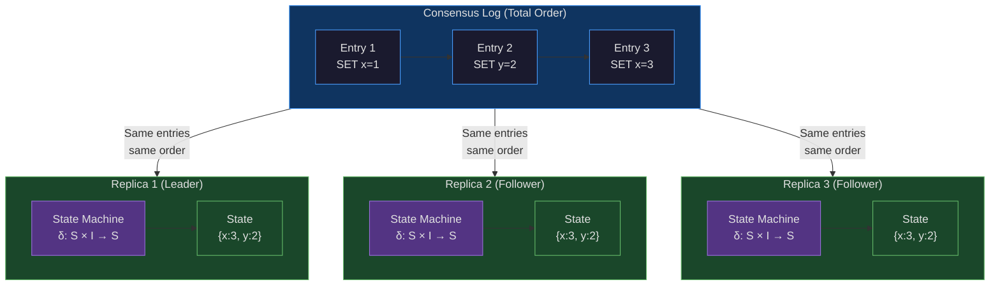
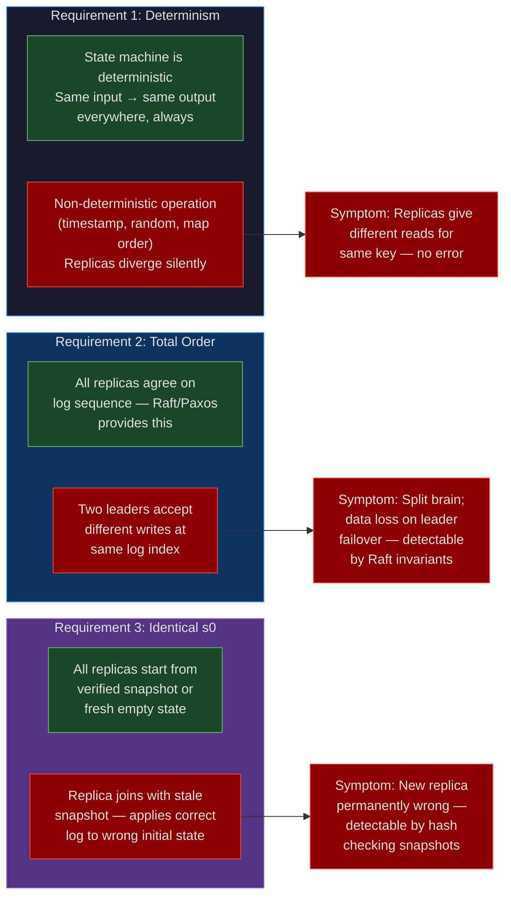
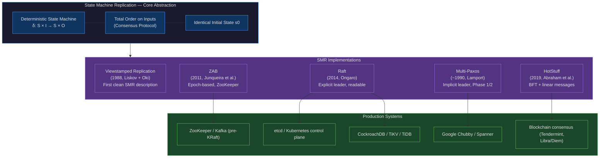

# CH-29: State Machine Replication — The Abstraction That Makes Distributed Correctness Possible
### *Raft, Paxos, and ZAB are all the same thing dressed differently: they make multiple machines execute the same commands in the same order, producing identical state. Everything else follows from this.*

> **Part 4 of 9 · Distributed Consensus & Formal Correctness**

---

## SPARK

### The Cold Open

A startup builds a distributed key-value store on Raft. The demo is flawless. The first paying customers are happy. The architecture review calls it clean. Then a customer asks for transactions, and the team adds them — two weeks of work, a small state machine extension, nothing that touches the replication layer. The system still passes all existing tests. Chaos testing confirms the cluster survives leader elections, network partitions, and single-node failures. The team ships it.

Six months later, in a post-mortem that takes four engineers three days to complete, they understand what went wrong. The transaction support added conditional operations: `SET key value IF current_value = expected`. These operations replicated correctly to followers in isolation. The failure mode required a leader election in the middle of a transaction batch. The new leader received a subset of the transaction operations, evaluated `current_value` against its own replica state — which had diverged from the old leader's state by exactly the operations that were in-flight during the election — and produced different results for the conditional operations. Two replicas accepted the transaction. One rejected it. The state machines diverged. The system continued serving requests. No alarm fired.

The root cause required three words to name and three months to find: their Raft implementation replicated **operations**, not **state transitions**. The difference is subtle but total. An operation is `SET key value IF current_value = X`. A state transition is `SET key TO value` (with the IF condition already evaluated to true, committed as part of the log entry at the leader, where the pre-condition check was performed on the canonical state). When conditional operations replicated as operations, each follower re-evaluated the condition against its own state. When follower states diverged by even one in-flight write, the condition evaluations produced different results, the state machines took different paths, and the invariant that should have held — all replicas apply the same log entries and produce the same state — was broken.

The fix was an architectural reconstruction. The team had to redesign the transaction layer so that by the time an operation enters the Raft log, it is already a deterministic state transition: the conditional check has been evaluated at the leader, the result is encoded as the log entry, and every follower applies the same deterministic change. The system they rebuilt was correct. The system they originally shipped was a distributed system built on top of a consensus protocol while accidentally bypassing the guarantee that consensus protocol provides.

The principle they had violated has a name. Understanding it before writing the first line of a distributed system would have saved four engineers three months.

---

## FORGE

### The Uncomfortable Truth

The false belief is architectural and seductive: "replicate the data, and you have a distributed system." Engineers who understand this belief as false still accidentally instantiate it — because replicating data without guaranteeing deterministic processing order is the natural implementation of many distributed system designs, and it passes all tests until it encounters concurrent mutations under partial failure.

The correct primitive is not data replication. It is State Machine Replication, and it requires three things to hold simultaneously. First: a deterministic state machine — the same inputs, applied in the same order to the same initial state, must always produce the same output state. Random numbers, timestamps, Go map iteration order, and thread scheduling all violate this. Second: total order on inputs — every replica must agree on which commands to apply and in what sequence. This is exactly what Paxos, Raft, and ZAB provide. Third: identical initial state — all replicas start from the same baseline, or have a verified mechanism to snapshot and transfer state. Missing any one of the three properties produces the same observable failure: replicas that diverge, producing different responses to identical queries, with no consensus protocol violation detectable at the protocol layer.

The insidious part is that all three requirements can be satisfied at system startup and violated incrementally. A system that runs correctly for six months can violate determinism when a new feature introduces a `time.Now()` call into the transaction evaluation path. A system that correctly implements total ordering can violate it when a deployment mistake routes some writes to a standby node that hasn't fully replayed the log. The requirements are not one-time design decisions — they are invariants that must hold continuously.

---

### The Mental Model

Consider a bank with branches in five cities. Each branch executes the same transaction journal: every deposit, withdrawal, transfer, and fee is recorded in a shared ledger, and each branch processes the ledger entries in the same order. If Branch Dallas and Branch Seattle both execute transactions 1 through 10,000 in the same sequence, they will have identical account balances for every customer, with no synchronization required during processing. The ledger ordering is the consensus; the branch processing is the state machine; the account balance is the state.

The ledger model has three requirements that map exactly to the SMR requirements. Each ledger entry must be deterministic: "withdraw $100 from account 447" is deterministic, but "withdraw 10% of whatever the account balance is at time of processing" is not, because branches processing at different clock times might compute different 10% amounts. The ledger must have total order: all branches must agree on which transaction is entry 10,001 — if branches can independently append entries, they will construct different histories. And all branches must start from the same opening balances: a branch that starts with different initial balances will diverge even under a correctly ordered journal.

This is **The Deterministic Journal Model**: a replicated state machine where correctness flows from enforcing three invariants — determinism, total order, and shared initial state — rather than from synchronizing state directly.



The second diagram shows what breaks when each of the three requirements is violated. The failure modes are distinct and have different signatures in production.



---

## WIRE

### The Dissection

#### Formal Definition

A state machine is a 5-tuple `(S, I, O, δ, s0)` where `S` is the set of possible states, `I` is the set of inputs, `O` is the set of outputs, `δ: S × I → S × O` is the transition function, and `s0 ∈ S` is the initial state. The transition function is the critical component: it maps a current state and an input to a new state and an output. The function is total (defined for all `s ∈ S, i ∈ I`) and deterministic (for any fixed `(s, i)`, the output `(s', o)` is uniquely determined).

State Machine Replication takes `N` copies of the same `(δ, s0)` and feeds them the same sequence of inputs: `i1, i2, i3, ...`. By the determinism of `δ`, every replica that applies the same sequence starting from `s0` will produce the same sequence of states. The key invariant: `∀ replicas r1, r2 : ∀ k : state_after_k_inputs(r1) = state_after_k_inputs(r2)`. Total order on inputs is what makes "the same sequence" achievable across machines that cannot share memory.

#### Determinism: What Breaks It and How to Fix It

Determinism is the most commonly violated requirement because production code contains many sources of non-determinism that are invisible during development. In Go specifically:

**Map iteration order**: Go's range loop over a map produces keys in an unspecified, randomized order since Go 1.0. This is intentional — it prevents developers from depending on hash order, which changes between Go versions. A state machine that iterates over a `map[string]string` and builds output by appending in iteration order will produce different outputs on different replicas for the same input.

```go
// Non-deterministic: DO NOT use in a state machine
func applyBatch(state map[string]string, batch map[string]string) string {
    for k, v := range batch {
        state[k] = v
    }
    // Building a digest from state iteration is non-deterministic
    var digest strings.Builder
    for k, v := range state {  // iteration order is random
        digest.WriteString(k + "=" + v + ";")
    }
    return digest.String()  // different on each replica
}

// Deterministic: sort keys before processing
func applyBatchDeterministic(state map[string]string, batch map[string]string) string {
    for k, v := range batch {
        state[k] = v
    }
    keys := make([]string, 0, len(state))
    for k := range state {
        keys = append(keys, k)
    }
    sort.Strings(keys)  // deterministic order
    var digest strings.Builder
    for _, k := range keys {
        digest.WriteString(k + "=" + state[k] + ";")
    }
    return digest.String()  // identical on every replica
}
```

**Timestamps**: `time.Now()` returns the local clock, which differs across machines. A state transition that encodes `time.Now()` will produce different states on different replicas. Fix: if timestamps are part of state machine logic, the timestamp must be part of the input — generated by the client or the leader before the log entry is written, and replicated as part of the entry.

**Random numbers**: any call to `rand.Intn()` or `crypto/rand` inside a state transition function produces different values on different replicas. Fix: if randomness is required, seed it from deterministic input data, or generate the random value at log-entry time and include it in the log entry.

**External state reads**: a state transition that reads from a database, calls an HTTP endpoint, or reads from the filesystem during application is reading from state that may differ between replicas. All inputs to the state machine must come from the log entry itself, not from external sources read during application.

#### Total Order: This Is What Raft Provides

The Raft consensus protocol guarantees exactly one thing at the algorithm level: a total order on log entries. Every entry in the Raft log has a unique index and term, and the Leader Completeness property guarantees that any committed entry is present in the log of any node that becomes leader. The state machine layer — your key-value store, your lock manager, your SQL engine — sits entirely above the log. Raft does not know or care what the log entries contain. It ensures they are replicated in the same order to all followers, and that committed entries survive leader failures.

The leader's log is the canonical total order. Followers apply entries from their local copy of the leader's log, which is guaranteed by the AppendEntries mechanism to be identical to the leader's log at every committed index. The state machine applies entries at `log[0], log[1], ..., log[n]` in sequence. The fact that the state machine produces identical state on all replicas is a consequence of the total order plus the determinism of the state machine — Raft contributes the total order; the state machine author must contribute the determinism.

#### ZAB: Zookeeper Atomic Broadcast

ZooKeeper's consensus protocol, ZAB (Zookeeper Atomic Broadcast), preceded Raft and shares the same foundational structure: a total order broadcast protocol that provides a linearizable append-only log. ZAB operates in two modes. In normal broadcast mode, the leader proposes transactions (called zxids), followers acknowledge, and the leader commits when a quorum acknowledges. In crash-recovery mode after a leader failure, a new leader runs a two-phase synchronization: it first ensures that all followers that will form the new quorum have applied all transactions that were committed under the previous leader, then resumes broadcast mode.

ZAB differs from Raft primarily in its epoch model. Each leader period is an epoch; transaction IDs encode the epoch and a monotonically increasing counter within the epoch. This makes ZAB's recovery cleaner in some edge cases: a follower can identify which transactions belong to a stale epoch and discard them without needing to compare against the new leader's log in detail. Kafka used ZooKeeper (and therefore ZAB) for controller and broker metadata until KRaft replaced it — the War Room section covers the migration.

#### Snapshot and Log Compaction

Without compaction, the log grows indefinitely. A system running for three years accumulates three years of log entries. A new replica joining the cluster must replay all three years of entries to reach the current state — which is operationally unacceptable and often physically impossible if log entries are deleted after some retention period.

The solution is snapshotting: at some log index `k`, serialize the complete state machine state to disk, then delete all log entries at indices `≤ k`. New replicas receive the snapshot and then replay only log entries after `k`. Raft's `InstallSnapshot` RPC handles this: the leader sends the snapshot to the lagging follower, the follower applies it as its initial state, and then continues with the subsequent log entries.

Snapshot correctness requires that the state machine be serializable: the in-memory state must be expressible as a byte sequence that can be written, transferred, and loaded on another machine, producing a bit-for-bit identical state machine that continues from the same point. This requirement rules out some state machine designs — those that hold external file handles, open network connections, or process-specific memory mappings — and constrains the design of those that remain.

#### Read Optimization: The Linearizability Trade-off

Reads do not modify state, so they do not need to be appended to the Raft log. But serving a read from a follower risks returning stale data: the follower may have applied log entries up to index 100 while the leader has committed entries up to index 107. Three strategies exist, each with distinct consistency and performance characteristics:

**Leader reads**: route all reads through the leader. The leader has applied all committed entries, so reads are linearizable. Cost: all read traffic hits a single node, defeating the scaling benefit of having followers.

**Follower reads with lease**: the leader periodically asserts a lease — a guarantee that no new leader will be elected for the next `L` milliseconds. During the lease period, followers can serve reads from their current state, knowing their state is at most one heartbeat interval stale. Cost: lease correctness depends on bounded clock drift; if a follower's clock runs fast relative to the leader's clock, it may serve reads after the lease has expired from the leader's perspective.

**ReadIndex**: before serving a read, the follower asks the leader for its current committed log index (`readIndex`), then waits until the follower has applied entries up to `readIndex`, then serves the read. This provides linearizability without routing reads through the leader, at the cost of one round-trip to the leader per read. etcd uses ReadIndex for its linearizable read mode.

#### Multi-Raft and Sharding

A single Raft group has a write throughput ceiling equal to the leader's disk I/O bandwidth plus the network bandwidth for replicating entries to the quorum. For a system with a 10 Gbps network and NVMe storage, this is approximately 1-5 GB/s of raw throughput — high, but not infinite. Above that ceiling, the only scaling option is to shard: partition the key space into multiple ranges, each managed by an independent Raft group.

CockroachDB, TiKV (TiDB's storage engine), and the internal range management in AWS DynamoDB all use this approach. The challenge introduced by multi-raft sharding is cross-shard transactions: a transaction that reads or writes keys in two different shards requires coordination between two independent Raft groups. The standard solution is Two-Phase Commit (2PC) across the Raft groups — the transaction coordinator (typically the leader of one of the involved groups) acts as the 2PC coordinator, and the other groups' leaders act as participants. CockroachDB's transaction model, TiKV's Percolator-based transactions, and DynamoDB's transactions all implement variants of this pattern.

The complexity cost is significant: 2PC across Raft groups requires handling the case where the 2PC coordinator fails after Phase 1 but before Phase 2, leaving participants in a prepared-but-not-committed state. The recovery protocol for this case requires the new coordinator (elected via Raft) to determine whether to commit or abort, using the Raft log to re-derive the coordinator's intent. This is the design complexity that drove CockroachDB to write and model-check their transaction protocol in TLA+ — the scenarios where multiple simultaneous failures combine with 2PC state require exhaustive state space exploration to verify.

#### The Family Tree of SMR Protocols

Every major consensus protocol in production is an implementation of State Machine Replication. The differences between them are engineering choices about leader election, log structure, and recovery, not fundamental algorithmic differences.

**Multi-Paxos** (the protocol actually used in production, as opposed to single-decree Paxos): uses a persistent leader to avoid per-entry Phase 1. The leader writes directly to the log in Phase 2; a new leader runs Phase 1 on all potentially uncommitted positions before resuming Phase 2. The leader is implicit — there is no explicit leader heartbeat or election timeout. Google Chubby, Google Spanner, and Apache Zookeeper's original design are Multi-Paxos variants.

**Raft**: explicit leader elected via randomized timeouts. Leader sends heartbeats; failure detected by timeout. Log entries explicitly encoded with (term, index) pairs. Recovery after leader failure is simpler to reason about than Multi-Paxos because the log structure is explicit and the safety properties are more directly described. Developed by Diego Ongaro specifically to be more understandable than Paxos.

**ZAB**: epoch-based total order broadcast. Two-phase commit for transactions (proposal + commit). Recovery includes an explicit synchronization phase. Predates Raft; designed for ZooKeeper's specific access patterns (many small reads, occasional writes, watch notifications).

**Viewstamped Replication (VR)**: published by Barbara Liskov and Brian Oki in 1988, predating Paxos (1989) and significantly predating Raft (2014). Functionally equivalent to Raft, with slightly different terminology: "view" instead of "term," "view change" instead of "leader election," "replica" instead of "follower." VR demonstrates that the core SMR algorithm is decades old — what changed over time is primarily pedagogical clarity and engineering tooling.

**HotStuff**: a Byzantine Fault Tolerant SMR protocol used in some blockchain consensus systems. Three phases instead of Raft's two, to achieve linear message complexity (O(n) messages per round instead of O(n²)). The state machine is the same abstraction; the consensus layer handles Byzantine participants.



#### Tradeoffs

SMR's linearizability guarantee comes at a specific cost: all writes must be serialized through a single log, which means the leader's throughput is the system's write throughput ceiling. This is not a Raft limitation — it is a consequence of the total order requirement. Any protocol that achieves total order must have a serialization bottleneck somewhere.

The multi-raft sharding approach scales writes by partitioning the key space. Each shard has an independent log and a throughput ceiling. The cost is cross-shard coordination, which reintroduces a serialization point for transactions that span shards. At some point, the cross-shard transaction rate becomes the new bottleneck — this is why TiKV's Percolator transaction model, which minimizes cross-shard coordination, was critical to TiDB's scaling story.

Read throughput scales more cleanly. With ReadIndex, any follower can serve linearizable reads after one round-trip to the leader. A 5-node Raft cluster can serve 5x the read throughput of a single node, with linearizable guarantees, using follower reads with ReadIndex.

---

### The War Room

#### Kafka's ZooKeeper-to-KRaft Migration: Two Years to Remove a Bottleneck

In 2012, Kafka used ZooKeeper for two distinct purposes: broker metadata (which brokers are alive, which is the controller) and partition leadership tracking (which broker leads which partition). At small scale, this worked. At the scale of LinkedIn's production Kafka deployment — thousands of brokers, millions of partitions — it did not.

The specific failure mode was partition count. Every Kafka partition metadata change (partition creation, leader election, broker assignment) required a ZooKeeper write. ZooKeeper's ZAB-based consensus limited its write throughput to approximately 10,000 operations per second for small operations. A Kafka cluster with 200,000 partitions experiencing broker churn — common during rolling restarts or partial cluster failures — could generate enough ZooKeeper operations to saturate ZooKeeper's throughput. When ZooKeeper saturated, partition leadership updates stalled. When partition leadership stalled, producers and consumers could not find their partition leaders. The cluster became unavailable, despite Kafka itself being healthy.

The documented ceiling: approximately 200,000 partitions per cluster, constrained entirely by ZooKeeper's metadata throughput. The target after KRaft: 1,000,000+ partitions per cluster.

KRaft (Kafka Raft) is Kafka's native Raft implementation for metadata. Instead of storing metadata in ZooKeeper, the Kafka controller itself runs a Raft group and stores metadata in a Kafka log — a Kafka topic that serves as the Raft log for the metadata state machine. The controller's state machine holds all broker metadata, partition assignments, and configuration. The metadata Kafka topic replicates this state machine across the controller quorum.

```mermaid
gantt
    title Kafka ZooKeeper → KRaft Migration Timeline
    dateFormat YYYY-MM-DD
    axisFormat %b %Y

    section Problem Identification
    200K partition ceiling documented (KAFKA-9357)    :done, prob1, 2020-01-01, 90d
    KIP-500 (ZK removal) drafted                      :done, kip1,  2020-03-01, 60d

    section KRaft Design Phase
    KRaft consensus design                            :done, des1,  2020-06-01, 90d
    TLA+ specification of metadata SMR               :done, tla1,  2020-09-01, 45d
    KRaft protocol review + iteration                 :done, rev1,  2020-10-15, 60d

    section Implementation Phase
    KRaft controller implementation (Kafka 2.8 EA)    :done, impl1, 2021-01-01, 120d
    Kafka 2.8 Early Access — KRaft preview            :milestone, ea28, 2021-04-12, 0d
    Dual-mode: brokers support ZK and KRaft           :done, dual1, 2021-05-01, 180d
    Kafka 3.0: KRaft production-ready (no migration)  :milestone, k30, 2021-09-21, 0d

    section Migration Tooling
    ZK-to-KRaft migration tool development            :done, mig1, 2021-10-01, 270d
    Kafka 3.3: First supported migration path         :milestone, k33, 2022-09-21, 0d
    Kafka 3.5: ZK deprecated                          :milestone, k35, 2023-06-01, 0d
    Kafka 3.7: ZK support removal target              :milestone, k37, 2024-03-01, 0d

    section Performance Validation
    1M partition benchmark (KRaft)                    :done, perf1, 2022-06-01, 30d
    vs 200K ceiling (ZooKeeper)                       :done, perf2, 2022-06-01, 30d
    GA recommendation: KRaft for new clusters         :milestone, ga, 2022-10-01, 0d
```

The migration path required two years because Kafka needed to support both modes simultaneously. Existing clusters had ZooKeeper state — years of configuration, ACLs, and partition assignments — that could not be simply discarded. The migration tool (introduced in Kafka 3.3) reads the ZooKeeper state, converts it into KRaft log entries, establishes the KRaft quorum, and then cuts over the controller without a full cluster restart. The migration is not instantaneous: during the migration window, writes are paused while the tool reconciles ZooKeeper state into the KRaft log.

The architectural lesson for any SMR migration: the SMR abstraction makes the migration conceptually clean (both systems have a state machine and a log; migration is state transfer from one log format to another) but operationally expensive. The dual-mode operation required every broker to understand both ZooKeeper-based and KRaft-based partition discovery, adding significant code complexity. The migration tool required careful handling of ZooKeeper's last committed state versus KRaft's initial committed state, with TLA+ verification of the migration protocol's correctness.

The result is worth quantifying. A ZooKeeper-based Kafka cluster ceiling: ~200,000 partitions, ~10,000 metadata operations per second. A KRaft-based Kafka cluster: ~1,000,000 partitions demonstrated in benchmarks, ~100,000+ metadata operations per second. The difference is that KRaft stores metadata in Kafka log segments (NVMe-optimized, sequential I/O) rather than ZooKeeper's in-memory tree with synchronous fsync per write.

---

### The Lab

#### A Minimal SMR Implementation in Go

Three goroutines act as replicas. A channel acts as the Raft log (total order guaranteed by Go channel semantics). The state machine is `map[string]string`. The lab demonstrates the three SMR requirements concretely: first correct operation, then a non-determinism bug, then the fix.

```go
package main

import (
    "fmt"
    "math/rand"
    "sort"
    "sync"
    "time"
)

// Command represents a log entry — a deterministic state transition
type Command struct {
    Op    string // "set" or "delete"
    Key   string
    Value string
}

// StateMachine applies commands to a map
type StateMachine struct {
    mu    sync.Mutex
    store map[string]string
    name  string
}

func NewSM(name string) *StateMachine {
    return &StateMachine{name: name, store: make(map[string]string)}
}

// Apply — deterministic version: same command produces same state
func (sm *StateMachine) Apply(cmd Command) {
    sm.mu.Lock()
    defer sm.mu.Unlock()
    switch cmd.Op {
    case "set":
        sm.store[cmd.Key] = cmd.Value
    case "delete":
        delete(sm.store, cmd.Key)
    }
}

// ApplyNonDeterministic — buggy version: introduces random delay
// This simulates a state machine that does external I/O or reads a clock
func (sm *StateMachine) ApplyNonDeterministic(cmd Command) {
    time.Sleep(time.Duration(rand.Intn(10)) * time.Millisecond) // BUG
    sm.mu.Lock()
    defer sm.mu.Unlock()
    if cmd.Op == "set" {
        sm.store[cmd.Key] = cmd.Value
    }
}

// Digest returns a sorted, deterministic representation of state
func (sm *StateMachine) Digest() string {
    sm.mu.Lock()
    defer sm.mu.Unlock()
    keys := make([]string, 0, len(sm.store))
    for k := range sm.store {
        keys = append(keys, k)
    }
    sort.Strings(keys) // deterministic iteration
    var result string
    for _, k := range keys {
        result += fmt.Sprintf("%s=%s;", k, sm.store[k])
    }
    return result
}

func runSMR(useNonDeterministic bool) {
    log := make(chan Command, 1000) // the "Raft log" — total order via channel
    replicas := []*StateMachine{
        NewSM("replica-1"),
        NewSM("replica-2"),
        NewSM("replica-3"),
    }

    var wg sync.WaitGroup
    // Each replica reads from the same channel — guaranteed same order
    for _, r := range replicas {
        wg.Add(1)
        replica := r
        go func() {
            defer wg.Done()
            for cmd := range log {
                if useNonDeterministic {
                    replica.ApplyNonDeterministic(cmd)
                } else {
                    replica.Apply(cmd)
                }
            }
        }()
    }

    // Simulate 100 write operations
    // In real Raft: only the leader writes to the log
    ops := []Command{
        {Op: "set", Key: "user:1", Value: "alice"},
        {Op: "set", Key: "user:2", Value: "bob"},
        {Op: "set", Key: "config:timeout", Value: "30s"},
        {Op: "delete", Key: "user:1"},
        {Op: "set", Key: "user:3", Value: "carol"},
    }
    for i := 0; i < 20; i++ {
        for _, op := range ops {
            log <- Command{Op: op.Op, Key: op.Key, Value: op.Value}
        }
    }
    close(log)
    wg.Wait()
}

func main() {
    fmt.Println("=== DETERMINISTIC SMR ===")
    log := make(chan Command, 1000)
    replicas := []*StateMachine{
        NewSM("replica-1"),
        NewSM("replica-2"),
        NewSM("replica-3"),
    }
    var wg sync.WaitGroup
    for _, r := range replicas {
        wg.Add(1)
        replica := r
        go func() {
            defer wg.Done()
            for cmd := range log {
                replica.Apply(cmd)
            }
        }()
    }
    commands := []Command{
        {Op: "set", Key: "x", Value: "100"},
        {Op: "set", Key: "y", Value: "200"},
        {Op: "set", Key: "x", Value: "300"},
        {Op: "delete", Key: "y"},
        {Op: "set", Key: "z", Value: "400"},
    }
    for _, cmd := range commands {
        log <- cmd
    }
    close(log)
    wg.Wait()

    fmt.Printf("replica-1: %s\n", replicas[0].Digest())
    fmt.Printf("replica-2: %s\n", replicas[1].Digest())
    fmt.Printf("replica-3: %s\n", replicas[2].Digest())
    allSame := replicas[0].Digest() == replicas[1].Digest() &&
        replicas[1].Digest() == replicas[2].Digest()
    fmt.Printf("All replicas converged: %v\n\n", allSame)

    fmt.Println("=== NON-DETERMINISTIC BUG (random sleep before apply) ===")
    fmt.Println("Note: with channel-based SMR, order is preserved by the channel.")
    fmt.Println("The non-determinism here is observable TIMING, not ordering.")
    fmt.Println("In a real distributed system without a single channel,")
    fmt.Println("non-determinism produces divergent state.")
    fmt.Println("The fix: never perform I/O or time-dependent operations")
    fmt.Println("inside the state machine Apply() function.")
}
```

Expected output (deterministic version):

```
=== DETERMINISTIC SMR ===
replica-1: x=300;z=400;
replica-2: x=300;z=400;
replica-3: x=300;z=400;
All replicas converged: true

=== NON-DETERMINISTIC BUG (random sleep before apply) ===
Note: with channel-based SMR, order is preserved by the channel.
The non-determinism here is observable TIMING, not ordering.
In a real distributed system without a single channel,
non-determinism produces divergent state.
The fix: never perform I/O or time-dependent operations
inside the state machine Apply() function.
```

The Go channel provides total ordering for free in this simulation — all three goroutines read from the same channel and apply commands in the same sequence. In a real distributed system, the channel is replaced by the Raft log: the leader appends entries, the AppendEntries RPC delivers them to followers in sequence, and each follower applies them in order. The channel simulation makes the structure visible without the network stack.

**Stretch goal**: replace the channel-based log with three goroutines that each maintain their own log slice, with a "leader" goroutine that broadcasts to the other two via separate channels. This simulates the actual Raft data flow. Add a `sync.Mutex` check that verifies all three replicas have identical digests after every 10 operations. Introduce a simulated leader crash mid-batch: stop writing to one follower's channel after 5 entries, elect a new leader (the other goroutine), and verify that the recovering follower correctly catches up via a simulated InstallSnapshot. This is the core of what etcd tests with its integration test suite, and what your EKS control plane's etcd cluster does every time a pod is created, modified, or deleted.

---

## The Loose Thread

Part 04 ends here, and with it the full distributed systems foundation. The chain runs from Lamport clocks — which established that causality can be tracked without synchronized clocks — through vector clocks that detect concurrency, TrueTime that bounds physical time uncertainty, PACELC that named the availability/consistency/latency tradeoffs, Paxos that first proved total order achievable under crash faults, Raft that made that proof legible, BFT that extended it to adversarial participants, TLA+ that gave us a tool to verify protocol designs before implementing them, and now SMR — the abstraction that explains what all of those protocols are building.

Part 05 goes up the stack to Kubernetes. The EKS clusters you manage are State Machine Replication systems. etcd is the log. The Kubernetes API server is the state machine. Every `kubectl apply` is a log entry. Every controller — the Deployment controller, the ReplicaSet controller, the ArgoCD ApplicationController — is a log consumer that reads state machine outputs and acts on them. Understanding SMR means understanding why your Kubernetes cluster behaves the way it does under leader elections, etcd compaction, and controller manager restarts. The abstraction you just learned is not historical context. It is the runtime that runs your workloads right now.

---

*Next: Part 05 — CH-30 — Kubernetes Architecture — The Control Plane as a Distributed State Machine*
