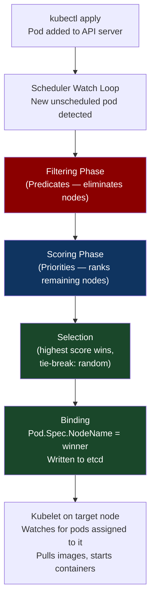
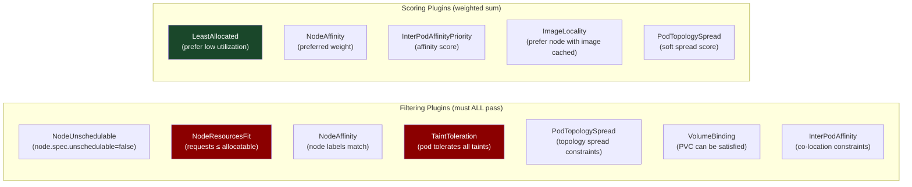

# CH-30: The Kubernetes Scheduler Internals — What Actually Happens After `kubectl apply`
### *Between `kubectl apply` and your pod running, the scheduler makes approximately 47 decisions. Most engineers can name three of them.*

> **Part 5 of 9 · Cloud-Native Orchestration**

---

## The Cold Open

It is a Thursday afternoon and a senior platform engineer at a fintech company is staring at a pod that has been `Pending` for eleven minutes. The pod is a batch job — no special resource requirements, standard 500m CPU / 512Mi memory requests. The cluster has 47 nodes. Thirty-one of them are reporting available CPU. The pod is still Pending.

`kubectl describe pod` shows the event: `0/47 nodes are available: 30 Insufficient cpu, 17 node(s) had untolerated taint`.

She counts: 30 + 17 = 47. Every node has rejected the pod. But she just ran `kubectl top nodes` and saw multiple nodes with over 4 CPU cores available.

The confusion is a common one: **allocatable** versus **requested**. The Kubernetes scheduler doesn't ask "does this node have enough CPU right now?" It asks "does this node have enough CPU capacity minus the sum of all pod requests scheduled to it, regardless of what those pods are actually consuming?" A node with 8 CPU cores, 12 pods each requesting 0.5 CPU, has 2 CPU of allocatable remaining — even if those 12 pods are collectively using only 1 CPU total. The scheduler is not an orchestrator. It is a bin packer.

The second issue — the 17 tainted nodes — turns out to be more instructive. Those are the cluster's GPU nodes, marked with `nvidia.com/gpu:NoSchedule` to prevent non-GPU workloads from landing on expensive hardware. The batch job had no GPU toleration, so it was rejected before the scheduler even evaluated its resource fit.

Two distinct failure modes. One `Pending` status. Zero useful indication of which problem is primary.

The engineer fixes the immediate issue by right-sizing the resource requests (the pod's 500m request was a copy-paste from a CPU-intensive service; this batch job actually needed 100m). But she opens a ticket: "the scheduler's rejection messaging is unusable at scale." That ticket sits open for months, because fixing the scheduler output means understanding what the scheduler actually does — and that is not a short conversation.

This chapter is that conversation.

---

## The Uncomfortable Truth

The assumption is: the Kubernetes scheduler is a load balancer that places pods on nodes with available capacity.

The reality is that the scheduler is a **multi-dimensional bin packing algorithm** with pluggable extension points, running as a control loop against the cluster's desired state, that operates on **requested resources** (not actual utilization), considers dozens of constraints simultaneously, and produces a **single binding decision** per pod that is never revised after placement.

The implications compound: a pod placed on an under-loaded node cannot be moved without a deliberate eviction. A node that becomes overloaded due to resource contention cannot shed pods to a lighter node without manual intervention or a separate tool (Kubernetes Vertical Pod Autoscaler, Descheduler, or custom eviction logic). The scheduler's job is done the moment the pod is bound — everything that happens after is the kubelet's problem.

The production consequence: **scheduling decisions compound**. A cluster with excellent average utilization can have nodes with 90% utilization and nodes with 10% utilization simultaneously, because the scheduler's bin packing is path-dependent and not rebalanced automatically. The scheduler does not see a global optimization problem; it sees a sequence of individual pod placements, each solved greedily against the current cluster state.

For platform engineers: every suboptimal scheduling decision is permanent until you actively re-pack, and re-packing disrupts running workloads. Getting scheduling right the first time matters more than in most other infrastructure decisions.

---

## The Mental Model

Think about a warehouse with 47 loading docks, where every incoming shipment must be assigned to a dock before it can be unloaded. Each dock has a rated maximum weight capacity. Shipments declare their weight before arriving. The dock manager assigns each shipment to a dock based on declared weight, not actual weight — because actual weight isn't known until the truck is on the dock, by which point it's too late to re-route.

Some docks have special equipment restrictions: hazmat docks won't take regular freight (taints + tolerations). Some shipments require refrigeration: they can only go to refrigerated docks (node affinity). Some shipments must be co-located with other shipments for logistical reasons (pod affinity). Some must be kept apart (pod anti-affinity).

The dock manager doesn't continuously rebalance docks — once a shipment is assigned and the truck is backed in, it stays until unloading is complete. The manager only acts on new shipments as they arrive.

**The Scheduler Decision Pipeline**





---

## The Dissection

### The Scheduling Framework: Plugins and Extension Points

Kubernetes 1.15 replaced the monolithic scheduler predicates/priorities model with the **Scheduling Framework** — a plugin architecture with well-defined extension points. This matters because it allows custom schedulers to be written as plugins that augment the default scheduler rather than replacing it entirely.

The extension points in order of execution:

```
PreFilter    → Filter      → PostFilter (preemption)
             → PreScore    → Score     → NormalizeScore
                           → Reserve   → Permit
                           → PreBind   → Bind    → PostBind
                           → WaitOnPermit (for gang scheduling)
```

```go
// The Plugin interface — implement any subset of extension points
// kubernetes/pkg/scheduler/framework/interface.go

type FilterPlugin interface {
    Plugin
    // Return nil to admit the node, non-nil to reject with a reason
    Filter(ctx context.Context, state *CycleState,
           p *v1.Pod, nodeInfo *NodeInfo) *Status
}

type ScorePlugin interface {
    Plugin
    // Return a score 0-100 for this node
    Score(ctx context.Context, state *CycleState,
          p *v1.Pod, nodeName string) (int64, *Status)
    ScoreExtensions() ScoreExtensions
}

type ReservePlugin interface {
    Plugin
    // Reserve resources for this pod on the selected node
    // Called after scoring, before binding — for in-memory state updates
    Reserve(ctx context.Context, state *CycleState,
            p *v1.Pod, nodeName string) *Status
    Unreserve(ctx context.Context, state *CycleState,
              p *v1.Pod, nodeName string)
}

type PermitPlugin interface {
    Plugin
    // Return Allow, Deny, or Wait (with timeout)
    // Wait enables gang scheduling — hold pods until entire gang is ready
    Permit(ctx context.Context, state *CycleState,
           p *v1.Pod, nodeName string) (*Status, time.Duration)
}
```

### NodeResourcesFit: The Core Filtering Logic

The most frequently triggered filter. It checks whether a node's allocatable resources minus the sum of all currently scheduled pod requests can accommodate the pending pod's requests.

```go
// Simplified NodeResourcesFit filter logic
// kubernetes/pkg/scheduler/framework/plugins/noderesources/fit.go

func (f *Fit) Filter(ctx context.Context, cycleState *framework.CycleState,
                     pod *v1.Pod, nodeInfo *framework.NodeInfo) *framework.Status {
    
    // s = precomputed pod resource requirements (stored in CycleState for reuse)
    s, err := getPreFilterState(cycleState)
    if err != nil {
        return framework.AsStatus(err)
    }
    
    // Check each resource type the pod requests
    insufficientResources := fitsRequest(s, nodeInfo, f.ignoredResources, f.ignoredResourceGroups)
    
    if len(insufficientResources) != 0 {
        // Build the failure reason message
        // This is what appears in 'kubectl describe pod' events
        failureReasons := make([]string, 0, len(insufficientResources))
        for _, r := range insufficientResources {
            failureReasons = append(failureReasons,
                fmt.Sprintf("Insufficient %s", r.ResourceName))
        }
        return framework.NewStatus(
            framework.Unschedulable,
            strings.Join(failureReasons, ", "))
    }
    return nil  // Node passes this filter
}

func fitsRequest(podRequest *preFilterState, nodeInfo *framework.NodeInfo,
                 ignoredExtendedResources, ignoredResourceGroups sets.String) []InsufficientResource {
    
    var insufficientResources []InsufficientResource
    
    // CPU check
    if podRequest.MilliCPU > 0 {
        // nodeInfo.Allocatable.MilliCPU = node capacity - system reserved - kube reserved
        // nodeInfo.Requested.MilliCPU  = sum of all pod requests on this node
        if podRequest.MilliCPU > (nodeInfo.Allocatable.MilliCPU - nodeInfo.Requested.MilliCPU) {
            insufficientResources = append(insufficientResources, InsufficientResource{
                ResourceName: v1.ResourceCPU,
                Reason:       "Insufficient cpu",
                Requested:    podRequest.MilliCPU,
                Used:         nodeInfo.Requested.MilliCPU,
                Capacity:     nodeInfo.Allocatable.MilliCPU,
            })
        }
    }
    
    // Memory check (same pattern)
    if podRequest.Memory > 0 {
        if podRequest.Memory > (nodeInfo.Allocatable.Memory - nodeInfo.Requested.Memory) {
            insufficientResources = append(insufficientResources, InsufficientResource{
                ResourceName: v1.ResourceMemory,
                Reason:       "Insufficient memory",
                Requested:    podRequest.Memory,
                Used:         nodeInfo.Requested.Memory,
                Capacity:     nodeInfo.Allocatable.Memory,
            })
        }
    }
    
    // Extended resources (e.g., nvidia.com/gpu):
    for rName, rQuant := range podRequest.ScalarResources {
        if nodeInfo.Allocatable.ScalarResources[rName]-nodeInfo.Requested.ScalarResources[rName] < rQuant {
            insufficientResources = append(insufficientResources, InsufficientResource{
                ResourceName: rName,
                Requested:    rQuant,
                Used:         nodeInfo.Requested.ScalarResources[rName],
                Capacity:     nodeInfo.Allocatable.ScalarResources[rName],
            })
        }
    }
    
    return insufficientResources
}
```

### Node Affinity: Hard vs. Soft Constraints

Node affinity expressions distinguish between hard constraints (filter phase — `requiredDuringSchedulingIgnoredDuringExecution`) and soft constraints (score phase — `preferredDuringSchedulingIgnoredDuringExecution`). The "IgnoredDuringExecution" suffix means that if a node's labels change after a pod is scheduled, the pod is not evicted. A future API version (`RequiredDuringSchedulingRequiredDuringExecution`) would evict, but it hasn't been released.

```yaml
# Pod spec with both hard and soft node affinity
spec:
  affinity:
    nodeAffinity:
      # Hard: pod WILL NOT schedule if not satisfied
      requiredDuringSchedulingIgnoredDuringExecution:
        nodeSelectorTerms:
        - matchExpressions:
          - key: topology.kubernetes.io/zone
            operator: In
            values: ["us-east-1a", "us-east-1b"]  # Only these AZs
          - key: node.kubernetes.io/instance-type
            operator: NotIn
            values: ["t3.micro"]  # Exclude underpowered instances
      
      # Soft: prefer but don't require GPU nodes
      preferredDuringSchedulingIgnoredDuringExecution:
      - weight: 80  # Weight 1-100; higher = stronger preference
        preference:
          matchExpressions:
          - key: accelerator
            operator: In
            values: ["nvidia-tesla-t4"]
      - weight: 40
        preference:
          matchExpressions:
          - key: accelerator
            operator: In
            values: ["nvidia-tesla-a10g"]
```

### Topology Spread Constraints: Spreading Pods Across Failure Domains

`topologySpreadConstraints` is the mechanism for spreading pods across zones, nodes, or arbitrary topology keys. It replaces the older `podAntiAffinity` pattern for even distribution.

```yaml
spec:
  topologySpreadConstraints:
  - maxSkew: 1              # Max allowed difference between any two topology domains
    topologyKey: topology.kubernetes.io/zone
    whenUnsatisfiable: DoNotSchedule  # Hard constraint (vs ScheduleAnyway for soft)
    labelSelector:
      matchLabels:
        app: payment-service  # Count pods matching this selector per topology domain
    
  - maxSkew: 2
    topologyKey: kubernetes.io/hostname  # Spread across individual nodes
    whenUnsatisfiable: ScheduleAnyway   # Soft: prefer spread, don't block
    labelSelector:
      matchLabels:
        app: payment-service
```

The `maxSkew: 1` constraint on zone topology means: the scheduler tracks how many matching pods exist in each zone, and will not schedule a new pod on a zone if doing so would create a difference of > 1 between the most-loaded and least-loaded zone. If zone us-east-1a has 3 pods and us-east-1b has 1 pod, `maxSkew=1` would require the next pod to go to us-east-1b (or us-east-1c if it has 2 or fewer).

### Preemption: When Filtering Fails for Everything

When a pod cannot be scheduled because no node passes the filter phase, the scheduler does not simply leave it Pending. It runs the **PostFilter** phase — preemption. The preemption logic asks: "is there any node where, if we evict some lower-priority pods, this pod could schedule?"

```go
// Preemption logic (simplified from kubernetes/pkg/scheduler/framework/plugins/defaultpreemption)

func (pl *DefaultPreemption) PostFilter(ctx context.Context,
    state *framework.CycleState, pod *v1.Pod,
    filteredNodeStatusMap framework.NodeToStatusMap) (*framework.PostFilterResult, *framework.Status) {
    
    // Find all nodes where preemption might help
    potentialNodes := pl.findPreemptionCandidates(ctx, pod, filteredNodeStatusMap)
    
    // For each potential node, compute which pods to evict
    // Criteria: evicted pods have lower priority than the pending pod
    // AND evicting them would make room for the pending pod
    // AND minimize the number of evictions (pick the lowest-priority pods first)
    
    bestNode, victimsOnBestNode := pl.selectVictims(ctx, state, pod, potentialNodes)
    
    if bestNode == nil {
        return nil, framework.NewStatus(framework.Unschedulable, "preemption not helpful")
    }
    
    // Evict the selected victim pods (set deletionTimestamp)
    for _, victim := range victimsOnBestNode {
        pl.evictPod(ctx, victim)
    }
    
    // Mark the pending pod as nominated for the preemption target node
    pod.Status.NominatedNodeName = bestNode.Name
    
    // Note: the pod doesn't immediately schedule — it waits for evicted pods
    // to terminate (graceful period), then attempts scheduling again
    return &framework.PostFilterResult{NominatedNodeName: bestNode.Name}, nil
}
```

**Priority classes**: preemption is gated on pod priority. Define priority classes and assign them:

```yaml
# Define a priority class for critical services
apiVersion: scheduling.k8s.io/v1
kind: PriorityClass
metadata:
  name: critical-service
value: 1000000    # Higher = can preempt lower values
globalDefault: false
preemptionPolicy: PreemptLowerPriority  # Can evict lower-priority pods
description: "Used for latency-critical production services"
---
apiVersion: scheduling.k8s.io/v1
kind: PriorityClass
metadata:
  name: batch-job
value: 1000       # Low priority — can be preempted by critical-service pods
preemptionPolicy: Never  # Cannot preempt others even if it could
```

### The Scheduler Cache and Performance

The scheduler maintains an in-memory cache of node state that is kept consistent with the API server via watch events. This is critical for performance: scheduling a pod requires evaluating all nodes, and doing so by querying the API server for each would be prohibitively slow at scale.

```
Scheduler Cache:
  - nodeInfoMap: map[nodeName]*NodeInfo
  - imageStates: map[imageName]*imageState
  - assumedPods: set of pods that have been tentatively assigned but not yet bound

NodeInfo contains:
  - Node object (labels, taints, capacity, allocatable)
  - Requested: sum of all pod requests on this node
  - NonZeroRequested: with default requests for pods that didn't set them
  - List of pods on this node
```

The **assume** mechanism is a key performance optimization: when the scheduler binds a pod, it **assumes** the pod is on the target node (adds its requests to the node's requested total in the cache) before the API server has confirmed the binding. This allows the scheduler to immediately start processing the next pod without waiting for etcd write confirmation. If the binding fails (rare), the scheduler removes the assumed pod from the cache and reschedules.

### What Breaks: Common Scheduling Failures and Their Causes

```bash
# Comprehensive scheduling debug script
#!/bin/bash
POD_NAME="${1:-}"
NAMESPACE="${2:-default}"

echo "=== Scheduler Events for $POD_NAME ==="
kubectl describe pod -n $NAMESPACE $POD_NAME | grep -A 20 "Events:"

echo ""
echo "=== Node Resource Availability ==="
kubectl get nodes -o custom-columns=\
"NAME:.metadata.name,\
CPU-CAP:.status.allocatable.cpu,\
MEM-CAP:.status.allocatable.memory,\
TAINTS:.spec.taints[*].effect" 2>/dev/null | head -20

echo ""
echo "=== Node Allocatable vs Requested (via metrics-server) ==="
kubectl top nodes 2>/dev/null

echo ""
echo "=== Cluster-Level Resource Pressure ==="
kubectl get nodes -o json | python3 -c "
import json, sys
nodes = json.load(sys.stdin)['items']
for n in nodes:
    name = n['metadata']['name']
    alloc = n['status'].get('allocatable', {})
    conds = {c['type']: c['status'] for c in n['status'].get('conditions', [])}
    ready = conds.get('Ready', 'Unknown')
    pressure = {k: v for k, v in conds.items() if 'Pressure' in k and v == 'True'}
    if pressure:
        print(f'{name}: Ready={ready} PRESSURE: {pressure}')
"

echo ""
echo "=== Pending Pod Summary ==="
kubectl get pods --all-namespaces --field-selector=status.phase=Pending \
    -o custom-columns="NS:.metadata.namespace,NAME:.metadata.name,\
REASON:.status.conditions[0].reason,MSG:.status.conditions[0].message" \
    2>/dev/null | head -30
```

### The Tradeoffs

The scheduler's assume optimization creates a window where the cache is inconsistent with reality: the pod is assumed to be on NodeX, but the binding hasn't been confirmed. During this window (typically 100-200ms), another pod could be scheduled to NodeX based on the assumed (reduced) available resources, double-counting. The scheduler handles this with the **assumed pod** expiration: if a binding isn't confirmed within a timeout, the assumption is retracted.

Scheduler throughput at scale: the default Kubernetes scheduler processes approximately 100–200 pods per second at clusters with 5,000 nodes. The bottleneck is the scoring phase — evaluating all nodes for each pod scales O(nodes × score_plugins). The `percentageOfNodesToScore` configuration limits scoring to a subset of feasible nodes:

```yaml
# kube-scheduler configuration
apiVersion: kubescheduler.config.k8s.io/v1
kind: KubeSchedulerConfiguration
percentageOfNodesToScore: 10  # Only score 10% of feasible nodes (sample)
# Default: 0 = auto-calculate based on cluster size
# For 5000-node clusters, default is ~50% (2500 nodes evaluated per pod)
# Setting to 10% reduces accuracy but increases throughput significantly
```

---

## The War Room

> **Incident:** Shopify — Scheduler Starvation of Batch Jobs During Flash Sale (2022)  
> **Date:** November 2022 (Black Friday infrastructure incident, partially documented in public retrospectives)  
> **Impact:** Batch data pipeline jobs (replication lag monitoring, inventory pre-computation) starved for scheduling during flash sale scale-up; 47-minute delay in inventory data freshness; inaccurate inventory displayed to ~800,000 customers

### The Timeline

```mermaid
gantt
    title Scheduler Priority Starvation — Flash Sale Scaling
    dateFormat HH:mm
    section Normal Operations
    Cluster at 60% capacity                      : 00:00, 120m
    Flash sale starts, surge traffic             : 02:00, 5m
    section Scale-Up
    HPA triggers for 200 new web pods            : 02:05, 2m
    Scheduler receives 200 pending high-priority pods : 02:07, 1m
    section Starvation
    Batch jobs compete with high-priority pods   : 02:07, 30m
    Batch jobs have no PriorityClass set         : 02:07, 1m
    All new nodes fill with web pods first       : 02:07, 30m
    Batch jobs remain Pending                    : 02:07, 47m
    section Impact
    Inventory lag monitoring delayed             : 02:15, 47m
    Pre-computation jobs not running             : 02:25, 47m
    Stale inventory shown to customers           : 02:30, 40m
    section Resolution
    Cluster autoscaler adds batch-only node pool : 02:54, 10m
    Batch jobs schedule on dedicated pool        : 03:04, 15m
    Inventory data refreshed                     : 03:19, 10m
```



### The Signals Nobody Caught

No alert existed for "pod Pending for > 5 minutes by priority class." The monitoring team was watching web pod health (99.9% up) and user-facing latency (normal). The batch jobs silently starved — their owners weren't paged because the batch job pods were `Pending`, not `CrashLoopBackOff` or `OOMKilled`. Pending pods produce no alerts in a default monitoring setup.

The second signal: cluster autoscaler was configured to scale up nodes when pods were Pending for > 3 minutes. It did scale up. But the new nodes were immediately claimed by the high-priority web pods (which had higher priority and were waiting), and the batch jobs, with no priority class (implicitly priority 0), stayed pending while each new node was taken by a priority-1000000 web pod.

### The Root Cause

Two architectural gaps:
1. **No priority classes defined for batch jobs**: All batch pods had `priorityClassName` unset, inheriting the global default priority (0). Web pods had `priorityClassName: critical-service` (priority 1,000,000). During scale-up, every new node immediately attracted the highest-priority pending pods.
2. **No dedicated node pool for batch**: Web and batch workloads competed for the same node pool. Dedicated node pools with taints prevent this — batch jobs with the appropriate toleration can only schedule on batch nodes, and web pods without the toleration can't consume batch node capacity.

### The Fix

```yaml
# Step 1: Define priority classes
apiVersion: scheduling.k8s.io/v1
kind: PriorityClass
metadata:
  name: batch-pipeline
value: 100000          # Lower than critical-service (1M) but above 0
preemptionPolicy: Never
description: "Batch data pipelines — can be preempted by critical services"
---
# Step 2: Add taint to batch node pool (via node labels + cluster autoscaler config)
# Node group: batch-nodes
# Taint: dedicated=batch:NoSchedule

# Step 3: Batch job toleration + node affinity
spec:
  priorityClassName: batch-pipeline
  tolerations:
  - key: dedicated
    operator: Equal
    value: batch
    effect: NoSchedule
  affinity:
    nodeAffinity:
      preferredDuringSchedulingIgnoredDuringExecution:
      - weight: 100
        preference:
          matchExpressions:
          - key: dedicated
            operator: In
            values: ["batch"]
```

```yaml
# Prometheus alert: pods pending > 5 minutes by priority class
- alert: PodsPendingTooLong
  expr: |
    kube_pod_status_scheduled{condition="false"} * on(pod, namespace)
    group_left(priority_class)
    kube_pod_spec_volumes_persistentvolumeclaims_info
    > 0
  for: 5m
  annotations:
    summary: "Pods pending > 5m in namespace {{ $labels.namespace }}"
# Better: use kube_pod_info + kube_pod_status_phase
- alert: HighPriorityPodPending
  expr: |
    time() - kube_pod_created{phase="Pending"} > 300
  for: 0m
  labels:
    severity: warning
```

### The Lesson

The Kubernetes scheduler is a priority-aware bin packer. Without explicit priority classes and dedicated node pools, workloads that are "less important" at the moment but still business-critical (monitoring, pipeline jobs) can be starved indefinitely during scale-up events, with no alerting. Priority classes and node pool separation are not optional at production scale — they are the difference between "the cluster scaled up successfully" and "the cluster scaled up the web tier and silently killed everything else."

---

## The Lab

> **Time required:** ~50 minutes  
> **Prerequisites:** A Kubernetes cluster (kind, minikube, or cloud-managed), kubectl, Python 3  
> **What you're building:** A scheduling audit tool that identifies nodes at resource pressure, pods with misconfigured resource requests, and scheduling anti-patterns in your cluster

### Setup

```bash
# Create a kind cluster with 3 nodes for testing:
cat > kind-config.yaml << 'EOF'
kind: Cluster
apiVersion: kind.x-k8s.io/v1alpha4
nodes:
- role: control-plane
- role: worker
- role: worker
EOF
kind create cluster --config kind-config.yaml

# Verify:
kubectl get nodes
```

### The Exercise

**Step 1: Deploy workloads to observe scheduling behavior**

```bash
# Create pods with different resource requirements and observe placement:
kubectl create namespace scheduling-lab

# Pod with explicit CPU request (well-behaved):
kubectl run well-sized -n scheduling-lab \
    --image=nginx --requests=cpu=100m,memory=64Mi \
    --limits=cpu=200m,memory=128Mi

# Pod with no resource requests (anti-pattern — scheduler uses 0 for bin packing):
kubectl run no-requests -n scheduling-lab --image=nginx

# Pod with oversized request (will consume allocatable even if not using it):
kubectl run over-requested -n scheduling-lab \
    --image=nginx --requests=cpu=4,memory=4Gi

# Check where each pod lands and why:
kubectl get pods -n scheduling-lab -o wide
kubectl describe pods -n scheduling-lab | grep -A5 "Node:"
```

**Step 2: Audit tool — scheduling health check**

```python
#!/usr/bin/env python3
# k8s_scheduling_audit.py
# Identifies scheduling issues in the cluster
import subprocess
import json
from collections import defaultdict

def kubectl_json(cmd):
    result = subprocess.run(
        f"kubectl {cmd} -o json",
        shell=True, capture_output=True, text=True
    )
    if result.returncode != 0:
        return None
    return json.loads(result.stdout)

def parse_cpu_milli(s):
    """Parse CPU string like '4' or '500m' to millicores."""
    if not s:
        return 0
    if s.endswith('m'):
        return int(s[:-1])
    return int(float(s) * 1000)

def parse_mem_bytes(s):
    """Parse memory string like '4Gi' or '512Mi' to bytes."""
    if not s:
        return 0
    units = {'Ki': 1024, 'Mi': 1024**2, 'Gi': 1024**3, 'Ti': 1024**4,
             'K': 1000, 'M': 1000**2, 'G': 1000**3}
    for suffix, mult in units.items():
        if s.endswith(suffix):
            return int(s[:-len(suffix)]) * mult
    return int(s)

def audit_cluster():
    print("=== Kubernetes Scheduling Audit ===\n")
    
    # --- Node Analysis ---
    nodes_data = kubectl_json("get nodes")
    if not nodes_data:
        print("ERROR: Cannot connect to cluster")
        return
    
    print("--- Node Allocatable Resources ---")
    nodes = {}
    for n in nodes_data['items']:
        name = n['metadata']['name']
        alloc = n['status'].get('allocatable', {})
        cpu_milli = parse_cpu_milli(alloc.get('cpu', '0'))
        mem_bytes = parse_mem_bytes(alloc.get('memory', '0'))
        nodes[name] = {'cpu_alloc': cpu_milli, 'mem_alloc': mem_bytes,
                       'cpu_req': 0, 'mem_req': 0, 'pod_count': 0}
        print(f"  {name:40s} CPU: {cpu_milli}m   MEM: {mem_bytes//1024//1024}Mi")
    
    # --- Pod Analysis ---
    pods_data = kubectl_json("get pods --all-namespaces")
    if not pods_data:
        return
    
    issues = []
    pending_pods = []
    no_requests_pods = []
    no_limits_pods = []
    burstable_ratio_pods = []  # limit/request ratio > 4
    
    for pod in pods_data['items']:
        ns = pod['metadata']['namespace']
        name = pod['metadata']['name']
        phase = pod['status'].get('phase', 'Unknown')
        node = pod['spec'].get('nodeName', '')
        
        if phase == 'Pending':
            conditions = pod['status'].get('conditions', [])
            reason = next((c.get('message', '') for c in conditions
                          if c.get('type') == 'PodScheduled'
                          and c.get('status') == 'False'), 'Unknown')
            pending_pods.append((ns, name, reason[:100]))
        
        if phase == 'Running' and node:
            for container in pod['spec'].get('containers', []):
                resources = container.get('resources', {})
                req = resources.get('requests', {})
                lim = resources.get('limits', {})
                
                cpu_req = parse_cpu_milli(req.get('cpu', ''))
                mem_req = parse_mem_bytes(req.get('memory', ''))
                
                # Anti-pattern: no requests set
                if cpu_req == 0 and mem_req == 0:
                    no_requests_pods.append(f"{ns}/{name}/{container['name']}")
                
                # Anti-pattern: no limits set (can monopolize node resources)
                if not lim.get('cpu') and not lim.get('memory'):
                    no_limits_pods.append(f"{ns}/{name}/{container['name']}")
                
                # Accumulate for node utilization
                if node in nodes:
                    nodes[node]['cpu_req'] += cpu_req
                    nodes[node]['mem_req'] += mem_req
                    nodes[node]['pod_count'] += 1
    
    # --- Node Pressure Report ---
    print("\n--- Node Resource Pressure (Requested vs Allocatable) ---")
    for name, n in nodes.items():
        if n['cpu_alloc'] == 0:
            continue
        cpu_pct = n['cpu_req'] / n['cpu_alloc'] * 100
        mem_pct = n['mem_req'] / n['mem_alloc'] * 100 if n['mem_alloc'] else 0
        flag = "⚠️ " if cpu_pct > 80 or mem_pct > 80 else "   "
        print(f"  {flag}{name:40s} CPU: {cpu_pct:5.1f}%  MEM: {mem_pct:5.1f}%  Pods: {n['pod_count']}")
    
    # --- Issues Report ---
    if pending_pods:
        print(f"\n--- Pending Pods ({len(pending_pods)}) ---")
        for ns, name, reason in pending_pods[:10]:
            print(f"  {ns}/{name}: {reason}")
    
    if no_requests_pods:
        print(f"\n--- Pods with No Resource Requests ({len(no_requests_pods)}) [ANTI-PATTERN] ---")
        print("  (Scheduler uses 0 for bin-packing; these can overload nodes)")
        for p in no_requests_pods[:10]:
            print(f"  {p}")
    
    if no_limits_pods:
        print(f"\n--- Pods with No Resource Limits ({len(no_limits_pods)}) [RISK] ---")
        print("  (These can consume all node resources, starving other pods)")
        for p in no_limits_pods[:10]:
            print(f"  {p}")
    
    print("\n=== Summary ===")
    print(f"  Nodes analyzed: {len(nodes)}")
    print(f"  Pending pods: {len(pending_pods)}")
    print(f"  Anti-pattern (no requests): {len(no_requests_pods)}")
    print(f"  Risk (no limits): {len(no_limits_pods)}")

if __name__ == '__main__':
    audit_cluster()
```

```bash
python3 k8s_scheduling_audit.py
```

**Step 3: Test priority preemption**

```bash
# Create a pod that fills a node's CPU:
kubectl run filler -n scheduling-lab --image=nginx \
    --requests=cpu=3,memory=1Gi  # Takes most of a 4-core node

# Create a high-priority pod that should preempt:
kubectl apply -f - << 'EOF'
apiVersion: scheduling.k8s.io/v1
kind: PriorityClass
metadata:
  name: lab-high
value: 1000000
preemptionPolicy: PreemptLowerPriority
---
apiVersion: v1
kind: Pod
metadata:
  name: high-priority-pod
  namespace: scheduling-lab
spec:
  priorityClassName: lab-high
  containers:
  - name: app
    image: nginx
    resources:
      requests:
        cpu: "2"
        memory: "512Mi"
EOF

# Watch the preemption happen:
kubectl get events -n scheduling-lab --watch | grep -E "preempt|Preempt|Scheduled"
```

### Expected Output

```
=== Kubernetes Scheduling Audit ===

--- Node Allocatable Resources ---
  kind-worker                              CPU: 4000m   MEM: 8000Mi
  kind-worker2                             CPU: 4000m   MEM: 8000Mi

--- Node Resource Pressure ---
   kind-worker                            CPU:  87.5%  MEM:  52.3%  Pods: 8
⚠️  kind-worker2                           CPU:  92.1%  MEM:  61.4%  Pods: 11

--- Pods with No Resource Requests (1) ---
  scheduling-lab/no-requests/nginx

--- Pods with No Resource Limits (3) ---
  kube-system/coredns-*/coredns
  scheduling-lab/no-requests/nginx
  ...

=== Summary ===
  Nodes analyzed: 2
  Pending pods: 1 (over-requested pod can't fit anywhere)
  Anti-pattern (no requests): 1
  Risk (no limits): 3
```

### What Just Happened

You built a scheduling audit tool that exposes the hidden state that `kubectl top nodes` doesn't show: **requested vs. allocatable** — the actual bin-packing utilization that the scheduler uses. The tool surfaces anti-patterns (pods with no requests, which are invisible to the scheduler's bin packing) and risks (pods with no limits, which can monopolize node resources). Running this audit weekly catches resource misconfigurations before they cause `Pending` cascades during scale-up events.

### Stretch Goal

> **+60 min:** Implement a custom scheduler plugin that adds a new scoring dimension: **node thermal score**. Read a ConfigMap in each namespace that specifies the node's current temperature (simulated). Nodes above 80°C get a score of 0; nodes below 60°C get a score of 100. Register the plugin with the scheduler framework and verify it affects pod placement. This is the same pattern used to implement GPU-aware scheduling (score by GPU memory bandwidth utilization, prefer nodes with idle GPUs), NUMA-aware scheduling (score by NUMA topology alignment), and custom business logic.

---

## The Loose Thread

The default scheduler handles the general case excellently. It handles the AI/ML case poorly. A training job that requires 8 specific GPUs on the same NVLink-connected node, all starting simultaneously (gang scheduling), with specific topology constraints (GPU-to-NVLink adjacency), is not a workload the default scheduler was designed for. Dynamic Resource Allocation (DRA) and gang scheduling extensions exist precisely to fill this gap — and understanding the default scheduler's architecture (plugins, extension points, CycleState) is the prerequisite for understanding why those extensions look the way they do.

*The rabbit hole worth going down: read the Kubernetes scheduler source at `kubernetes/pkg/scheduler/framework/plugins/` — specifically `noderesources/fit.go`, `tainttoleration/taint_toleration.go`, and `interpodaffinity/interpod_affinity.go`. These three plugins alone account for 80% of scheduling failures in production. Understanding their implementation explains every cryptic `kubectl describe` message you've ever encountered and couldn't interpret.*

Chapter 31 extends the scheduler for heterogeneous hardware — GPUs, FPGAs, network accelerators — and shows how DRA (Dynamic Resource Allocation, stable in Kubernetes 1.32) changes the model from "count of devices" to "topology-aware device graphs."
