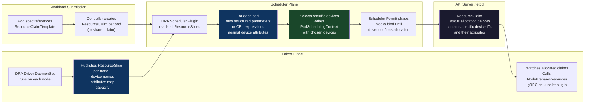
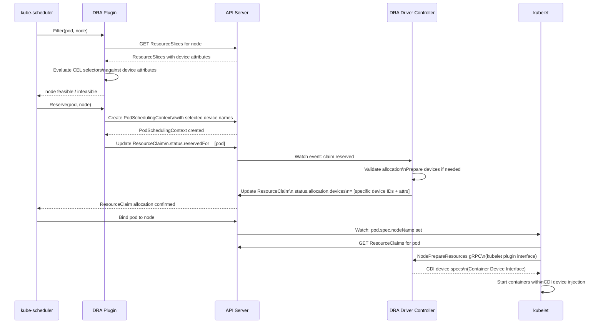
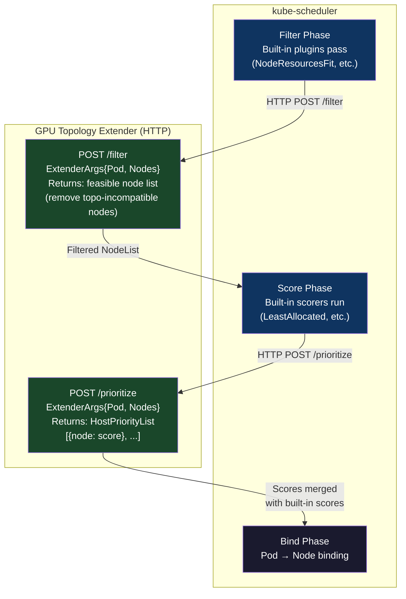

# CH-31: Custom Schedulers and DRA — Dynamic Resource Allocation for Heterogeneous Hardware
### *The device plugin API counts GPUs. DRA understands that two GPUs on the same NVLink domain are a fundamentally different resource from two GPUs on different nodes.*

> **Part 5 of 9 · Cloud-Native Orchestration**

---

## The Cold Open

The ML infrastructure team at a mid-sized AI company has been staring at training throughput numbers that make no sense. Their 8-GPU training job should take roughly 4 hours based on GPU FLOP benchmarks. It's taking 11 hours. GPU utilization is 38%. The job is not data-bound — the data pipeline feeds faster than the model processes. The job is not memory-bound — no OOM events, plenty of VRAM headroom.

A senior engineer opens `nvidia-smi topo -m` on the node where the job landed and sees the topology matrix: GPUs 0-3 are one NVLink domain, GPUs 4-7 are a second NVLink domain. NVLink bandwidth within each group: 900 GB/s. Bandwidth crossing between the two groups: 32 GB/s — PCIe, not NVLink. The AllReduce operation that synchronizes gradients across all 8 GPUs crosses that PCIe boundary on every step. 900 GB/s becomes 32 GB/s. The communication phase that should take 40ms takes 1.1 seconds.

The cluster has five 8-GPU nodes. Two of them have all 8 GPUs connected via NVSwitch — a full 900 GB/s mesh across all 8. The other three have the split-PCIe topology. The job landed on one of the three slow nodes. Nobody made that happen deliberately — it was a coin flip.

The engineer looks at the pod spec. The resource request is clean: `nvidia.com/gpu: 8`. The scheduler sees an integer. It sees that several 8-GPU nodes have 8 free GPUs. It picks one. It doesn't know that "8 GPUs on node-a" and "8 GPUs on node-b" represent wildly different computational configurations. It cannot know. The Device Plugin API has no vocabulary for topology — it counts devices, full stop.

The fix, in the short term, is a node label: `nvlink-topology: full-mesh` on the two NVSwitch nodes, `nvlink-topology: split-pcie` on the three others, and a `nodeAffinity.requiredDuringScheduling` in the job spec. It works. But it is an out-of-band convention, manually maintained, fragile as the cluster scales, and entirely invisible to the scheduler's resource accounting. When the team adds 40 more nodes across three GPU generations, each with different interconnect topologies, this convention collapses under its own weight.

The conversation that followed in their Slack — "we need topology-aware device scheduling, not manual labels" — is the exact conversation the Kubernetes SIG-Scheduling had in 2021. Dynamic Resource Allocation is the answer that emerged from it. This chapter explains what it actually does, how it works at the API level, and what it takes to deploy it in production.

---

## The Uncomfortable Truth

The false belief is this: the Device Plugin API is a scheduling primitive. It is not. It is an inventory primitive masquerading as one.

The DPI model says: a node has `N` devices of type `X`. Pods request `k` devices of type `X`. The kubelet allocates `k` of the available `N` and injects them as environment variables and device mounts. The scheduler only sees the integer count — it knows a node has 8 GPUs and a pod wants 8 GPUs. It does not know which GPUs, how they are connected, whether they share memory, whether they are in the same PCIe root complex, or whether two of them can communicate at NVLink bandwidth.

This integer-counting model also has no concept of partial device sharing. A GPU is either allocated to a pod or it isn't. MIG — NVIDIA's Multi-Instance GPU — can slice one A100 into up to 7 isolated compute instances, each with dedicated memory. The DPI can expose MIG instances as separate countable resources, but you lose the ability to express "give me two MIG instances from the same physical GPU" or "give me one MIG-3g.40gb and one MIG-1g.10gb that are on the same physical card." Every topology requirement beyond raw count requires a workaround: node labels, custom webhook admission controllers, or scheduler extenders.

Dynamic Resource Allocation (KEP-3063, alpha in Kubernetes 1.26, stable in 1.32) abandons the integer-count model entirely. The scheduling primitive is a *claim* — a structured description of what a workload needs. The driver's response is a *specific allocation* — named devices with named attributes. The scheduler becomes topology-aware not by baking GPU knowledge into core scheduler code, but by letting drivers publish rich structured data about their devices and letting workloads express structured requirements against that data. The scheduler matches them.

The uncomfortable part: DRA requires you to stop thinking about resources as countable pools and start thinking about them as attributed graphs. Every piece of tooling, every operator, every job spec template in your cluster needs to evolve. The migration cost is real. The alternative is a permanently increasing pile of out-of-band topology workarounds.

---

## The Mental Model

Booking a hotel room versus reserving a restaurant table.

When you book a hotel room you specify: "2 beds, non-smoking, arriving Friday." The booking system assigns any room that matches those attributes. You don't know which room you're getting until you check in. The system doesn't care that room 402 and room 403 share a wall, or that room 501 has a Jacuzzi, or that rooms 210-220 were renovated last year. It counts available rooms matching your category and assigns one.

Reserving a restaurant table for 8 is different. You specify: "8 people, private dining room preferred, one wheelchair user so no stairs, we'll be celebrating — ideally by the window." The restaurant has a floor plan. It looks at your requirements against the physical layout of every table. It doesn't just count "8-person tables" — it checks adjacency, accessibility, sightlines, proximity to the kitchen. It assigns *this specific table in this specific location* based on your requirements against its map of available resources.

DRA is the restaurant reservation model. Drivers publish `ResourceSlices` — detailed floor plans of what each node actually has. Workloads submit `ResourceClaims` — structured requests with topology requirements, attribute filters, and quantity constraints. The scheduler matches claims against slices, considering the full attribute graph, and allocates *specific named devices* rather than an anonymous count.

The named label for this model is **the Topology Reservation Model**.

The critical difference: in the hotel model, the assignment is opaque. In the restaurant model, the assignment is a specific, named, inspectable record — you can look at your reservation and see "table 14, east window, ground floor." In DRA, after allocation, `kubectl get resourceclaim my-gpu-claim -o yaml` shows you exactly which GPUs were assigned, their NVLink domain, their PCIe bus IDs, their MIG configuration. Topology becomes first-class metadata, not an afterthought.

**Diagram 1: Device Plugin API (Count-Based) vs DRA (Claim-Based) Architecture**

```mermaid
flowchart TD
    subgraph dpi ["Device Plugin API (Legacy)"]
        DP1["Driver registers\nunix socket\n/var/lib/kubelet/device-plugins/"]
        DP2["ListAndWatch gRPC\nAdvertises: nvidia.com/gpu = 8\n(integer count only)"]
        DP3["Scheduler sees:\nnvidia.com/gpu: 8 available\nnvidia.com/gpu: 8 requested"]
        DP4["Kubelet calls Allocate()\nDriver selects GPUs\nReturns env vars + mounts"]
        DP5["Pod gets GPU 0,1,2,3,4,5,6,7\nTopology unknown to scheduler"]
        DP1 --> DP2 --> DP3 --> DP4 --> DP5
    end

    subgraph dra ["DRA (Dynamic Resource Allocation)"]
        DR1["Driver publishes\nResourceSlice per node\nwith full device attributes:\nNVLink domain, PCIe bus,\nMIG geometry, bandwidth"]
        DR2["Workload submits\nResourceClaim:\n'2 GPUs, same NVLink domain,\n≥ 80GB memory each'"]
        DR3["Scheduler DRA plugin\nmatches claim against slices\nusing CEL expressions\nfinds specific devices"]
        DR4["Driver controller\nfinalizes allocation\nPublishes specific device IDs\nin claim.status.allocation"]
        DR5["Pod gets named GPUs:\nGPU-0 (domain-0)\nGPU-1 (domain-0)\nTopology guaranteed"]
        DR1 --> DR2 --> DR3 --> DR4 --> DR5
    end

    style DP3 fill:#8b0000,color:#ffffff
    style DP5 fill:#8b0000,color:#ffffff
    style DR3 fill:#1a472a,color:#ffffff
    style DR5 fill:#1a472a,color:#ffffff
    style DR1 fill:#0f3460,color:#ffffff
    style DR2 fill:#0f3460,color:#ffffff
```



**Diagram 2: DRA Allocation Flow — From Claim to Bound Devices**



---

## The Dissection

### Stage 1 — The Naive Approach (Device Plugin API)

Every GPU scheduling deployment before DRA uses the Device Plugin API. Understanding its mechanics explains precisely why it fails for topology-aware workloads.

A DPI driver implements the `DevicePlugin` gRPC service. It registers by creating a Unix socket at `/var/lib/kubelet/device-plugins/<driver-name>.sock`. The kubelet discovers this socket, calls `GetDevicePluginOptions()`, then starts a long-running `ListAndWatch()` stream. The driver sends `ListAndWatchResponse` messages advertising available devices — each with a unique ID and a healthy/unhealthy status. Critically, the only information the kubelet passes to the scheduler is the count of healthy devices mapped to the resource name. Every device is equal.

When a pod requesting `nvidia.com/gpu: 2` is scheduled to a node, the kubelet calls `Allocate(AllocateRequest)` where `AllocateRequest` contains the device IDs the kubelet has chosen. The driver responds with environment variables, volume mounts, and annotations to inject into the pod's container. The scheduler itself never sees device IDs — it only ever sees the integer count.

The limitations compound as hardware complexity increases. No topology: the scheduler cannot prefer GPUs on the same NVSwitch domain. No sharing: one GPU maps to one pod; MIG requires a proliferation of custom resource names (`nvidia.com/mig-3g.40gb`, `nvidia.com/mig-1g.10gb`). No cross-device constraints: you cannot express "I need a GPU and an RDMA NIC on the same PCIe root complex." No preemption: if a high-priority pod needs 8 GPUs and 7 are free, the scheduler cannot preempt a low-priority pod using 1 GPU to free the 8th — it sees only a count deficit. No cross-node resources: a DPI device must reside on a single node; there is no way to model a shared NVMe storage fabric or an InfiniBand subnet as a schedulable resource.

### Stage 2 — Where It Breaks

The breaking point is AllReduce. In distributed training with NCCL, every gradient synchronization step is an AllReduce collective — all ranks send their local gradients, all ranks receive the global sum. NCCL picks its communication algorithm based on the actual topology it discovers at runtime via `ncclGetVersion()` and ring/tree topology detection. If ranks 0-3 are on GPUs 0-3 (NVLink domain A) and ranks 4-7 are on GPUs 4-7 (NVLink domain B), NCCL builds a ring that crosses the PCIe boundary twice per step. Bandwidth drops from 900 GB/s to 32 GB/s on the cross-domain hops.

The DPI scheduler placed the job on this node because it saw `nvidia.com/gpu: 8` available. It had no way to prefer the NVSwitch node. The job ran at 38% GPU utilization — 62% of GPU cycles waiting on gradient synchronization.

### Stage 3 — Why the Integer Model Cannot Fix This

Adding node labels is the common workaround, but it introduces drift. Labels must be maintained manually or by a separate labeling DaemonSet. When a GPU firmware reset changes a device's NVLink domain membership — which can happen after driver upgrades — the label becomes stale. The scheduler trusts the label. The job lands on the wrong topology.

The deeper issue is that the workaround bypasses the resource accounting model entirely. When you use `nodeAffinity` to pin a job to an NVSwitch node, you're making a scheduling decision that has no relationship to the resource inventory the scheduler maintains. Two jobs could request NVSwitch nodes simultaneously, both get scheduled to the same NVSwitch node (because `nodeAffinity` is not an exclusive claim — it's a preference filter), and neither gets NVSwitch performance.

### Stage 4 — The DRA Model (Correct Approach)

DRA defines four core API objects. These are in the `resource.k8s.io` API group.

**ResourceClass** defines a class of devices managed by a specific driver, with default claim parameters:

```yaml
apiVersion: resource.k8s.io/v1beta1
kind: ResourceClass
metadata:
  name: gpu.nvidia.com
spec:
  controllerName: gpu.resource.nvidia.com
  # Default structured parameters applied to claims using this class
  # (driver-specific configuration)
```

**ResourceSlice** is published by the DRA driver DaemonSet on each node. It describes the node's actual devices with full attribute maps. This is the "floor plan" — the driver's complete inventory:

```yaml
apiVersion: resource.k8s.io/v1beta1
kind: ResourceSlice
metadata:
  name: node-gpu-worker-01-nvidia
spec:
  driver: gpu.resource.nvidia.com
  pool:
    name: node-gpu-worker-01
    generation: 1
    resourceSliceCount: 1
  nodeName: gpu-worker-01
  devices:
    - name: gpu-0
      basic:
        attributes:
          nvlink-domain:
            string: "domain-0"
          pcie-bus-id:
            string: "0000:1a:00.0"
          memory-bytes:
            quantity: "80Gi"
          cuda-compute-capability:
            version: "8.0"
          mig-capable:
            bool: true
        capacity:
          memory: "80Gi"
    - name: gpu-1
      basic:
        attributes:
          nvlink-domain:
            string: "domain-0"
          pcie-bus-id:
            string: "0000:1b:00.0"
          memory-bytes:
            quantity: "80Gi"
          cuda-compute-capability:
            version: "8.0"
          mig-capable:
            bool: true
        capacity:
          memory: "80Gi"
    - name: gpu-4
      basic:
        attributes:
          nvlink-domain:
            string: "domain-1"
          pcie-bus-id:
            string: "0000:3a:00.0"
          memory-bytes:
            quantity: "80Gi"
          cuda-compute-capability:
            version: "8.0"
          mig-capable:
            bool: true
        capacity:
          memory: "80Gi"
    # ... gpu-5, gpu-6, gpu-7 in domain-1
    # ... gpu-2, gpu-3 in domain-0
```

**ResourceClaim** is submitted by a workload (or created from a template). It expresses structured requirements. The CEL selectors in `spec.devices.requests[].selectors` are evaluated against each device's attributes in the ResourceSlice:

```yaml
apiVersion: resource.k8s.io/v1beta1
kind: ResourceClaim
metadata:
  name: training-job-gpus
  namespace: ml-workloads
spec:
  devices:
    requests:
      - name: all-gpus
        deviceClassName: gpu.nvidia.com
        count: 8
        selectors:
          # Require all 8 GPUs to be in the same NVLink domain
          # The scheduler evaluates this CEL expression against each candidate
          # device's attributes. The "same domain" constraint is expressed via
          # the allocationMode: ExactCount combined with a group constraint.
          - cel:
              expression: >
                device.attributes["gpu.resource.nvidia.com/nvlink-domain"].string == "domain-0"
          - cel:
              expression: >
                device.attributes["gpu.resource.nvidia.com/memory-bytes"].quantity >= "79Gi"
    constraints:
      # All devices in request "all-gpus" must come from the same node
      - requests: ["all-gpus"]
        matchAttribute: "gpu.resource.nvidia.com/nvlink-domain"
```

This claim says: give me 8 GPUs from `gpu.nvidia.com`, all in domain-0, all with ≥79 GiB memory, all from the same node. The scheduler's DRA plugin reads all ResourceSlices across the cluster, evaluates the CEL expressions, and finds nodes where 8 matching devices exist. For the split-PCIe nodes — which have only 4 GPUs per NVLink domain — this claim *cannot be satisfied*. Those nodes are filtered out. The job lands on an NVSwitch node or waits for one to become available. The topology guarantee is enforced by the resource model, not by manual labels.

**ResourceClaimTemplate** generates per-pod claims from a template, used when each pod in a deployment or job needs its own isolated device set:

```yaml
apiVersion: resource.k8s.io/v1beta1
kind: ResourceClaimTemplate
metadata:
  name: single-gpu-template
  namespace: ml-workloads
spec:
  metadata:
    labels:
      workload-type: inference
  spec:
    devices:
      requests:
        - name: gpu
          deviceClassName: gpu.nvidia.com
          count: 1
          selectors:
            - cel:
                expression: >
                  device.attributes["gpu.resource.nvidia.com/cuda-compute-capability"].version >= "8.0"
```

A pod spec references this template in `spec.resourceClaims`:

```yaml
apiVersion: v1
kind: Pod
metadata:
  name: inference-worker-0
  namespace: ml-workloads
spec:
  resourceClaims:
    - name: gpu
      resourceClaimTemplateName: single-gpu-template
  containers:
    - name: inference
      image: nvcr.io/nvidia/tritonserver:24.08-py3
      resources:
        claims:
          - name: gpu
      env:
        - name: NVIDIA_VISIBLE_DEVICES
          value: "$(RESOURCE_GPU_0_DEVICE_ID)"
```

### Stage 5 — How the Scheduler Uses DRA Internally

The DRA scheduler plugin runs in the `Filter`, `Reserve`, and `Prebind` phases of the scheduling framework. During `Filter`, it checks whether a node's ResourceSlices contain enough devices to satisfy the pod's claims. During `Reserve`, it tentatively marks specific devices as reserved. During `Prebind`, it writes the `PodSchedulingContext` object, which signals to the DRA driver controller which devices have been chosen. The driver controller then calls its own allocation logic, updates the `ResourceClaim.status.allocation.devices` field, and signals completion. The scheduler releases the pod from `Prebind` and proceeds to `Bind`.

This two-phase protocol — scheduler picks devices, driver confirms — exists because some drivers need to perform out-of-band setup before the devices are usable (initializing fabric managers, setting up RDMA connections, configuring NVLink switch routing). The driver's confirmation step gives it a hook to do that work.

**Diagram 3: Scheduler Phase Integration for DRA**



### Stage 6 — The Scheduler Extender (Pre-DRA Production Reality)

Many production clusters — particularly those running Kubernetes 1.24-1.28 before DRA stabilized — use scheduler extenders for topology-aware GPU scheduling. The extender is an HTTP webhook the scheduler calls during `Filter` and `Score` phases. It's the right tool if you need topology awareness today but your GPU driver hasn't shipped DRA support.

The extender configuration goes into the `KubeSchedulerConfiguration`:

```yaml
apiVersion: kubescheduler.config.k8s.io/v1
kind: KubeSchedulerConfiguration
profiles:
  - schedulerName: default-scheduler
    plugins:
      filter:
        disabled:
          - name: NodeResourcesFit
extenders:
  - urlPrefix: "http://gpu-topology-extender.kube-system.svc.cluster.local:8080"
    filterVerb: "filter"
    prioritizeVerb: "prioritize"
    weight: 10
    enableHTTPS: false
    nodeCacheCapable: false
    managedResources:
      - name: nvidia.com/gpu
        ignoredByScheduler: false
```

A minimal Go extender that scores nodes by NVLink topology, reading from node labels:

```go
package main

import (
	"encoding/json"
	"fmt"
	"log"
	"net/http"
	"os"

	corev1 "k8s.io/api/core/v1"
	extenderv1 "k8s.io/kube-scheduler/extender/v1"
)

const (
	nvlinkTopologyLabel  = "nvidia.com/nvlink-topology"
	nvlinkFullMesh       = "full-nvswitch"
	nvlinkSplitPCIe      = "split-pcie"
	nvlinkFullMeshScore  = 100
	nvlinkSplitPCIeScore = 10
)

type GPUTopologyExtender struct {
	logger *log.Logger
}

// prioritize scores nodes based on NVLink topology for GPU workloads.
// Nodes with full NVSwitch mesh receive score 100.
// Nodes with split PCIe topology receive score 10.
// Nodes without the topology label receive score 50 (neutral).
func (e *GPUTopologyExtender) prioritize(w http.ResponseWriter, r *http.Request) {
	var args extenderv1.ExtenderArgs
	if err := json.NewDecoder(r.Body).Decode(&args); err != nil {
		http.Error(w, fmt.Sprintf("decode error: %v", err), http.StatusBadRequest)
		return
	}

	// Only apply topology scoring if the pod requests GPUs.
	gpuRequest := getGPURequest(args.Pod)
	if gpuRequest == 0 {
		e.writeNeutralScores(w, args.Nodes)
		return
	}

	hostPriorityList := make(extenderv1.HostPriorityList, 0, len(args.Nodes.Items))
	for _, node := range args.Nodes.Items {
		score := e.scoreNode(node, gpuRequest)
		hostPriorityList = append(hostPriorityList, extenderv1.HostPriority{
			Host:  node.Name,
			Score: score,
		})
		e.logger.Printf("node=%s topology=%s gpuRequest=%d score=%d",
			node.Name,
			node.Labels[nvlinkTopologyLabel],
			gpuRequest,
			score,
		)
	}

	w.Header().Set("Content-Type", "application/json")
	if err := json.NewEncoder(w).Encode(hostPriorityList); err != nil {
		e.logger.Printf("encode error: %v", err)
	}
}

func (e *GPUTopologyExtender) scoreNode(node corev1.Node, gpuRequest int64) int64 {
	topology, ok := node.Labels[nvlinkTopologyLabel]
	if !ok {
		return 50 // neutral: no topology information
	}

	switch topology {
	case nvlinkFullMesh:
		// Full NVSwitch: all GPUs have equal bandwidth to all others.
		// Ideal for any multi-GPU job.
		return nvlinkFullMeshScore
	case nvlinkSplitPCIe:
		// Split PCIe: inter-domain communication is PCIe-limited.
		// Penalize heavily for jobs requesting more than half the node's GPUs.
		if gpuRequest > 4 {
			return 1 // worst case: job will definitely cross PCIe boundary
		}
		return nvlinkSplitPCIeScore
	default:
		return 50
	}
}

func getGPURequest(pod *corev1.Pod) int64 {
	var total int64
	for _, container := range pod.Spec.Containers {
		if qty, ok := container.Resources.Requests["nvidia.com/gpu"]; ok {
			total += qty.Value()
		}
	}
	return total
}

func (e *GPUTopologyExtender) writeNeutralScores(w http.ResponseWriter, nodes *corev1.NodeList) {
	hostPriorityList := make(extenderv1.HostPriorityList, 0, len(nodes.Items))
	for _, node := range nodes.Items {
		hostPriorityList = append(hostPriorityList, extenderv1.HostPriority{
			Host:  node.Name,
			Score: 50,
		})
	}
	w.Header().Set("Content-Type", "application/json")
	json.NewEncoder(w).Encode(hostPriorityList) //nolint:errcheck
}

func main() {
	logger := log.New(os.Stdout, "[gpu-topology-extender] ", log.LstdFlags)
	ext := &GPUTopologyExtender{logger: logger}

	mux := http.NewServeMux()
	mux.HandleFunc("/prioritize", ext.prioritize)
	mux.HandleFunc("/healthz", func(w http.ResponseWriter, r *http.Request) {
		w.WriteHeader(http.StatusOK)
	})

	logger.Println("GPU topology extender listening on :8080")
	if err := http.ListenAndServe(":8080", mux); err != nil {
		logger.Fatalf("server error: %v", err)
	}
}
```

**Diagram 4: Scheduler Extender Call Flow (Legacy)**



### Stage 7 — NVIDIA's DRA Driver: Structured Parameters in Practice

NVIDIA's DRA driver (part of the `k8s-dra-driver` repository) publishes ResourceSlices with NVLink domain membership, MIG geometry, and compute mode as structured parameters. A MIG-capable A100 node's ResourceSlice includes both whole-GPU entries and potential MIG instance entries. The driver's allocation logic can satisfy claims requesting MIG instances and ensure that two MIG instances from the same physical GPU are always allocated to the same pod (or rejected if that would cause an over-subscription).

For an H100 NVSwitch node, the driver publishes 8 GPU entries, each with `nvlink-domain` set to `"domain-0"` (because all 8 are in the same NVSwitch fabric). A training job requesting 8 GPUs with `matchAttribute: "gpu.resource.nvidia.com/nvlink-domain"` will satisfy on this node and fail to satisfy on any split-PCIe node — the CEL selector guarantees it.

### Stage 8 — Tradeoffs

DRA adds scheduler complexity. The DRA plugin must read and cache all ResourceSlices across the cluster — at 100 GPU nodes each with 8 GPU entries, that's 800+ objects the scheduler watches. CEL expression evaluation adds latency to the scheduling cycle. For clusters doing thousands of scheduling decisions per second (not common with GPU workloads, but relevant for CPU-intensive microservices), this overhead matters.

DRA also requires driver maturity. As of mid-2025, NVIDIA's DRA driver handles single-node GPU allocation reliably but MIG topology constraints in DRA are still evolving. AMD and Intel GPU drivers are at earlier stages of DRA support. For anything beyond NVIDIA A100/H100 with straightforward NVLink topology, test DRA in staging before depending on it in production.

The DPI → DRA migration path is not a flag flip. You must disable the DPI plugin, deploy the DRA driver, update all pod specs that reference `nvidia.com/gpu` to use `resourceClaims`, and update every operator (KubeFlow, Ray, Spark) to generate DRA-compatible specs. Running DPI and DRA simultaneously for the same device type is the direct cause of the War Room incident below.

---

## The War Room

### Double Allocation: The ResourceSlice Staleness Incident

In Q3 2024, a production ML cluster operated by a large technology company ran a mixed DPI/DRA configuration during a migration period. The stated goal was to migrate new training jobs to DRA while allowing legacy inference deployments to continue using DPI. The incident lasted 6 hours and required a full node reboot.

The cluster's GPU worker nodes had both the DPI device plugin (legacy) and the NVIDIA DRA driver running simultaneously. The cluster operators believed this was safe because the DRA driver was configured to manage only GPUs 0-3 on each 8-GPU node, while DPI managed GPUs 4-7. This split was expressed through device naming conventions — the DRA driver only published ResourceSlice entries for `gpu-0` through `gpu-3`, and the DPI advertised `nvidia.com/gpu: 4` per node (GPUs 4-7).

A GPU firmware update was rolled out to `gpu-worker-07` at 14:23. The update reset all 8 GPUs. After the reset, the DRA driver's DaemonSet restarted and re-published the ResourceSlice. Due to a race condition in the driver's re-initialization path, the ResourceSlice was published with a stale generation counter — the `spec.pool.generation` field was not incremented, so the API server did not invalidate cached claim allocations that referenced the pre-reset ResourceSlice.

A new training job submitted at 14:31 was allocated via DRA to `gpu-0` and `gpu-1` on `gpu-worker-07`. The ResourceClaim status showed `allocation.devices: [{name: gpu-0}, {name: gpu-1}]`. The scheduler released the pod. Meanwhile, a legacy inference pod that had been running since 13:45 via DPI held `gpu-0` through DPI's device assignment (the DPI's `Allocate()` had selected `gpu-0` among the 4 DPI-managed devices — the split was a naming convention, not an enforcement boundary in the kernel).

Both pods now had `gpu-0` injected via different mechanisms. The CUDA driver on the node accepted both contexts. The GPU state machine entered an undefined behavior path. At 14:34, the NVIDIA driver hung — `nvidia-smi` returned `No devices were found`. The kubelet lost contact with both pods' GPU resources.

```mermaid
gantt
    title GPU Worker-07 Incident Timeline (Q3 2024)
    dateFormat HH:mm
    axisFormat %H:%M

    section Legacy Inference Pod
    Inference pod running (DPI, GPU 0)      :done, inf1, 13:45, 14:34
    CUDA driver hang                         :crit, inf2, 14:34, 14:40
    Pod crash loop                           :crit, inf3, 14:40, 15:10

    section GPU Firmware Update
    Firmware update initiated               :done, fw1, 14:23, 14:28
    GPUs reset, DRA driver restarts         :done, fw2, 14:28, 14:31
    Stale ResourceSlice published           :crit, fw3, 14:31, 14:31

    section New Training Pod (DRA)
    ResourceClaim allocated (gpu-0, gpu-1)  :done, tr1, 14:31, 14:33
    Pod starts, acquires GPU 0              :crit, tr2, 14:33, 14:34
    Double allocation detected (too late)   :crit, tr3, 14:34, 14:34
    Training pod crash                      :crit, tr4, 14:34, 14:40

    section Incident Response
    On-call paged                           :active, ir1, 14:36, 14:45
    DRA driver investigated                 :active, ir2, 14:45, 15:30
    Root cause identified                   :active, ir3, 15:30, 16:00
    DPI disabled, DRA restart               :active, ir4, 16:00, 16:15
    Node drained and rebooted               :active, ir5, 16:15, 17:10
    Node restored, workloads rescheduled    :active, ir6, 17:10, 20:30
```



**Root Cause Analysis:**

Two compounding failures. First, running DPI and DRA for the same physical devices simultaneously has no safety enforcement at the kernel level — both subsystems can inject the same device into different containers. The "split" between DPI and DRA was entirely advisory, not enforced. Second, the DRA driver's ResourceSlice staleness after a device reset allowed claim allocations based on pre-reset device state. The `spec.pool.generation` counter exists specifically to invalidate stale caches — the driver's bug bypassed it.

**The Fix:**

Disable DPI completely before enabling DRA for any device type on a node. The `DevicePlugin` feature gate and the DRA feature gate are not mutually exclusive — you must ensure no DPI driver serves the same device type as the DRA driver. This is enforced via a MutatingWebhook that rejects pods with both `nvidia.com/gpu` resource requests and `resourceClaims` for `gpu.nvidia.com`.

```yaml
# ResourceSlice update interval — set this in the driver DaemonSet env
env:
  - name: NVIDIA_DRA_RESOURCE_SLICE_SYNC_INTERVAL
    value: "15s"   # Was default 60s; reduce to limit staleness window
  - name: NVIDIA_DRA_POOL_GENERATION_ON_RESET
    value: "true"  # Explicitly increment pool.generation on any device reset
```

The `spec.pool.generation` staleness window defines the maximum time between a device state change and a ResourceSlice update. Set it to the tolerable double-allocation window — at 15 seconds, a firmware reset will leave a 15-second window where stale allocations are possible. At 5 seconds, the scheduler's watch latency from the API server becomes the binding constraint. The practical minimum is 10-15 seconds.

Monitoring: add an alert on `kubelet_resource_claims_allocated_total` diverging from `nvidia_smi_gpu_process_count_total`. If allocated claims exceed actual GPU processes, a stale allocation exists.

---

## The Lab

### Exercise: DRA with the Mock Driver on kind

This exercise runs the `dra-example-driver` — the Kubernetes SIG reference implementation — to demonstrate topology-aware scheduling without requiring real GPUs. The mock driver publishes fake devices with configurable topology attributes.

**Prerequisites:** `kind` v0.20+, `kubectl` 1.32+, `helm` v3.

**Step 1: Create a kind cluster with DRA feature gates enabled.**

```bash
cat <<EOF | kind create cluster --name dra-lab --config=-
kind: Cluster
apiVersion: kind.x-k8s.io/v1alpha4
featureGates:
  DynamicResourceAllocation: true
  DRAResourceClaimDeviceStatus: true
nodes:
  - role: control-plane
  - role: worker
    labels:
      node-role: gpu-worker
  - role: worker
    labels:
      node-role: gpu-worker
runtimeConfig:
  resource.k8s.io/v1beta1: "true"
EOF
```

**Step 2: Install the example DRA driver.**

```bash
helm install \
  --namespace dra-example-driver \
  --create-namespace \
  --repo https://kubernetes-sigs.github.io/dra-example-driver \
  dra-example-driver \
  dra-example-driver \
  --set kubeletPlugin.image.tag=v0.1.0
```

**Step 3: Verify the driver published ResourceSlices.**

```bash
kubectl get resourceslices -o wide
```

Expected output:
```
NAME                              DRIVER                        POOL              NODE       AGE
kind-worker-dra-example-driver    dra.example.com               kind-worker        kind-worker  30s
kind-worker2-dra-example-driver   dra.example.com               kind-worker2       kind-worker2 30s
```

**Step 4: Inspect a ResourceSlice to see device attributes.**

```bash
kubectl get resourceslice kind-worker-dra-example-driver -o jsonpath='{.spec.devices}' | jq .
```

Expected output (mock driver publishes 4 fake "GPUs" per node with topology attributes):
```json
[
  {
    "name": "gpu-0",
    "basic": {
      "attributes": {
        "dra.example.com/model": {"string": "FAKE-GPU"},
        "dra.example.com/domain": {"string": "domain-0"},
        "dra.example.com/memory": {"quantity": "16Gi"}
      }
    }
  },
  {
    "name": "gpu-1",
    "basic": {
      "attributes": {
        "dra.example.com/model": {"string": "FAKE-GPU"},
        "dra.example.com/domain": {"string": "domain-0"},
        "dra.example.com/memory": {"quantity": "16Gi"}
      }
    }
  }
]
```

**Step 5: Create a ResourceClaim requesting devices from the same topology domain.**

```yaml
# topology-claim.yaml
apiVersion: resource.k8s.io/v1beta1
kind: ResourceClaim
metadata:
  name: same-domain-gpus
  namespace: default
spec:
  devices:
    requests:
      - name: gpus
        deviceClassName: dra.example.com
        count: 2
        selectors:
          - cel:
              expression: >
                device.attributes["dra.example.com/domain"].string == "domain-0"
    constraints:
      - requests: ["gpus"]
        matchAttribute: "dra.example.com/domain"
```

```bash
kubectl apply -f topology-claim.yaml

# Create a pod that uses the claim
kubectl apply -f - <<EOF
apiVersion: v1
kind: Pod
metadata:
  name: topology-test
spec:
  resourceClaims:
    - name: gpus
      resourceClaimName: same-domain-gpus
  containers:
    - name: test
      image: busybox
      command: ["sh", "-c", "sleep 3600"]
      resources:
        claims:
          - name: gpus
EOF
```

**Step 6: Verify the allocation shows specific named devices.**

```bash
kubectl get resourceclaim same-domain-gpus -o jsonpath='{.status.allocation.devices}' | jq .
```

Expected output:
```json
{
  "results": [
    {
      "request": "gpus",
      "driver": "dra.example.com",
      "pool": "kind-worker",
      "device": "gpu-0"
    },
    {
      "request": "gpus",
      "driver": "dra.example.com",
      "pool": "kind-worker",
      "device": "gpu-1"
    }
  ]
}
```

Both devices are `gpu-0` and `gpu-1` — both in `domain-0`. The scheduler enforced the topology constraint. If you had only requested 1 device, you might get `gpu-2` or `gpu-3` (if they're `domain-1`), but with the domain-0 selector, only `gpu-0` and `gpu-1` are candidates.

**Step 7: Clean up and try a failing claim to observe scheduling rejection.**

Create a claim requesting 4 devices from `domain-0`, but the mock driver only has 2 per node in that domain. Observe the pod going `Pending` with event `0/2 nodes are available: 2 ResourceClaim "all-domain-0-gpus" cannot be allocated`.

**Stretch Goal:** Modify the mock driver's ConfigMap to publish different topology attributes on the two worker nodes — make `kind-worker` have 4 devices in `domain-0` and `kind-worker2` have 2 in `domain-0` and 2 in `domain-1`. Submit a claim for 4 `domain-0` devices and observe that it schedules exclusively to `kind-worker`. This simulates the NVSwitch vs split-PCIe scenario from the Cold Open.

---

## The Loose Thread

Solving the *where* problem — placing a pod on a node whose hardware topology matches the workload's requirements — does not solve the *when* problem.

A 256-GPU training job submitting as 256 individual pods each with DRA claims will have its claims satisfied one at a time. The scheduler will allocate GPU resources to pods as fast as it can place them. The first 200 pods will start acquiring their GPUs and waiting at the MPI barrier. The last 56 will be Pending — either because the cluster is fragmented, or because competing workloads grabbed capacity while the job was being placed. The 200 running pods will wait until barrier timeout and crash. The scheduler placed each pod correctly in terms of topology. It failed to place all pods *atomically*.

DRA solves topology. It does not solve gang semantics: the all-or-nothing guarantee that a distributed job either gets all of its resources simultaneously or gets none of them. Without that guarantee, topology-correct placement is irrelevant — the job still deadlocks.

Chapter 32 is about that guarantee. Gang scheduling: the mechanism by which Kubernetes can treat 256 pods as a single atomic scheduling unit, either releasing all of them when capacity exists for all, or holding all of them until it does.

---

*Next: CH-32 — Gang Scheduling and Coscheduling: Getting 256 GPUs to Atomically Start*
