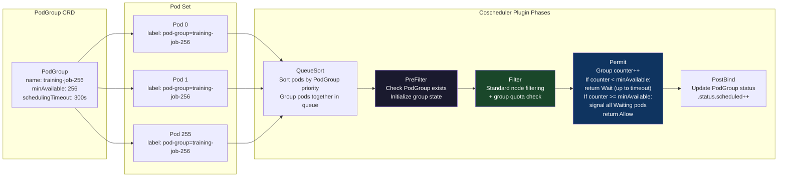
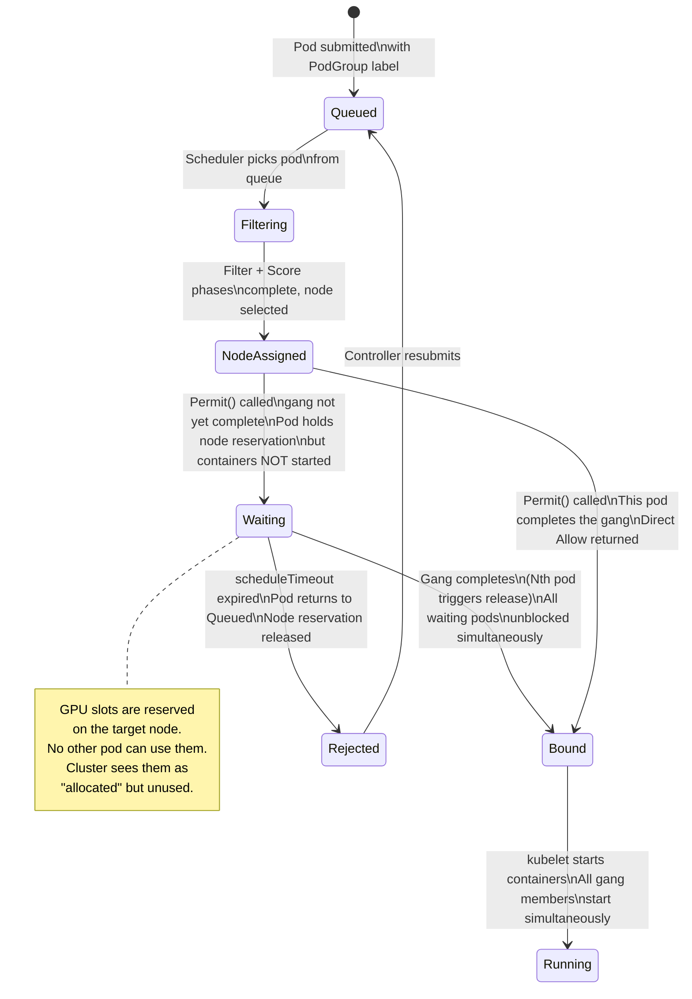
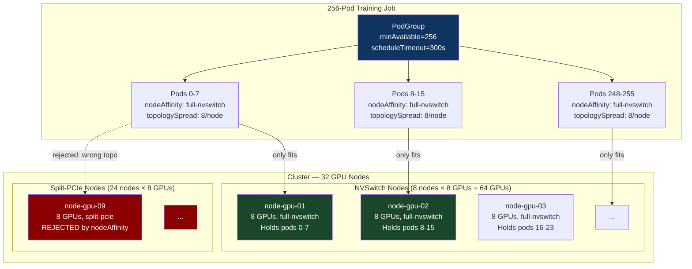

# CH-32: Gang Scheduling and Coscheduling — Getting 256 GPUs to Atomically Start
### *A distributed training job that starts with 200 of its 256 pods running is not 78% complete. It is 0% operational and 100% wasteful.*

> **Part 5 of 9 · Cloud-Native Orchestration**

---

## The Cold Open

At 09:12 on a Tuesday, a senior ML infrastructure engineer watches a 256-GPU training run fail for the fourth time in three days. The cluster has the capacity. She can see it: `kubectl describe nodes` shows roughly 280 GPU slots free across 35 GPU nodes. The job requests exactly 256. Math works. The job should run.

The scheduler starts placing pods. It fills the first node — 8 pods, 8 GPUs. Then the second. Then the third. By 09:14, 187 pods are Running. Each one has acquired its GPUs. Each one has initialized its NCCL communicator and is executing the first AllReduce step — which requires all 256 ranks to be present for the collective to complete. The 187 running pods park at the barrier. They wait.

The remaining 69 pods are Pending. The cluster is now fragmented — those 187 pods occupy portions of 24 nodes. The remaining free slots are spread across those 24 nodes and 11 additional nodes, but no single contiguous allocation of 69 pods fits into a clean set of nodes that would allow the job to proceed. The scheduler is still trying, pod by pod, but two competing batch jobs submitted at 09:13 are also being scheduled, and their pods are grabbing the remaining free slots.

At 09:59, the 187 running pods hit the MPI barrier timeout — 45 minutes, configured in the training framework. They crash. The GPU slots are released. For approximately 3 seconds, the cluster has 256 free GPU slots simultaneously. The job controller sees the failure and resubmits all 256 pods. The scheduler starts placing them again.

At 10:01, 201 pods are Running. 55 are Pending. The cycle repeats.

The pattern is called a *gang scheduling livelock*. The job is neither making progress nor cleanly failing. It is oscillating: acquire partial capacity, timeout at the barrier, release, reacquire partial capacity, timeout again. Each cycle burns GPU-hours — the 187 pods that started consumed full GPU power for 45 minutes doing nothing except waiting at a barrier. In one day of three such cycles, the company burned roughly 400 GPU-hours at zero utilization.

The engineer's immediate fix is brutal: drain the cluster of all other batch workloads, freeing 280+ GPU slots, then submit the 256-pod job into a temporarily empty cluster. It works. The job starts in 90 seconds. But draining a shared cluster to run a single job is not a platform — it's a workaround that doesn't scale past two training jobs competing for the same hardware.

The right fix is gang scheduling. The scheduler needs to know that these 256 pods are a *group*: schedule all 256 atomically, or schedule none and wait. The capacity requirement is all-or-nothing, not a greedy fill.

That guarantee requires a fundamental change to how the scheduler approaches pod groups. Default Kubernetes has no such primitive. Everything that follows is the set of tools engineers built to add it.

---

## The Uncomfortable Truth

The false belief: Kubernetes resource requests are a form of atomic resource reservation — if a pod requests resources and they exist, the pod will eventually run without being blocked by other pods getting in the way.

The reality is the opposite. The scheduler places pods one at a time, as fast as it can, against the current state of the cluster. There is no transaction boundary around a group of pods. There is no mechanism to say "hold the following 256 capacity slots reserved until all 256 pods can be placed simultaneously." Once a pod is scheduled, its resources are committed. Once those resources are committed, they are unavailable to other workloads — including the other 255 pods in the same job. If those other 255 pods cannot be placed because capacity was consumed by competing workloads (or by the first 187 pods in the same job), they wait indefinitely.

This means the standard Kubernetes scheduler has a structural incompatibility with MPI/NCCL distributed training. AllReduce collectives require all ranks present. The scheduler places ranks one at a time. These two requirements are irreconcilable without an additional coordination layer.

The workaround — over-provision the cluster to ensure there's always free capacity for any gang — trades capital expenditure for scheduling correctness. At 256 GPUs per job and multiple concurrent jobs, over-provisioning enough to guarantee gang scheduling succeeds requires approximately 2-3× excess capacity. At $2-3/GPU-hour, a 256-GPU training cluster running at 30-40% utilization to guarantee gang scheduling wastes $50,000-$100,000/month. That's not a budget line — it's a platform failure.

The technical solution is a scheduler extension that understands pod groups: hold all pods in a group in the `Waiting` state (after scheduling but before container start) until all pods in the group have been placed. If some pods cannot be placed within a timeout, release all held pods back to the unscheduled queue and wait for the cluster to have enough capacity for the full group. This is gang scheduling. It is available today via the Kubernetes coscheduler plugin and, more fully-featured, via Volcano and YuniKorn.

---

## The Mental Model

A group dinner reservation versus individual walk-ins.

A restaurant seats walk-ins as tables become available. Your party of 20 arrives over 30 minutes. The host seats the first 6 immediately. The next 8 are seated as tables free up over 20 minutes. The last 6 arrive to find the restaurant is full — two large parties took the remaining tables. Your group is now split: 14 people have been seated, ordered drinks, and are waiting. 6 are standing at the entrance. The dinner cannot start. The 14 seated people cannot leave without losing their tables. The 6 standing cannot be seated. This is your deadlock.

A group reservation is different. You call ahead: "party of 20, Saturday at 7pm." The restaurant checks if it can accommodate 20 simultaneously. If it can, it holds those tables. If your group arrives and only 17 seats have been held (the restaurant miscounted), the reservation is extended — you wait in the bar as a group until all 20 seats are ready, then you're all seated at once. Nobody is stranded half-seated.

Gang scheduling is the group reservation protocol. The scheduler does not seat pods one by one. It holds each pod in a `Waiting` state after scheduling but before activation. When all pods in the gang have been successfully placed (all 256 have a node assignment), the entire group is released simultaneously and their containers start. If placement fails — not enough nodes, timeout exceeded — the entire group is released back to the unscheduled queue, freeing any partial placements.

The named label for this model is **the Group Reservation Protocol**.

The key property: atomicity. Either the entire group starts, or no part of the group starts. There is no intermediate state where part of the group is consuming resources while the rest is pending. This breaks the deadlock cycle.

**Diagram 1: Default Scheduler (Livelock) vs Gang Scheduling (Atomic All-or-Nothing)**

```mermaid
flowchart TD
    subgraph default ["Default Scheduler — Livelock Pattern"]
        D1["256 pods submitted"]
        D2["Scheduler places pods\none at a time, greedily"]
        D3["187 pods Running\n(hold 187 GPU slots)"]
        D4["69 pods Pending\n(cluster fragmented)"]
        D5["187 pods hit MPI barrier\nTimeout: 45 min\nAll 187 crash"]
        D6["256 GPU slots briefly free\nCycle repeats"]
        D1 --> D2 --> D3
        D3 --> D4
        D4 --> D5
        D5 --> D6
        D6 --> D2
    end

    subgraph gang ["Gang Scheduling — Atomic Start"]
        G1["256 pods submitted\nPodGroup: minAvailable=256"]
        G2["Scheduler finds node\nfor each pod"]
        G3["Each pod enters\nWaiting state\n(Permit plugin holds it)"]
        G4["Counter: 256/256 placed\nAll pods released\nsimultaneously"]
        G5["All 256 pods start\nNCCL AllReduce succeeds\nTraining proceeds"]
        G1 --> G2 --> G3 --> G4 --> G5
    end

    style D3 fill:#8b0000,color:#ffffff
    style D5 fill:#8b0000,color:#ffffff
    style D6 fill:#8b0000,color:#ffffff
    style G3 fill:#0f3460,color:#ffffff
    style G4 fill:#1a472a,color:#ffffff
    style G5 fill:#1a472a,color:#ffffff
```

**Diagram 2: Coscheduler PodGroup CRD and Permit Plugin Flow**



---

## The Dissection

### Stage 1 — Why Gang Scheduling Is Mandatory for Distributed Training

AllReduce is a collective operation: every process in the communicator calls `ncclAllReduce()`, contributing a local tensor and receiving the global sum. The operation does not complete on *any* rank until *all* ranks have called it. If rank 200 is running and has called `ncclAllReduce()`, it blocks. If rank 201 is Pending (its pod hasn't started), rank 200 waits indefinitely — until MPI's barrier timeout triggers and the communicator reports an error.

The NCCL error propagates as a fatal exception in PyTorch's distributed package. The training process on rank 200 exits with `NCCL error: unhandled cuda error`. The pod crashes. The `restartPolicy: OnFailure` triggers a restart. The restarted pod re-initializes its NCCL communicator, which requires connecting to all other ranks — which now may also be in various states of crashing and restarting. The job enters a crash-restart storm.

This is not a hypothetical edge case. Without gang scheduling, *any* large-scale distributed training job on a shared cluster will hit this failure mode at sufficient cluster load. The probability of hitting it scales with: number of pods in the job, number of competing workloads, cluster utilization percentage, and pod startup time variance.

The failure mode has a formal name in distributed systems literature: the *dining philosophers problem* variant where philosophers hold forks while waiting for other forks. Pods hold GPU resources while waiting for other pods to be scheduled. The more pods that have started and are holding resources, the more fragmented the remaining capacity, the harder it becomes for the remaining pods to be placed.

### Stage 2 — The PodGroup CRD and Coscheduler

The Kubernetes SIG-Scheduling coscheduler (github.com/kubernetes-sigs/scheduler-plugins) implements gang scheduling as a scheduler plugin. The core primitive is the `PodGroup` CRD:

```yaml
apiVersion: scheduling.sigs.k8s.io/v1alpha1
kind: PodGroup
metadata:
  name: training-256gpu
  namespace: ml-workloads
spec:
  scheduleTimeoutSeconds: 300   # Give up if gang can't be placed in 5 minutes
  minMember: 256                # All 256 must be placeable before any start
```

A training job's pods reference this PodGroup via a label:

```yaml
apiVersion: batch/v1
kind: Job
metadata:
  name: allreduce-training
  namespace: ml-workloads
spec:
  parallelism: 256
  completions: 256
  template:
    metadata:
      labels:
        scheduling.sigs.k8s.io/pod-group: training-256gpu
    spec:
      schedulerName: coscheduler   # Or: default-scheduler with coscheduler as plugin
      restartPolicy: OnFailure
      containers:
        - name: trainer
          image: nvcr.io/nvidia/pytorch:24.08-py3
          resources:
            limits:
              nvidia.com/gpu: "1"
          command: ["python", "train.py", "--nproc_per_node=1"]
```

The coscheduler plugin intercepts the `Permit` phase for every pod that has a PodGroup label. The `Permit` phase is the last gate before a pod transitions from "scheduled to a node" to "container start requested." The plugin holds each pod in `Wait` state at this gate. When the number of waiting (successfully node-placed) pods in the group reaches `minMember`, the plugin simultaneously releases all waiting pods.

### Stage 3 — The Permit Plugin Implementation

The gang scheduling logic lives in the coscheduler's `Permit()` function. The critical state is a per-group counter maintained in a thread-safe map. Here is a simplified but functionally accurate implementation of the core Permit logic, closely following the actual coscheduler source:

```go
package coscheduler

import (
	"context"
	"fmt"
	"sync"
	"time"

	corev1 "k8s.io/api/core/v1"
	"k8s.io/apimachinery/pkg/types"
	"k8s.io/kubernetes/pkg/scheduler/framework"
	schedv1alpha1 "sigs.k8s.io/scheduler-plugins/apis/scheduling/v1alpha1"
)

const (
	// WaitTime is how long a pod waits in Permit before being rejected
	// if its PodGroup hasn't reached minMember.
	WaitTime = 5 * time.Minute
)

// gangState tracks the scheduling state for one PodGroup.
type gangState struct {
	mu           sync.Mutex
	podGroupKey  types.NamespacedName
	minMember    int32
	scheduledCount int32
	// waitingPods holds the channel used to signal waiting pods.
	// When scheduledCount reaches minMember, all channels are closed.
	waitingPods  map[string]chan struct{}
}

func (gs *gangState) tryAddPod(podName string) (bool, chan struct{}) {
	gs.mu.Lock()
	defer gs.mu.Unlock()

	gs.scheduledCount++

	if gs.scheduledCount >= gs.minMember {
		// This pod is the last required member.
		// Signal all previously waiting pods by closing their channels.
		for waitingPodName, ch := range gs.waitingPods {
			close(ch)
			delete(gs.waitingPods, waitingPodName)
		}
		// This pod itself is allowed immediately.
		return true, nil
	}

	// Not enough members yet. This pod must wait.
	ch := make(chan struct{})
	gs.waitingPods[podName] = ch
	return false, ch
}

// Permit is called by the scheduling framework after a pod has been
// assigned to a node (after Filter and Score phases). It either:
// - Returns Allow immediately (gang is complete)
// - Returns Wait (gang not yet complete, pod holds its node assignment
//   but does not start until the gang completes)
// - Returns Unschedulable (timeout expired, gang failed to assemble)
func (cs *CoScheduler) Permit(
	ctx context.Context,
	state *framework.CycleState,
	pod *corev1.Pod,
	nodeName string,
) (*framework.Status, time.Duration) {
	pgKey, ok := getPodGroupKey(pod)
	if !ok {
		// Pod has no PodGroup — pass through immediately.
		return framework.NewStatus(framework.Success), 0
	}

	cs.mu.Lock()
	gs, exists := cs.gangStates[pgKey]
	if !exists {
		pg, err := cs.pgLister.PodGroups(pod.Namespace).Get(pgKey.Name)
		if err != nil {
			cs.mu.Unlock()
			return framework.AsStatus(fmt.Errorf("PodGroup %v not found: %w", pgKey, err)), 0
		}
		gs = &gangState{
			podGroupKey: pgKey,
			minMember:   pg.Spec.MinMember,
			waitingPods: make(map[string]chan struct{}),
		}
		cs.gangStates[pgKey] = gs
	}
	cs.mu.Unlock()

	allowed, waitCh := gs.tryAddPod(pod.Name)
	if allowed {
		return framework.NewStatus(framework.Success), 0
	}

	// Wait for either the gang to complete or the timeout to expire.
	timeout := WaitTime
	if pg, err := cs.pgLister.PodGroups(pod.Namespace).Get(pgKey.Name); err == nil {
		if pg.Spec.ScheduleTimeoutSeconds != nil {
			timeout = time.Duration(*pg.Spec.ScheduleTimeoutSeconds) * time.Second
		}
	}

	select {
	case <-waitCh:
		// Gang is complete. All waitingPods channels were closed by tryAddPod.
		return framework.NewStatus(framework.Success), 0
	case <-time.After(timeout):
		// Timeout: gang could not be assembled. Reject this pod.
		// The scheduling framework will un-reserve the node assignment,
		// freeing the capacity for other workloads.
		gs.mu.Lock()
		gs.scheduledCount--
		delete(gs.waitingPods, pod.Name)
		gs.mu.Unlock()
		return framework.NewStatus(
			framework.Unschedulable,
			fmt.Sprintf("gang %v timed out waiting for minMember=%d (have %d)",
				pgKey, gs.minMember, gs.scheduledCount),
		), 0
	case <-ctx.Done():
		return framework.AsStatus(ctx.Err()), 0
	}
}

func getPodGroupKey(pod *corev1.Pod) (types.NamespacedName, bool) {
	pgName, ok := pod.Labels["scheduling.sigs.k8s.io/pod-group"]
	if !ok {
		return types.NamespacedName{}, false
	}
	return types.NamespacedName{
		Namespace: pod.Namespace,
		Name:      pgName,
	}, true
}
```

The critical behavior: when the Nth pod (where N == `minMember`) calls `tryAddPod`, it closes all waiting channels. All pods blocked on `<-waitCh` unblock simultaneously. The scheduling framework sees all of them return `Success` and proceeds to bind all of them — issuing `pod.spec.nodeName` writes to the API server in rapid succession. From the cluster's perspective, all 256 pods transition from "scheduled, waiting" to "bound to node" in the same scheduler cycle window.

**Diagram 3: Gang Permit State Machine — Per-Pod State Transitions**



### Stage 4 — Volcano: Full Batch Scheduling

The coscheduler handles gang scheduling but nothing else. Production ML clusters at scale need more: job queues, fair-share resource allocation, preemption of low-priority gangs, and backfill. Volcano (volcano.sh) is a full batch scheduling system for Kubernetes that provides all of these as a cohesive unit.

Volcano replaces the default scheduler for batch workloads. It introduces its own Job CRD with multiple Task types — essential for MPI jobs where you need 1 launcher pod and N worker pods, all starting atomically:

```yaml
apiVersion: batch.volcano.sh/v1alpha1
kind: Job
metadata:
  name: pytorch-training
  namespace: ml-workloads
spec:
  minAvailable: 257          # 1 launcher + 256 workers
  schedulerName: volcano
  plugins:
    pytorch: []              # Volcano pytorch plugin: sets MASTER_ADDR etc.
    svc: []                  # Creates headless service for pod-to-pod DNS
    env: []                  # Injects rank, world-size env vars
  policies:
    - event: PodFailed
      action: RestartJob     # If any pod fails, restart the entire job
    - event: PodEvicted
      action: RestartJob
  queue: training-queue      # Submit to a queue with fair-share accounting
  tasks:
    - name: launcher
      replicas: 1
      template:
        spec:
          containers:
            - name: launcher
              image: horovod/horovod:latest
              command: ["horovodrun", "-np", "256", "-H", "localhost:256", "python", "train.py"]
              resources:
                limits:
                  nvidia.com/gpu: "1"
    - name: worker
      replicas: 256
      template:
        spec:
          containers:
            - name: worker
              image: horovod/horovod:latest
              command: ["python", "train.py"]
              resources:
                limits:
                  nvidia.com/gpu: "1"
```

Volcano's gang scheduling is stricter than the coscheduler's: it tracks `minAvailable` at the Job level, not just per PodGroup, and its preemption logic can evict lower-priority jobs *as a gang* — either all pods of the lower-priority job are evicted or none are. This prevents partial evictions that would leave the evicted job in a deadlocked partial state.

### Stage 5 — YuniKorn: Queue-Based Gang Scheduling

Apache YuniKorn (yunikorn.apache.org) takes a different architectural approach. Where Volcano builds a replacement scheduler, YuniKorn builds a resource queue management layer on top of the existing Kubernetes scheduler, injecting gang semantics through application grouping:

```yaml
# YuniKorn queue configuration (ConfigMap)
apiVersion: v1
kind: ConfigMap
metadata:
  name: yunikorn-configs
  namespace: yunikorn
data:
  queues.yaml: |
    partitions:
      - name: default
        queues:
          - name: root
            submitacl: '*'
            queues:
              - name: training
                capacity: "60%"            # 60% of cluster GPU capacity
                maxCapacity: "80%"         # Can burst to 80%
                properties:
                  application.sort.policy: fifo
              - name: inference
                capacity: "30%"
                maxCapacity: "50%"
                properties:
                  application.sort.policy: fair
              - name: experiments
                capacity: "10%"
                maxCapacity: "40%"
```

YuniKorn gang scheduling is expressed via annotations on pods:

```yaml
metadata:
  annotations:
    yunikorn.apache.org/app-id: "pytorch-job-001"
    yunikorn.apache.org/queue: "root.training"
    yunikorn.apache.org/task-group-name: "worker"
    yunikorn.apache.org/task-groups: |
      [{
        "name": "worker",
        "minMember": 256,
        "minResource": {"cpu": "4", "memory": "32Gi", "nvidia.com/gpu": "1"},
        "maxMember": 256,
        "nodeAffinityKey": ""
      }]
    yunikorn.apache.org/schedulingPolicyParameters: "placeholderTimeoutSeconds=300"
```

YuniKorn's approach to gang scheduling uses *placeholder pods* — it pre-creates low-priority placeholder pods to reserve capacity before the real pods are scheduled. When the real pods arrive, they displace the placeholders. This placeholder-based reservation guarantees that capacity for the full gang exists before the gang's actual pods start competing for it. The tradeoff: placeholder pods consume real resource accounting, so other workloads see the capacity as occupied even before the training job starts.

### Stage 6 — Topology-Aware Gang Scheduling

Combining gang scheduling with the DRA topology constraints from Chapter 31 is where production ML scheduling becomes genuinely complex. A 256-GPU job doesn't just need all 256 pods to start simultaneously — it needs pods 0-7 on node-0 (all in the same NVSwitch domain), pods 8-15 on node-1, and so on. The gang must start atomically *and* the topology constraints must be honored.

The coscheduler handles this through `PodGroup` + standard `podAffinity` and `podAntiAffinity` combined with node affinity:

```yaml
# Pod template for topology-aware gang
spec:
  schedulerName: coscheduler
  affinity:
    nodeAffinity:
      requiredDuringSchedulingIgnoredDuringExecution:
        nodeSelectorTerms:
          - matchExpressions:
              - key: nvidia.com/nvlink-topology
                operator: In
                values: ["full-nvswitch"]
    podAntiAffinity:
      requiredDuringSchedulingIgnoredDuringExecution:
        # No two worker pods from the same job on the same node
        # (each node has 8 GPUs, each pod gets 1 GPU,
        #  so 8 pods per node is exactly right — but we want
        #  pods spread evenly, not piled onto the first node)
        - labelSelector:
            matchLabels:
              app: training-worker
              job-name: pytorch-job-001
          topologyKey: kubernetes.io/hostname
          namespaces: ["ml-workloads"]
  topologySpreadConstraints:
    - maxSkew: 1
      topologyKey: kubernetes.io/hostname
      whenUnsatisfiable: DoNotSchedule
      labelSelector:
        matchLabels:
          app: training-worker
          job-name: pytorch-job-001
```

**Diagram 4: Topology-Aware Gang Scheduling — Placement Constraints**



### Stage 7 — The Packing vs Spreading Tension

Gang scheduling prefers *packing*: find N nodes that together have room for the whole gang. This conflicts with `topologySpreadConstraints` that want pods spread across availability zones for fault tolerance. For training jobs, you want spreading (one AZ outage shouldn't kill the job). But spreading means the gang is harder to assemble — you need capacity in multiple zones simultaneously, which is less likely than needing capacity in any single zone.

The resolution depends on the job's failure mode. A 256-GPU training job that loses a pod in one AZ loses the entire AllReduce communicator regardless — there is no graceful degradation. Spreading across AZs provides no benefit because any single pod failure terminates the job. Pack onto the fewest nodes in the fewest AZs, minimize inter-node communication latency, accept the risk that an AZ failure kills the job (which it would have anyway). For *inference* serving, spreading is critical. For *training*, it usually isn't.

### Stage 8 — Tradeoffs

The gang scheduling tax is real. When the coscheduler holds 200 pods in `Waiting` state while the last 56 are being placed, those 200 pods' nodes are reserved — no other workload can use the capacity those pods hold. If the gang times out and all 256 pods are released, the cluster just absorbed 45 minutes of wasted reservation. At high cluster utilization (>85%), this tax causes severe queuing: gangs spend most of their time waiting for simultaneous capacity to appear, which it rarely does because other gangs are also occupying partially-reserved slots.

The solution is *backfill scheduling*. While a gang is waiting for full capacity, the scheduler uses the remaining cluster capacity for short-running jobs that will complete before the gang's reservation timeout. This keeps utilization high while the gang waits. Volcano supports backfill natively via queue priority. The coscheduler alone does not — you need to combine it with priority classes and careful queue management.

At cluster utilization below 70%, gang scheduling works reliably. Between 70-85%, tuning `scheduleTimeoutSeconds` aggressively (longer timeouts accept more waste, shorter timeouts cause more failed gang attempts) becomes critical. Above 85%, gang scheduling requires explicit capacity management: dedicated namespaces with resource quotas, queue-based fair-share (Volcano/YuniKorn), or cluster autoscaling that provisions new nodes when a gang has been waiting beyond a threshold.

---

## The War Room

### The KubeFlow TFJob Operator Version Split (2021-2022)

In late 2021, a major technology company running KubeFlow for distributed TensorFlow training at scale documented a class of gang scheduling failures that persisted for several months. The root cause was an operator version mismatch that produced a cluster where some jobs were protected by gang scheduling and others weren't — and nobody could tell which was which without inspecting individual pod specs.

The cluster had been upgraded from KubeFlow 1.3 to KubeFlow 1.4 in stages, rolling out the new TFJob operator (which supported PodGroup annotations for the coscheduler) to some namespaces while leaving others on the 1.3 operator (which did not). The coscheduler was deployed cluster-wide. The intent was that any TFJob pod with a `scheduling.sigs.k8s.io/pod-group` label would be gang-scheduled, and any pod without it would be scheduled by the default path.

The failure mode appeared under high cluster load. A TFJob from a namespace running the new operator would create its PodGroup correctly and be gang-scheduled. A TFJob from a namespace running the old operator would create pods without PodGroup labels — the coscheduler passed them through immediately to the default path, placing pods greedily. When the cluster was above 80% utilization, the old-operator jobs would partially schedule and deadlock. But because the new-operator jobs were in `Waiting` state holding reserved capacity, they were effectively blocking capacity from both sides: their pods held nodes while waiting for the gang to complete, and the old-operator jobs held other nodes while deadlocked at MPI barriers.

```mermaid
gantt
    title KubeFlow TFJob Gang Scheduling Split Incident (Q4 2021)
    dateFormat YYYY-MM-DD HH:mm
    axisFormat %m/%d %H:%M

    section New Operator Jobs (Protected)
    Job A submitted (PodGroup, ns: ml-team-a)   :done, ja1, 2021-11-15 09:00, 2021-11-15 09:05
    Job A pods in Waiting state (256 pods)       :done, ja2, 2021-11-15 09:05, 2021-11-15 09:20
    Job A gang completes, starts training        :done, ja3, 2021-11-15 09:20, 2021-11-15 14:00
    Job A training completes                     :done, ja4, 2021-11-15 14:00, 2021-11-15 14:01

    section Old Operator Jobs (Unprotected)
    Job B submitted (no PodGroup, ns: ml-team-b) :done, jb1, 2021-11-15 09:10, 2021-11-15 09:12
    Job B partial schedule: 187/256 pods running :crit, jb2, 2021-11-15 09:12, 2021-11-15 09:55
    Job B MPI barrier timeout, all 187 crash     :crit, jb3, 2021-11-15 09:55, 2021-11-15 09:56
    Job B resubmits, partial schedule again      :crit, jb4, 2021-11-15 09:56, 2021-11-15 10:40
    Job B deadlock cycle 3                       :crit, jb5, 2021-11-15 10:40, 2021-11-15 11:25

    section Cluster Impact
    Cluster utilization 80-88%                   :active, ci1, 2021-11-15 09:00, 2021-11-15 12:00
    Job A Waiting pods block ~40 nodes           :crit, ci2, 2021-11-15 09:05, 2021-11-15 09:20
    Dead capacity (deadlocked old-op jobs)       :crit, ci3, 2021-11-15 09:12, 2021-11-15 11:25

    section Incident Response
    Alert: training jobs failing at high rate    :active, ir1, 2021-11-15 10:15, 2021-11-15 10:30
    Operator version split identified            :active, ir2, 2021-11-15 10:30, 2021-11-15 11:00
    Old-operator namespaces drained              :active, ir3, 2021-11-15 11:00, 2021-11-15 11:30
    Operator upgraded across all namespaces      :active, ir4, 2021-11-15 11:30, 2021-11-15 13:00
    Webhook deployed (reject no-PodGroup TFJobs) :active, ir5, 2021-11-15 13:00, 2021-11-15 13:30
    All jobs resubmitted, cluster stable         :active, ir6, 2021-11-15 13:30, 2021-11-15 14:30
```

**Root Cause and Fix:**

The fundamental issue was that gang scheduling correctness depends on *all* jobs in the cluster using gang scheduling consistently. A single unprotected job consuming partial capacity in a deadlock blocks capacity for gang-protected jobs waiting for their full complement. The cluster's effective utilization was calculated against total capacity, but a significant fraction of that capacity was "zombie capacity" — held by deadlocked pods that would never make progress.

The fix had three components:

First, enforce a single operator version cluster-wide. A PodDisruptionBudget webhook was added that rejected TFJob pod creation in any namespace where the TFJob operator was below 1.4.0, verified by a label injected by the operator itself.

Second, add an admission webhook that requires all TFJob pods to carry a `scheduling.sigs.k8s.io/pod-group` label. Any TFJob pod missing this label is rejected at admission with a clear error message: `TFJob pods must specify a PodGroup for gang scheduling. See migration guide.`

```go
// Admission webhook: require PodGroup label on TFJob pods
func (w *PodGroupWebhook) validatePod(pod *corev1.Pod) error {
	// Only enforce for TFJob-spawned pods (identified by owner reference)
	if !isTFJobPod(pod) {
		return nil
	}
	if _, ok := pod.Labels["scheduling.sigs.k8s.io/pod-group"]; !ok {
		return fmt.Errorf(
			"pod %s/%s is a TFJob pod but missing required label "+
				"scheduling.sigs.k8s.io/pod-group; "+
				"upgrade TFJob operator to ≥1.4.0 or add PodGroup manually",
			pod.Namespace, pod.Name,
		)
	}
	return nil
}
```

Third, add a cluster-level alert: if any pod in the `ml-*` namespace family has been in `Running` state for more than 20 minutes without any container process making forward progress (detected via GPU utilization metrics from DCGM exporter staying at <5% for 15+ minutes), fire a `TrainingJobPossibleDeadlock` alert. This catches deadlocked jobs before they hold capacity for the full barrier timeout duration.

---

## The Lab

### Exercise: Coscheduler Gang Behavior on kind

This exercise demonstrates the Permit plugin's hold-and-release behavior directly — you will watch pods transition through `Waiting` to `Running` as a group.

**Prerequisites:** `kind` v0.20+, `kubectl` 1.28+, `helm` v3.

**Step 1: Create a kind cluster and install the coscheduler.**

```bash
kind create cluster --name gang-lab

helm repo add scheduler-plugins \
  https://scheduler-plugins.sigs.k8s.io

helm install coscheduler scheduler-plugins/scheduler-plugins \
  --namespace scheduler-plugins \
  --create-namespace \
  --set scheduler.name=coscheduler \
  --set scheduler.replicaCount=1
```

**Step 2: Create a PodGroup requiring minAvailable=3.**

```bash
kubectl apply -f - <<EOF
apiVersion: scheduling.sigs.k8s.io/v1alpha1
kind: PodGroup
metadata:
  name: demo-gang
  namespace: default
spec:
  minMember: 3
  scheduleTimeoutSeconds: 60
EOF
```

**Step 3: Create 3 pods in the gang and observe the Waiting state.**

```bash
for i in 0 1 2; do
kubectl apply -f - <<EOF
apiVersion: v1
kind: Pod
metadata:
  name: gang-pod-$i
  namespace: default
  labels:
    scheduling.sigs.k8s.io/pod-group: demo-gang
spec:
  schedulerName: coscheduler
  containers:
    - name: worker
      image: busybox
      command: ["sh", "-c", "echo 'rank $i ready' && sleep 300"]
      resources:
        requests:
          cpu: "100m"
          memory: "64Mi"
EOF
done
```

Watch the pod states in a separate terminal:

```bash
watch -n1 kubectl get pods -l scheduling.sigs.k8s.io/pod-group=demo-gang
```

Expected behavior: pods 0 and 1 appear with status roughly `ContainerCreating` or a brief `Pending` then immediately jump — the coscheduler's Permit plugin places all three nearly atomically when the 3rd is found. In practice you will see all three go `Running` within 1-2 seconds of each other.

**Step 4: Verify PodGroup status shows all members scheduled.**

```bash
kubectl get podgroup demo-gang -o yaml
```

Expected output in `.status`:

```yaml
status:
  phase: Running
  scheduled: 3
  running: 3
  succeeded: 0
  failed: 0
```

**Step 5: Simulate a fragmented cluster — pre-fill nodes, then try a gang.**

```bash
# Fill the kind cluster with 2 "filler" pods that consume most CPU
kubectl apply -f - <<EOF
apiVersion: v1
kind: Pod
metadata:
  name: filler-0
spec:
  containers:
    - name: filler
      image: busybox
      command: ["sleep", "600"]
      resources:
        requests:
          cpu: "1500m"
          memory: "256Mi"
EOF
```

Then create a 3-pod gang where each pod requests 500m CPU (total 1500m, but the filler consumed most available capacity):

```bash
kubectl apply -f - <<EOF
apiVersion: scheduling.sigs.k8s.io/v1alpha1
kind: PodGroup
metadata:
  name: constrained-gang
spec:
  minMember: 3
  scheduleTimeoutSeconds: 30
EOF
```

Observe: the gang's pods go `Pending`, then at the 30-second timeout, return to `Unschedulable` with event: `Gang constrained-gang timed out waiting for minMember=3`.

**Step 6: Compare without PodGroup — individual pods start independently.**

```bash
for i in 0 1 2; do
kubectl apply -f - <<EOF
apiVersion: v1
kind: Pod
metadata:
  name: solo-pod-$i
spec:
  containers:
    - name: worker
      image: busybox
      command: ["sleep", "300"]
      resources:
        requests:
          cpu: "100m"
EOF
done
kubectl get pods -l app!=demo-gang --watch
```

Observe: the three solo pods start one at a time as the scheduler places them individually. There is no coordination — pod 0 starts immediately, pod 1 a few seconds later, pod 2 a few seconds after that. This is precisely the pattern that causes MPI barrier deadlocks at scale.

**Expected Terminal Output (gang lab run):**

```
$ kubectl get pods -l scheduling.sigs.k8s.io/pod-group=demo-gang
NAME         READY   STATUS    RESTARTS   AGE
gang-pod-0   0/1     Pending   0          2s
gang-pod-1   0/1     Pending   0          1s
gang-pod-2   0/1     Pending   0          0s

# ~3 seconds later (all three release simultaneously):
NAME         READY   STATUS    RESTARTS   AGE
gang-pod-0   1/1     Running   0          5s
gang-pod-1   1/1     Running   0          5s
gang-pod-2   1/1     Running   0          5s
```

**Stretch Goal:** Deploy Volcano on kind. Create a Volcano Job with `minAvailable: 3` and two task types (1 launcher, 2 workers). Observe how Volcano's scheduler handles the gang differently — it uses `PodGroup` under the hood but also sets up the headless service and environment variables for inter-pod communication. Compare the startup sequence with the coscheduler approach. Then delete one of the running worker pods mid-job and observe `RestartJob` policy: Volcano terminates the launcher and remaining worker, resubmits all three together as a new gang attempt.

---

## The Loose Thread

Gang scheduling solves the *atomicity* problem: all 256 pods start together or none start. DRA (Chapter 31) solves the *topology* problem: the right GPUs are assigned, not just the right count. Together, they give you a production-grade foundation for distributed training on Kubernetes.

But neither addresses what happens when the training pod itself is on shared infrastructure where another tenant's workload is a security threat. A pod running in a standard container namespace on a GPU node shares the Linux kernel with every other pod on that node. A compromised or malicious container can attempt kernel exploits, access `/proc` of sibling containers, or — in some GPU driver configurations — interfere with another container's GPU memory via DMA attacks on PCIe.

For most ML workloads on dedicated GPU nodes, this threat model is acceptable. For multi-tenant ML infrastructure — where you're running customer workloads on shared GPU hardware — it is not. The question becomes: how do you provide container-level isolation while maintaining the performance characteristics that make GPU training viable?

The answer is not namespaces and cgroups. It's hardware virtualization — specifically microVMs. Firecracker provides a KVM-based microVM that boots in 125ms, has a memory overhead of 5MB per VM, and exposes a virtio GPU interface that can pass PCIe devices through to the VM with near-native performance via VFIO.

Chapter 33 examines Kata Containers and Firecracker: the architecture of hardware-isolated containers, when to use them, the performance cost you actually pay, and how to deploy them on Kubernetes without changing your application code.

---

*Next: CH-33 — Kata Containers and Firecracker: Hardware-Isolated Containers Without the Performance Tax*
