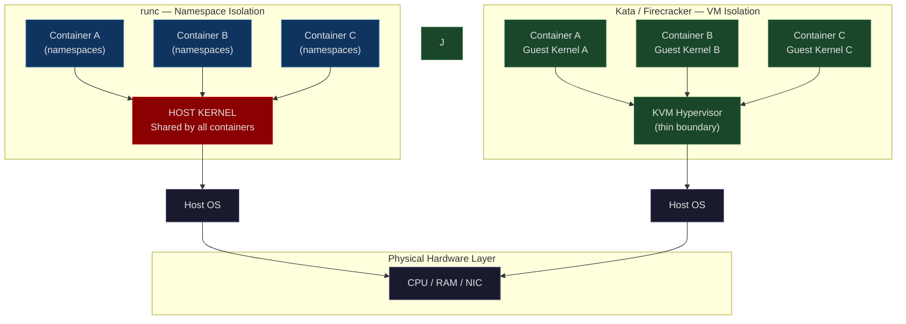
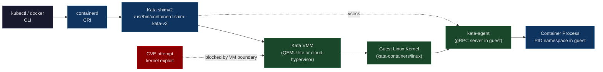
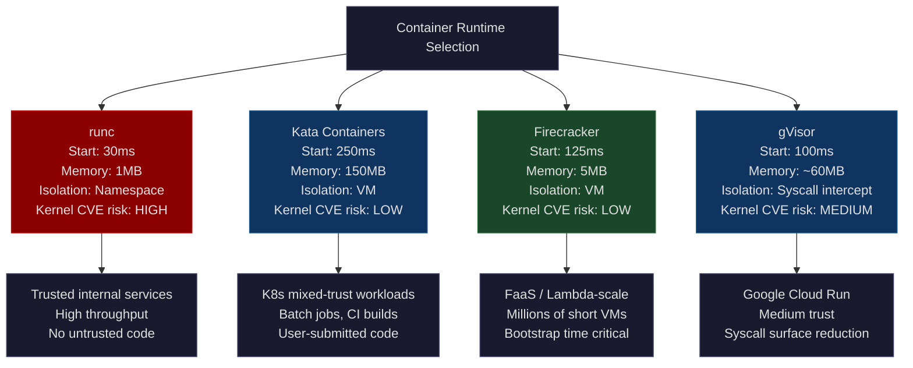

# CH-33: Kata Containers and Firecracker — Multi-Tenancy Without the VM Tax
### *Standard containers share the kernel. VMs don't share anything but the hardware. Kata and Firecracker live exactly in the gap: VM-level isolation at container-like startup time.*

> **Part 5 of 9 · Cloud-Native Orchestration**

---

## The Cold Open

In 2018, an AWS Lambda function invocation takes somewhere between 400 milliseconds and two seconds to start if the underlying execution environment needs a full cold boot. That number is a wall. Customer SLAs for Lambda require cold starts under 125ms — anything beyond that shows up in p99 latency measurements that customers submit as support tickets. The Lambda team is trapped between two requirements that appear mutually exclusive.

The standard virtual machine path (KVM with QEMU) delivers genuine hardware-level isolation. Each VM gets its own kernel, its own memory address space, and its own emulated hardware stack. A process inside one VM cannot touch memory in another VM; the hypervisor enforces the boundary at the hardware level. But QEMU brings 1.4 million lines of C to boot a simulated BIOS, enumerate a simulated PCI bus, initialize a simulated USB controller, set up legacy hardware emulation that dates to 1990s PC architecture — none of which a Lambda function needs. Booting that stack takes 400ms at best, two full seconds if the kernel has a slow initialization path. Lambda needs this to happen in 125ms.

The standard container path (runc with Linux namespaces and cgroups) starts in 5 to 50 milliseconds. The primitives are efficient: `clone()` with flags, `unshare()`, `setns()`, `cgroup` writes, an `execve()`. The OS already exists. No hardware emulation. No second kernel to initialize. Fast. But Lambda runs arbitrary customer code — code submitted by people whose threat model is "get out of the sandbox and reach AWS infrastructure or neighboring tenants." Namespaces prevent a process from *seeing* other tenants. They do not prevent a process from exploiting a kernel vulnerability to reach the host's address space, because the host kernel is shared. The Lambda threat model requires that a compromised function cannot reach AWS's infrastructure or another customer's function. runc cannot satisfy that requirement.

The Firecracker team's design insight is to find what a cloud hypervisor actually needs and delete everything else. A Lambda function needs CPU, memory, a network interface, and a block device. It needs nothing else. Firecracker strips the VMM to exactly those components: a KVM-based hypervisor, virtio-net, virtio-blk, virtio-vsock, and a stripped Linux kernel that skips PCI enumeration, USB initialization, and legacy hardware setup. The total VMM codebase: 50,000 lines of Rust. Memory overhead per microVM: 5 MB. Cold start time: 125ms. AWS ships Firecracker for Lambda in 2018 and for Fargate in 2019.

Kata Containers arrives at the same isolation guarantee from the other direction. Instead of building a new VMM, it replaces the OCI container runtime. When `containerd` calls a runtime to start a container, it expects an implementation of the OCI runtime specification — `create`, `start`, `kill`, `delete`. Kata implements that specification. When Kata receives a `create`, instead of calling `runc` to set up namespaces, it spawns a lightweight VM. The container's filesystem and process run inside the VM's guest OS. The OCI interface is unchanged. `docker run` works. `kubectl run` works. The pod manifest is unchanged. The only visible difference is which `RuntimeClass` a pod declares.

Then February 2019 arrives. CVE-2019-5736 is published. The vulnerability is precise and brutal: any container whose init process holds an open file descriptor to the host runc binary — a file descriptor that exists, transiently, during container creation — can overwrite the binary with arbitrary content via `/proc/self/exe`. At the next container creation on that host, the overwritten binary executes as root. Every runc-based Kubernetes cluster on a patched kernel is vulnerable. Google Cloud announces an emergency maintenance window. AWS scrambles. Kata Container deployments issue no emergency patches, because the attack surface does not exist inside a Kata VM. The runc binary is never present inside the guest. There is no `/proc/self/exe` path to the host runtime. The building is a different building.

Four years later, in February 2023, CVE-2023-0266 appears — an ALSA use-after-free in the Linux kernel that enables privilege escalation from inside a container. Kata deployments again issue no emergency patch: each container's guest kernel is an isolated attack surface. Exploiting the host kernel from inside a Kata container requires first escaping the VM, a separate and significantly harder class of vulnerability. The CVE that sends every runc-based team into emergency patching is a non-event for Kata operators.

The pattern is not accidental. It is the architectural consequence of where the isolation boundary lives.

---

## The Uncomfortable Truth

The false belief that most platform teams carry: container isolation — Linux namespaces plus cgroups — is sufficient for multi-tenant workloads, and the right mitigation for kernel CVEs is a fast patch cadence.

This belief is wrong for any threat model that includes adversarial or untrusted code. Network namespaces prevent a container from seeing another container's network stack. Mount namespaces prevent it from seeing another container's filesystem. PID namespaces prevent it from seeing another container's processes. None of these prevent a container from making arbitrary syscalls directly to the host kernel. The host kernel is shared. Every container on a host calls the same kernel functions — `read()`, `write()`, `mmap()`, `ioctl()`. A kernel vulnerability that can be triggered via a syscall available to unprivileged processes is triggerable from inside any container on any host running that kernel.

The CVE list is not short. CVE-2022-0185: a heap buffer overflow in `legacy_parse_param` reachable from an unprivileged user namespace — container escape. CVE-2021-3493: Ubuntu-specific overlayfs privilege escalation — root inside a container becomes root on the host. CVE-2019-5736: runc binary overwrite via `/proc/self/exe` — full host compromise at next container start. CVE-2016-5195 (Dirty COW): a race condition in copy-on-write memory handling, fully exploitable from inside a container, present in the kernel for nine years before discovery. These are not obscure edge cases. They are the standard background radiation of running a shared-kernel multi-tenant system.

The "patch faster" response treats each CVE as an independent event. The structural response recognizes that sharing a kernel with untrusted code is the category of risk. The correct architectural answer for CI/CD pipelines running arbitrary user-submitted builds, FaaS platforms executing customer functions, and Kubernetes clusters with mixed-trust workloads is to not expose the host kernel to untrusted workloads at all. That requires a hypervisor boundary between tenant and host kernel.

Kata Containers and Firecracker both provide that boundary. The operational cost is real — startup latency, memory overhead, network throughput reduction — but it is a known, bounded, measurable cost. The cost of a kernel CVE in a shared-kernel multi-tenant cluster is unbounded.

---

## The Mental Model

Consider the difference between three types of workspace arrangements.

A partitioned open-plan office has desks separated by low walls. Each employee has their own desk space. The partition prevents casual snooping — you cannot see your neighbor's screen at a glance. But the HVAC system is shared. The fire suppression system is shared. The electrical circuits are shared. If someone starts a chemical fire at their desk, the fire suppression system activates for the entire floor. If someone overloads a shared circuit breaker, multiple desks lose power. The partition prevents visual access. It does not prevent physical system contamination.

Separate offices in a shared building give each tenant a room with a door and a lock. Stronger isolation. But the building's infrastructure — load-bearing columns, water pipes, electrical mains, elevator shafts — runs through every office. A serious fire in one office can breach fire doors and spread through shared ventilation. A burst pipe floods multiple floors. The shared infrastructure is the shared kernel.

Separate buildings on the same street are physically independent. Each building has its own foundation, its own structural elements, its own internal systems. A fire in one building cannot physically propagate to another through structural elements; it would have to cross open air. The street is shared hardware — the physical CPUs, DRAM, and PCIe bus that all buildings sit on. But the building boundary is the hypervisor boundary.

The named label for this model is **The Building Isolation Model**.

runc is the partitioned office: namespace walls, shared kernel infrastructure. Kata Containers and Firecracker are separate buildings: each tenant gets a guest kernel and a VM boundary, sharing only the underlying hardware. gVisor is a reinforced office with a security guard at the door who inspects every request — it does not eliminate the shared kernel but adds an interception layer.

**Diagram 1: Isolation Boundary Comparison**



**Diagram 2: Kata Runtime Flow — OCI Spec Through VM to Container**



The vsock channel between the shim and the kata-agent is how container operations (exec, logs, stdin/stdout) cross the VM boundary without exposing a network interface. All communication is over virtio-vsock: the host shim sends gRPC calls through the vsock socket; the kata-agent inside the guest executes them against the container's processes.

---

## The Dissection

### Naive Approach: Treat Namespace Isolation as Sufficient

A standard Kubernetes deployment runs every pod through runc. Namespaces are configured, seccomp profiles applied, AppArmor or SELinux policies enforced. The security team declares the cluster hardened. This is the correct baseline for trusted workloads — internal microservices, controlled application code. It fails for untrusted workloads because the attack surface is the host kernel syscall interface, and no amount of policy can eliminate all exploitable kernel code paths.

### Where It Breaks

A container running an adversarial workload — a CI/CD build of untrusted code, a FaaS function from an external customer, a Jupyter notebook in a shared data science platform — has direct kernel access. Consider the exploit path for CVE-2022-0185:

1. The malicious process creates a user namespace inside the container (`unshare --user`).
2. Inside the user namespace, it calls `mount()` with a crafted argument that triggers `legacy_parse_param()`.
3. `legacy_parse_param()` has a heap buffer overflow reachable via this code path.
4. The overflow corrupts kernel memory, allowing the attacker to overwrite a function pointer.
5. The overwritten function pointer executes attacker-controlled shellcode at kernel privilege.
6. The container process is now effectively running as root on the host.

Steps 1–6 happen entirely within one container, using only standard syscalls that namespaces do not restrict. The cgroup limit didn't matter. The seccomp profile didn't catch it (the syscalls used are normal: `unshare`, `mount`). The kernel was vulnerable.

### Why It Breaks

Linux namespaces and cgroups are access control, not isolation. They restrict *what a process can see and use*, not *what code paths the kernel executes on its behalf*. When a container process calls `mount()`, the host kernel's `mount()` code executes in kernel space. If that code has a bug, the bug is reachable.

The VM boundary is a different kind of control. When a process inside a Kata container calls `mount()`, the guest kernel's `mount()` code executes inside the VM. The guest kernel is a separate kernel binary, isolated in guest physical memory. The host kernel's `mount()` never runs on behalf of the guest process. The guest kernel's `mount()` *would* run, and if it has a bug the guest is compromised — but the guest's memory is isolated from the host's memory by the hypervisor. The guest kernel cannot corrupt host kernel memory because they run in separate address spaces enforced by hardware (Intel VT-x or AMD-V page tables).

### Correct Approach: Firecracker Architecture

Firecracker is a VMM written in Rust, using Linux KVM as the hypervisor. Its design document explicitly names the attack surface reduction as the primary goal.

**Device model:** virtio-net (one or more), virtio-blk (root + optional data), virtio-vsock (host-guest communication), serial console, i8042 keyboard (for reboot). That is the complete device list. No USB. No BIOS. No ACPI tables beyond the minimal required to boot. No PCI bus. No PCIe. No graphics.

**The Jailer:** Firecracker processes run inside a Jailer — a seccomp-BPF + cgroup sandbox that limits the VMM process itself to a minimal syscall allowlist. The VMM that manages the VM is itself sandboxed. An attacker who escapes the guest VM reaches the Jailer's syscall filter before reaching the host.

**REST API for VM lifecycle:** Firecracker exposes a Unix socket with a REST API for VM creation, configuration, and management.

```bash
# Create a Firecracker VM via the API
# Step 1: Configure the machine
curl --unix-socket /tmp/firecracker.sock \
  -X PUT "http://localhost/machine-config" \
  -H "Content-Type: application/json" \
  -d '{
    "vcpu_count": 2,
    "mem_size_mib": 512,
    "smt": false
  }'

# Step 2: Attach root drive (pre-built ext4 rootfs)
curl --unix-socket /tmp/firecracker.sock \
  -X PUT "http://localhost/drives/rootfs" \
  -H "Content-Type: application/json" \
  -d '{
    "drive_id": "rootfs",
    "path_on_host": "/srv/images/ubuntu-22.04.ext4",
    "is_root_device": true,
    "is_read_only": false
  }'

# Step 3: Attach network interface (TAP device pre-created on host)
curl --unix-socket /tmp/firecracker.sock \
  -X PUT "http://localhost/network-interfaces/eth0" \
  -H "Content-Type: application/json" \
  -d '{
    "iface_id": "eth0",
    "guest_mac": "AA:FC:00:00:00:01",
    "host_dev_name": "tap0"
  }'

# Step 4: Point at the kernel binary and boot args
curl --unix-socket /tmp/firecracker.sock \
  -X PUT "http://localhost/boot-source" \
  -H "Content-Type: application/json" \
  -d '{
    "kernel_image_path": "/srv/kernels/vmlinux-5.10-fc",
    "boot_args": "console=ttyS0 reboot=k panic=1 pci=off"
  }'

# Step 5: Start the VM
curl --unix-socket /tmp/firecracker.sock \
  -X PUT "http://localhost/actions" \
  -H "Content-Type: application/json" \
  -d '{"action_type": "InstanceStart"}'
```

The `pci=off` boot argument is significant: it disables the PCI subsystem initialization entirely, cutting boot time by eliminating the PCI bus scan.

**Guest kernel configuration:** The Firecracker guest kernel is built from a stripped Linux config maintained by the Firecracker team. Key characteristics:

```
# Key kernel config options for Firecracker guest
CONFIG_KVM_GUEST=y               # paravirt hooks for KVM
CONFIG_VIRTIO=y                  # virtio bus
CONFIG_VIRTIO_NET=y              # virtio network
CONFIG_VIRTIO_BLK=y              # virtio block
CONFIG_VIRTIO_MMIO=y             # MMIO transport (no PCI)
CONFIG_VSOCKETS=y                # vsock support
CONFIG_VIRTIO_VSOCKETS=y         # virtio vsock
CONFIG_SERIAL_8250=y             # serial console
# Explicitly disabled
# CONFIG_PCI is not set
# CONFIG_USB_SUPPORT is not set
# CONFIG_ACPI is not set         # ACPI adds boot time
# CONFIG_DMI is not set
# CONFIG_SOUND is not set
```

The resulting kernel boots in ~100ms on a modern host. Combined with the ~25ms VMM initialization, total Firecracker microVM cold start is 125ms measured from API call to guest userspace.

### Correct Approach: Kata Containers Architecture

Kata Containers plugs into the containerd shim API (shimv2). When containerd creates a container, it calls the shim binary: `/usr/bin/containerd-shim-kata-v2`. This binary manages the VM lifecycle, communicates with the kata-agent inside the VM via virtio-vsock, and presents the standard shim interface back to containerd.

**Configuring containerd for Kata:**

```toml
# /etc/containerd/config.toml
version = 2

[plugins."io.containerd.grpc.v1.cri".containerd.runtimes.kata]
  runtime_type = "io.containerd.kata.v2"
  pod_annotations = ["io.katacontainers.*"]

[plugins."io.containerd.grpc.v1.cri".containerd.runtimes.kata.options]
  ConfigPath = "/opt/kata/share/defaults/kata-containers/configuration.toml"
```

**Kata configuration (`/opt/kata/share/defaults/kata-containers/configuration.toml`):**

```toml
[hypervisor.qemu]
path = "/opt/kata/bin/qemu-system-x86_64"
kernel = "/opt/kata/share/kata-containers/vmlinux.container"
image = "/opt/kata/share/kata-containers/kata-containers.img"
machine_type = "q35"
# Stripped device model
default_vcpus = 1
default_memory = 128

# Filesystem sharing: virtiofs is faster than 9p for container images
shared_fs = "virtio-fs"
virtio_fs_daemon = "/opt/kata/libexec/kata-qemu/virtiofsd"
virtio_fs_cache = "auto"
```

**Kubernetes RuntimeClass for Kata:**

```yaml
# kata-runtimeclass.yaml
apiVersion: node.k8s.io/v1
kind: RuntimeClass
metadata:
  name: kata
handler: kata
overhead:
  podFixed:
    memory: "160Mi"   # overhead of the Kata VM itself
    cpu: "250m"       # overhead of the VMM process
scheduling:
  nodeClassification:
    tolerations:
    - key: kata
      operator: Exists
      effect: NoSchedule
```

```yaml
# Pod using the Kata RuntimeClass
apiVersion: v1
kind: Pod
metadata:
  name: untrusted-build-job
spec:
  runtimeClassName: kata
  containers:
  - name: builder
    image: ubuntu:22.04
    command: ["/bin/bash", "-c", "make all"]
    resources:
      requests:
        memory: "512Mi"
        cpu: "1"
      limits:
        memory: "512Mi"
        cpu: "1"
```

The pod manifest is identical to a standard pod. The `runtimeClassName: kata` field routes the container through the Kata shim instead of runc. The application code sees no difference.

### Performance Tradeoffs

**Startup latency:**

| Runtime       | Cold Start | Notes |
|---------------|------------|-------|
| runc          | 30–50ms    | Namespace setup, OverlayFS mount |
| Kata (QEMU)   | 250–400ms  | VM init + kata-agent start |
| Kata (cloud-hypervisor) | 150–250ms | Lighter VMM |
| Firecracker   | 125–150ms  | Minimal VMM, stripped kernel |
| Full QEMU VM  | 400ms–2s   | Full hardware emulation |

**Memory overhead per container:**

| Runtime       | Overhead    | Notes |
|---------------|-------------|-------|
| runc          | ~1MB        | Kernel namespaces, cgroup entries |
| Kata          | 100–160MB   | Guest kernel + kata-agent + VMM |
| Firecracker   | 5–8MB       | Minimal VMM process |

**Network throughput (virtio-net overhead):**

virtio-net on Kata introduces a 2–5% throughput reduction versus direct OverlayFS + veth pairs in runc. The virtio-fs shared filesystem (used for container image layers) introduces 5–15% additional I/O latency versus OverlayFS directly. For most batch workloads, these numbers are acceptable. For latency-sensitive services processing millions of requests per second, they require benchmarking against the specific workload.

**Diagram 3: Kata vs runc vs Firecracker — Tradeoff Space**



### The Guest Kernel Independence Problem

Kata Containers runs a guest Linux kernel inside every container's VM. This kernel is separate from the host kernel — it is a stripped kernel binary maintained by the Kata project at `kata-containers/kata-containers/tools/packaging/kernel`. It must be updated independently of the host kernel.

A kernel CVE that affects the guest kernel still requires patching, but the patch is bounded: only the guest kernel binary on the Kata nodes needs updating, not the host kernel running all other workloads. The guest kernel cannot escape to the host kernel; the VM boundary holds. Patching the guest kernel requires no host reboot — just update the kernel path in Kata's configuration and restart affected pods.

The operational implication: running Kata adds a second kernel patch track. The host kernel track handles everything on the node; the guest kernel track handles Kata guest kernels. Most Kata operators pin to a specific guest kernel version in their configuration management and update it on the same cadence as the host kernel, treating it as a build artifact like a container image.

---

## The War Room

### CVE-2019-5736: The runc Binary Overwrite Incident

**Timeline: February 11–13, 2019**

On February 11, 2019 at 16:00 UTC, Adam Iwaniuk and Borys Popławski privately disclose CVE-2019-5736 to the runc maintainers. The vulnerability allows a malicious container to overwrite the host runc binary and execute arbitrary code with root privileges on the host at the next container creation.

The attack mechanism: during container creation, the runc process is temporarily accessible via `/proc/<runc-pid>/exe` from inside the container (because runc joins the container's namespaces during `runc start`). A malicious init process inside the container can open `/proc/self/exe` — which resolves to the runc binary on the host through the namespace join — and use it as a write target via `O_PATH` file descriptor tricks. Writing to this file descriptor overwrites the host's runc binary.

The impact is complete host takeover. Any container on the host can execute this attack. There is no privilege requirement beyond the ability to run a container — which is the definition of any multi-tenant Kubernetes cluster.

```mermaid
gantt
    title CVE-2019-5736 — Discovery to Patch Deployment
    dateFormat YYYY-MM-DD HH:mm
    axisFormat %m-%d %H:%M

    section Discovery
    Private disclosure to runc maintainers    :milestone, disc, 2019-02-11 16:00, 0m
    NCC Group independent analysis begins     :active, ncc, 2019-02-11 16:00, 48h

    section Coordinated Response
    Embargo window — patch development        :embargo, 2019-02-11 16:00, 72h
    Patch reviewed by security team           :patch_review, 2019-02-13 00:00, 16h
    Docker/containerd/runc release prep       :release_prep, 2019-02-13 08:00, 8h

    section Public Disclosure
    CVE published, patches released           :milestone, pub, 2019-02-13 16:00, 0m
    Google Cloud emergency maintenance start  :gcloud, 2019-02-13 16:00, 6h
    AWS patching begins                       :aws, 2019-02-13 18:00, 8h
    Azure patching begins                     :azure, 2019-02-13 20:00, 8h

    section Kata Impact Assessment
    Kata team confirms: not affected          :milestone, kata_ok, 2019-02-13 17:00, 0m
    Kata advisory issued: no action required  :kata_adv, 2019-02-13 17:00, 2h

    section Patch Propagation (runc clusters)
    Enterprise K8s cluster patching           :ent_patch, 2019-02-13 20:00, 72h
    Self-managed clusters — long tail         :selfmgd, 2019-02-14 00:00, 336h
```

**Why Kata was unaffected:** The attack requires the runc binary to be accessible from inside the container's namespace. In Kata's architecture, there is no runc binary involved in running the container. The containerd-shim-kata-v2 process manages the VM from outside the guest. Inside the guest VM, the kata-agent handles container lifecycle. The kata-agent is a static binary compiled into the guest image — it is not the runc binary. There is no mechanism by which a process inside the Kata guest can access the host's runc binary because the host filesystem is not visible inside the VM. The attack surface — the proc filesystem path to the host runc binary — does not exist.

**The shimv2 architecture change that made this permanent:** Before shimv2, Kata used a different architecture where a separate kata-proxy process communicated between containerd and the VM. The shimv2 architecture eliminated the proxy entirely: the shim binary runs on the host, manages the VM directly via QMP (QEMU Machine Protocol) or the cloud-hypervisor API, and communicates with the kata-agent via vsock. There is no shared namespace between the shim and the VM's processes. The shim runs at host privilege; the VM's processes run in guest privilege; the hypervisor boundary is between them. A container process cannot traverse this boundary via filesystem tricks because the filesystems are separate.

**What runc deployments had to do:** Every Kubernetes node running runc needed the runc binary replaced with a patched version. This required a node drain-and-update cycle on managed Kubernetes services (GKE, EKS, AKS — automated), and a manual update cycle on self-managed clusters. For clusters running containerd, the containerd update bundled the runc fix. For clusters using Docker as the container runtime (still common in 2019), the Docker update was required. Three days after public disclosure, major managed Kubernetes services were fully patched. Self-managed clusters trailed for weeks.

**Monitoring gap identified:** No standard Kubernetes cluster had alerting for "runc binary checksum mismatch on node." The attack was silent until the overwritten binary executed. Post-incident, several security-focused operators added node-level integrity monitoring that checksums the runc binary on a scheduled basis and alerts on changes. This is a compensating control. The architectural control is to not expose the runc binary to container processes — which is what Kata does by design.

---

## The Lab

### Verifying Kata Isolation Against runc on the Same Cluster

**Prerequisites:** A Linux host with KVM support (`egrep -c '(vmx|svm)' /proc/cpuinfo` returns > 0), containerd installed, Kata Containers installed.

**Step 1: Verify Kata installation**

```bash
# Check that Kata runtime is installed
kata-runtime check
# Expected output:
# System is capable of running Kata Containers
# System can currently create Kata Containers

# Check Kata configuration
kata-runtime kata-env | grep -A2 "Kernel"
# Expected:
#  Path = /opt/kata/share/kata-containers/vmlinux.container
#  Parameters = tsc=reliable no_timer_check rc.utsname=...
#  Version = 5.15.63
```

**Step 2: Apply the RuntimeClass**

```bash
kubectl apply -f - <<'EOF'
apiVersion: node.k8s.io/v1
kind: RuntimeClass
metadata:
  name: kata
handler: kata
overhead:
  podFixed:
    memory: "160Mi"
    cpu: "250m"
EOF
```

**Step 3: Run the isolation verification experiment**

```bash
# Pod 1: runc (default runtime)
kubectl run runc-test \
  --image=ubuntu:22.04 \
  --restart=Never \
  --rm -it \
  -- bash -c '
    echo "=== runc container: PID 1 identity ==="
    cat /proc/1/status | grep -E "^Name:|^Pid:"
    echo ""
    echo "=== Host kernel visible from runc container ==="
    uname -r
    echo ""
    echo "=== Init process name (should be host systemd) ==="
    cat /proc/1/cmdline | tr -d "\0"
    echo ""
  '
```

Expected output from the runc container:
```
=== runc container: PID 1 identity ===
Name:   systemd
Pid:    1

=== Host kernel visible from runc container ===
5.15.0-91-generic

=== Init process name (should be host systemd) ===
/sbin/init
```

The runc container's PID 1 is the host's `systemd`. The container can read the host init process's status file. The kernel version matches the host kernel.

```bash
# Pod 2: Kata runtime
kubectl run kata-test \
  --image=ubuntu:22.04 \
  --restart=Never \
  --rm -it \
  --overrides='{"spec":{"runtimeClassName":"kata"}}' \
  -- bash -c '
    echo "=== Kata container: PID 1 identity ==="
    cat /proc/1/status | grep -E "^Name:|^Pid:"
    echo ""
    echo "=== Guest kernel (different from host) ==="
    uname -r
    echo ""
    echo "=== Init process name (should be kata-agent) ==="
    cat /proc/1/cmdline | tr -d "\0"
    echo ""
    echo "=== Process count visible to container ==="
    ls /proc | grep -E "^[0-9]+" | wc -l
  '
```

Expected output from the Kata container:
```
=== Kata container: PID 1 identity ===
Name:   kata-agent
Pid:    1

=== Guest kernel (different from host) ===
5.15.63-kata

=== Init process name (should be kata-agent) ===
/opt/kata/bin/kata-agent

=== Process count visible to container ===
3
```

The Kata container's PID 1 is `kata-agent`, not the host `systemd`. The kernel version is `5.15.63-kata` — the Kata guest kernel, not the host kernel. Only 3 processes are visible (the kata-agent, the bash shell, and the `ls` command) — the host's hundreds of processes are completely invisible.

**Step 4: Measure startup time difference**

```bash
# Time runc container start
time kubectl run --rm -it runc-timing \
  --image=ubuntu:22.04 \
  --restart=Never \
  -- echo "started" 2>/dev/null

# Time Kata container start
time kubectl run --rm -it kata-timing \
  --image=ubuntu:22.04 \
  --restart=Never \
  --overrides='{"spec":{"runtimeClassName":"kata"}}' \
  -- echo "started" 2>/dev/null
```

Expected results:
```
# runc:
real    0m0.891s   # kubectl + API overhead + container start

# Kata:
real    0m3.247s   # kubectl + API overhead + VM boot + kata-agent init + container start
```

The Kata overhead is approximately 2.3 seconds above runc for a cold start. For batch jobs with runtimes measured in minutes or hours, this is less than 1% of total execution time.

**Step 5: Check memory overhead on the node**

```bash
# Run both containers simultaneously and check node memory
kubectl get --raw /api/v1/nodes/<node-name>/proxy/stats/summary | \
  python3 -m json.tool | \
  grep -A2 "runc-test\|kata-test" | \
  grep workingSetBytes
```

**Stretch Goal: Verify that a CVE-2019-5736-style proc path is not accessible from Kata**

```bash
# Inside a Kata container, verify the host containerd-shim PID is not visible
kubectl run kata-proc-check \
  --image=ubuntu:22.04 \
  --restart=Never \
  --rm -it \
  --overrides='{"spec":{"runtimeClassName":"kata"}}' \
  -- bash -c '
    echo "Total PIDs visible from inside Kata VM:"
    ls /proc | grep -cE "^[0-9]+"
    echo ""
    echo "Attempting to read shim process from /proc (should fail):"
    # The host shim process is typically PID 12000-20000 range
    # None of those PIDs should be visible inside the guest
    for pid in $(seq 10000 10010); do
      test -f /proc/$pid/status && echo "VISIBLE: /proc/$pid" || true
    done
    echo "No host PIDs accessible — VM boundary holds"
  '
```

---

## The Loose Thread

Every Kata container and every Firecracker microVM starts its existence the same way: a blank machine with no operating system, waiting for instructions about what it is supposed to become. Kata expects a pre-built guest kernel and root filesystem image to already exist at the path in its configuration file. Firecracker expects a pre-built vmlinux and a pre-built ext4 root filesystem. These images don't fall from the sky — they are built, stored, distributed, and deployed as part of the infrastructure layer.

Now scale that problem out. Forget containers for a moment. You are adding 3,000 bare metal GPU servers to a production Kubernetes cluster. Each one is a blank machine with no operating system. Each one needs to boot, install an OS, configure kernel parameters (`isolcpus`, hugepages, RDMA drivers — everything from the earlier chapters), install containerd and kubelet, and join the cluster. You have no KVM console on any of them. You have no physical access after the rack-and-cable step.

Chapter 34 is about the infrastructure layer that makes blank machines become cluster nodes without a human in the loop.

---
*End of Chapter 33*
