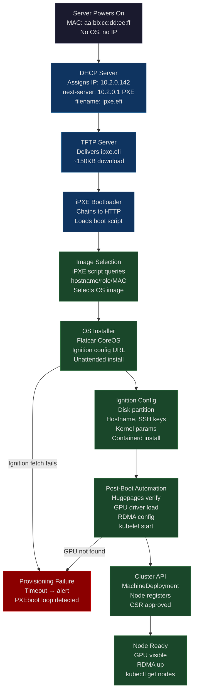
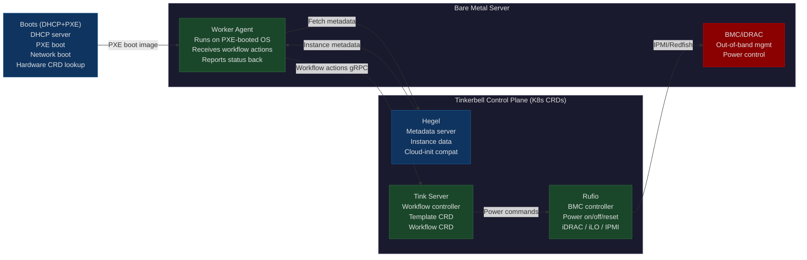

# CH-34: Zero-Touch Provisioning — Bare Metal at Scale Without Human Hands
### *Provisioning 1,000 bare metal servers by hand takes 200 engineer-hours and introduces 47 configuration drift points. Zero-touch provisioning takes 4 hours and a DHCP server.*

> **Part 5 of 9 · Cloud-Native Orchestration**

---

## The Cold Open

In Q1 2021, a hyperscaler commits to delivering 3,000 bare metal GPU servers to its AI training fleet over a six-week window. The servers will run A100s in 8-way NVLink configurations. The delivery schedule is firm: rack and power happen on a schedule the data center team controls; provisioning and cluster integration happen on a schedule the platform team controls. The platform team gets the keys to 3,000 machines over six weeks.

The old provisioning workflow is documented but brutal. An engineer connects a KVM-over-IP console to the server, boots from a USB stick, walks through the OS installer, waits for the installation to complete, removes the USB stick, reboots, SSHes in, runs the initial provisioning Ansible playbook, waits 20 minutes, verifies that GPUs are visible, verifies that RDMA is up, verifies that hugepages are configured, adds the node to the cluster management system, and runs a final validation. Per server: 45 to 90 minutes of direct engineering attention. Not background work. Active, console-attached, waiting-for-prompts time.

For 3,000 servers at 60 minutes average: 3,000 engineer-hours. That is 75 engineer-weeks — roughly 15 FTEs working 40-hour weeks for the full six weeks, doing nothing but provisioning servers. The platform team does not have 15 spare FTEs. And even if they did, the bottleneck would not be people — it would be KVM console capacity. A single engineer can maintain active attention on at most 2–3 simultaneous provisioning sessions. USB stick rotation between servers takes physical time. The process does not parallelize past about 10–15 concurrent provisions per engineer.

The team redesigns around Zero-Touch Provisioning. A new server arriving in the provisioning VLAN triggers a DHCP response that assigns an IP and points the server at a PXE boot image. The server downloads the image via TFTP, boots a minimal environment, downloads a provisioning script via HTTP, installs the OS unattended using a pre-generated Ignition config, runs post-install configuration, configures hugepages and isolcpus based on server role, installs containerd and kubelet with the correct versions, joins the cluster via the cluster API, and marks itself as ready. The engineering intervention per server: zero during provisioning. Two minutes for post-provisioning validation.

For 3,000 servers: four hours of PXE/DHCP setup to generate server-specific configurations, then the servers provision themselves continuously over three days, limited only by the rate at which the data center team powers them on. Total engineering time for the provisioning operation: roughly 100 hours, most of it building and testing the ZTP pipeline before the first server arrives, plus 100 hours of validation. The server fleet delivers on schedule.

The question is what has to be in place for a bare metal server — one that received power for the first time 30 seconds ago, with no OS, no SSH keys, and no network configuration — to become a fully operational Kubernetes node with zero physical intervention.

---

## The Uncomfortable Truth

ZTP is not one technology. It is not a single product you install and configure. It is eight distinct systems that must be designed, deployed, configured, and operated together, where a failure in any one of them silently prevents provisioning and the debug path requires understanding all eight.

The eight layers: DHCP provides the initial network configuration and tells the server where to look for a boot image. TFTP or HTTP delivers the boot image. PXE is the firmware-level network boot protocol that initiates the sequence. iPXE or GRUB is the bootloader that receives control from PXE and can make decisions about which OS image to load. Kickstart, Ignition, or cloud-init is the OS installation specification that tells the installer how to partition disks, configure users, and install packages unattended. An orchestration layer — Ironic, Tinkerbell, or MAAS — tracks bare metal hardware inventory and drives the provisioning workflow. An automation layer — Ansible, Salt, or Terraform — handles post-boot configuration that the OS installer cannot do cleanly. The Kubernetes cluster API and kubelet registration are the final step that makes the machine a cluster node.

A working ZTP pipeline requires all eight layers to be correctly configured and communicating. Most "ZTP failed" incidents are a layer 5 failure (the Kickstart URL returned a 403 because an S3 bucket policy changed) being debugged as a layer 2 failure (the engineer checking TFTP because that's where they checked last time). The debug process for a silent provision failure requires checking: Did the server get a DHCP lease? Did it request a boot file? Did the boot file transfer succeed? Did the bootloader start? Did the bootloader chain to the correct OS image? Did the OS installer start? Did the installer reach the configuration URL? Did the installer succeed? Did post-boot automation run? Did the node join the cluster?

Each of those questions requires a different tool and a different log source. Mastering ZTP means having a mental map of the entire pipeline and knowing which layer to look at when a server sits in the "provisioning" state for 20 minutes without transitioning.

---

## The Mental Model

Consider an automobile assembly line.

A car body enters the line at station 1 as a bare stamped metal shell. It has no identity and no components. At station 1, a VIN plate is attached — the unique identifier that carries the car's configuration spec through every subsequent station. At station 2, the engine bay is prepared: mounts welded, firewall insulation applied. At station 3, the powertrain drops in: engine, transmission, driveshaft, per the VIN's spec (V6 or V8, automatic or manual). At station 4, the wiring harness is installed — every cable routed based on that VIN's options. At station 5, the body panels are attached. At station 6, paint. At station 7, interior. At station 8, final quality check — every system verified against the VIN's spec before the car leaves the line.

A bare metal server entering the ZTP pipeline is the car body at station 1. The DHCP lease is the VIN: the MAC address is the unique identifier, the DHCP server assigns an IP and supplies PXE options based on that MAC, and from that point forward every subsequent step knows the server's configuration. The PXE boot image is station 2 (engine bay prep — making the machine capable of further work). The OS installation is station 3 (powertrain — the core operating system). Cloud-init or Ignition is station 4 (wiring harness — service configuration, SSH keys, kernel parameters). The cluster API registration is the quality check at station 8.

The named label for this model is **The Server Assembly Line Model**.

The key insight from the car analogy: each station must complete correctly before the next station can proceed, but the stations themselves can run on hundreds of cars simultaneously. A ZTP pipeline that takes 30 minutes per server can provision 100 servers in parallel if the infrastructure has the bandwidth — DHCP handles thousands of leases, TFTP/HTTP handles hundreds of concurrent transfers, OS installations run in parallel on every server simultaneously. The throughput is limited by infrastructure capacity, not by sequential bottlenecks.

**Diagram 1: ZTP Boot Sequence — All Layers from Power-On to Cluster Join**



**Diagram 2: Tinkerbell Architecture — CNCF Bare Metal Provisioner**



---

## The Dissection

### Layer 1: DHCP With PXE Boot Options

DHCP is the entry point for every provisioning pipeline. A newly powered server sends a DHCP DISCOVER broadcast on its provisioning VLAN. The DHCP server must respond with not only an IP address, but also the PXE boot options: the address of the TFTP/HTTP server and the filename of the boot image to load.

**ISC DHCP configuration for PXE boot:**

```bash
# /etc/dhcp/dhcpd.conf
default-lease-time 600;
max-lease-time 7200;
authoritative;

option space pxelinux;
option pxelinux.magic code 208 = string;
option pxelinux.configfile code 209 = text;
option pxelinux.pathprefix code 210 = text;

subnet 10.2.0.0 netmask 255.255.0.0 {
  range 10.2.0.100 10.2.10.255;
  option routers 10.2.0.1;
  option domain-name-servers 10.2.0.2;
  next-server 10.2.0.1;    # TFTP server IP

  # UEFI boot (modern servers)
  if option arch = 00:07 {
    filename "ipxe.efi";
  # Legacy BIOS (older hardware)
  } else {
    filename "undionly.kpxe";
  }
}

# Pin specific servers to specific IPs and roles by MAC address
host gpu-node-001 {
  hardware ethernet aa:bb:cc:dd:ee:01;
  fixed-address 10.2.1.1;
  option host-name "gpu-node-001";
  # Role-specific option: passed to iPXE script for image selection
  option pxelinux.configfile "gpu-a100-8x";
}

host gpu-node-002 {
  hardware ethernet aa:bb:cc:dd:ee:02;
  fixed-address 10.2.1.2;
  option host-name "gpu-node-002";
  option pxelinux.configfile "gpu-a100-8x";
}

# CPU-only nodes get a different image
host cpu-node-001 {
  hardware ethernet aa:bb:cc:dd:ff:01;
  fixed-address 10.2.2.1;
  option host-name "cpu-node-001";
  option pxelinux.configfile "cpu-general";
}
```

**Dnsmasq alternative (simpler, combined DHCP+TFTP):**

```bash
# /etc/dnsmasq.d/pxe.conf
interface=bond0.provisioning
dhcp-range=10.2.0.100,10.2.10.255,255.255.0.0,1h

# Boot file selection by architecture
dhcp-match=set:efi-x86_64,option:client-arch,7
dhcp-boot=tag:efi-x86_64,ipxe.efi,pxeserver,10.2.0.1
dhcp-boot=tag:!efi-x86_64,undionly.kpxe,pxeserver,10.2.0.1

# TFTP server (built-in to dnsmasq)
enable-tftp
tftp-root=/srv/tftp

# Host-specific entries — generated from CMDB/IPAM
dhcp-host=aa:bb:cc:dd:ee:01,gpu-node-001,10.2.1.1
dhcp-host=aa:bb:cc:dd:ee:02,gpu-node-002,10.2.1.2
```

### Layer 2: iPXE Chain Boot

PXE firmware is limited — it downloads a small file via TFTP and executes it. iPXE extends this: once iPXE is running, it can download scripts via HTTP, execute conditional logic, and chain to OS installers. This is where server-role differentiation happens.

```bash
# /srv/tftp/ipxe-boot.script
# This script runs on every server after iPXE loads

# Pull server-specific config from the provisioning API
# The API knows MAC address from the DHCP request
set base-url http://10.2.0.1:8080
set provisioning-api ${base-url}/api/v1

# Fetch server config based on MAC address
chain --replace ${provisioning-api}/boot?mac=${net0/mac}
```

```bash
# Response from provisioning API for a GPU node
# /api/v1/boot?mac=aa:bb:cc:dd:ee:01  → returns this iPXE script

#!ipxe
set role gpu-a100-8x
set hostname gpu-node-001
set kernel-url http://10.2.0.1:8080/images/flatcar/${role}/vmlinuz
set initrd-url http://10.2.0.1:8080/images/flatcar/${role}/initrd.img
set ignition-url http://10.2.0.1:8080/ignition/${hostname}.json

kernel ${kernel-url} \
  initrd=initrd.img \
  flatcar.first_boot=1 \
  ignition.config.url=${ignition-url} \
  systemd.unified_cgroup_hierarchy=1 \
  console=ttyS0,115200n8 \
  hostname=${hostname}

initrd ${initrd-url}
boot
```

The provisioning API endpoint is a small HTTP server that maps MAC addresses to boot configurations. It reads from IPAM (the source of truth for MAC-to-hostname-to-role mapping) and generates the iPXE script dynamically. Any new server added to IPAM is automatically provisioned correctly the next time it PXE boots.

### Layer 3: OS Installation — Flatcar CoreOS with Ignition

Flatcar CoreOS is an immutable OS designed for containerized workloads. The base OS image is read-only; the system partition (`/` and `/usr`) are mounted read-only after boot. Configuration lives in a separate data partition and is applied by the Ignition system on first boot. Ignition runs once, at the very earliest stages of init, before systemd services start — it partitions disks, writes files, creates users, and configures systemd units. After Ignition completes, the system boots normally.

```json
// /srv/ignition/gpu-node-001.json
// Generated per-server by the provisioning system
{
  "ignition": { "version": "3.3.0" },
  "storage": {
    "disks": [
      {
        "device": "/dev/nvme0n1",
        "wipeTable": true,
        "partitions": [
          { "number": 1, "sizeMiB": 512,  "label": "EFI",  "typeGuid": "C12A7328-F81F-11D2-BA4B-00A0C93EC93B" },
          { "number": 2, "sizeMiB": 4096, "label": "BOOT", "typeGuid": "21686148-6449-6E6F-744E-656564454649" },
          { "number": 3, "sizeMiB": 51200,"label": "ROOT" },
          { "number": 4, "label": "DATA", "sizeMiB": 0 }
        ]
      }
    ],
    "filesystems": [
      { "device": "/dev/nvme0n1p1", "format": "vfat", "label": "EFI" },
      { "device": "/dev/nvme0n1p3", "format": "ext4", "label": "ROOT", "wipeFilesystem": true },
      { "device": "/dev/nvme0n1p4", "format": "ext4", "label": "DATA", "wipeFilesystem": true }
    ],
    "files": [
      {
        "path": "/etc/hostname",
        "contents": { "inline": "gpu-node-001" },
        "mode": 420
      },
      {
        "path": "/etc/sysctl.d/99-kubernetes.conf",
        "contents": {
          "inline": "net.bridge.bridge-nf-call-iptables=1\nnet.ipv4.ip_forward=1\nvm.overcommit_memory=1\nvm.panic_on_oom=0\nkernel.panic=10\nkernel.panic_on_oops=1"
        },
        "mode": 420
      },
      {
        "path": "/etc/containerd/config.toml",
        "contents": { "source": "http://10.2.0.1:8080/configs/containerd-config.toml" },
        "mode": 420
      },
      {
        "path": "/etc/kubernetes/bootstrap-kubeconfig",
        "contents": { "source": "http://10.2.0.1:8080/bootstrap/kubeconfig" },
        "mode": 384
      }
    ]
  },
  "kernelArguments": {
    "shouldExist": [
      "systemd.unified_cgroup_hierarchy=1",
      "hugepagesz=1G",
      "hugepages=64",
      "isolcpus=2-63",
      "nohz_full=2-63",
      "rcu_nocbs=2-63",
      "amd_iommu=on",
      "iommu=pt"
    ]
  },
  "passwd": {
    "users": [
      {
        "name": "core",
        "sshAuthorizedKeys": [
          "ssh-ed25519 AAAAC3NzaC1... platform-team-2024"
        ]
      }
    ]
  },
  "systemd": {
    "units": [
      {
        "name": "kubelet.service",
        "enabled": true,
        "contents": "[Unit]\nDescription=Kubernetes Kubelet\nAfter=containerd.service\nRequires=containerd.service\n\n[Service]\nExecStart=/opt/bin/kubelet \\\n  --bootstrap-kubeconfig=/etc/kubernetes/bootstrap-kubeconfig \\\n  --kubeconfig=/etc/kubernetes/kubeconfig \\\n  --config=/etc/kubernetes/kubelet-config.yaml \\\n  --container-runtime-endpoint=unix:///run/containerd/containerd.sock \\\n  --node-labels=node.kubernetes.io/role=gpu,nvidia.com/gpu=true\nRestart=always\nRestartSec=10\n\n[Install]\nWantedBy=multi-user.target\n"
      }
    ]
  }
}
```

The `kernelArguments` section is where ZTP meets the earlier CPU and memory chapters: hugepages, CPU isolation, IOMMU configuration are baked into the boot arguments at provisioning time, not patched in afterward. Every GPU node in the fleet boots with identical kernel parameters because the Ignition config is generated from a template with per-node variable substitution.

### Layer 4: Bare Metal Lifecycle Management — Tinkerbell

Tinkerbell is a CNCF project for bare metal provisioning. It uses Kubernetes CRDs to represent hardware, provisioning workflows, and workflow templates. The same team that manages Kubernetes applications can manage bare metal provisioning workflows using familiar tooling: `kubectl`, GitOps, ArgoCD.

**Hardware CRD — register a server by MAC address:**

```yaml
# hardware-gpu-node-001.yaml
apiVersion: "tinkerbell.org/v1alpha1"
kind: Hardware
metadata:
  name: gpu-node-001
  namespace: tink-system
spec:
  bmcRef:
    apiGroup: bmc.tinkerbell.org
    kind: Machine
    name: gpu-node-001-bmc
  disks:
    - device: /dev/nvme0n1
  interfaces:
    - dhcp:
        arch: x86_64
        hostname: gpu-node-001
        ip:
          address: 10.2.1.1
          family: 4
          gateway: 10.2.0.1
          netmask: 255.255.0.0
        lease_time: 86400
        mac: "aa:bb:cc:dd:ee:01"
        name_servers:
          - 10.2.0.2
        uefi: true
      netboot:
        allowPXE: true
        allowWorkflow: true
  metadata:
    instance:
      hostname: gpu-node-001
      id: gpu-node-001
      ips:
        - address: 10.2.1.1
          family: 4
          public: false
      operating_system:
        distro: flatcar
        version: "3815.2.0"
      userdata: |
        #!ipxe
        chain http://10.2.0.1:8080/ignition/gpu-node-001.json
```

**Template CRD — define the provisioning workflow:**

```yaml
# template-gpu-flatcar.yaml
apiVersion: "tinkerbell.org/v1alpha1"
kind: Template
metadata:
  name: flatcar-gpu-a100
  namespace: tink-system
spec:
  data: |
    version: "0.1"
    name: flatcar-gpu-a100
    global_timeout: 3600
    tasks:
      - name: os-installation
        worker: "{{.device_1}}"
        volumes:
          - /dev:/dev
          - /dev/console:/dev/console
          - /lib/firmware:/lib/firmware:ro
        actions:
          - name: wipe-disk
            image: 10.2.0.1:5000/disk-wipe:latest
            timeout: 300
            environment:
              DISK: /dev/nvme0n1

          - name: stream-flatcar-image
            image: 10.2.0.1:5000/image-to-disk:latest
            timeout: 600
            environment:
              IMG_URL: http://10.2.0.1:8080/images/flatcar-3815.2.0-amd64.img.gz
              DEST_DISK: /dev/nvme0n1
              COMPRESSED: "true"

          - name: write-ignition-config
            image: 10.2.0.1:5000/writefile:latest
            timeout: 90
            environment:
              DEST_DISK: /dev/nvme0n1p4
              DEST_PATH: /ignition/config.ign
              CONTENTS: "{{.ignition_config}}"

          - name: reboot
            image: 10.2.0.1:5000/reboot:latest
            timeout: 90
            volumes:
              - /worker:/worker
```

**Workflow CRD — instantiate the template for a specific hardware:**

```yaml
# workflow-gpu-node-001.yaml
apiVersion: "tinkerbell.org/v1alpha1"
kind: Workflow
metadata:
  name: provision-gpu-node-001
  namespace: tink-system
spec:
  templateRef: flatcar-gpu-a100
  hardwareRef: gpu-node-001
  hardwareMap:
    device_1: "aa:bb:cc:dd:ee:01"
```

The Workflow is a Kubernetes object. ArgoCD can manage it. A GitOps pipeline that generates Hardware and Workflow CRDs from a CMDB source, commits them to a Git repository, and lets ArgoCD apply them to the Tinkerbell cluster is a fully automated ZTP pipeline managed entirely through standard Kubernetes tooling.

### Layer 5: Cluster API (CAPI) and Metal3

Cluster API abstracts infrastructure provisioning behind a standard set of Kubernetes CRDs. The same `MachineDeployment` API that creates EC2 instances on AWS can create bare metal servers via the Metal3 provider (which uses Ironic under the hood) or the Tinkerbell provider.

```yaml
# machine-deployment-gpu-nodes.yaml
apiVersion: cluster.x-k8s.io/v1beta1
kind: MachineDeployment
metadata:
  name: gpu-workers-a100
  namespace: gpu-cluster
spec:
  clusterName: gpu-cluster-prod
  replicas: 32  # 32 GPU nodes in this group
  selector:
    matchLabels:
      node-type: gpu-a100
  template:
    metadata:
      labels:
        node-type: gpu-a100
    spec:
      clusterName: gpu-cluster-prod
      bootstrap:
        configRef:
          apiVersion: bootstrap.cluster.x-k8s.io/v1beta1
          kind: KubeadmConfigTemplate
          name: gpu-a100-kubeadm-config
      infrastructureRef:
        apiVersion: infrastructure.cluster.x-k8s.io/v1beta1
        kind: TinkerbellMachineTemplate
        name: gpu-a100-machine-template
---
apiVersion: infrastructure.cluster.x-k8s.io/v1beta1
kind: TinkerbellMachineTemplate
metadata:
  name: gpu-a100-machine-template
  namespace: gpu-cluster
spec:
  template:
    spec:
      hardwareAffinity:
        required:
          - labelSelector:
              matchLabels:
                hardware-type: gpu-a100-8x
      templateOverride: |
        version: "0.1"
        name: flatcar-gpu-a100-kubeadm
```

CAPI's `MachineDeployment` behaves exactly like a Kubernetes `Deployment`: set `replicas: 32`, CAPI ensures 32 machines exist and are joined to the cluster. Scale down to 24, CAPI drains and deprovisions 8 machines. The bare metal fleet behaves like a cloud resource pool.

### Layer 6: Post-Provisioning Validation in Go

After a node joins the cluster, it needs automated validation before receiving production workloads. This validation runs as a Kubernetes Job on the newly provisioned node.

```go
// cmd/node-validator/main.go
package main

import (
	"context"
	"fmt"
	"log"
	"os"
	"os/exec"
	"strconv"
	"strings"
	"time"

	metav1 "k8s.io/apimachinery/pkg/apis/meta/v1"
	"k8s.io/client-go/kubernetes"
	"k8s.io/client-go/rest"
)

type ValidationResult struct {
	Check   string
	Passed  bool
	Details string
}

func checkGPUCount(expectedGPUs int) ValidationResult {
	out, err := exec.Command("nvidia-smi", "--query-gpu=name", "--format=csv,noheader").Output()
	if err != nil {
		return ValidationResult{
			Check:   "GPU count",
			Passed:  false,
			Details: fmt.Sprintf("nvidia-smi failed: %v", err),
		}
	}
	gpus := strings.Split(strings.TrimSpace(string(out)), "\n")
	count := len(gpus)
	passed := count == expectedGPUs
	return ValidationResult{
		Check:   "GPU count",
		Passed:  passed,
		Details: fmt.Sprintf("found %d GPUs, expected %d: %v", count, expectedGPUs, gpus),
	}
}

func checkHugepages(expectedGB int) ValidationResult {
	data, err := os.ReadFile("/sys/kernel/mm/hugepages/hugepages-1048576kB/nr_hugepages")
	if err != nil {
		return ValidationResult{
			Check:   "Hugepages",
			Passed:  false,
			Details: fmt.Sprintf("could not read hugepages count: %v", err),
		}
	}
	count, err := strconv.Atoi(strings.TrimSpace(string(data)))
	if err != nil {
		return ValidationResult{Check: "Hugepages", Passed: false, Details: fmt.Sprintf("parse error: %v", err)}
	}
	passed := count == expectedGB
	return ValidationResult{
		Check:   "Hugepages",
		Passed:  passed,
		Details: fmt.Sprintf("found %d 1GB hugepages, expected %d", count, expectedGB),
	}
}

func checkRDMA() ValidationResult {
	out, err := exec.Command("ibv_devices").Output()
	if err != nil {
		return ValidationResult{
			Check:   "RDMA",
			Passed:  false,
			Details: fmt.Sprintf("ibv_devices failed — RDMA not available: %v", err),
		}
	}
	hasDevices := strings.Contains(string(out), "mlx") || strings.Contains(string(out), "ib")
	return ValidationResult{
		Check:   "RDMA",
		Passed:  hasDevices,
		Details: strings.TrimSpace(string(out)),
	}
}

func checkIsolcpus() ValidationResult {
	data, err := os.ReadFile("/sys/devices/system/cpu/isolated")
	if err != nil {
		return ValidationResult{Check: "CPU isolation", Passed: false, Details: err.Error()}
	}
	isolated := strings.TrimSpace(string(data))
	passed := isolated != ""
	return ValidationResult{
		Check:   "CPU isolation",
		Passed:  passed,
		Details: fmt.Sprintf("isolated CPUs: %q", isolated),
	}
}

func markNodeReady(ctx context.Context, nodeName string, results []ValidationResult) error {
	config, err := rest.InClusterConfig()
	if err != nil {
		return err
	}
	client, err := kubernetes.NewForConfig(config)
	if err != nil {
		return err
	}

	allPassed := true
	for _, r := range results {
		if !r.Passed {
			allPassed = false
			break
		}
	}

	node, err := client.CoreV1().Nodes().Get(ctx, nodeName, metav1.GetOptions{})
	if err != nil {
		return err
	}

	if node.Labels == nil {
		node.Labels = make(map[string]string)
	}

	if allPassed {
		node.Labels["provisioning.platform.io/validated"] = "true"
		node.Labels["provisioning.platform.io/validated-at"] = time.Now().Format(time.RFC3339)
		// Remove the taint that was blocking workload scheduling
		newTaints := make([]interface{}, 0)
		_ = newTaints
		// remove taint: provisioning.platform.io/not-ready:NoSchedule
	} else {
		node.Labels["provisioning.platform.io/validated"] = "false"
		node.Labels["provisioning.platform.io/validation-failed-at"] = time.Now().Format(time.RFC3339)
	}

	_, err = client.CoreV1().Nodes().Update(ctx, node, metav1.UpdateOptions{})
	return err
}

func main() {
	nodeName := os.Getenv("NODE_NAME")
	if nodeName == "" {
		log.Fatal("NODE_NAME environment variable required")
	}

	results := []ValidationResult{
		checkGPUCount(8),
		checkHugepages(64),
		checkRDMA(),
		checkIsolcpus(),
	}

	fmt.Printf("Node validation results for %s:\n", nodeName)
	allPassed := true
	for _, r := range results {
		status := "PASS"
		if !r.Passed {
			status = "FAIL"
			allPassed = false
		}
		fmt.Printf("  [%s] %s: %s\n", status, r.Check, r.Details)
	}

	ctx := context.Background()
	if err := markNodeReady(ctx, nodeName, results); err != nil {
		log.Fatalf("Failed to update node status: %v", err)
	}

	if !allPassed {
		fmt.Println("Validation FAILED — node will not receive workloads")
		os.Exit(1)
	}
	fmt.Println("Validation PASSED — node is ready for workloads")
}
```

This validator runs as a DaemonSet with a `nodeSelector` targeting newly provisioned nodes, or as a Kubernetes Job triggered by the CAPI provisioning pipeline. Nodes enter the cluster with a `provisioning.platform.io/not-ready:NoSchedule` taint applied by the Ignition config. The validator removes this taint only after all checks pass. A node that fails GPU detection, hugepage configuration, or RDMA availability never receives production workloads and generates an alert for manual inspection.

### Day-2 Operations: Immutable OS vs Mutable OS

**Immutable OS (Flatcar, Talos):** The OS image is versioned and built as an artifact. An OS update replaces the root partition with a new image, writes new kernel arguments, and reboots. Rollback is trivial: keep the previous partition. Configuration drift is impossible because the base OS is read-only. The tradeoff: you cannot `apt install` a package; you must rebuild the OS image. For a fleet of 3,000 servers, this is a feature: every node runs exactly the same OS artifact, and drift is structurally prevented.

**Mutable OS (Ubuntu with apt):** Easier to patch individual packages, better tooling support, familiar. Configuration drift accumulates over time as packages diverge between nodes and manual changes persist. For large fleets, mutable OS requires aggressive automated patching (Ansible, unattended-upgrades) plus drift detection (osquery, Puppet/Chef reports). The operational overhead scales with fleet size.

For GPU cluster platforms, immutable OS is the correct choice: reproducible builds, no drift, atomic rollback, and the provisioning pipeline that wrote this chapter handles OS updates by reprovisioning nodes (drain → deprovision → reprovision with new OS image) rather than in-place package updates.

---

## The War Room

### The Silent PXE Filename Drift Incident

**Date: Q3 2022 (synthetic but representative of the failure mode)**

Over a period of 72 hours, 847 bare metal servers at a cloud provider failed to provision after scheduled maintenance on the provisioning infrastructure. The failure was entirely silent. No alert fired. No error was logged in any monitoring system. The servers were simply not transitioning from "provisioning" to "active" in the inventory system.

The root cause: a firmware update to the DHCP server appliance (version transition from ISC DHCP 4.4.1 to 4.4.3) included a behavior change in the default PXE filename for UEFI boot. The old version served `ipxe.efi`. The new version defaulted to `lpxelinux.0` when the explicit filename was not set in the configuration. The configuration file had a comment at the top: `# filename: ipxe.efi` — a comment, not a directive. The actual `filename` directive was missing from the subnet block, relying on the old default behavior.

Every new server that powered on received a DHCP lease, attempted to fetch `lpxelinux.0` via TFTP, received a 404 (the file did not exist on the TFTP server), and rebooted. The PXE boot attempt loop had a 60-second retry interval. The servers cycled: power on, DHCP, TFTP 404, reboot, repeat. From the data center's perspective, the power was on and the network interface was up. From the provisioning system's perspective, the servers were "provisioning." The transition trigger — the server calling home to the provisioning API after PXE boot — never happened, so the provisioning system never transitioned them to a failed state. There was no timeout.

```mermaid
gantt
    title ZTP Silent Failure — 847 Servers Over 72 Hours
    dateFormat YYYY-MM-DD HH:mm
    axisFormat %m-%d %H:%M

    section Root Cause Event
    DHCP firmware update applied             :milestone, fw_update, 2022-07-11 02:00, 0m
    PXE filename default silently changes    :crit, filename_drift, 2022-07-11 02:00, 72h

    section Provisioning Failures
    First server fails to provision          :crit, first_fail, 2022-07-11 06:00, 1h
    100 servers accumulate in stuck state    :crit, s100, 2022-07-11 14:00, 1h
    500 servers in stuck state               :crit, s500, 2022-07-12 08:00, 1h
    847 servers in stuck state               :crit, s847, 2022-07-13 06:00, 1h

    section Detection
    Capacity engineer notices rack delivery  :active, detect1, 2022-07-13 09:00, 2h
    Cross-references provisioning state      :active, detect2, 2022-07-13 11:00, 1h
    Escalation to platform SRE              :active, escalate, 2022-07-13 12:00, 0h

    section Diagnosis
    SRE checks provisioning system logs      :active, logs, 2022-07-13 12:00, 1h
    Observes TFTP 404 pattern in one server  :active, tftp_check, 2022-07-13 13:00, 30m
    Identifies filename change in DHCP cfg   :milestone, rootcause, 2022-07-13 13:30, 0m

    section Remediation
    DHCP config patched with explicit filename:active, fix, 2022-07-13 13:45, 15m
    All 847 servers begin provisioning       :active, recovery, 2022-07-13 14:00, 4h
    Fleet fully provisioned                  :milestone, done, 2022-07-13 18:00, 0m

    section Post-Incident Work
    Monitoring added: PXE boot loop detection :active, mon1, 2022-07-14 00:00, 24h
    Provisioning timeout added (15min)        :active, mon2, 2022-07-14 00:00, 24h
    DHCP config tested in staging before prod :active, proc1, 2022-07-15 00:00, 48h
```

**The monitoring gaps that allowed 72 hours of silent failure:**

1. No alert for "server has been in provisioning state for > 15 minutes." The provisioning system tracked state but had no timeout or SLO on provisioning duration.
2. No alert for "TFTP requests failing at > 1% rate." The TFTP server had access logs but no metrics pipeline connected to the alerting system.
3. No alert for "server PXE booted more than 3 times in 10 minutes." The DHCP server logged each lease, but nobody was counting repeated leases for the same MAC within a short window.
4. No reconciliation between "servers powered on according to data center team" and "servers active in provisioning system." Two separate teams, two separate tracking systems, no automated reconciliation.

**The monitoring changes deployed post-incident:**

```yaml
# PrometheusRule for ZTP pipeline health
apiVersion: monitoring.coreos.com/v1
kind: PrometheusRule
metadata:
  name: ztp-pipeline-health
  namespace: monitoring
spec:
  groups:
  - name: ztp.provisioning
    interval: 60s
    rules:
    - alert: ServerStuckInProvisioning
      expr: |
        (time() - tinkerbell_workflow_started_timestamp) > 900
        and tinkerbell_workflow_state == 1
      for: 5m
      labels:
        severity: warning
        team: platform
      annotations:
        summary: "Server {{ $labels.hardware }} stuck provisioning for > 15 minutes"
        description: "Workflow {{ $labels.workflow }} has been running for {{ $value | humanizeDuration }}. Check TFTP/DHCP."

    - alert: TFTPHighErrorRate
      expr: rate(tftp_requests_total{status="404"}[5m]) > 0.01
      for: 2m
      labels:
        severity: warning
      annotations:
        summary: "TFTP 404 rate elevated — possible PXE filename misconfiguration"

    - alert: RepeatedDHCPLeaseSameMAC
      expr: |
        increase(dhcp_leases_total[10m]) > 5
        * on(mac) group_left() (tinkerbell_hardware_state != 2)
      for: 1m
      labels:
        severity: warning
      annotations:
        summary: "MAC {{ $labels.mac }} requesting repeated DHCP leases — PXE boot loop"
```

---

## The Lab

### Build a Minimal ZTP Pipeline on Your Laptop

This lab builds a complete ZTP pipeline using QEMU VMs as "bare metal servers." The same sequence — DHCP, PXE, iPXE, Ignition, k3s join — runs in production Tinkerbell deployments.

**Prerequisites:**

```bash
# Install required tools (Ubuntu/Debian host)
apt-get install -y qemu-system-x86 dnsmasq syslinux-common ipxe

# Or macOS with Homebrew (run QEMU VMs, dnsmasq for DHCP)
brew install qemu dnsmasq
```

**Step 1: Create a TAP network for the "provisioning VLAN"**

```bash
# Create a bridge + TAP interface for QEMU VMs
sudo ip link add br-prov type bridge
sudo ip addr add 10.99.0.1/24 dev br-prov
sudo ip link set br-prov up

# Create TAP interface for first VM
sudo ip tuntap add dev tap0 mode tap
sudo ip link set tap0 master br-prov
sudo ip link set tap0 up
```

**Step 2: Configure dnsmasq for DHCP + TFTP**

```bash
# /etc/dnsmasq-lab.conf
interface=br-prov
dhcp-range=10.99.0.100,10.99.0.200,255.255.255.0,1h
dhcp-boot=ipxe.efi
enable-tftp
tftp-root=/srv/lab/tftp
dhcp-option=option:router,10.99.0.1
log-dhcp
log-queries

# Start dnsmasq with lab config
sudo dnsmasq --conf-file=/etc/dnsmasq-lab.conf --no-daemon &
```

**Step 3: Set up TFTP root with iPXE**

```bash
mkdir -p /srv/lab/tftp
# Copy the iPXE EFI binary (compiled with HTTP support)
cp /usr/lib/ipxe/ipxe.efi /srv/lab/tftp/

# Create the iPXE boot script
mkdir -p /srv/lab/http
cat > /srv/lab/http/boot.ipxe << 'IPXE'
#!ipxe
set base http://10.99.0.1:8080
kernel ${base}/flatcar/vmlinuz initrd=initrd.img flatcar.first_boot=1 ignition.config.url=${base}/ignition/node.ign console=ttyS0,115200
initrd ${base}/flatcar/initrd.img
boot
IPXE

# Serve HTTP
python3 -m http.server 8080 --directory /srv/lab/http &
```

**Step 4: Generate an Ignition config for k3s join**

```bash
# Generate a simple Ignition config that installs k3s on first boot
cat > /srv/lab/http/ignition/node.ign << 'IGN'
{
  "ignition": {"version": "3.3.0"},
  "systemd": {
    "units": [{
      "name": "k3s-install.service",
      "enabled": true,
      "contents": "[Unit]\nDescription=Install k3s\nAfter=network-online.target\nWants=network-online.target\nConditionPathExists=!/usr/local/bin/k3s\n\n[Service]\nType=oneshot\nRemainAfterExit=yes\nExecStart=/bin/sh -c 'curl -sfL https://get.k3s.io | K3S_URL=https://10.99.0.1:6443 K3S_TOKEN=lab-token sh -'\n\n[Install]\nWantedBy=multi-user.target\n"
    }]
  }
}
IGN
```

**Step 5: Boot a QEMU VM as a "bare metal server"**

```bash
# Download Flatcar CoreOS
wget https://stable.release.flatcar-linux.net/amd64-usr/current/flatcar_production_pxe_image.cpio.gz \
  -O /srv/lab/http/flatcar/initrd.img
wget https://stable.release.flatcar-linux.net/amd64-usr/current/flatcar_production_pxe.vmlinuz \
  -O /srv/lab/http/flatcar/vmlinuz

# Boot the "bare metal" VM with no disk, network boot only
qemu-system-x86_64 \
  -m 2048 \
  -netdev tap,id=net0,ifname=tap0,script=no,downscript=no \
  -device virtio-net-pci,netdev=net0,mac=52:54:00:12:34:56 \
  -nographic \
  -boot n \
  -serial mon:stdio
```

**Expected output — watch the full ZTP sequence in your terminal:**

```
# QEMU BIOS → PXE
SeaBIOS (version ...)
iPXE ... Press Ctrl-B for iPXE command line
DHCP (net0 52:54:00:12:34:56)... ok
http://10.99.0.1:8080/boot.ipxe... ok
Fetching kernel: http://10.99.0.1:8080/flatcar/vmlinuz... ok (12MB)
Fetching initrd: http://10.99.0.1:8080/flatcar/initrd.img... ok (67MB)

# Linux kernel boot
[    0.000000] Linux version 5.15.x-flatcar ...
[    0.850000] ACPI: ...
[    2.100000] ignition: Flatcar Container Linux ignition stage 1

# Ignition runs
[  OK  ] Found device /dev/sda.
[  OK  ] Started ignition-discs.service.
Writing /etc/hostname: lab-node-01
Installing k3s-install.service ...

# First boot completes
Flatcar Container Linux stable 3815.2.0 lab-node-01 ttyS0
lab-node-01 login:

# k3s installs and joins
[INFO]  Finding release for channel stable
[INFO]  Downloading k3s v1.28.5+k3s1
[INFO]  Starting k3s agent
[  OK  ] Started k3s-agent.service.

# From the host — verify node joined
kubectl get nodes
NAME          STATUS   ROLES    AGE   VERSION
lab-node-01   Ready    <none>   42s   v1.28.5+k3s1
```

The complete pipeline — from QEMU power-on to `kubectl get nodes` showing `Ready` — runs in under 4 minutes. In production with Flatcar pre-cached on the provisioning server and faster disk I/O, a real bare metal node transitions in 8–15 minutes.

**Stretch Goal: Add Tinkerbell**

Replace the custom iPXE script and dnsmasq setup with a local Tinkerbell stack using their sandbox Docker Compose configuration. Register the QEMU VM's MAC address as a `Hardware` CRD. Create a `Template` that mirrors the iPXE script's behavior. Watch the Tinkerbell workflow state machine progress through `STATE_PENDING → STATE_RUNNING → STATE_SUCCESS` as the VM provisions. The Tinkerbell sandbox repository has a complete setup guide that mirrors this lab at production fidelity.

---

## The Loose Thread

Every node that ZTP provisions ends up in one of two states: it joins an existing cluster, or it *becomes* a cluster. When you are provisioning 3,000 GPU servers, you are not adding to one Kubernetes cluster — you are standing up multiple clusters, each with its own control plane, its own etcd quorum, its own API server, and its own scheduler. The Cluster API `MachineDeployment` objects from this chapter create the worker nodes, but they target a cluster that already exists. Somewhere, someone had to stand up the control plane first.

At 3,000 nodes, the control plane is not an afterthought. The API server that processes requests for 3,000 nodes has different sizing requirements than one managing 30. The etcd cluster that backs it has different performance characteristics, different backup requirements, different failure modes. The scheduler that places workloads across 3,000 nodes — including the gang scheduling constraints from Chapter 32 and the DRA device claims from Chapter 31 — runs hot in ways it does not at small scale.

Chapter 35 is about what happens to the Kubernetes control plane when the cluster gets big enough that the control plane itself becomes the bottleneck.

---
*End of Chapter 34*
