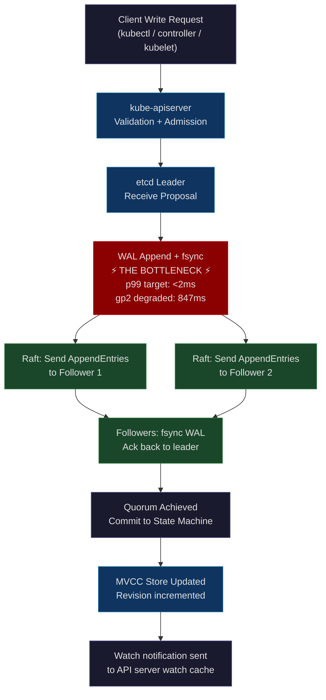
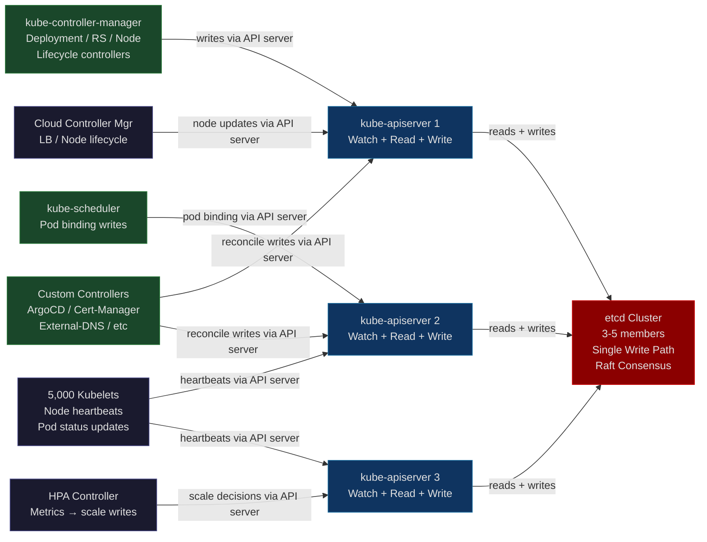
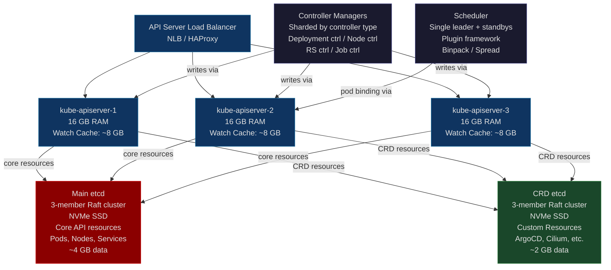

# Chapter 35: Kubernetes Control Plane at Scale — When etcd Is the Bottleneck

**"A Kubernetes cluster with 5,000 nodes, 100,000 pods, and 500 controllers all writing to etcd at 1,000 ops/second will fall over. The limit isn't Kubernetes. It's etcd's disk fsync latency."**

---

## Part I — SPARK

### The Cold Open

The migration plan looked brilliant on the whiteboard. Eight Kubernetes clusters, each running between 200 and 400 nodes for different product lines, each maintained by a separate sub-team, each with their own upgrade cadence, their own certificate rotation procedures, their own monitoring dashboards. Eight sets of control plane VMs to patch. Eight sets of etcd backups to validate. Eight on-call rotations overlapping imperfectly at 2 AM when something breaks.

Consolidating to a single mega-cluster would cut operational overhead by 70%. One upgrade procedure. One certificate authority. One monitoring stack. One on-call rotation. The math was clean, the architecture review passed, and the migration kicked off in Q3. By November, they had successfully moved 2,100 nodes and 51,000 pods to the new cluster. Prometheus was green. Node readiness sat at 99.97%. The team opened champagne.

Then they crossed 2,500 nodes.

The first signal was subtle — an SRE running routine queries noticed that `kubectl get pods -n production` was taking 4 seconds where it used to take 400ms. She assumed network latency and ran the command again. Seven seconds. She filed a low-priority ticket and went to lunch. By the time she came back, the ticket had six comments and three pages worth of Slack threads attached to it.

The API server latency histogram on their monitoring dashboard — which nobody had configured an alert on, because nobody had seen it spike before — showed a staircase pattern over the past three hours. LIST request p50 had climbed from 180ms to 1.2 seconds. LIST request p99 had crossed 8 seconds. The Horizontal Pod Autoscaler for their checkout service had not reconciled in 4 minutes and 17 seconds. That's 4 minutes during which a Black Friday traffic spike hit, the HPA failed to scale out, and 38,000 HTTP 503 errors landed on real customers.

The scheduler was technically running. The controllers were technically running. The API server was technically running. The cluster was not down in any way that Kubernetes itself would report as down. But every operation was passing through quicksand.

The team pulled up the etcd dashboard — a Grafana board they had imported from a GitHub template but never actually tuned alerts for. The etcd write latency p99 metric read: **847ms**.

The etcd documentation, linked from the Kubernetes production recommendations guide, states clearly: *"For etcd to be considered healthy, disk commit latency should be under 10ms."* They were running at 84 times the healthy ceiling.

The etcd cluster was mounted on AWS EBS gp2 volumes. The gp2 volume type uses a burst I/O credit model: each volume gets a baseline of 100 IOPS, can burst to 3,000 IOPS, but accumulates those burst credits over time at a rate proportional to volume size. Their 200GB gp2 volumes had a burst credit balance of zero. The disk was answering fsyncs at 847ms each. And every single write to the Kubernetes API — every pod status update, every node heartbeat, every HPA decision, every ConfigMap change — requires an fsync to etcd before it can be acknowledged.

The cluster had not broken. The disk had broken the cluster.

---

### The Uncomfortable Truth

The industry story about Kubernetes scalability focuses on the wrong things. You will read about API server horizontal scaling, controller-manager sharding, scheduler throughput optimizations, and kubelet tuning guides with 40 parameters. All of that is real engineering work and all of it matters — but none of it is the binding constraint for most large clusters.

etcd is the binding constraint. Always. And etcd's performance is governed almost entirely by one number: disk fsync latency.

This is the false belief that gets large-scale Kubernetes adopters into trouble: *"I can scale the control plane horizontally."* You can scale API servers horizontally. You can run multiple controller-managers. You can shard the scheduler. But all of those components write to etcd, and etcd is a Raft consensus system. Raft requires that every write be durably committed to a quorum of members before it can be acknowledged — and durable commitment means fsync to disk on each member that acknowledges the write.

There is no parallelism here that helps. A batch of 1,000 concurrent writes to the API server does not produce 1,000 concurrent fsyncs to etcd. Those 1,000 writes are serialized by the Raft leader, appended to the write-ahead log one at a time, fsynced one at a time (or in small batches), and acknowledged back through the Raft replication pipeline. If your fsync takes 50ms, your maximum sustained write throughput is 20 writes per second, regardless of how many API servers, controllers, or CPU cores you throw at the problem.

Adding more API servers without addressing etcd latency makes things *worse* — each additional API server opens more watch connections to etcd, which generates more etcd load, which competes with writes for the same I/O budget.

The bitter irony: the engineers who run into this problem are usually the ones who took Kubernetes seriously enough to run it at scale. They did the right thing — they grew the cluster, they migrated workloads, they reduced operational overhead. The reward for doing the right thing is a silent, confusing, non-alerting performance degradation that looks like a dozen different problems before you identify it as one.

---

## Part II — FORGE

### The Mental Model: The Single Notary Bottleneck

Picture a notary public who operates a government filing office. Every legal document in the city must receive the notary's official stamp before it enters the permanent record. Documents cannot be filed speculatively or provisionally — only notarized documents count. You might have 500 lawyers working in 500 offices, preparing documents simultaneously. But all 500 lawyers must queue at the notary's desk, one at a time, to get their stamp.

The notary works at a fixed rate: with a good pen on a well-oiled stamp, they process 1,200 documents per hour. With a worn pen on a stuck stamp, they process 120 documents per hour. Hiring more lawyers (adding API servers) does not help when the lawyers are waiting for the notary (etcd fsync). The lawyers become more expensive and more frustrated, but the stack of unprocessed documents grows at the same rate.

This is **The Single Notary Bottleneck**: a serial, durable checkpoint that sits in the critical path of every write operation in the system, governed entirely by the speed of its physical write mechanism.

etcd is the notary. The Raft WAL fsync is the stamp. Every Kubernetes write is a document. Your disk is the pen.



The second diagram shows how every major control plane component depends on etcd as a shared dependency — horizontal scaling of any one component does not remove the shared bottleneck.



---

### The Dissection

#### The etcd Write Path, Step by Step

Understanding where latency enters the system requires tracing a write from the client to the response.

**Step 1 — Client sends a request to the API server.** A controller calls `client.Update()` to update a Pod status. The HTTP request reaches one of the API server replicas. The API server runs admission webhooks, validates the object schema, checks RBAC, and prepares the serialized object. None of this involves etcd yet.

**Step 2 — API server calls etcd.** The API server calls `etcdClient.Put()` (or equivalent) through the `storage.Interface`. This enters the `clientv3` gRPC channel to the etcd leader. The etcd cluster routes the request to the current Raft leader — if your request hits a follower, the follower proxies it to the leader, adding a network round-trip.

**Step 3 — etcd leader appends to WAL.** The Raft leader appends the write to its write-ahead log (WAL), a sequential file on disk. This is the first fsync. WAL writes are sequential, which is why HDDs are slightly less terrible than you might expect for etcd — sequential I/O is forgiving. But each entry must be durably written before proceeding.

**Step 4 — Leader sends AppendEntries RPCs.** The leader sends the log entry to all followers. Each follower appends to their WAL and fsyncs. Each follower sends an acknowledgment back to the leader.

**Step 5 — Quorum achieved.** When (n/2 + 1) members have acknowledged — for a 3-member cluster, that's 2 members including the leader — the log entry is considered committed. The committed entry is applied to the state machine (the MVCC key-value store).

**Step 6 — Response returned.** The API server receives the response from etcd, constructs the HTTP response, and returns it to the client controller. Watch notifications are dispatched asynchronously to all API servers that have active watches on the affected resource type.

The total latency of this path equals: API server processing time + network to etcd leader + WAL fsync on leader + network to followers + WAL fsync on followers + network round-trip back + MVCC apply. For a healthy cluster on NVMe, this is 2-5ms. For a gp2 volume with exhausted burst credits, the WAL fsync alone is 800ms+.

#### MVCC Storage Model and etcd Database Size

etcd uses a multi-version concurrency control (MVCC) store. Every write to any key does not overwrite the previous value — it creates a new revision. An integer revision counter increments globally with every write to the entire cluster. When you query a key at `resourceVersion=1000`, you get the value that existed at that revision.

This design enables efficient Watch semantics: a controller that was disconnected can reconnect and request "all events since revision 4,500" and etcd will replay them from the WAL and MVCC store. This is how Kubernetes recovers from brief controller disconnections without missing events.

The cost of this design: the database grows unboundedly. A cluster with 100,000 pods, each updating status every 10 seconds, generates 10,000 MVCC revisions per second. Over one hour, that's 36 million revisions. Over one day, etcd's database will grow until it exhausts the `--quota-backend-bytes` limit (default: 2GB, recommended production: 8GB).

Compaction is the mechanism that removes old revisions. etcd keeps only the revisions since the last compaction plus all the revisions after. The `--auto-compaction-mode=periodic` and `--auto-compaction-retention=8h` flags instruct etcd to automatically compact every 8 hours, retaining the last 8 hours of history.

After compaction, the database file does not shrink — it has fragmentation holes where old revisions were. Defragmentation rebuilds the database file, physically recovering disk space, but it briefly takes the member offline. Defragment only one etcd member at a time, never on the leader during business hours.

```bash
# etcd health and status commands every SRE should have memorized

# Check cluster health and leader election status
etcdctl endpoint health \
  --endpoints=https://etcd-0:2379,https://etcd-1:2379,https://etcd-2:2379 \
  --cacert=/etc/kubernetes/pki/etcd/ca.crt \
  --cert=/etc/kubernetes/pki/etcd/healthcheck-client.crt \
  --key=/etc/kubernetes/pki/etcd/healthcheck-client.key

# Check detailed status: db size, leader, raft term/index
etcdctl endpoint status \
  --endpoints=https://etcd-0:2379,https://etcd-1:2379,https://etcd-2:2379 \
  --cacert=/etc/kubernetes/pki/etcd/ca.crt \
  --cert=/etc/kubernetes/pki/etcd/healthcheck-client.crt \
  --key=/etc/kubernetes/pki/etcd/healthcheck-client.key \
  --write-out=table

# Example output when etcd is healthy:
# ENDPOINT            HEALTH  TOOK        ERROR
# https://etcd-0:2379 true    1.98ms
# https://etcd-1:2379 true    2.11ms
# https://etcd-2:2379 true    2.34ms

# Example output when etcd-2 is degraded (gp2 burst exhausted):
# ENDPOINT            HEALTH  TOOK        ERROR
# https://etcd-0:2379 true    1.98ms
# https://etcd-1:2379 true    2.11ms
# https://etcd-2:2379 false   12003.00ms  context deadline exceeded

# Run etcd's built-in performance check
# This writes 22,000 keys and reports the latency distribution
etcdctl check perf \
  --endpoints=https://etcd-0:2379 \
  --cacert=/etc/kubernetes/pki/etcd/ca.crt \
  --cert=/etc/kubernetes/pki/etcd/healthcheck-client.crt \
  --key=/etc/kubernetes/pki/etcd/healthcheck-client.key

# Example healthy output:
#  60 / 60 Booooooooooooooooooooooooooooooooooooooooooooooooooooooooooooooooooooooooooooooooo! 100.00%
# PASS: Throughput is 150 writes/s
# PASS: Slowest request took 0.024s
# PASS: Stddev is 0.003s

# Example degraded output (gp2 burst exhausted):
# FAIL: Throughput too low: 3 writes/s
# FAIL: Slowest request took 2.847s
# FAIL: Stddev is 1.102s

# Manual compaction: compact to current revision
REV=$(etcdctl endpoint status --write-out=json | jq -r '.[0].Status.header.revision')
etcdctl compact $REV \
  --endpoints=https://etcd-0:2379 \
  --cacert=/etc/kubernetes/pki/etcd/ca.crt \
  --cert=/etc/kubernetes/pki/etcd/healthcheck-client.crt \
  --key=/etc/kubernetes/pki/etcd/healthcheck-client.key

# Defragment a follower (NOT the leader, and NOT all at once)
# After compaction, database has fragmentation — defrag recovers space
# This briefly takes the member offline, so do followers first
etcdctl defrag \
  --endpoints=https://etcd-1:2379 \
  --cacert=/etc/kubernetes/pki/etcd/ca.crt \
  --cert=/etc/kubernetes/pki/etcd/healthcheck-client.crt \
  --key=/etc/kubernetes/pki/etcd/healthcheck-client.key

# Check database size before and after defrag
etcdctl endpoint status --write-out=table
# DB SIZE before defrag: 7.2 GB / 8 GB quota
# DB SIZE after defrag: 2.1 GB / 8 GB quota
```

#### Measuring Disk fsync Latency with fio

Before deploying etcd to any disk, measure the fsync latency. This number is your ceiling. If it's over 10ms p99, do not run production etcd on that disk.

```bash
# Install fio
apt-get install fio -y

# Test sequential write with fsync — this is exactly what etcd's WAL does
# Run this on the disk that will host etcd's --data-dir
fio \
  --rw=write \
  --ioengine=sync \
  --fdatasync=1 \
  --directory=/var/lib/etcd \
  --size=22m \
  --bs=2300 \
  --name=etcd-wal-fio

# Interpreting output for NVMe SSD (healthy):
# write: IOPS=2847, BW=6399KiB/s
# lat (nsec): min=278111, max=1844992, avg=351296.42, stdev=87442.12
# clat percentiles (usec):
#   | 50.00th=[  322]
#   | 75.00th=[  367]
#   | 90.00th=[  416]
#   | 95.00th=[  453]
#   | 99.00th=[  537]    <-- 0.54ms p99: excellent
#   | 99.50th=[  578]
#   | 99.90th=[  660]
#   | 99.99th=[  914]

# Interpreting output for EBS gp2 with burst exhausted (degraded):
# write: IOPS=118, BW=271KiB/s
# lat (usec): min=2847, max=18944224, avg=8479.22, stdev=2841422.11
# clat percentiles (usec):
#   | 50.00th=[ 3260]
#   | 75.00th=[ 4752]
#   | 90.00th=[ 7112]
#   | 95.00th=[12452]
#   | 99.00th=[847808]   <-- 847ms p99: catastrophic
#   | 99.50th=[  1114112]
```

The fio test using `--fdatasync=1` with `bs=2300` (matching etcd's typical WAL entry size) is the canonical pre-flight check for etcd storage. Run it before any production etcd deployment.

#### Correct etcd Sizing for Production Kubernetes

The following table reflects production etcd sizing based on cluster scale. These are not theoretical — they come from published post-mortems and configuration guides from Kubernetes SIG-Scalability.

| Cluster Scale | etcd Disk | etcd RAM | etcd CPU | --quota-backend-bytes |
|---|---|---|---|---|
| < 500 nodes | EBS gp3 (3000 IOPS, 125 MB/s) | 4 GB | 2 vCPU | 2 GB |
| 500–2,000 nodes | EBS gp3 (6000 IOPS, 250 MB/s) OR local NVMe | 8 GB | 4 vCPU | 4 GB |
| 2,000–5,000 nodes | Local NVMe (AWS i3/i4i instance family) | 16 GB | 8 vCPU | 8 GB |
| 5,000+ nodes | Local NVMe, separate etcd per resource group | 32 GB | 16 vCPU | 8 GB |

**Critical**: gp2 is unsuitable for production etcd at any scale. The burst credit model creates a hidden cliff — everything works until it doesn't, with no warning before the cliff. gp3 is the minimum acceptable AWS EBS option because it has guaranteed (non-burst) baseline performance. Local NVMe (i3en, i4i instance families) eliminates network I/O in the path entirely.

```bash
# etcd configuration flags: production-tuned values
# Location: /etc/kubernetes/manifests/etcd.yaml (kubeadm clusters)
# or: passed as flags to the etcd process

ETCD_ARGS="
  # Raft timing: heartbeat every 100ms, election timeout 1000ms
  # Rule: election-timeout must be > 10x heartbeat-interval
  # For cross-datacenter etcd (higher network latency): increase both
  --heartbeat-interval=100
  --election-timeout=1000

  # Snapshots: take a snapshot every 10,000 Raft log entries
  # Lower value = more frequent snapshots = faster member recovery
  # Higher value = fewer snapshots = less I/O overhead
  # For large clusters: reduce to 5000
  --snapshot-count=10000

  # Maximum request size in bytes (default 1.5 MB)
  # Kubernetes rarely exceeds this, but CustomResources with large specs can
  # Increase to 8MB if you're storing large objects in etcd
  --max-request-bytes=10485760

  # Database size quota: alarm triggered when exceeded
  # Above 8GB: new member sync time becomes unacceptably long
  # If you're hitting 8GB: compact more aggressively or split etcd clusters
  --quota-backend-bytes=8589934592

  # Compaction: automatically compact every 8 hours
  # Retains 8 hours of history for Watch reconnection
  --auto-compaction-mode=periodic
  --auto-compaction-retention=8h

  # Peer and client TLS: always enabled in production
  --peer-auto-tls=false
  --auto-tls=false
"
```

#### API Server Architecture: Watch Cache and Priority/Fairness

The API server maintains an in-memory watch cache — a replica of etcd state for each resource type. When a controller calls `List()` or `Watch()`, the API server serves from this cache without hitting etcd. This dramatically reduces etcd read load for watch reconnections.

The watch cache is maintained by a reflector that watches etcd directly. Each API server replica maintains its own watch cache, meaning N API servers each hold one copy of cluster state in memory. For a cluster with 100,000 pods (average 5 KB per pod object), the pod cache alone is 500 MB per API server replica.

**LIST performance is the silent killer.** When a controller or user runs a LIST without pagination, the API server reads all matching objects from its watch cache into memory, serializes them, and sends them over the connection. For `kubectl get pods -A` on a cluster with 100,000 pods: the API server allocates ~500 MB for the serialized response, serializes all 100,000 pod objects (CPU-intensive), and sends them over a single HTTP connection. This is O(object_count) memory and CPU, not O(1).

Label selectors do not filter at the etcd level. etcd does not understand Kubernetes label semantics — it is a key-value store with range query support. When you run `kubectl get pods -l app=frontend`, the API server fetches all pods from the watch cache and filters them in memory. At 100,000 pods with 5,000 matching `app=frontend`, you still pay the cost of loading all 100,000.

The solution for controllers is to use `--field-selector spec.nodeName=<node>` for node-targeted queries (field selectors for a small subset of fields are pushed down to etcd prefix queries), or better: maintain your own cache via an Informer and never run ad-hoc LISTs in a reconciliation loop.

API Priority and Fairness (APF) is the mechanism that prevents a single misbehaving controller from monopolizing the API server. APF partitions incoming requests into FlowSchemas (groups), assigns each schema a concurrency share, and maintains per-schema queues. A runaway controller consuming all API server capacity gets rate-limited to its FlowSchema's share, leaving bandwidth for system components like the scheduler and controller-manager.

```yaml
# Example: A custom controller gets its own FlowSchema with limited concurrency
# Without this, a buggy reconcile loop calling List() at 100 rps could saturate the API server
apiVersion: flowcontrol.apiserver.k8s.io/v1
kind: FlowSchema
metadata:
  name: custom-inventory-controller
spec:
  distinguisherMethod:
    type: ByUser
  matchingPrecedence: 1000
  priorityLevelConfiguration:
    name: workload-high
  rules:
  - resourceRules:
    - apiGroups: [""]
      namespaces: ["*"]
      resources: ["pods", "configmaps"]
      verbs: ["get", "list", "watch"]
    subjects:
    - kind: ServiceAccount
      serviceAccount:
        name: inventory-controller
        namespace: inventory-system
---
# The PriorityLevelConfiguration caps concurrency for this level
apiVersion: flowcontrol.apiserver.k8s.io/v1
kind: PriorityLevelConfiguration
metadata:
  name: workload-high
spec:
  type: Limited
  limited:
    nominalConcurrencyShares: 30
    limitResponse:
      type: Queue
      queuing:
        queues: 64
        handSize: 6
        queueLengthLimit: 50
```

#### Kubelet Heartbeat Storms and Node Lease Objects

Before Kubernetes 1.14, each kubelet reported node health by writing a full Node object status to the API server every 10 seconds. A full Node object includes CPU/memory capacity, allocatable resources, conditions, addresses, daemon endpoints, and all node-level annotations — typically 4-8 KB serialized. At 5,000 nodes with 10-second heartbeat intervals: 500 writes/second, each writing 4-8 KB to etcd. That is 2-4 MB/second of etcd write bandwidth, and 500 Raft log entries per second just from heartbeats.

Node Lease objects (stable since 1.17) solve this by separating liveness from full status. A Node Lease is a tiny object (under 200 bytes) in the `coordination.k8s.io/v1` API group. Kubelets renew their lease every 10 seconds to signal liveness. The full Node status is only written when something actually changes — a condition transitions, a new pod is scheduled, etc. At 5,000 nodes, heartbeats go from 500 × 8 KB/second to 500 × 200 bytes/second: a 40x reduction in heartbeat write volume.

```bash
# Inspect a node's lease
kubectl get lease -n kube-node-lease <node-name> -o yaml

# Output:
# apiVersion: coordination.k8s.io/v1
# kind: Lease
# metadata:
#   name: ip-10-0-1-42.us-east-1.compute.internal
#   namespace: kube-node-lease
# spec:
#   holderIdentity: ip-10-0-1-42.us-east-1.compute.internal
#   leaseDurationSeconds: 40
#   renewTime: "2025-11-15T14:23:47.112233Z"
# 
# leaseDurationSeconds: 40 means if renewTime is > 40s ago, node is considered dead
# kubelet renews every leaseDuration/4 = every 10 seconds
```

#### etcd Cluster Partition Strategies for Very Large Clusters

When a single etcd cluster reaches 8 GB of data, the risks compound: defragmentation takes longer, new member synchronization from leader snapshot takes longer, and backup/restore procedures become operationally expensive. The canonical solution for clusters beyond 5,000 nodes or 200,000 objects is **etcd partitioning by resource type**.

The kube-apiserver supports `--etcd-servers-overrides` which routes specific resource types to different etcd clusters:

```bash
# Route CRD-backed resources to a dedicated etcd cluster
# Core Kubernetes objects (pods, nodes, services) go to the main etcd cluster
# Custom resources (ArgoCD Applications, Cilium policies, etc.) go to crd-etcd
kube-apiserver \
  --etcd-servers=https://main-etcd-0:2379,https://main-etcd-1:2379,https://main-etcd-2:2379 \
  --etcd-servers-overrides='/customresourcedefinitions.apiextensions.k8s.io#https://crd-etcd-0:2379,https://crd-etcd-1:2379,https://crd-etcd-2:2379' \
  --etcd-servers-overrides='/applications.argoproj.io#https://crd-etcd-0:2379,https://crd-etcd-1:2379,https://crd-etcd-2:2379'
```

EKS and GKE avoid this complexity by providing single-tenant managed control planes where the etcd cluster is isolated per customer cluster. For EKS, you never see or manage etcd directly — AWS runs it on high-IOPS NVMe storage in a dedicated VPC. This is one of the most significant operational advantages of managed Kubernetes: the etcd operational burden (sizing, compaction, defrag, backup, TLS rotation) transfers to the cloud provider.



#### Tradeoffs: One Big Cluster vs Many Small Clusters

The consolidation thesis — fewer clusters, less operational overhead — breaks down at scale because etcd's operational complexity grows non-linearly with cluster size. A 500-node cluster with a 2 GB etcd database is easy to operate: compaction is fast, backups are small, defragmentation takes seconds. A 5,000-node cluster with an 8 GB etcd database is a different operational posture.

**Arguments for one large cluster:** Single authentication/authorization boundary. Shared cluster-level resources (node pools, network VPC) are more efficiently packed. One RBAC model to maintain. One API server endpoint for CI/CD pipelines. One upgrade procedure.

**Arguments for multiple smaller clusters:** Blast radius is bounded — a broken etcd in one cluster doesn't affect workloads in other clusters. Control plane upgrades can be tested on a small cluster first. Different teams can have cluster-level admin rights without cross-team blast radius risk. etcd operational burden stays manageable.

The practical production answer is neither extreme: most large-scale Kubernetes operators run clusters of 500–1,500 nodes, with workloads placed across multiple such clusters. The multi-cluster coordination problem this creates is the subject of the next chapter.

---

## Part III — WIRE

### The War Room

#### The Monzo etcd Leader Election Failure (2019)

Monzo, a UK digital bank running Kubernetes in production since 2016, experienced a 65-minute partial outage on July 29, 2019. The root cause was an etcd leader election failure during a planned maintenance upgrade. The incident report is one of the most technically honest post-mortems in the Kubernetes ecosystem.

**The setup:** Monzo ran a 3-member etcd cluster on dedicated EC2 instances. They were upgrading etcd from 3.2 to 3.3 — a routine version bump they had done before. The procedure was: upgrade each member one at a time, starting with a follower.

**What went wrong:** The upgrade of the first follower caused a brief disk I/O spike as etcd 3.3 applied its WAL format migration. This I/O spike caused the follower's heartbeat acknowledgments to the leader to be delayed past the election timeout. The leader — seeing a follower silent for longer than `--election-timeout` milliseconds — interpreted this as a network partition and stepped down to trigger a new election.

During the election, all writes to etcd were blocked. The Kubernetes API server returned 503 errors for all write operations. The scheduler could not bind pods. The controller-manager could not update deployment statuses. New pods could not be created.

The election completed in about 8 seconds (a healthy etcd election), but the monitoring system had no alert configured for "etcd leader change during maintenance window." The team continued the upgrade, not knowing the cluster had just experienced a leader election, and upgraded the second follower — triggering the same I/O spike pattern and causing a second election. After the second election, the cluster was in a state where all three members believed they were followers. The cluster had no leader.

This is the pathological case for Raft: if all members simultaneously become followers, writes halt entirely until a new election succeeds. The cluster recovered after 65 minutes of human intervention.

```mermaid
gantt
    title Monzo etcd Outage — July 29, 2019
    dateFormat HH:mm
    axisFormat %H:%M

    section Pre-Outage
    Normal operations                   :done,    pre1, 00:00, 02:00
    Upgrade planning meeting            :done,    pre2, 01:45, 00:15

    section Upgrade Sequence
    Begin etcd member-0 upgrade         :active,  upg1, 02:00, 00:05
    Member-0 WAL format migration IO spike :crit, upg2, 02:05, 00:02
    Leader election triggered           :crit,    elec1, 02:07, 00:01
    Leader re-elected, writes resume    :done,    elec2, 02:08, 00:02
    Team unaware of election, continues :active,  cont1, 02:10, 00:05

    section Outage Onset
    Begin etcd member-1 upgrade         :active,  upg3, 02:15, 00:05
    Member-1 WAL format migration IO spike :crit, upg4, 02:20, 00:02
    Second leader election triggered    :crit,    elec3, 02:22, 00:01
    All members become followers        :crit,    nolea, 02:23, 00:65
    API server returns 503 for all writes :crit,  api1, 02:23, 00:65

    section Incident Response
    On-call alerted via PagerDuty       :active,  ir1, 02:28, 00:05
    etcd cluster status investigation   :active,  ir2, 02:33, 00:20
    Decision: manually force leader     :active,  ir3, 02:53, 00:10
    etcd leader forced, cluster recovers :done,   ir4, 03:03, 00:05
    All API operations restored         :done,    ir5, 03:08, 00:05
    Post-incident stabilization         :done,    ir6, 03:08, 00:20

    section Post-Fix
    Monitoring alerts added             :done,    fix1, 04:00, 00:30
    Election timeout increased to 5000ms :done,   fix2, 04:30, 00:20
    Pre-upgrade disk IO baseline added  :done,    fix3, 05:00, 00:30
```

**Monitoring gaps that made this worse:**

The team had no alert for etcd leader elections. A leader election is a normal Raft behavior and does not itself indicate a problem — but an election during a maintenance window is an early warning that the timeout parameters are too tight for the disk I/O pattern of the upgrade procedure. They had no alert for "etcd leader changed in the last 5 minutes."

The team also had no pre-upgrade baseline measurement for disk I/O during WAL format migrations. Had they run `fio` against the target disk with a WAL migration workload and compared it against the election timeout margin, they would have known that the I/O spike would exceed the tolerance.

**The fixes applied post-incident:**

1. Increase `--election-timeout` from 1000ms to 5000ms. This gives a 5x wider margin for disk I/O spikes during member operations.
2. Add a Prometheus alert for `etcd_server_leader_changes_seen_total` incrementing during a maintenance window.
3. Mandate a pre-upgrade checklist item: run `fio` on each member's disk and confirm fsync p99 < (election-timeout / 10).
4. Never upgrade two etcd members concurrently or within 5 minutes of each other.
5. Implement a "rolling upgrade with mandatory health check gate" script that refuses to proceed to the next member until `etcdctl check perf` passes on the just-upgraded member.

This incident pattern — a routine maintenance operation causing disk I/O that exceeds Raft timing assumptions — is the single most common root cause of etcd outages in production Kubernetes clusters.

---

### The Lab

#### Hands-On: Measuring etcd Health and Simulating Degradation

This lab requires a running etcd instance. The most accessible way to run this is via `kind` (Kubernetes in Docker), which deploys a single-node Kubernetes cluster with etcd running as a static pod.

```bash
# Step 1: Start a kind cluster with an accessible etcd
kind create cluster --name etcd-lab

# Step 2: Get etcd pod access
ETCD_POD=$(kubectl get pods -n kube-system -l component=etcd -o jsonpath='{.items[0].metadata.name}')
echo "etcd pod: $ETCD_POD"

# Step 3: Baseline etcd performance measurement
kubectl exec -n kube-system $ETCD_POD -- etcdctl \
  --cacert=/etc/kubernetes/pki/etcd/ca.crt \
  --cert=/etc/kubernetes/pki/etcd/peer.crt \
  --key=/etc/kubernetes/pki/etcd/peer.key \
  check perf --load=s

# Expected output on healthy Docker Desktop NVMe:
#  60 / 60 Booooooooooooooooooooooooooooooooooooooooooooooooooooooooooooooooooooooooooooooooo! 100.00%
# PASS: Throughput is 148 writes/s
# PASS: Slowest request took 0.031s
# PASS: Stddev is 0.004s
# PASS

# Step 4: Write a Go program that measures etcd write latency distribution
# Save as etcd_bench.go
```

```go
// etcd_bench.go — Measure etcd write latency and print histogram
// go get go.etcd.io/etcd/client/v3
package main

import (
	"context"
	"crypto/tls"
	"crypto/x509"
	"fmt"
	"math"
	"os"
	"sort"
	"time"

	clientv3 "go.etcd.io/etcd/client/v3"
)

func main() {
	// Load TLS credentials from kind cluster
	cert, err := tls.LoadX509KeyPair(
		"/tmp/etcd-certs/peer.crt",
		"/tmp/etcd-certs/peer.key",
	)
	if err != nil {
		fmt.Fprintf(os.Stderr, "cert load error: %v\n", err)
		os.Exit(1)
	}

	caData, err := os.ReadFile("/tmp/etcd-certs/ca.crt")
	if err != nil {
		fmt.Fprintf(os.Stderr, "ca read error: %v\n", err)
		os.Exit(1)
	}
	caPool := x509.NewCertPool()
	caPool.AppendCertsFromPEM(caData)

	tlsConfig := &tls.Config{
		Certificates: []tls.Certificate{cert},
		RootCAs:      caPool,
	}

	cli, err := clientv3.New(clientv3.Config{
		Endpoints:   []string{"https://127.0.0.1:2379"},
		DialTimeout: 5 * time.Second,
		TLS:         tlsConfig,
	})
	if err != nil {
		fmt.Fprintf(os.Stderr, "connect error: %v\n", err)
		os.Exit(1)
	}
	defer cli.Close()

	const numWrites = 10_000
	latencies := make([]float64, 0, numWrites)

	fmt.Printf("Writing %d keys to etcd, measuring write latency...\n", numWrites)

	for i := 0; i < numWrites; i++ {
		key := fmt.Sprintf("/bench/key-%06d", i)
		value := fmt.Sprintf("value-%06d-%d", i, time.Now().UnixNano())

		start := time.Now()
		ctx, cancel := context.WithTimeout(context.Background(), 5*time.Second)
		_, err := cli.Put(ctx, key, value)
		cancel()
		elapsed := time.Since(start)

		if err != nil {
			fmt.Fprintf(os.Stderr, "write error at key %d: %v\n", i, err)
			continue
		}
		latencies = append(latencies, float64(elapsed.Microseconds()))

		if i%1000 == 999 {
			fmt.Printf("  Progress: %d/%d writes complete\n", i+1, numWrites)
		}
	}

	// Compute percentiles
	sort.Float64s(latencies)
	n := len(latencies)

	percentile := func(p float64) float64 {
		idx := int(math.Ceil(p/100.0*float64(n))) - 1
		if idx < 0 {
			idx = 0
		}
		if idx >= n {
			idx = n - 1
		}
		return latencies[idx]
	}

	var sum float64
	for _, l := range latencies {
		sum += l
	}
	avg := sum / float64(n)

	fmt.Printf("\n=== etcd Write Latency Distribution (%d writes) ===\n", n)
	fmt.Printf("  Average:    %8.2f µs  (%6.2f ms)\n", avg, avg/1000)
	fmt.Printf("  p50:        %8.2f µs  (%6.2f ms)\n", percentile(50), percentile(50)/1000)
	fmt.Printf("  p90:        %8.2f µs  (%6.2f ms)\n", percentile(90), percentile(90)/1000)
	fmt.Printf("  p95:        %8.2f µs  (%6.2f ms)\n", percentile(95), percentile(95)/1000)
	fmt.Printf("  p99:        %8.2f µs  (%6.2f ms)\n", percentile(99), percentile(99)/1000)
	fmt.Printf("  p99.9:      %8.2f µs  (%6.2f ms)\n", percentile(99.9), percentile(99.9)/1000)
	fmt.Printf("  Max:        %8.2f µs  (%6.2f ms)\n", latencies[n-1], latencies[n-1]/1000)
	fmt.Println()
	fmt.Printf("  Healthy threshold: p99 < 2,000 µs (2ms)\n")
	if percentile(99) < 2000 {
		fmt.Printf("  Status: HEALTHY (p99=%.2fms)\n", percentile(99)/1000)
	} else if percentile(99) < 10000 {
		fmt.Printf("  Status: WARNING (p99=%.2fms — investigate disk I/O)\n", percentile(99)/1000)
	} else {
		fmt.Printf("  Status: CRITICAL (p99=%.2fms — control plane degraded)\n", percentile(99)/1000)
	}

	// Cleanup
	ctx, cancel := context.WithTimeout(context.Background(), 10*time.Second)
	defer cancel()
	cli.Delete(ctx, "/bench/", clientv3.WithPrefix())
}
```

```bash
# Extract etcd certs from kind cluster for local access
mkdir -p /tmp/etcd-certs
kubectl cp kube-system/$ETCD_POD:/etc/kubernetes/pki/etcd/ca.crt /tmp/etcd-certs/ca.crt
kubectl cp kube-system/$ETCD_POD:/etc/kubernetes/pki/etcd/peer.crt /tmp/etcd-certs/peer.crt
kubectl cp kube-system/$ETCD_POD:/etc/kubernetes/pki/etcd/peer.key /tmp/etcd-certs/peer.key

# Forward etcd port
kubectl port-forward -n kube-system $ETCD_POD 2379:2379 &

# Run the benchmark
go run etcd_bench.go

# Expected output on a healthy NVMe-backed etcd (kind on Mac M2):
# Writing 10000 keys to etcd, measuring write latency...
#   Progress: 1000/10000 writes complete
#   ...
#   Progress: 10000/10000 writes complete
#
# === etcd Write Latency Distribution (10000 writes) ===
#   Average:       412.33 µs  (  0.41 ms)
#   p50:           387.00 µs  (  0.39 ms)
#   p90:           521.00 µs  (  0.52 ms)
#   p95:           598.00 µs  (  0.60 ms)
#   p99:           847.00 µs  (  0.85 ms)
#   p99.9:        1244.00 µs  (  1.24 ms)
#   Max:          2891.00 µs  (  2.89 ms)
#
#   Healthy threshold: p99 < 2,000 µs (2ms)
#   Status: HEALTHY (p99=0.85ms)
```

**Stretch Goal:** Simulate I/O throttling using Linux cgroups to observe what "degraded etcd" looks like in the latency histogram before it manifests as Kubernetes API slowness.

```bash
# Throttle the I/O available to the etcd container (Linux only)
# Find the Docker container ID for etcd
ETCD_CONTAINER=$(docker ps | grep etcd | awk '{print $1}')
CGROUP_PATH="/sys/fs/cgroup/blkio/docker/$ETCD_CONTAINER"

# Get the block device major:minor for the disk etcd is on
DISK_MAJOR_MINOR=$(stat -c '%t:%T' /dev/sda | xargs printf '%d:%d')

# Throttle writes to 1 MB/s (simulates burst-exhausted gp2 behavior)
echo "$DISK_MAJOR_MINOR 1048576" > $CGROUP_PATH/blkio.throttle.write_bps_device

# Now re-run the benchmark — you should see p99 jump to 800ms+
go run etcd_bench.go

# Expected output with throttled I/O:
# === etcd Write Latency Distribution (10000 writes) ===
#   p99:      847812.00 µs  (847.81 ms)   <-- matches the cold open scenario
#   Status: CRITICAL (p99=847.81ms — control plane degraded)

# Remove the throttle
echo "" > $CGROUP_PATH/blkio.throttle.write_bps_device
```

This lab gives you the direct experience of seeing what "etcd is unhealthy" looks like in write latency numbers — *before* it manifests as 8-second API server response times, failed HPA reconciliations, and a cluster that feels drunk.

---

### The Loose Thread

The single mega-cluster failed because etcd cannot scale horizontally. The answer — multiple smaller clusters — doesn't eliminate complexity. It relocates it.

When you split one 5,000-node cluster into five 1,000-node clusters, you've solved the etcd bottleneck. But now you have five clusters, each with their own state, their own API servers, their own certificate authorities, their own node pools. A deployment that previously touched one cluster now needs to reach five. A security patch that previously meant one ArgoCD Application sync now requires coordinating five. A developer asking "which cluster is my service on?" now faces a routing problem that your platform must answer.

The next chapter is about that coordination problem: how to treat a fleet of Kubernetes clusters the way Kubernetes treats a fleet of pods — with a coherent control loop, declarative desired state, and automated reconciliation. The answer is not to add another shell script with a for loop. The answer is a meta-orchestration layer that speaks the same GitOps language your teams already know.

Fifty clusters. One control plane to rule them all.
