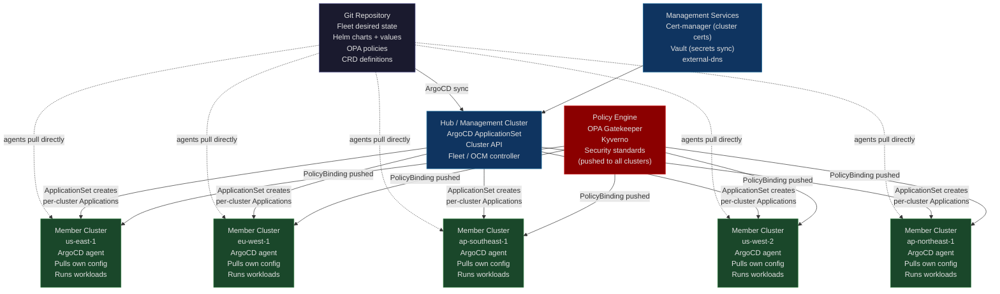
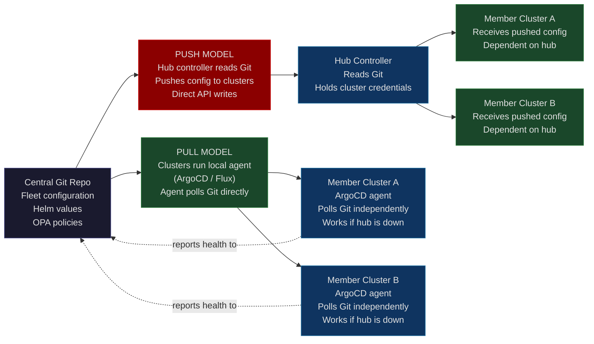
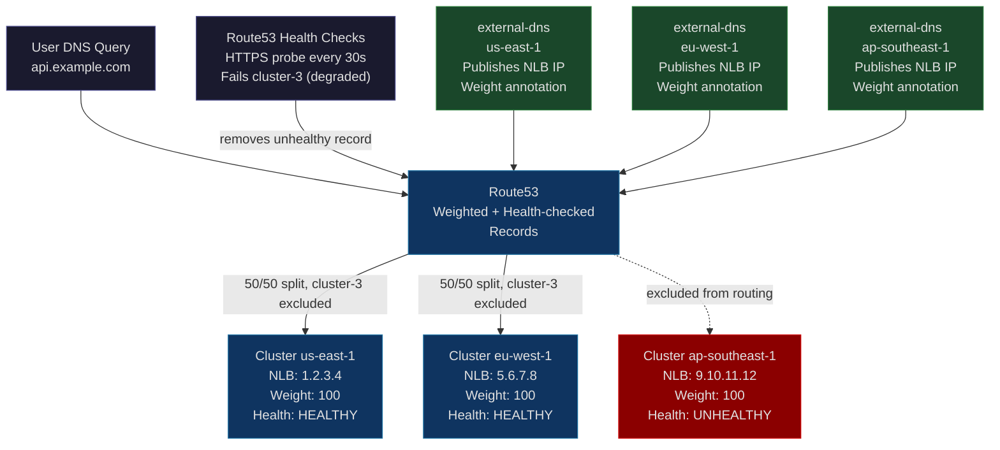

# Chapter 36: Multi-Cluster Federation — Orchestrating Orchestrators

**"Running one Kubernetes cluster at scale is hard. Running 50 Kubernetes clusters coherently is a completely different class of problem."**

---

## Part I — SPARK

### The Cold Open

The infrastructure team had built something genuinely impressive. Forty-seven Kubernetes clusters — one per region per cloud provider, plus management clusters — serving a global SaaS platform with 99.99% uptime SLA. The platform team was proud of the architecture: each cluster was sovereign, independently operable, blast-radius-bounded. A failure in `ap-southeast-1` would never cascade to `us-east-1`. The on-call runbook was clean, the escalation paths were clear, and the post-mortem backlog was short.

Then a dependency vulnerability was disclosed on a Tuesday afternoon. CVE-2024-XXXX: remote code execution in a widely deployed sidecar container, CVSS score 9.8. The security team's policy was unambiguous: Severity-1 CVEs require a patched container running in all production clusters within 4 hours of disclosure. Not recommended. Required. SLA-contractual.

The platform engineer on call pulled up the affected service. It was deployed on all 47 clusters, one ArgoCD Application per cluster, all pointing at the same Helm chart in the same Git repository. The fix was straightforward: bump the sidecar image tag in the Helm chart's `values.yaml`, commit, push. She did it in four minutes.

Then she opened the ArgoCD UI.

Forty-seven applications. Forty-seven "OutOfSync" badges. The ArgoCD sync policy was set to `manual` — the team had learned the hard way, after a bad Helm chart change auto-synced to all 47 clusters simultaneously, that auto-sync without any staged rollout was an outage waiting to happen. Each of those 47 applications needed a manual sync trigger. She started clicking.

After clicking through the ArgoCD UI for 11 applications — navigating to each application, hitting "Sync," confirming, waiting for the health check to go green — she switched to the CLI.

```bash
for cluster in $(argocd cluster list -o json | jq -r '.[].name'); do
  argocd app sync "app-${cluster}" --timeout 120 &
done
wait
```

The script launched 47 concurrent sync operations. ArgoCD started syncing all 47 clusters simultaneously. Three clusters failed their health checks — the sidecar image pull timed out because the container registry hit its rate limit under the simultaneous pull load. The ArgoCD applications for those three clusters went `Degraded`. Now she needed to investigate three separate clusters, determine if the degradation was the sync itself or the underlying application, and re-run the sync.

The security patch reached all 47 clusters 6 hours and 23 minutes after the CVE disclosure. The SLA window was 4 hours. The breach was logged. The post-mortem was filed. The conclusion was obvious: the team had a deployment mechanism for single clusters. They did not have a deployment mechanism for a fleet.

---

### The Uncomfortable Truth

The false belief runs deep in Kubernetes-native organizations: *"multi-cluster is just running your deployment pipeline N times."* This belief is a natural extrapolation from single-cluster thinking, and it holds long enough to be convincing. It holds for 3 clusters. It holds, shakily, for 8 clusters. By 15 clusters it's showing cracks, and by 47 clusters it has broken cleanly through the floor.

What the belief misses is the second-order problem. Managing workloads across N clusters is not N times the problem of managing workloads in one cluster. It is N-squared, because every cluster must be coordinated with every other cluster along multiple independent dimensions simultaneously: software versions, API versions, operator versions, node pool configurations, certificate expiry, security policies, network policies, CRD schemas, admission webhook configurations, and config drift introduced by the last emergency manual intervention that someone did at 3 AM and forgot to commit to Git.

A single cluster has one desired state and one actual state. Drift between them is detectable in one place. A fleet of 47 clusters has 47 desired states (which may differ by region or environment) and 47 actual states, each drifting independently. Manual cluster access — whether through `kubectl exec`, direct API writes, or `helm upgrade` on a local machine — creates invisible state that GitOps never sees. Over time, clusters diverge from each other in ways that are invisible until they matter: a feature flag that works in `us-east-1` fails in `eu-west-1` because someone manually patched a ConfigMap six months ago.

The correct mental reframe: treat your cluster fleet the same way Kubernetes treats a pod fleet. You don't manage 10,000 pods by SSHing into each one. You declare desired state and let a control loop reconcile. The same discipline applies to clusters: declare desired state, reconcile automatically, and alert on anything that diverges for more than a configurable tolerance window.

---

## Part II — FORGE

### The Mental Model: The Franchise Coordination Model

Consider a global franchise restaurant chain — a hundred locations in a dozen countries, each operated by a local franchisee. Each location can serve customers independently, even if the central headquarters building is unreachable. The local manager knows the menu, operates the kitchen, handles staffing. A network outage between Paris and Chicago does not stop the Chicago location from serving burgers.

But headquarters defines the menu that all locations follow. Headquarters mandates food safety standards that all locations must pass. Headquarters can roll out a new item — or recall a contaminated ingredient — to all locations simultaneously, with a staged process: 5 pilot locations first, validate results, then the next 20, then all 100. A franchisee can customize within limits: local vegetarian options, regional promotions, local opening hours. But the core menu, the safety standards, and the brand identity come from headquarters through a defined coordination mechanism, not through the franchisee calling headquarters for permission on every decision.

This is **The Franchise Coordination Model** for multi-cluster Kubernetes. Each cluster (franchise location) runs independently and serves workloads (customers) without requiring a live connection to the management cluster (headquarters). The management cluster defines the base configuration, mandates the security policies, and orchestrates fleet-wide rollouts. Individual cluster teams can customize within the bounds defined by the platform team. The coordination mechanism is declarative and pull-based: clusters pull their desired state from a central source of truth rather than receiving imperative commands.



The pull model vs push model distinction matters operationally: in the pull model, each cluster's ArgoCD agent independently polls the Git repository for changes. If the hub cluster is unreachable, member clusters continue reconciling from Git directly — workloads are not affected. In the push model, a central controller sends configuration to clusters. Hub unavailability halts configuration propagation, though already-running workloads continue. Most production architectures use pull for workloads and push for security policies.



---

### The Dissection

#### The Multi-Cluster Taxonomy

Multi-cluster architectures have three cluster roles and four topology patterns. Getting the terminology right matters because different tools are designed for different topologies.

**Cluster roles:**

- **Management cluster**: runs the federation control plane (ArgoCD, Cluster API, OCM hub). May not run production workloads. If it goes down, existing workloads in member clusters continue, but new deployments are blocked.
- **Member cluster**: runs application workloads. Managed by the management cluster. Should be independently operable.
- **Hub cluster**: runs both management services and workloads. Simpler to start with; creates a blast radius concern at scale.

**Topology patterns:**

- **Hub-spoke**: one management cluster, N member clusters. Simplest. Scales to ~100 clusters before hub becomes a bottleneck.
- **Hierarchical**: management clusters manage management clusters. Used by hyperscalers with thousands of clusters.
- **Mesh**: each cluster connects to every other cluster. Used for service-to-service discovery and traffic routing, not configuration management.
- **Federated namespaces**: a logical namespace spans multiple clusters. Objects created in the federated namespace are replicated to all member clusters. KubeFed tried this; it proved too complex.

#### Cluster API: GitOps for Cluster Lifecycle

Cluster API (CAPI) extends Kubernetes with CRDs that represent cluster infrastructure: `Cluster`, `MachineDeployment`, `Machine`, `MachineHealthCheck`. With CAPI, you manage cluster lifecycle (create, scale, upgrade, delete) using the same `kubectl apply` workflow you use for application deployments. The management cluster runs CAPI controllers that reconcile the desired cluster state against cloud provider APIs.

```yaml
# A complete EKS cluster definition in CAPI
# Apply this to the management cluster — CAPI will call the AWS API to create it
apiVersion: cluster.x-k8s.io/v1beta1
kind: Cluster
metadata:
  name: prod-us-east-1
  namespace: clusters
  labels:
    environment: production
    region: us-east-1
    cloud: aws
spec:
  clusterNetwork:
    pods:
      cidrBlocks: ["10.100.0.0/16"]
    services:
      cidrBlocks: ["172.20.0.0/16"]
  infrastructureRef:
    apiVersion: infrastructure.cluster.x-k8s.io/v1beta2
    kind: AWSManagedCluster
    name: prod-us-east-1
  controlPlaneRef:
    apiVersion: controlplane.cluster.x-k8s.io/v1beta2
    kind: AWSManagedControlPlane
    name: prod-us-east-1-control-plane
---
apiVersion: controlplane.cluster.x-k8s.io/v1beta2
kind: AWSManagedControlPlane
metadata:
  name: prod-us-east-1-control-plane
  namespace: clusters
spec:
  region: us-east-1
  version: "1.31"
  sshKeyName: platform-ops-key
  eksClusterName: prod-us-east-1
  # EKS add-ons managed by CAPI
  addons:
    - name: vpc-cni
      version: "v1.18.1-eksbuild.3"
    - name: coredns
      version: "v1.11.1-eksbuild.9"
    - name: kube-proxy
      version: "v1.31.0-eksbuild.5"
---
apiVersion: infrastructure.cluster.x-k8s.io/v1beta2
kind: AWSManagedMachinePool
metadata:
  name: prod-us-east-1-workers
  namespace: clusters
spec:
  eksNodegroupName: workers
  instanceType: m7i.2xlarge
  scaling:
    minSize: 10
    maxSize: 100
  availabilityZones:
    - us-east-1a
    - us-east-1b
    - us-east-1c
  labels:
    role: worker
    environment: production
```

When this manifest is applied to the management cluster, the CAPI AWS provider calls `eks.CreateCluster`, waits for the cluster to be active, then calls `eks.CreateNodegroup`. The cluster registers itself with the management cluster's kubeconfig. ArgoCD, which is also running on the management cluster, immediately sees the new cluster and begins applying the ApplicationSet to it. Cluster lifecycle + application deployment in one GitOps workflow: **CAPI + ArgoCD = a cluster factory**.

#### ArgoCD ApplicationSet: The Right Tool for Fleet Deployment

The single biggest operational improvement for multi-cluster ArgoCD users is migrating from manually-created per-cluster Applications to ApplicationSets with a ClusterGenerator. An ApplicationSet is a single resource in the ArgoCD namespace that watches for registered clusters and creates one ArgoCD Application per cluster, automatically.

```yaml
# applicationset-fleet.yaml
# One ApplicationSet to create one Application per production cluster
apiVersion: argoproj.io/v1alpha1
kind: ApplicationSet
metadata:
  name: frontend-service
  namespace: argocd
spec:
  # Generators produce a list of parameters; one Application is created per entry
  generators:
    - clusters:
        # Only target clusters with this label
        selector:
          matchLabels:
            environment: production
        # Values from the cluster Secret are available as template parameters
        values:
          revision: "main"
          replicaCount: "3"

    # Override specific values per cluster using a merge generator
    - merge:
        mergeKeys:
          - server
        generators:
          - clusters:
              selector:
                matchLabels:
                  environment: production
          - list:
              elements:
                # ap-southeast-1 has higher traffic, needs more replicas
                - server: https://ap-southeast-1.k8s.example.com
                  values.replicaCount: "6"
                # eu-west-1 has data residency requirements — different image registry
                - server: https://eu-west-1.k8s.example.com
                  values.imageRegistry: eu.gcr.io/my-project

  # Template for each Application
  template:
    metadata:
      # Application name is unique per cluster: "frontend-service-us-east-1"
      name: "frontend-service-{{name}}"
      namespace: argocd
      annotations:
        # Track which cluster this Application targets
        argocd.argoproj.io/cluster-name: "{{name}}"
    spec:
      project: production

      source:
        repoURL: https://gitlab.example.com/platform/helm-charts.git
        targetRevision: "{{values.revision}}"
        path: charts/frontend-service
        helm:
          valueFiles:
            - values.yaml
            # Per-environment override file
            - "values-{{metadata.labels.environment}}.yaml"
          parameters:
            - name: replicaCount
              value: "{{values.replicaCount}}"
            - name: imageRegistry
              value: "{{values.imageRegistry}}"

      destination:
        server: "{{server}}"
        namespace: frontend

      syncPolicy:
        automated:
          prune: true
          selfHeal: true
        syncOptions:
          - CreateNamespace=true
          - PrunePropagationPolicy=foreground
        retry:
          limit: 5
          backoff:
            duration: 30s
            factor: 2
            maxDuration: 5m
```

When a new cluster is registered with ArgoCD and labeled `environment: production`, the ApplicationSet controller automatically creates a new Application for that cluster. This is **auto-enrollment**: a new cluster appearing in the fleet immediately receives all applications that target its labels, with no manual intervention from the platform team.

The security patch scenario from the cold open becomes: bump the image tag in `values.yaml`, commit, and all 47 Application resources automatically show `OutOfSync`. With `automated.selfHeal: true`, ArgoCD begins syncing them without manual trigger — but with proper rate limiting to avoid the registry rate-limit problem.

#### Fleet (Rancher): Opinionated Multi-Cluster Management

Rancher Fleet is an alternative to ArgoCD ApplicationSet that builds multi-cluster management as a first-class concept rather than layering it on top of single-cluster tooling. Fleet introduces `Bundle` resources that target multiple clusters using label selectors, with built-in support for per-cluster value overrides.

```yaml
# fleet-bundle.yaml — Deploy to all production clusters
# Apply this to the Fleet management cluster
apiVersion: fleet.cattle.io/v1alpha1
kind: Bundle
metadata:
  name: frontend-service
  namespace: fleet-default
spec:
  # Source: a directory in a Git repo
  targets:
    # Deploy to all clusters labeled environment=production
    - clusterSelector:
        matchLabels:
          environment: production
      name: production-all-regions

    # Override for high-traffic APAC clusters
    - clusterSelector:
        matchLabels:
          environment: production
          region: ap-southeast-1
      name: apac-high-traffic
      helm:
        values:
          replicaCount: 6
          autoscaling:
            maxReplicas: 30

  helm:
    chart: frontend-service
    repo: https://charts.example.com
    version: "1.4.2"
    values:
      replicaCount: 3
      image:
        tag: v2.1.4-patch-cve-2024-xxxx  # The security patch
      autoscaling:
        enabled: true
        minReplicas: 3
        maxReplicas: 15

  # Rollout strategy: don't update all clusters simultaneously
  rolloutStrategy:
    # Partition into waves: 1 cluster, then 10%, then the rest
    partitions:
      - name: canary
        maxNew: 1
      - name: wave-1
        clusterSelector:
          matchLabels:
            wave: "1"
      - name: all
        clusterSelector: {}
```

Fleet's rollout partitions provide built-in progressive delivery that the raw ApplicationSet approach lacks. The `maxNew: 1` in the canary partition means Fleet applies the change to exactly one cluster and pauses until that cluster is healthy. Only then does the rollout proceed to the next partition.

#### OCM: The CNCF Approach to Multi-Cluster Placement

Open Cluster Management (OCM) takes a different architectural approach: instead of the hub pushing configuration, the hub provides a *placement API* that expresses "where should this workload run?" and cluster agents pull their own assigned workloads.

```yaml
# OCM: Express placement intent — run this workload on 2 clusters in us-east
apiVersion: cluster.open-cluster-management.io/v1beta2
kind: Placement
metadata:
  name: frontend-placement
  namespace: default
spec:
  numberOfClusters: 2

  clusterSets:
    - production-us

  predicates:
    - requiredClusterSelector:
        labelSelector:
          matchLabels:
            region: us-east-1

  prioritizerPolicy:
    mode: Additive
    configurations:
      # Prefer clusters with more available CPU
      - scoreCoordinate:
          builtIn: ResourceAllocatableMemory
        weight: 2
      # Prefer clusters with fewer existing replicas (spread the workload)
      - scoreCoordinate:
          builtIn: Steady
        weight: 1
---
# ManifestWork: the actual content to deploy to selected clusters
apiVersion: work.open-cluster-management.io/v1
kind: ManifestWork
metadata:
  # This is applied to the "placement decision" clusters automatically
  name: frontend-service
  namespace: cluster-us-east-1a  # namespace = cluster name in OCM
spec:
  workload:
    manifests:
      - apiVersion: apps/v1
        kind: Deployment
        metadata:
          name: frontend
          namespace: production
        spec:
          replicas: 3
          selector:
            matchLabels:
              app: frontend
          template:
            metadata:
              labels:
                app: frontend
            spec:
              containers:
                - name: frontend
                  image: us-east1-docker.pkg.dev/myproject/frontend:v2.1.4
                  ports:
                    - containerPort: 8080
```

OCM's placement engine accounts for cluster capacity when scheduling workloads, making it more than a configuration distributor — it's a workload scheduler at the fleet level.

#### Lessons from KubeFed's Failure

KubeFed (Kubernetes Federation v2) deserves study because its failure shaped every subsequent multi-cluster tool. KubeFed's approach: define federated versions of every Kubernetes resource type. `FederatedDeployment`, `FederatedService`, `FederatedConfigMap`, `FederatedSecret`. A federated resource would specify a template (the base resource) plus overrides per cluster.

The problems were fatal. The API surface area was enormous — every new CRD in the ecosystem required a corresponding `FederatedCRD`. The override syntax was complex and YAML-verbose. The controller was a single point of failure. Propagation errors were difficult to debug. And critically: the model required the hub cluster to be reachable for *any* change to propagate, violating the franchise resilience property.

OCM, Fleet, and Argo ApplicationSet all learned from KubeFed: don't replicate the Kubernetes API surface at the federation layer. Instead, use the existing Kubernetes resource types and add fleet-level targeting metadata (labels, placement rules) to control distribution. This keeps the federation layer thin and the cluster agent layer simple.

#### Network Connectivity: Cilium ClusterMesh

Multi-cluster networking has two distinct problems: control plane connectivity (clusters registering with each other for management purposes) and data plane connectivity (pods in cluster A reaching pods in cluster B directly, or via a shared service discovery mechanism).

Cilium ClusterMesh solves the data plane problem by sharing cluster-level Cilium KVStores, enabling direct pod-to-pod routing across cluster boundaries without a VPN tunnel for each connection.

```bash
# Enable ClusterMesh on two EKS clusters
# Both clusters must use Cilium as their CNI

# Cluster 1 (us-east-1)
cilium clustermesh enable \
  --context kind-us-east-1 \
  --service-type LoadBalancer

# Cluster 2 (eu-west-1)
cilium clustermesh enable \
  --context kind-eu-west-1 \
  --service-type LoadBalancer

# Connect the clusters (bidirectional — run from either cluster)
cilium clustermesh connect \
  --context kind-us-east-1 \
  --destination-context kind-eu-west-1

# Verify connectivity
cilium clustermesh status --context kind-us-east-1

# Enable global service: a Service that spans both clusters
# Pods in eu-west-1 can reach this service; requests are load-balanced
# across pods in BOTH clusters based on policy
```

```yaml
# A GlobalService that spans both clusters
# Pods in either cluster resolve "frontend-svc.production.svc.cluster.local"
# and Cilium routes to the nearest healthy pod, regardless of cluster
apiVersion: v1
kind: Service
metadata:
  name: frontend-svc
  namespace: production
  annotations:
    # Mark this service as global — participate in ClusterMesh routing
    service.cilium.io/global: "true"
    # Prefer local cluster pods; only route cross-cluster if local pods are unavailable
    service.cilium.io/shared: "false"
spec:
  selector:
    app: frontend
  ports:
    - port: 80
      targetPort: 8080
  type: ClusterIP
```

#### Detecting and Alerting on Configuration Drift

GitOps promises that cluster state matches Git state. In practice, clusters drift because of: emergency manual changes (`kubectl apply -f` without committing to Git), partial sync failures where 3 of 4 objects synced but the 4th failed silently, operator version differences across clusters, and admission webhook mutations that modify objects after ArgoCD writes them.

A drift alert pipeline using ArgoCD's sync status is the minimum viable safety net:

```yaml
# PrometheusRule: alert if any ArgoCD Application is out of sync for > 5 minutes
# This catches both "operator forgot to commit" and "sync stuck in error state"
apiVersion: monitoring.coreos.com/v1
kind: PrometheusRule
metadata:
  name: argocd-drift-alerts
  namespace: monitoring
spec:
  groups:
    - name: argocd.drift
      interval: 30s
      rules:
        # Alert when any Application is OutOfSync for > 5 minutes
        - alert: ArgoCDApplicationOutOfSync
          expr: |
            argocd_app_info{sync_status="OutOfSync"} == 1
          for: 5m
          labels:
            severity: warning
            team: platform
          annotations:
            summary: "ArgoCD Application {{ $labels.name }} out of sync for > 5m"
            description: |
              Application {{ $labels.name }} in cluster {{ $labels.dest_server }}
              has been OutOfSync since {{ $value }}. Check: argocd app diff {{ $labels.name }}

        # Alert when any Application is in a Degraded health state
        - alert: ArgoCDApplicationDegraded
          expr: |
            argocd_app_info{health_status="Degraded"} == 1
          for: 2m
          labels:
            severity: critical
            team: platform
          annotations:
            summary: "ArgoCD Application {{ $labels.name }} is Degraded"

        # Alert when a cluster becomes unreachable by ArgoCD
        - alert: ArgoCDClusterUnreachable
          expr: |
            argocd_cluster_connection_status == 0
          for: 3m
          labels:
            severity: critical
            team: platform
          annotations:
            summary: "ArgoCD cannot reach cluster {{ $labels.server }}"
            description: "ArgoCD has lost connectivity to {{ $labels.server }}. Sync operations will fail."
```

#### Global Load Balancing Across Clusters

Exposing a service globally across clusters requires a DNS layer that understands cluster health. The standard stack: `external-dns` running in each member cluster, publishing service IPs to Route53 (or equivalent), with weighted or latency-based routing policies.

```yaml
# In each member cluster: a Service with external-dns annotations
# external-dns reads these annotations and creates weighted Route53 records
apiVersion: v1
kind: Service
metadata:
  name: api-gateway
  namespace: production
  annotations:
    # external-dns creates: api.example.com → this cluster's NLB
    external-dns.alpha.kubernetes.io/hostname: api.example.com
    # Weight for this cluster in Route53 weighted routing (0-255)
    external-dns.alpha.kubernetes.io/aws-weight: "100"
    # Health check: Route53 only routes to this cluster if endpoint is healthy
    external-dns.alpha.kubernetes.io/aws-health-check-id: "hc-0a1b2c3d"
    # TTL: short TTL for fast failover (30s → Route53 propagation ~30s)
    external-dns.alpha.kubernetes.io/ttl: "30"
spec:
  type: LoadBalancer
  selector:
    app: api-gateway
  ports:
    - port: 443
      targetPort: 8443
```

When a cluster fails health checks, Route53 removes its weight from the routing table. Traffic shifts to remaining healthy clusters within one TTL period (30 seconds in this configuration). This is the baseline global failover mechanism; for latency-based routing, replace `aws-weight` annotations with `aws-region` and enable Route53 latency-based routing.



#### Tradeoffs: Centralized vs Decentralized Control

The architectural tension in multi-cluster management is between centralized control (simpler mental model, single point of failure) and decentralized control (resilient, more complex to implement).

**Centralized control (push model):** The hub cluster holds all cluster credentials and pushes configuration to member clusters. Advantages: one place to audit all changes, one place to enforce policies, simple mental model. Disadvantages: hub becomes a single point of failure for configuration changes; if hub is unreachable during an incident, operators cannot push config updates to member clusters; compromise of the hub compromises all clusters.

**Decentralized control (pull model):** Each cluster runs an agent (ArgoCD, Flux) that polls Git directly. The hub cluster aggregates status but does not hold credentials with write access to member clusters. Advantages: resilient to hub failure; blast radius of hub compromise is limited to read access. Disadvantages: harder to enforce ordering (deploy to canary cluster first, wait, then others); harder to implement fleet-wide atomic changes.

**The production resolution:** Most mature platform teams use a hybrid. Workload configuration is pull-based (each cluster's ArgoCD agent polls Git independently). Security policies (OPA Gatekeeper constraints, Kyverno policies, network policies) are push-based from a central policy engine, because security policies must not be optional and must reach all clusters regardless of per-cluster agent health. Cluster lifecycle (create, upgrade, delete) is managed through the hub using Cluster API. This combination gives you resilience for workloads, guarantees for security policy, and GitOps for cluster lifecycle.

---

## Part III — WIRE

### The War Room

#### The Cloudflare Global Configuration Deployment Failure (2019)

On July 2, 2019, Cloudflare experienced a 27-minute global outage affecting all Cloudflare PoPs simultaneously. CPU utilization spiked to 100% on all servers in every data center, dropping throughput by 82%. The root cause was a single change to the Cloudflare WAF (Web Application Firewall) that introduced a catastrophically inefficient regular expression — and the change was deployed to every cluster in the Cloudflare fleet simultaneously, in 27 seconds, via their global configuration push system.

The regex in question used excessive backtracking. Processing a single HTTP request against the new WAF ruleset required billions of CPU cycles instead of thousands. Every Cloudflare server, processing real traffic, saturated its CPUs within seconds of receiving the configuration update.

The mechanism that made this catastrophic rather than localized was the global push: Cloudflare's internal configuration distribution system treated WAF rule updates as urgent and propagated them to all PoPs as fast as the network could carry them. There was no concept of "deploy to 1 PoP first, validate, then proceed." The entire fleet of clusters received the pathological change before any human could observe the CPU metric spike and intervene.

The postmortem that Cloudflare published is required reading for anyone building multi-cluster configuration distribution. The key lessons, reframed for a Kubernetes fleet:

```mermaid
gantt
    title Cloudflare Global Outage — July 2, 2019
    dateFormat HH:mm
    axisFormat %H:%M

    section Pre-Incident
    Normal global operations                    :done,    pre1, 13:00, 00:42
    WAF rule update authored, reviewed          :done,    pre2, 13:30, 00:15
    Code review approved (regex not profiled)   :done,    pre3, 13:42, 00:03

    section Deployment
    WAF update committed to deployment system   :active,  dep1, 13:45, 00:01
    Global config push begins                   :crit,    dep2, 13:45, 00:00
    Update reaches first PoP                    :crit,    dep3, 13:45, 00:01
    CPU spike observed: PoP 1                   :crit,    cpu1, 13:46, 00:01
    Update reaches 50% of global fleet          :crit,    dep4, 13:46, 00:01
    CPU spike across all PoPs simultaneously    :crit,    cpu2, 13:46, 00:01
    Traffic throughput drops 82%                :crit,    drop, 13:47, 00:27

    section Incident Response
    PagerDuty fires — all regions down          :active,  ir1, 13:47, 00:03
    Incident commander convened                 :active,  ir2, 13:50, 00:05
    Root cause hypothesized (WAF update)        :active,  ir3, 13:55, 00:08
    WAF rule rollback initiated                 :active,  ir4, 14:03, 00:05
    Rollback propagated to global fleet         :active,  ir5, 14:07, 00:07
    Traffic restored globally                   :done,    ir6, 14:14, 00:03

    section Post-Incident
    Post-mortem written                         :done,    pm1, 15:00, 02:00
    Regex profiling gate added to WAF CI        :done,    pm2, 17:00, 01:00
    Progressive deployment implemented          :done,    pm3, 18:00, 03:00
    1-PoP canary → 1% → 10% → 100% staging     :done,    pm4, 21:00, 02:00
```

**Translating Cloudflare's failure to a Kubernetes fleet context:**

The equivalent scenario in a 47-cluster ArgoCD fleet: a Helm chart change that introduces a CPU-intensive init container is synced to all 47 clusters via ApplicationSet with `automated.selfHeal: true` and no partition-based rollout. Every cluster deploys the new version simultaneously. If the init container has a bug that causes pods to crash-loop, all 47 clusters simultaneously experience degraded application availability before any monitoring system fires a first alert.

The fix Cloudflare implemented — and the fix any multi-cluster operator should implement — is progressive delivery with mandatory health gates between stages:

```yaml
# Progressive ApplicationSet: deploy to canary cluster, then 10%, then all
# Uses ArgoCD's syncPolicy with wave-based ordering
apiVersion: argoproj.io/v1alpha1
kind: ApplicationSet
metadata:
  name: frontend-service-progressive
  namespace: argocd
spec:
  generators:
    - list:
        elements:
          # Wave 0: canary (1 cluster, manually selected, latest version)
          - cluster: prod-us-east-1a
            wave: "0"
            syncWave: "0"
            auto_sync: "true"
          # Wave 1: 10% of fleet (5 of 47 clusters)
          - cluster: prod-us-east-1b
            wave: "1"
            syncWave: "1"
            auto_sync: "false"  # Manual gate: platform team enables after wave-0 health check
          - cluster: prod-eu-west-1a
            wave: "1"
            syncWave: "1"
            auto_sync: "false"
          # ... remaining wave-1 clusters
          # Wave 2: all remaining clusters
          - cluster: prod-ap-southeast-1a
            wave: "2"
            syncWave: "2"
            auto_sync: "false"
          # ... remaining clusters

  template:
    metadata:
      name: "frontend-service-{{cluster}}"
    spec:
      source:
        repoURL: https://gitlab.example.com/platform/helm-charts.git
        targetRevision: main
        path: charts/frontend-service
      destination:
        server: "https://{{cluster}}.k8s.example.com"
        namespace: production
      syncPolicy:
        automated:
          # auto_sync drives this — wave-0 syncs automatically
          # Wave-1 and wave-2 require manual enablement after health validation
          prune: false
          selfHeal: "{{auto_sync}}" == "true"
```

The health gate between waves should be automated using a tool like Argo Rollouts or a custom controller that queries the application's error rate from the LGTM stack before enabling the next wave's sync. A 5-minute observation window with p99 error rate < 0.1% is the minimum gate. This would have contained the Cloudflare incident to a single PoP — detectable, reversible, non-catastrophic.

The blast radius principle applies at every level: a change that affects 1 cluster is an incident. A change that affects 47 clusters simultaneously is a crisis. The platform team's job is to ensure that *all* changes, including "safe" configuration updates, pass through a staged delivery pipeline that bounds the blast radius by default.

---

### The Lab

#### Hands-On: Two-Cluster ArgoCD ApplicationSet with Progressive Delivery

This lab requires two accessible Kubernetes clusters. The simplest setup uses two `kind` clusters.

```bash
# Step 1: Create two kind clusters
kind create cluster --name cluster-a
kind create cluster --name cluster-b

# Step 2: Install ArgoCD on cluster-a (this becomes the management cluster)
kubectl --context kind-cluster-a create namespace argocd
kubectl --context kind-cluster-a apply -n argocd \
  -f https://raw.githubusercontent.com/argoproj/argo-cd/stable/manifests/install.yaml

# Wait for ArgoCD to be ready
kubectl --context kind-cluster-a wait --for=condition=available \
  deployment/argocd-server -n argocd --timeout=120s

# Step 3: Port-forward ArgoCD UI
kubectl --context kind-cluster-a port-forward svc/argocd-server -n argocd 8080:443 &

# Get initial admin password
ARGOCD_PASS=$(kubectl --context kind-cluster-a get secret argocd-initial-admin-secret \
  -n argocd -o jsonpath='{.data.password}' | base64 -d)
echo "ArgoCD admin password: $ARGOCD_PASS"

# Login
argocd login localhost:8080 --username admin --password $ARGOCD_PASS --insecure

# Step 4: Register cluster-b with ArgoCD
# Extract cluster-b's kubeconfig server and credentials
CLUSTER_B_SERVER=$(kubectl --context kind-cluster-b config view \
  --minify -o jsonpath='{.clusters[0].cluster.server}')

argocd cluster add kind-cluster-b --name cluster-b

# Step 5: Label the clusters for ApplicationSet targeting
argocd cluster set https://127.0.0.1:PORT \
  --label environment=production \
  --label wave=canary

argocd cluster set $CLUSTER_B_SERVER \
  --label environment=production \
  --label wave=main

# Verify clusters are registered
argocd cluster list
# OUTPUT:
# SERVER                          NAME        VERSION  STATUS   MESSAGE
# https://kubernetes.default.svc  in-cluster  1.31     Unknown
# https://127.0.0.1:XXXX          cluster-b   1.31     Successful
```

```yaml
# Save as applicationset-two-cluster.yaml
# A minimal ApplicationSet deploying an nginx test app to both clusters
apiVersion: argoproj.io/v1alpha1
kind: ApplicationSet
metadata:
  name: test-nginx
  namespace: argocd
spec:
  generators:
    - clusters:
        selector:
          matchLabels:
            environment: production
        values:
          # Default: auto-sync enabled for canary, disabled for main
          autoSync: "false"

    - merge:
        mergeKeys:
          - server
        generators:
          - clusters:
              selector:
                matchLabels:
                  wave: canary
          - list:
              elements:
                - values.autoSync: "true"

  template:
    metadata:
      name: "test-nginx-{{name}}"
    spec:
      project: default
      source:
        repoURL: https://charts.bitnami.com/bitnami
        chart: nginx
        targetRevision: 18.x.x
        helm:
          parameters:
            - name: replicaCount
              value: "2"
      destination:
        server: "{{server}}"
        namespace: test-nginx
      syncPolicy:
        syncOptions:
          - CreateNamespace=true
```

```bash
# Apply the ApplicationSet
kubectl --context kind-cluster-a apply -f applicationset-two-cluster.yaml

# Watch ArgoCD create Applications
argocd app list
# OUTPUT:
# NAME                    CLUSTER    NAMESPACE   PROJECT  STATUS     HEALTH
# test-nginx-cluster-a    cluster-a  test-nginx  default  Synced     Healthy
# test-nginx-cluster-b    cluster-b  test-nginx  default  OutOfSync  Missing

# cluster-a (canary, wave=canary) synced automatically
# cluster-b (wave=main, autoSync=false) is OutOfSync, waiting for gate

# Simulate the health gate: check cluster-a is healthy, then enable cluster-b
CLUSTER_A_STATUS=$(argocd app get test-nginx-cluster-a \
  -o json | jq -r '.status.health.status')
echo "Cluster A health: $CLUSTER_A_STATUS"

if [ "$CLUSTER_A_STATUS" == "Healthy" ]; then
  echo "Canary cluster healthy — enabling sync to main cluster"
  argocd app sync test-nginx-cluster-b
else
  echo "Canary cluster NOT healthy — halting rollout"
  exit 1
fi

# Watch the progressive sync
argocd app wait test-nginx-cluster-b --health --timeout 120

# Final state: both clusters synced
argocd app list
# OUTPUT:
# NAME                    CLUSTER    NAMESPACE   PROJECT  STATUS  HEALTH
# test-nginx-cluster-a    cluster-a  test-nginx  default  Synced  Healthy
# test-nginx-cluster-b    cluster-b  test-nginx  default  Synced  Healthy

# Watch the ApplicationSet controller logs during rollout
kubectl --context kind-cluster-a logs -n argocd \
  -l app.kubernetes.io/name=argocd-applicationset-controller -f
```

**Expected ApplicationSet controller log output during the progressive sync:**

```
time="2025-11-15T14:23:41Z" level=info msg="Reconciling ApplicationSet" controller=applicationset name=test-nginx
time="2025-11-15T14:23:41Z" level=info msg="Generated 2 applications from ApplicationSet"
time="2025-11-15T14:23:41Z" level=info msg="Application test-nginx-cluster-a already in sync, skipping"
time="2025-11-15T14:23:41Z" level=info msg="Application test-nginx-cluster-b has autoSync=false, skipping automated sync"
time="2025-11-15T14:25:33Z" level=info msg="Syncing application test-nginx-cluster-b (triggered by CLI)"
time="2025-11-15T14:25:34Z" level=info msg="Application test-nginx-cluster-b sync started, phase=Sync"
time="2025-11-15T14:25:58Z" level=info msg="Application test-nginx-cluster-b sync completed, health=Healthy"
```

**Stretch Goal:** Implement an automated health gate using a Kubernetes Job that runs between wave-0 and wave-1. The Job queries Prometheus for the canary cluster's error rate, and only patches the ApplicationSet to enable wave-1 auto-sync if the error rate is below threshold. This is the foundation of how Shopify, Airbnb, and Stripe implement multi-cluster progressive delivery at scale — the same progressive delivery discipline used for pod-level Argo Rollouts, applied one abstraction layer higher, to the fleet.

---

### The Loose Thread

You now have the full orchestration stack: a right-sized, fsync-aware Kubernetes control plane (Chapter 35) and a fleet coordination layer that deploys to that fleet with staged, observable rollouts (Chapter 36). The infrastructure can receive workloads. It can scale them. It can distribute them globally with automatic failover.

What runs on top of this infrastructure, at the most demanding end of the compute spectrum, are AI training and inference workloads. Training a large language model requires orchestrating thousands of GPU nodes in gang-scheduled jobs, coordinating cross-node gradient synchronization via RDMA networks, and managing checkpoint storage at petabyte scale — all of which pushes every assumption in Kubernetes scheduler design past its design envelope.

Part 6 starts where the current-generation orchestration stack runs out of road: GPU cluster scheduling, InfiniBand network topology awareness, and the specific etcd and API server modifications that hyperscalers make to run Kubernetes clusters where a single job allocates 10,000 GPUs across 1,000 nodes. The platform you built in Part 5 is the foundation. The workloads in Part 6 are what stress-test it into its next evolution.
