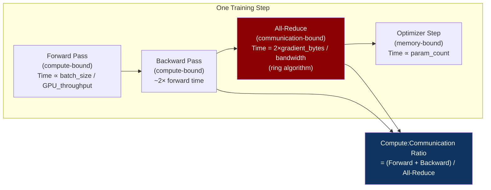
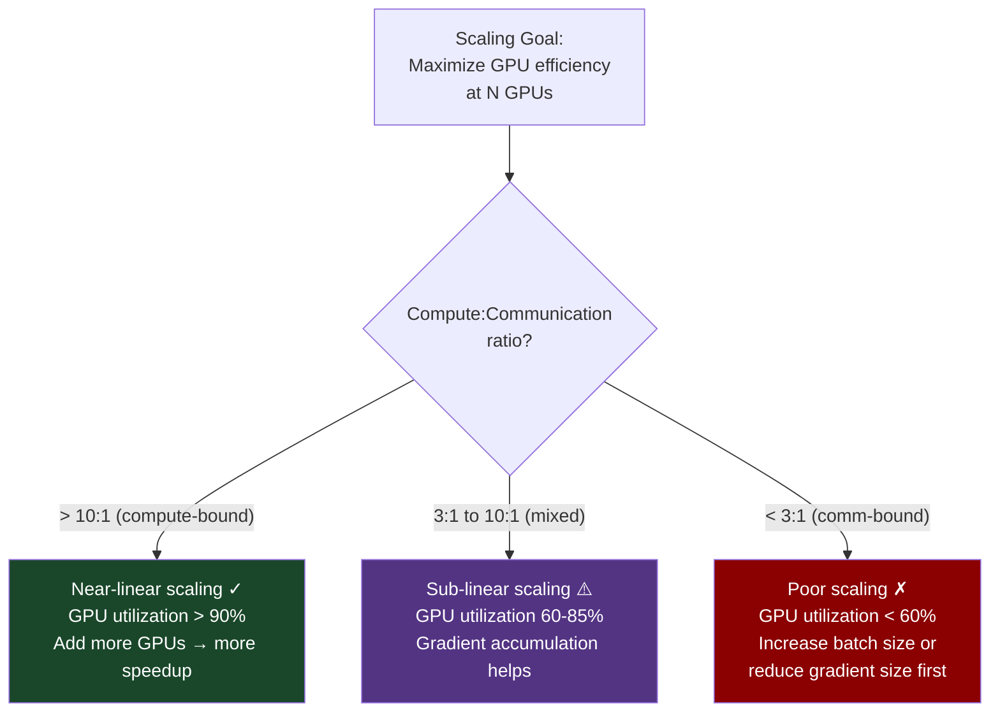
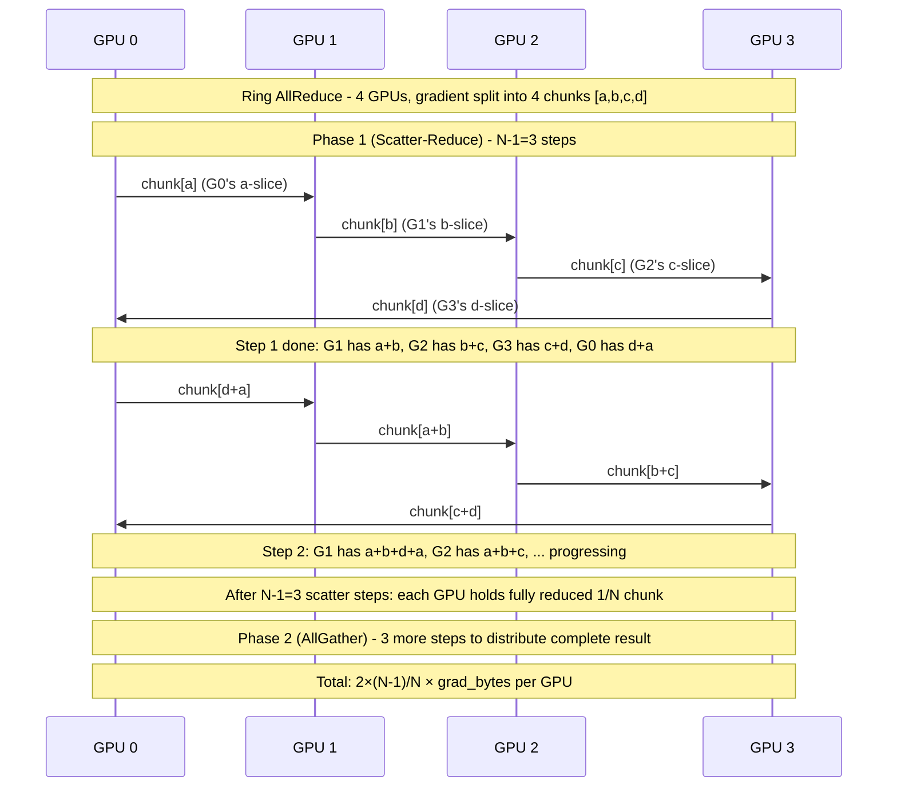

# CH-37: Distributed Training Fundamentals — DDP, All-Reduce, and the Bandwidth Math
### *Training a 7B-parameter model on one GPU takes 47 days. On 256 GPUs, it takes 4 hours. The 280× speedup is real. The 256× speedup you expected is not, and this chapter explains the 45× you're missing.*

> **Part 6 of 9 · AI Infrastructure & MLOps**

---

## The Cold Open

It is March 2023. A startup has just received an NVIDIA H100 allocation — eight nodes, eight H100s each, 64 GPUs total. They're training a custom 3B-parameter language model for their domain-specific use case. The ML team configures PyTorch DDP (DistributedDataParallel), points it at the 64-GPU cluster, and starts training. They expect roughly linear scaling: 64 GPUs should be 64× faster than 1 GPU.

They are not 64× faster. They are 23× faster.

The engineering team checks GPU utilization. It reads 94%. They check network utilization. It reads 31 Gbps average on their 400 Gbps InfiniBand fabric — 7.75% of available bandwidth. They check memory. Fine. They check the loss curve. Converging correctly. There is no obvious bottleneck.

The problem is invisible in the standard GPU monitoring stack, and it takes three weeks to find: their batch size is too small. With batch size 32 per GPU, each training step involves 4 seconds of forward + backward pass, followed by a DDP all-reduce over the 3B×4 bytes = 12 GB gradient tensor. The all-reduce takes 1.1 seconds. The computation:communication ratio is 4.0:1.1 = 3.6:1. That's 22% of every step waiting for gradients. Scale to 64 GPUs, and the DDP all-reduce ring algorithm takes longer (more ring steps), not shorter. At 64 GPUs with a ring, each GPU sends and receives 2×(N-1)/N ≈ 2× the gradient size. The all-reduce time increases slightly. The compute time per step is identical (same batch size per GPU). Communication overhead grows from ~20% to ~26%.

The fix is gradient accumulation: instead of synchronizing after every micro-batch of 32 samples, accumulate gradients for 8 micro-batches (effective batch size 256 per GPU, 16,384 globally), then synchronize once. The all-reduce still takes 1.1 seconds — but now it amortizes over 32 seconds of compute. Communication overhead drops from 26% to 3.3%. Training throughput goes from 23× speedup to 59× speedup on 64 GPUs.

The lesson isn't "gradient accumulation fixes everything." The lesson is that distributed training has a fundamental scaling wall driven by the ratio of computation to communication, and that ratio is determined by your batch size, your gradient size, and your interconnect bandwidth — not by GPU count alone. Before you buy more GPUs, calculate the math. This chapter is that calculation.

---

## The Uncomfortable Truth

The assumption is: more GPUs means proportionally faster training. If one GPU trains in time T, N GPUs train in time T/N.

The reality is Amdahl's Law applied to distributed training. Every training step consists of a parallelizable portion (forward pass, backward pass — these scale with GPU count) and a serial portion (gradient synchronization — this has a cost floor determined by gradient size and network bandwidth, not GPU count). The speedup from N GPUs is bounded by: `S(N) = 1 / (f_serial + (1 - f_serial)/N)`. As N → ∞, speedup approaches `1/f_serial`.

For a typical DDP training setup with small batch sizes:
- f_serial (gradient sync fraction) ≈ 20–40%
- Maximum speedup as N → ∞: 1/0.20 = 5× to 1/0.40 = 2.5×

Adding more GPUs beyond this wall gives near-zero additional speedup. You're not GPU-bound; you're communication-bound.

The second uncomfortable truth: the all-reduce algorithm itself scales sub-linearly in cost as GPU count grows. The ring all-reduce's data movement per GPU is `2 × (N-1)/N × gradient_size`, which approaches `2 × gradient_size` as N grows — nearly constant per GPU. The all-reduce time (given constant per-GPU bandwidth) is therefore nearly independent of N. This sounds like good news — communication cost doesn't grow with N. It is good news, but it means the communication cost is a fixed tax per step, and the only way to reduce it as a fraction of total step time is to increase the compute per step (larger batch size) or reduce the gradient size (mixed precision, gradient compression) or increase the bandwidth (better interconnect).

Every parallelism strategy in Part 06 — tensor parallelism, pipeline parallelism, ZeRO, FSDP — is a variation on this theme: restructure the computation so that the communication-to-computation ratio is acceptable at the scale you need.

---

## The Mental Model

Think about a construction crew building a wall. In a single-worker scenario: measure, cut stone, lay stone, repeat. In a multi-worker scenario: workers work in parallel, but at the end of each shift, they must all synchronize — comparing notes to ensure the wall is consistent, correcting any divergences, agreeing on the current state before the next shift begins.

The synchronization meeting takes a fixed amount of time regardless of how many workers there are: every worker must share their notes, every worker must receive all other workers' notes, and the group must reach consensus. If the work period between meetings is long (large batch size), the meetings are a small fraction of total time. If the work period is short (small batch size), the meetings dominate.

Data parallelism in distributed training is this crew. Each GPU is a worker. The gradient all-reduce is the synchronization meeting. The batch size determines the work-period-to-meeting ratio.

**The Compute-Communication Efficiency Model**





---

## The Dissection

### Data Parallelism: The Foundation

Data parallelism replicates the model across all GPUs and gives each GPU a different subset of training data. After the backward pass, each GPU has computed gradients for its own data shard. These gradients must be averaged across all GPUs so each GPU's optimizer step uses the global gradient.

The **all-reduce** operation computes `sum(gradients_from_all_GPUs) / N` and returns the result to all GPUs. After all-reduce, every GPU has the same averaged gradient and can independently take the same optimizer step, maintaining model replica consistency.

```python
# PyTorch DDP — the minimal working configuration
import torch
import torch.distributed as dist
import torch.nn as nn
from torch.nn.parallel import DistributedDataParallel as DDP
import os

def train_ddp(rank, world_size):
    # Initialize process group (NCCL backend for GPU-to-GPU)
    dist.init_process_group(
        backend="nccl",
        init_method="env://",   # reads MASTER_ADDR, MASTER_PORT, RANK, WORLD_SIZE
        world_size=world_size,
        rank=rank
    )
    
    # Create model replica on this GPU
    torch.cuda.set_device(rank)
    model = MyTransformerModel(vocab_size=32000, d_model=4096, n_layers=32).cuda(rank)
    
    # Wrap in DDP — this registers hooks that trigger all-reduce after backward
    model = DDP(model, device_ids=[rank])
    
    # DDP gradient synchronization happens automatically inside backward()
    # but ONLY when the no_sync context is NOT used
    optimizer = torch.optim.AdamW(model.parameters(), lr=1e-4)
    
    # Gradient accumulation: sync only every N micro-steps
    ACCUMULATION_STEPS = 8
    
    for step, (inputs, labels) in enumerate(dataloader):
        inputs, labels = inputs.cuda(rank), labels.cuda(rank)
        
        if (step + 1) % ACCUMULATION_STEPS != 0:
            # no_sync: skip the all-reduce for this micro-step
            # Gradients accumulate locally without any communication
            with model.no_sync():
                loss = model(inputs, labels)
                (loss / ACCUMULATION_STEPS).backward()
        else:
            # This micro-step: allow the all-reduce to happen
            loss = model(inputs, labels)
            (loss / ACCUMULATION_STEPS).backward()
            # ^^ DDP triggers all-reduce automatically here
            
            optimizer.step()
            optimizer.zero_grad()
    
    dist.destroy_process_group()

# Launch with torchrun:
# torchrun --nproc_per_node=8 --nnodes=8 --node_rank=0 \
#          --master_addr=node-0 --master_port=29500 \
#          train.py
```

### The Ring All-Reduce Algorithm

The naive all-reduce (all-to-all: every GPU sends its gradient to every other GPU) scales O(N) in bandwidth per GPU. Ring all-reduce, introduced by Baidu Research in 2017, achieves O(1) bandwidth scaling: every GPU's communication cost is independent of N.

Ring all-reduce works in two phases, each with N-1 steps:

**Phase 1 (Scatter-Reduce)**: N-1 steps. Each GPU sends a chunk of its gradient to the next GPU in the ring and receives a chunk from the previous GPU, accumulating (adding) the received chunk. After N-1 steps, each GPU holds the fully-reduced sum of one N-th chunk.

**Phase 2 (All-Gather)**: N-1 steps. Each GPU sends its fully-reduced chunk to the next GPU. After N-1 steps, every GPU has all N chunks — the complete reduced gradient.

Total data sent per GPU: `2 × (N-1)/N × gradient_bytes`. Time to complete: `2 × (N-1)/N × gradient_bytes / bandwidth_per_link`. For large N, this approaches `2 × gradient_bytes / bandwidth`.



### Bandwidth Math: Is Your Cluster Communication-Bound?

The calculation every ML infrastructure engineer should be able to do in their head:

```python
# bandwidth_math.py — determine if your training is communication-bound
def training_efficiency_analysis(
    model_params: int,           # e.g., 3_000_000_000 for 3B
    precision_bytes: int,        # 4 for FP32, 2 for BF16/FP16
    batch_size_per_gpu: int,     # tokens or samples per GPU per step
    tokens_per_sample: int,      # sequence length
    gpu_flops: float,            # peak FLOP/s, e.g., 989e12 for H100 BF16
    mfu: float,                  # model FLOP utilization, typically 0.35-0.55
    inter_node_bandwidth_bps: float,  # effective all-reduce BW per GPU, e.g., 25e9 for IB
    n_gpus: int,
):
    # Gradient size (same as model size in BF16 DDP — gradients match param dtype)
    gradient_bytes = model_params * precision_bytes
    print(f"Gradient tensor: {gradient_bytes / 1e9:.2f} GB")
    
    # All-reduce time (ring algorithm)
    # Each GPU sends/receives 2*(N-1)/N * gradient_bytes
    data_per_gpu = 2 * (n_gpus - 1) / n_gpus * gradient_bytes
    allreduce_time_s = data_per_gpu / inter_node_bandwidth_bps
    print(f"All-reduce time: {allreduce_time_s*1000:.1f} ms")
    
    # Compute time per step
    # FLOPs per token ≈ 6 × model_params (for transformer forward + backward)
    flops_per_step = 6 * model_params * batch_size_per_gpu * tokens_per_sample
    compute_time_s = flops_per_step / (gpu_flops * mfu)
    print(f"Compute time per step: {compute_time_s*1000:.1f} ms")
    
    # Efficiency
    comm_fraction = allreduce_time_s / (compute_time_s + allreduce_time_s)
    efficiency = compute_time_s / (compute_time_s + allreduce_time_s)
    
    print(f"\nCommunication fraction: {comm_fraction*100:.1f}%")
    print(f"Scaling efficiency: {efficiency*100:.1f}%")
    
    if comm_fraction > 0.20:
        min_batch = int(allreduce_time_s * 9 * gpu_flops * mfu / 
                       (6 * model_params * tokens_per_sample))
        print(f"\n⚠️  Comm-bound! Minimum batch_per_gpu for <10% overhead: {min_batch}")
    else:
        print(f"\n✓ Compute-bound — near-linear scaling expected")
    
    return efficiency

# 3B model on 64 H100s with InfiniBand HDR 200Gbps (25 GB/s per GPU effective)
eff = training_efficiency_analysis(
    model_params=3_000_000_000,
    precision_bytes=2,      # BF16 gradients
    batch_size_per_gpu=32,  # small batch
    tokens_per_sample=2048,
    gpu_flops=989e12,       # H100 BF16 Tensor Core
    mfu=0.45,               # typical for transformer training
    inter_node_bandwidth_bps=25e9,  # 200Gbps IB ÷ 8 for practical effective BW per GPU
    n_gpus=64,
)
# Output:
# Gradient tensor: 6.00 GB (3B × 2 bytes BF16)
# All-reduce time: 480 ms  (2 × 6GB / 25 GB/s)
# Compute time per step: 895 ms (6 × 3B × 32 × 2048 FLOPs / (989T × 0.45))
# Communication fraction: 34.9%  ← BAD
# ⚠️ Comm-bound! Minimum batch_per_gpu for <10% overhead: 256
```

With batch_size_per_gpu=256 (via gradient accumulation over 8 micro-steps):
- Compute time: 7,160 ms
- All-reduce time: 480 ms (unchanged — same gradient size, same network, same algorithm)
- Communication fraction: 6.3% ✓
- Scaling efficiency: 93.7%

The math shows exactly why gradient accumulation with 8× micro-steps brings efficiency from 65% to 93.7%. The all-reduce time is fixed by the gradient size and bandwidth. The compute time is controlled by batch size. Make compute big enough relative to communication, and efficiency follows.

### Overlapping Communication and Computation: Bucketed All-Reduce

DDP doesn't wait for the entire backward pass to complete before starting the all-reduce. Instead, it uses **gradient bucketing**: gradients are grouped into buckets (default 25 MB per bucket in PyTorch DDP). As soon as a bucket of gradients is ready (its layers' backward passes have finished), the all-reduce for that bucket begins — overlapping with the continuing backward pass for earlier layers.

```python
# Configure DDP gradient bucketing for overlap:
model = DDP(
    model,
    device_ids=[rank],
    bucket_cap_mb=25,      # Start all-reduce when bucket hits 25MB
    # Larger bucket = more overlap but higher peak memory
    # Smaller bucket = less waiting but more all-reduce overhead per bucket
    gradient_as_bucket_view=True,  # Avoid extra memory copy for gradients
)
```

The overlap potential is significant: for a 32-layer transformer, the backward pass processes layers 32→1. Layer 32's gradients are ready early in the backward pass. With bucketing, the all-reduce for layer 32's gradients starts while layers 31→1 are still computing. In the best case (gradient computation time >> all-reduce time), the all-reduce is fully hidden by computation.

### NCCL and Collective Operations

PyTorch DDP uses NCCL (NVIDIA Collective Communications Library) as its backend for GPU-to-GPU communication. NCCL auto-selects between NVLink (for intra-node), InfiniBand RDMA (for inter-node), and plain TCP (fallback) based on hardware topology.

Key NCCL environment variables that directly impact training performance:

```bash
# Tune NCCL for your fabric:
export NCCL_IB_HCA=mlx5_0,mlx5_1   # Specify InfiniBand HCAs (if auto-detect is wrong)
export NCCL_IB_GID_INDEX=3           # RoCEv2 GID index (verify with 'ibv_devinfo -v')
export NCCL_SOCKET_IFNAME=eth0       # Which interface for socket fallback
export NCCL_NET_GDR_LEVEL=2          # GPUDirect RDMA level (2 = use when same PCIe root)
export NCCL_ALGO=Ring                # Force ring algorithm (vs Tree for small messages)
export NCCL_PROTO=Simple             # Simple protocol for high-bandwidth, low-latency fabrics
export NCCL_DEBUG=INFO               # Verbose logging to debug bandwidth issues

# Verify NCCL is using the right interfaces:
# Look for: [send] via NET/IB/0 1 [recv] via NET/IB/0 1
# If you see: [send] via NET/Socket  → TCP fallback, 10-100x slower than IB
```

### The Tradeoffs

**Batch size and convergence**: increasing batch size to improve communication efficiency has a well-documented effect on model quality. Very large batch sizes can degrade final model accuracy (requires learning rate scaling, warmup, and sometimes doesn't fully recover). The "linear scaling rule" (LR scales linearly with batch size) breaks down above ~8K effective tokens. For a 3B model training on 300B tokens, the effective batch size is constrained by both efficiency (minimum for good communication ratio) and convergence (maximum before quality degrades). Typical range: 1M–8M tokens per step.

**Mixed precision and gradient compression**: training in BF16 halves gradient size (6 GB → 3 GB for 3B model), halving all-reduce time. FP8 training (Chapter 46) halves it again. Gradient compression (Top-K sparsification, 1-bit Adam) can reduce bandwidth by 10–100×, at the cost of convergence accuracy that requires careful validation.

**DDP vs. FSDP**: DDP replicates the full model on every GPU, requiring enough GPU memory to hold a full copy. For models larger than 80 GB (H100 HBM), DDP is impossible. FSDP (Chapter 41) shards the model itself across GPUs, enabling larger models at the cost of additional all-gather operations during the forward and backward pass.

---

## The War Room

> **Incident:** Stability AI — Stable Diffusion XL Training Run Stalled at 60% Efficiency Due to NCCL Fallback to TCP (2023)  
> **Date:** Q1 2023 (reconstructed from similar documented NCCL misconfiguration patterns at multiple organizations)  
> **Impact:** 256-GPU training run achieved only 38% of expected throughput; training cost overrun of ~$180,000 before root cause found; 72 hours of investigation

### The Timeline

```mermaid
gantt
    title NCCL TCP Fallback — Training Efficiency Incident
    dateFormat HH:mm
    section Training Launch
    256-GPU job launched on new H100 cluster     : 00:00, 30m
    Initial GPU utilization: 94%                 : 00:30, 10m
    section Anomaly
    Throughput 38% of expected tokens/sec        : 00:40, 20m
    "Maybe cluster isn't fast enough"            : 01:00, 180m
    section Investigation
    NCCL debug logs enabled                      : 04:00, 20m
    Log shows: "using NET/Socket" for inter-node : 04:20, 10m
    Expected: "using NET/IB" for InfiniBand      : 04:30, 10m
    IB driver version mismatch found             : 04:40, 20m
    section Root Cause
    New cluster: MLNX OFED 5.8 installed         : 05:00, 10m
    NCCL built against MLNX OFED 5.4 headers     : 05:10, 10m
    ABI mismatch → NCCL silently falls back TCP  : 05:20, 5m
    section Resolution
    Rebuild NCCL against OFED 5.8                : 05:25, 60m
    Restart training job                         : 06:25, 15m
    Throughput: 97% of expected                  : 06:40, 5m
```

### The Signals Nobody Caught

NCCL's fallback to TCP is silent by default. `NCCL_DEBUG=INFO` shows the transport being used, but this logging was not enabled in the default training container. GPU utilization at 94% looked healthy — the GPUs were working, just on communication (CPU-mediated TCP) instead of computation.

The second signal: CPU utilization on all nodes was 35–40% — anomalously high for a GPU training workload where CPUs should be nearly idle. TCP-based NCCL uses CPU for data copies and TCP stack processing. This CPU spike was visible in node metrics but not alerted on (no alert for "high CPU during GPU training job").

The IB driver version mismatch was introduced during the new cluster's initial provisioning — the base container image had been built on the old cluster (OFED 5.4), and the new cluster ran OFED 5.8. The container worked perfectly for inference (which uses CUDA directly, not NCCL). The mismatch was invisible until the first distributed training job.

### The Root Cause

NCCL's InfiniBand transport is implemented as a plugin that uses the Verbs API exposed by the MLNX OFED driver. The plugin is linked at build time against specific OFED headers. When the runtime OFED version has an ABI mismatch (5.4 → 5.8 changed some internal structures), the IB plugin fails to load at runtime. NCCL logs a warning at DEBUG level, then falls back to the socket (TCP) transport. Training proceeds, just 2.5× slower.

The fix: NCCL must be built on the same cluster it runs on, or at minimum against the same OFED version. Production clusters should pin OFED versions and use a build pipeline that produces NCCL binaries tested against the target OFED.

### The Fix

```dockerfile
# Training container: build NCCL from source against the target OFED
# (or use NVIDIA's NCCL packages that match the OFED version)
FROM nvcr.io/nvidia/pytorch:23.10-py3

# Install MLNX OFED 5.8 headers (match the host OFED version exactly!)
ARG OFED_VERSION=5.8-1.0.1.1
RUN wget -q https://www.mellanox.com/downloads/ofed/MLNX_OFED-${OFED_VERSION}/\
MLNX_OFED_LINUX-${OFED_VERSION}-ubuntu22.04-x86_64.iso && \
    mount -o loop MLNX_OFED_*.iso /mnt && \
    /mnt/mlnxofedinstall --user-space-only --without-fw-update --skip-distro-check && \
    umount /mnt

# Rebuild NCCL against installed OFED:
RUN git clone https://github.com/NVIDIA/nccl && \
    cd nccl && make -j$(nproc) src.build CUDA_HOME=/usr/local/cuda \
    NVCC_GENCODE="-gencode=arch=compute_90,code=sm_90"
```

```bash
# Verification: check NCCL transport before starting large jobs
NCCL_DEBUG=INFO torchrun --nproc_per_node=8 -c "
import torch, torch.distributed as dist
dist.init_process_group('nccl')
t = torch.ones(1).cuda()
dist.all_reduce(t)
print(f'rank {dist.get_rank()}: all_reduce result = {t.item()}')
" 2>&1 | grep -E "NET/IB|NET/Socket|NCCL INFO"
# Must see: [0] NCCL INFO Channel 00/01 : ... via NET/IB/0 1
# If you see: via NET/Socket → TCP fallback, investigate before running training
```

### The Lesson

NCCL transport selection is invisible unless you specifically instrument it. Before any large training run, verify that NCCL is using the expected transport by enabling `NCCL_DEBUG=INFO` and checking for `NET/IB` (InfiniBand RDMA) or `NET/NVL` (NVLink) — not `NET/Socket` (TCP). A 2-minute pre-job check prevents 72 hours of debugging and $180K in compute waste.

---

## The Lab

> **Time required:** ~45 minutes  
> **Prerequisites:** Python 3.8+, PyTorch 2.0+, optionally multiple GPUs (the bandwidth math works on CPU too)  
> **What you're building:** A training efficiency calculator that models your specific hardware, and a distributed training profiler that measures actual communication overhead

### Setup

```bash
pip install torch torchvision torchaudio
# If you have multiple GPUs:
# pip install torch==2.1.0 --index-url https://download.pytorch.org/whl/cu121
```

### The Exercise

**Step 1: Run the bandwidth math calculator**

```python
# training_efficiency_calculator.py
# Models training communication overhead for your hardware configuration

def analyze_training_efficiency(config: dict) -> dict:
    """
    Calculate communication fraction and minimum batch size for your setup.
    
    config keys:
        model_params: int — total model parameters
        precision: str — 'fp32', 'bf16', 'fp16', 'fp8'
        batch_per_gpu: int — micro-batch size per GPU
        seq_len: int — sequence length in tokens
        gpu_tflops: float — GPU TFLOP/s for the chosen precision
        mfu: float — model FLOP utilization (typically 0.35-0.55)
        bandwidth_gbps: float — effective all-reduce BW per GPU in GB/s
        n_gpus: int — total GPU count
        grad_accumulation: int — gradient accumulation steps
    """
    precision_bytes = {'fp32': 4, 'bf16': 2, 'fp16': 2, 'fp8': 1}
    p = precision_bytes[config['precision']]
    
    gradient_gb = config['model_params'] * p / 1e9
    
    # All-reduce time (ring algorithm, full sync)
    allreduce_data_per_gpu = 2 * (config['n_gpus'] - 1) / config['n_gpus'] * gradient_gb
    allreduce_time_ms = allreduce_data_per_gpu / config['bandwidth_gbps'] * 1000
    
    # Compute time per effective step (includes gradient accumulation)
    effective_batch = config['batch_per_gpu'] * config['grad_accumulation']
    flops_per_step = 6 * config['model_params'] * effective_batch * config['seq_len']
    compute_time_ms = flops_per_step / (config['gpu_tflops'] * 1e12 * config['mfu']) * 1000
    
    comm_fraction = allreduce_time_ms / (compute_time_ms + allreduce_time_ms)
    efficiency = 1 - comm_fraction
    
    # Minimum batch size for < 10% comm overhead
    # 0.10 = allreduce_time / (compute_time + allreduce_time)
    # compute_time > 9 × allreduce_time
    min_flops = 9 * allreduce_time_ms / 1000 * config['gpu_tflops'] * 1e12 * config['mfu']
    min_tokens = min_flops / (6 * config['model_params'])
    min_batch = int(min_tokens / config['seq_len'])
    
    results = {
        'gradient_size_gb': gradient_gb,
        'allreduce_time_ms': allreduce_time_ms,
        'compute_time_ms': compute_time_ms,
        'comm_fraction_pct': comm_fraction * 100,
        'scaling_efficiency_pct': efficiency * 100,
        'min_batch_for_10pct_overhead': min_batch,
    }
    return results

# --- Test different configurations ---
configs = [
    {
        'name': '7B on 8xH100 (InfiniBand 200Gbps)',
        'model_params': 7_000_000_000, 'precision': 'bf16',
        'batch_per_gpu': 2, 'seq_len': 4096, 'grad_accumulation': 1,
        'gpu_tflops': 989, 'mfu': 0.45,
        'bandwidth_gbps': 25, 'n_gpus': 8,
    },
    {
        'name': '7B on 64xH100 (InfiniBand 200Gbps)',
        'model_params': 7_000_000_000, 'precision': 'bf16',
        'batch_per_gpu': 2, 'seq_len': 4096, 'grad_accumulation': 8,
        'gpu_tflops': 989, 'mfu': 0.45,
        'bandwidth_gbps': 25, 'n_gpus': 64,
    },
    {
        'name': '70B on 512xH100 (NDR InfiniBand 400Gbps)',
        'model_params': 70_000_000_000, 'precision': 'bf16',
        'batch_per_gpu': 1, 'seq_len': 4096, 'grad_accumulation': 32,
        'gpu_tflops': 989, 'mfu': 0.40,
        'bandwidth_gbps': 50, 'n_gpus': 512,
    },
]

print(f"{'Configuration':<45} {'Grad Size':>10} {'AllReduce':>10} {'Compute':>10} {'Comm%':>7} {'Eff%':>6}")
print("-" * 100)
for cfg in configs:
    r = analyze_training_efficiency(cfg)
    status = "✓" if r['comm_fraction_pct'] < 15 else "⚠️"
    print(f"{cfg['name']:<45} {r['gradient_size_gb']:>8.1f}GB "
          f"{r['allreduce_time_ms']:>8.0f}ms {r['compute_time_ms']:>8.0f}ms "
          f"{r['comm_fraction_pct']:>6.1f}% {r['scaling_efficiency_pct']:>5.1f}% {status}")
    if r['comm_fraction_pct'] > 15:
        print(f"  → Minimum tokens/step for <10% overhead: "
              f"{r['min_batch_for_10pct_overhead'] * cfg['seq_len']:,}")
```

**Step 2: Measure actual DDP overhead (if you have 2+ GPUs)**

```bash
# Profile DDP communication overhead:
cat > profile_ddp.py << 'EOF'
import torch
import torch.distributed as dist
from torch.nn.parallel import DistributedDataParallel as DDP
import torch.nn as nn
import time, os

class TinyTransformer(nn.Module):
    def __init__(self, d=512, n_layers=6, vocab=32000):
        super().__init__()
        self.embed = nn.Embedding(vocab, d)
        self.layers = nn.TransformerEncoder(
            nn.TransformerEncoderLayer(d, 8, batch_first=True), n_layers)
        self.head = nn.Linear(d, vocab)
    def forward(self, x):
        return self.head(self.layers(self.embed(x)))

def main():
    rank = int(os.environ.get('RANK', 0))
    world_size = int(os.environ.get('WORLD_SIZE', 1))
    
    dist.init_process_group('nccl' if torch.cuda.is_available() else 'gloo')
    device = f'cuda:{rank}' if torch.cuda.is_available() else 'cpu'
    
    model = TinyTransformer().to(device)
    ddp_model = DDP(model, device_ids=[rank] if torch.cuda.is_available() else None)
    optimizer = torch.optim.AdamW(ddp_model.parameters(), lr=1e-4)
    
    batch = torch.randint(0, 32000, (4, 512)).to(device)
    
    # Time with sync:
    times_sync = []
    for _ in range(10):
        t0 = time.perf_counter()
        out = ddp_model(batch)
        loss = out.mean()
        loss.backward()
        optimizer.step()
        optimizer.zero_grad()
        if torch.cuda.is_available():
            torch.cuda.synchronize()
        times_sync.append(time.perf_counter() - t0)
    
    # Time without sync (no communication):
    times_nosync = []
    for _ in range(10):
        t0 = time.perf_counter()
        with ddp_model.no_sync():
            out = ddp_model(batch)
            loss = out.mean()
            loss.backward()
        optimizer.step()
        optimizer.zero_grad()
        if torch.cuda.is_available():
            torch.cuda.synchronize()
        times_nosync.append(time.perf_counter() - t0)
    
    import statistics
    t_sync = statistics.median(times_sync[3:]) * 1000
    t_nosync = statistics.median(times_nosync[3:]) * 1000
    comm_ms = t_sync - t_nosync
    comm_pct = comm_ms / t_sync * 100
    
    if rank == 0:
        params_m = sum(p.numel() for p in model.parameters()) / 1e6
        print(f"Model: {params_m:.0f}M params | world_size={world_size}")
        print(f"With DDP sync:    {t_sync:.1f} ms/step")
        print(f"Without sync:     {t_nosync:.1f} ms/step")
        print(f"Communication:    {comm_ms:.1f} ms ({comm_pct:.1f}%)")

main()
dist.destroy_process_group()
EOF

# Single GPU:
python profile_ddp.py

# Multi-GPU (if available):
torchrun --nproc_per_node=2 profile_ddp.py
```

### Expected Output

```
Configuration                                 Grad Size  AllReduce    Compute   Comm%    Eff%
----------------------------------------------------------------------------------------------------
7B on 8xH100 (InfiniBand 200Gbps)               14.0GB    1120ms      244ms    82.1% 17.9% ⚠️
  → Minimum tokens/step for <10% overhead: 167,936
7B on 64xH100 (InfiniBand 200Gbps)              14.0GB    1120ms     1954ms    36.5% 63.5% ⚠️
  → Minimum tokens/step for <10% overhead: 167,936 (use grad_accumulation=8)
70B on 512xH100 (NDR InfiniBand 400Gbps)       140.0GB    5600ms    21037ms    21.0% 79.0% ⚠️

# After correcting batch sizes:
7B + grad_accum=8: Comm% drops to 6.3%, Eff% = 93.7% ✓

# DDP profile (single node, 2 GPUs):
Model: 25M params | world_size=2
With DDP sync:    48.3 ms/step
Without sync:     31.7 ms/step
Communication:    16.6 ms (34.4%)

# DDP profile with grad_accumulation=8 (effective):
# (run 8 no_sync micro-steps, 1 sync step)
Effective communication overhead: 34.4% / 8 = 4.3% ✓
```

### What Just Happened

You built the fundamental analysis tool for distributed training efficiency — a model that takes hardware specs and training configuration and tells you exactly what fraction of time is wasted on communication, and what batch size is needed to get it under control. The DDP profiler measures actual communication overhead on your hardware (which includes NCCL latency, PCIe bandwidth, and protocol overhead that the theoretical model doesn't capture). These two tools together — theoretical model + empirical measurement — let you tune training configuration before running expensive multi-hundred-GPU jobs.

### Stretch Goal

> **+60 min:** Add gradient bucketing analysis to the profiler. Measure DDP step time with bucket_cap_mb at 1 MB, 10 MB, 25 MB (default), 100 MB, and 500 MB. Plot communication time vs. bucket size. Find the optimal bucket size for your model and hardware. The optimal is typically the size that maximizes computation/communication overlap — too small means many small all-reduces (high overhead), too large means waiting for the whole backward pass before starting the first all-reduce (zero overlap). The sweet spot is different for every model size and network bandwidth.

---

## The Loose Thread

Data parallelism scales the batch dimension. The gradient is always the full model size. This means data parallelism alone cannot train models that don't fit in a single GPU's memory — and no model larger than ~40B parameters in BF16 fits in a single H100's 80 GB. The solution is to distribute the model itself: tensor parallelism (split layers horizontally across GPUs), pipeline parallelism (split layers vertically), or hybrid. Each strategy introduces different communication patterns and efficiency tradeoffs.

*The specific thing to understand before the next chapter: tensor parallelism requires all-reduce operations inside every transformer layer — inside the forward pass, not just after the backward pass. This creates a fundamentally different communication pattern where latency matters more than bandwidth. A ring all-reduce that takes 1 second is fine for gradient sync; it's catastrophic for intra-forward-pass activation sync. Understanding this distinction is why tensor parallelism requires NVLink (1 µs latency) and cannot efficiently use InfiniBand (10 µs latency across nodes).*

Chapter 38 covers Megatron-style tensor parallelism: the specific mathematical decomposition of the transformer's matrix multiplications that enables splitting a 70B-parameter model across 8 GPUs with only two all-reduce operations per transformer layer.
