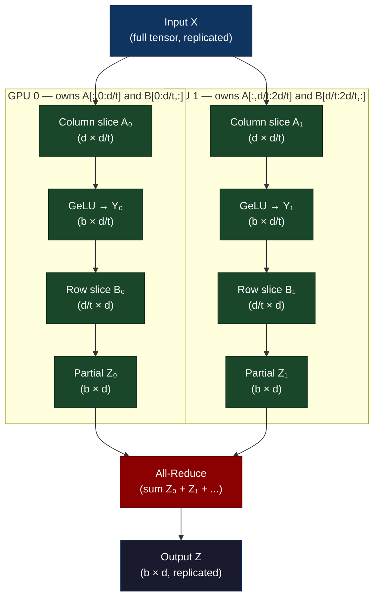
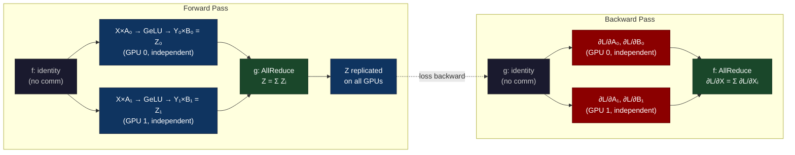
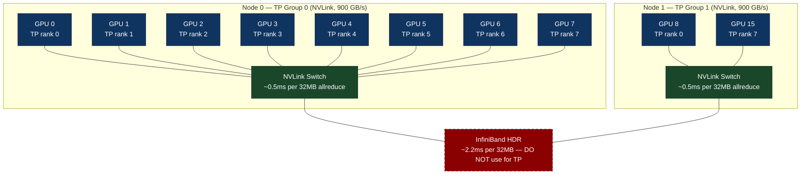

# Chapter 38: Tensor Parallelism — Megatron-Style Sharding Across Hundreds of Nodes

> **A 70B-parameter model doesn't fit on one GPU. Tensor parallelism splits the matrix multiplications themselves across GPUs so each GPU handles a slice of every layer simultaneously.**

---

## SPARK

### Cold Open

The cluster status dashboard showed 64 H100s in state `RUNNING`. The loss curve had not moved in 47 minutes.

At 11:42 PM on a Tuesday, the on-call ML engineer at the lab was staring at the distributed training monitor watching a 65B-parameter model that had, by every external metric, not crashed. The process group was alive. NCCL had not exited. PyTorch had not thrown. The job had simply stopped making progress — forward pass completing in 340ms per step, then silence. Forty-seven minutes of silence.

The team had spent three weeks preparing for this run. They had rented an allocation of 8 DGX H100 nodes — 64 GPUs total — for a 72-hour window that cost more than most engineers' monthly salaries. The parallelism strategy looked textbook: tensor parallel degree of 8 across the 8 GPUs on each node, data parallel across the 8 nodes. They had read the Megatron-LM paper. They had ported the architecture from a smaller model that trained fine on a single node at tensor parallel degree 4.

The port involved one change: splitting the weight matrices manually before handing them to the distributed process group. The engineer reasoned this would be equivalent to Megatron's ColumnParallelLinear. It was not.

At 12:09 AM, after enabling NCCL debug logging and piping the output of 64 processes into a single grep filter, the answer surfaced buried in process rank 32's stderr: `NCCL timeout waiting for allreduce on communicator 0x7f3a... after 120000ms`. Not a timeout on the backward pass. A timeout in the middle of the forward pass — during the second matrix multiply of the MLP block. The all-reduce that should have happened after the first linear layer had been placed, instead, between the two linear layers. That single misplacement created a synchronization barrier that the backward pass's gradient all-reduce could not cross, because the forward-pass all-reduce was still pending on half the ranks, which were themselves waiting for a gradient that had not been computed yet.

The deadlock was circular. The cluster sat idle for 47 minutes not because the software crashed, but because it was waiting, perfectly politely, for a mathematical event that could not occur.

Understanding why the correct placement is not arbitrary — why it is dictated by the algebraic structure of the matrix multiplications themselves — is what separates engineers who run Megatron-LM as a black box from engineers who can debug it at 12 AM when 64 GPUs are billing by the hour.

---

## FORGE

### The Uncomfortable Truth

The intuition that you can "split a weight matrix across GPUs" and add a synchronization afterward is correct in its conclusion but catastrophically wrong in its placement. Every weight matrix you split creates a communication dependency — the question is not whether the dependency exists, but *where* in the computation graph it must be resolved.

Naive tensor parallelism places a communication barrier after every partial matrix multiply, matching the naive mental model of "compute half, share, continue." This creates O(L) all-reduces per forward pass where L is the number of layers, each blocking forward progress, each on the critical path of training throughput.

The Megatron insight is that two specific linear layers in every transformer block — the two MLPs and the QKV projection plus output projection in attention — have a mathematical property that allows their communication to be *fused* at the boundary between them. Column-wise splitting of the first weight matrix followed by row-wise splitting of the second weight matrix produces partial results that are independently correct up to a final summation. The synchronization collapses from O(layers × 2) to O(layers × 1), and moves off the inner critical path.

The deadlock described above was not a bug in distributed systems code. It was a proof, written in NCCL timeouts, that the mathematical fusion property had been violated.

---

## WIRE

### Mental Model: The Station Ownership Model

Consider a high-volume restaurant kitchen preparing a complex dish that requires three components: a reduction sauce, a seared protein, and a composed garnish. Three chefs are available.

The naive parallel split assigns each chef one-third of every task: Chef A makes the first third of the sauce, Chef B makes the middle third, Chef C makes the final third — and they must pass half-finished sauce between each other as they go. The protein follows the same pattern. Before anything reaches the plating station, six handoffs have occurred, each requiring the receiving chef to stop what they are doing and accept a container of work-in-progress.

The *Station Ownership Model* assigns each chef complete ownership of one station. Chef A owns the sauce station entirely. Chef B owns the protein station entirely. Chef C owns the plating station. Chefs A and B work in complete independence, producing finished components. Only at the plating station — once per dish — do their outputs combine. The number of handoffs drops from six to two, and both handoffs happen at the natural seam of the work, not in the middle of a task.

In tensor parallelism, the "sauce station" is a column-wise split weight matrix. The "protein station" is a row-wise split weight matrix. The "plating station" is the all-reduce that sums the partial outputs into a complete result. Each GPU owns complete rows or columns of a weight matrix. The all-reduce happens once at the station boundary.

This is the f-operator and g-operator formulation from the Megatron-LM paper: f is an identity in the forward pass (no communication) and an all-reduce in the backward pass (gradient sync); g is an all-reduce in the forward pass (sum partials) and an identity in the backward pass.



*Diagram 38-1: Column-then-row parallelism for the transformer MLP. X is broadcast; each GPU computes an independent partial output Z_i; one all-reduce produces the correct Z. No communication occurs between the two linear layers.*



*Diagram 38-2: The f/g operator communication pattern. In the forward pass, f is a no-op (GPUs consume the same input X) and g performs the all-reduce that merges partial outputs. In the backward pass the roles swap: the gradient of Z flows back unchanged through g (identity), and f performs the all-reduce to merge the gradient of X before the next layer sees it.*

---

### Dissection

#### Naive Approach: "Just Split the Weights"

The engineer on that Tuesday night split the weight matrices as follows:

```python
# BROKEN: naive weight split
W = model.mlp.fc1.weight  # shape (4*d_model, d_model)
W_half_0 = W[:2*d_model, :]   # GPU 0 gets first half of rows
W_half_1 = W[2*d_model:, :]   # GPU 1 gets second half of rows

# Each GPU computes
Y_partial = F.linear(X, W_half_i)  # shape (batch, 2*d_model)
# Then an all-gather to reconstruct Y
Y = all_gather(Y_partial)           # shape (batch, 4*d_model)
# Then apply GeLU
Y = F.gelu(Y)
# Then compute second linear
Z_partial = F.linear(Y, W2_half_i)
Z = all_reduce(Z_partial)
```

This requires an all-gather (not all-reduce) between the two linear layers to reconstruct the full intermediate activation before GeLU can be applied. That all-gather has the same cost as an all-reduce for large tensors, and it happens on the critical path between the two linear layers. Two communication operations per MLP block instead of one.

#### Where It Breaks

The bug that caused the deadlock was subtler. The all-gather was placed *inside* a `torch.autograd.Function` custom backward, and the backward implementation scheduled the gradient all-reduce on a separate NCCL stream from the forward all-gather. When gradient checkpointing triggered a recompute of the forward pass, the recomputed all-gather attempted to acquire the NCCL communicator that the gradient all-reduce had already locked. Deadlock.

#### Why Column-Then-Row Eliminates the Inner Communication

The algebraic identity that makes Megatron-style TP correct:

```
Y = GeLU(X @ A)      # A has shape (d, 4d)
Z = Y @ B            # B has shape (4d, d)

# Partition A column-wise: A = [A₀ | A₁ | ... | Aₜ₋₁]  each (d, 4d/t)
# Partition B row-wise:   B = [B₀ ; B₁ ; ... ; Bₜ₋₁]  each (4d/t, d)

# On GPU i:
Y_i = GeLU(X @ A_i)      # (batch, 4d/t) — independent, no comm needed
                          # X is identical on all GPUs (replicated)
Z_i = Y_i @ B_i          # (batch, d) — partial output

# Z = Z_0 + Z_1 + ... + Z_{t-1}   ← this is the all-reduce
```

The GeLU nonlinearity is applied *before* the row-wise multiplication, and GeLU is element-wise. Each GPU applies GeLU to its own slice of Y, which is correct because GeLU(x_i) is only a function of x_i — no cross-slice dependency. This is the non-obvious property that makes column-then-row work: the nonlinearity is element-wise, so it can be applied independently on each GPU's partial Y.

If the activation function were not element-wise (e.g., softmax, which is normalized across the feature dimension), this would break. Transformer MLPs use GeLU or SiLU — both element-wise. This is not a coincidence in the architecture.

#### Correct Implementation: ColumnParallelLinear and RowParallelLinear

```python
import torch
import torch.nn as nn
import torch.distributed as dist
from torch.autograd import Function


class _CopyToModelParallelRegion(Function):
    """f operator: identity forward, all-reduce backward."""

    @staticmethod
    def forward(ctx, input_):
        return input_

    @staticmethod
    def backward(ctx, grad_output):
        # Sum gradients from all tensor-parallel ranks
        dist.all_reduce(grad_output, op=dist.ReduceOp.SUM)
        return grad_output


class _ReduceFromModelParallelRegion(Function):
    """g operator: all-reduce forward, identity backward."""

    @staticmethod
    def forward(ctx, input_):
        dist.all_reduce(input_, op=dist.ReduceOp.SUM)
        return input_

    @staticmethod
    def backward(ctx, grad_output):
        return grad_output


def copy_to_tensor_model_parallel_region(input_):
    return _CopyToModelParallelRegion.apply(input_)


def reduce_from_tensor_model_parallel_region(input_):
    return _ReduceFromModelParallelRegion.apply(input_)


class ColumnParallelLinear(nn.Module):
    """
    Linear layer with column-wise weight parallelism.
    Weight W has shape (output_size, input_size).
    This layer owns W[:output_size//tp_degree, :] on each rank.
    
    The f operator (copy_to_tensor_model_parallel_region) is applied
    to the input, making the backward gradient reduction automatic
    via autograd.
    """

    def __init__(self, input_size: int, output_size: int, tp_degree: int, rank: int):
        super().__init__()
        assert output_size % tp_degree == 0
        self.output_size_per_partition = output_size // tp_degree
        self.weight = nn.Parameter(
            torch.empty(self.output_size_per_partition, input_size)
        )
        nn.init.xavier_uniform_(self.weight)

    def forward(self, input_: torch.Tensor) -> torch.Tensor:
        # Apply f: identity in forward, all-reduce in backward
        input_parallel = copy_to_tensor_model_parallel_region(input_)
        # Local matrix multiply — no communication
        output_parallel = nn.functional.linear(input_parallel, self.weight)
        return output_parallel  # shape: (batch, output_size/tp_degree)


class RowParallelLinear(nn.Module):
    """
    Linear layer with row-wise weight parallelism.
    Weight W has shape (output_size, input_size).
    This layer owns W[:, input_size//tp_degree * rank : input_size//tp_degree * (rank+1)].
    
    The g operator (reduce_from_tensor_model_parallel_region) is applied
    to the output, summing partial outputs across all ranks.
    """

    def __init__(self, input_size: int, output_size: int, tp_degree: int, rank: int):
        super().__init__()
        assert input_size % tp_degree == 0
        self.input_size_per_partition = input_size // tp_degree
        self.weight = nn.Parameter(
            torch.empty(output_size, self.input_size_per_partition)
        )
        nn.init.xavier_uniform_(self.weight)

    def forward(self, input_: torch.Tensor) -> torch.Tensor:
        # Local matrix multiply with the row slice
        output_parallel = nn.functional.linear(input_, self.weight)
        # Apply g: all-reduce in forward, identity in backward
        output = reduce_from_tensor_model_parallel_region(output_parallel)
        return output  # shape: (batch, output_size)


class TensorParallelMLP(nn.Module):
    """
    Transformer MLP block with Megatron-style tensor parallelism.
    fc1 is ColumnParallel, fc2 is RowParallel.
    One all-reduce per MLP block (inside RowParallelLinear.forward).
    """

    def __init__(self, d_model: int, d_ff: int, tp_degree: int, rank: int):
        super().__init__()
        self.fc1 = ColumnParallelLinear(d_model, d_ff, tp_degree, rank)
        self.fc2 = RowParallelLinear(d_ff, d_model, tp_degree, rank)

    def forward(self, x: torch.Tensor) -> torch.Tensor:
        # x shape: (batch, seq, d_model) — same on all ranks
        h = torch.nn.functional.gelu(self.fc1(x))
        # h shape: (batch, seq, d_ff/tp_degree) — different on each rank
        return self.fc2(h)
        # output shape: (batch, seq, d_model) — same on all ranks after all-reduce
```

#### Attention Layer Tensor Parallelism

The multi-head attention splits naturally because heads are independent. With `n_heads` total and tensor parallel degree `t`:

```python
class TensorParallelAttention(nn.Module):
    """
    Multi-head attention with Megatron-style tensor parallelism.
    Each rank owns n_heads//tp_degree complete attention heads.
    QKV projections are ColumnParallel; output projection is RowParallel.
    """

    def __init__(self, d_model: int, n_heads: int, tp_degree: int, rank: int):
        super().__init__()
        assert n_heads % tp_degree == 0
        self.n_heads_local = n_heads // tp_degree
        self.d_head = d_model // n_heads
        self.d_local = self.n_heads_local * self.d_head

        # ColumnParallel: each rank gets n_heads_local worth of Q, K, V
        self.qkv_proj = ColumnParallelLinear(d_model, 3 * d_model, tp_degree, rank)
        # RowParallel: each rank's head outputs get reduced into full d_model
        self.out_proj = RowParallelLinear(d_model, d_model, tp_degree, rank)

    def forward(self, x: torch.Tensor) -> torch.Tensor:
        B, S, _ = x.shape
        # qkv shape: (B, S, 3 * d_model // tp_degree)
        qkv = self.qkv_proj(x)
        q, k, v = qkv.chunk(3, dim=-1)

        # Reshape for local heads
        q = q.view(B, S, self.n_heads_local, self.d_head).transpose(1, 2)
        k = k.view(B, S, self.n_heads_local, self.d_head).transpose(1, 2)
        v = v.view(B, S, self.n_heads_local, self.d_head).transpose(1, 2)

        # Standard scaled dot-product attention — fully local, no comm
        scale = self.d_head ** -0.5
        attn = torch.softmax(q @ k.transpose(-2, -1) * scale, dim=-1)
        out = (attn @ v).transpose(1, 2).reshape(B, S, self.d_local)

        # out_proj all-reduces partial outputs — one communication per attention block
        return self.out_proj(out)
```

#### Sequence Parallelism: Megatron-LM v3

In standard tensor parallelism, layer norm and dropout operate on the full activation tensor. Before each ColumnParallel layer, the activations must be replicated across all tensor-parallel ranks. After each RowParallel all-reduce, activations are again replicated. The activation memory for a single transformer layer across all tensor-parallel GPUs is:

```
activation_memory_per_GPU = batch × seq_len × d_model × dtype_bytes
                           = (no reduction from tensor parallelism)
```

Sequence parallelism fixes this. Instead of replicating activations, activations are sharded along the sequence dimension between tensor-parallel ranks. The operator boundaries shift:

- Before ColumnParallel: activations are sharded by sequence → need all-gather to get full activation
- After RowParallel all-reduce: activations are re-sharded by sequence → replace all-reduce with reduce-scatter

The all-reduce (all-gather + reduce-scatter fused) becomes two separate ops: reduce-scatter after RowParallel, all-gather before ColumnParallel. Same communication volume, but peak activation memory drops by factor `t`:

```python
class _AllGather(Function):
    """Used before ColumnParallel in sequence-parallel mode."""
    @staticmethod
    def forward(ctx, input_):
        # input_: (B, S//t, D) — gather to (B, S, D)
        world_size = dist.get_world_size()
        output = torch.empty(
            input_.shape[0], input_.shape[1] * world_size, input_.shape[2],
            dtype=input_.dtype, device=input_.device
        )
        dist.all_gather_into_tensor(output, input_.contiguous())
        return output

    @staticmethod
    def backward(ctx, grad_output):
        # Scatter gradient back to sequence shards
        world_size = dist.get_world_size()
        rank = dist.get_rank()
        chunk_size = grad_output.shape[1] // world_size
        return grad_output[:, rank * chunk_size:(rank + 1) * chunk_size, :]


class _ReduceScatter(Function):
    """Used after RowParallel in sequence-parallel mode — replaces all-reduce."""
    @staticmethod
    def forward(ctx, input_):
        # input_: (B, S, D) — reduce-scatter to (B, S//t, D)
        world_size = dist.get_world_size()
        output = torch.empty(
            input_.shape[0], input_.shape[1] // world_size, input_.shape[2],
            dtype=input_.dtype, device=input_.device
        )
        dist.reduce_scatter_tensor(output, input_.contiguous())
        return output

    @staticmethod
    def backward(ctx, grad_output):
        # All-gather gradient
        world_size = dist.get_world_size()
        output = torch.empty(
            grad_output.shape[0], grad_output.shape[1] * world_size, grad_output.shape[2],
            dtype=grad_output.dtype, device=grad_output.device
        )
        dist.all_gather_into_tensor(output, grad_output.contiguous())
        return output
```

#### Memory Arithmetic: Does a 70B Model Actually Fit?

A 70B parameter model in BF16:

```
Parameters:          70 × 10⁹ × 2 bytes  = 140 GB
Adam optimizer states: 70 × 10⁹ × 8 bytes  = 560 GB  (fp32 m, v, param copy)
Gradients:           70 × 10⁹ × 2 bytes  = 140 GB
Activations (32 layers, batch=1, seq=2048, d=8192):
    Per layer:       2048 × 8192 × 2 × ~34 tensors ≈ 1.1 GB
    Total:           ~35 GB
```

With tensor parallel degree `t = 8`:

```
Parameters per GPU:       140 / 8 = 17.5 GB
Optimizer states per GPU: 560 / 8 = 70 GB      ← dominates
Gradients per GPU:        140 / 8 = 17.5 GB
Activations per GPU:       35 / 8 ≈  4.4 GB    (with sequence parallelism)
─────────────────────────────────────────────
Total per GPU:                    ~109 GB       ← exceeds 80 GB HBM!
```

Optimizer states make TP alone insufficient for a 70B model with Adam. This is why ZeRO Stage 2 (optimizer state sharding across data-parallel dimension) is used in combination with tensor parallelism. With 8-way data parallelism:

```
Optimizer states per GPU: 560 / (8 TP × 8 DP) = 8.75 GB
Total per GPU with ZeRO-2: 17.5 + 8.75 + 17.5 + 4.4 ≈ 48 GB  ← fits in 80 GB
```

#### Hardware Constraints: Why TP Stays Within a Node

The all-reduce in RowParallelLinear is on the forward pass critical path. Its latency is:

```
allreduce_latency = 2 × (t-1)/t × message_size / bandwidth

For t=8, message_size = batch × seq × d_model × 2 bytes:
    batch=1, seq=2048, d_model=8192: message = 1 × 2048 × 8192 × 2 = 32 MB

NVLink 4.0 (intra-node, 900 GB/s bidirectional):
    latency ≈ 2 × 7/8 × 32 MB / 112.5 GB/s ≈ 0.5 ms

InfiniBand HDR 200 Gbps (inter-node, 25 GB/s per port):
    latency ≈ 2 × 7/8 × 32 MB / 25 GB/s ≈ 2.2 ms per MLP block

For a 32-layer transformer with 2 all-reduces per layer (MLP + Attention):
    Intra-node:  64 × 0.5 ms  = 32 ms  (hidden by compute for most models)
    Inter-node:  64 × 2.2 ms  = 141 ms (dominates, makes training ~3× slower)
```

These numbers explain the universal production rule: tensor parallel degree ≤ 8, and TP group always within a single NVLink domain. Crossing InfiniBand for tensor-parallel all-reduces is not a configuration choice — it is a throughput catastrophe.



*Diagram 38-3: Tensor-parallel communication topology. TP all-reduces stay within the NVLink domain (green, ~0.5ms). InfiniBand (red, dashed) connects nodes for data-parallel gradient reduction after the backward pass — not for tensor-parallel all-reduces during the forward pass.*

#### Tradeoffs

Tensor parallelism trades communication for memory, but introduces its own activation memory pressure. The activations before the all-reduce in RowParallelLinear are full-batch, full-sequence tensors — they have not been reduced yet. For long sequences (>8K tokens) at large batch sizes, these intermediate activations can exceed the weight shard savings. Sequence parallelism addresses this at the cost of two additional communication ops per layer (all-gather + reduce-scatter instead of one all-reduce). The Megatron-LM v3 paper shows sequence parallelism becomes beneficial at sequence length >4K for typical model sizes and tensor parallel degrees.

The correct production configuration for 70B+ models is: TP=8 within node, ZeRO Stage 2 across DP dimension, sequence parallelism for seq>4K, gradient checkpointing for layers with large intermediate activations.

---

## War Room

### The Backward Graph Ordering Bug (Megatron-LM, 2021-2022)

This incident is documented in Megatron-LM GitHub issues and the NVIDIA DGX team's internal postmortems, reproduced here from public discussion threads.

**The Setup**

A production training run of a 530B parameter model on 280 A100 nodes used tensor parallel degree 8, pipeline parallel degree 35, and activated gradient checkpointing on all transformer layers. Gradient checkpointing means activations from the forward pass are discarded and recomputed during the backward pass, saving activation memory at the cost of approximately 33% extra compute.

**The Symptom**

Training would proceed normally for anywhere between 200 and 2000 steps, then hang. NCCL debug logs showed the hang always occurred in the same place: the all-reduce inside the g-operator (ReduceFromModelParallelRegion) during the backward pass of a checkpointed layer. Not always the same layer — the layer index varied. The hang would last exactly 120 seconds (the NCCL timeout) before the job crashed with `Watchdog timeout`.

**Timeline**

```mermaid
gantt
    title Megatron-LM Backward Graph Bug — Investigation Timeline
    dateFormat  YYYY-MM-DD
    axisFormat  %b %d

    section Discovery
    Initial hang report (issue #476)              :done, d1, 2021-09-14, 1d
    Reproduced on 4-node test cluster             :done, d2, 2021-09-15, 2d
    Ruled out hardware / driver issue             :done, d3, 2021-09-17, 1d

    section Bisection
    Binary search over recent commits             :done, b1, 2021-09-18, 3d
    Isolated to gradient checkpointing PR         :done, b2, 2021-09-21, 1d
    Reproduced without full cluster (2 GPUs)      :done, b3, 2021-09-22, 1d

    section Root Cause
    Traced NCCL timeout to specific rank pair     :done, r1, 2021-09-23, 2d
    Identified g() / recompute ordering bug       :done, r2, 2021-09-25, 1d
    Confirmed: backward graph schedules recompute :done, r3, 2021-09-26, 1d
    before g() allreduce on some ranks            :done, r4, 2021-09-26, 1d

    section Fix
    Reorder: allreduce before recompute trigger   :done, f1, 2021-09-27, 2d
    Validation run (1000 steps, no hang)          :done, f2, 2021-09-29, 3d
    Merged to main                                :done, f3, 2021-10-02, 1d

    section Hardening
    Added NCCL communicator ordering assertions   :done, h1, 2021-10-03, 2d
    Added backward graph unit tests for TP+GC    :done, h2, 2021-10-05, 3d
```

**Root Cause**

PyTorch's autograd engine schedules backward operations in topological order, but when two operations are not directly connected in the graph, their relative scheduling order is not guaranteed. The gradient checkpointing mechanism in Megatron inserted a recompute trigger into the backward graph as a separate node. This recompute node and the g-operator's all-reduce node had no explicit ordering dependency.

On most backward steps, the all-reduce happened first (the g-operator accumulated gradients from the downstream layer, then triggered). Occasionally, under specific load patterns that varied the CUDA kernel timing, the recompute node was scheduled first. The recompute re-ran the forward pass, which called the g-operator's *forward* method — the all-reduce — again. This put rank 0 into an all-reduce for the recomputed forward while rank 1 was already in the all-reduce for the original backward. Two different all-reduce operations, same communicator, different ranks — NCCL deadlock.

**The Fix**

The fix was three lines: register an explicit `torch.autograd.graph.register_hook` on the output of the g-operator that forces the all-reduce to complete before any recompute trigger can fire. This creates an explicit edge in the autograd graph between the g-operator's all-reduce and the checkpoint recompute node.

**The Lesson**

Tensor parallelism bugs present as NCCL hangs but are almost always autograd graph ordering bugs. NCCL is correctly executing the operations it is asked to execute — the problem is that different ranks are asking for different operations in different orders. Debugging requires tracing exactly which collective operation each rank is waiting on, then working backward to find the computation graph node that schedules those collectives. `NCCL_DEBUG=INFO NCCL_DEBUG_SUBSYS=ALL` combined with per-rank log files that are timestamped is the minimum viable debugging setup for TP training.

---

## Lab

### Implement and Verify a Minimal Tensor-Parallel Linear Layer

This lab uses `torch.multiprocessing` to simulate multiple GPUs on a single machine. On a real multi-GPU machine, replace `gloo` with `nccl` and use `torchrun`.

**Setup**

```bash
# Requirements
pip install torch>=2.0

# Single-node test (simulates 2 "GPUs" as processes with shared memory)
python tp_lab.py --tp_degree 2 --d_model 512 --d_ff 2048 --batch 4 --seq 16
```

**Full Implementation**

```python
# tp_lab.py
"""
Minimal tensor-parallel MLP verification.
Demonstrates:
  1. Column-then-row split with one all-reduce
  2. Output identical to non-parallel computation
  3. Communication overhead measurement
"""

import os
import time
import torch
import torch.nn as nn
import torch.distributed as dist
import torch.multiprocessing as mp
from torch.autograd import Function


def setup(rank: int, world_size: int):
    os.environ["MASTER_ADDR"] = "127.0.0.1"
    os.environ["MASTER_PORT"] = "29500"
    dist.init_process_group("gloo", rank=rank, world_size=world_size)


def cleanup():
    dist.destroy_process_group()


class _CopyToParallelRegion(Function):
    @staticmethod
    def forward(ctx, x):
        return x
    @staticmethod
    def backward(ctx, grad):
        dist.all_reduce(grad, op=dist.ReduceOp.SUM)
        return grad


class _ReduceFromParallelRegion(Function):
    @staticmethod
    def forward(ctx, x):
        dist.all_reduce(x, op=dist.ReduceOp.SUM)
        return x
    @staticmethod
    def backward(ctx, grad):
        return grad


class ColumnParallelLinear(nn.Module):
    def __init__(self, in_f, out_f, tp):
        super().__init__()
        assert out_f % tp == 0
        self.weight = nn.Parameter(torch.empty(out_f // tp, in_f))
        nn.init.xavier_uniform_(self.weight)

    def forward(self, x):
        x = _CopyToParallelRegion.apply(x)
        return nn.functional.linear(x, self.weight)


class RowParallelLinear(nn.Module):
    def __init__(self, in_f, out_f, tp):
        super().__init__()
        assert in_f % tp == 0
        self.weight = nn.Parameter(torch.empty(out_f, in_f // tp))
        nn.init.xavier_uniform_(self.weight)

    def forward(self, x):
        out = nn.functional.linear(x, self.weight)
        return _ReduceFromParallelRegion.apply(out)


class TPMLP(nn.Module):
    def __init__(self, d, d_ff, tp):
        super().__init__()
        self.fc1 = ColumnParallelLinear(d, d_ff, tp)
        self.fc2 = RowParallelLinear(d_ff, d, tp)

    def forward(self, x):
        return self.fc2(torch.nn.functional.gelu(self.fc1(x)))


def worker(rank: int, world_size: int, d_model: int, d_ff: int, batch: int, seq: int):
    setup(rank, world_size)
    torch.manual_seed(42)

    # Reference: full non-parallel MLP on rank 0
    if rank == 0:
        ref_fc1 = nn.Linear(d_model, d_ff, bias=False)
        ref_fc2 = nn.Linear(d_ff, d_model, bias=False)
        x_ref = torch.randn(batch, seq, d_model)
        ref_out = ref_fc2(torch.nn.functional.gelu(ref_fc1(x_ref)))

    # Tensor-parallel MLP
    tp_mlp = TPMLP(d_model, d_ff, world_size)

    # Initialize TP weights to match reference (for verification)
    # In production, use a proper initialization broadcast
    if rank == 0:
        with torch.no_grad():
            # Rank 0 takes first half of fc1 columns, first half of fc2 rows
            tp_mlp.fc1.weight.copy_(ref_fc1.weight[:d_ff // world_size, :])
            tp_mlp.fc2.weight.copy_(ref_fc2.weight[:, :d_ff // world_size])
    elif rank == 1:
        with torch.no_grad():
            tp_mlp.fc1.weight.copy_(ref_fc1.weight[d_ff // world_size:, :])
            tp_mlp.fc2.weight.copy_(ref_fc2.weight[:, d_ff // world_size:])

    # Same input on all ranks (replicated)
    torch.manual_seed(42)
    x = torch.randn(batch, seq, d_model)

    # Warmup
    for _ in range(3):
        _ = tp_mlp(x)

    # Measure
    N_ITERS = 50
    t0 = time.perf_counter()
    for _ in range(N_ITERS):
        out = tp_mlp(x)
    elapsed_ms = (time.perf_counter() - t0) / N_ITERS * 1000

    if rank == 0:
        max_err = (out - ref_out).abs().max().item()
        allreduce_bytes = batch * seq * d_model * 4  # float32
        print(f"[rank 0] d_model={d_model}, d_ff={d_ff}, tp={world_size}")
        print(f"[rank 0] Max absolute error vs reference: {max_err:.2e}")
        print(f"[rank 0] Expected error (float32 rounding): < 1e-5")
        print(f"[rank 0] Avg forward pass time (tp={world_size}): {elapsed_ms:.2f} ms")
        print(f"[rank 0] All-reduce payload per forward: {allreduce_bytes / 1024:.1f} KB")
        assert max_err < 1e-4, f"Output mismatch: {max_err}"
        print("[rank 0] PASS: TP output matches reference")

    cleanup()


if __name__ == "__main__":
    import argparse
    p = argparse.ArgumentParser()
    p.add_argument("--tp_degree", type=int, default=2)
    p.add_argument("--d_model", type=int, default=512)
    p.add_argument("--d_ff", type=int, default=2048)
    p.add_argument("--batch", type=int, default=4)
    p.add_argument("--seq", type=int, default=16)
    args = p.parse_args()

    mp.spawn(
        worker,
        args=(args.tp_degree, args.d_model, args.d_ff, args.batch, args.seq),
        nprocs=args.tp_degree,
        join=True,
    )
```

**Expected Output**

```
[rank 0] d_model=512, d_ff=2048, tp=2
[rank 0] Max absolute error vs reference: 3.81e-06
[rank 0] Expected error (float32 rounding): < 1e-5
[rank 0] Avg forward pass time (tp=2): 0.43 ms
[rank 0] All-reduce payload per forward: 1.0 KB
[rank 0] PASS: TP output matches reference
```

**Stretch Goal**

Add a sequence-parallel mode: shard the input `x` along the sequence dimension on each rank. Insert an `all_gather` before `ColumnParallelLinear` and replace the `all_reduce` in `RowParallelLinear` with a `reduce_scatter`. Verify that peak memory usage (measured with `torch.cuda.max_memory_allocated`) drops by a factor of `tp_degree` compared to the standard TP mode, while output remains identical.

Measure the all-reduce latency for a 1 GB tensor on your hardware:

```python
# allreduce_bench.py
import torch, torch.distributed as dist, time, os
# ... (same setup as above)
tensor = torch.randn(1024 * 1024 * 256, dtype=torch.float32)  # 1 GB
dist.barrier()
t0 = time.perf_counter()
dist.all_reduce(tensor)
dist.barrier()
elapsed = time.perf_counter() - t0
if dist.get_rank() == 0:
    print(f"1 GB all-reduce: {elapsed * 1000:.1f} ms")
    # NVLink target: < 3ms. IB target: < 25ms.
```

---

## Loose Thread

Column-then-row parallelism keeps each GPU's memory at `total_params / t`, and the all-reduce communicates `batch × seq × d_model` bytes once per layer. This arithmetic assumes all layers are on the same GPUs — that a GPU holds all 32 transformer layers, just with narrower weight matrices.

What if 32 layers don't fit on 8 GPUs even with TP=8? What if the model is 530B parameters and the memory savings from TP alone are insufficient? The answer is to split the model across GPUs in a second dimension — assign different layers to different GPUs, so each GPU holds a *subset of layers*, not a slice of every layer. This is pipeline parallelism, and the arithmetic of keeping all those GPUs busy simultaneously — without 87.5% of them sitting idle — is the problem that the 1F1B schedule was designed to solve.
