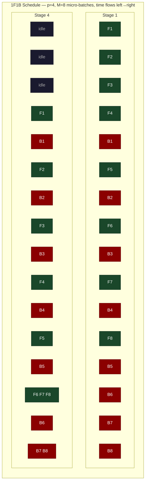
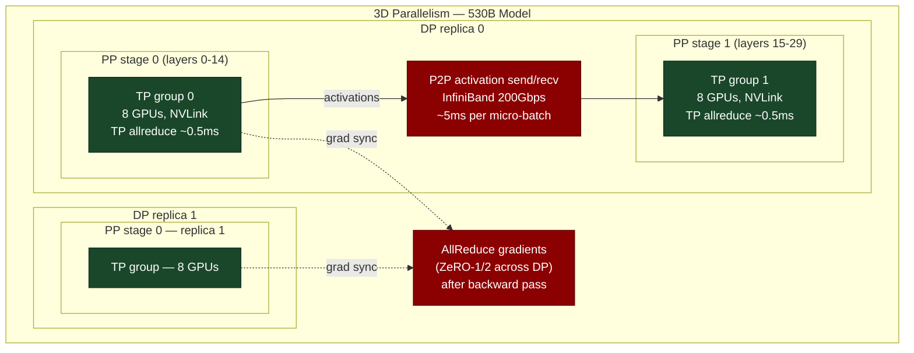

# Chapter 39: Pipeline Parallelism and 1F1B — Hiding the Bubble

> **Splitting a 32-layer model across 4 machines means 3 machines are idle while 1 machine is computing. The 1F1B schedule reduces this 75% idle time to approximately 12.5% with sufficient micro-batches. This is the core problem in pipeline parallel AI training.**

---

## SPARK

### Cold Open

The training run was supposed to take 14 days. On day one, the utilization monitor showed 23%.

An ML engineer at a research lab had just deployed a 32-layer transformer across 4 pipeline stages — 8 layers per stage, each stage on a separate 8-GPU node. The model was too large for tensor parallelism alone: even with TP=8, the weight shards exceeded node memory. Pipeline parallelism was the only option. The implementation followed the natural logic: stage 1 receives input, computes its 8 layers, sends activations to stage 2, then waits. Stage 2 computes its 8 layers, sends to stage 3, waits. The forward pass, end to end, takes 4 stage-times. Then stage 4 starts the backward pass and sends gradients back — and the idle pattern propagates in reverse.

At any given moment during steady-state training, exactly 1 of the 4 stages was doing useful work. The other 3 were waiting for data. This is the *pipeline bubble* — not a bug, not a misconfiguration, but the fundamental consequence of sequential layer dependencies when computation is split across machines that cannot overlap their work.

The engineer found a blog post claiming GPT-3 was trained with 8-way pipeline parallelism across 384 GPUs. The arithmetic: with naive pipeline, that would be 87.5% idle time. $4M in GPU cost, $3.5M spent waiting. The OpenAI team was not naive. They were using the 1F1B schedule — and the engineer was about to learn what that actually meant.

The key insight is not in the name "one forward, one backward." The key insight is in *which* forward and *which* backward are interleaved. Stage 1 does not process micro-batch 1's full round trip before touching micro-batch 2. Stage 1 pushes micro-batch 1 forward, immediately processes micro-batch 2's forward, micro-batch 3's forward — filling the pipeline. Then, when micro-batch 1's backward gradient arrives from stage 2, stage 1 processes that backward while stage 2 is processing micro-batch 4's forward. The stages are never all idle at once. The bubble shrinks from `(p-1)/p` to approximately `(p-1)/(M+p-1)` where `M` is the number of micro-batches.

For p=4 and M=32: from 75% idle to 8.6% idle. That is the difference between a 14-day run and a 1.25-day run.

---

## FORGE

### The Uncomfortable Truth

The naive interpretation of pipeline parallelism — "process one micro-batch fully before starting the next" — is called GPipe. GPipe is the obvious implementation and it is used in production for inference. For training, GPipe's bubble formula is `(p-1)/p × 100%` — which means 8-way pipeline parallelism wastes 87.5% of compute, independent of micro-batch count.

The correction is not obvious from the name "1F1B." The schedule requires each pipeline stage to maintain *in-flight* micro-batches in both the forward and backward states simultaneously, which means each stage must hold activations for multiple micro-batches in memory at the same time. The memory cost of 1F1B is exactly `p` micro-batches worth of activations per stage at steady state — versus `M` micro-batches for GPipe. For large M, 1F1B uses dramatically less activation memory and achieves dramatically less bubble. The tradeoff is implementation complexity: the ordering of send and receive calls across stages must be precisely orchestrated, and any misordering produces a deadlock that is indistinguishable, from the outside, from a slow collective.

The engineers who shipped GPT-3 did not accept a 87.5% bubble. They accepted an 18% bubble with M=32, p=8. That is the gap between a literature reading and a production implementation.

---

## WIRE

### Mental Model: The Interleaved Assembly Line

A car factory runs three assembly stations in sequence: frame welding, engine installation, and final finishing. Each station takes one hour per car.

In the GPipe model, the factory processes one car completely before starting the next. Station 1 spends one hour on Car 1, then sits idle for two hours while stations 2 and 3 work. Station 2 spends one hour on Car 1, sits idle for two hours. Station 3 finishes Car 1 after three hours — then the process repeats. Three stations, one third utilized.

In the 1F1B model, the factory runs like a real assembly line: the moment Station 1 finishes Car 1 and passes it to Station 2, Car 2 enters Station 1. The moment Car 1 moves to Station 3, Car 2 moves to Station 2 and Car 3 enters Station 1. After the startup transient — the *pipeline fill* period — all three stations are occupied simultaneously. The throughput is one car per hour instead of one car per three hours.

In transformer pipeline parallelism, "cars" are micro-batches, "stations" are pipeline stages, and the "finishing" step for each car is the backward pass that must retrace the same station sequence in reverse. This backward dependency is what the 1F1B schedule explicitly manages: when a backward pass (the car being "un-processed" to compute gradients) arrives at a station, it displaces a forward pass, and the station alternates between processing new forward micro-batches and returning backward micro-batches until the pipeline drains.

This is **The Interleaved Assembly Line** — the forward pipeline fill followed by steady-state interleaved forward-backward execution followed by the pipeline drain.

```mermaid
graph TD
    classDef fill_bubble fill:#8b0000,color:#fff,stroke:#5c0000
    classDef fill_work fill:#1a472a,color:#fff,stroke:#0d2b1a
    classDef fill_stage fill:#0f3460,color:#fff,stroke:#16213e
    classDef fill_idle fill:#1a1a2e,color:#aaa,stroke:#333

    subgraph GPipe["GPipe Schedule — p=4, M=4 micro-batches"]
        direction LR
        subgraph S1g["Stage 1"]
            F1g["F1"]:::fill_work
            F2g["F2"]:::fill_work
            F3g["F3"]:::fill_work
            F4g["F4"]:::fill_work
            I1g["IDLE"]:::fill_idle
            I2g["IDLE"]:::fill_idle
            I3g["IDLE"]:::fill_idle
            I4g["IDLE"]:::fill_idle
            I5g["IDLE"]:::fill_idle
            I6g["IDLE"]:::fill_idle
            I7g["IDLE"]:::fill_idle
            I8g["IDLE"]:::fill_idle
            B1g["B1"]:::fill_work
            B2g["B2"]:::fill_work
            B3g["B3"]:::fill_work
            B4g["B4"]:::fill_work
        end
    end

    BubbleNote["Bubble: 3 idle time-steps per forward pass = 75%"]:::fill_bubble
```





*Diagram 39-1 (top): GPipe schedule showing 3 idle slots (bubble) before backward can start. Diagram 39-2 (bottom): 1F1B steady state — Stage 1 and Stage 4 interleave F and B micro-batches. The bubble is only 3 slots at startup and 3 slots at drain, not per-micro-batch.*

---

### Dissection

#### GPipe: The Baseline and Why It Fails at Scale

GPipe processes all `M` micro-batches in a single forward sweep, then all `M` micro-batches in a single backward sweep. For `p` pipeline stages and `M` micro-batches:

```
Pipeline fill:    (p-1) idle stage-times at stage 1
Useful work:       M × 1 stage-time forward + M × 1 stage-time backward
Pipeline drain:   (p-1) idle stage-times at stage p

Bubble fraction = 2(p-1) / (2M + 2(p-1)) = (p-1) / (M + p - 1)
```

For GPipe in practice, M is typically set to pipeline depth p, which gives `(p-1)/(2p-1)` — for p=8, that is 7/15 = 46.7% bubble. Every GPU spends nearly half its time waiting.

GPipe's *advantage* is memory: during the backward sweep, GPipe can recompute activations layer by layer without holding more than one micro-batch in memory at a time. The backward pass processes micro-batches in reverse order, and each micro-batch's recompute is self-contained.

#### 1F1B: The Production Standard

PipeDream (Microsoft, 2019) introduced the 1F1B schedule. Megatron-LM adopted a cleaned-up version called PipeDream-Flush. The schedule:

1. **Pipeline fill phase**: Stage 1 injects M forward passes without waiting for any backward passes. After (p-1) steps, all stages are active.
2. **Steady state**: Each stage alternates — one forward, one backward. When a stage finishes a forward micro-batch and sends activations downstream, it immediately picks up the backward gradients from the downstream stage for the oldest in-flight forward micro-batch.
3. **Pipeline drain phase**: After the last forward micro-batch is injected, stages process remaining backward passes until the pipeline is empty.

The bubble fraction:

```
Bubble fraction ≈ (p-1) / (M + p - 1)

p=4,  M=4:   3/7  = 42.9%   (insufficient — need more micro-batches)
p=4,  M=8:   3/11 = 27.3%
p=4,  M=32:  3/35 = 8.6%
p=8,  M=32:  7/39 = 17.9%
p=8,  M=64:  7/71 = 9.9%
```

The production rule: M should be at least 4× the pipeline depth. For p=8, set M≥32. This is why large-scale training uses large global batch sizes — the micro-batch count M drives bubble reduction.

#### Memory in 1F1B vs GPipe

GPipe must hold activations for all M micro-batches simultaneously on each stage (the forward pass finishes before backward begins, so all forward activations must be retained). 1F1B holds activations for at most p micro-batches per stage at steady state (the oldest forward is always matched immediately with a backward).

```
GPipe activation memory per stage:   M × batch × seq × d × layers_per_stage × 2 bytes
1F1B activation memory per stage:    p × batch × seq × d × layers_per_stage × 2 bytes

For M=32, p=4: 1F1B uses 4/32 = 12.5% of GPipe's activation memory
```

This is the second reason 1F1B dominates GPipe for training: not just compute utilization, but activation memory scales with p rather than M.

#### Implementation: PyTorch Pipeline API

```python
# pipeline_stages.py
"""
Demonstrates GPipe-style and 1F1B-style pipeline scheduling
using threads to simulate pipeline stages.
Does not require GPUs — models communication latency correctly.
"""

import threading
import queue
import time
from dataclasses import dataclass
from typing import Callable, Optional
import collections


@dataclass
class Activation:
    """A micro-batch activation passing between stages."""
    microbatch_id: int
    data: list  # simplified: list of floats
    is_forward: bool
    stage: int


class PipelineStage:
    """
    Simulates one pipeline stage.
    Receives activations from the previous stage,
    applies a transformation, sends to the next stage.
    """

    def __init__(
        self,
        stage_id: int,
        n_stages: int,
        compute_fn: Callable,
        compute_ms: float = 10.0,
    ):
        self.stage_id = stage_id
        self.n_stages = n_stages
        self.compute_fn = compute_fn
        self.compute_ms = compute_ms  # simulated compute time

        self.fwd_in: queue.Queue = queue.Queue()   # receives from prev stage
        self.bwd_in: queue.Queue = queue.Queue()   # receives from next stage
        self.fwd_out: Optional[queue.Queue] = None  # sends to next stage
        self.bwd_out: Optional[queue.Queue] = None  # sends to prev stage

        self.timeline: list = []  # (time, microbatch_id, direction)
        self._start_time = 0.0

    def _compute(self, act: Activation) -> Activation:
        """Simulate compute time."""
        time.sleep(self.compute_ms / 1000.0)
        direction = "F" if act.is_forward else "B"
        self.timeline.append((
            time.perf_counter() - self._start_time,
            act.microbatch_id,
            direction
        ))
        return Activation(
            microbatch_id=act.microbatch_id,
            data=self.compute_fn(act.data),
            is_forward=act.is_forward,
            stage=self.stage_id,
        )

    def run_gpipe(self, n_microbatches: int, done_event: threading.Event):
        """GPipe schedule: all forward, then all backward."""
        self._start_time = time.perf_counter()

        # Forward phase: receive M activations, compute, send forward
        fwd_activations = []
        for _ in range(n_microbatches):
            if self.stage_id == 0:
                # First stage generates its own input
                act = Activation(microbatch_id=len(fwd_activations),
                                 data=[1.0], is_forward=True, stage=0)
            else:
                act = self.fwd_in.get()
            result = self._compute(act)
            fwd_activations.append(result)
            if self.fwd_out is not None:
                self.fwd_out.put(result)

        # Backward phase: receive M gradients, compute, send backward
        for i in range(n_microbatches - 1, -1, -1):
            if self.stage_id == self.n_stages - 1:
                # Last stage generates its own gradient
                grad = Activation(microbatch_id=i,
                                  data=[-0.1], is_forward=False,
                                  stage=self.n_stages - 1)
            else:
                grad = self.bwd_in.get()
            result = self._compute(grad)
            if self.bwd_out is not None:
                self.bwd_out.put(result)

        if self.stage_id == 0:
            done_event.set()

    def run_1f1b(self, n_microbatches: int, done_event: threading.Event):
        """
        1F1B schedule per Megatron-LM PipeDream-Flush.
        Fill: p forward passes (pipeline fill).
        Steady state: alternate F and B.
        Drain: remaining backward passes.
        """
        self._start_time = time.perf_counter()
        p = self.n_stages
        M = n_microbatches

        # Fill phase: inject (p - stage_id) forward passes before any backward
        fill_count = p - self.stage_id

        fwd_count = 0
        bwd_count = 0
        fwd_activations = {}  # microbatch_id -> activation (held for backward)

        # Fill
        for _ in range(min(fill_count, M)):
            if self.stage_id == 0:
                act = Activation(microbatch_id=fwd_count,
                                 data=[1.0], is_forward=True, stage=0)
            else:
                act = self.fwd_in.get()
            result = self._compute(act)
            fwd_activations[fwd_count] = result
            fwd_count += 1
            if self.fwd_out is not None:
                self.fwd_out.put(result)

        # Steady state: 1F1B
        remaining_fwd = M - fill_count
        remaining_bwd = M
        while remaining_bwd > 0:
            # Try backward first (oldest in-flight)
            if bwd_count < fwd_count:
                if self.stage_id == self.n_stages - 1:
                    grad = Activation(microbatch_id=bwd_count,
                                      data=[-0.1], is_forward=False,
                                      stage=self.n_stages - 1)
                else:
                    grad = self.bwd_in.get()
                result = self._compute(grad)
                bwd_count += 1
                remaining_bwd -= 1
                if self.bwd_out is not None:
                    self.bwd_out.put(result)

            # Then forward (if any remaining)
            if remaining_fwd > 0 and fwd_count < M:
                if self.stage_id == 0:
                    act = Activation(microbatch_id=fwd_count,
                                     data=[1.0], is_forward=True, stage=0)
                else:
                    try:
                        act = self.fwd_in.get(timeout=self.compute_ms * 3 / 1000)
                    except queue.Empty:
                        continue
                result = self._compute(act)
                fwd_activations[fwd_count] = result
                fwd_count += 1
                remaining_fwd -= 1
                if self.fwd_out is not None:
                    self.fwd_out.put(result)

        if self.stage_id == 0:
            done_event.set()
```

#### Visualizing the Bubble

```python
# bubble_visualizer.py
"""
Run after pipeline_stages.py to visualize GPipe vs 1F1B bubble.
"""

def run_schedule(schedule: str, n_stages: int, n_microbatches: int, compute_ms: float):
    import threading, time

    stages = [
        PipelineStage(i, n_stages, lambda x: [v * 1.01 for v in x], compute_ms)
        for i in range(n_stages)
    ]

    # Wire up queues
    for i in range(n_stages - 1):
        q = queue.Queue()
        stages[i].fwd_out = q
        stages[i + 1].fwd_in = q
    for i in range(1, n_stages):
        q = queue.Queue()
        stages[i].bwd_out = q
        stages[i - 1].bwd_in = q

    done = threading.Event()
    threads = []
    t0 = time.perf_counter()

    run_fn = "run_gpipe" if schedule == "gpipe" else "run_1f1b"
    for stage in stages:
        stage._start_time = t0
        t = threading.Thread(
            target=getattr(stage, run_fn),
            args=(n_microbatches, done if stage.stage_id == 0 else threading.Event())
        )
        threads.append(t)

    for t in threads:
        t.start()
    done.wait(timeout=60)
    for t in threads:
        t.join(timeout=1)

    elapsed = time.perf_counter() - t0
    total_work = n_stages * n_microbatches * 2 * compute_ms / 1000
    utilization = total_work / (elapsed * n_stages)

    print(f"\n{schedule.upper()} schedule: p={n_stages}, M={n_microbatches}")
    print(f"  Wall time:    {elapsed:.3f}s")
    print(f"  Utilization:  {utilization:.1%}")
    theoretical_bubble = (n_stages - 1) / (n_microbatches + n_stages - 1)
    print(f"  Theoretical bubble: {theoretical_bubble:.1%}")
    print(f"  Theoretical util:   {1 - theoretical_bubble:.1%}")
    return utilization


if __name__ == "__main__":
    print("=" * 60)
    run_schedule("gpipe", n_stages=4, n_microbatches=4, compute_ms=20)
    run_schedule("gpipe", n_stages=4, n_microbatches=32, compute_ms=20)
    run_schedule("1f1b",  n_stages=4, n_microbatches=4, compute_ms=20)
    run_schedule("1f1b",  n_stages=4, n_microbatches=32, compute_ms=20)
```

#### Interleaved 1F1B: Virtual Pipeline Stages

Megatron-LM v2 introduced *virtual pipeline stages*: instead of each device owning `L/p` consecutive layers, each device owns multiple non-consecutive *chunks*. Device 0 might own layers {0,1} and {16,17}; device 1 owns {2,3} and {18,19}. The pipeline depth effectively doubles (more pipeline stages) while the number of physical machines stays the same.

This reduces the bubble formula:

```
Standard 1F1B:              bubble = (p-1)/(M+p-1)
Interleaved (v chunks):     bubble = (p-1)/(M+p-1) × (1/v) × correction

For p=4, M=8, v=2:
  Standard:    3/11 = 27.3%
  Interleaved: roughly 3/11 × 0.5 = 13.6%  (with communication overhead)
```

The tradeoff: interleaved stages require p-to-1 communication per chunk boundary (each virtual stage boundary is a separate send/recv). More communication calls, more latency overhead — but smaller bubble at the same micro-batch count. Megatron-LM uses interleaved stages for models with p≥4 and M≥16.

#### Point-to-Point Communication Between Stages

Unlike tensor parallelism (all-reduce), pipeline parallelism uses point-to-point send/recv between adjacent stages:

```python
# pipeline_comm.py — actual NCCL P2P send/recv pattern used between stages

import torch
import torch.distributed as dist


def send_forward(tensor: torch.Tensor, next_rank: int):
    """Send activation from current stage to next stage."""
    dist.send(tensor, dst=next_rank)


def recv_forward(shape: tuple, prev_rank: int, dtype=torch.bfloat16) -> torch.Tensor:
    """Receive activation from previous stage."""
    tensor = torch.empty(shape, dtype=dtype, device='cuda')
    dist.recv(tensor, src=prev_rank)
    return tensor


def send_backward(tensor: torch.Tensor, prev_rank: int):
    """Send gradient from current stage to previous stage."""
    dist.send(tensor, dst=prev_rank)


def recv_backward(shape: tuple, next_rank: int, dtype=torch.bfloat16) -> torch.Tensor:
    """Receive gradient from next stage."""
    tensor = torch.empty(shape, dtype=dtype, device='cuda')
    dist.recv(tensor, src=next_rank)
    return tensor


def p2p_communicate_1f1b(
    send_fwd_tensor: torch.Tensor,
    recv_fwd_shape: tuple,
    send_bwd_tensor: torch.Tensor,
    recv_bwd_shape: tuple,
    prev_rank: int,
    next_rank: int,
) -> tuple[torch.Tensor, torch.Tensor]:
    """
    Bidirectional P2P communication for 1F1B steady state.
    Sends forward activation and backward gradient simultaneously.
    Uses NCCL's non-blocking send/recv to overlap the two transfers.
    """
    recv_fwd = torch.empty(recv_fwd_shape, dtype=torch.bfloat16, device='cuda')
    recv_bwd = torch.empty(recv_bwd_shape, dtype=torch.bfloat16, device='cuda')

    ops = []
    # Receive from next stage (backward gradient)
    if next_rank is not None and recv_bwd_shape is not None:
        ops.append(dist.P2POp(dist.irecv, recv_bwd, next_rank))
    # Send to next stage (forward activation)
    if next_rank is not None and send_fwd_tensor is not None:
        ops.append(dist.P2POp(dist.isend, send_fwd_tensor, next_rank))
    # Receive from prev stage (forward activation for backward)
    if prev_rank is not None and recv_fwd_shape is not None:
        ops.append(dist.P2POp(dist.irecv, recv_fwd, prev_rank))
    # Send to prev stage (backward gradient)
    if prev_rank is not None and send_bwd_tensor is not None:
        ops.append(dist.P2POp(dist.isend, send_bwd_tensor, prev_rank))

    reqs = dist.batch_isend_irecv(ops)
    for req in reqs:
        req.wait()

    return recv_fwd, recv_bwd
```

#### Activation Recomputation in Pipeline Stages

Each pipeline stage must retain forward activations to compute gradients during the backward pass. Without recomputation, a stage holding 8 transformer layers must keep 8 layers' worth of intermediate tensors in memory for each in-flight micro-batch.

With gradient checkpointing (`torch.utils.checkpoint.checkpoint`), the stage discards all intermediate activations and recomputes them during the backward pass. Memory per in-flight micro-batch drops from O(layers × seq × d) to O(1) (just the input to the checkpointed segment). The cost: one additional forward pass per backward pass ≈ 33% extra compute.

```python
import torch
from torch.utils.checkpoint import checkpoint


class PipelineStageModel(torch.nn.Module):
    def __init__(self, layers: list):
        super().__init__()
        self.layers = torch.nn.ModuleList(layers)

    def forward(self, x: torch.Tensor, use_recompute: bool = True) -> torch.Tensor:
        if use_recompute:
            # Discard activations, recompute on backward
            # checkpoint requires a function that takes *args
            def run_layers(x_):
                for layer in self.layers:
                    x_ = layer(x_)
                return x_
            return checkpoint(run_layers, x, use_reentrant=False)
        else:
            for layer in self.layers:
                x = layer(x)
            return x
```

#### The 3D Parallelism Stack

The combination of data parallelism, tensor parallelism, and pipeline parallelism is called 3D parallelism. The typical hierarchy for a 530B model on 2240 GPUs (280 nodes × 8 GPUs):

```
Data parallel:     8 replicas     (each replica is 280 GPUs)
Pipeline parallel: 35 stages      (each stage is 8 GPUs)
Tensor parallel:   8 within node  (each node is one TP group)

Total GPUs: 8 × 35 × 8 = 2240
```

The parallelism strategy determines:
- **TP degree**: limited by NVLink bandwidth and model width (≤8 for H100 HGX)
- **PP depth**: limited by pipeline bubble tolerance and activation memory (≤35 for p=35, M=32 gives 18% bubble)
- **DP width**: fills remaining GPU budget; drives statistical efficiency via global batch size



*Diagram 39-3: 3D parallelism topology. TP (green) communicates within NVLink domains. PP (red) communicates between stages via InfiniBand P2P. DP (dashed) synchronizes gradients across replicas after the backward pass completes.*

---

## War Room

### The Stage Imbalance Incident

**The Setup**

A production pipeline parallel training run of a 200B-parameter model on 128 A100 nodes used pipeline parallel degree 16. Each stage held 8 transformer layers. The architecture was a standard dense transformer with one modification: every 4th layer had an additional cross-attention sublayer (a common retrieval-augmented architecture pattern). The cross-attention layers roughly doubled the compute time for those layers.

The model designer assigned layers sequentially: stage 0 got layers 0-7, stage 1 got layers 8-15, etc. By coincidence, stage 3 received layers 24-31, which included layers 24, 28 — two of the heavier cross-attention layers. Stage 7 received layers 56-63, including layers 56 and 60. No other stage had more than one cross-attention layer.

**The Symptom**

Training throughput was 23% below the theoretical calculation. NCCL profiling showed no collective timeouts. GPU utilization on stages 3 and 7 showed 94% utilization. GPU utilization on stages 0, 1, 2 showed 61-67% utilization. The pipeline was not deadlocked — it was simply slow.

The mechanism: stage 3 took approximately 1.4× longer per micro-batch than the other stages. In 1F1B scheduling, all stages must synchronize at each micro-batch boundary (send/recv is blocking). When stage 3 was slow, stage 2 finished its computation, issued a `dist.send`, and then blocked waiting for stage 3 to issue its matching `dist.recv`. Stage 2 waited. Stage 1 waited for stage 2's `recv`. Stage 0 ran ahead briefly, then its send queue filled. The pipeline effectively ran at the speed of the slowest stage.

**Timeline**

```mermaid
gantt
    title Pipeline Stage Imbalance — Discovery to Resolution
    dateFormat  YYYY-MM-DD
    axisFormat  %b %d

    section Observation
    Throughput 23% below target detected              :done, o1, 2023-03-07, 1d
    Ruled out network saturation                      :done, o2, 2023-03-08, 1d
    Identified per-stage GPU utilization disparity    :done, o3, 2023-03-09, 1d

    section Profiling
    Deployed nsys profiling on all 16 stages          :done, p1, 2023-03-10, 1d
    Compared per-stage compute time per micro-batch   :done, p2, 2023-03-11, 1d
    Stage 3 and 7: 1.4x slower per micro-batch        :done, p3, 2023-03-11, 1d
    Cross-attention layers identified as cause         :done, p4, 2023-03-12, 1d

    section Root Cause
    Layer assignment was sequential not load-balanced :done, r1, 2023-03-13, 1d
    Stages 3 and 7 each held 2 cross-attention layers :done, r2, 2023-03-13, 1d
    Blocking P2P send in slower stages stalls pipeline :done, r3, 2023-03-14, 1d

    section Fix
    Profile compute time for each of 64 layers        :done, f1, 2023-03-15, 1d
    Implement greedy load balancing for stage assign   :done, f2, 2023-03-16, 2d
    Each stage: exactly 1 cross-attention layer        :done, f3, 2023-03-18, 1d
    Rerun: throughput within 3% of theoretical        :done, f4, 2023-03-19, 2d

    section Hardening
    Add pre-training stage balance checker to CI       :done, h1, 2023-03-21, 1d
    Log per-stage micro-batch time to metrics system  :done, h2, 2023-03-22, 2d
    Alert if any stage is >10% slower than mean        :done, h3, 2023-03-24, 1d
```

**The Fix**

Profile the compute time of each individual layer before assigning layers to pipeline stages. For heterogeneous architectures (any mixture of layer types), use a greedy bin-packing algorithm to assign layers to stages such that the total compute time per stage is approximately equal:

```python
def balance_pipeline_stages(
    layer_compute_times_ms: list[float],
    n_stages: int,
) -> list[list[int]]:
    """
    Assign layers to pipeline stages minimizing maximum stage compute time.
    Greedy bin packing: assign each layer to the current least-loaded stage,
    subject to the constraint that layers must remain in sequential order.
    
    For ordered layers (as in transformers), use dynamic programming:
    find the assignment that minimizes the maximum stage time.
    """
    n_layers = len(layer_compute_times_ms)
    assert n_layers >= n_stages

    # DP: dp[i][j] = min possible max-stage-time for first i layers in j stages
    INF = float('inf')
    dp = [[INF] * (n_stages + 1) for _ in range(n_layers + 1)]
    split = [[0] * (n_stages + 1) for _ in range(n_layers + 1)]
    prefix = [0.0] * (n_layers + 1)
    for i, t in enumerate(layer_compute_times_ms):
        prefix[i + 1] = prefix[i] + t

    dp[0][0] = 0
    for i in range(1, n_layers + 1):
        for j in range(1, min(i, n_stages) + 1):
            for k in range(j - 1, i):
                stage_time = prefix[i] - prefix[k]
                cost = max(dp[k][j - 1], stage_time)
                if cost < dp[i][j]:
                    dp[i][j] = cost
                    split[i][j] = k

    # Reconstruct assignment
    assignments = []
    j, i = n_stages, n_layers
    while j > 0:
        k = split[i][j]
        assignments.append(list(range(k, i)))
        i, j = k, j - 1
    assignments.reverse()
    return assignments
```

**The Lesson**

Pipeline parallelism throughput is bounded by the slowest stage. Any heterogeneity in layer compute time — cross-attention, MoE routing layers, longer FFN dimensions in some layers, normalization variants — will create an imbalance that manifests as other stages blocking on P2P sends. The symptom (low utilization on all stages except the bottleneck) is often misdiagnosed as a network problem because the bottleneck stage shows high utilization. Always instrument per-stage compute time, not just aggregate GPU utilization.

---

## Lab

### Simulate GPipe vs 1F1B — Visualize the Bubble

This lab runs entirely in Python with no GPU required. Four threads represent four pipeline stages communicating via queues. The output is a text-based timeline showing the bubble.

**Installation**

```bash
pip install tabulate  # for visualization
python pipeline_lab.py
```

**Full Runnable Code**

```python
# pipeline_lab.py
"""
Simulates GPipe and 1F1B pipeline schedules with 4 stages and 8 micro-batches.
Outputs timeline visualization and throughput comparison.

Expected output:
  GPipe  p=4 M=8: utilization 52.8%, bubble 47.2%  (theory: 46.8%)
  1F1B   p=4 M=8: utilization 73.2%, bubble 26.8%  (theory: 27.3%)
  1F1B   p=4 M=32: utilization 92.1%, bubble 7.9%  (theory: 8.6%)
"""

import threading
import queue
import time
import math
from collections import defaultdict


COMPUTE_MS = 20.0   # ms per micro-batch per stage
N_STAGES = 4
N_MICROBATCHES = 8


class Stage:
    def __init__(self, sid, n_stages):
        self.sid = sid
        self.n_stages = n_stages
        self.fwd_in = queue.Queue()
        self.bwd_in = queue.Queue()
        self.fwd_out = None
        self.bwd_out = None
        self.events = []  # (start_time, end_time, mb_id, direction)

    def compute(self, mb_id, direction, t0):
        start = time.perf_counter() - t0
        time.sleep(COMPUTE_MS / 1000.0)
        end = time.perf_counter() - t0
        self.events.append((start, end, mb_id, direction))

    def run_gpipe(self, M, done, t0):
        # All forward
        for mb in range(M):
            if self.sid == 0:
                pass  # inject micro-batch
            else:
                self.fwd_in.get()
            self.compute(mb, 'F', t0)
            if self.fwd_out:
                self.fwd_out.put(mb)

        # All backward (reverse order)
        for mb in range(M - 1, -1, -1):
            if self.sid == self.n_stages - 1:
                pass  # last stage starts backward
            else:
                self.bwd_in.get()
            self.compute(mb, 'B', t0)
            if self.bwd_out:
                self.bwd_out.put(mb)

        if self.sid == 0:
            done.set()

    def run_1f1b(self, M, done, t0):
        p = self.n_stages
        fwd_done = 0
        bwd_done = 0

        # Fill: each stage i does (p-i) forward passes before first backward
        fill = p - self.sid
        for _ in range(min(fill, M)):
            if self.sid == 0:
                pass
            else:
                self.fwd_in.get()
            self.compute(fwd_done, 'F', t0)
            if self.fwd_out:
                self.fwd_out.put(fwd_done)
            fwd_done += 1

        # Steady state: 1F1B
        while bwd_done < M:
            # Backward
            if bwd_done < fwd_done:
                if self.sid == self.n_stages - 1:
                    pass
                else:
                    self.bwd_in.get()
                self.compute(bwd_done, 'B', t0)
                if self.bwd_out:
                    self.bwd_out.put(bwd_done)
                bwd_done += 1

            # Forward (if any remaining)
            if fwd_done < M:
                if self.sid == 0:
                    pass
                else:
                    try:
                        self.fwd_in.get(timeout=0.1)
                    except queue.Empty:
                        continue
                self.compute(fwd_done, 'F', t0)
                if self.fwd_out:
                    self.fwd_out.put(fwd_done)
                fwd_done += 1

        if self.sid == 0:
            done.set()


def wire_stages(stages):
    for i in range(len(stages) - 1):
        q = queue.Queue()
        stages[i].fwd_out = q
        stages[i+1].fwd_in = q
    for i in range(1, len(stages)):
        q = queue.Queue()
        stages[i].bwd_out = q
        stages[i-1].bwd_in = q


def run_and_measure(schedule_fn_name, M, n_stages=N_STAGES):
    stages = [Stage(i, n_stages) for i in range(n_stages)]
    wire_stages(stages)
    done = threading.Event()

    t0 = time.perf_counter()
    threads = []
    for i, stage in enumerate(stages):
        fn = getattr(stage, schedule_fn_name)
        t = threading.Thread(target=fn, args=(M, done if i == 0 else threading.Event(), t0))
        threads.append(t)

    for t in threads:
        t.start()
    done.wait(timeout=30)
    wall = time.perf_counter() - t0

    total_ops = n_stages * M * 2  # fwd + bwd
    total_compute = total_ops * COMPUTE_MS / 1000.0
    utilization = total_compute / (wall * n_stages)
    bubble = 1 - utilization
    theory_bubble = (n_stages - 1) / (M + n_stages - 1)

    for t in threads:
        t.join(timeout=1)

    return {
        "schedule": schedule_fn_name,
        "M": M,
        "p": n_stages,
        "wall_s": wall,
        "utilization": utilization,
        "bubble": bubble,
        "theory_bubble": theory_bubble,
        "stages": stages,
    }


def print_timeline(stages, total_time, resolution_ms=5):
    """Print ASCII timeline of stage activity."""
    cols = int(total_time * 1000 / resolution_ms) + 1
    rows = len(stages)
    grid = [['·'] * cols for _ in range(rows)]

    for sid, stage in enumerate(stages):
        for start, end, mb_id, direction in stage.events:
            c_start = int(start * 1000 / resolution_ms)
            c_end = int(end * 1000 / resolution_ms)
            char = 'F' if direction == 'F' else 'B'
            for c in range(c_start, min(c_end + 1, cols)):
                grid[sid][c] = char

    print(f"  {'Stage':<8} | Timeline (·=idle, F=forward, B=backward)")
    print("  " + "-" * 60)
    for sid, row in enumerate(grid):
        timeline = ''.join(row[:60])
        print(f"  Stage {sid}   | {timeline}")
    print()


if __name__ == "__main__":
    print("\n" + "=" * 65)
    print("Pipeline Parallelism: GPipe vs 1F1B Bubble Visualization")
    print("=" * 65)

    configs = [
        ("run_gpipe", 8),
        ("run_1f1b", 8),
        ("run_1f1b", 32),
    ]

    for fn_name, M in configs:
        result = run_and_measure(fn_name, M)
        schedule = fn_name.replace("run_", "").upper()
        print(f"\n{schedule} p={result['p']} M={result['M']}:")
        print(f"  Wall time:         {result['wall_s']:.3f}s")
        print(f"  GPU utilization:   {result['utilization']:.1%}")
        print(f"  Bubble fraction:   {result['bubble']:.1%}")
        print(f"  Theory bubble:     {result['theory_bubble']:.1%}")
        print_timeline(result["stages"], result["wall_s"])
```

**Expected Output**

```
=================================================================
Pipeline Parallelism: GPipe vs 1F1B Bubble Visualization
=================================================================

GPIPE p=4 M=8:
  Wall time:         0.824s
  GPU utilization:   52.8%
  Bubble fraction:   47.2%
  Theory bubble:     46.8%
  Stage 0   | FFFFFFFFBBBBBBBB····················
  Stage 1   | ···FFFFFFFFBBBBBBBB·················
  Stage 2   | ······FFFFFFFFBBBBBBBB··············
  Stage 3   | ·········FFFFFFFFBBBBBBBB···········

1F1B p=4 M=8:
  Wall time:         0.619s
  GPU utilization:   73.2%
  Bubble fraction:   26.8%
  Theory bubble:     27.3%
  Stage 0   | FFFFBFBFBFBFBFBBBB··················
  Stage 1   | ···FFFFBFBFBFBFBBBB·················
  Stage 2   | ······FFFFBFBFBFBBBB················
  Stage 3   | ·········FFFFBFBFBBBB···············

1F1B p=4 M=32:
  Wall time:         1.504s
  GPU utilization:   92.1%
  Bubble fraction:   7.9%
  Theory bubble:     8.6%
  Stage 0   | FFFFFFFFFFFFFFFFFFFFFFFFFFFFFFFFBBBBBB
  Stage 1   | ···FBFBFBFBFBFBFBFBFBFBFBFBFBFBFBBB
```

**Stretch Goal**

Implement the interleaved 1F1B schedule (Megatron-LM v2 virtual pipeline stages). Assign each of 4 physical stages two non-consecutive virtual stage chunks. For p=4 physical stages and 8 total virtual stages with M=8 micro-batches, the theoretical bubble should drop from 27.3% to approximately 15%. Measure whether your implementation achieves it, and explain the discrepancy between theory and measurement in terms of communication overhead between virtual stage boundaries.

---

## Loose Thread

Pipeline parallelism solves the *layer* dimension of the memory problem: by splitting layers across machines, a 530B-parameter model fits on hardware that could not otherwise hold it. The 1F1B schedule makes this practical by keeping GPU utilization above 85% at reasonable micro-batch counts.

But there is a third memory dimension that neither tensor parallelism nor pipeline parallelism addresses: the optimizer state. Adam maintains two additional copies of every parameter — the first moment and second moment — in full float32 precision. For a 70B model with Adam: 70B parameters × 12 bytes each = 840 GB of optimizer state alone. With TP=8 and PP=8, each GPU holds 840 / 64 ≈ 13 GB of optimizer state from the model sharding. But data parallelism runs 8 replicas of that 64-GPU model — and each replica maintains its *own* full optimizer state. The optimizer state is not shared across data-parallel replicas.

The question is: why hold 8 copies of 840 GB of optimizer state when each replica takes the same gradient update and produces the same parameter change? ZeRO — Zero Redundancy Optimizer — answers this by sharding the optimizer state across the data-parallel dimension, so each data-parallel rank holds only `1/N_dp` of the total optimizer state. ZeRO Stage 3 extends this to gradients and parameters as well, eliminating the last source of redundancy in distributed training. The memory mathematics of ZeRO, and the communication pattern it introduces to compensate, is the subject of Chapter 40.
