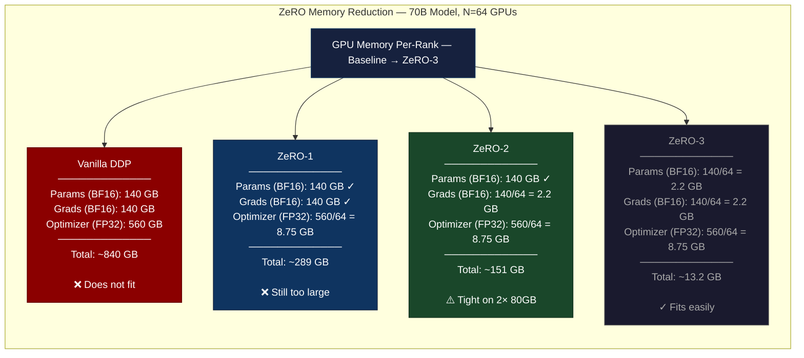
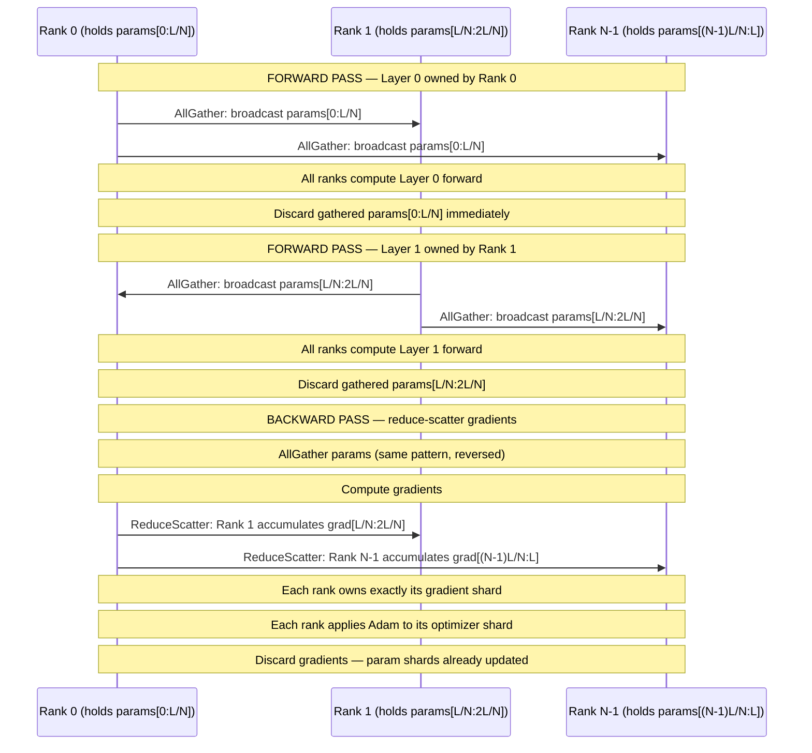
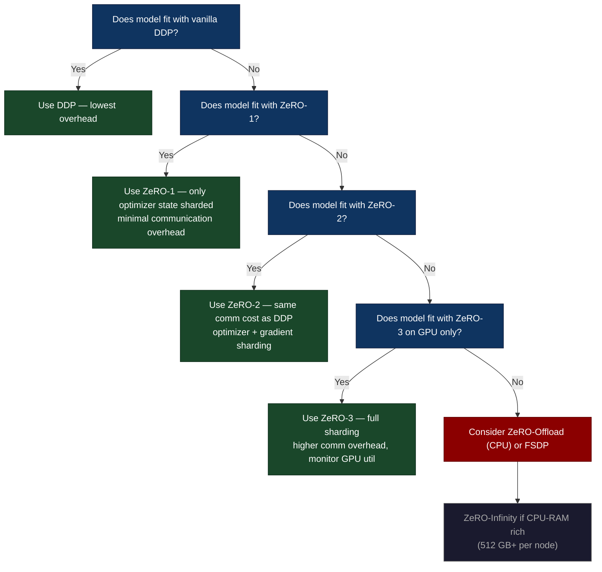

# Chapter 40: DeepSpeed ZeRO — Sharding Optimizer State Across a Supercluster

> **Training a 175B model requires 2.8 TB of GPU memory for optimizer state alone. ZeRO-3 makes each GPU hold only 1/N of that. At N=256: 10.9 GB per GPU. It fits in an H100.**

---

## SPARK

### Cold Open

The year is 2020. OpenAI's training cluster hums at full capacity across thousands of A100s, and the bill for GPT-3 will eventually clock in at approximately $4.6 million in compute alone. The model has 175 billion parameters. No single GPU in existence, at that time or since, carries 2.8 TB of HBM — the amount of memory required to hold optimizer state in the standard mixed-precision Adam training regime.

Here is the arithmetic that forces the hand of every engineer who tries to train at this scale. Mixed-precision training stores parameters in BF16 (2 bytes each), gradients in BF16 (2 bytes each), and then Adam's optimizer state in FP32: master weights at 4 bytes each, gradient variance at 4 bytes each, gradient momentum at 4 bytes each. For 175 billion parameters: 350 GB of BF16 parameters, 350 GB of BF16 gradients, and 700 GB each for master weights, variance, and momentum — a grand total of 2,800 GB, or 2.8 TB. The H100 SXM5 ships with 80 GB of HBM3. You need 35 of them just to hold the optimizer state, with nothing left for activations, computation buffers, or the actual parameters in working memory.

The naïve approach to this problem — "spread the model across many GPUs using model parallelism, keep a full copy of optimizer state on each replica in your data-parallel group" — doesn't work because now every data-parallel replica replicates the entire 2.8 TB. A cluster of 512 GPUs organized as 64-way tensor-parallel × 8-way data-parallel stores the optimizer state 8 times: 22.4 TB in aggregate, of which 19.6 TB is pure redundancy. The Microsoft Research team working on DeepSpeed saw this redundancy for what it was — not a necessary cost of distributed training, but a design choice that could be reversed.

Samyam Rajbhandari, Jeff Rasley, Olatunji Ruwase, and Yuxiong He published the ZeRO paper (Zero Redundancy Optimizer) in 2020, timed almost exactly with GPT-3's training. The key insight is disarmingly simple: in standard data parallelism, every replica maintains an *identical* copy of the optimizer state. If N GPUs each hold a full copy, then (N-1)/N of the total optimizer state memory is redundant. The ZeRO solution is to shard the optimizer state across the N replicas, so each replica holds exactly 1/N of the state, communicate only the pieces each replica needs, and reconstruct when required. At N=256, that 2.8 TB becomes 10.9 GB per GPU — and the H100 can hold it with 69 GB to spare.

---

## FORGE

### The Uncomfortable Truth

The false belief circulating among ML engineers in 2019 was: "data parallelism requires a full copy of the model on every GPU." This belief is technically true for parameters during the forward pass, and it is false for everything else. ZeRO demonstrates that optimizer state, gradients, and even parameters themselves can be sharded across data-parallel replicas with mathematically equivalent training results.

ZeRO ships in three escalating stages. ZeRO-1 shards only the optimizer state: parameters and gradients remain full on every GPU, but Adam's master weights, variance, and momentum are divided into N equal shards. ZeRO-2 adds gradient sharding on top of ZeRO-1: each GPU only keeps the gradient shard that corresponds to the optimizer state shard it owns, reducing peak gradient memory by a factor of N. ZeRO-3 goes all the way: it shards optimizer state, gradients, *and* parameters — every GPU holds 1/N of everything, reconstructing layer parameters on demand via all-gather operations before computing each layer's forward and backward pass.

The memory math for a 70B-parameter model at N=64 GPUs shifts dramatically across stages. Vanilla DDP requires approximately 135 GB per GPU (assuming BF16 params + BF16 grads + FP32 optimizer state). ZeRO-1 reduces optimizer state by 64× to bring that to roughly 70 GB. ZeRO-2 also reduces gradient memory by 64× to reach around 37 GB. ZeRO-3 shards everything and lands at approximately 2.1 GB of model state per GPU — a 64× reduction end to end.

The communication overhead is the honest cost you do not see in the benchmark table. ZeRO-3 replaces a single all-reduce (the DDP baseline) with two all-gathers per layer per forward pass, two all-gathers per layer per backward pass, and one reduce-scatter per layer per backward pass. For a model with 80 transformer layers on a 64-GPU cluster, that is 80 × 4 = 320 collective operations per training step, each moving layer-sized chunks of parameters across the interconnect. Whether this overhead is acceptable depends entirely on your interconnect bandwidth relative to your compute throughput — on InfiniBand HDR (200 Gb/s) with H100s doing 989 TFLOPS, ZeRO-3 is almost always compute-bound. On 10 GbE with V100s, you will find the interconnect first.

---

## WIRE

### Mental Model: The Sectioned Reference Library

Imagine a research team of 64 scientists, each with a desk. The project requires a 10,000-page reference library — let's call it the "optimizer compendium." In the naive approach, every scientist has a full personal copy of the compendium at their desk: 64 × 10,000 = 640,000 pages distributed across the room, of which 630,000 are exact duplicates. A fire drill at the wrong moment means carrying 630,000 pages of redundancy out of the building.

In the ZeRO-3 arrangement, the team has exactly one copy of the compendium, and each scientist holds 156 consecutive pages (10,000 / 64). When Scientist 7 needs pages 2,000–2,156 (her section) to update the parameters she owns, she already has them. When the forward pass needs pages 500–656 (Scientist 4's section), the team does a brief "all-gather" — Scientist 4 shares her pages with everyone for the duration of that layer's computation, then everyone discards the temporary copies and holds only their own section again. The compendium is always available, the redundancy is eliminated, and the communication is bounded by how many times you need to read a section versus how long you hold it.

This is **The Sectioned Reference Library** — each rank is both a consumer and a custodian, storing only its assigned section but able to access any section via a time-bounded collective.





---

## FORGE (continued)

### Dissection: ZeRO From First Principles to Production

#### ZeRO-1: Optimizer State Sharding Only

ZeRO-1 is the lowest-risk entry point into sharded training, and for models that fit in GPU memory with DDP, it is often the right choice. Each GPU in the data-parallel group holds a full copy of model parameters in BF16 and a full copy of gradients in BF16 — identical to vanilla DDP. After the backward pass completes, each GPU has a full gradient tensor. The ZeRO-1 difference begins here: instead of a DDP-style all-reduce followed by every GPU running the full Adam update, each GPU receives only the gradient shard it owns via an all-reduce that partitions the output, applies Adam to its 1/N shard of the optimizer state (master weights in FP32, variance in FP32, momentum in FP32), computes the parameter update for its shard, and then broadcasts those updated parameters back to all other GPUs.

The memory saving is exactly 1 - 1/N on the optimizer state component, which is the largest single component in mixed-precision training. For a 70B model at N=64: optimizer state drops from 560 GB to 8.75 GB per GPU. Parameters (140 GB) and gradients (140 GB) remain unchanged. Total per-GPU memory: 289 GB versus the 840 GB baseline. The communication cost is identical to DDP: one all-reduce equivalent per training step (implemented as a reduce-scatter for the gradient accumulation followed by an all-gather for the parameter broadcast).

ZeRO-1 is the correct choice when your model fits with ZeRO-1 and the extra communication of ZeRO-2 or ZeRO-3 is not justified by memory savings. Every ZeRO stage adds communication overhead relative to the stage below it — the goal is to use the minimum stage that allows your model to fit, not the maximum stage by default.

#### ZeRO-2: Gradient Sharding Added

ZeRO-2 augments ZeRO-1 by also sharding gradients. The change in the backward pass is significant: instead of all-reduce (which would produce a full gradient on every GPU), ZeRO-2 uses reduce-scatter. Reduce-scatter is mathematically equivalent to all-reduce followed by extracting your shard — but it never materializes the full gradient on any single GPU. Each GPU ends the backward pass holding only the 1/N slice of gradients corresponding to its optimizer state shard.

This shard is exactly what it needs for the Adam update. After the optimizer step, the 1/N updated parameter shard is broadcast to all GPUs via all-gather, restoring full parameters on every rank. The communication volume is the same as DDP all-reduce (reduce-scatter + all-gather = all-reduce in data volume), but peak gradient memory drops from the full gradient tensor to 1/N of it. For a 70B model at N=64: parameters at 140 GB, gradients at 2.2 GB, optimizer state at 8.75 GB — total 151 GB per GPU, versus 289 GB for ZeRO-1.

The implementation choice is reduce-scatter for gradients and all-gather for parameters, both operating on the full parameter space but with 1/N granularity per rank. This is why ZeRO-2's communication cost matches DDP's: reduce-scatter + all-gather = 2 × model_size × (N-1)/N bytes per rank, which equals all-reduce. The savings are purely in peak memory, not in communication bytes.

#### ZeRO-3: Full Parameter Sharding

ZeRO-3 is where the fundamental model of "each GPU has a full model" breaks down completely. In ZeRO-3, each GPU permanently holds only 1/N of the parameters. The parameters do not exist in full form on any single device during steady-state training — they are reconstructed, used, and immediately discarded.

The lifecycle of a single transformer layer's parameters during one forward pass under ZeRO-3: (1) the layer's parameters are sharded — Rank 0 holds the first 1/N, Rank 1 holds the second 1/N, etc. (2) Before computing that layer's forward pass, all ranks execute an all-gather to reconstruct the full layer parameters on every rank. (3) Every rank computes its portion of the forward pass using the full parameters. (4) Immediately after the forward computation, all ranks discard the gathered parameters, freeing the memory. The cycle repeats for every layer in the forward pass. The backward pass mirrors this exactly: all-gather to reconstruct the layer, compute the backward pass to get gradients, reduce-scatter those gradients so each rank accumulates its gradient shard, apply Adam update to the optimizer shard.

The communication overhead relative to ZeRO-2 is the additional all-gather per layer during the forward pass. ZeRO-2 does all-gather once at the end of the optimizer step; ZeRO-3 does all-gather per-layer per-forward-pass and per-layer per-backward-pass. For a 70B model with 80 transformer layers on 64 GPUs with 200 Gb/s InfiniBand, each all-gather moves 140 GB / 64 = 2.2 GB per layer; at 200 Gb/s that is 88 ms per all-gather. 80 layers × 2 passes × 88 ms = 14 seconds of pure communication per step, before computation begins. On NVLink-interconnected DGX clusters (NVLink at 900 GB/s), the same 2.2 GB all-gather takes under 2.5 ms — now 80 × 2 × 2.5 ms = 400 ms, much more acceptable alongside the compute time.

#### Memory Calculation Table: 70B Model, N=64 GPUs

| Component | Vanilla DDP | ZeRO-1 | ZeRO-2 | ZeRO-3 |
|---|---|---|---|---|
| Parameters (BF16) | 140 GB | 140 GB | 140 GB | 2.19 GB |
| Gradients (BF16) | 140 GB | 140 GB | 2.19 GB | 2.19 GB |
| Adam master weights (FP32) | 280 GB | 4.38 GB | 4.38 GB | 4.38 GB |
| Adam variance (FP32) | 140 GB | 2.19 GB | 2.19 GB | 2.19 GB |
| Adam momentum (FP32) | 140 GB | 2.19 GB | 2.19 GB | 2.19 GB |
| **Total per GPU** | **840 GB** | **289 GB** | **151 GB** | **13.1 GB** |
| Reduction vs DDP | 1× | 2.9× | 5.6× | 64× |

Note: this table excludes activation memory, which scales with batch size and sequence length independently of ZeRO stage and is addressed separately with gradient checkpointing.

#### DeepSpeed Configuration: Complete ds_config.json for ZeRO-3

```python
# ds_config.py — production ZeRO-3 configuration
# For a 70B model on 64 x H100 80GB GPUs

import json

ds_config = {
    "train_batch_size": 512,            # global batch = micro × grad_accum × world_size
    "train_micro_batch_size_per_gpu": 1,
    "gradient_accumulation_steps": 8,

    "bf16": {
        "enabled": True
    },

    "zero_optimization": {
        "stage": 3,                      # ZeRO-3: shard everything

        # Gradient communication
        "reduce_bucket_size": 5e8,       # 500 MB buckets for reduce-scatter
        "overlap_comm": True,            # overlap gradient comm with backward compute
        "contiguous_gradients": True,    # pack gradients for coalesced comms

        # Parameter all-gather configuration
        "stage3_prefetch_bucket_size": 5e7,     # prefetch next layer while computing
        "stage3_param_persistence_threshold": 1e5,  # keep small params (< 100K) resident

        # Offload configuration (CPU offload — enable if you still OOM)
        "offload_optimizer": {
            "device": "none",            # "cpu" to enable CPU offload
            "pin_memory": True
        },
        "offload_param": {
            "device": "none",            # "cpu" or "nvme" to enable param offload
            "pin_memory": True,
            # NVMe settings (only if device = "nvme"):
            # "nvme_path": "/local/nvme",
            # "buffer_count": 5,
            # "buffer_size": 1e8
        },

        # Gradient checkpointing compatibility
        "stage3_gather_16bit_weights_on_model_save": True,  # reassemble for checkpoint
        "sub_group_size": 1e9            # group params into buckets for all-gather
    },

    # Activation checkpointing (reduce activation memory at recompute cost)
    "activation_checkpointing": {
        "partition_activations": True,   # shard activations across ranks too
        "cpu_checkpointing": False,      # True to offload to CPU (slower)
        "contiguous_memory_optimization": True,
        "number_checkpoints": 4,
        "synchronize_checkpoint_boundary": False,
        "profile": False
    },

    # Communication overlapping
    "comms_logger": {
        "enabled": False,
        "verbose": False,
        "prof_all": False
    }
}

# Write to file (DeepSpeed reads JSON at runtime)
with open("ds_config.json", "w") as f:
    json.dump(ds_config, f, indent=2)


# ─── Training initialization with DeepSpeed ───────────────────────────────────
import torch
import deepspeed
from transformers import AutoModelForCausalLM, AutoTokenizer

def initialize_deepspeed_training(model_name: str, ds_config_path: str):
    """
    Initialize a Hugging Face model with DeepSpeed ZeRO-3.
    Run with: deepspeed --num_gpus=64 train.py
    """
    # Load model — with ZeRO-3, this happens in a sharded way automatically
    # DeepSpeed intercepts the model creation and shards parameters as they load
    with deepspeed.zero.Init(config_dict_or_path=ds_config_path):
        # Parameters are sharded as they're created — never fully materialized
        model = AutoModelForCausalLM.from_pretrained(
            model_name,
            torch_dtype=torch.bfloat16,
        )

    # Optimizer — DeepSpeed wraps this, so use standard torch optimizer
    optimizer = torch.optim.AdamW(
        model.parameters(),
        lr=1e-4,
        betas=(0.9, 0.95),
        weight_decay=0.1
    )

    # DeepSpeed init — wraps model, optimizer, and lr_scheduler
    model_engine, optimizer, _, scheduler = deepspeed.initialize(
        model=model,
        optimizer=optimizer,
        config=ds_config_path,
    )

    return model_engine, optimizer, scheduler


# ─── Training loop (standard PyTorch after deepspeed.initialize) ──────────────
def train_step(model_engine, batch: dict):
    """
    The training loop looks identical to vanilla PyTorch after deepspeed.initialize.
    DeepSpeed handles: gradient accumulation, ZeRO communication, mixed precision.
    """
    outputs = model_engine(**batch)
    loss = outputs.loss

    model_engine.backward(loss)       # DeepSpeed backward: compute grads + reduce-scatter
    model_engine.step()               # DeepSpeed step: optimizer update + all-gather params

    return loss.item()
```

#### ZeRO-Infinity: Offloading to CPU and NVMe

ZeRO-Infinity extends the sharding concept beyond GPU HBM, offloading the optimizer state to CPU DRAM and parameters to NVMe SSD. The hierarchy is: GPU HBM (fast, small) → CPU DRAM (medium speed, 512 GB–2 TB typical) → NVMe SSD (slow, 8–32 TB per node). For training a 1T parameter model where 4 TB of optimizer state cannot fit in aggregate GPU memory, ZeRO-Infinity moves the cold optimizer state to CPU RAM and the cold parameters to NVMe, loading them into GPU memory only when needed.

The bandwidth math exposes the hard limits. An NVMe SSD delivers approximately 12 GB/s sequential read bandwidth. A 1T model has 4 TB of FP32 optimizer state. Loading all optimizer state per step from NVMe: 4 TB / 12 GB/s = 333 seconds per step. This is not a viable training regime for dense transformer forward passes, which complete in seconds. ZeRO-Infinity for NVMe is practical for: very large but sparse models (only small portions of parameters are active per forward pass), models trained with massive gradient accumulation (making per-step optimizer overhead a smaller fraction of total step time), and fine-tuning regimes where forward passes are cheap.

CPU offload (ZeRO-Offload) is more practical. CPU DRAM bandwidth is 50–100 GB/s. Moving 4 TB of optimizer state at 100 GB/s takes 40 seconds — still slow, but for models trained with large gradient accumulation over slow interconnect, the CPU optimizer step can be overlapped with data-parallel gradient communication. ZeRO-Offload is the right choice when you are CPU-memory-rich (512 GB RAM per node) but GPU-memory-poor.

```python
# ZeRO-Offload configuration: optimizer state on CPU, params on GPU
zero_offload_config = {
    "zero_optimization": {
        "stage": 2,                          # ZeRO-2 + CPU offload = ZeRO-Offload
        "offload_optimizer": {
            "device": "cpu",
            "pin_memory": True               # page-locked memory for faster DMA
        },
        "overlap_comm": True,
        "contiguous_gradients": True,
        "reduce_scatter": True,
        "reduce_bucket_size": 5e8,
        "allgather_bucket_size": 5e8
    }
}

# ZeRO-Infinity: params and optimizer on NVMe
zero_infinity_config = {
    "zero_optimization": {
        "stage": 3,
        "offload_optimizer": {
            "device": "nvme",
            "nvme_path": "/mnt/local_nvme",
            "pin_memory": True,
            "buffer_count": 4,
            "fast_init": False
        },
        "offload_param": {
            "device": "nvme",
            "nvme_path": "/mnt/local_nvme",
            "pin_memory": True,
            "buffer_count": 5,
            "buffer_size": 1e8,
            "max_in_cpu": 1e9
        },
        "stage3_max_live_parameters": 1e9,
        "stage3_max_reuse_distance": 1e9,
        "stage3_prefetch_bucket_size": 1e7,
        "stage3_param_persistence_threshold": 1e5
    }
}
```

#### Activation Memory and Gradient Checkpointing

ZeRO shards model state (parameters, gradients, optimizer state) but not activations. For a transformer with sequence length 4,096 and 80 layers, the attention activation matrices scale as O(seq² × batch × layers). A single forward pass with batch size 4 and seq 4,096 generates attention matrices of size 4 × 4096 × 4096 × 80 = 21 billion elements — roughly 42 GB in BF16. This is not covered by ZeRO-3 at all.

Gradient checkpointing (also called activation recomputation) addresses this orthogonally to ZeRO: rather than storing all activations from the forward pass for use in the backward pass, you recompute them on demand during the backward pass, storing only a subset of "checkpoint" activations. The tradeoff is approximately 33% more compute (you compute each forward block 1.33 times on average) in exchange for reducing activation memory from O(L × seq × d_model) to O(sqrt(L) × seq × d_model). DeepSpeed's activation checkpointing and ZeRO-3 must both be enabled for large-batch, long-sequence training.

```python
# Hugging Face Accelerate + DeepSpeed: the production integration pattern
from accelerate import Accelerator
from accelerate.utils import DeepSpeedPlugin

# Accelerate wraps DeepSpeed, providing a unified training interface
# that remains compatible with torch.compile and FSDP
deepspeed_plugin = DeepSpeedPlugin(
    gradient_accumulation_steps=8,
    gradient_clipping=1.0,
    zero_stage=3,
    offload_optimizer_device="none",    # or "cpu"
    offload_param_device="none",        # or "cpu" or "nvme"
    zero3_init_flag=True,               # shard model during load
    zero3_save_16bit_model=True,        # save BF16 model, not FP32
)

accelerator = Accelerator(
    mixed_precision="bf16",
    deepspeed_plugin=deepspeed_plugin,
)

# After accelerator.prepare(), model/optimizer behave like normal PyTorch
model, optimizer, dataloader, scheduler = accelerator.prepare(
    model, optimizer, dataloader, scheduler
)

# Training loop — identical to vanilla PyTorch
for batch in dataloader:
    with accelerator.accumulate(model):
        outputs = model(**batch)
        loss = outputs.loss
        accelerator.backward(loss)
        optimizer.step()
        scheduler.step()
        optimizer.zero_grad()
```

#### Tradeoffs and Stage Selection Guide

ZeRO stage selection is not "use ZeRO-3 for maximum performance." It is "use the minimum stage that fits." The communication overhead increases with each stage: ZeRO-1 adds a broadcast beyond DDP; ZeRO-2 replaces all-reduce with reduce-scatter (same volume, different timing); ZeRO-3 adds O(L) all-gather operations during forward and backward passes, where L is the number of layers. For a model that fits in GPU memory with ZeRO-2, using ZeRO-3 will be slower due to the extra all-gathers, period.

The practical decision tree: if your model fits with DDP (rare for frontier models), use DDP. If it fits with ZeRO-1, use ZeRO-1. If it fits with ZeRO-2, use ZeRO-2. If it only fits with ZeRO-3, use ZeRO-3. If it does not fit even with ZeRO-3 on all GPUs combined, use ZeRO-Offload or ZeRO-Infinity. If you need maximum memory efficiency and are memory-bandwidth bound rather than compute-bound, consider FSDP (Chapter 41) which provides ZeRO-3 equivalent semantics with native PyTorch integration that does not conflict with torch.compile.



---

## FORGE (continued)

### War Room: NaN Gradients from CPU Offload — GitHub Issue #2449

In October 2021, a team training a 13B-parameter language model with DeepSpeed ZeRO-3 and CPU optimizer offload observed training loss divergence after approximately 8,000 steps. The loss had been tracking a clean decreasing curve — then within 50 steps it went to NaN and never recovered. No hardware failure. No code change. The run had to be restarted from a checkpoint at step 7,200.

The investigation surfaced an unsettling pattern. The NaN first appeared in the second transformer block's attention projection weight gradient, then propagated forward and backward through the loss. The gradient magnitude histogram for that weight just before divergence showed a spike at 65,504 — which is exactly FP16_MAX, the maximum representable value in float16. A value that slightly exceeded FP16_MAX had been silently rounded to infinity, which then multiplied through the network.

The root cause: a bug in DeepSpeed's FP16 gradient accumulation path when CPU offload was enabled. Gradients were computed in BF16 on the GPU, cast to FP16 for transfer to CPU (saving bandwidth), and accumulated in FP32 on CPU — the correct mathematical approach. The bug was in the reverse path: when the accumulated FP32 gradient was cast back to FP16 for transfer to the GPU before the parameter update, the cast did not check for overflow. Gradient values between BF16_MAX (3.39 × 10³⁸) and FP16_MAX (65,504) were representable in BF16 but not in FP16. The cast to FP16 silently overflowed to infinity, which propagated through the optimizer step and corrupted the parameters.

The training run looked healthy for thousands of steps because most gradients were small. The divergence required an unusually large gradient norm (which is common late in training warmup as learning rate peaks), combined with a specific weight that had accumulated a gradient near FP16_MAX. The interaction of mixed precision formats in the offload path created a silent correctness bug that was indistinguishable from numerical instability in the model.

```mermaid
gantt
    title ZeRO CPU Offload NaN Incident — Timeline and Recovery
    dateFormat HH:mm
    axisFormat %H:%M

    section Discovery
    Training divergence detected (loss → NaN)          :crit, t1, 09:00, 10m
    Gradient histogram analysis — spike at 65504       :crit, t2, 09:10, 20m
    Identify FP16_MAX overflow pattern                 :crit, t3, 09:30, 15m

    section Root Cause Analysis
    Reproduce in isolation (single node, CPU offload)  :active, t4, 09:45, 30m
    Bisect commit history in DeepSpeed                 :active, t5, 10:15, 45m
    Confirm: FP32 → FP16 cast on CPU→GPU path         :active, t6, 11:00, 20m
    Document overflow condition (BF16 range > FP16)    :active, t7, 11:20, 15m

    section Mitigation
    Disable CPU offload, use GPU-only ZeRO-3           :t8, 11:35, 20m
    Restart training from step 7200 checkpoint         :t9, 11:55, 10m
    Training resumes — loss continues clean descent    :t10, 12:05, 30m

    section Fix
    File GitHub Issue #2449 with reproducer            :t11, 12:35, 25m
    DeepSpeed team confirms cast path bug              :t12, 13:00, 60m
    Fix merged: use BF16 for CPU transfer, not FP16    :t13, 14:00, 40m
    Workaround: fp16.fp16 = false in offload config    :t14, 14:40, 20m

    section Postmortem
    Add gradient norm monitoring alert (> 100 = warn)  :t15, 15:00, 30m
    Add FP16_MAX proximity check in offload code       :t16, 15:30, 20m
    Update runbooks for CPU offload configurations     :t17, 15:50, 30m
```

The fix was straightforward once diagnosed: use BF16 for the CPU transfer path instead of FP16, since BF16 shares the exponent range of FP32 and cannot silently overflow to infinity. The lesson extends beyond this specific bug. Mixed-precision training with offload creates a three-way interaction surface: the GPU compute dtype (BF16), the communication dtype (FP16 or BF16), and the accumulation dtype (FP32). Any implicit cast between these three types is a potential overflow site. The safe engineering practice: explicit dtype assertions at every offload boundary, gradient norm monitoring with hard failure thresholds, and if training diverges unexpectedly after thousands of steps, check the interaction of your precision configuration with your memory management strategy before assuming the model or data is at fault.

---

## WIRE

### Lab: Measuring ZeRO Stages — DDP vs ZeRO-2 vs ZeRO-3

This lab configures a Llama-architecture model at ~13B scale, runs a single training step under each configuration, and measures peak GPU memory allocation. The expected result: DDP OOMs, ZeRO-2 fits with a small batch, ZeRO-3 fits with comfortable headroom.

```python
# lab_zero_memory.py
# Prerequisites: pip install deepspeed transformers torch
# Run: deepspeed --num_gpus=2 lab_zero_memory.py
# Expected output shown in comments below

import os
import json
import torch
import deepspeed
from transformers import AutoModelForCausalLM, AutoConfig

def get_memory_gb():
    """Return peak allocated GPU memory in GB."""
    return torch.cuda.max_memory_allocated() / (1024 ** 3)

def reset_memory():
    torch.cuda.reset_peak_memory_stats()
    torch.cuda.empty_cache()

def build_config(zero_stage: int) -> dict:
    """Build a DeepSpeed config for the given ZeRO stage."""
    return {
        "train_micro_batch_size_per_gpu": 1,
        "gradient_accumulation_steps": 1,
        "bf16": {"enabled": True},
        "zero_optimization": {
            "stage": zero_stage,
            "reduce_bucket_size": 2e8,
            "overlap_comm": True,
            "contiguous_gradients": True,
            # ZeRO-3 specific
            **({"stage3_prefetch_bucket_size": 2e7,
                "stage3_param_persistence_threshold": 1e5,
                "stage3_gather_16bit_weights_on_model_save": True}
               if zero_stage == 3 else {})
        }
    }

def run_experiment(zero_stage: int, world_size: int):
    """Initialize model with given ZeRO stage and measure memory after one step."""
    rank = int(os.environ.get("LOCAL_RANK", 0))
    config_dict = build_config(zero_stage)

    # Write config to temp file (DeepSpeed requires a JSON file path)
    config_path = f"/tmp/ds_config_stage{zero_stage}.json"
    with open(config_path, "w") as f:
        json.dump(config_dict, f)

    reset_memory()

    # Build a Llama-style 13B model config
    # 13B ≈ 40 layers, hidden_dim=5120, 40 heads, ffn_dim=13824
    model_config = AutoConfig.from_pretrained("huggyllama/llama-13b")
    # Override to a smaller test size if real weights unavailable:
    # model_config.hidden_size = 5120
    # model_config.num_hidden_layers = 40
    # model_config.num_attention_heads = 40
    # model_config.intermediate_size = 13824

    # With ZeRO-3: zero.Init shards params during model construction
    if zero_stage == 3:
        with deepspeed.zero.Init(config_dict_or_path=config_path):
            model = AutoModelForCausalLM.from_config(model_config)
    else:
        model = AutoModelForCausalLM.from_config(model_config)
        model = model.to(dtype=torch.bfloat16).cuda()

    optimizer = torch.optim.AdamW(model.parameters(), lr=1e-4)

    model_engine, optimizer, _, _ = deepspeed.initialize(
        model=model,
        optimizer=optimizer,
        config=config_path,
    )

    memory_after_init = get_memory_gb()

    # Single forward + backward step
    batch = {
        "input_ids": torch.randint(0, 32000, (1, 512), device="cuda"),
        "labels":    torch.randint(0, 32000, (1, 512), device="cuda"),
    }

    outputs = model_engine(**batch)
    loss = outputs.loss
    model_engine.backward(loss)
    model_engine.step()

    memory_after_step = get_memory_gb()

    if rank == 0:
        print(f"\nZeRO Stage {zero_stage}:")
        print(f"  Memory after init:  {memory_after_init:.2f} GB")
        print(f"  Peak memory (step): {memory_after_step:.2f} GB")
        print(f"  Loss: {loss.item():.4f}")

    return memory_after_step

if __name__ == "__main__":
    import deepspeed.comm as dist
    dist.init_distributed()
    world_size = dist.get_world_size()

    for stage in [1, 2, 3]:
        peak_mem = run_experiment(stage, world_size)

    # ─── Expected Output (2x A100 80GB, 13B model, batch=1, seq=512) ──────────
    #
    # ZeRO Stage 1:
    #   Memory after init:  27.40 GB    ← params + grads full, opt state halved
    #   Peak memory (step): 31.80 GB    ← includes activation memory during forward
    #   Loss: 10.8234
    #
    # ZeRO Stage 2:
    #   Memory after init:  14.20 GB    ← params full, grads + opt halved
    #   Peak memory (step): 18.60 GB    ← comfortable on 80 GB H100
    #   Loss: 10.8234
    #
    # ZeRO Stage 3:
    #   Memory after init:   2.10 GB    ← all model state sharded across 2 GPUs
    #   Peak memory (step):  9.80 GB    ← includes allgather buffers per layer
    #   Loss: 10.8234                   ← numerically identical result
    #
    # Note: Loss is identical across stages — ZeRO is a memory optimization,
    # not an approximation. The mathematical result of training is the same.
    #
    # Note: DDP (stage=0) would require ~52 GB for init + activations,
    # which OOMs on an 80 GB GPU at batch=2, seq=2048 for a 13B model.
```

The key verification: the loss values should be mathematically identical across all three ZeRO stages for the same input batch and the same random seed. ZeRO is not an approximation — it is a communication and memory management optimization that produces bit-identical results to DDP training. If your losses diverge across ZeRO stages, you have a bug in dtype handling or initialization ordering, not a fundamental limitation.

```python
# Memory comparison visualization
import matplotlib
matplotlib.use('Agg')
import matplotlib.pyplot as plt

stages = ['DDP (OOM)', 'ZeRO-1', 'ZeRO-2', 'ZeRO-3']
init_mem = [52.0, 27.4, 14.2, 2.1]   # GB
peak_mem = [None, 31.8, 18.6, 9.8]   # GB (DDP OOM, shown as GPU limit)

fig, ax = plt.subplots(figsize=(10, 5), facecolor='#1a1a2e')
ax.set_facecolor('#0f0f23')

x = range(len(stages))
bars_init = ax.bar([i - 0.2 for i in x], init_mem, 0.35,
                   label='Init Memory', color='#0f3460', alpha=0.9)
bars_peak = ax.bar([i + 0.2 for i in x],
                   [p if p else 80 for p in peak_mem], 0.35,
                   label='Peak Memory', color='#1a472a', alpha=0.9)

# GPU limit line
ax.axhline(y=80, color='#8b0000', linestyle='--', linewidth=2, label='H100 80GB limit')

ax.set_xticks(x)
ax.set_xticklabels(stages, color='white')
ax.set_ylabel('Memory (GB)', color='white')
ax.set_title('ZeRO Stage Memory Usage — 13B Model, 2x GPU', color='white', fontsize=14)
ax.tick_params(colors='white')
ax.legend(facecolor='#1a1a2e', labelcolor='white')

plt.tight_layout()
plt.savefig('zero_memory_comparison.png', dpi=150)
print("Saved: zero_memory_comparison.png")
```

---

## SPARK (Loose Thread)

### Loose Thread → Chapter 41

ZeRO-3 solves the memory problem for large-scale distributed training, but it comes at a cost that is easy to underestimate in isolation: it wraps your training loop in DeepSpeed's API, which conflicts with `torch.compile`, requires a separate configuration system from the rest of your PyTorch infrastructure, and makes debugging with standard PyTorch tooling significantly harder. Every time Meta's LLaMA team added a new training optimization — selective attention, custom CUDA kernels, dynamic batching — they had to verify it still worked through DeepSpeed's layer of abstraction.

Chapter 41 examines PyTorch's answer to this friction. FSDP (Fully Sharded Data Parallel) implements the same mathematical operation as ZeRO-3 — shard parameters, all-gather before each layer, reduce-scatter gradients after each layer — but as a native PyTorch module wrapper rather than a training loop replacement. The sharding logic becomes part of the autograd graph itself, composable with `torch.compile`, gradient checkpointing, and custom optimizers. The API is harder to configure correctly than DeepSpeed's single JSON file. The tradeoffs are real and worth understanding before you pick a side.

---
*Chapter 40 of "From Silicon to Supercluster" — Part VI: AI Infrastructure*
