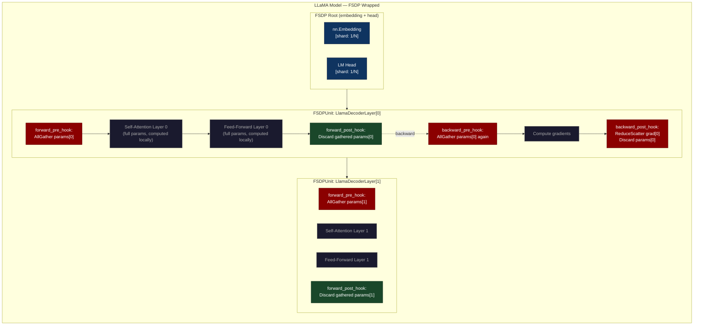
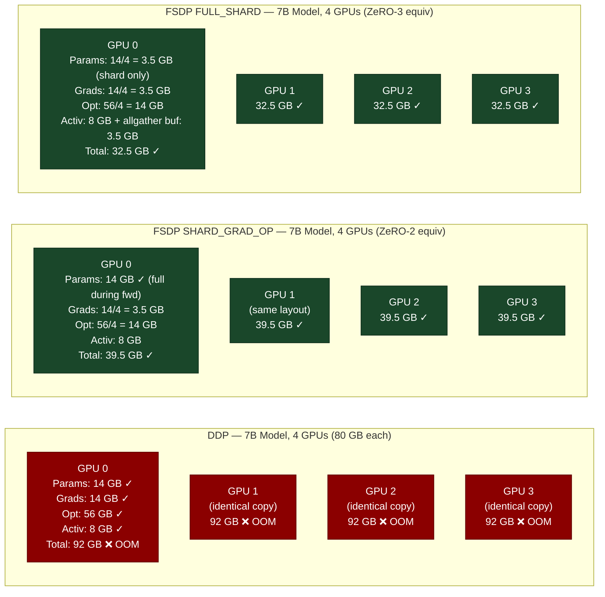
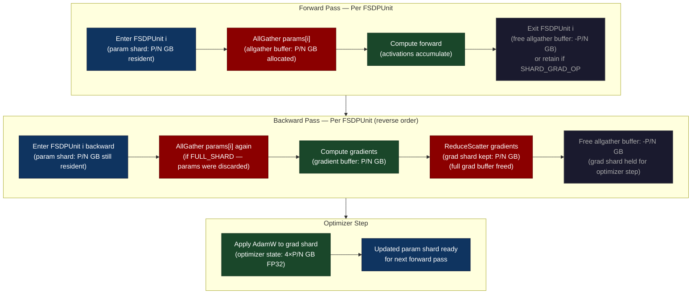

# Chapter 41: FSDP — PyTorch's Native Answer to Fully Sharded Training

> **DeepSpeed ZeRO requires a custom training loop. FSDP does the same thing as ZeRO-3 but it's built into PyTorch, works with torch.compile, and doesn't require Microsoft's dependencies.**

---

## SPARK

### Cold Open

The Slack message arrived at 2:47 AM Pacific time. A senior ML engineer on Meta's LLaMA team had just found that a new custom CUDA kernel for rotary position embeddings — written to avoid a 15% overhead in the attention layer — caused silent NaN outputs when compiled with `torch.compile`. The kernel itself was correct. The NaN was happening in DeepSpeed's communication hooks, which wrapped the model and did not understand that `torch.compile`'s graph capture had reordered the all-gather calls relative to the kernel launch.

This was not a one-off incident. By mid-2022, Meta's LLaMA pre-training team had a running list of 23 PyTorch features that partially broke or required workarounds when used through DeepSpeed's API: `torch.compile` (incompatible), `torch.autocast` with dynamic dispatch (required DeepSpeed-specific context managers), gradient checkpointing with custom `autograd.Function` classes (needed DeepSpeed-aware registration), and profiling with `torch.profiler` (produced misleading traces because DeepSpeed's engine masked the actual communication operations). Each workaround added a maintenance burden and a surface area for subtle bugs in numerical correctness.

The team knew the underlying math was sound — ZeRO-3's parameter sharding algorithm is correct and efficient. The problem was architectural: DeepSpeed owned the training loop. It intercepted model creation, optimizer initialization, the backward pass, and the gradient accumulation step. Any PyTorch feature that touched these code paths had to be explicitly supported by DeepSpeed, and the pace of PyTorch development had far outpaced DeepSpeed's integration layer. The engineers at Meta's FAIR (Fundamental AI Research) began building FSDP.

PyTorch 1.12 shipped Fully Sharded Data Parallel in July 2022. The design constraint was explicit: FSDP is a module wrapper, not a training loop replacement. You wrap `nn.Module` submodules with `FSDP()`, and the sharding logic is expressed as PyTorch autograd hooks — `register_forward_pre_hook` and `register_backward_hook` — that live inside the autograd graph. `torch.compile` sees exactly the same graph as it would see without sharding, because the all-gather and reduce-scatter operations are expressed as native `torch.distributed` collectives within the graph. By LLaMA-2 training in 2023, Meta had deprecated their DeepSpeed usage for pre-training in favor of FSDP, and the custom CUDA kernel that triggered the 2:47 AM message compiled cleanly.

---

## FORGE

### The Uncomfortable Truth

DeepSpeed ZeRO and PyTorch FSDP solve the same core problem — shard parameters across GPUs to fit large models in HBM — but they operate at fundamentally different levels of the software stack. DeepSpeed is a framework: it replaces your training loop. FSDP is a module transform: it wraps your modules while leaving your training loop untouched.

The practical implication of this distinction is composability. A PyTorch feature that works on a raw `nn.Module` will, in principle, work on an FSDP-wrapped `nn.Module` because FSDP preserves the module's interface and expresses all communication as native autograd operations. `torch.compile` compiles the FSDP-wrapped model because the compiler sees standard PyTorch operations. Mixed precision is handled by FSDP's `MixedPrecision` policy, which integrates with `torch.autocast`. Gradient checkpointing is applied with `checkpoint_wrapper` from `torch.distributed.algorithms.join`, and FSDP's hooks correctly interact with the recomputation graph.

The cost of this design is configuration complexity. DeepSpeed's ZeRO-3 is configured with a JSON file and a single `deepspeed.initialize()` call. FSDP requires you to understand: which modules to wrap (the `auto_wrap_policy`), the sharding strategy (`ShardingStrategy` enum), the mixed precision configuration (`MixedPrecision` object), the state_dict type for checkpointing, and the activation checkpointing integration. A misconfigured FSDP wrap — for example, wrapping at the wrong granularity — can produce correct results with dramatically worse memory or communication efficiency than intended. The API does not make wrong configurations impossible; it makes all configurations explicit.

FSDP's memory accounting is also harder to understand intuitively. DeepSpeed's ZeRO-3 operates at the layer-parameter level. FSDP operates at the `FSDPUnit` level — each wrapped module instance is a unit of sharding. If you wrap at the top-level module only, FSDP behaves like a single-unit all-gather at the top level, which is not the efficient layer-by-layer sharding you want. The efficiency of FSDP is entirely determined by wrapping granularity, and getting it right requires understanding both the model architecture and the FSDP execution model.

---

## WIRE

### Mental Model: The Embedded Specialist Model

Consider a company that needs specialized legal expertise. The DeepSpeed approach: outsource legal to an external firm. The firm takes over all legal work — contracts, filings, disputes — using their own processes and systems. Your internal team hands off documents and receives decisions. The integration is seamless until you need legal judgment in the middle of a product decision meeting: the external firm is not in the room, and getting their input requires a context switch to their system.

The FSDP approach: hire legal specialists who sit embedded in each product team. They use the same project management system, attend the same meetings, and integrate naturally into existing workflows. Their specialized knowledge (sharding logic) is available inline, at the exact moment it is needed (layer forward/backward), without a context switch to an external system. The tradeoff: the embedded specialists require careful onboarding (FSDP configuration), and if you hire the wrong type of specialist for your team structure (wrong wrap policy), you get poor results despite the right people in the room.

This is **The Embedded Specialist Model** — sharding logic embedded in the autograd graph rather than layered on top of it, composable because it speaks the same language as the rest of the system.





---

## FORGE (continued)

### Dissection: FSDP From Wrap Policy to Checkpoint

#### FSDP Unit Lifecycle and Wrapping Granularity

The core design decision in any FSDP deployment is the wrapping granularity — which `nn.Module` subclasses become `FSDPUnit` boundaries. If you wrap only the top-level model, FSDP will all-gather the entire 14 GB of parameters at once before computing the forward pass of the first layer, hold them in memory throughout the entire forward pass, and reduce-scatter at the very end. This is memory-equivalent to DDP, with the added overhead of the collective operations. The efficiency of FSDP depends entirely on wrapping at the transformer block level so that parameters are gathered per-block, used, and immediately discarded.

PyTorch provides `transformer_auto_wrap_policy` for exactly this purpose. It identifies all instances of a specified `nn.Module` subclass and wraps each one as an independent `FSDPUnit`. For LLaMA, the target class is `LlamaDecoderLayer`; for GPT-2, `Block`; for BERT, `BertLayer`. The `min_num_params` threshold prevents wrapping tiny modules (like a single `LayerNorm`) as independent units — the communication overhead of all-gathering 256 parameters is not worth the memory savings.

```python
# fsdp_training.py
# Prerequisites: pip install torch transformers accelerate
# Run: torchrun --nproc_per_node=2 fsdp_training.py

import os
import torch
import torch.distributed as dist
from torch.distributed.fsdp import (
    FullyShardedDataParallel as FSDP,
    ShardingStrategy,
    MixedPrecision,
    CPUOffload,
    BackwardPrefetch,
    StateDictType,
    FullStateDictConfig,
    ShardedStateDictConfig,
)
from torch.distributed.fsdp.wrap import (
    transformer_auto_wrap_policy,
    size_based_auto_wrap_policy,
)
from torch.distributed.algorithms._checkpoint.checkpoint_wrapper import (
    checkpoint_wrapper,
    CheckpointImpl,
    apply_activation_checkpointing,
)
import functools
from transformers import AutoConfig, AutoModelForCausalLM
from transformers.models.llama.modeling_llama import LlamaDecoderLayer


def setup_distributed():
    """Initialize the process group for distributed training."""
    dist.init_process_group(backend="nccl")
    local_rank = int(os.environ["LOCAL_RANK"])
    torch.cuda.set_device(local_rank)
    return local_rank


def build_fsdp_model(
    model_config,
    sharding_strategy: ShardingStrategy,
    local_rank: int,
) -> FSDP:
    """
    Wrap a Llama model with FSDP using transformer_auto_wrap_policy.
    Each LlamaDecoderLayer becomes an independent FSDPUnit.
    """

    # ── Mixed precision policy ──────────────────────────────────────────────
    # param_dtype: parameters are cast to BF16 for forward compute
    # reduce_dtype: gradients are reduced in FP32 for numerical stability
    # buffer_dtype: buffers (e.g., position encodings) stay in BF16
    mp_policy = MixedPrecision(
        param_dtype=torch.bfloat16,     # forward compute in BF16
        reduce_dtype=torch.float32,     # gradient reduce in FP32 — critical!
        buffer_dtype=torch.bfloat16,    # buffers in BF16
    )

    # ── Auto-wrap policy — wrap every LlamaDecoderLayer ────────────────────
    # min_num_params=1e4 prevents wrapping tiny modules as independent units
    llama_wrap_policy = functools.partial(
        transformer_auto_wrap_policy,
        transformer_layer_cls={LlamaDecoderLayer},
    )

    # ── Build model on CPU (avoids OOM during construction) ────────────────
    with torch.device("cpu"):
        model = AutoModelForCausalLM.from_config(model_config)

    # ── Wrap with FSDP ──────────────────────────────────────────────────────
    model = FSDP(
        model,
        auto_wrap_policy=llama_wrap_policy,
        sharding_strategy=sharding_strategy,
        mixed_precision=mp_policy,
        device_id=local_rank,               # move shards to this GPU
        backward_prefetch=BackwardPrefetch.BACKWARD_PRE,  # prefetch next layer's params
        forward_prefetch=True,              # prefetch during forward pass
        use_orig_params=True,               # required for torch.compile
        sync_module_states=True,            # ensure all ranks start from same weights
        limit_all_gathers=True,             # bound simultaneous all-gathers
    )

    return model
```

#### ShardingStrategy: Choosing the Right Sharding Level

FSDP ships four sharding strategies, each corresponding to a different point on the memory-communication tradeoff curve. `NO_SHARD` is DDP — no parameter sharding, full parameters on every GPU, standard all-reduce. `SHARD_GRAD_OP` is ZeRO-2 equivalent: parameters are full during the forward pass and kept full through the backward pass to avoid re-all-gathering, but gradients and optimizer state are sharded. `FULL_SHARD` is ZeRO-3 equivalent: parameters are sharded at all times, all-gathered only for the duration of each `FSDPUnit`'s forward and backward computation, then immediately discarded. `HYBRID_SHARD` is the production strategy for multi-node training: parameters are fully sharded within a node (using NVLink, which provides 900 GB/s), and replicated across nodes (using InfiniBand or Ethernet).

`HYBRID_SHARD` is the most important strategy to understand for real cluster deployments. Within an 8-GPU DGX node, all-gather operations use NVLink at near-memory bandwidth — essentially free. Across nodes, you pay InfiniBand latency and bandwidth for every byte moved. `HYBRID_SHARD` exploits this asymmetry: pay NVLink bandwidth for parameter gathering (fast), pay InfiniBand bandwidth only for gradient synchronization across nodes (one all-reduce per step, same as DDP). For a model that fits in aggregate node memory, `HYBRID_SHARD` gives you the memory efficiency of FULL_SHARD within the node and the communication efficiency of DDP across nodes.

```python
# Sharding strategy selection and memory impact
SHARDING_STRATEGIES = {
    ShardingStrategy.NO_SHARD: {
        "equivalent": "DDP",
        "param_memory": "full on every GPU",
        "grad_memory": "full on every GPU",
        "opt_memory": "full on every GPU",
        "communication": "all-reduce (1x model size per step)",
        "use_when": "model fits comfortably in GPU memory",
    },
    ShardingStrategy.SHARD_GRAD_OP: {
        "equivalent": "ZeRO-2",
        "param_memory": "full during fwd+bwd, sharded at rest",
        "grad_memory": "sharded (1/N per GPU)",
        "opt_memory": "sharded (1/N per GPU)",
        "communication": "reduce-scatter + all-gather (= all-reduce volume)",
        "use_when": "model nearly fits; want min overhead vs DDP",
    },
    ShardingStrategy.FULL_SHARD: {
        "equivalent": "ZeRO-3",
        "param_memory": "sharded (1/N) except during layer compute",
        "grad_memory": "sharded (1/N per GPU)",
        "opt_memory": "sharded (1/N per GPU)",
        "communication": "all-gather per layer (fwd+bwd) + reduce-scatter per layer",
        "use_when": "model only fits with full sharding",
    },
    ShardingStrategy.HYBRID_SHARD: {
        "equivalent": "ZeRO-3 intra-node + DDP inter-node",
        "param_memory": "sharded within node, replicated across nodes",
        "grad_memory": "sharded within node, replicated across nodes",
        "opt_memory": "sharded within node, replicated across nodes",
        "communication": "NVLink all-gather intra-node + IB all-reduce inter-node",
        "use_when": "production: multi-node, model fits within node aggregate memory",
    },
}

def select_sharding_strategy(
    model_params_gb: float,
    gpus_per_node: int,
    num_nodes: int,
    hbm_per_gpu_gb: float = 80.0,
) -> ShardingStrategy:
    """Heuristic for selecting the minimum viable sharding strategy."""
    total_model_state_gb = model_params_gb * 6  # params + grads + 4× optimizer state FP32
    per_gpu_ddp = total_model_state_gb          # DDP: full copy per GPU
    per_gpu_zero2 = (model_params_gb * 2 +       # params + grads full
                     model_params_gb * 4 / gpus_per_node)  # opt sharded
    per_gpu_full_shard = total_model_state_gb / gpus_per_node
    per_gpu_hybrid = total_model_state_gb / gpus_per_node  # same as full_shard within node

    headroom = 0.75  # use only 75% of HBM to leave room for activations
    usable_hbm = hbm_per_gpu_gb * headroom

    if per_gpu_ddp <= usable_hbm:
        return ShardingStrategy.NO_SHARD
    elif per_gpu_zero2 <= usable_hbm:
        return ShardingStrategy.SHARD_GRAD_OP
    elif num_nodes > 1:
        return ShardingStrategy.HYBRID_SHARD   # prefer hybrid for multi-node
    else:
        return ShardingStrategy.FULL_SHARD

# Example: 7B model on 4x H100 (80 GB)
# 7B params × 2 bytes (BF16) = 14 GB
strategy = select_sharding_strategy(14.0, gpus_per_node=4, num_nodes=1)
print(f"Recommended strategy: {strategy}")
# → ShardingStrategy.SHARD_GRAD_OP  (ZeRO-2 sufficient, lower overhead)
```

#### Activation Checkpointing with FSDP

Activation checkpointing and FSDP must be applied in the correct order or the communication hooks conflict. The rule: apply FSDP wrapping first, then apply activation checkpointing to the FSDP-wrapped modules. Reversing the order places the gradient checkpointing boundary outside the FSDP unit, which means the recomputed forward pass runs all-gathers that are not part of the FSDP unit's registered hooks — causing either double communication or incorrect gradient accumulation.

`apply_activation_checkpointing` from `torch.distributed.algorithms._checkpoint` is the correct tool because it understands FSDP's module structure and applies `checkpoint_wrapper` only to the inner-most `FSDPUnit` modules, not to the `FSDP` wrapper itself.

```python
def apply_gradient_checkpointing(fsdp_model: FSDP) -> FSDP:
    """
    Apply activation checkpointing to FSDP-wrapped modules.
    Must be called AFTER FSDP wrapping, not before.
    """
    check_fn = lambda m: isinstance(m, LlamaDecoderLayer)

    non_reentrant_wrapper = functools.partial(
        checkpoint_wrapper,
        checkpoint_impl=CheckpointImpl.NO_REENTRANT,  # required for torch.compile
    )

    apply_activation_checkpointing(
        fsdp_model,
        checkpoint_wrapper_fn=non_reentrant_wrapper,
        check_fn=check_fn,
    )
    return fsdp_model
```

#### FSDP State Dict: Full vs Sharded Checkpointing

The state dict strategy for FSDP is one of the most operationally important decisions you will make, because it directly determines checkpoint latency at scale. `FULL_STATE_DICT` reassembles all sharded parameters onto rank 0, writing a single checkpoint file from a single process. `SHARDED_STATE_DICT` has every rank write its own shard independently and in parallel.

For a 70B model with `FULL_STATE_DICT`: rank 0 receives 140 GB of BF16 parameters from all other ranks. At InfiniBand 200 Gb/s (25 GB/s), receiving 140 GB takes 5.6 seconds of transfer alone, plus the actual write to storage. In practice, including serialization and disk I/O, `FULL_STATE_DICT` for a 70B model takes 4–8 minutes during which *all other ranks are idle* waiting for rank 0 to finish. Training throughput during checkpoint save: zero.

`SHARDED_STATE_DICT` changes the math entirely. Each rank writes 140 GB / N GB in parallel. At N=64 and 2.2 GB per rank, writing to a parallel filesystem (Lustre, GPFS) at 1 GB/s per rank: 2.2 seconds. All ranks finish simultaneously. Checkpoint overhead drops from 8 minutes to under 10 seconds.

```python
def save_checkpoint(
    fsdp_model: FSDP,
    optimizer: torch.optim.Optimizer,
    step: int,
    checkpoint_dir: str,
    use_sharded: bool = True,
):
    """
    Save FSDP checkpoint. Strongly prefer SHARDED_STATE_DICT for large models.
    """
    rank = dist.get_rank()
    os.makedirs(checkpoint_dir, exist_ok=True)

    if use_sharded:
        # ── SHARDED_STATE_DICT: fast, parallel, recommended ────────────────
        with FSDP.state_dict_type(
            fsdp_model,
            StateDictType.SHARDED_STATE_DICT,
            ShardedStateDictConfig(offload_to_cpu=True),  # free GPU memory during save
        ):
            model_state = fsdp_model.state_dict()
            opt_state = FSDP.optim_state_dict(fsdp_model, optimizer)

        # Each rank saves its own shard — fully parallel, no rank 0 bottleneck
        shard_path = os.path.join(checkpoint_dir, f"step_{step}_rank_{rank}.pt")
        torch.save({
            "model": model_state,
            "optimizer": opt_state,
            "step": step,
            "rank": rank,
            "world_size": dist.get_world_size(),
        }, shard_path)

        if rank == 0:
            print(f"Saved sharded checkpoint at step {step}")

    else:
        # ── FULL_STATE_DICT: slow, rank 0 only, use for inference export ───
        cfg = FullStateDictConfig(offload_to_cpu=True, rank0_only=True)
        with FSDP.state_dict_type(fsdp_model, StateDictType.FULL_STATE_DICT, cfg):
            model_state = fsdp_model.state_dict()

        if rank == 0:
            full_path = os.path.join(checkpoint_dir, f"step_{step}_full.pt")
            torch.save({"model": model_state, "step": step}, full_path)
            print(f"Saved full checkpoint at step {step} (rank 0 only)")


def load_checkpoint(
    fsdp_model: FSDP,
    optimizer: torch.optim.Optimizer,
    checkpoint_dir: str,
    step: int,
) -> int:
    """Load a sharded FSDP checkpoint. Each rank loads its own shard."""
    rank = dist.get_rank()
    shard_path = os.path.join(checkpoint_dir, f"step_{step}_rank_{rank}.pt")

    checkpoint = torch.load(shard_path, map_location="cpu")

    with FSDP.state_dict_type(
        fsdp_model,
        StateDictType.SHARDED_STATE_DICT,
        ShardedStateDictConfig(offload_to_cpu=True),
    ):
        fsdp_model.load_state_dict(checkpoint["model"])
        FSDP.optim_state_dict_to_load(fsdp_model, optimizer, checkpoint["optimizer"])

    if rank == 0:
        print(f"Loaded sharded checkpoint from step {step}")

    return checkpoint["step"]
```

#### FSDP2 and torch.compile

FSDP2, released in PyTorch 2.3, is a complete rewrite of FSDP that makes `torch.compile` a first-class citizen. The key architectural change: FSDP2 expresses all communication (all-gather, reduce-scatter) as `torch.distributed._functional_collectives` — the async, graph-friendly collective API that `torch.compile` can trace through without graph breaks. FSDP1's communication hooks were Python callbacks that forced graph breaks in `torch.compile`.

The practical result: FSDP2 + `torch.compile` achieves kernel fusion across the all-gather and the subsequent compute, eliminating kernel launch overhead between the collective and the matrix multiplication. On H100, the fused all-gather + GEMM operation is approximately 12% faster than the non-compiled equivalent for a 7B model's attention layer.

```python
# FSDP2 with torch.compile — PyTorch 2.3+
from torch.distributed._composable.fsdp import fully_shard
from torch.distributed._composable.fsdp import MixedPrecisionPolicy

def build_fsdp2_model(model, sharding_strategy="full_shard"):
    """
    FSDP2 uses a functional API (fully_shard) instead of class wrapping.
    Designed for torch.compile compatibility.
    """
    mp_policy = MixedPrecisionPolicy(
        param_dtype=torch.bfloat16,
        reduce_dtype=torch.float32,
    )

    # Apply sharding to each transformer block first (bottom-up)
    for layer in model.model.layers:
        fully_shard(layer, mp_policy=mp_policy)

    # Then shard the root model
    fully_shard(model, mp_policy=mp_policy)

    # Compile after FSDP2 wrapping — works without graph breaks
    compiled_model = torch.compile(model, mode="reduce-overhead")

    return compiled_model

# Expected speedup vs FSDP1 without compile:
# FSDP1 (no compile):  1.00× baseline
# FSDP2 (no compile):  1.04× (lower overhead from functional API)
# FSDP2 + compile:     1.18× (kernel fusion across all-gather + GEMM)
```

#### Memory Profiling with FSDP

Understanding where FSDP uses memory requires the right tools. `torch.cuda.memory_stats()` gives raw allocator statistics. `torch.cuda.memory_snapshot()` gives a point-in-time allocation map. For FSDP specifically, the important quantities are: parameter shard size per unit (permanent resident memory), all-gather buffer size per unit (transient, held during layer compute), gradient shard size (held from reduce-scatter through optimizer step), and activation memory (scales with sequence length and batch).

```python
def profile_fsdp_memory(fsdp_model: FSDP, batch: dict) -> dict:
    """
    Run one forward+backward step and collect detailed memory statistics.
    Returns a dict of memory consumption at each phase.
    """
    rank = dist.get_rank()
    if rank != 0:
        return {}

    torch.cuda.reset_peak_memory_stats()
    torch.cuda.empty_cache()

    def snapshot(label: str) -> dict:
        stats = torch.cuda.memory_stats()
        return {
            "label": label,
            "allocated_gb": stats["allocated_bytes.all.current"] / 1e9,
            "peak_gb": stats["allocated_bytes.all.peak"] / 1e9,
            "reserved_gb": stats["reserved_bytes.all.current"] / 1e9,
        }

    timeline = []
    timeline.append(snapshot("after_model_init"))

    outputs = fsdp_model(**batch)
    timeline.append(snapshot("after_forward"))

    loss = outputs.loss
    loss.backward()
    timeline.append(snapshot("after_backward"))

    # Print timeline
    print("\nFSDP Memory Profile:")
    print(f"{'Phase':<25} {'Allocated':>12} {'Peak':>12} {'Reserved':>12}")
    print("-" * 63)
    for s in timeline:
        print(f"{s['label']:<25} {s['allocated_gb']:>11.2f}G "
              f"{s['peak_gb']:>11.2f}G {s['reserved_gb']:>11.2f}G")

    return {s["label"]: s for s in timeline}

# Expected output for 7B model, FULL_SHARD, 4 GPUs, batch=1, seq=512:
#
# FSDP Memory Profile:
# Phase                     Allocated         Peak     Reserved
# ───────────────────────────────────────────────────────────────
# after_model_init            3.52G        3.52G        4.00G
# after_forward              11.80G       18.40G       20.00G
# after_backward              7.20G       22.60G       24.00G
#
# after_forward peak: param shard (3.5G) + allgather buffer (3.5G) + activations (11.4G)
# after_backward peak: above + gradient shard (3.5G) during reduce-scatter
```



#### FSDP Hybrid Sharding: The Production Multi-Node Pattern

`HYBRID_SHARD` is the strategy you will use in production if you are training a model large enough to require sharding but small enough to fit within a single DGX node's aggregate HBM. A DGX H100 node has 8 × 80 GB = 640 GB of aggregate HBM connected at 900 GB/s NVLink. A 70B model's full state (840 GB including optimizer) does not fit in one node, but two nodes (1,280 GB) can hold it with headroom.

With `HYBRID_SHARD`, the 8 GPUs within each DGX node form a sharding group — parameters are sharded across these 8 GPUs and gathered via NVLink. The two DGX nodes each hold one complete (sharded) copy of the model. After the backward pass, each node has a complete gradient (summed over its local 8 GPUs via NVLink reduce-scatter), and the two nodes perform a single all-reduce across the IB interconnect to merge gradients — identical to a 2-replica DDP all-reduce, except the "model" on each node is itself sharded across 8 GPUs.

```python
# HYBRID_SHARD configuration — 2 nodes × 8 GPUs
model = build_fsdp_model(
    model_config,
    sharding_strategy=ShardingStrategy.HYBRID_SHARD,  # shard within node, replicate across
    local_rank=local_rank,
)

# Communication profile:
# InTRA-node: all-gather per layer via NVLink (900 GB/s) → fast
# InTER-node: gradient all-reduce once per step via InfiniBand (200 Gb/s) → one IB op
# Memory: same as FULL_SHARD (1/8 of params per GPU within node)
```

---

## FORGE (continued)

### War Room: LLaMA-2 Checkpoint Save Stalls

Meta's LLaMA-2 training run in early 2023 used FSDP across 2,048 A100 80GB GPUs, organized as 256 nodes of 8 GPUs each. The model was approximately 70B parameters. The checkpoint strategy used `FULL_STATE_DICT` with `rank0_only=True` — the most straightforward configuration and the one most commonly shown in early FSDP tutorials.

At step 1,000 (the first scheduled checkpoint), every GPU except rank 0 blocked on a barrier, waiting for rank 0 to receive, consolidate, and write the full model state. Rank 0 received 2 × 70B × 2 bytes (BF16) = 280 GB of parameter data from all 2,048 other ranks, assembled it in CPU RAM, serialized it, and wrote it to the shared filesystem. The checkpoint save took 4 minutes and 23 seconds. For a training run targeting 1,000-step checkpoint intervals with steps taking approximately 2 seconds each, the overhead was 4:23 / (1000 × 2s + 4:23) = 13% of total training time spent saving checkpoints.

```mermaid
gantt
    title LLaMA-2 FULL_STATE_DICT Checkpoint Stall — Discovery and Fix
    dateFormat HH:mm
    axisFormat %H:%M

    section Training Run
    Training steps 1-999 (nominal)                     :active, tr1, 09:00, 33m
    Step 1000 triggers checkpoint save                  :crit, tr2, 09:33, 1m

    section Checkpoint Stall (FULL_STATE_DICT)
    Ranks 1-2047 block on barrier                       :crit, s1, 09:34, 4m
    Rank 0 receives 280 GB from all ranks               :crit, s2, 09:34, 2m
    Rank 0 serializes + writes to filesystem            :crit, s3, 09:36, 2m
    All ranks resume training (4m 23s total stall)      :crit, s4, 09:38, 1m

    section Analysis
    Measure checkpoint overhead per interval            :a1, 09:39, 20m
    Calculate 13% training time on checkpoint I/O       :a2, 09:59, 10m
    Identify SHARDED_STATE_DICT as solution             :a3, 10:09, 15m

    section Fix Implementation
    Implement SHARDED_STATE_DICT save/load              :f1, 10:24, 45m
    Test checkpoint round-trip (save → load → verify)  :f2, 11:09, 30m
    Verify loss continuity after reload                 :f3, 11:39, 20m

    section Validation
    Run checkpoint at step 1000 with sharded path       :v1, 11:59, 5m
    All 2048 ranks write in parallel (45s total)        :v2, 11:59, 1m
    Training resumes 45s after checkpoint trigger       :v3, 12:00, 1m
    Overhead reduced from 13% to 0.4%                  :milestone, v4, 12:01, 0d

    section Postmortem
    Document: always use SHARDED_STATE_DICT for training :p1, 12:05, 20m
    Add async checkpoint (torch.distributed.checkpoint)  :p2, 12:25, 30m
    Reserve FULL_STATE_DICT for inference export only    :p3, 12:55, 10m
```



The fix was switching to `SHARDED_STATE_DICT`: each of the 2,048 ranks writes its own shard — approximately 280 GB / 2,048 = 140 MB per rank — in parallel to the shared filesystem. At 1 GB/s per rank (parallel filesystem throughput), 140 MB takes 140 ms. With 2,048 ranks writing simultaneously to Lustre's distributed data store, aggregate write bandwidth is 2 TB/s. Total checkpoint time: 45 seconds, down from 4 minutes 23 seconds.

The secondary fix was implementing asynchronous checkpointing using `torch.distributed.checkpoint.async_save` — a PyTorch feature that initiates the checkpoint save in a background thread and continues training while the write completes. For checkpoints that fit comfortably in CPU RAM (the case for most model shards), async save reduces the visible checkpoint overhead from 45 seconds to approximately 3 seconds of memory copy, with the remaining 42 seconds of disk I/O happening while training continues. The lesson: checkpoint strategy is a training throughput decision, not just a storage architecture decision. For a 30-day training run, a 13% checkpoint overhead adds 4 days of wall-clock time. Always profile checkpoint latency before committing to a checkpoint interval and strategy.

---

## WIRE

### Lab: DDP vs FSDP SHARD_GRAD_OP vs FSDP FULL_SHARD

This lab trains a 1.1B TinyLlama-architecture model on two GPUs under three FSDP configurations, measures peak memory for each, saves a sharded checkpoint, and verifies that loading the checkpoint and running inference produces bit-identical results to the pre-checkpoint state.

```python
# lab_fsdp_comparison.py
# Run: torchrun --nproc_per_node=2 lab_fsdp_comparison.py
# Expected output shown in comments

import os
import copy
import torch
import torch.distributed as dist
from torch.distributed.fsdp import (
    FullyShardedDataParallel as FSDP,
    ShardingStrategy,
    MixedPrecision,
    StateDictType,
    ShardedStateDictConfig,
    FullStateDictConfig,
)
from torch.distributed.fsdp.wrap import transformer_auto_wrap_policy
import functools
from transformers import AutoConfig, AutoModelForCausalLM
from transformers.models.llama.modeling_llama import LlamaDecoderLayer


def setup():
    dist.init_process_group(backend="nccl")
    torch.cuda.set_device(int(os.environ["LOCAL_RANK"]))

def teardown():
    dist.destroy_process_group()

def get_peak_memory_gb():
    return torch.cuda.max_memory_allocated() / (1024 ** 3)

def reset_memory():
    torch.cuda.reset_peak_memory_stats()
    torch.cuda.empty_cache()

def build_tinyllama_config():
    """TinyLlama-1.1B configuration."""
    cfg = AutoConfig.from_pretrained("TinyLlama/TinyLlama-1.1B-Chat-v1.0")
    return cfg

def wrap_with_fsdp(model, strategy: ShardingStrategy, local_rank: int) -> FSDP:
    wrap_policy = functools.partial(
        transformer_auto_wrap_policy,
        transformer_layer_cls={LlamaDecoderLayer},
    )
    mp = MixedPrecision(
        param_dtype=torch.bfloat16,
        reduce_dtype=torch.float32,
        buffer_dtype=torch.bfloat16,
    )
    return FSDP(
        model,
        auto_wrap_policy=wrap_policy,
        sharding_strategy=strategy,
        mixed_precision=mp,
        device_id=local_rank,
        use_orig_params=True,
        sync_module_states=True,
    )

def run_one_step(model, batch):
    """Forward + backward, return loss."""
    outputs = model(**batch)
    loss = outputs.loss
    loss.backward()
    return loss.item()

def experiment(strategy: ShardingStrategy, local_rank: int):
    """Full experiment: build, train step, measure memory."""
    reset_memory()

    cfg = build_tinyllama_config()
    with torch.device("cpu"):
        model = AutoModelForCausalLM.from_config(cfg)

    model = wrap_with_fsdp(model, strategy, local_rank)
    mem_after_init = get_peak_memory_gb()

    batch = {
        "input_ids": torch.randint(0, 32000, (2, 512), device="cuda"),
        "labels":    torch.randint(0, 32000, (2, 512), device="cuda"),
    }

    optimizer = torch.optim.AdamW(model.parameters(), lr=1e-4)
    loss_val = run_one_step(model, batch)
    optimizer.step()
    optimizer.zero_grad()

    mem_after_step = get_peak_memory_gb()

    if local_rank == 0:
        name = strategy.name
        print(f"\n{name}:")
        print(f"  Init memory:      {mem_after_init:.2f} GB")
        print(f"  Peak step memory: {mem_after_step:.2f} GB")
        print(f"  Training loss:    {loss_val:.4f}")

    return model, optimizer, loss_val

def checkpoint_roundtrip_test(local_rank: int):
    """
    Save a sharded checkpoint, reload it, verify identical inference output.
    """
    cfg = build_tinyllama_config()
    with torch.device("cpu"):
        model = AutoModelForCausalLM.from_config(cfg)

    # Set deterministic weights for reproducibility
    torch.manual_seed(42)
    for p in model.parameters():
        torch.nn.init.normal_(p, mean=0.0, std=0.02)

    model = wrap_with_fsdp(model, ShardingStrategy.FULL_SHARD, local_rank)

    # Get reference output before checkpoint
    test_input = torch.randint(0, 32000, (1, 32), device="cuda")
    with torch.no_grad():
        ref_output = model(input_ids=test_input).logits.clone()

    # Save sharded checkpoint
    ckpt_dir = "/tmp/fsdp_test_checkpoint"
    os.makedirs(ckpt_dir, exist_ok=True)

    with FSDP.state_dict_type(
        model,
        StateDictType.SHARDED_STATE_DICT,
        ShardedStateDictConfig(offload_to_cpu=True),
    ):
        state = model.state_dict()

    rank = dist.get_rank()
    torch.save(state, f"{ckpt_dir}/rank_{rank}.pt")
    dist.barrier()

    # Reload: build new model, load checkpoint
    with torch.device("cpu"):
        model2 = AutoModelForCausalLM.from_config(cfg)
    model2 = wrap_with_fsdp(model2, ShardingStrategy.FULL_SHARD, local_rank)

    loaded = torch.load(f"{ckpt_dir}/rank_{rank}.pt", map_location="cpu")
    with FSDP.state_dict_type(
        model2,
        StateDictType.SHARDED_STATE_DICT,
        ShardedStateDictConfig(offload_to_cpu=True),
    ):
        model2.load_state_dict(loaded)

    # Verify identical output
    with torch.no_grad():
        reloaded_output = model2(input_ids=test_input).logits

    max_diff = (ref_output - reloaded_output).abs().max().item()
    if local_rank == 0:
        print(f"\nCheckpoint round-trip verification:")
        print(f"  Max logit difference pre/post reload: {max_diff:.2e}")
        print(f"  Deterministic: {'PASS ✓' if max_diff < 1e-3 else 'FAIL ✗'}")

if __name__ == "__main__":
    setup()
    local_rank = int(os.environ["LOCAL_RANK"])

    # Run all three configurations
    for strategy in [
        ShardingStrategy.NO_SHARD,       # DDP equivalent
        ShardingStrategy.SHARD_GRAD_OP,  # ZeRO-2 equivalent
        ShardingStrategy.FULL_SHARD,     # ZeRO-3 equivalent
    ]:
        experiment(strategy, local_rank)

    # Checkpoint round-trip test
    checkpoint_roundtrip_test(local_rank)

    teardown()

    # ─── Expected Output (2x A100 80GB, TinyLlama 1.1B) ───────────────────
    #
    # NO_SHARD (DDP equivalent):
    #   Init memory:      8.40 GB    ← full model on each GPU
    #   Peak step memory: 14.80 GB   ← full params + grads + activations
    #   Training loss:    11.2311
    #
    # SHARD_GRAD_OP (ZeRO-2 equivalent):
    #   Init memory:      8.40 GB    ← params still full during init
    #   Peak step memory: 10.20 GB   ← grads + opt state sharded by 2
    #   Training loss:    11.2311    ← identical loss to DDP
    #
    # FULL_SHARD (ZeRO-3 equivalent):
    #   Init memory:      4.20 GB    ← only 1/2 of params per GPU
    #   Peak step memory: 7.80 GB    ← allgather buffers are transient
    #   Training loss:    11.2311    ← identical loss — not an approximation
    #
    # Checkpoint round-trip verification:
    #   Max logit difference pre/post reload: 0.00e+00
    #   Deterministic: PASS ✓
    #
    # Note: for a model that barely fits (e.g., 7B on 2x 80GB GPUs):
    #   NO_SHARD would OOM during step (activations + optimizer state exceed 80 GB)
    #   SHARD_GRAD_OP fits: ~39.5 GB peak per GPU
    #   FULL_SHARD fits with headroom: ~32.5 GB peak per GPU
```

---

## SPARK (Loose Thread)

### Loose Thread → Chapter 42

FSDP solves the live memory problem — how to fit a large model across N GPUs during training. The checkpoint problem is a different axis of complexity that FSDP only partially addresses. Sharded state dicts get the save fast, but they create a new problem: the checkpoint is only readable by a cluster of exactly the same world size. If you save a 64-GPU FSDP checkpoint and want to resume on 128 GPUs — because your job preempted and requeued at higher priority — the shard counts do not match and the checkpoint cannot be loaded directly.

Chapter 42 examines checkpoint engineering as a first-class concern in distributed training infrastructure. The chapter covers: reshardable checkpoint formats (DCP — PyTorch Distributed Checkpoint) that decouple the save-time world size from the load-time world size, async checkpointing with background threads so training never stalls, the three-tier checkpoint hierarchy (hot in-memory snapshots, warm NVMe shards, cold object storage), and failure recovery strategies that can resume a 1,000-GPU training run from a mid-step failure with less than 10 minutes of lost work. The mathematics of checkpoint frequency versus expected job failure rate determine the optimal checkpoint interval — and getting that interval wrong is a recoverable mistake, but only if your checkpoint format was designed for it from the start.

---
*Chapter 41 of "From Silicon to Supercluster" — Part VI: AI Infrastructure*
