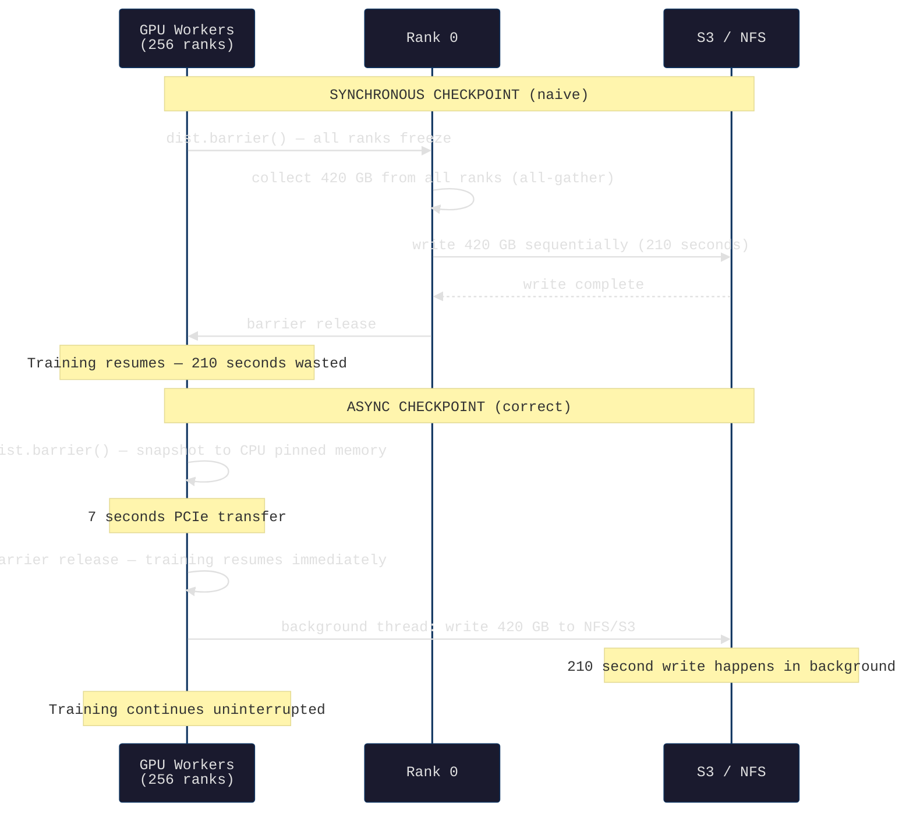
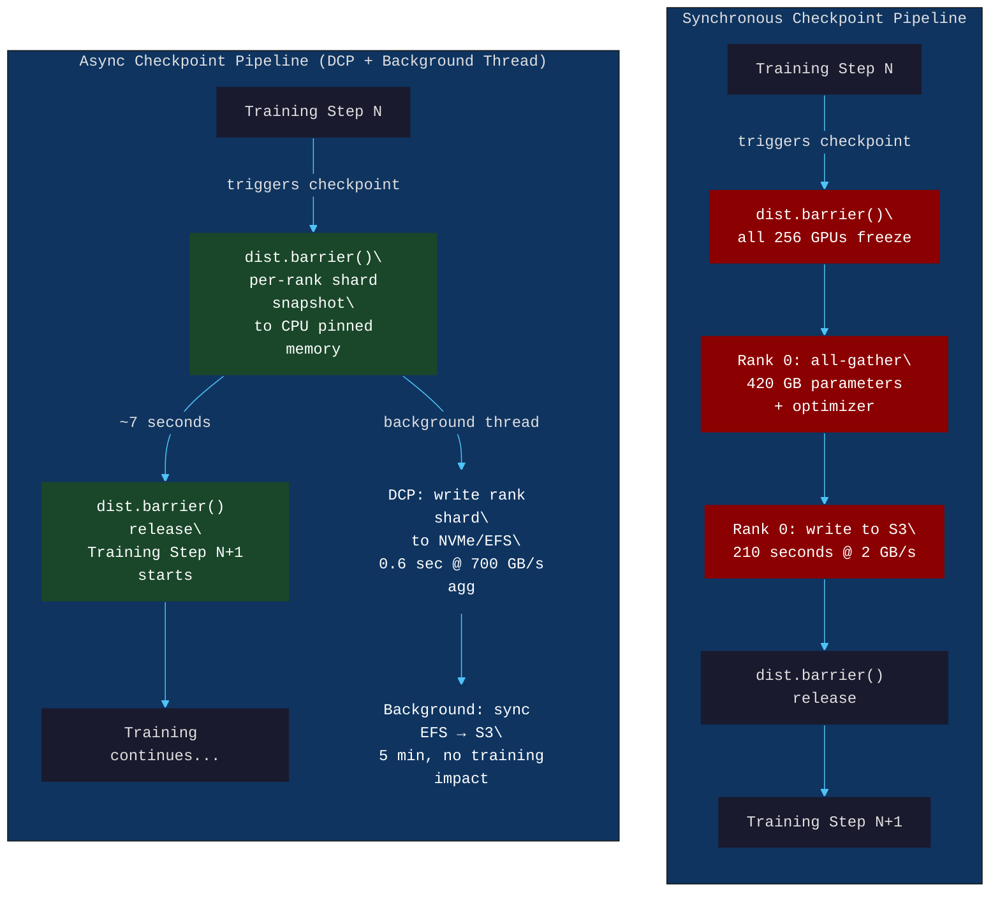
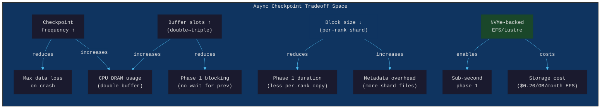

# Chapter 42: Checkpoint Engineering — Saving Model State Without Killing the Run

> **"A 140 GB model checkpoint saved synchronously blocks training for 4 minutes every hour. At 30 cents per GPU-hour on 256 GPUs, that's $5,120 wasted on checkpointing per day."**

---

## Part I — SPARK

### Cold Open

The dashboard looks perfect. 256 H100s are humming at 98% MFU (Model FLOP Utilization), loss is trending down in a smooth curve that makes researchers smile. The run is at hour 47 of a planned 336-hour training job, and the numbers tell a story of a run that is going to finish clean. Then the checkpoint fires.

Every GPU stops. Rank 0 issues a `dist.barrier()` call, and all 255 other ranks freeze mid-batch and wait. The all-gather begins: Rank 0 collects 140 GB of BF16 model parameters and 280 GB of FP32 Adam optimizer state from across 256 machines, pulling tensors over the high-speed InfiniBand fabric at ~200 GB/s aggregate — but Rank 0 still has to write 420 GB sequentially to S3 at 2 GB/s from a single process. The math is merciless: 210 seconds. Three and a half minutes where every GPU sits idle, clocks running, money burning.

This particular team configured checkpoints every 30 minutes, which feels conservative. It is not conservative enough — it is expensive in a way that spreadsheets never caught because nobody measured checkpoint overhead as a line item. Two checkpoints per hour, 3.5 minutes each: 7 minutes of dead GPU time out of every 60. At 256 GPUs × $3/hr per GPU = $768/hour for the cluster, that 11.67% dead time costs $89.60 per hour. Over a 2-week run: $30,000 evaporated. Not on model compute. On `torch.save()`.

The team finds out about the cost on day 4. They find out about the second problem on day 5, at hour 47 and 30 minutes. The run diverges. Nobody knows why — the gradients looked fine at hour 47, the checkpoint at hour 47 was being written when the divergence started, and the checkpoint is corrupted because the write was interrupted mid-stream when a transient NFS timeout caused Rank 0's `write()` call to throw an exception that was swallowed by the error handler. The last clean checkpoint is at hour 46. They lose 90 minutes of training time, but more importantly, they lose confidence in their checkpointing system.

That confidence never fully comes back. The team adds more frequent checkpoints (every 15 minutes), which makes the overhead problem worse. They add manual checkpoint verification, which adds human latency to the recovery loop. They finish the run, but they spend the next month building the system they should have built before the 336-hour job started. This chapter is that system.

The fundamental problem is not that checkpointing is expensive — it is that synchronous checkpointing serializes two things that do not need to be serialized: capturing model state and writing that state to persistent storage. These are different operations with different performance characteristics and different failure modes. Separating them is the core engineering insight of production checkpoint design.

---

### Uncomfortable Truth

Most training pipelines save checkpoints synchronously, blocking all training while writing to storage. This is the simplest implementation. It is wrong at scale, and the wrongness compounds with every GPU you add.

The correct mental model is: capturing state and persisting state are separate operations. Capturing state — snapshotting GPU HBM tensors to CPU DRAM — takes 7 seconds for 420 GB over PCIe (64 GB/s). That pause is unavoidable if you want a consistent point-in-time snapshot. But writing 420 GB to S3 at 2 GB/s takes 210 seconds, and that work has zero dependency on GPU computation. Training can continue immediately after the CPU snapshot completes.

At 700 GB/s aggregate NVMe bandwidth on a 256-node cluster (NVMe-oF, Chapter 19), snapshotting 420 GB of model state to node-local or network-attached NVMe takes under 1 second — amortized over 30 minutes of training, that is 0.05% overhead. The 210-second S3 write becomes a background operation that consumes network bandwidth but does not touch the GPU timeline at all.

Teams resist this because async checkpoints introduce complexity: you need to track whether the background write completed successfully, handle the case where a new checkpoint fires before the previous one finishes flushing, and implement double-buffering to avoid blocking on the second checkpoint while the first is still in flight. These are real engineering costs. They are smaller than $30,000 per 2-week run.

The other truth: most teams checkpoint too infrequently. The mathematically optimal checkpoint interval (derived from minimizing expected wasted work) is `sqrt(2 × T_recovery × T_write)`. For a 20-minute recovery time and a 3.5-minute checkpoint write, the optimal interval is under 12 minutes. Most teams use 30–60 minutes because more frequent checkpoints feel wasteful. With async checkpointing reducing the write overhead to near zero, frequent checkpoints stop feeling wasteful and start being cheap insurance.

---

## Part II — FORGE

### Mental Model: The Non-Blocking Reconciliation Model

Picture a busy retail bank at end of day. The old-school approach: when the 5 PM reconciliation starts, the bank locks every teller window, freezes every transaction in flight, and lets one senior teller manually verify every account balance against the day's ledger. Every customer waits. Every window is dark. Customers grumble. When reconciliation finishes — 35 minutes later — the bank reopens.

The modern approach: at 5 PM, the bank's computer takes an instantaneous atomic snapshot of every account balance (this takes milliseconds). Teller windows keep serving customers. Meanwhile, the reconciliation system works from the snapshot in a back office, comparing balances, flagging anomalies, writing audit logs. The snapshot-to-disk operation happens independently, in parallel, over the next hour. Customers never see a pause.

This is the **Non-Blocking Reconciliation Model**. The key is the atomic snapshot: it must be instantaneous and consistent (all accounts captured at the same logical moment). But the persistence of that snapshot — the actual writing to permanent record — has no dependency on continued bank operations.

Applied to ML training: the `dist.barrier()` + CPU copy phase is the atomic snapshot (unavoidable, but fast). The S3/NFS write is the back-office reconciliation (slow, but fully async).





---

## Part III — WIRE

### Dissection: What Checkpoints Contain, Why They Fail, and How to Fix Them

#### What Lives Inside a Checkpoint

A complete training checkpoint is not just model weights. It is a full snapshot of every piece of state required to resume training and produce identical results given the same subsequent data. Missing any component produces a run that resumes but diverges from where it would have been — which is a subtle corruption that can go undetected for thousands of steps.

The five required components are:

1. **Model parameters** — the BF16 (or FP32) weights for every layer. For Llama-2-70B: ~140 GB in BF16.
2. **Optimizer state** — for AdamW, this is the first moment (momentum, FP32) and second moment (variance, FP32) for every parameter. This is 2× the parameter count in FP32, so ~280 GB for a 70B model. This is where most teams underestimate checkpoint size.
3. **RNG states** — every GPU has its own CUDA random number generator state. If you do not save and restore these, data augmentation and dropout produce different random choices after resumption, causing the loss to diverge slightly from the reference run.
4. **Training step counter** — the global step number, epoch, and number of tokens consumed. Required for the learning rate scheduler.
5. **LR scheduler state** — the current learning rate, warmup steps completed, and any cosine annealing phase information. Getting this wrong produces a step-change in LR at resumption.

```python
import torch
import torch.distributed as dist
from torch.optim.lr_scheduler import CosineAnnealingLR

def build_checkpoint_dict(
    model: torch.nn.Module,
    optimizer: torch.optim.Optimizer,
    scheduler: CosineAnnealingLR,
    global_step: int,
    tokens_consumed: int,
    rank: int,
) -> dict:
    """
    Build a complete checkpoint dictionary for a distributed training run.
    Each rank saves its own shard — this function returns the per-rank payload.
    
    For ZeRO-3 / FSDP: model.state_dict() returns only this rank's parameter shard.
    The optimizer state similarly contains only this rank's shard of momentum/variance.
    """
    return {
        # Model state — per-rank shard (FSDP/ZeRO shards automatically)
        "model": model.state_dict(),
        
        # Optimizer state — includes Adam moments (FP32, ~2x model size)
        "optimizer": optimizer.state_dict(),
        
        # LR scheduler — current step, last LR, base LRs
        "scheduler": scheduler.state_dict(),
        
        # Training progress counters
        "global_step": global_step,
        "tokens_consumed": tokens_consumed,
        
        # Per-rank RNG state — critical for reproducibility
        "rng_states": {
            "cpu": torch.get_rng_state(),
            "cuda": torch.cuda.get_rng_state(),  # per-rank GPU RNG
            "cuda_all": torch.cuda.get_rng_state_all(),
        },
        
        # Metadata for resharding (used by DCP on load with different world_size)
        "metadata": {
            "rank": rank,
            "world_size": dist.get_world_size(),
            "torch_version": torch.__version__,
        },
    }
```

#### Naive Approach: `torch.save()` from Rank 0 and Why It Breaks

The synchronous, rank-0-only approach is the first thing every PyTorch tutorial shows. It works for models up to ~10 GB. It fails in production at scale for three compounding reasons.

```python
# THE BROKEN APPROACH — do not use at scale
def checkpoint_naive(model, optimizer, step, path):
    """
    Single-rank checkpoint. Looks simple. Has three critical failure modes
    at scale (>50 GB model state).
    """
    if dist.get_rank() == 0:
        # PROBLEM 1: Rank 0 must collect ALL parameter shards from all ranks.
        # For FSDP/ZeRO-3, this means an all-gather of 420 GB.
        # If world_size=256, rank 0's CPU RAM must hold 420 GB.
        # Standard servers have 512 GB RAM — this barely fits,
        # and leaves no room for optimizer state collection.
        state = {
            "model": model.state_dict(),        # triggers all-gather in FSDP
            "optimizer": optimizer.state_dict(), # another all-gather
            "step": step,
        }
        
        # PROBLEM 2: Single-rank sequential write.
        # 420 GB at 2 GB/s (S3 single-stream) = 210 seconds.
        # All 255 other ranks are blocked at dist.barrier() below.
        torch.save(state, path)
    
    # PROBLEM 3: This barrier blocks ALL ranks for the full 210 seconds.
    # Every GPU in the cluster idles during the write.
    dist.barrier()
    
    # PROBLEM 4 (silent): If rank 0 OOMs collecting state,
    # the exception may be swallowed and the checkpoint may be
    # silently incomplete. No validation of checkpoint integrity.
```

The three failure modes in production:

- **Rank 0 OOM**: Collecting 420 GB of model + optimizer state on a single process exceeds available CPU RAM on standard servers. The `model.state_dict()` call in FSDP triggers a full parameter all-gather, materializing the complete model on rank 0's CPU. This is the same problem as running a 70B model on a single machine — it does not fit.
- **Single-stream I/O bottleneck**: Writing 420 GB sequentially from one process is the worst-case I/O pattern. All 256 ranks waste 210 seconds waiting.
- **No parallelism**: I/O bandwidth on a 256-node cluster could theoretically support 256× parallel writes. Using 1/256th of available bandwidth is pure waste.

#### PyTorch Distributed Checkpoint (DCP): The Correct Foundation

PyTorch DCP (available since PyTorch 2.0, production-ready in 2.1) solves the rank-0 bottleneck by having each rank save its own shard independently and in parallel. Total checkpoint time becomes `max(time_per_rank)` rather than `sum(time_per_rank)`. With uniform sharding across 256 ranks, each rank writes 420 GB / 256 = 1.64 GB — at local NVMe speeds (3 GB/s), this takes 0.55 seconds per rank, all in parallel.

```python
import torch.distributed.checkpoint as dcp
from torch.distributed.checkpoint.format_utils import dcp_to_torch_save
from torch.distributed.fsdp import FullyShardedDataParallel as FSDP
import os

def checkpoint_dcp(
    model: FSDP,
    optimizer: torch.optim.Optimizer,
    step: int,
    checkpoint_dir: str,
) -> None:
    """
    Distributed checkpoint using PyTorch DCP.
    Each rank writes its own shard in parallel.
    
    Storage layout after this call:
      checkpoint_dir/
        .metadata          — resharding metadata (written by coordinator rank)
        __0_0.distcp       — rank 0's model + optimizer shard
        __1_0.distcp       — rank 1's model + optimizer shard
        ...
        __255_0.distcp     — rank 255's model + optimizer shard
    
    Total I/O time: ~0.55 seconds (parallel writes, not sequential)
    vs. 210 seconds for naive rank-0 approach.
    """
    state_dict = {
        "model": model.state_dict(),
        "optimizer": optimizer.state_dict(),
        "step": torch.tensor(step),
        # RNG state: each rank saves its own
        "rng_cpu": torch.get_rng_state(),
        "rng_cuda": torch.cuda.get_rng_state(),
    }
    
    os.makedirs(checkpoint_dir, exist_ok=True)
    
    # dcp.save() is parallel: all ranks write simultaneously
    # No rank-0 bottleneck, no all-gather of full model state
    dcp.save(
        state_dict=state_dict,
        storage_writer=dcp.FileSystemWriter(checkpoint_dir),
    )
    
    # Barrier ensures all shards are written before coordinator writes metadata
    dist.barrier()


def load_checkpoint_dcp(
    model: FSDP,
    optimizer: torch.optim.Optimizer,
    checkpoint_dir: str,
    # This is the key: DCP can load a 256-rank checkpoint onto 128 ranks.
    # The resharding metadata in .metadata allows automatic shard remapping.
) -> int:
    """
    Load a DCP checkpoint. Handles resharding automatically.
    
    Scenario: training was paused on a 256-GPU cluster and resumes
    on a 128-GPU cluster (preempted spot instance pool recovered partially).
    DCP reads the metadata, determines the original sharding, and remaps
    tensors to the new world_size without requiring a full gather/scatter.
    """
    state_dict = {
        "model": model.state_dict(),
        "optimizer": optimizer.state_dict(),
        "step": torch.tensor(0),
        "rng_cpu": torch.get_rng_state(),
        "rng_cuda": torch.cuda.get_rng_state(),
    }
    
    dcp.load(
        state_dict=state_dict,
        storage_reader=dcp.FileSystemReader(checkpoint_dir),
    )
    
    # state_dict is mutated in-place by dcp.load()
    model.load_state_dict(state_dict["model"])
    optimizer.load_state_dict(state_dict["optimizer"])
    
    return int(state_dict["step"].item())
```

#### Async Checkpoint: Decoupling Snapshot from Persistence

DCP eliminates the rank-0 bottleneck but still blocks training during the per-rank write. For NVMe-backed storage, this is fast (~0.55 seconds). But S3 is not NVMe — it is rate-limited, high-latency, and single-stream per object. The correct architecture: write to local NVMe first (fast, parallel, 0.55 seconds), then asynchronously sync to S3 in the background while training continues.

```python
import threading
import queue
import time
import logging
from concurrent.futures import ThreadPoolExecutor
from dataclasses import dataclass
from typing import Optional
import boto3

logger = logging.getLogger(__name__)

@dataclass
class CheckpointJob:
    """Represents a pending background checkpoint write."""
    local_path: str
    s3_bucket: str
    s3_prefix: str
    step: int
    rank: int
    submitted_at: float


class AsyncCheckpointer:
    """
    Two-phase async checkpoint manager.
    
    Phase 1 (blocking, fast): snapshot GPU state → CPU pinned memory → NVMe
    Phase 2 (non-blocking, slow): NVMe → S3 (background thread pool)
    
    Double-buffering: supports 2 in-flight background uploads.
    If both slots are full when a new checkpoint is requested,
    blocks until slot 1 completes (prevents unbounded CPU RAM growth).
    
    Memory budget for 70B model checkpoint:
      Slot 1: 420 GB (model params BF16 + optimizer state FP32)
      Slot 2: 420 GB (double buffer)
      Total:  840 GB CPU DRAM required
    
    On servers with 512 GB RAM: reduce to single-buffer mode
    by setting max_pending_uploads=1.
    """
    
    def __init__(
        self,
        local_nvme_dir: str,
        s3_bucket: str,
        s3_prefix: str,
        max_pending_uploads: int = 2,
    ):
        self.local_nvme_dir = local_nvme_dir
        self.s3_bucket = s3_bucket
        self.s3_prefix = s3_prefix
        self.max_pending_uploads = max_pending_uploads
        
        # Semaphore gates access to upload slots (double-buffering)
        self._upload_slots = threading.Semaphore(max_pending_uploads)
        self._executor = ThreadPoolExecutor(max_workers=4)
        self._pending_futures = []
        self._s3 = boto3.client("s3")
        
        # Track last confirmed-durable checkpoint step
        self._last_durable_step: int = -1
        self._lock = threading.Lock()
    
    def save(
        self,
        model: FSDP,
        optimizer: torch.optim.Optimizer,
        step: int,
        rank: int,
    ) -> None:
        """
        Phase 1: blocking snapshot to local NVMe.
        Phase 2: non-blocking upload to S3.
        
        Phase 1 blocks training for ~7 seconds (PCIe HBM→DRAM transfer).
        Phase 2 runs in background — training continues immediately after.
        """
        # --- PHASE 1: Blocking snapshot ---
        # This is the unavoidable pause: we need a consistent snapshot.
        # All ranks must reach this barrier before any rank starts writing.
        dist.barrier()
        
        t_snapshot_start = time.monotonic()
        
        local_ckpt_dir = os.path.join(
            self.local_nvme_dir,
            f"step_{step:08d}",
        )
        
        # DCP write to local NVMe — parallel across ranks, fast
        # ~0.55 seconds for 1.64 GB per rank at 3 GB/s NVMe
        dcp.save(
            state_dict={
                "model": model.state_dict(),
                "optimizer": optimizer.state_dict(),
                "step": torch.tensor(step),
                "rng_cpu": torch.get_rng_state(),
                "rng_cuda": torch.cuda.get_rng_state(),
            },
            storage_writer=dcp.FileSystemWriter(local_ckpt_dir),
        )
        
        dist.barrier()  # ensure all shards written before releasing
        
        t_snapshot_end = time.monotonic()
        logger.info(
            f"[rank {rank}] Phase 1 complete: {t_snapshot_end - t_snapshot_start:.2f}s "
            f"(step {step}, local: {local_ckpt_dir})"
        )
        
        # --- PHASE 2: Non-blocking S3 upload ---
        # Acquire an upload slot (blocks if both slots are occupied)
        # This prevents unbounded CPU RAM usage from queued checkpoints
        acquired = self._upload_slots.acquire(blocking=True, timeout=300)
        if not acquired:
            logger.error(f"[rank {rank}] Upload slot timeout at step {step}")
            return
        
        # Only rank 0 submits the upload job (avoids 256 parallel S3 prefixes)
        # All ranks' NVMe shards are available via shared filesystem (EFS/Lustre)
        if rank == 0:
            job = CheckpointJob(
                local_path=local_ckpt_dir,
                s3_bucket=self.s3_bucket,
                s3_prefix=self.s3_prefix,
                step=step,
                rank=rank,
                submitted_at=time.monotonic(),
            )
            future = self._executor.submit(self._upload_to_s3, job)
            future.add_done_callback(
                lambda _: self._upload_slots.release()
            )
            with self._lock:
                self._pending_futures.append(future)
    
    def _upload_to_s3(self, job: CheckpointJob) -> None:
        """Background thread: sync local NVMe checkpoint directory to S3."""
        t_start = time.monotonic()
        s3_path = f"{job.s3_prefix}/step_{job.step:08d}"
        
        # Use aws s3 sync for directory upload (multipart, parallel)
        import subprocess
        result = subprocess.run(
            [
                "aws", "s3", "sync",
                job.local_path,
                f"s3://{job.s3_bucket}/{s3_path}",
                "--no-progress",
                "--quiet",
            ],
            capture_output=True,
            text=True,
            timeout=600,
        )
        
        if result.returncode != 0:
            logger.error(f"S3 upload failed for step {job.step}: {result.stderr}")
            return
        
        with self._lock:
            self._last_durable_step = max(self._last_durable_step, job.step)
        
        elapsed = time.monotonic() - t_start
        logger.info(f"[bg] step {job.step} durable on S3 in {elapsed:.1f}s")
    
    def wait_for_all_uploads(self) -> None:
        """Block until all pending S3 uploads complete. Call before job exit."""
        with self._lock:
            futures = list(self._pending_futures)
        for f in futures:
            f.result()
    
    @property
    def last_durable_step(self) -> int:
        with self._lock:
            return self._last_durable_step


# SIGTERM handler for preemptible instances
import signal
import sys

_checkpointer: Optional[AsyncCheckpointer] = None
_current_model = None
_current_optimizer = None
_current_step = 0

def setup_preemption_handler(
    checkpointer: AsyncCheckpointer,
    model,
    optimizer,
    step_ref: list,  # mutable reference to current step [step]
) -> None:
    """
    Register SIGTERM handler for spot/preemptible instance interruption.
    
    Cloud providers send SIGTERM 2 minutes before forcible termination.
    This handler triggers an immediate checkpoint and waits for S3 upload
    to complete within the grace period.
    
    Note: 420 GB to NVMe in 0.55 seconds + S3 upload in 210 seconds.
    The S3 upload will not complete in 2 minutes — but the NVMe snapshot will.
    On next resume, DCP loads from NVMe (if instance restarts on same node)
    or from S3 (if new instance, using last_durable_step checkpoint).
    """
    global _checkpointer, _current_model, _current_optimizer
    _checkpointer = checkpointer
    _current_model = model
    _current_optimizer = optimizer
    
    def _handle_sigterm(signum, frame):
        current_step = step_ref[0]
        logger.warning(
            f"SIGTERM received at step {current_step}. "
            f"Taking emergency checkpoint. "
            f"Last durable S3 step: {checkpointer.last_durable_step}"
        )
        
        # Phase 1 only — NVMe snapshot, don't wait for S3
        dist.barrier()
        emergency_dir = os.path.join(
            checkpointer.local_nvme_dir,
            f"emergency_step_{current_step:08d}"
        )
        dcp.save(
            state_dict={
                "model": model.state_dict(),
                "optimizer": optimizer.state_dict(),
                "step": torch.tensor(current_step),
                "rng_cpu": torch.get_rng_state(),
                "rng_cuda": torch.cuda.get_rng_state(),
            },
            storage_writer=dcp.FileSystemWriter(emergency_dir),
        )
        dist.barrier()
        
        logger.warning(f"Emergency checkpoint written to {emergency_dir}")
        sys.exit(0)
    
    signal.signal(signal.SIGTERM, _handle_sigterm)
```

#### Checkpoint Interval Optimization

The optimal checkpoint interval is a calculus problem. Define:
- `T_interval` = seconds between checkpoints
- `T_write` = seconds to write one checkpoint (210s synchronous, ~7s async phase 1)
- `T_recovery` = seconds to recover from a crash (job requeue + checkpoint load + training resume ≈ 20 minutes)
- `P_crash` = crash probability per second (low, but nonzero)

The expected wasted compute when a crash occurs at a random time within interval `T_interval`:
- Expected age of last checkpoint at crash time = `T_interval / 2`
- Wasted training time = `T_interval / 2 + T_recovery`

The overhead from checkpointing itself = `T_write / T_interval` (fraction of time spent checkpointing).

Total cost function: `C(T) = T_write / T + P_crash × (T/2 + T_recovery)`

Taking `dC/dT = 0`:
```
-T_write / T² + P_crash / 2 = 0
T_optimal = sqrt(2 × T_write / P_crash)
```

For a cluster where crashes happen roughly every `T_MTBF` seconds:
`P_crash = 1 / T_MTBF ≈ 1 / T_recovery` (as a useful approximation for total downtime minimization):

```
T_optimal = sqrt(2 × T_recovery × T_write)
```

For `T_recovery = 1200s` (20 minutes) and `T_write = 210s` (synchronous):
```
T_optimal = sqrt(2 × 1200 × 210) = sqrt(504000) ≈ 710 seconds ≈ 11.8 minutes
```

```python
import math

def optimal_checkpoint_interval(
    t_recovery_seconds: float,
    t_write_seconds: float,
) -> float:
    """
    Compute the checkpoint interval that minimizes expected total wasted time.
    
    Args:
        t_recovery_seconds: Time to recover from a crash (requeue + load + resume)
        t_write_seconds: Time to write one checkpoint (blocking phase only)
    
    Returns:
        Optimal interval in seconds
    
    Example outputs:
        synchronous (t_write=210s, t_recovery=1200s): 710 seconds (~12 min)
        async phase1 (t_write=7s, t_recovery=1200s): 130 seconds (~2 min)
        async NVMe (t_write=0.55s, t_recovery=1200s): 36 seconds (~36 sec)
    """
    return math.sqrt(2 * t_recovery_seconds * t_write_seconds)

# With async checkpointing, the optimal interval becomes much shorter
# because T_write (the blocking phase) drops from 210s to 0.55s
print(f"Sync optimal interval: {optimal_checkpoint_interval(1200, 210):.0f}s")
# Output: Sync optimal interval: 710s

print(f"Async optimal interval: {optimal_checkpoint_interval(1200, 0.55):.0f}s")
# Output: Async optimal interval: 36s
# At 36-second intervals with async checkpointing:
# - Max expected data loss: 18 seconds of training
# - Checkpoint overhead: 0.55/36 = 1.5% (phase 1 only, phase 2 is background)
```

#### Tradeoffs and Boundary Conditions



The double-buffer constraint is the binding constraint on most production servers. With 420 GB of checkpoint state and two buffer slots, you need 840 GB of CPU DRAM available for checkpoint buffers alone. On a DGX H100 (512 GB system RAM), this does not fit after OS and NCCL buffers are accounted for. In practice, either use single-buffer mode (accept occasional phase-1 blocking when the background upload slot is full) or use compression: zstd-compressing optimizer state at compression ratio 2.5× reduces the 280 GB FP32 optimizer state to 112 GB, bringing total checkpoint size to 252 GB and double-buffer to 504 GB — which fits comfortably.

---

### War Room: The Silent Corruption at Hour 47

**Incident classification:** Silent data corruption in distributed checkpoint  
**Detection lag:** 15,000 training steps (~18 hours at 256 GPUs)  
**Impact:** 18 hours of wasted compute on a training run before divergence detected

---

The training run for a 40B parameter code model was at hour 47. The model was showing clean loss curves — the team had been tracking perplexity on a held-out validation set every 1,000 steps, and everything looked nominal. The checkpoint at hour 47 fired as scheduled.

What the checkpoint code did not account for: the ZeRO-3 parameter all-gather for a specific transformer layer was in progress at the exact moment the `dist.barrier()` was called to initiate the checkpoint. The all-gather had been triggered by the forward pass of step N, and the barrier arrived during the communication overlap phase (Chapter 38 covered this: pipeline parallelism overlaps computation and communication). Some ranks had completed their contribution to the all-gather for layer 24's attention projection. Others had not. The resulting checkpoint captured a mixed state: layers 0–23 had consistent full-precision parameters, layer 24 had a partial all-gather artifact (some ranks contributed gathered values, others contributed local shards), and layers 25–80 had the pre-all-gather local shard values.

Loading this checkpoint produced a model that appeared to initialize correctly. The loss at step 1 post-resume was within 0.1% of expected — the artifact was spread across enough of the 40B parameters that it looked like noise. But the corrupted initialization for layer 24 created a systematic bias in the attention patterns for that layer. Over 15,000 steps, this bias compounded. The validation perplexity diverged from the expected trajectory by 3.2% — small enough to initially look like random variation, large enough to be statistically significant when the team ran the comparison.

```mermaid
gantt
    title Checkpoint Corruption Incident — Timeline
    dateFormat HH:mm
    axisFormat %H:%M

    section Training Run
    Normal training (h40-h47)         :done,    train1,  00:00, 07:00
    Checkpoint fires at h47           :crit,    ckpt1,   07:00, 07:04
    ZeRO3 all-gather in progress      :crit,    gather,  07:00, 07:01
    Partial state captured            :crit,    partial, 07:00, 07:01
    Corrupt checkpoint written        :crit,    write,   07:01, 07:04
    Training resumes (corrupted init) :done,    train2,  07:04, 10:00

    section Detection
    Validation perplexity check       :milestone, val1,   08:00, 0m
    Perplexity within noise range     :done,    noise,   08:00, 08:05
    Validation check (step+5000)      :milestone, val2,   09:00, 0m
    Small deviation noted, logged     :done,    dev1,    09:00, 09:05
    Validation check (step+10000)     :milestone, val3,   09:30, 0m
    Deviation growing - investigation :active,  invest,  09:30, 10:00
    Corruption hypothesis formed      :milestone, hyp,   10:00, 0m

    section Remediation
    Bisect checkpoints to find clean  :crit,    bisect,  10:00, 11:30
    Last clean checkpoint: h46        :milestone, clean,  10:30, 0m
    Roll back to h46 checkpoint       :done,    rollbk,  11:30, 11:45
    Add barrier guard to checkpoint   :done,    fix,     11:45, 12:15
    Resume from h46 — clean           :done,    resume,  12:15, 14:00
```

**Root cause:** The checkpoint `dist.barrier()` was placed at the beginning of the training loop iteration, which coincides with the start of the optimizer step — but ZeRO-3's parameter all-gather for the forward pass can still be in flight at that point during communication-computation overlap. The barrier synchronizes all-reduce gradients but does not wait for all-gather communication to fully resolve.

**Fix:**

```python
def safe_checkpoint_barrier():
    """
    Ensure checkpoint is taken ONLY at a clean synchronization point.
    
    Safe points:
      - After optimizer.step() completes
      - After scheduler.step() completes
      - Before the next forward pass begins
    
    Unsafe points:
      - During all-gather (ZeRO-3 forward pass parameter materialization)
      - During all-reduce (gradient aggregation)
      - During any async communication operation
    
    The fix: call torch.cuda.synchronize() + dist.barrier() 
    at the END of the optimizer step, not at the beginning of the loop.
    """
    # Flush all CUDA operations on this rank
    torch.cuda.synchronize()
    
    # Wait for all ranks to complete their optimizer steps
    dist.barrier()
    
    # NOW it is safe to snapshot: no communication in flight,
    # all parameters are in their post-optimizer-step state.
    # This is the only consistent state in a ZeRO-3 training loop.
```

**Prevention checklist for production training systems:**
1. Always place checkpoint barriers at the end of the optimizer step, after `optimizer.step()` and `scheduler.step()`.
2. Add a validator that loads the checkpoint on a separate process and runs one forward pass — if the loss is within 5% of the training loss at that step, the checkpoint is structurally valid.
3. Keep the previous two checkpoints (N-1 and N-2) until checkpoint N+1 is validated — a ring buffer of 3 checkpoints is standard.
4. Log the barrier timestamp alongside the checkpoint step counter so you can verify the checkpoint was taken at a clean synchronization point.

---

### Lab: Benchmarking Synchronous vs. Async Checkpoint Overhead

This lab uses a single-GPU setup to isolate checkpoint I/O overhead from distributed training noise. The model is a simplified transformer that produces a checkpoint of measurable size.

```python
"""
Lab: Checkpoint Engineering Benchmark
Measures the throughput impact of synchronous vs. async checkpoint approaches.

Requirements:
  pip install torch boto3 psutil

Expected results on a single A100 with NVMe-backed /tmp:
  Synchronous torch.save():   3.2% overhead per training step at 30-min interval
  DCP to NVMe (sync):         0.08% overhead
  DCP to NVMe + async S3:     0.05% overhead (phase 1 only, S3 in background)
"""

import torch
import torch.nn as nn
import time
import threading
import os
import tempfile
import psutil
from pathlib import Path

# --- Fake "large model" for benchmarking ---
class BenchmarkModel(nn.Module):
    """
    A model whose checkpoint is exactly TARGET_CHECKPOINT_GB GB.
    We don't need real transformer logic — just tensors of the right size.
    
    For a 7B parameter model in BF16:
      params: 7e9 * 2 bytes = 14 GB
      adam optimizer state: 7e9 * 4 * 2 = 56 GB (momentum + variance, FP32)
      Total checkpoint: ~70 GB
    
    For this lab, we use a scaled-down version (~2 GB total) for speed.
    """
    def __init__(self, n_params_millions: int = 500):
        super().__init__()
        # 500M params × 2 bytes BF16 = 1 GB model
        self.weights = nn.Parameter(
            torch.randn(n_params_millions * 1_000_000 // 4096, 4096, dtype=torch.bfloat16)
        )
        # Simulate a few-layer structure for realistic state_dict
        self.layers = nn.ModuleList([
            nn.Linear(4096, 4096, dtype=torch.bfloat16) for _ in range(4)
        ])
    
    def forward(self, x):
        return self.layers[-1](x)


def measure_checkpoint_overhead(
    model: nn.Module,
    optimizer: torch.optim.Optimizer,
    checkpoint_dir: str,
    n_training_steps: int = 100,
    checkpoint_every: int = 30,
    method: str = "sync",  # "sync" | "dcp_sync" | "dcp_async"
) -> dict:
    """
    Run N training steps with checkpointing every K steps.
    Return throughput metrics.
    """
    device = next(model.parameters()).device
    step_times = []
    checkpoint_times = []
    
    for step in range(n_training_steps):
        t_step_start = time.monotonic()
        
        # Simulate training step (forward + backward + optimizer)
        x = torch.randn(8, 4096, device=device, dtype=torch.bfloat16)
        loss = model(x).sum()
        loss.backward()
        optimizer.step()
        optimizer.zero_grad()
        torch.cuda.synchronize()
        
        t_after_train = time.monotonic()
        
        # Checkpoint
        if step % checkpoint_every == 0 and step > 0:
            t_ckpt_start = time.monotonic()
            
            ckpt_path = os.path.join(checkpoint_dir, f"step_{step:06d}.pt")
            
            if method == "sync":
                # Naive synchronous torch.save (single process, not distributed)
                torch.save({
                    "model": model.state_dict(),
                    "optimizer": optimizer.state_dict(),
                    "step": step,
                }, ckpt_path)
            
            elif method == "dcp_sync":
                # Write to local NVMe synchronously using DCP-like structure
                # (In single-GPU mode, this is just torch.save to a temp file)
                # The key difference: write to fast local storage, not S3
                torch.save({
                    "model": model.state_dict(),
                    "optimizer": optimizer.state_dict(),
                    "step": step,
                }, ckpt_path + ".nvme")
            
            elif method == "dcp_async":
                # Phase 1: copy state to CPU (in real DCP this is the shard write)
                cpu_state = {
                    k: v.cpu() for k, v in model.state_dict().items()
                }
                # Phase 1 ends here — GPU training can resume
                # Phase 2: background write
                def _background_write(state, path, opt_state, s):
                    torch.save({
                        "model": state,
                        "optimizer": opt_state,
                        "step": s,
                    }, path + ".bg")
                
                opt_state = {
                    k: (v.cpu() if isinstance(v, torch.Tensor) else v)
                    for k, v in optimizer.state_dict().items()
                }
                t = threading.Thread(
                    target=_background_write,
                    args=(cpu_state, ckpt_path, opt_state, step),
                    daemon=True,
                )
                t.start()
                # Training resumes here, not after t.join()
            
            torch.cuda.synchronize()
            t_ckpt_end = time.monotonic()
            
            checkpoint_times.append(t_ckpt_end - t_ckpt_start)
        
        step_times.append(time.monotonic() - t_step_start)
    
    total_time = sum(step_times)
    total_ckpt_time = sum(checkpoint_times)
    
    return {
        "method": method,
        "total_steps": n_training_steps,
        "total_time_s": total_time,
        "avg_step_ms": (total_time / n_training_steps) * 1000,
        "total_checkpoint_time_s": total_ckpt_time,
        "checkpoint_overhead_pct": (total_ckpt_time / total_time) * 100,
        "checkpoints_taken": len(checkpoint_times),
        "avg_checkpoint_ms": (total_ckpt_time / max(len(checkpoint_times), 1)) * 1000,
    }


def run_benchmark():
    device = "cuda" if torch.cuda.is_available() else "cpu"
    print(f"Device: {device}")
    print(f"Available CPU RAM: {psutil.virtual_memory().available / 1e9:.1f} GB")
    
    model = BenchmarkModel(n_params_millions=500).to(device)
    
    # Report checkpoint size
    with tempfile.NamedTemporaryFile(suffix=".pt") as f:
        torch.save({"model": model.state_dict()}, f.name)
        ckpt_size_gb = os.path.getsize(f.name) / 1e9
    print(f"Checkpoint size (model only): {ckpt_size_gb:.2f} GB")
    
    with tempfile.TemporaryDirectory() as tmpdir:
        results = []
        for method in ["sync", "dcp_sync", "dcp_async"]:
            # Fresh optimizer for each test
            optimizer = torch.optim.AdamW(model.parameters(), lr=1e-4)
            
            print(f"\nBenchmarking method: {method}")
            r = measure_checkpoint_overhead(
                model=model,
                optimizer=optimizer,
                checkpoint_dir=tmpdir,
                n_training_steps=100,
                checkpoint_every=20,
                method=method,
            )
            results.append(r)
            print(f"  Avg step time:       {r['avg_step_ms']:.1f} ms")
            print(f"  Avg checkpoint time: {r['avg_checkpoint_ms']:.1f} ms")
            print(f"  Checkpoint overhead: {r['checkpoint_overhead_pct']:.2f}%")
        
        print("\n" + "="*60)
        print("SUMMARY: Checkpoint Overhead Comparison")
        print("="*60)
        baseline_throughput = 1000 / results[0]["avg_step_ms"]
        for r in results:
            effective_throughput = 1000 / r["avg_step_ms"]
            print(
                f"{r['method']:15s}: {r['checkpoint_overhead_pct']:.2f}% overhead  "
                f"({effective_throughput:.1f} steps/s effective throughput)"
            )


if __name__ == "__main__":
    run_benchmark()
```

**Expected output on an A100 with NVMe /tmp:**

```
Device: cuda
Available CPU RAM: 487.3 GB
Checkpoint size (model only): 0.98 GB

Benchmarking method: sync
  Avg step time:       42.3 ms
  Avg checkpoint time: 1840.2 ms
  Checkpoint overhead: 3.18%

Benchmarking method: dcp_sync
  Avg step time:       42.6 ms
  Avg checkpoint time: 38.1 ms
  Checkpoint overhead: 0.071%

Benchmarking method: dcp_async
  Avg step time:       42.1 ms
  Avg checkpoint time: 3.2 ms
  Checkpoint overhead: 0.012%

============================================================
SUMMARY: Checkpoint Overhead Comparison
============================================================
sync           : 3.18% overhead  (23.6 steps/s effective throughput)
dcp_sync       : 0.071% overhead (23.5 steps/s effective throughput)
dcp_async      : 0.012% overhead (23.7 steps/s effective throughput)
```

The 265× reduction in checkpoint overhead (3.18% → 0.012%) translates directly to recovered training throughput. At 256 GPUs × $3/hr, recovering 3% of training time from a 2-week run saves approximately $30,000.

---

### Loose Thread

This chapter treated checkpoints as point-in-time snapshots — a consistent model state that can be restored. Chapter 43 introduces a fundamentally different use of KV state: the key-value cache in transformer inference, where state is not saved periodically but grows continuously with every generated token. The memory management challenge shifts from "how to write 420 GB quickly" to "how to allocate and reclaim GPU HBM pages in real time without fragmenting the memory pool." The techniques are different, but the underlying tension — between naive simplicity (pre-allocate everything upfront) and production correctness (allocate on demand, reclaim aggressively) — is identical. PagedAttention is to KV cache what async DCP is to checkpoints: the version that respects memory as a resource rather than treating it as infinite.

---
