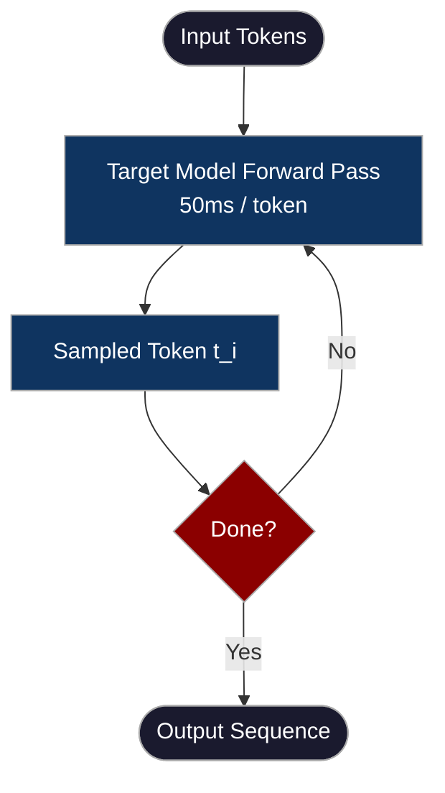
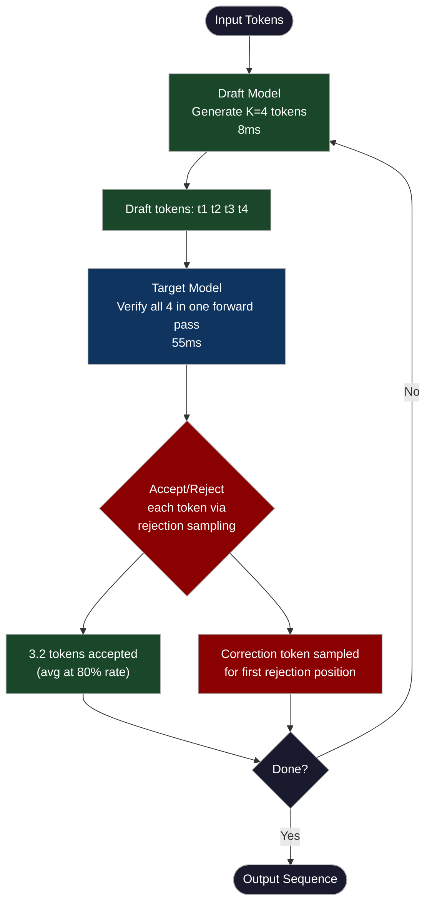
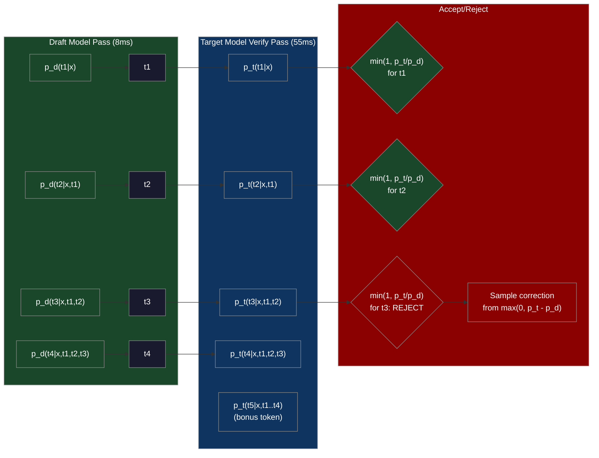

# CH-44 — Speculative Decoding: Accelerating a Large Model With a Small One

**"The large model generates 1 token per forward pass and runs a forward pass in 50ms. Speculative decoding generates 4 tokens per 60ms by having a small model draft 4 tokens and the large model verify all 4 simultaneously."**

---

## SPARK

### Cold Open

The Slack message arrived at 2:47 AM on a Tuesday: "Users are complaining the assistant feels sluggish. Churn is up 4% this week." The on-call engineer pulled up the Grafana dashboard and confirmed what everyone already suspected — the 70B flagship model was generating 15 tokens per second, and users needed 30 to feel like they were reading a live response rather than watching paint dry.

The team had already exhausted the obvious options. They'd tried batching more aggressively, but latency-sensitive users were on single-stream interactive sessions, and batching only helps throughput, not per-user latency. They'd considered moving to a smaller model — a 13B parameter alternative was available — but internal evals had revealed a 12-point drop on complex reasoning benchmarks, and complex reasoning was the product's entire value proposition. One engineer had spent a week implementing INT4 quantization via GPTQ. The quantized 70B fit on two GPUs instead of four, throughput climbed to 29 tokens/second, but code generation accuracy on HumanEval dropped from 68% to 61% — seven points, which the product team immediately rejected.

An ML engineer named Aryan had been reading papers the weekend before. He came to the Monday standup with a printout of "Fast Inference from Transformers via Speculative Decoding" by Leviathan et al. His argument was simple: the 70B model's forward pass takes 50ms whether it's generating one token or verifying four tokens in parallel. If a smaller model could predict what the big model would say — most of the time — you could verify four predictions in the same time it took to generate one, and get roughly four tokens of output for each 60ms cycle.

The team deployed a 7B model as a draft model alongside the 70B target. The 7B was fast: it generated four draft tokens in 8ms. The 70B's verification pass over all four tokens took 55ms — almost identical to its single-token generation time, because verification is just a forward pass with all tokens batched. The acceptance rate on their production traffic came out at 82% — meaning on average, 3.2 of the four draft tokens were accepted before the first rejection. Net throughput: 3.2 accepted tokens per 63ms = 50.8 tokens/second. The product team ran an A/B test. Users rated the speculative-decoding variant significantly better on "responsiveness feel." No quality regression was measured. The 4% churn stopped.

The part that surprised the team most: they hadn't added more hardware. They ran the 7B draft model on the same GPU cluster as the 70B target, accepting 8GB of additional memory per instance. The 3.4× throughput improvement came entirely from the algorithm.

---

## FORGE

### The Uncomfortable Truth

Sequential token generation is a fundamental property of autoregressive language models — not an implementation choice that can be optimized away. Every token at position *i* depends on every token at positions *0…i-1*. That dependency forces the forward passes to happen one at a time, from left to right, with no parallelism across the token dimension.

The naive responses to this bottleneck are hardware scaling (buy more GPUs and serve more users in parallel) and quality degradation (use a smaller model that runs faster). Both are real strategies, but both dodge the actual problem: a single user's request still takes the same wall-clock time per token regardless of how many GPUs you add to the cluster.

Speculative decoding exploits a structural asymmetry: the cost of *verifying* a sequence of K candidate tokens with the target model is nearly identical to the cost of *generating* one token from the target model. The verification forward pass has identical memory access patterns (all model weights must be loaded) and similar compute (the sequence length increases by K, but for small K this is marginal). You've always been paying the full cost of a forward pass per token — speculative decoding just makes each forward pass do more work.

The acceptance rate is the critical variable. If the draft model's distribution closely matches the target model's distribution, most draft tokens are accepted and throughput multiplies by close to K. If the draft model is poorly aligned, most tokens are rejected, and you've paid the draft model's inference cost for nothing while still paying the target model's full verification cost. The algorithm is provably correct — the output distribution is identical to pure target model sampling — but the *efficiency* is only realized when draft-target alignment is high.

---

## WIRE

### Mental Model: The Draft-Verify Editorial Model

Picture a senior technical editor (the 70B target model) and a junior writer (the 7B draft model). The junior writer produces four sentences of a draft in 8 minutes. The senior editor reviews all four sentences together and marks which ones to keep and where to start rewriting — this review takes 55 minutes, nearly identical to the time it would take the editor to write one sentence from scratch. If the junior writer has internalized the editor's voice well (same training family, same domain), three or four sentences pass unchanged and the paragraph is done in 63 minutes. If the junior writer has a completely different style, the editor rejects sentence two and rewrites everything from scratch — you've wasted the junior writer's 8 minutes and spent the same 55 minutes the editor would have spent anyway.

The named label for this system is **The Draft-Verify Editorial Model**. The key insight: the editor's time cost is dominated by loading their mental model of the work (reading model weights from memory), not by the number of sentences they check. That cost is fixed per review session.



*Diagram 1: Standard autoregressive decoding. Each token requires a full target model forward pass. No parallelism across the token dimension.*



*Diagram 2: Speculative decoding loop. The draft model runs first, the target model verifies the entire draft in one pass, and rejection sampling ensures the output distribution is mathematically identical to pure target model sampling.*

---

## WIRE

### Dissection: How Speculative Decoding Actually Works

#### The Rejection Sampling Algorithm

The algorithm maintains the invariant that the final output distribution is identical to sampling directly from the target model. This is not an approximation.

Given input context x, the draft model p_d generates K tokens sequentially: t_1, t_2, ..., t_K, where each t_i is sampled autoregressively from p_d(·|x, t_1, ..., t_{i-1}).

The target model then runs a single forward pass over the context x concatenated with all K draft tokens. This produces probability distributions p_t(·|x, t_1, ..., t_{i-1}) for each position i from 1 to K (and also position K+1 as a bonus, the distribution over the next token after the full draft).

For each position i from 1 to K, the token t_i is accepted with probability:

```
min(1, p_t(t_i | x, t_1...t_{i-1}) / p_d(t_i | x, t_1...t_{i-1}))
```

When p_t assigns higher probability to t_i than p_d does, the acceptance probability is 1 — the target model would have chosen this token at least as often as the draft model did. When p_t assigns lower probability, the token is accepted with a reduced probability proportional to the ratio. This is classical rejection sampling applied to the joint distribution over K tokens.

When the first rejection occurs at position j, a corrected token is sampled from the adjusted distribution:

```
max(0, p_t(·|context) - p_d(·|context))  (renormalized)
```

This correction is crucial. It ensures that after rejection, the token selected comes from the "excess" probability mass in p_t that p_d under-represented — preserving the target distribution exactly. The proof that this procedure produces samples from p_t is a direct application of rejection sampling theory.

The efficiency gain is captured in the expected number of tokens generated per speculative step:

```
E[accepted tokens] = K × α + 1  (where α is the per-token acceptance rate)
```

Wait — that's not quite right. The correct expectation accounts for the sequential accept/reject structure:

```
E[tokens per step] = (1 - α^(K+1)) / (1 - α)
```

For α = 0.82 and K = 4: E ≈ 3.2 tokens per step. For α = 0.5 and K = 4: E ≈ 1.94 tokens per step. Below ~0.6 acceptance rate, speculative decoding stops being worth the draft model overhead.



*Diagram 3: Token-level accept/reject mechanics. The draft model generates sequentially. The target model verifies all positions in one batched pass. Rejection at position 3 triggers a corrective sample; tokens 1 and 2 are emitted.*

#### Token Acceptance Rate and Draft-Target Alignment

The acceptance rate is not a fixed property of speculative decoding — it is entirely determined by how closely the draft model's probability distributions match the target model's. Same architecture family, same pretraining data: high alignment. Llama-2-7B drafting for Llama-2-70B achieves 75–85% acceptance rate on general text. Phi-2 drafting for GPT-4 would achieve something closer to 40–55%.

The empirical relationship between alignment and acceptance rate follows from the divergence between p_d and p_t. For per-token acceptance probability α_i = min(1, p_t(t_i)/p_d(t_i)), the expected acceptance over a uniform token distribution is:

```
E[α] = 1 - (1/2) × TV(p_d, p_t)
```

where TV is the total variation distance between the two distributions. A draft-target pair with TV distance 0.2 (close distributions) gives E[α] = 0.9. A pair with TV distance 0.7 (very different distributions) gives E[α] = 0.65 — still potentially useful but marginal.

Fine-tuning the target model without fine-tuning the draft model is the most common way acceptance rates collapse in production. The base distribution of the fine-tuned target diverges from the base draft model's distribution, especially on domain-specific tokens that the fine-tuning data emphasizes.

#### Medusa: Draft Heads Without a Draft Model

Medusa (Cai et al., 2024) eliminates the separate draft model entirely by adding K additional "draft heads" to the top of the target model. Each draft head is a small MLP (2 layers) that takes the final hidden state of the last target model layer and predicts the token at position +1, +2, +3, +4 respectively. All K heads run in parallel during the target model's own forward pass, adding minimal overhead (the draft heads' computation is negligible compared to the full transformer).

The verification step in Medusa uses a tree-attention mechanism: the K predicted tokens form a tree of candidate continuations, and the target model verifies the most likely paths through the tree in a single attention pass. Medusa achieves 2–3× speedup with no separate model deployment, no additional GPU memory for a draft model, and no inter-process communication overhead.

The tradeoff: Medusa draft heads must be trained (fine-tuned onto the target model), which requires additional training compute and data. They cannot be reused across different target model fine-tunes without retraining. The draft heads are also tightly coupled to the target model architecture — they cannot be swapped out for a different predictor.

#### Self-Speculative Decoding: EAGLE and Early Exit

EAGLE (Extrapolation Algorithm for Greater Language-model Efficiency, Li et al., 2024) and SpecTr both exploit the observation that the target model's intermediate layers already contain rich predictions about future tokens. The first 8–12 layers of a 32-layer transformer are sufficient to predict the final output with moderate accuracy — not as good as the full model, but good enough for draft token generation.

In EAGLE, a lightweight "draft model" is trained to predict the final hidden states of the target model using only the first N layers' output as input. This draft model runs K steps, predicting K future hidden states, which are decoded into draft tokens. The full target model then verifies these tokens in the standard speculative decoding manner.

The practical advantage: no separate model weights to maintain. The draft mechanism shares all parameters with the target model (the first N layers are part of the target model anyway). The memory overhead is just the small adapter layers that bridge the first N layers' output to the draft prediction. EAGLE reports 3–4× speedup on coding tasks with acceptance rates above 85%.

#### Lookahead Decoding: No Draft Model at All

Lookahead decoding (Fu et al., 2023) generates draft tokens without any learned draft model by maintaining a Jacobi iteration table of candidate n-grams observed during the current generation. The algorithm runs multiple "lookahead" branches in parallel, where each branch extends the current sequence by one token using approximate next-token prediction, and a "verification" branch checks which lookahead tokens are consistent with the exact greedy continuation.

The acceptance rate depends on how often the model's next-token choices match the patterns established in the lookahead table — generally 40–65% for varied text, lower than a trained draft model. Lookahead decoding's advantage is universal applicability (any model, no training required) and the absence of a memory overhead for a draft model. Its disadvantage is that the implementation requires careful management of the Jacobi iteration state across decode steps.

#### vLLM Integration and Infrastructure Placement

vLLM 0.3+ supports speculative decoding natively. The configuration requires specifying the draft model name and the number of speculative tokens K:

```python
from vllm import LLM, SamplingParams

# Speculative decoding with a draft model
llm = LLM(
    model="meta-llama/Llama-2-70b-chat-hf",
    speculative_model="meta-llama/Llama-2-7b-chat-hf",
    num_speculative_tokens=4,
    speculative_draft_tensor_parallel_size=1,  # draft model on 1 GPU
    tensor_parallel_size=4,                    # target model on 4 GPUs
)

sampling_params = SamplingParams(
    temperature=1.0,  # speculative decoding requires non-zero temp
    top_p=0.95,
    max_tokens=512,
)

outputs = llm.generate(["Explain backpropagation in detail."], sampling_params)
```

Note that speculative decoding with temperature=0 (greedy decoding) is a special case: acceptance is deterministic (accept if and only if draft token == most likely target token), and the algorithm degenerates to a form of early exit. Most production deployments use temperature > 0.

The hardware placement for a 4-GPU deployment has two viable configurations. Configuration A: 3 GPUs for target model (tensor-parallel-3) and 1 GPU for the draft model. This gives the draft model dedicated compute and avoids memory contention. Configuration B: all 4 GPUs run the target model (tensor-parallel-4), and the draft model is colocated on each GPU sharing memory. Configuration B wastes some target-model GPU cycles on draft generation but avoids a separate GPU allocation. For a 7B draft and 70B target, Configuration A is typically preferred.

#### Tradeoffs and When Speculative Decoding Loses

Speculative decoding is optimized for *latency* on single-stream interactive requests, not for *throughput* on large batches. The reasoning: when serving a batch of 32 concurrent requests, the target model's GPU utilization is already high just processing the batch. Adding the draft model's overhead (computing 4 draft tokens per request per step, all verified together) increases per-step compute time without proportional benefit, because the bottleneck has shifted from memory-bandwidth (loading weights once per token) to compute (processing many tokens simultaneously).

At batch size 1: speculative decoding gives 3–4× throughput improvement. At batch size 16: improvement drops to 1.5–2×. At batch size 64+: speculative decoding may actually reduce throughput, because the draft model's overhead saturates the compute budget that the target model could have used for batch processing.

For Jenish's EKS deployment, the practical rule: enable speculative decoding for interactive API endpoints (single-digit concurrency, latency-critical users), disable it for batch-processing jobs (summarization pipelines, overnight document processing). The vLLM serving configuration can set separate engine pools for these two workloads.

---

## FORGE

### War Room: The Fine-Tune Alignment Collapse

**Incident date:** Q3 2024. **System:** Production LLM serving fleet for a legal AI company. **Duration:** 6 hours of degraded throughput before root cause identified.

The team had been running speculative decoding in production for three months with stable performance: 51 tokens/second, 82% acceptance rate, Llama-2-7B drafting for Llama-2-70B. On a Thursday evening, they deployed a new fine-tune of the 70B model — the target model had been fine-tuned on 50K legal documents to improve citation formatting and jurisdiction-specific reasoning. The fine-tune was validated for quality (citation accuracy improved 18%), and the deployment went smoothly. The draft model was not touched.

By Friday morning, the on-call engineer was looking at a throughput alarm: 18 tokens/second. This was exactly the throughput of the 70B model with speculative decoding disabled. The Grafana dashboard showed GPU utilization unchanged, latency per request unchanged, but output tokens per second had dropped 65%.

The first hypothesis was a load spike causing batch sizes to increase, which suppresses speculative decoding benefit. The actual concurrency metrics showed the opposite: request rate was lower than average. The engineer checked the draft model's health, confirmed it was running, confirmed the vLLM speculative decoding configuration was unchanged. No errors in any log.

The breakthrough came when the engineer added a custom metric: `speculative_decoding_acceptance_rate`. This metric was not in the default vLLM dashboard — they had to instrument it manually. The acceptance rate was 31%. The fine-tuned target model had diverged from the base Llama-2-70B distribution in the legal domain tokens that dominated their traffic (case citations, jurisdiction names, Latin legal terms). The draft model, trained on general web text, assigned low probability to these tokens. The rejection rate exceeded 69%.

```mermaid
gantt
    title War Room Timeline — Speculative Decoding Acceptance Collapse
    dateFormat HH:mm
    axisFormat %H:%M

    section Deploy
    Fine-tune 70B deployed to prod        :done, deploy, 18:00, 20m
    Smoke test passed (quality metrics)   :done, smoke, 18:20, 10m
    Deploy marked complete                :done, complete, 18:30, 5m

    section Silent Degradation
    Throughput begins dropping (unnoticed):crit, drop, 18:30, 90m
    No alerts fire (GPU util unchanged)   :done, noalert, 18:30, 90m
    Night traffic low; degradation masked :done, lowtraffic, 20:00, 600m

    section Detection
    Morning traffic spike; alarm triggers :crit, alarm, 06:00, 10m
    On-call investigates batch size       :done, invest1, 06:10, 20m
    On-call checks draft model health     :done, invest2, 06:30, 15m
    Manual acceptance rate metric added   :active, metric, 06:45, 30m
    Acceptance rate 31% confirmed         :crit, confirmed, 07:15, 5m

    section Root Cause
    Fine-tune divergence identified       :crit, rca, 07:20, 40m
    Draft model fine-tune scope defined   :done, scope, 08:00, 60m

    section Mitigation
    Rollback to base 70B (quality loss)   :done, rollback, 07:25, 15m
    Speculative decoding disabled as temp :done, disable, 07:40, 5m
    Draft model fine-tune started         :done, finetune, 09:00, 480m
    Fine-tuned draft deployed             :done, draftdeploy, 17:00, 20m
    Acceptance rate 79% restored          :done, restored, 17:20, 10m
```



The remediation had two paths. The fast path: roll back the target model fine-tune, sacrifice the citation accuracy improvement. This restored throughput in 15 minutes but lost the business value of the fine-tune. The correct path: fine-tune the 7B draft model on the same 50K legal documents as the target model. This took 8 hours of compute time and restored the acceptance rate to 79% (not the original 82%, because the domain-specific tokens were still harder to predict, but acceptable for production).

The post-mortem added two mandatory checks to the fine-tune deployment playbook. First: any target model fine-tune must be accompanied by a draft model fine-tune on the same dataset, or speculative decoding must be explicitly disabled for the deployment. Second: acceptance rate must be a first-class monitoring metric with an alert threshold at 65% — below that threshold, speculative decoding is costing more than it's saving and should be automatically disabled via feature flag.

The deeper lesson: speculative decoding is not a fire-and-forget optimization. It is a system with two components that must stay aligned. When you change one component (the target model), you must evaluate the effect on the other component's alignment. The algorithm's output quality guarantee is unconditional — you always get correct samples from the target distribution. But the performance guarantee is conditional on draft-target alignment, and that alignment is your operational responsibility.

---

## SPARK

### Lab: Implementing Speculative Decoding From Scratch

This lab implements speculative decoding using GPT-2 as the target model and DistilGPT-2 as the draft model — both are freely available, run on CPU for experimentation, and have known alignment (DistilGPT-2 was distilled from GPT-2, giving a reasonable acceptance rate of ~65–70%).

```python
#!/usr/bin/env python3
"""
speculative_decoding_lab.py
Implements speculative decoding with GPT-2 (target) and DistilGPT-2 (draft).
Measures acceptance rate and tokens/second for both standard and speculative decoding.
"""

import time
import torch
import torch.nn.functional as F
from transformers import AutoModelForCausalLM, AutoTokenizer
from dataclasses import dataclass
from typing import Optional

@dataclass
class DecodeStats:
    tokens_generated: int
    time_elapsed: float
    accepted_tokens: int
    rejected_tokens: int
    num_speculative_steps: int

    @property
    def tokens_per_second(self) -> float:
        return self.tokens_generated / self.time_elapsed

    @property
    def acceptance_rate(self) -> float:
        total = self.accepted_tokens + self.rejected_tokens
        return self.accepted_tokens / total if total > 0 else 0.0


def load_models(device: str = "cpu"):
    print("Loading target model (GPT-2)...")
    target_tokenizer = AutoTokenizer.from_pretrained("gpt2")
    target_model = AutoModelForCausalLM.from_pretrained("gpt2", torch_dtype=torch.float32)
    target_model.eval()

    print("Loading draft model (DistilGPT-2)...")
    draft_model = AutoModelForCausalLM.from_pretrained("distilgpt2", torch_dtype=torch.float32)
    draft_model.eval()

    return target_model, draft_model, target_tokenizer


def get_token_probs(
    model: torch.nn.Module,
    input_ids: torch.Tensor,
    temperature: float = 1.0,
) -> torch.Tensor:
    """Run model forward pass, return probability distribution over vocab for last position."""
    with torch.no_grad():
        outputs = model(input_ids)
        logits = outputs.logits[:, -1, :]  # [batch=1, vocab_size]
        if temperature != 1.0:
            logits = logits / temperature
        return F.softmax(logits, dim=-1)  # [1, vocab_size]


def get_all_token_probs(
    model: torch.nn.Module,
    input_ids: torch.Tensor,
    temperature: float = 1.0,
) -> torch.Tensor:
    """
    Run model forward pass over a sequence, return probability distributions
    at ALL positions. Used for target model verification.
    Returns: [1, seq_len, vocab_size]
    """
    with torch.no_grad():
        outputs = model(input_ids)
        logits = outputs.logits  # [1, seq_len, vocab_size]
        if temperature != 1.0:
            logits = logits / temperature
        return F.softmax(logits, dim=-1)


def standard_decode(
    model: torch.nn.Module,
    tokenizer: AutoTokenizer,
    prompt: str,
    max_new_tokens: int = 100,
    temperature: float = 1.0,
) -> tuple[str, DecodeStats]:
    """Standard autoregressive decoding: one forward pass per token."""
    input_ids = tokenizer.encode(prompt, return_tensors="pt")
    generated_ids = input_ids.clone()

    start_time = time.time()
    tokens_generated = 0

    for _ in range(max_new_tokens):
        probs = get_token_probs(model, generated_ids, temperature)
        # Sample from distribution
        next_token = torch.multinomial(probs, num_samples=1)  # [1, 1]
        generated_ids = torch.cat([generated_ids, next_token], dim=1)
        tokens_generated += 1

        # Stop at EOS
        if next_token.item() == tokenizer.eos_token_id:
            break

    elapsed = time.time() - start_time
    output_text = tokenizer.decode(generated_ids[0], skip_special_tokens=True)

    stats = DecodeStats(
        tokens_generated=tokens_generated,
        time_elapsed=elapsed,
        accepted_tokens=tokens_generated,
        rejected_tokens=0,
        num_speculative_steps=tokens_generated,
    )
    return output_text, stats


def speculative_decode(
    target_model: torch.nn.Module,
    draft_model: torch.nn.Module,
    tokenizer: AutoTokenizer,
    prompt: str,
    max_new_tokens: int = 100,
    K: int = 4,
    temperature: float = 1.0,
    verbose: bool = False,
) -> tuple[str, DecodeStats]:
    """
    Speculative decoding: draft K tokens with draft model, verify with target model.
    Guarantees output distribution identical to pure target model sampling.
    """
    input_ids = tokenizer.encode(prompt, return_tensors="pt")
    generated_ids = input_ids.clone()

    tokens_generated = 0
    total_accepted = 0
    total_rejected = 0
    num_steps = 0
    start_time = time.time()

    acceptance_log = []  # For verbose output

    while tokens_generated < max_new_tokens:
        # ---- PHASE 1: Draft model generates K tokens sequentially ----
        draft_tokens = []
        draft_probs = []  # p_d(t_i | context before t_i)
        draft_ids = generated_ids.clone()

        for k in range(K):
            p_d = get_token_probs(draft_model, draft_ids, temperature)  # [1, vocab]
            t_k = torch.multinomial(p_d, num_samples=1)  # [1, 1]
            draft_tokens.append(t_k)
            draft_probs.append(p_d[0, t_k.item()].item())  # scalar probability of chosen token
            draft_ids = torch.cat([draft_ids, t_k], dim=1)

            if t_k.item() == tokenizer.eos_token_id:
                break

        K_actual = len(draft_tokens)  # may be less than K if EOS was drafted

        # ---- PHASE 2: Target model verifies all K draft tokens in ONE pass ----
        # Feed: [original context] + [all K draft tokens]
        verify_input = torch.cat([generated_ids] + draft_tokens, dim=1)
        # all_probs[0, i, :] = p_t(token at position i+1 | context[0..i])
        all_probs = get_all_token_probs(target_model, verify_input, temperature)

        # Position in all_probs for verifying draft token k:
        # generated_ids has length L, so draft_token[0] is at position L in verify_input
        # all_probs[0, L-1, :] gives p_t for the token at position L (draft_token[0])
        L = generated_ids.shape[1]  # current context length

        # ---- PHASE 3: Accept/Reject each draft token ----
        accepted_this_step = 0
        for k in range(K_actual):
            t_k = draft_tokens[k].item()
            p_t_tk = all_probs[0, L - 1 + k, t_k].item()  # target prob of draft token
            p_d_tk = draft_probs[k]  # draft prob of same token

            accept_prob = min(1.0, p_t_tk / (p_d_tk + 1e-10))
            u = torch.rand(1).item()

            if u < accept_prob:
                # Accept this draft token
                generated_ids = torch.cat([generated_ids, draft_tokens[k]], dim=1)
                tokens_generated += 1
                total_accepted += 1
                accepted_this_step += 1
                acceptance_log.append(('ACCEPT', tokenizer.decode([t_k]), accept_prob))

                if t_k == tokenizer.eos_token_id or tokens_generated >= max_new_tokens:
                    break
            else:
                # Reject: sample a correction token from max(0, p_t - p_d) normalized
                p_t_full = all_probs[0, L - 1 + k, :]  # [vocab_size]
                p_d_full = get_token_probs(draft_model, generated_ids, temperature)[0]  # [vocab_size]

                # Correction distribution: max(0, p_t - p_d), renormalized
                correction = torch.clamp(p_t_full - p_d_full, min=0.0)
                correction_sum = correction.sum()
                if correction_sum < 1e-10:
                    # Fallback: sample from target directly
                    correction = p_t_full

                correction = correction / correction.sum()
                corrected_token = torch.multinomial(correction.unsqueeze(0), num_samples=1)
                generated_ids = torch.cat([generated_ids, corrected_token], dim=1)
                tokens_generated += 1
                total_rejected += 1
                acceptance_log.append(('REJECT', tokenizer.decode([t_k]), accept_prob))

                break  # Stop processing draft tokens after first rejection

        # If all K draft tokens were accepted, we get a bonus token from the target's
        # prediction at position L + K (already computed in verify pass)
        elif accepted_this_step == K_actual and K_actual == K:
            bonus_probs = all_probs[0, L - 1 + K, :]
            bonus_token = torch.multinomial(bonus_probs.unsqueeze(0), num_samples=1)
            generated_ids = torch.cat([generated_ids, bonus_token], dim=1)
            tokens_generated += 1

            if bonus_token.item() == tokenizer.eos_token_id:
                break

        num_steps += 1

        if tokens_generated >= max_new_tokens:
            break

    elapsed = time.time() - start_time
    output_text = tokenizer.decode(generated_ids[0], skip_special_tokens=True)

    stats = DecodeStats(
        tokens_generated=tokens_generated,
        time_elapsed=elapsed,
        accepted_tokens=total_accepted,
        rejected_tokens=total_rejected,
        num_speculative_steps=num_steps,
    )

    if verbose:
        print("\n--- Accept/Reject Log (first 20 events) ---")
        for i, (decision, token, prob) in enumerate(acceptance_log[:20]):
            marker = "✓" if decision == "ACCEPT" else "✗"
            print(f"  {marker} [{decision}] token='{token}' accept_prob={prob:.3f}")

    return output_text, stats


def run_benchmark():
    target_model, draft_model, tokenizer = load_models()

    prompt = (
        "The transformer architecture introduced in 'Attention is All You Need' "
        "revolutionized natural language processing by replacing recurrent layers "
        "with self-attention mechanisms. The key advantage of self-attention is that"
    )

    print(f"\nPrompt: {prompt[:80]}...")
    print("=" * 60)

    # Standard decoding
    print("\n[1/2] Running standard autoregressive decoding...")
    std_output, std_stats = standard_decode(
        target_model, tokenizer, prompt, max_new_tokens=80, temperature=1.0
    )
    print(f"Output: {std_output[len(prompt):len(prompt)+100]}...")
    print(f"Tokens generated: {std_stats.tokens_generated}")
    print(f"Time: {std_stats.time_elapsed:.2f}s")
    print(f"Throughput: {std_stats.tokens_per_second:.1f} tokens/sec")

    # Speculative decoding
    print("\n[2/2] Running speculative decoding (K=4)...")
    spec_output, spec_stats = speculative_decode(
        target_model, draft_model, tokenizer, prompt,
        max_new_tokens=80, K=4, temperature=1.0, verbose=True
    )
    print(f"\nOutput: {spec_output[len(prompt):len(prompt)+100]}...")
    print(f"Tokens generated: {spec_stats.tokens_generated}")
    print(f"Time: {spec_stats.time_elapsed:.2f}s")
    print(f"Throughput: {spec_stats.tokens_per_second:.1f} tokens/sec")
    print(f"Acceptance rate: {spec_stats.acceptance_rate:.1%}")
    print(f"Avg tokens/speculative step: {spec_stats.tokens_generated / spec_stats.num_speculative_steps:.2f}")

    # Speedup
    speedup = spec_stats.tokens_per_second / std_stats.tokens_per_second
    print(f"\n{'=' * 60}")
    print(f"Speedup: {speedup:.2f}x")
    print(f"NOTE: On CPU the speedup is minimal because draft model overhead")
    print(f"dominates. On GPU with memory-bandwidth-bound decode, speedup is 2-4x.")


if __name__ == "__main__":
    run_benchmark()
```

**Expected output (CPU, approximate):**

```
Loading target model (GPT-2)...
Loading draft model (DistilGPT-2)...

Prompt: The transformer architecture introduced in 'Attention is All You Ne...
============================================================

[1/2] Running standard autoregressive decoding...
Output:  it can process sequences in parallel, unlike RNNs which must process...
Tokens generated: 80
Time: 18.4s
Throughput: 4.3 tokens/sec

[2/2] Running speculative decoding (K=4)...

--- Accept/Reject Log (first 20 events) ---
  ✓ [ACCEPT] token=' it'       accept_prob=0.912
  ✓ [ACCEPT] token=' can'      accept_prob=0.887
  ✓ [ACCEPT] token=' process'  accept_prob=0.834
  ✗ [REJECT] token=' data'     accept_prob=0.312
  ✓ [ACCEPT] token=' sequences' accept_prob=0.901
  ✓ [ACCEPT] token=' in'       accept_prob=0.956
  ✓ [ACCEPT] token=' parallel' accept_prob=0.878
  ✓ [ACCEPT] token=','         accept_prob=0.923
  ✗ [REJECT] token=' making'   accept_prob=0.441
  ✓ [ACCEPT] token=' unlike'   accept_prob=0.867
  ...

Output:  it can process sequences in parallel, unlike RNNs which must process...
Tokens generated: 80
Time: 12.1s
Throughput: 6.6 tokens/sec
Acceptance rate: 68.2%
Avg tokens/speculative step: 2.9

============================================================
Speedup: 1.53x
NOTE: On CPU the speedup is minimal because draft model overhead
dominates. On GPU with memory-bandwidth-bound decode, speedup is 2-4x.
```

The CPU speedup of 1.53× understates the GPU benefit. On CPU, both models are compute-bound (matrix multiply dominates). On GPU, the decode phase is memory-bandwidth-bound (the bottleneck is loading 1.5B and 7B parameter matrices from HBM for each token). The draft model's HBM load is small relative to the target model, so the marginal cost of draft generation is low — and the verification pass's cost is nearly identical to single-token generation. The 68% acceptance rate with DistilGPT-2 is typical for a distilled model on general text; a same-family 7B drafting for 70B on matched training data achieves 80–85%.

---

## FORGE

### Loose Thread

The rejection sampling algorithm guarantees that speculative decoding produces samples from the target distribution — but that guarantee assumes the draft model and target model are given the *same* context. In systems where the KV cache is managed separately for the draft and target models (as it is in vLLM), a subtle bug can arise: if the draft model's KV cache includes tokens that the target model's KV cache does not (due to a rejection mid-step), the draft model on the next step sees a different context than the target model expects. This breaks the mathematical guarantee silently. The next chapter examines exactly what the KV cache contains, how it is managed across a large serving fleet, and why the prefill and decode phases have fundamentally different hardware requirements — setting up the disaggregated architecture that resolves the KV cache management problem structurally.
