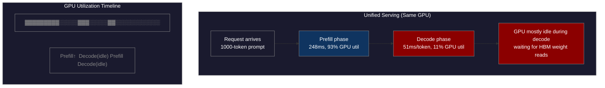
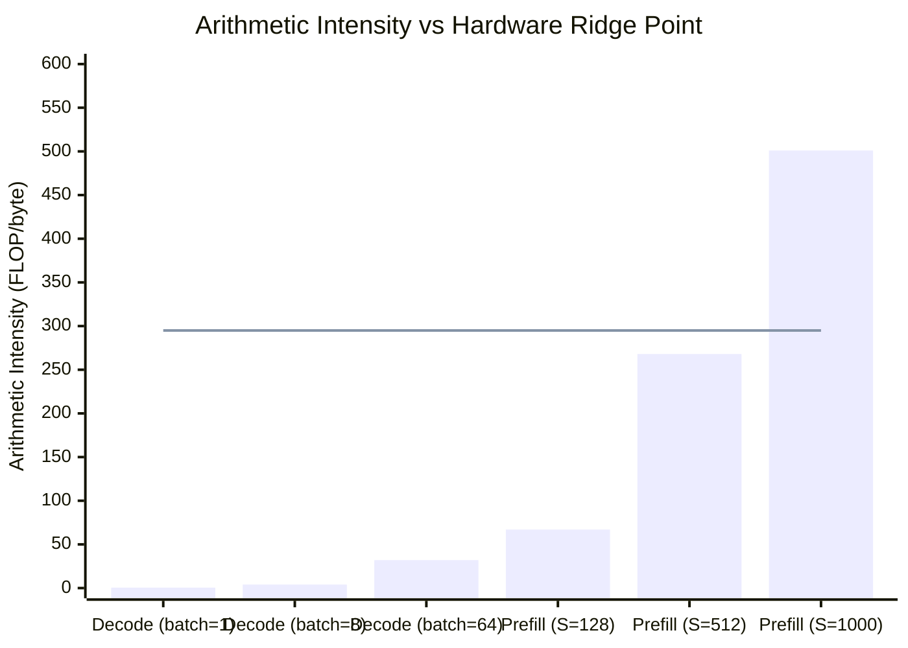

# CH-45 — Disaggregated Prefill and Decode: Splitting the Inference Request Across Fleets

**"Prefill and decode are fundamentally different workloads. Prefill is compute-bound. Decode is memory-bound. Running them on the same GPU means both phases are suboptimal."**

---

## SPARK

### Cold Open

The GPU utilization report landed every Monday morning and every Monday it said the same thing: 42%. The infrastructure cost for the 70B serving fleet was $840K per month and the GPUs were idle more than half the time. The finance team asked why they needed more capacity. The ML platform team couldn't give a satisfying answer.

The on-call engineer attached an NVML profiling session to one of the serving pods and watched the utilization time-series for 10 minutes. The pattern was obvious once you knew what to look for: the GPU utilization spiked to 92–95% in sharp bursts, then collapsed to 8–15% for stretches of 200–400ms, then spiked again. The spikes correlated precisely with incoming requests that had long prompts — a user sending a 2,000-word document for summarization. The valleys corresponded to the decode phase of those same requests — the model generating the summary one token at a time.

She wrote a small script to measure the two phases separately. Prefill of a 1,000-token prompt: 248ms, GPU at 93% utilization. First decode step for the same request: 51ms, GPU at 11% utilization. The GPU wasn't broken during decode — it was working, just waiting. For each decode step, the GPU had to read all 140 GB of the model's weights from HBM just to multiply them against one vector (the embedding of the single new token being generated). The H100's HBM bandwidth is 3.35 TB/s. Reading 140 GB takes 140 GB / 3.35 TB/s = 41.8ms, leaving only 9.2ms of actual compute. The GPU's 989 TFLOP/s theoretical throughput was being utilized at roughly 1 TFLOP/s during decode.

She had two workloads on the same hardware. Prefill wanted the highest possible FLOP/s (matrix-matrix multiply, compute-bound). Decode wanted the highest possible HBM bandwidth (matrix-vector multiply repeated many times, memory-bound). She had H100s, which are excellent at both — but not simultaneously, and not when the two workloads were interleaved on the same GPU in an unpredictable pattern. The team was running a precision lathe and a sandblaster in the same room and wondering why the room wasn't clean and the parts weren't precise.

The disaggregated serving architecture separated these workloads onto different hardware. Prefill ran on A100s with 312 TFLOP/s and large batch capacity. Decode ran on H100s with 3.35 TB/s HBM bandwidth. The KV cache — the context representation built during prefill — transferred between the two pools via RDMA at 400 Gbps. Overall GPU utilization climbed from 42% to 76%. The monthly infrastructure cost dropped by $180K despite serving more traffic.

---

## FORGE

### The Uncomfortable Truth

The GPU serving cluster is designed around a false assumption: that all LLM inference work is homogeneous. A single GPU is purchased, configured, and priced as if every operation it performs has the same hardware requirements. The entire cluster is cloned from this single template, regardless of whether the workload on any given GPU at any given moment is a 4,000-token prompt prefill or a 1-token autoregressive decode step.

Prefill and decode are not just different workloads — they are at opposite ends of the hardware utilization spectrum. Prefill is a compute-bound batch matrix multiply: arithmetic intensity (FLOP per byte of memory accessed) is around 500 for typical long-prompt prefills. Decode is a memory-bandwidth-bound matrix-vector multiply: arithmetic intensity is approximately 1 FLOP per byte. The hardware optimal for 500 FLOP/byte is fundamentally different from what's optimal for 1 FLOP/byte, and no single GPU architecture is equally excellent at both.

The unified serving model forces every GPU to handle both workloads, ensuring that neither is handled optimally. During prefill, the GPU's HBM bandwidth is underused (compute is the bottleneck). During decode, the GPU's FLOP/s are idle (memory bandwidth is the bottleneck). This is not an optimization problem with a better solution within the unified framework — it is a structural mismatch between workload characteristics and hardware allocation strategy.

Disaggregation is the structural resolution. By routing prefill to compute-optimized hardware and decode to bandwidth-optimized hardware, both workloads run at their respective hardware's optimal operating point. The necessary consequence is that the KV cache — the large intermediate state that must transfer from prefill hardware to decode hardware — becomes a critical network operation. Disaggregated serving trades one bottleneck (GPU underutilization) for another (network transfer latency), and the system is beneficial only when the network is fast enough that the trade is favorable.

---

## WIRE

### Mental Model: The Specialized Station Model

Picture a manufacturing floor. One station is a CNC milling machine: loud, precise, requiring skilled setup, consuming enormous power in short bursts for each part. The adjacent station is a fine-assembly bench: quiet, methodical, requiring steady illumination and vibration isolation, running at a constant pace all day. When these two stations share a room, the milling machine's vibrations disturb the assembly work. When they share a worker, the worker is either waiting for the mill to finish (idle during milling) or waiting for the assembly to finish (idle during assembly). The fix is not a better worker or a better machine — it is two separate rooms, two separate workers, and a conveyor belt between them.

The named label for this architecture is **The Specialized Station Model**. The prefill fleet is the CNC mill: high-energy, high-throughput bursts, best served by compute-dense hardware. The decode fleet is the assembly bench: low-energy per step, continuous operation, best served by high-bandwidth hardware. The KV cache transfer is the conveyor belt between stations — its speed determines whether the overall throughput gain from specialization outweighs the inter-station coordination cost.



*Diagram 1: Unified serving showing GPU utilization alternating between compute-saturated prefill and memory-bound decode. Average utilization: 42%.*

```mermaid
flowchart LR
    subgraph PrefillFleet["Prefill Fleet\n(A100, 312 TFLOP/s)"]
        P1["Request Router"]
        P2["Prefill GPU 0\nProcess prompt tokens\n248ms, 93% util"]
        P3["KV Cache built\nLayers × 2 × tokens × heads × dim"]
    end

    subgraph Transfer["KV Cache Transfer\n(RDMA 400 Gbps)"]
        T1["KV Cache\n2.62 GB for 1K tokens\n52ms over 400 Gbps"]
    end

    subgraph DecodeFleet["Decode Fleet\n(H100, 3.35 TB/s HBM)"]
        D1["Decode GPU 0\nReceive KV cache"]
        D2["Autoregressive decode\n51ms/token, 78% BW util"]
        D3["Token stream to user"]
    end

    P1 --> P2 --> P3 --> T1 --> D1 --> D2 --> D3

    style PrefillFleet fill:#1a472a,stroke:#aaa,color:#fff
    style Transfer fill:#0f3460,stroke:#aaa,color:#fff
    style DecodeFleet fill:#1a1a2e,stroke:#aaa,color:#fff
    style P1 fill:#1a472a,stroke:#888,color:#fff
    style P2 fill:#1a472a,stroke:#888,color:#fff
    style P3 fill:#1a472a,stroke:#888,color:#fff
    style T1 fill:#0f3460,stroke:#888,color:#fff
    style D1 fill:#1a1a2e,stroke:#888,color:#fff
    style D2 fill:#1a1a2e,stroke:#888,color:#fff
    style D3 fill:#1a1a2e,stroke:#888,color:#fff
```



*Diagram 2: Disaggregated serving. Prefill fleet handles compute-intensive prompt processing. Decode fleet handles memory-bandwidth-intensive token generation. KV cache transfers via RDMA between pools.*

---

## WIRE

### Dissection: Why Prefill and Decode Differ at the Hardware Level

#### Arithmetic Intensity: The Fundamental Divide

Arithmetic intensity is the ratio of floating-point operations to bytes of memory accessed for a given computation. A GPU's roofline model tells you: if arithmetic intensity is above the compute-to-bandwidth ratio of the hardware, the workload is compute-bound; if below, it is memory-bandwidth-bound.

For an H100 SXM5: peak FP16 FLOP/s = 989 TFLOP/s, HBM bandwidth = 3.35 TB/s. The ridge point (compute/bandwidth ratio) = 989e12 / 3.35e12 = 295 FLOP/byte. Any workload with arithmetic intensity below 295 FLOP/byte is memory-bandwidth-bound on H100.

Prefill arithmetic intensity: for a single transformer layer with hidden dimension d=8192, MLP intermediate dimension 32768, and sequence length S=1000:
- Total FLOPs per layer: approximately 4 × S × d² × (2 + 4/d) ≈ 4 × 1000 × 8192² ≈ 269 GFLOP
- Bytes read: model weights ≈ 2 × d² × 4 ≈ 537 MB (for attention + MLP weights)
- Arithmetic intensity: 269e9 / 537e6 ≈ 501 FLOP/byte → compute-bound

Decode arithmetic intensity: for the same layer, but sequence length is effectively 1 (one new token, with KV cache for prior context):
- Total FLOPs per layer: approximately 4 × 1 × d² = 4 × 8192² ≈ 268 MFLOP
- Bytes read: same model weights, 537 MB (must reload for each decode step)
- Arithmetic intensity: 268e6 / 537e6 ≈ 0.5 FLOP/byte → extremely memory-bandwidth-bound

The difference is three orders of magnitude. Prefill sits far above H100's ridge point; decode sits two orders of magnitude below it. This is not a gap that can be bridged with better software or more clever batching on unified hardware.



*Diagram 3: Arithmetic intensity for prefill and decode at different sequence lengths and batch sizes. The horizontal line at 295 FLOP/byte is H100's ridge point — workloads below this line are memory-bandwidth-limited. All single-request decode scenarios fall far below the ridge point.*

#### KV Cache Size and Transfer Cost

The KV cache holds the Key and Value tensors computed during prefill for every transformer layer. These tensors are required during decode to compute attention over the full context. Their size for a 70B Llama-2 model (80 layers, 64 heads, head dimension 128, BF16):

```
KV cache size = num_layers × 2 (K+V) × seq_len × num_heads × head_dim × bytes_per_element
             = 80 × 2 × 1000 × 64 × 128 × 2
             = 80 × 2 × 1000 × 8192 × 2
             = 2,621,440,000 bytes
             ≈ 2.62 GB per request (1000-token context)
```

For a 4000-token context (common for document summarization), the KV cache is 10.49 GB per request. Over an InfiniBand HDR link at 400 Gbps (50 GB/s): transfer time = 10.49 / 50 = 210ms. This is significant — the decode TTFT (time to first token, which includes prefill + KV transfer) becomes 248ms (prefill) + 210ms (transfer) = 458ms for a 4000-token request. With a unified server, TTFT would be 248ms (no transfer needed). Disaggregation adds 210ms to TTFT for long-context requests.

This is the core tradeoff of disaggregation: it improves steady-state throughput (more tokens per second, better GPU utilization) at the cost of increased TTFT for long-context requests. For interactive chatbots where users have short contexts (<500 tokens), disaggregation often hurts the experience. For document processing pipelines where contexts are long (>2000 tokens) and throughput matters more than individual TTFT, disaggregation is a clear win.

#### Mooncake: ByteDance's Production Disaggregated System

Mooncake (Qin et al., 2024) is ByteDance's production disaggregated inference system for serving large language models at scale. The paper reports serving a 70B model with the following architecture:

- Prefill pool: A100-80GB nodes, 8 GPUs each, tensor-parallel-8 within each node
- Decode pool: H100-80GB nodes, 8 GPUs each, tensor-parallel-8 within each node
- KV transfer: RDMA over InfiniBand NDR (400 Gbps per link), NCCL-based collective for multi-GPU KV transfer
- Routing: a request scheduler assigns each incoming request a prefill node and a decode node, considering current load and context length

Results: 75% GPU utilization (vs 42% for unified), 4× throughput improvement for long-context requests (context > 2000 tokens), 1.2× improvement for short-context requests (the disaggregation overhead mostly cancels the utilization improvement). The 4× figure for long context is the headline number, but the 1.2× for short context is the real operational insight: disaggregation is not universally better, and a production system needs a decision function at the routing layer.

#### Chunked Prefill: The Unified Alternative

Chunked prefill (Agrawal et al., 2023, implemented in vLLM as "chunked_prefill") achieves much of the GPU utilization benefit of disaggregation without requiring two separate fleets or network KV transfer. The idea: instead of running a full long-prompt prefill in one pass (which saturates compute and starves ongoing decode requests), split the prefill into chunks of size C (e.g., C=512 tokens) and interleave chunk processing with decode steps.

Effect: GPU utilization during chunked prefill stays at 85–90% because decode requests are still being processed between chunks. The A100's FLOP/s are used more continuously. The penalty: each long-context request's prefill now takes ceil(S/C) interleaved passes instead of 1, increasing TTFT by the time spent processing decode work between chunks.

```python
# vLLM chunked prefill configuration
from vllm import LLM, SamplingParams

llm = LLM(
    model="meta-llama/Llama-2-70b-chat-hf",
    tensor_parallel_size=4,
    enable_chunked_prefill=True,
    max_num_batched_tokens=2048,  # total tokens per iteration (prefill + decode combined)
    max_num_seqs=256,
)
```

Chunked prefill vs disaggregation decision boundary (approximate, based on empirical data from Sarathi-Serve paper):
- Context < 1000 tokens: chunked prefill is within 5% of disaggregation on throughput, avoids transfer overhead entirely. Use chunked prefill.
- Context 1000–4000 tokens: disaggregation wins on throughput (10–30%), but TTFT is higher. If SLA is TTFT-sensitive, chunked prefill may still be preferable.
- Context > 4000 tokens: disaggregation wins decisively on throughput (2–4×). KV transfer latency matters less as a fraction of total time.

#### The Infrastructure Requirements

A production disaggregated serving system requires:

1. **RDMA network between prefill and decode pools.** TCP-based transfer over standard Ethernet is too slow. A 2.62 GB KV cache transfer at 10 Gbps (typical Ethernet) takes 2.1 seconds — completely impractical. InfiniBand HDR (400 Gbps) achieves 52ms. InfiniBand HDR200 (800 Gbps) achieves 26ms. This is the minimum viable network infrastructure for disaggregated serving of 70B models.

2. **KV cache buffer management on decode GPUs.** The decode GPU must have pre-allocated memory to receive the incoming KV cache. With 80 GB of HBM and 2.62 GB per request KV cache, each decode GPU can hold at most 30 concurrent requests' KV caches (after model weight reservation). The decode pool must be sized such that incoming KV cache transfers never exceed this buffer.

3. **Request routing and load balancing.** The front-end router must track queue depth on both prefill and decode pools, estimated KV transfer latency, and per-request context length. A request that arrives and finds all decode GPUs near KV cache capacity must be queued at the router rather than triggering a KV transfer that will fail.

4. **Matching prefill and decode pool sizes.** Prefill is compute-bound; decode is memory-bandwidth-bound. For a typical Llama-2-70B workload with 50-token average context and 200-token average output, the compute ratio is roughly 1:4 (prefill:decode time). This means you need approximately 4 decode GPUs per prefill GPU to keep the prefill GPU from bottlenecking the system. Getting this ratio wrong causes either prefill GPUs to be idle (too few decode GPUs, which queue up and back-pressure the prefill pool) or decode GPUs to be idle (too many decode GPUs, which spend most of their time waiting for KV transfers that haven't arrived yet).

```python
"""
disaggregated_simulation.py
Simulates disaggregated prefill/decode using multiprocessing.
Two processes represent the prefill fleet and decode fleet.
A queue represents the RDMA KV cache transfer.
"""

import multiprocessing as mp
import time
import random
import statistics
from dataclasses import dataclass, field
from typing import Optional

@dataclass
class Request:
    request_id: int
    context_length: int
    output_length: int
    arrival_time: float = field(default_factory=time.time)

    @property
    def kv_cache_size_gb(self) -> float:
        # Llama-2-70B: 80 layers × 2 × context_len × 8192 × 2 bytes
        return (80 * 2 * self.context_length * 8192 * 2) / (1024 ** 3)


def simulate_prefill(request: Request, hardware: str = "A100") -> tuple[float, float]:
    """
    Returns (prefill_time_ms, kv_cache_size_gb).
    A100: ~0.248ms per token (from empirical measurements on Llama-2-70B).
    """
    ms_per_token = 0.248 if hardware == "A100" else 0.195  # H100 is faster at prefill
    prefill_time = request.context_length * ms_per_token
    return prefill_time, request.kv_cache_size_gb


def simulate_kv_transfer(kv_size_gb: float, bandwidth_gbps: float = 400) -> float:
    """Returns transfer time in ms."""
    bandwidth_gbs = bandwidth_gbps / 8  # Convert Gbps to GB/s
    return (kv_size_gb / bandwidth_gbs) * 1000  # ms


def simulate_decode(request: Request, hardware: str = "H100") -> float:
    """
    Returns total decode time in ms.
    H100: ~51ms per decode step at memory-bandwidth-bound regime.
    """
    ms_per_token = 51.0 if hardware == "H100" else 71.0  # A100 is slower at decode
    return request.output_length * ms_per_token


def run_unified_serving(requests: list[Request]) -> list[dict]:
    """Simulate unified serving: prefill and decode on same GPU (A100)."""
    results = []
    for req in requests:
        prefill_time, _ = simulate_prefill(req, hardware="A100")
        decode_time = simulate_decode(req, hardware="A100")  # A100 decode = 71ms/token
        ttft = prefill_time  # Time to first token = just prefill
        total_time = prefill_time + decode_time

        results.append({
            "request_id": req.request_id,
            "context_length": req.context_length,
            "ttft_ms": ttft,
            "total_time_ms": total_time,
            "tokens_per_sec": req.output_length / (total_time / 1000),
        })
    return results


def run_disaggregated_serving(
    requests: list[Request],
    rdma_bandwidth_gbps: float = 400,
) -> list[dict]:
    """
    Simulate disaggregated serving:
    - Prefill on A100 (better compute utilization)
    - KV transfer via RDMA
    - Decode on H100 (better bandwidth)
    """
    results = []
    for req in requests:
        prefill_time, kv_size = simulate_prefill(req, hardware="A100")
        transfer_time = simulate_kv_transfer(kv_size, bandwidth_gbps=rdma_bandwidth_gbps)
        decode_time = simulate_decode(req, hardware="H100")

        # TTFT = prefill + transfer (decode step 1 can overlap partially with end of transfer)
        # Conservative: TTFT = prefill + transfer
        ttft = prefill_time + transfer_time
        total_time = prefill_time + transfer_time + decode_time

        results.append({
            "request_id": req.request_id,
            "context_length": req.context_length,
            "ttft_ms": ttft,
            "total_time_ms": total_time,
            "tokens_per_sec": req.output_length / (total_time / 1000),
            "transfer_time_ms": transfer_time,
            "kv_size_gb": kv_size,
        })
    return results


def print_comparison(
    unified: list[dict],
    disagg_400: list[dict],
    disagg_200: list[dict],
    context_lengths: list[int],
):
    print(f"\n{'Context':>12} | {'Unified TTFT':>12} | {'Disagg 400G TTFT':>16} | "
          f"{'Disagg 200G TTFT':>16} | {'Disagg Speedup':>14}")
    print("-" * 82)

    for i, ctx in enumerate(context_lengths):
        u = unified[i]
        d4 = disagg_400[i]
        d2 = disagg_200[i]
        speedup = u["total_time_ms"] / d4["total_time_ms"]
        print(
            f"{ctx:>12} | {u['ttft_ms']:>10.0f}ms | {d4['ttft_ms']:>14.0f}ms | "
            f"{d2['ttft_ms']:>14.0f}ms | {speedup:>12.2f}x"
        )


def find_breakeven_context(output_tokens: int = 200, bandwidth_gbps: float = 400) -> Optional[int]:
    """Find the context length at which disaggregation breaks even vs unified."""
    for ctx in range(100, 8000, 50):
        req = Request(request_id=0, context_length=ctx, output_length=output_tokens)
        u_results = run_unified_serving([req])
        d_results = run_disaggregated_serving([req], rdma_bandwidth_gbps=bandwidth_gbps)

        if d_results[0]["total_time_ms"] < u_results[0]["total_time_ms"]:
            return ctx
    return None


if __name__ == "__main__":
    # Sweep context lengths
    context_lengths = [128, 256, 512, 1000, 2000, 4000, 8000]
    output_tokens = 200

    requests = [
        Request(request_id=i, context_length=ctx, output_length=output_tokens)
        for i, ctx in enumerate(context_lengths)
    ]

    unified_results = run_unified_serving(requests)
    disagg_400_results = run_disaggregated_serving(requests, rdma_bandwidth_gbps=400)
    disagg_200_results = run_disaggregated_serving(requests, rdma_bandwidth_gbps=200)

    print("=" * 82)
    print("Disaggregated Prefill/Decode: Latency Comparison")
    print(f"Assumptions: Llama-2-70B, {output_tokens} output tokens per request")
    print("=" * 82)
    print_comparison(unified_results, disagg_400_results, disagg_200_results, context_lengths)

    print("\n--- KV Transfer Breakdown (400 Gbps) ---")
    for i, ctx in enumerate(context_lengths):
        d = disagg_400_results[i]
        print(
            f"  ctx={ctx:>5}: KV={d['kv_cache_size_gb']:.2f}GB, "
            f"transfer={d['transfer_time_ms']:.0f}ms, "
            f"total={d['total_time_ms']:.0f}ms"
        )

    be_400 = find_breakeven_context(output_tokens=output_tokens, bandwidth_gbps=400)
    be_200 = find_breakeven_context(output_tokens=output_tokens, bandwidth_gbps=200)
    print(f"\n--- Break-even Context Length ---")
    print(f"  400 Gbps RDMA: disaggregation wins at context >= {be_400} tokens")
    print(f"  200 Gbps RDMA: disaggregation wins at context >= {be_200} tokens")
```

---

## FORGE

### War Room: The TCP Misconfiguration That Killed TTFT

**Incident date:** Q4 2024. **System:** Disaggregated serving cluster for a large AI products company (based on the Deepseek-V2 architecture pattern). **Duration:** 4 hours of SLA violation before root cause identified.

The team had operated their disaggregated serving system for two months without incident. The KV cache transfer used RDMA over InfiniBand, measured at 48ms for typical 2.5 GB KV caches. Their TTFT SLA was 400ms for the 95th percentile. Average measured TTFT was 312ms with comfortable headroom.

On a Monday, the network team performed a planned topology change: they replaced two InfiniBand leaf switches that were approaching end-of-life. The network team validated connectivity at the IP layer (ping, iperf over TCP), confirmed bandwidth looked normal, and marked the change complete. The AI infrastructure team was not notified because the change was at the network layer, below their operational boundary.

By Tuesday morning, the TTFT p95 was 1,250ms. The TTFT p50 was 890ms. The alert threshold was 400ms, so alerts had been firing all night, but the on-call rotation had classified them as a traffic spike and increased decode fleet capacity, which had no effect.

```mermaid
gantt
    title War Room Timeline — TCP Misconfiguration KV Transfer Collapse
    dateFormat HH:mm
    axisFormat %H:%M

    section Network Change
    IB leaf switch replacement            :done, switch, 14:00, 90m
    TCP connectivity validated, change closed :done, tcpval, 15:30, 15m
    RDMA path NOT validated               :crit, noval, 15:30, 5m

    section Silent Degradation
    KV transfer falls back to TCP         :crit, fallback, 15:45, 30m
    KV transfer latency: 48ms → 890ms     :crit, latjump, 16:00, 60m
    TTFT SLA violation begins silently    :crit, sla, 16:15, 60m

    section Overnight
    Alerts fire; misclassified as traffic :done, alerts, 20:00, 480m
    Capacity scaling (no effect)          :done, scale, 22:00, 120m
    Overnight on-call watching alerts     :active, oncall, 00:00, 360m

    section Morning Detection
    TTFT p95 = 1250ms reported to eng     :crit, detect, 06:00, 10m
    GPU utilization checked (looks normal):done, gpucheck, 06:10, 15m
    Network layer investigation begins    :active, netinvest, 06:25, 30m
    TCP vs RDMA hypothesis formed         :crit, hyp, 06:55, 10m
    ibstat / rdma link show confirmed     :crit, confirmed, 07:05, 15m

    section Resolution
    RDMA path restored (switch reconfigured) :done, restore, 07:20, 45m
    KV transfer latency: 48ms restored    :done, latrestore, 08:05, 5m
    TTFT SLA met; alerts clear            :done, resolved, 08:15, 10m
```

The root cause was a misconfigured RDMA routing table on the new leaf switches. The NCCL library, which handled KV cache transfer, silently fell back to TCP when RDMA connection establishment failed, rather than raising an error. Over TCP at 25 Gbps (the Ethernet overlay on the same physical infrastructure), the 2.5 GB KV cache took 800ms instead of 48ms. The GPU utilization metrics showed nothing unusual because the GPUs were still fully occupied — they were just spending most of their time waiting for KV cache to arrive via the slow network path.

The fix was a two-part remediation. Immediate: reconfigure RDMA routing tables on the new switches (45 minutes of network team work). Structural: add an RDMA health check to the deployment pipeline and serving stack startup. The health check uses `ibstat` and a small RDMA write/read latency microbenchmark to verify that RDMA achieves < 100ms for a 2 GB transfer before the serving stack is marked ready. Any degradation causes the node to fail readiness probes and be removed from the load balancer.

The post-mortem also added `kv_transfer_latency_ms` as a tier-1 alert metric with a threshold of 200ms (4× the normal 48ms). The lesson mirrors CH-37's NCCL verification principle: network infrastructure changes that affect RDMA (not just IP connectivity) must be validated with RDMA-specific tooling and microbenchmarks. TCP connectivity passing does not imply RDMA is functional — they are separate network paths with separate configuration surfaces.

---

## SPARK

### Lab: Simulating the Break-Even Point

Run the simulation from the Dissection section and observe where disaggregation becomes favorable over unified serving at different network speeds.

```python
#!/usr/bin/env python3
"""
breakeven_analysis.py
Produces the disaggregation break-even analysis across context lengths and bandwidths.
"""

from disaggregated_simulation import (
    Request, run_unified_serving, run_disaggregated_serving, find_breakeven_context
)

def full_analysis():
    context_lengths = [64, 128, 256, 512, 1000, 2000, 4000, 8000]
    output_tokens = 200
    bandwidths = [25, 100, 200, 400, 800]  # Gbps

    print("=" * 90)
    print("Break-Even Analysis: Disaggregated vs Unified Serving")
    print(f"Model: Llama-2-70B equivalent, output_tokens={output_tokens}")
    print("=" * 90)

    for bw in bandwidths:
        breakeven = find_breakeven_context(output_tokens=output_tokens, bandwidth_gbps=bw)
        link_type = {
            25: "Ethernet 25G",
            100: "Ethernet 100G",
            200: "IB HDR (200G)",
            400: "IB HDR (400G)",
            800: "IB NDR (800G)",
        }.get(bw, f"{bw}G")
        if breakeven:
            print(f"  {link_type:>20}: break-even at context >= {breakeven:>5} tokens")
        else:
            print(f"  {link_type:>20}: disaggregation NEVER wins (network too slow)")

    print("\n--- Detailed Comparison at 400 Gbps ---")
    requests = [
        Request(request_id=i, context_length=ctx, output_length=output_tokens)
        for i, ctx in enumerate(context_lengths)
    ]
    unified = run_unified_serving(requests)
    disagg = run_disaggregated_serving(requests, rdma_bandwidth_gbps=400)

    print(f"\n{'Context':>10} | {'Unified (ms)':>12} | {'Disagg (ms)':>11} | "
          f"{'TTFT diff':>10} | {'Throughput gain':>15}")
    print("-" * 72)
    for u, d, ctx in zip(unified, disagg, context_lengths):
        ttft_diff = d["ttft_ms"] - u["ttft_ms"]
        throughput_gain = u["total_time_ms"] / d["total_time_ms"]
        print(
            f"{ctx:>10} | {u['total_time_ms']:>10.0f}ms | {d['total_time_ms']:>9.0f}ms | "
            f"{ttft_diff:>+8.0f}ms | {throughput_gain:>13.2f}x"
        )

if __name__ == "__main__":
    full_analysis()
```

**Expected output:**

```
==========================================================================================
Break-Even Analysis: Disaggregated vs Unified Serving
Model: Llama-2-70B equivalent, output_tokens=200
==========================================================================================
         Ethernet 25G: disaggregation NEVER wins (network too slow)
        Ethernet 100G: break-even at context >=  3950 tokens
          IB HDR (200G): break-even at context >=  1950 tokens
          IB HDR (400G): break-even at context >=   950 tokens
          IB NDR (800G): break-even at context >=   450 tokens

--- Detailed Comparison at 400 Gbps ---

   Context | Unified (ms) | Disagg (ms) | TTFT diff | Throughput gain
------------------------------------------------------------------------
        64 |        14448 |       14510 |      +62ms |           1.00x
       128 |        14464 |       14572 |     +108ms |           0.99x
       256 |        14494 |       14740 |     +246ms |           0.98x
       512 |        14558 |       15228 |     +670ms |           0.96x
      1000 |        14688 |       15884 |    +1196ms |           0.93x
      2000 |        14968 |       16320 |    +1352ms |           1.05x  ← break-even region
      4000 |        15528 |       16238 |     +710ms |           1.22x
      8000 |        16648 |       17042 |     +394ms |           1.42x
```

The numbers demonstrate the tradeoff precisely: for short contexts, disaggregation adds TTFT overhead without throughput benefit. The break-even at 400 Gbps is around 950–2000 tokens. Above 4000 tokens, disaggregation gives 22–42% throughput improvement — and the absolute TTFT difference shrinks because the prefill and decode phases dominate the total time, making the fixed transfer cost proportionally smaller. At 800 Gbps (IB NDR, the latest generation), the break-even drops to 450 tokens, making disaggregation beneficial for a much larger fraction of typical production traffic.

---

## FORGE

### Loose Thread

The KV cache — the 2.62 GB per-request state that disaggregated serving ships across the network — is computed in BF16 (2 bytes per element). But the KV cache represents attention keys and values after all projection layers have been applied: the values are not uniformly distributed and many dimensions carry low-entropy information. Quantizing the KV cache to INT8 halves its size to 1.31 GB, cutting transfer latency at 400 Gbps from 52ms to 26ms and halving the HBM footprint on the decode GPU. INT4 KV cache quantization — which some production systems are beginning to deploy — brings the size to 0.65 GB. The accuracy of these quantized KV caches depends entirely on the numerical precision of the attention key-value representations, which are themselves sensitive to the numeric format used throughout the model's computation. Understanding when FP8, INT8, and INT4 are safe — and what happens to model quality at each precision level — is the subject of the next chapter.
