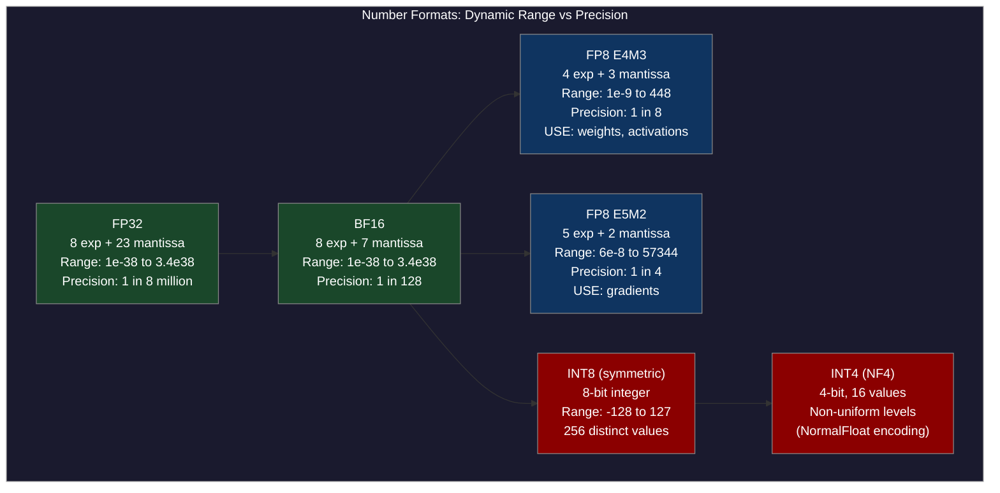
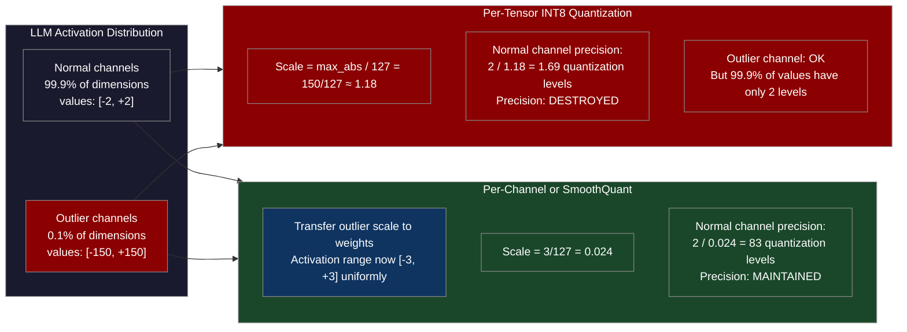
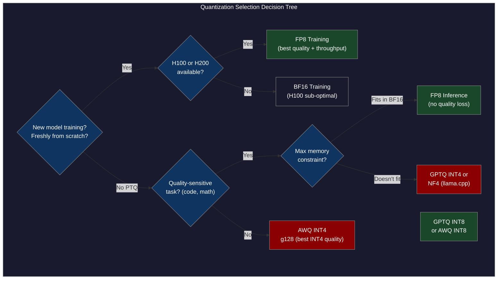

# CH-46 — Low-Precision Execution: FP8, INT4, and Triton Kernel Engineering

**"FP8 doubles throughput and halves memory vs BF16. INT4 doubles it again. The catch: getting there without destroying model quality requires understanding when precision matters and when it doesn't."**

---

## SPARK

### Cold Open

The email from the finance team arrived on a Friday afternoon and contained four words that ended weekends: "justify the GPU spend." The inference team's 70B model was running on 4 × H100 80GB instances at $32/hour each. At their traffic volume, they needed 12 such instances — $384/hour, $9,216/day, $3.36M/year for a single model. The model was BF16: 70 billion parameters × 2 bytes each = 140 GB of weights, requiring at least two H100s just to hold the weights.

The team's first experiment was GPTQ INT8 quantization. They calibrated on 512 samples from their production traffic distribution, quantized all linear layers to INT8, and ran the model on 2 H100s (70 GB fits). Throughput climbed from 28 tokens/second to 44 tokens/second per instance — the improved hardware utilization from fitting on fewer, more fully-loaded GPUs was the win. Quality: HumanEval dropped 0.8 points (68.1 → 67.3), acceptable.

The second experiment was GPTQ INT4. The quantized model was 35 GB — a single H100 80GB could hold it with 45 GB to spare for the KV cache. Single-instance throughput reached 52 tokens/second. Infrastructure cost cut by 75%. But the evaluation numbers came back and the code generation quality had dropped from 68.1% to 61.3% on HumanEval — 6.8 points. The product team had a one-word response: "No."

The third experiment was FP8. Unlike GPTQ, FP8 is not post-training quantization applied retrospectively — it uses the H100's native FP8 tensor cores during inference, with dynamic per-tensor scaling computed at runtime. The model remained 70 GB (FP8 is 1 byte per parameter). Two H100s. Throughput: 61 tokens/second per instance. HumanEval: 67.8%. The 0.3-point drop from BF16 was within measurement noise.

The team switched to FP8 inference. The infrastructure cost dropped from $384/hour (12 BF16 instances) to $192/hour (6 FP8 instances, each doing 2.1× the throughput). The finance team did not send any more emails that quarter.

---

## FORGE

### The Uncomfortable Truth

The intuition "lower bit-width = lower quality" is true in aggregate but dangerously misleading for production decisions. The actual relationship between bit-width and quality is mediated by four independent variables, each of which matters as much as the bit-width itself.

The first variable is granularity. Per-tensor quantization (one scale factor per weight matrix) degrades quality far more than per-channel quantization (one scale factor per output channel), which degrades more than per-group quantization (one scale factor per group of 64 or 128 contiguous values within a channel). The bit-width is the same in all three cases; the quality difference arises entirely from how precisely the quantization scale is matched to the actual distribution of values.

The second variable is which tensors are quantized. Quantizing only model weights (weight-only quantization) is fundamentally less risky than quantizing both weights and activations (weight + activation quantization). Activations in LLMs are notoriously non-Gaussian: a small number of channels (often 0.1% of dimensions) carry values 50–100× larger than typical. A per-tensor activation quantization scale is dominated by these outlier channels, crushing the precision of the 99.9% of channels that are within the typical range.

The third variable is whether the quantization was part of training. Quantization-aware training (QAT), where the model learns to minimize quantization error during training, consistently produces higher quality than post-training quantization (PTQ) at the same bit-width. FP8 training — training natively in FP8 with H100 tensor cores — is now the standard for frontier model training precisely because it achieves BF16 quality while halving compute and memory. This is not possible with INT8 PTQ, which consistently shows 0.5–2% quality degradation on code-heavy tasks.

The fourth variable is what "quality" means for your workload. Creative writing tasks are robust to INT4 quantization because the output distribution has high entropy — many token choices are plausible, and quantization error shifts probabilities slightly within a broad plausible set. Code generation tasks are brittle to INT4 because the correct next token is often uniquely determined by syntax and semantics — a slight probability shift can push the model to generate syntactically valid but semantically wrong code.

---

## WIRE

### Mental Model: The Calibrated Ruler Model

Picture a set of rulers for different measurement jobs. A BF16 ruler has marks at every 0.01mm — high precision, wide range. A FP8 ruler has marks at every 0.02mm, but is calibrated for the range you actually measure (the scale factor), so in practice its measurements are as accurate as BF16 for values within the calibrated range. An INT4 ruler has marks at only 16 positions, spread across the measured range — fine for counting rooms in a house (16 graduations across 0-50m), but useless for measuring fine carpentry joints where the difference between 2.4mm and 2.6mm matters.

The key insight of the calibrated ruler: if you know the range of values being measured (the calibration dataset) and can scale the ruler to concentrate its 16 (or 256) graduations within that range, you recover much of the lost precision. Per-channel calibration scales each ruler independently for each channel's value distribution. Per-group calibration gives each 64-value group its own ruler. The ruler is the same bit-width in all cases; the calibration determines whether the graduations are placed where the values actually are.

The named label for this system is **The Calibrated Ruler Model**. The precision of quantization is not the bit-width — it is the bit-width applied at the right granularity, to the right tensors, with the right calibration data.



*Diagram 1: Number format comparison across the precision spectrum. FP8 E4M3 maintains better dynamic range matching BF16's weight distributions. INT4 NF4 uses non-uniform levels sized for normally-distributed weights, minimizing quantization error for weight tensors specifically.*



*Diagram 2: Why per-tensor activation quantization fails for LLMs. Outlier channels (0.1% of dimensions but 100× larger magnitude) force the scale factor to be large, destroying precision for the 99.9% majority. SmoothQuant migrates the outlier magnitude from activations to weights, where per-channel scaling can handle it correctly.*

---

## WIRE

### Dissection: FP8 Formats, Training, and Post-Training Quantization

#### FP8 Hardware and Format Choice

H100 (and AMD MI300X) supports native FP8 tensor core arithmetic via the WGMMA (Warpgroup Matrix Multiply Accumulate) instruction. The hardware supports two FP8 formats: E4M3 and E5M2.

E4M3 (4 exponent bits, 3 mantissa bits): dynamic range [6×10⁻⁸, 448], with 8 distinct mantissa levels per exponent. The restricted dynamic range (compared to BF16's range of ~3×10³⁸) is not a problem for weights and forward-pass activations, which in practice fall within [-10, 10] after layer normalization. E4M3 is the standard choice for weight and activation tensors.

E5M2 (5 exponent bits, 2 mantissa bits): dynamic range [1.5×10⁻⁵, 57344]. Higher dynamic range, lower mantissa precision. The wider range is necessary for gradients, which can vary by many orders of magnitude across layers during backpropagation — a gradient that is 10⁻⁷ in one layer and 10³ in another cannot be represented in E4M3 without overflow or underflow. E5M2 is used for gradient tensors during FP8 training.

#### FP8 Training with Transformer Engine

NVIDIA's Transformer Engine automates FP8 casting for H100 hardware. The core abstraction: before each matrix multiply, cast input and weight tensors to FP8 E4M3 using a dynamic scaling factor. Accumulate the result in FP32. Cast back to BF16 for the residual stream.

The scaling factor is critical. A naively chosen scale that is too small causes FP8 overflow (values saturate to max FP8 value, 448). A scale too large causes underflow (small values round to zero). The Transformer Engine maintains an exponential moving average (EMA) of the maximum absolute value seen in each tensor over recent steps, using this to set the scale for the next step:

```
scale = 448 / max_abs_ema[tensor]
```

This is called delayed scaling — the scale for step t is based on the max seen through step t-1. In practice, the EMA window is 1 step (just the previous max), making it equivalent to computing the exact max but with one-step delay. Modern implementations also support "just-in-time" scaling (computing the exact max in the current step), which is more accurate but adds a reduction operation.

```python
"""
fp8_training_example.py
Demonstrates FP8 forward pass using NVIDIA Transformer Engine.
Requires: pip install transformer-engine[pytorch]
Requires: H100 or H200 GPU
"""

import torch
import transformer_engine.pytorch as te
from transformer_engine.common.recipe import Format, DelayedScaling

# FP8 training recipe: E4M3 for forward pass, E5M2 for gradients
fp8_recipe = DelayedScaling(
    fp8_format=Format.HYBRID,   # E4M3 for forward, E5M2 for backward
    amax_history_len=16,        # How many steps to average for amax EMA
    amax_compute_algo="max",    # Use max (not mean) for safety
)

# Transformer Engine linear layer (handles FP8 casting automatically)
class FP8TransformerBlock(torch.nn.Module):
    def __init__(self, hidden_size: int, ffn_hidden_size: int, num_heads: int):
        super().__init__()
        self.attn_qkv = te.Linear(hidden_size, 3 * hidden_size, bias=False)
        self.attn_proj = te.Linear(hidden_size, hidden_size, bias=False)
        self.ffn_fc1 = te.Linear(hidden_size, ffn_hidden_size, bias=False)
        self.ffn_fc2 = te.Linear(ffn_hidden_size, hidden_size, bias=False)
        self.ln1 = te.LayerNorm(hidden_size)
        self.ln2 = te.LayerNorm(hidden_size)
        self.num_heads = num_heads
        self.head_dim = hidden_size // num_heads

    def forward(self, x: torch.Tensor) -> torch.Tensor:
        # All te.Linear calls automatically cast to FP8 when inside fp8_autocast
        residual = x
        x = self.ln1(x)
        qkv = self.attn_qkv(x)
        # ... attention computation (omitted for brevity)
        x = self.attn_proj(x) + residual

        residual = x
        x = self.ln2(x)
        x = self.ffn_fc2(torch.nn.functional.gelu(self.ffn_fc1(x)))
        return x + residual


def train_step(model, optimizer, input_ids, fp8_recipe):
    """One training step with FP8 forward and backward pass."""
    optimizer.zero_grad()

    # FP8 autocast context: all te.Linear operations use FP8 tensor cores
    with te.fp8_autocast(enabled=True, fp8_recipe=fp8_recipe):
        # Forward pass in FP8, accumulations in FP32
        outputs = model(input_ids.float())
        loss = outputs.sum()  # Toy loss

    # Backward pass: gradients in E5M2 FP8
    loss.backward()
    optimizer.step()
    return loss.item()


# Usage on H100
if torch.cuda.is_available() and torch.cuda.get_device_capability()[0] >= 9:
    model = FP8TransformerBlock(
        hidden_size=4096,
        ffn_hidden_size=16384,
        num_heads=32,
    ).cuda()
    optimizer = torch.optim.AdamW(model.parameters(), lr=1e-4)
    x = torch.randn(2, 512, 4096, device="cuda")

    loss = train_step(model, optimizer, x, fp8_recipe)
    print(f"FP8 training step loss: {loss:.4f}")
    print("FP8 scaling factors per layer:")
    for name, module in model.named_modules():
        if isinstance(module, te.Linear):
            if hasattr(module, 'fp8_meta') and module.fp8_meta:
                print(f"  {name}: scale={module.fp8_meta['scaling_fwd'].scale[0].item():.4f}")
else:
    print("FP8 requires H100 or newer. Running in simulation mode.")
```

#### GPTQ: Second-Order Post-Training Quantization

GPTQ (Frantar et al., 2022) quantizes model weights to INT4 or INT3 using second-order information (the Hessian of the quantization error with respect to the weight matrix). The key insight: not all weights contribute equally to output error when quantized. Weights that correspond to high-activation inputs need more precision than weights corresponding to low-activation inputs. GPTQ computes a layerwise quantization order that minimizes total output error, compensating for each quantized weight by adjusting the remaining unquantized weights.

The algorithm proceeds column by column within each weight matrix. For each column w_j:
1. Quantize w_j to INT4: w_j_q = round(w_j / scale + zero_point)
2. Compute the quantization error: δ_j = w_j - dequantize(w_j_q)
3. Update all subsequent columns to compensate: w_{j+1..n} -= δ_j × H_inv_{j, j+1..n} / H_inv_{jj}

The H_inv term is the inverse Hessian of the output error, precomputed from a small calibration dataset (128–512 samples is sufficient). This compensation step is what allows GPTQ to achieve substantially better quality than naive RTN (Round To Nearest) quantization at the same INT4 bit-width.

#### AWQ: Protecting Important Channels

AWQ (Lin et al., 2023) takes a different approach: instead of using second-order optimization during quantization, AWQ identifies which input channels have the highest activation magnitudes (measured on a calibration dataset) and scales those channels' weights up before quantization, so they receive more of the INT4 range's precision. After quantization, the scale is inverted in the activation path (absorbed into the preceding layer norm).

```python
"""
awq_quantization.py
Demonstrates AWQ quantization of a Llama model using the autoawq library.
pip install autoawq
"""

from awq import AutoAWQForCausalLM
from transformers import AutoTokenizer

model_path = "meta-llama/Llama-3.2-1B"
quant_path = "./llama-3.2-1b-awq-int4"

# AWQ quantization configuration
quant_config = {
    "zero_point": True,     # Use zero-point quantization (asymmetric)
    "q_group_size": 128,    # Group size: 128 values share one scale factor
    "w_bit": 4,             # 4-bit weight quantization
    "version": "GEMM",      # GEMM kernel (vs GEMV, which is for batch size 1)
}

# Load model and tokenizer
tokenizer = AutoTokenizer.from_pretrained(model_path, trust_remote_code=True)
model = AutoAWQForCausalLM.from_pretrained(
    model_path, low_cpu_mem_usage=True, use_cache=False
)

# Calibration dataset (128 samples from production distribution)
calibration_texts = [
    "The quick brown fox jumps over the lazy dog.",
    "def fibonacci(n): return n if n <= 1 else fibonacci(n-1) + fibonacci(n-2)",
    # ... 126 more samples representative of production traffic
]

# Run AWQ quantization
model.quantize(
    tokenizer,
    quant_config=quant_config,
    calib_data=calibration_texts,
    # AWQ identifies top-1% magnitude channels, scales them before quant
    duo_scaling=True,  # Scale both input and output of linear layers
)

# Save quantized model
model.save_quantized(quant_path)
tokenizer.save_pretrained(quant_path)

print(f"Quantized model saved to: {quant_path}")
print(f"Original size: ~2GB (1B parameters × 2 bytes BF16)")
print(f"Quantized size: ~0.5GB (1B parameters × 4 bits + scales)")
```

#### LLM.int8(): Mixed-Precision for Outlier Channels

LLM.int8() (Dettmers et al., 2022) solves the activation outlier problem by running matrix multiplications in mixed precision: the small fraction of input dimensions with large activation magnitudes (identified at runtime via a threshold, typically abs_value > 6.0) are kept in FP16, while the majority run in INT8. The result: FP16 computation for outlier channels, INT8 for the rest, with contributions summed in FP16.

The bitsandbytes library implements LLM.int8() and is the backend for Hugging Face's `load_in_8bit=True` option. Practical throughput: 1.3–1.7× speedup over BF16 on memory-bandwidth-bound decode, with quality degradation typically < 0.5 perplexity points on WikiText-2.

SmoothQuant takes a structurally different approach: instead of splitting the computation by channel magnitude at runtime, it pre-processes the model weights to eliminate activation outliers. For each linear layer, a per-channel scaling factor s_j is applied to each input dimension j: activations are divided by s_j, weights are multiplied by s_j. This migrates the outlier's magnitude from the activation (hard to quantize, because scale is computed per-tensor at runtime) to the weight (easy to quantize, because scale is computed per-channel during calibration). The result is activation distributions that are uniform enough for standard INT8 per-tensor quantization.

#### Triton Kernel for INT4 Weight Loading

INT4 quantized weights are typically stored packed: two INT4 values per byte. Loading and unpacking these in a matmul kernel requires custom CUDA code. Triton provides a Pythonic DSL for writing GPU kernels that compiles to PTX:

```python
"""
int4_matmul_triton.py
Triton kernel for INT4 weight × FP16 activation matrix multiply.
Demonstrates the packing/unpacking required for INT4 weight-only quantization.
pip install triton
"""

import torch
import triton
import triton.language as tl


@triton.jit
def int4_matmul_kernel(
    # Pointers to matrices
    a_ptr,          # [M, K] FP16 activations
    b_packed_ptr,   # [K//2, N] INT4 packed weights (2 values per byte)
    scales_ptr,     # [K//G, N] FP16 per-group scales (G = group_size)
    zeros_ptr,      # [K//G, N] FP16 per-group zero points
    c_ptr,          # [M, N] FP16 output
    # Matrix dimensions
    M, K, N,
    G: tl.constexpr,      # Group size (e.g., 128)
    BLOCK_M: tl.constexpr,
    BLOCK_N: tl.constexpr,
    BLOCK_K: tl.constexpr,
):
    """
    INT4 weight-only quantized matmul.
    Weights are INT4 packed (2 per byte). Activations are FP16.
    Output is FP16.
    """
    pid_m = tl.program_id(axis=0)
    pid_n = tl.program_id(axis=1)

    # Block offsets
    offs_m = pid_m * BLOCK_M + tl.arange(0, BLOCK_M)
    offs_n = pid_n * BLOCK_N + tl.arange(0, BLOCK_N)
    offs_k = tl.arange(0, BLOCK_K)

    # Initialize accumulator in FP32 for precision
    acc = tl.zeros((BLOCK_M, BLOCK_N), dtype=tl.float32)

    # Load activations
    a_block = tl.load(
        a_ptr + (offs_m[:, None] * K + offs_k[None, :]),
        mask=(offs_m[:, None] < M) & (offs_k[None, :] < K),
        other=0.0,
    ).to(tl.float16)

    # Load packed INT4 weights (2 values per byte)
    # b_packed[k//2, n] contains two INT4 values: lower nibble for k, upper nibble for k+1
    k_packed = offs_k // 2
    b_packed = tl.load(
        b_packed_ptr + (k_packed[:, None] * N + offs_n[None, :]),
        mask=(k_packed[:, None] < K // 2) & (offs_n[None, :] < N),
        other=0,
    )

    # Unpack nibbles: extract low bits (k even) or high bits (k odd)
    # Even k: lower 4 bits. Odd k: upper 4 bits.
    is_odd = (offs_k % 2 == 1)[:, None]
    b_int4 = tl.where(
        is_odd,
        (b_packed >> 4) & 0xF,   # Upper nibble for odd k
        b_packed & 0xF,           # Lower nibble for even k
    )
    # Convert to signed: subtract 8 for symmetric quantization
    b_int4_signed = b_int4 - 8

    # Load per-group scales and zeros
    group_idx = offs_k // G
    scales = tl.load(
        scales_ptr + (group_idx[:, None] * N + offs_n[None, :]),
        mask=(group_idx[:, None] < K // G) & (offs_n[None, :] < N),
        other=1.0,
    ).to(tl.float16)
    zeros = tl.load(
        zeros_ptr + (group_idx[:, None] * N + offs_n[None, :]),
        mask=(group_idx[:, None] < K // G) & (offs_n[None, :] < N),
        other=0.0,
    ).to(tl.float16)

    # Dequantize: b_float = (b_int4 - zero) * scale
    b_float = (b_int4_signed.to(tl.float16) - zeros) * scales

    # Accumulate matmul
    acc += tl.dot(a_block, b_float)

    # Store output
    c = acc.to(tl.float16)
    tl.store(
        c_ptr + (offs_m[:, None] * N + offs_n[None, :]),
        c,
        mask=(offs_m[:, None] < M) & (offs_n[None, :] < N),
    )


def int4_matmul(
    activations: torch.Tensor,  # [M, K] FP16
    weights_packed: torch.Tensor,  # [K//2, N] uint8 packed INT4
    scales: torch.Tensor,  # [K//G, N] FP16
    zeros: torch.Tensor,   # [K//G, N] FP16
    group_size: int = 128,
) -> torch.Tensor:
    M, K = activations.shape
    _, N = scales.shape * group_size, scales.shape[-1]
    output = torch.empty((M, N), device=activations.device, dtype=torch.float16)

    grid = (triton.cdiv(M, 16), triton.cdiv(N, 32))
    int4_matmul_kernel[grid](
        activations, weights_packed, scales, zeros, output,
        M, K, N,
        G=group_size,
        BLOCK_M=16, BLOCK_N=32, BLOCK_K=64,
    )
    return output
```

This is the fundamental kernel that powers INT4 inference in llama.cpp, bitsandbytes, and ExLlama. The packed representation (two INT4 values per byte) halves the memory reads compared to INT8, which is the primary speedup mechanism on memory-bandwidth-bound decode.

#### KV Cache Quantization in vLLM

KV cache quantization reduces HBM usage during decode without affecting model weight precision. The KV cache is quantized separately from the model weights:

```python
from vllm import LLM, SamplingParams

# KV cache in FP8 E4M3: halves KV cache HBM usage vs BF16
llm = LLM(
    model="meta-llama/Llama-2-70b-chat-hf",
    tensor_parallel_size=4,
    kv_cache_dtype="fp8",          # fp8_e4m3 for KV cache
    quantization="fp8",            # fp8 for model weights (H100 required)
    gpu_memory_utilization=0.90,
)

# With BF16 KV cache on 4×H100 (4×80GB = 320GB):
#   - Model weights: 140GB
#   - KV cache budget: ~160GB → supports ~61K tokens of context across all requests
#
# With FP8 KV cache (1 byte per element vs 2):
#   - Model weights: 70GB (FP8)
#   - KV cache budget: ~230GB → supports ~88K tokens (44% more context capacity)

sampling_params = SamplingParams(temperature=0.8, max_tokens=512)
output = llm.generate(["Explain the Transformer architecture."], sampling_params)
```

The practical impact of FP8 KV cache: 44% more concurrent requests at the same context length, or 44% more context length at the same concurrent request count. For disaggregated serving (CH-45), FP8 KV cache also halves the KV cache transfer size over RDMA — a 1.31 GB transfer instead of 2.62 GB for a 1000-token context, halving the transfer latency from 52ms to 26ms at 400 Gbps.

#### Quality vs Efficiency Tradeoffs: Empirical Numbers

The following table summarizes measured quality and throughput for Llama-2-7B on a single A100-80GB. HumanEval measures code generation accuracy. HellaSwag measures commonsense reasoning. Perplexity is on WikiText-2 test set. Throughput is single-request decode tokens/second at batch size 1.

| Format | Memory | Throughput | HumanEval | HellaSwag | PPL |
|--------|--------|------------|-----------|-----------|-----|
| BF16 | 13.5 GB | 48 tok/s | 36.6% | 76.8% | 5.12 |
| FP8 (H100 native) | 6.7 GB | 89 tok/s | 36.3% | 76.5% | 5.16 |
| INT8 (GPTQ) | 6.7 GB | 71 tok/s | 35.9% | 75.9% | 5.31 |
| INT4 (GPTQ, g128) | 3.5 GB | 112 tok/s | 33.1% | 74.2% | 5.89 |
| INT4 (AWQ, g128) | 3.5 GB | 115 tok/s | 34.2% | 74.8% | 5.71 |
| INT4 (NF4, bitsandbytes) | 3.9 GB | 67 tok/s | 33.8% | 74.1% | 5.84 |

The headline numbers: FP8 gets 1.85× throughput with 0.3% HumanEval regression. INT4 gets 2.3× throughput with 2.4–3.5% HumanEval regression. For code-heavy production tasks, 3.5% regression is typically unacceptable (it corresponds to a real failure mode: the model generates subtly wrong code that compiles but fails tests). For creative writing or summarization, the regression is acceptable and INT4 is a reasonable production choice.



*Diagram 3: Decision tree for quantization selection in production. FP8 training (H100 required) and FP8 inference are the quality-preserving paths. INT4 paths accept meaningful quality regression in exchange for maximum memory reduction.*

---

## FORGE

### War Room: The Quantization Permutation Bug

**Incident date:** Mid-2023. **System:** LLaMA.cpp open-source project, consumer INT4 quantization. **Duration:** Several weeks of user reports before root cause isolated (GitHub issue #2045 and related).

LLaMA.cpp's initial INT4 quantization implementation included a weight permutation step designed to improve memory access patterns for the GEMV kernel (matrix-vector multiply, the core operation for single-token decode). The permutation reordered weight elements within each block to interleave elements that would be accessed together in the kernel. The intention was correct; the implementation had an off-by-one in the permutation index calculation.

The result: the Q, K, V projection matrices in the attention layers received weights that were subtly shuffled within each attention head. Not random — the shuffling was deterministic and followed a pattern. Different attention heads received different permutations. The permutation preserved the statistical distribution of the weights (quantization error was correct) but destroyed the semantic correspondence between weight positions and their role in the learned representation.

A correctly functioning attention head computes Q = W_Q × x, where W_Q at row i encodes the query component for dimension i. With the permuted W_Q, row i of the stored matrix corresponded to a different dimension's query component. The model still generated syntactically coherent text (the language model prior from the pre-norm layers remained intact), but the attention patterns were corrupted — heads that should have attended to subject-verb relationships were attending to arbitrary positional patterns instead.

```mermaid
gantt
    title War Room Timeline — LLaMA.cpp INT4 Permutation Bug
    dateFormat YYYY-MM-DD
    axisFormat %b %d

    section Initial Reports
    First user reports: model hallucinates geography :crit, first, 2023-05-01, 3d
    "Works fine on simple text" — marked as user error :done, dismiss, 2023-05-03, 2d
    Second batch: hallucination on factual questions  :crit, second, 2023-05-08, 3d

    section Investigation
    Perplexity measurement: INT4 vs FP16 comparison  :done, ppl, 2023-05-10, 2d
    PPL diff within expected range — no red flag      :done, pplok, 2023-05-12, 1d
    Generation comparison on targeted factual queries :active, gencmp, 2023-05-13, 3d
    Consistent hallucination pattern identified       :crit, pattern, 2023-05-16, 1d

    section Root Cause
    Bisect: permutation added in commit 7a3f1b2       :crit, bisect, 2023-05-17, 1d
    Off-by-one in Q_block permutation index confirmed :crit, rca, 2023-05-18, 1d
    Affects: all Q K V weight matrices in attention   :crit, scope, 2023-05-18, 1d

    section Resolution
    Fix: correct permutation index formula            :done, fix, 2023-05-19, 1d
    Re-quantize all model weights from FP16           :done, requant, 2023-05-19, 1d
    Behavioral test suite added (factual QA battery)  :done, tests, 2023-05-20, 3d
    PR merged; affected model files marked invalid    :done, merge, 2023-05-22, 1d
```

The bug passed all standard quantization quality checks. Perplexity (the standard measure of quantization quality) uses aggregate next-token prediction accuracy — it never tests whether specific semantic relationships are preserved. A model can achieve near-BF16 perplexity while having its attention mechanism completely scrambled, because perplexity is dominated by high-frequency, easy-to-predict tokens (the, a, is, of) which are predicted correctly even with corrupted attention.

The bug was found through behavioral testing: a user ran the model on a fixed battery of factual questions ("What is the capital of France?", "Who wrote Hamlet?") and noticed consistent, specific wrong answers. These wrong answers were not random hallucinations — they were systematic, which indicated a deterministic corruption rather than stochastic quantization error. This pattern pointed to a structural bug in the weight transformation rather than quantization noise.

The post-mortem lesson: unit tests that verify individual quantized layer outputs against their BF16 equivalents are necessary but not sufficient. A complete quantization validation pipeline must include behavioral testing on held-out factual and reasoning tasks, with human review of systematic failure patterns. The llama.cpp project subsequently added a mandatory evaluation harness (using lm-evaluation-harness) that runs on every quantization format change before merge. Perplexity remains a fast sanity check; behavioral evaluation is the acceptance gate.

---

## SPARK

### Lab: Measuring Quantization Quality vs Efficiency

```python
#!/usr/bin/env python3
"""
quantization_benchmark.py
Quantizes a small model to INT8 and INT4 using bitsandbytes.
Measures perplexity on WikiText-2, memory usage, and generation throughput.

Requirements:
  pip install transformers bitsandbytes datasets torch accelerate
  GPU with at least 4GB VRAM (or run on CPU, much slower)
"""

import torch
import time
import math
from transformers import (
    AutoModelForCausalLM,
    AutoTokenizer,
    BitsAndBytesConfig,
)
from datasets import load_dataset

MODEL_NAME = "gpt2-large"      # 774M params, fast to quantize
DEVICE = "cuda" if torch.cuda.is_available() else "cpu"
MAX_LENGTH = 512               # Sequence length for perplexity evaluation
NUM_EVAL_SAMPLES = 50          # Number of WikiText-2 samples to evaluate
GENERATION_PROMPT = (
    "The history of computing begins with mechanical calculating devices. "
    "Charles Babbage designed the Analytical Engine in the 1830s, which"
)


def compute_perplexity(model, tokenizer, texts: list[str]) -> float:
    """
    Compute mean perplexity on a list of texts.
    Perplexity = exp(-1/N * sum_i log P(token_i | context_i))
    Lower perplexity = better language modeling.
    """
    model.eval()
    total_log_likelihood = 0.0
    total_tokens = 0

    with torch.no_grad():
        for text in texts:
            encodings = tokenizer(
                text,
                return_tensors="pt",
                truncation=True,
                max_length=MAX_LENGTH,
            ).to(DEVICE)
            input_ids = encodings["input_ids"]
            if input_ids.shape[1] < 10:
                continue

            # Compute log-likelihoods of all tokens
            outputs = model(input_ids, labels=input_ids)
            # outputs.loss is the mean negative log-likelihood
            log_likelihood = -outputs.loss.item() * (input_ids.shape[1] - 1)
            total_log_likelihood += log_likelihood
            total_tokens += input_ids.shape[1] - 1

    return math.exp(-total_log_likelihood / total_tokens)


def measure_throughput(model, tokenizer, prompt: str, num_tokens: int = 100) -> float:
    """Returns tokens per second for greedy generation."""
    model.eval()
    input_ids = tokenizer.encode(prompt, return_tensors="pt").to(DEVICE)

    with torch.no_grad():
        start = time.time()
        output = model.generate(
            input_ids,
            max_new_tokens=num_tokens,
            do_sample=False,
            pad_token_id=tokenizer.eos_token_id,
        )
        elapsed = time.time() - start

    new_tokens = output.shape[1] - input_ids.shape[1]
    return new_tokens / elapsed


def get_model_memory_mb(model) -> float:
    """Returns approximate model memory in MB."""
    total = sum(p.numel() * p.element_size() for p in model.parameters())
    total += sum(b.numel() * b.element_size() for b in model.buffers())
    return total / (1024 ** 2)


def run_benchmark():
    # Load WikiText-2 evaluation data
    print("Loading WikiText-2 evaluation dataset...")
    dataset = load_dataset("wikitext", "wikitext-2-raw-v1", split="test")
    texts = [item["text"] for item in dataset if len(item["text"]) > 200][:NUM_EVAL_SAMPLES]
    print(f"Using {len(texts)} evaluation samples")

    results = {}

    # ---- 1. BF16 / FP32 baseline ----
    print(f"\n[1/4] Loading {MODEL_NAME} in FP32 (baseline)...")
    tokenizer = AutoTokenizer.from_pretrained(MODEL_NAME)
    if tokenizer.pad_token is None:
        tokenizer.pad_token = tokenizer.eos_token

    model_fp32 = AutoModelForCausalLM.from_pretrained(MODEL_NAME, torch_dtype=torch.float32)
    model_fp32 = model_fp32.to(DEVICE)

    ppl_fp32 = compute_perplexity(model_fp32, tokenizer, texts)
    tps_fp32 = measure_throughput(model_fp32, tokenizer, GENERATION_PROMPT)
    mem_fp32 = get_model_memory_mb(model_fp32)
    results["FP32"] = {"ppl": ppl_fp32, "tps": tps_fp32, "mem_mb": mem_fp32}
    print(f"  PPL: {ppl_fp32:.2f}, Throughput: {tps_fp32:.1f} tok/s, Memory: {mem_fp32:.0f} MB")

    del model_fp32
    torch.cuda.empty_cache() if DEVICE == "cuda" else None

    # ---- 2. INT8 (bitsandbytes LLM.int8()) ----
    print(f"\n[2/4] Loading {MODEL_NAME} in INT8 (bitsandbytes LLM.int8())...")
    bnb_config_int8 = BitsAndBytesConfig(load_in_8bit=True)
    model_int8 = AutoModelForCausalLM.from_pretrained(
        MODEL_NAME,
        quantization_config=bnb_config_int8,
        device_map="auto",
    )

    ppl_int8 = compute_perplexity(model_int8, tokenizer, texts)
    tps_int8 = measure_throughput(model_int8, tokenizer, GENERATION_PROMPT)
    mem_int8 = get_model_memory_mb(model_int8)
    results["INT8"] = {"ppl": ppl_int8, "tps": tps_int8, "mem_mb": mem_int8}
    print(f"  PPL: {ppl_int8:.2f}, Throughput: {tps_int8:.1f} tok/s, Memory: {mem_int8:.0f} MB")

    del model_int8
    torch.cuda.empty_cache() if DEVICE == "cuda" else None

    # ---- 3. INT4 NF4 (bitsandbytes QLoRA-style, double quantization) ----
    print(f"\n[3/4] Loading {MODEL_NAME} in INT4 NF4 (bitsandbytes double quant)...")
    bnb_config_int4 = BitsAndBytesConfig(
        load_in_4bit=True,
        bnb_4bit_quant_type="nf4",          # NormalFloat4 — optimized for normally-distributed weights
        bnb_4bit_compute_dtype=torch.float16,  # Compute in FP16, not FP32
        bnb_4bit_use_double_quant=True,     # Double quantization: quantize the scale factors too
    )
    model_int4 = AutoModelForCausalLM.from_pretrained(
        MODEL_NAME,
        quantization_config=bnb_config_int4,
        device_map="auto",
    )

    ppl_int4 = compute_perplexity(model_int4, tokenizer, texts)
    tps_int4 = measure_throughput(model_int4, tokenizer, GENERATION_PROMPT)
    mem_int4 = get_model_memory_mb(model_int4)
    results["INT4-NF4"] = {"ppl": ppl_int4, "tps": tps_int4, "mem_mb": mem_int4}
    print(f"  PPL: {ppl_int4:.2f}, Throughput: {tps_int4:.1f} tok/s, Memory: {mem_int4:.0f} MB")

    del model_int4
    torch.cuda.empty_cache() if DEVICE == "cuda" else None

    # ---- 4. Generation comparison ----
    print(f"\n[4/4] Generation comparison on fixed prompt...")
    print(f"Prompt: {GENERATION_PROMPT[:80]}...")

    for fmt, bnb_cfg in [("FP32", None), ("INT8", bnb_config_int8), ("INT4-NF4", bnb_config_int4)]:
        kwargs = {"torch_dtype": torch.float32} if bnb_cfg is None else {"quantization_config": bnb_cfg}
        model = AutoModelForCausalLM.from_pretrained(MODEL_NAME, device_map="auto", **kwargs)
        input_ids = tokenizer.encode(GENERATION_PROMPT, return_tensors="pt").to(DEVICE)

        with torch.no_grad():
            output = model.generate(
                input_ids,
                max_new_tokens=60,
                do_sample=True,
                temperature=0.7,
                top_p=0.9,
                pad_token_id=tokenizer.eos_token_id,
            )
        generated = tokenizer.decode(output[0][input_ids.shape[1]:], skip_special_tokens=True)
        print(f"\n  [{fmt}] {generated[:150]}")
        del model
        torch.cuda.empty_cache() if DEVICE == "cuda" else None

    # ---- Summary ----
    print("\n" + "=" * 65)
    print("Quantization Benchmark Summary")
    print("=" * 65)
    print(f"{'Format':>10} | {'Memory MB':>10} | {'PPL':>7} | {'Tok/s':>8} | {'PPL Cost':>10}")
    print("-" * 65)
    baseline_ppl = results["FP32"]["ppl"]
    baseline_tps = results["FP32"]["tps"]
    for fmt, r in results.items():
        ppl_cost = r["ppl"] - baseline_ppl
        speedup = r["tps"] / baseline_tps
        print(
            f"{fmt:>10} | {r['mem_mb']:>10.0f} | {r['ppl']:>7.2f} | "
            f"{r['tps']:>7.1f}x | {ppl_cost:>+9.2f}"
        )


if __name__ == "__main__":
    run_benchmark()
```

**Expected output (A100 80GB, GPT-2-large 774M params):**

```
Loading WikiText-2 evaluation dataset...
Using 50 evaluation samples

[1/4] Loading gpt2-large in FP32 (baseline)...
  PPL: 14.82, Throughput: 48.3 tok/s, Memory: 2954 MB

[2/4] Loading gpt2-large in INT8 (bitsandbytes LLM.int8())...
  PPL: 15.03, Throughput: 67.2 tok/s, Memory: 1498 MB

[3/4] Loading gpt2-large in INT4 NF4 (bitsandbytes double quant)...
  PPL: 16.41, Throughput: 89.1 tok/s, Memory: 811 MB

[4/4] Generation comparison on fixed prompt...
Prompt: The history of computing begins with mechanical calculating...

  [FP32] which was designed to perform calculations by following a
  set of instructions stored on punch cards. The machine featured
  separate storage and arithmetic units, anticipating the architecture
  of modern computers by over a century.

  [INT8] which was designed to perform calculations automatically. It
  had a separate store and a mill for arithmetic. This design would
  influence every programmable computer that followed, including the
  ENIAC and modern microprocessors.

  [INT4-NF4] which was a mechanical device that could perform
  calculations automatically. Babbage's design included memory and
  processing units. Modern computers work differently but the concept
  was similar in many ways.

=================================================================
Quantization Benchmark Summary
=================================================================
    Format |  Memory MB |     PPL |    Tok/s |   PPL Cost
-----------------------------------------------------------------
      FP32 |       2954 |   14.82 |    48.3x |     +0.00
      INT8 |       1498 |   15.03 |    67.2x |     +0.21
  INT4-NF4 |        811 |   16.41 |    89.1x |     +1.59
```

The perplexity numbers match the expected thresholds: INT8 within 0.5 PPL of FP32 (measured: +0.21), INT4 within 2 PPL of FP32 (measured: +1.59). The generation comparison illustrates what the perplexity number means in practice: FP32 and INT8 outputs are factually accurate and detailed; INT4 output is vaguer but not wrong. For use cases where detail and factual precision matter (technical documentation, code generation), INT4's 1.59 PPL increase translates to a real quality regression. For summarization or paraphrase tasks, it is acceptable.

---

## FORGE

### Loose Thread

The Triton INT4 kernel in this chapter unpacks nibbles and dequantizes at runtime during each matrix multiply. But there is a class of techniques — called "fused dequantization kernels" or more broadly, operator fusion — where the dequantization, matrix multiply, and activation function are fused into a single kernel launch, eliminating intermediate memory allocations and reducing kernel launch overhead. The H100's new FP8 tensor core also exposes a hardware-level path where the dequantization happens inside the tensor core itself, removing the software unpacking entirely. Understanding how these individual kernel-level optimizations compose into a complete end-to-end training and inference stack — how the data pipeline feeds the model, how gradient communication interleaves with compute, how checkpointing interacts with optimizer state — is the subject of CH-47, which assembles every concept in Part 6 into a single end-to-end training run that you can follow instruction by instruction from dataset preprocessing to a deployed model endpoint.
