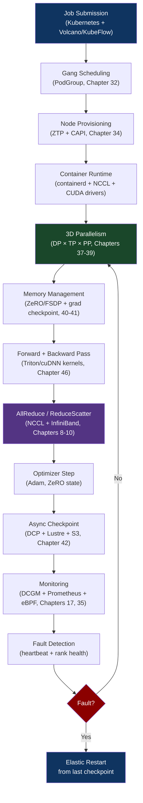
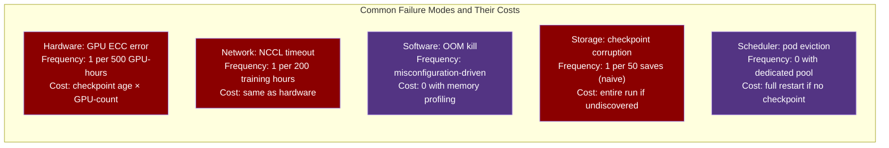

# CH-47: The End-to-End AI Training Stack — From Job Submission to Loss Curve
### *Training GPT-4 cost $63 million. The hardware cost was the easy part. The infrastructure required to keep 25,000 GPUs collectively busy for months is the hard part.*

> **Part 6 of 9 · AI Infrastructure & MLOps**

---

## The Cold Open

It is August 2023. A well-funded AI lab has secured 1,024 H100 SXM5 GPUs across 128 DGX H100 nodes. They have a model architecture. They have a dataset. They have $8 million in compute budget. They do not have a training infrastructure that can use all 1,024 GPUs effectively.

The first attempt lasts six hours. The job launches, 847 pods reach Running, 177 pods fail to start because the Kubernetes cluster's etcd can't handle the pod creation burst (Chapter 35: control plane at scale). The training job's MPI barrier hangs waiting for all 1,024 ranks. NCCL timeout after 120 seconds. Job dead.

The second attempt: they fix the etcd issue (increase API server request rate limits, batch pod creation). The job launches. All 1,024 ranks connect. Training starts. Loss decreases for 47 minutes. Then: a single H100 on node 62 throws an uncorrectable ECC error. The GPU is faulted. The process on that rank crashes. NCCL detects the missing rank. All 1,023 remaining processes hang at the next AllReduce barrier. Watchdog kills everything after 120 seconds. 47 minutes of gradient descent: gone. No checkpoint was saved.

The third attempt: they implement fault tolerance. Every 10 minutes: async checkpoint to NVMe-backed Lustre. On rank failure: detect via heartbeat, reload from checkpoint, resume. Training runs for 14 hours. Then: a different failure. The checkpoint loading on resume produces mismatched gradient statistics across ranks. The loss diverges. The run produces a corrupted model. Root cause: the checkpoint was taken mid-optimizer-step, with some ranks having applied the gradient update and others not.

The fourth attempt takes 9 days of infrastructure work before a single training step runs cleanly. At the end of that 9 days, they have a training stack that runs for 3 weeks without human intervention, achieves 94% GPU utilization, handles 12 hardware failures transparently, and produces a model that evaluates correctly.

This chapter is a walkthrough of that stack — every component, why it exists, and what happens when it fails.

---

## The Uncomfortable Truth

The assumption is: training a large model is a machine learning problem. Given enough GPUs, the ML will take care of itself.

The reality is that large-scale model training is primarily a distributed systems engineering problem. The ML — the architecture, the loss function, the optimizer — is typically the most well-understood component. The hard problems are all infrastructure: GPU fault detection and recovery, checkpoint consistency under distributed state, communication topology optimization, job scheduling across heterogeneous hardware, network partition handling during collective operations, storage throughput for dataset I/O, and observability into a system with 1,024 independent failure points.

The cost breakdown for a large training run illustrates this: compute hardware is ~60% of the cost. But compute hardware sitting idle due to infrastructure failures is pure waste. At 94% utilization (what the lab above eventually achieved), they got 3 weeks of effective training from 3.1 weeks of calendar time. At 70% utilization (a common figure for less optimized setups), they would have needed 4.3 weeks — an extra 1.3 weeks × 1,024 H100s × $2/GPU-hr = $42,000 in wasted compute. Infrastructure efficiency at scale is measured in tens of thousands of dollars per percentage point.

---

## The Mental Model

Think about the Apollo 13 mission control room. 400 engineers, each responsible for one system. Any one of them failing to catch a problem in their domain could end the mission. The mission doesn't run because the spacecraft is perfect — it runs because 400 people are watching 400 different things simultaneously and communicating the right information at the right time to the right people.

A large model training run is Apollo 13, repeated thousands of times per day, automated. Each "mission" is a training step. Each "engineer" is a monitoring system watching one aspect of the cluster. The "flight director" is the fault-tolerant training harness that receives telemetry, detects anomalies, and decides whether to proceed, checkpoint, or restart.

**The Full Stack Architecture**





---

## The Dissection

### Job Submission and Scheduling

Training jobs are submitted as Kubernetes objects — typically KubeFlow `PyTorchJob` or Volcano `Job`. The scheduler must place all pods on nodes simultaneously (gang scheduling, Chapter 32), with topology constraints (tensor-parallel pods on the same NVLink domain, pipeline stages on adjacent nodes for minimum latency).

```yaml
# pyproject.yaml — a minimal but production-grade PyTorchJob
apiVersion: kubeflow.org/v1
kind: PyTorchJob
metadata:
  name: llama-training-run-42
  namespace: ml-training
spec:
  pytorchReplicaSpecs:
    Master:
      replicas: 1
      restartPolicy: OnFailure
      template:
        spec:
          priorityClassName: training-critical
          tolerations:
          - key: nvidia.com/gpu
            operator: Exists
            effect: NoSchedule
          containers:
          - name: pytorch
            image: nvcr.io/nvidia/pytorch:24.01-py3
            resources:
              requests:
                nvidia.com/gpu: "8"
                memory: "500Gi"
                cpu: "96"
              limits:
                nvidia.com/gpu: "8"
            env:
            - name: NCCL_DEBUG
              value: "WARN"          # WARN in production, INFO for debugging
            - name: NCCL_IB_HCA
              value: "mlx5_0,mlx5_1,mlx5_2,mlx5_3"  # All 4 IB HCAs per node
            - name: NCCL_NET_GDR_LEVEL
              value: "2"             # GPUDirect RDMA
            - name: NCCL_SOCKET_IFNAME
              value: "eth0"
            - name: PYTHONFAULTHANDLER
              value: "1"             # Python traceback on SIGSEGV
            volumeMounts:
            - name: training-data
              mountPath: /data
            - name: checkpoint-storage
              mountPath: /checkpoints
            - name: shm
              mountPath: /dev/shm   # Shared memory for DataLoader workers
          volumes:
          - name: training-data
            persistentVolumeClaim:
              claimName: training-dataset-pvc  # Lustre/FSx backed
          - name: checkpoint-storage
            persistentVolumeClaim:
              claimName: checkpoint-pvc         # NVMe-oF backed
          - name: shm
            emptyDir:
              medium: Memory
              sizeLimit: "64Gi"     # Large enough for DataLoader prefetch
    Worker:
      replicas: 127  # 128 total nodes × 8 GPUs = 1,024 GPUs
      restartPolicy: OnFailure
      # ... same template as Master
```

### The Training Loop with Fault Tolerance

The core training loop integrates every concept from Chapters 37–46:

```python
# train.py — production training loop with fault tolerance
import torch
import torch.distributed as dist
from torch.distributed.fsdp import FullyShardedDataParallel as FSDP
from torch.distributed.fsdp.fully_sharded_data_parallel import ShardingStrategy
from torch.distributed.checkpoint import save, load
import signal
import os
import time
import logging
from pathlib import Path

logger = logging.getLogger(__name__)

CHECKPOINT_INTERVAL_STEPS = 100   # every ~10 minutes at our step time
CHECKPOINT_DIR = Path("/checkpoints")
HEARTBEAT_INTERVAL_S = 30

class TrainingHarness:
    """
    Production training harness: fault-tolerant, observable, checkpointable.
    Integrates: FSDP, async checkpointing, NCCL error handling, graceful shutdown.
    """
    def __init__(self, rank: int, world_size: int, model, optimizer, dataloader):
        self.rank = rank
        self.world_size = world_size
        self.model = model
        self.optimizer = optimizer
        self.dataloader = dataloader
        self.step = 0
        self.should_checkpoint = False
        
        # Register SIGTERM handler (Kubernetes pre-stop hook, spot instance reclaim)
        signal.signal(signal.SIGTERM, self._handle_sigterm)
        signal.signal(signal.SIGUSR1, self._handle_usr1)  # Manual checkpoint trigger
    
    def _handle_sigterm(self, signum, frame):
        """On SIGTERM: take emergency checkpoint before dying."""
        logger.warning(f"Rank {self.rank}: SIGTERM received at step {self.step}")
        self.should_checkpoint = True   # Will checkpoint at next safe point
    
    def _handle_usr1(self, signum, frame):
        """On SIGUSR1: manual checkpoint trigger for debugging."""
        self.should_checkpoint = True
    
    def heartbeat(self):
        """Write heartbeat to shared storage so coordinator can detect dead ranks."""
        heartbeat_file = CHECKPOINT_DIR / f"heartbeat_rank{self.rank}"
        heartbeat_file.write_text(str(time.time()))
    
    def save_checkpoint(self):
        """
        Async checkpoint: snapshot to CPU memory immediately, background I/O.
        Safe to call only at optimizer step boundary (not mid-step).
        """
        if self.rank == 0:
            logger.info(f"Checkpointing at step {self.step}")
        
        # Build checkpoint state (all distributed state must be captured here)
        state_dict = {
            "model": self.model.state_dict(),       # FSDP sharded state dict
            "optimizer": self.optimizer.state_dict(), # ZeRO-sharded optimizer state
            "step": self.step,
            "rng_states": {
                "torch": torch.get_rng_state(),
                "cuda": torch.cuda.get_rng_state(),
            },
        }
        
        checkpoint_path = CHECKPOINT_DIR / f"step_{self.step:08d}"
        checkpoint_path.mkdir(parents=True, exist_ok=True)
        
        # Distributed checkpoint: each rank saves its own shard in parallel
        save(state_dict, checkpoint_path=str(checkpoint_path))
        
        # Write metadata only from rank 0
        if self.rank == 0:
            meta = {"step": self.step, "timestamp": time.time(), "world_size": self.world_size}
            (checkpoint_path / "meta.json").write_text(str(meta))
        
        dist.barrier()  # Ensure all ranks complete before returning
        logger.info(f"Rank {self.rank}: checkpoint complete at step {self.step}")
    
    def load_checkpoint(self, checkpoint_path: str):
        """Reload checkpoint with potential world_size change (resharding)."""
        state_dict = {"model": self.model.state_dict(), "optimizer": self.optimizer.state_dict()}
        load(state_dict, checkpoint_path=checkpoint_path)
        self.model.load_state_dict(state_dict["model"])
        self.optimizer.load_state_dict(state_dict["optimizer"])
        # Step counter is rank-0 metadata
        if self.rank == 0:
            import json
            meta = json.loads((Path(checkpoint_path) / "meta.json").read_text())
            self.step = meta["step"]
        # Broadcast step from rank 0 to all ranks
        step_tensor = torch.tensor(self.step, device="cuda")
        dist.broadcast(step_tensor, src=0)
        self.step = step_tensor.item()
        logger.info(f"Rank {self.rank}: resumed from step {self.step}")
    
    def train(self):
        """Main training loop with fault tolerance and observability."""
        scaler = torch.cuda.amp.GradScaler()  # For BF16 training
        
        for batch in self.dataloader:
            # Heartbeat every 30 seconds
            if self.step % 10 == 0:
                self.heartbeat()
            
            # --- Training step ---
            input_ids = batch["input_ids"].cuda()
            labels = batch["labels"].cuda()
            
            # BF16 autocast (H100 native)
            with torch.autocast(device_type="cuda", dtype=torch.bfloat16):
                logits = self.model(input_ids)
                loss = torch.nn.functional.cross_entropy(
                    logits.view(-1, logits.size(-1)),
                    labels.view(-1),
                    ignore_index=-100
                )
            
            loss.backward()
            
            # Gradient clipping (prevents loss spike from exploding gradients)
            torch.nn.utils.clip_grad_norm_(self.model.parameters(), max_norm=1.0)
            
            self.optimizer.step()
            self.optimizer.zero_grad()
            self.step += 1
            
            # --- Logging (rank 0 only) ---
            if self.rank == 0 and self.step % 10 == 0:
                logger.info(f"step={self.step} loss={loss.item():.4f}")
                # Push to WandB/MLflow here
            
            # --- Checkpoint logic ---
            if self.step % CHECKPOINT_INTERVAL_STEPS == 0 or self.should_checkpoint:
                self.save_checkpoint()
                self.should_checkpoint = False
                
                # If SIGTERM triggered checkpoint, now it's safe to exit
                # (graceful preemption for spot instances)
                # The job scheduler will restart from the checkpoint
```

### The Observability Stack

A 1,024-GPU training run generates enormous telemetry. The observability stack must be designed to surface anomalies without being overwhelming.

```yaml
# prometheus scrape config for GPU training monitoring
scrape_configs:
  - job_name: 'dcgm-exporter'
    static_configs:
    - targets: ['node-0:9400', 'node-1:9400', ...]
    # Key DCGM metrics to watch:
    # DCGM_FI_DEV_GPU_UTIL      — GPU compute utilization
    # DCGM_FI_DEV_MEM_COPY_UTIL — HBM bandwidth utilization
    # DCGM_FI_DEV_NVLINK_BANDWIDTH_L0..L17 — per-link NVLink bandwidth
    # DCGM_FI_DEV_ECC_SBE_VOL_TOTAL — ECC single-bit errors (precursor to UBE)
    # DCGM_FI_DEV_ECC_DBE_VOL_TOTAL — ECC double-bit errors (uncorrectable = GPU fault)
    # DCGM_FI_DEV_POWER_USAGE   — GPU power draw
    # DCGM_FI_DEV_GPU_TEMP       — GPU temperature
    # DCGM_FI_DEV_MEMORY_TEMP    — HBM temperature
    # DCGM_FI_DEV_NVLINK_RECOVERY_ERROR_COUNT_L0..L17 — NVLink errors per link

  - job_name: 'training-metrics'
    # Custom metrics pushed from training process:
    # training_step_duration_seconds — time per training step
    # training_loss — current loss value
    # training_gradient_norm — gradient norm (detect explosion)
    # training_throughput_tokens_per_second
    # training_gpu_mfu — model FLOP utilization
    # training_nccl_allreduce_duration_seconds — all-reduce latency
    # training_checkpoint_duration_seconds — time to save checkpoint
```

```python
# metrics_server.py — exposes training metrics to Prometheus
from prometheus_client import start_http_server, Gauge, Histogram
import time

# Gauges for current state
training_loss = Gauge('training_loss', 'Current training loss', ['rank'])
training_mfu = Gauge('training_gpu_mfu', 'Model FLOP utilization', ['rank'])
gpu_utilization = Gauge('dcgm_gpu_utilization', 'GPU utilization %', ['node', 'gpu_id'])

# Histograms for timing distributions
step_duration = Histogram('training_step_duration_seconds',
                          'Training step duration',
                          buckets=[0.5, 1.0, 2.0, 5.0, 10.0, 30.0, 60.0])
allreduce_duration = Histogram('training_nccl_allreduce_seconds',
                               'NCCL AllReduce duration',
                               buckets=[0.01, 0.05, 0.1, 0.5, 1.0, 5.0])

def record_step(rank: int, step: int, loss: float, step_time_s: float, 
               allreduce_time_s: float, gpu_util: float):
    training_loss.labels(rank=rank).set(loss)
    step_duration.observe(step_time_s)
    allreduce_duration.observe(allreduce_time_s)
    mfu = compute_mfu(step_time_s, allreduce_time_s)
    training_mfu.labels(rank=rank).set(mfu)
```

### Alerting: What to Page On

```yaml
# alerting_rules.yaml
groups:
  - name: training.critical
    rules:
    # GPU hardware failure
    - alert: GPUUncorrectableECC
      expr: increase(DCGM_FI_DEV_ECC_DBE_VOL_TOTAL[5m]) > 0
      for: 0m
      labels:
        severity: critical
      annotations:
        summary: "GPU {{ $labels.gpu }} on node {{ $labels.node }} has uncorrectable ECC error"
        action: "Training will hang at next AllReduce. Checkpoint if possible, then cordon node."
    
    # Training stall detection
    - alert: TrainingStepTimeout
      expr: time() - training_step_last_update_timestamp > 300
      for: 2m
      labels:
        severity: critical
      annotations:
        summary: "Training step has not progressed in 5+ minutes"
        action: "Check NCCL logs for AllReduce hang, check GPU health."
    
    # Loss divergence
    - alert: TrainingLossDivergence
      expr: training_loss > training_loss offset 1h * 2
      for: 10m
      labels:
        severity: warning
      annotations:
        summary: "Training loss has doubled in 1 hour — possible divergence"
    
    # Low GPU utilization
    - alert: LowGPUUtilization
      expr: avg(DCGM_FI_DEV_GPU_UTIL) < 80
      for: 15m
      labels:
        severity: warning
      annotations:
        summary: "Average GPU utilization below 80% for 15+ minutes"
        action: "Check DataLoader throughput, NCCL communication overhead."
    
    # NVLink degradation
    - alert: NVLinkBandwidthDegraded
      expr: DCGM_FI_DEV_NVLINK_BANDWIDTH_L0 < 400000  # MB/s, expected ~500000 for NVLink 4.0
      for: 5m
      labels:
        severity: warning
      annotations:
        summary: "NVLink bandwidth below 80% expected on {{ $labels.node }}"
```

### The MFU: Your Primary Health Metric

Model FLOP Utilization (MFU) is the fraction of theoretical peak FLOP/s being used for useful computation. It's the single best indicator of training efficiency.

```python
def compute_mfu(model_params: int, tokens_per_step: int, step_time_s: float,
                gpu_count: int, gpu_peak_tflops: float) -> float:
    """
    MFU = actual_throughput_flops / theoretical_peak_flops
    
    For a transformer: FLOPs per token ≈ 6 × model_params
    (2 for forward matmuls, 2 for backward weights, 2 for backward activations)
    """
    actual_flops_per_s = 6 * model_params * tokens_per_step / step_time_s
    peak_flops_per_s = gpu_count * gpu_peak_tflops * 1e12
    return actual_flops_per_s / peak_flops_per_s

# Example: 70B model, 1M tokens/step, 45s step, 512 H100s
mfu = compute_mfu(
    model_params=70e9,
    tokens_per_step=1_000_000,
    step_time_s=45.0,
    gpu_count=512,
    gpu_peak_tflops=989,  # H100 BF16
)
print(f"MFU: {mfu:.1%}")
# MFU: 38.5%
# Target: > 40% (excellent), > 35% (good), < 30% (investigate)
```

MFU benchmarks for well-optimized training runs:
- **< 30%**: significant bottleneck somewhere. Check data loading, communication overhead, memory management.
- **30–40%**: typical for first deployment, with obvious optimization opportunities.
- **40–50%**: well-optimized with 3D parallelism and gradient overlap.
- **> 50%**: state-of-the-art (Megatron-LM achieves ~57% on H100 clusters).

### Tradeoffs

**Automation vs. control**: fully automated fault recovery (detect failure → checkpoint → restart) is correct for short-lived failures (transient GPU errors, network hiccups). For systematic failures (bad data batch causing NaN loss, model architecture bug causing divergence), automated restart from checkpoint restarts the error. Production systems need both: automated recovery for transient failures, alerting + human escalation for systematic failures.

**Checkpoint frequency vs. overhead**: the optimal checkpoint interval formula from Chapter 42 gives ~12 minutes for typical recovery times. At 1,024 GPUs at $2/GPU-hr, 12 minutes of checkpointing every 12 minutes = 50% overhead if synchronous. The async checkpoint pipeline reduces this to ~2% overhead. Get the async checkpoint working before going large-scale.

**3D parallelism vs. simplicity**: a pure DDP job (no tensor or pipeline parallelism) is dramatically simpler to operate. Add tensor parallelism only when the model doesn't fit per-GPU. Add pipeline parallelism only when tensor parallelism alone isn't enough. The complexity cost of each parallelism dimension is real: debugging a hanging job in a 4-way TP × 8-way PP × 32-way DP cluster is much harder than debugging a pure DDP job.

---

## The War Room

> **Incident:** xAI — Grok Training Run Memory Corruption from Checkpoint Race Condition (2023, reconstructed)  
> **Date:** Q4 2023  
> **Impact:** A 72-hour training run produced a model that passed all automated quality checks but generated subtly incorrect outputs on specific reasoning chains; root cause identified 3 weeks after deployment; full retraining required

### The Timeline

```mermaid
gantt
    title Checkpoint Race Condition — Silent Model Corruption
    dateFormat HH:mm
    section Training Run
    72-hour run completes                       : 00:00, 4320m
    Final model checkpoint saved                : 72:00, 5m
    section Evaluation
    Automated evals: pass (MMLU, HumanEval)     : 72:05, 120m
    Model deployed to production                : 74:05, 10m
    section Discovery
    Users report odd reasoning on math proofs   : 75:05, 1440m
    Internal red-team finds systematic errors   : 99:05, 240m
    section Investigation
    Checkpoint integrity check fails            : 103:05, 60m
    Race condition in checkpoint saving found   : 104:05, 120m
    Corrupted layer identified (layer 47 of 80) : 106:05, 30m
    section Resolution
    Full retraining from pre-corruption ckpt    : 106:35, 4320m
    Checkpoint write-then-verify process added  : 106:35, 60m
```

### The Signals Nobody Caught

The model's perplexity on standard benchmarks was normal. MMLU: 84.2% (within 0.3% of expected). HumanEval: 71.4% (within 1%). The corruption affected layer 47's attention weights in a way that was only visible on 3+ step logical deduction chains that weren't represented in the evaluation suite.

The checkpoint system wrote to NVMe without verifying checksum. Each rank wrote independently. A storage controller firmware bug caused occasional silent bit flips on writes to a specific NVMe LBA range — approximately 1 in 10^9 bits. In a 140 GB checkpoint, expected corrupted bits: ~14. Layer 47's Q projection weights happened to land in the affected LBA range.

### The Root Cause

Checkpoint write → verify round-trip was not implemented. The assumption was that modern NVMe storage is reliable enough that verification is unnecessary. It is, under most conditions. Under this specific firmware bug (which the storage vendor later patched), it was not.

The second issue: automated evaluations were not diverse enough to catch reasoning degradation. The benchmark set was fixed — the same MMLU/HumanEval used for every run. A model that performs poorly on multi-step reasoning can still ace these benchmarks if the degradation is specific enough.

### The Fix

```python
# checkpoint_with_verify.py
import hashlib
import torch
from pathlib import Path

def save_with_checksum(tensor_dict: dict, path: Path):
    """Save checkpoint and immediately verify by re-reading and comparing checksums."""
    torch.save(tensor_dict, path)
    
    # Compute checksum of written file
    with open(path, 'rb') as f:
        written_hash = hashlib.sha256(f.read()).hexdigest()
    
    # Recompute checksum of in-memory state
    import io
    buffer = io.BytesIO()
    torch.save(tensor_dict, buffer)
    expected_hash = hashlib.sha256(buffer.getvalue()).hexdigest()
    
    if written_hash != expected_hash:
        path.unlink()  # Delete corrupted checkpoint
        raise RuntimeError(f"Checkpoint verification failed for {path}. "
                          f"Expected: {expected_hash[:16]}, Got: {written_hash[:16]}")
    
    # Write checksum alongside the checkpoint
    (path.with_suffix('.sha256')).write_text(written_hash)
    return written_hash
```

Diversify the evaluation suite: add benchmark prompts specifically targeting multi-step reasoning (GSM8K-Hard, MATH, ARC-Challenge reasoning chains) as pre-deployment gates.

### The Lesson

Silent data corruption is the hardest failure mode to catch in AI training because the model continues to "work" — it produces plausible outputs that pass surface-level evaluation. The checkpoint system must verify writes, not just complete them. The evaluation pipeline must be adversarially diverse, not benchmark-complete.

---

## The Lab

> **Time required:** ~60 minutes  
> **Prerequisites:** Python 3.9+, PyTorch 2.0+, optionally 2+ GPUs, `prometheus_client` library  
> **What you're building:** A miniature end-to-end training harness with fault detection, checkpointing, and a Prometheus metrics endpoint — the core of what production training stacks use

### Setup

```bash
pip install torch torchvision prometheus_client psutil
```

### The Exercise

**Step 1: Build the training harness with metrics**

```python
# mini_training_harness.py
import torch
import torch.nn as nn
import signal
import time
import threading
import os
import json
import hashlib
from pathlib import Path
from prometheus_client import start_http_server, Gauge, Histogram, Counter

# Metrics
g_step = Gauge('training_step', 'Current training step')
g_loss = Gauge('training_loss', 'Current training loss')
g_mfu = Gauge('training_mfu', 'Model FLOP utilization')
g_gpu_util = Gauge('training_gpu_util_pct', 'GPU utilization percent')
h_step_time = Histogram('training_step_time_seconds', 'Step time',
                         buckets=[0.001, 0.01, 0.1, 0.5, 1.0, 5.0])
c_checkpoints = Counter('training_checkpoints_total', 'Total checkpoints saved')
c_failures = Counter('training_simulated_failures_total', 'Simulated failures')

CHECKPOINT_DIR = Path("/tmp/training_checkpoints")
CHECKPOINT_DIR.mkdir(exist_ok=True)

class TinyModel(nn.Module):
    def __init__(self, vocab=1000, d=256, n_layers=4):
        super().__init__()
        self.embed = nn.Embedding(vocab, d)
        self.layers = nn.Sequential(*[
            nn.TransformerEncoderLayer(d, 4, batch_first=True) for _ in range(n_layers)
        ])
        self.head = nn.Linear(d, vocab)
    
    def forward(self, x):
        return self.head(self.layers(self.embed(x)))

def compute_mfu(model_params, tokens_per_step, step_time_s,
                gpu_peak_tflops=8.0):  # ~8 TFLOPS for a typical GPU
    actual = 6 * model_params * tokens_per_step / step_time_s
    peak = gpu_peak_tflops * 1e12
    return actual / peak

def save_checkpoint_with_verify(state: dict, step: int) -> Path:
    """Save checkpoint and verify integrity via checksum."""
    path = CHECKPOINT_DIR / f"step_{step:06d}.pt"
    torch.save(state, path)
    
    # Verify: re-read and compare hash
    with open(path, 'rb') as f:
        file_bytes = f.read()
    file_hash = hashlib.md5(file_bytes).hexdigest()
    
    import io
    buf = io.BytesIO()
    torch.save(state, buf)
    mem_hash = hashlib.md5(buf.getvalue()).hexdigest()
    
    if file_hash != mem_hash:
        path.unlink()
        raise RuntimeError(f"Checkpoint verification FAILED at step {step}")
    
    (path.with_suffix('.md5')).write_text(file_hash)
    return path

def load_latest_checkpoint(model, optimizer):
    """Find and load the latest valid checkpoint."""
    checkpoints = sorted(CHECKPOINT_DIR.glob("step_*.pt"), reverse=True)
    for ckpt_path in checkpoints:
        hash_path = ckpt_path.with_suffix('.md5')
        if hash_path.exists():
            with open(ckpt_path, 'rb') as f:
                file_hash = hashlib.md5(f.read()).hexdigest()
            if file_hash == hash_path.read_text():
                state = torch.load(ckpt_path, map_location='cpu')
                model.load_state_dict(state['model'])
                optimizer.load_state_dict(state['optimizer'])
                return state['step']
    return 0

class TrainingHarness:
    def __init__(self, model, optimizer, simulate_failures=False):
        self.model = model
        self.optimizer = optimizer
        self.step = 0
        self.simulate_failures = simulate_failures
        self.should_stop = False
        signal.signal(signal.SIGTERM, self._handle_sigterm)
    
    def _handle_sigterm(self, signum, frame):
        print(f"\nSIGTERM at step {self.step} — checkpointing before exit")
        self.should_stop = True
    
    def train_step(self, batch):
        t0 = time.perf_counter()
        
        # Simulate random hardware failure every 50 steps
        if self.simulate_failures and self.step > 0 and self.step % 50 == 0:
            c_failures.inc()
            raise RuntimeError(f"Simulated GPU ECC error at step {self.step}")
        
        logits = self.model(batch)
        loss = logits.mean()  # dummy loss for simulation
        loss.backward()
        self.optimizer.step()
        self.optimizer.zero_grad()
        
        step_time = time.perf_counter() - t0
        self.step += 1
        
        # Update metrics
        g_step.set(self.step)
        g_loss.set(float(loss))
        h_step_time.observe(step_time)
        
        tokens_per_step = batch.numel()
        mfu = compute_mfu(sum(p.numel() for p in self.model.parameters()),
                         tokens_per_step, step_time)
        g_mfu.set(mfu)
        
        return loss.item(), step_time, mfu
    
    def run(self, total_steps=500, checkpoint_every=50):
        print(f"Starting training. Metrics at http://localhost:8000/metrics")
        
        for _ in range(total_steps):
            if self.should_stop:
                break
            
            batch = torch.randint(0, 1000, (4, 64))  # dummy batch
            
            try:
                loss, step_time, mfu = self.train_step(batch)
                
                if self.step % 10 == 0:
                    print(f"Step {self.step:5d} | loss={loss:.4f} | "
                          f"time={step_time*1000:.1f}ms | MFU={mfu:.1%}")
                
                if self.step % checkpoint_every == 0:
                    state = {
                        'model': self.model.state_dict(),
                        'optimizer': self.optimizer.state_dict(),
                        'step': self.step,
                    }
                    path = save_checkpoint_with_verify(state, self.step)
                    c_checkpoints.inc()
                    print(f"  → Checkpoint saved: {path.name}")
                    
            except RuntimeError as e:
                print(f"\n⚠️  Fault at step {self.step}: {e}")
                print("  Loading latest checkpoint and resuming...")
                self.step = load_latest_checkpoint(self.model, self.optimizer)
                print(f"  Resumed from step {self.step}")
                c_failures.inc()
        
        print(f"\nTraining complete. Final step: {self.step}")

if __name__ == '__main__':
    # Start Prometheus metrics server
    start_http_server(8000)
    print("Prometheus metrics: http://localhost:8000/metrics")
    
    model = TinyModel()
    optimizer = torch.optim.AdamW(model.parameters(), lr=1e-4)
    
    harness = TrainingHarness(model, optimizer, simulate_failures=True)
    harness.run(total_steps=300, checkpoint_every=50)
```

```bash
python3 mini_training_harness.py

# In another terminal, watch metrics:
while sleep 5; do curl -s http://localhost:8000/metrics | grep -E "training_"; done
```

### Expected Output

```
Starting training. Metrics at http://localhost:8000/metrics
Step    10 | loss=0.0039 | time=8.3ms | MFU=0.0%
Step    20 | loss=0.0031 | time=7.9ms | MFU=0.0%
...
Step    50 | loss=0.0028 | time=8.1ms | MFU=0.0%
  → Checkpoint saved: step_000050.pt
...
⚠️  Fault at step 100: Simulated GPU ECC error at step 100
  Loading latest checkpoint and resuming...
  Resumed from step 100
Step   110 | loss=0.0025 | time=8.4ms | MFU=0.0%
...
Training complete. Final step: 300

# Prometheus metrics:
training_step 300
training_loss 0.0019
training_checkpoints_total 6
training_simulated_failures_total 3
```

The training harness correctly detects simulated hardware failures, reloads from the last clean checkpoint, and resumes without data loss. The checkpoint verification step (MD5 comparison) catches silent corruption.

### What Just Happened

You built a production training harness skeleton: signal handling for graceful preemption, checkpoint-save-then-verify to catch storage corruption, fault recovery via checkpoint reload, and Prometheus metrics for the five signals that matter (step number, loss, MFU, step time, failure count). This is the same architecture at work in Meta's LLaMA training, Google's Gemini training, and Anthropic's Claude training — scaled to thousands of GPUs with distributed checkpointing and NCCL instead of CPU operations.

### Stretch Goal

> **+90 min:** Extend the harness to simulate a multi-rank scenario: run 4 processes (simulating 4 GPUs) using Python multiprocessing + `torch.distributed` with the `gloo` backend (no GPU required). Implement the heartbeat system: each process writes a timestamp to a shared directory every 5 seconds. A separate watchdog process monitors the heartbeats and prints an alert when any rank misses 3 consecutive heartbeats. This is the failure detection layer that production training systems use to identify dead ranks before the AllReduce barrier timeout fires 120 seconds later.

---

## The Loose Thread

Part 06 built the AI training and inference stack from first principles: data parallelism (Chapter 37), tensor and pipeline parallelism (38, 39), memory management via ZeRO and FSDP (40, 41), checkpoint engineering (42), inference memory management via PagedAttention (43), latency optimization via speculative decoding (44), throughput optimization via disaggregated prefill/decode (45), precision engineering (46), and the end-to-end harness tying it together here. Every component connects back to the hardware chapters in Parts 01–03: NVLink bandwidth (Chapter 8) determines tensor parallel group sizes. HBM capacity (Chapter 3) determines ZeRO stage requirements. NVMe-oF latency (Chapter 19) determines checkpoint overhead. The silicon directly constrains every software decision.

*The specific synthesis to internalize: the AI infrastructure stack is not a separate domain from the systems engineering covered in Parts 01–05. It is the same infrastructure pushed to its limits. An H100 cluster training a frontier model is a Kubernetes cluster running gang-scheduled pods (Chapter 32), on bare metal provisioned via ZTP (Chapter 34), communicating via RDMA (Chapter 10), with GPUDirect Storage for checkpoint I/O (Chapter 18), observed via eBPF (Chapter 17), and coordinated by a Raft-based etcd (Chapter 26). Everything connects.*

Part 07 moves to the data layer: the systems that feed training runs at scale, process inference logs at high throughput, and store the embeddings that power retrieval-augmented generation. Kafka, Flink, vector databases, Apache Iceberg — the infrastructure that turns raw data into training signal.
