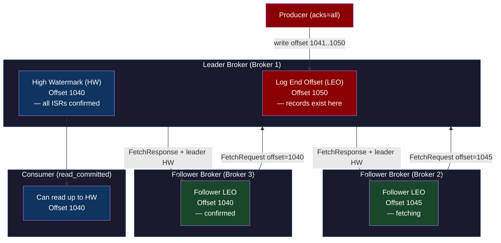
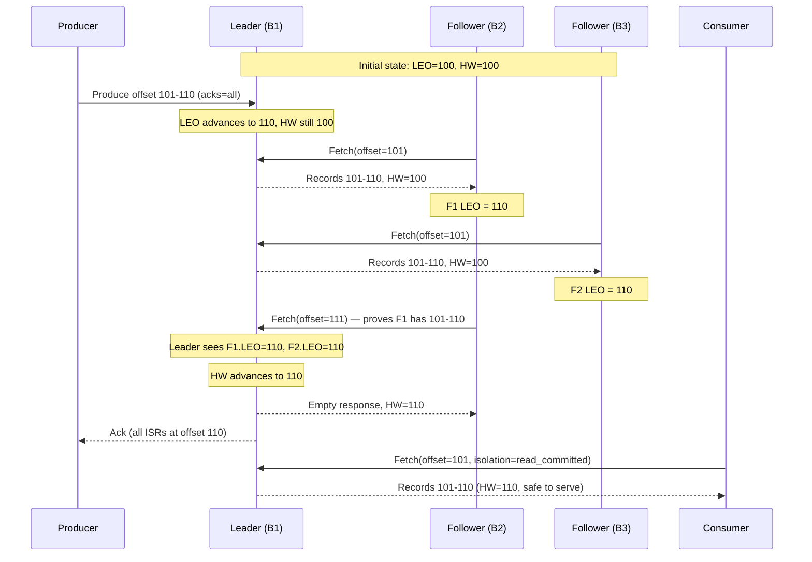
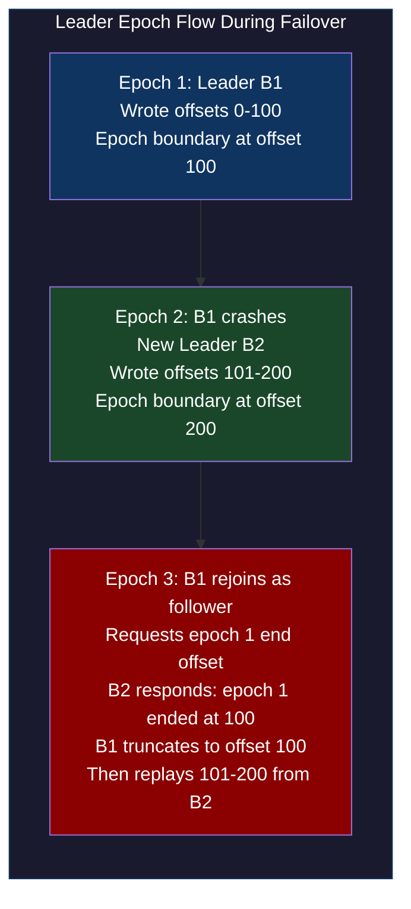

# CH-48: Kafka Internals — The Log as a Universal Data Structure

**Subtitle:** Kafka isn't a message queue. It's a distributed, durable, replicated commit log that happens to have a consumer API.

**Part VII — Hyperscale Data Platforms**

---

## SPARK — Igniting the Problem

### Cold Open

The alert fired at 02:17 UTC on a Tuesday. A LinkedIn SRE named Marcus was paged with a single line: `UnderReplicatedPartitions > 0 for topic user-events, broker 14`. He'd seen this before — a broker restart, a brief lag, replication catches up. He acknowledged the alert and went back to sleep.

At 04:45, the same alert fired again. This time it was 47 partitions across 6 brokers. Marcus pulled up the Kafka metrics dashboard and saw something he hadn't seen before: the high watermark on broker 14 was frozen. Not slowly catching up — frozen. The log end offset was still moving, producers were still writing, but the HW wasn't advancing.

He ran `kafka-topics.sh --describe` and saw the ISR (In-Sync Replicas) list had shrunk from 3 to 1 for all affected partitions. That meant consumers reading with `isolation.level=read_committed` were stuck. They could see the log end offset advancing, but the high watermark wasn't moving, so they couldn't consume anything. An entire downstream pipeline — user activity feeds, recommendation refreshes, notification triggers — had silently stopped processing new events.

The root cause took four hours to find. A rolling restart of brokers the previous afternoon had exposed a bug in how Kafka handled leader epochs during ISR shrink. When broker 14 rejoined as a follower after the restart, it fetched from an offset that was inside the leader's log but after a leader epoch boundary. The leader's epoch check rejected the fetch as stale, the follower fell out of ISR, but the controller didn't properly update the high watermark because it thought the partition was still healthy (the ISR had two replicas, just not broker 14).

The fix involved understanding three intertwined concepts that most engineers treat as black boxes: what exactly the high watermark tracks, how leader epochs protect against log divergence, and why a follower being behind is different from a follower being on a different epoch.

This chapter opens those black boxes. When you finish, an alert saying `UnderReplicatedPartitions > 0` will mean something specific and actionable, not just "Kafka is sad."

The log is the foundation of Kafka's correctness. Everything else — replication, consumer groups, exactly-once semantics — is built on top of a structure so simple it fits in one sentence: an append-only, sequentially-written file, indexed by offset. The elegance is in what you can build once you have that primitive. Understanding that primitive at the storage level changes how you debug, tune, and architect systems on top of Kafka.

---

### Uncomfortable Truth

**The false belief:** Kafka is a message queue that happens to be really fast, and the interesting engineering is in the consumer API and offset management. Once you understand offsets and consumer groups, you understand Kafka.

This belief leads to an entire class of invisible bugs. Engineers configure `acks=all` thinking they've achieved durability, not realizing that "all" means "all ISRs" and ISR is a dynamic set that can shrink to 1 under load. They set `min.insync.replicas=1` in production and wonder why data disappears after a broker failure. They assume `read_committed` isolation will protect them from seeing uncommitted data, not understanding that the high watermark, not the transaction coordinator, is the actual enforcement mechanism.

The real truth is that Kafka's consumer API is the boring part. The interesting engineering lives at the storage layer: how the log segment files are structured on disk, how the sparse offset index makes random reads O(log n) instead of O(n), how the time index enables timestamp-based lookups without full scans, and why sequential writes to a log segment saturate disk I/O bandwidth in a way that random writes to a B-tree never can.

The second uncomfortable truth is about ZooKeeper. Before KRaft (Kafka Raft Metadata mode, KIP-500), every Kafka cluster had an external consistency system it depended on for controller election, broker registration, and topic metadata. Engineers who "understood Kafka" often had no idea what ZooKeeper was doing or what happened when ZooKeeper lost quorum. KRaft moves all of this inside Kafka itself, but understanding why it was external in the first place — and why that was a scaling bottleneck — requires understanding what metadata operations Kafka performs and at what rate.

---

## FORGE — Building the Model

### Mental Model: The Tiered Commit Protocol

Think of a Kafka partition as a **write-ahead log in a database transaction**, replicated across N machines simultaneously.

In a single-machine database, you write to the WAL before you acknowledge the write to the client. The WAL is your crash recovery mechanism — if the process dies before flushing the in-memory buffer to the B-tree, you replay the WAL on restart. The "committed" boundary in the WAL is called the flush LSN (Log Sequence Number).

In Kafka, the same structure exists but across machines. The **log end offset (LEO)** is like the write position in the WAL — where new records land. The **high watermark (HW)** is like the flush LSN — the point below which all ISR replicas have confirmed they have the data. A consumer with `isolation.level=read_committed` can only read up to the HW. A consumer with `isolation.level=read_uncommitted` can read up to the LEO.

This is the **Tiered Commit Protocol** model. There are two visibility boundaries: written (LEO) and committed (HW). Data between them is written but not yet safe to consume for consumers that care about consistency.



The HW advances only when the leader receives fetch requests from followers that prove the followers have caught up. This is a pull-based HW advancement — the leader does not push HW updates to followers, it infers from their fetch offsets that they've received data.



---

## WIRE — Deep Dissection

### Dissection: Storage Engine, Replication, and Exactly-Once

#### Naive Understanding

Most engineers model a Kafka topic as a list of messages. Partitions distribute that list across brokers. Consumers track where they are via offsets. This model is correct but dangerously incomplete for operating Kafka in production.

#### Where It Breaks

The first break point is the storage format. A Kafka partition is not a single file. It's a series of **log segments** — each a pair of files: `00000000000001048576.log` (the actual record data) and `00000000000001048576.index` (a sparse offset-to-byte-position index). When a segment rolls (due to size or time), a new pair is created. The `.log` file is append-only. The `.index` file is a fixed-size sparse index — not every offset has an entry, only one every ~4KB of data.

There is also a `.timeindex` file alongside each segment: a sparse mapping from timestamp to offset. This is what `--time` offset resets use, and it's what makes `auto.offset.reset=earliest` and `latest` work efficiently without scanning the full log.

#### Why It Breaks

The second break point is replication correctness. Engineers know that `acks=all` means the leader waits for all ISR replicas. What they don't know is how the leader decides when all ISRs have received a record.

The answer is: it waits for a follower's **next Fetch request** at an offset higher than the record just written. This is a pull-to-confirm model. The leader cannot directly verify a follower has persisted something — it infers this from the follower's fetch position on the next heartbeat. The `replica.lag.time.max.ms` setting (default 30s) is how long a follower can be silent before the leader evicts it from the ISR.

This creates a subtle availability hazard. If you set `acks=all` and `min.insync.replicas=3` on a 3-replica topic, and one follower becomes slow (not dead, just slow — maybe GC pause), that follower will be evicted from the ISR. Now the ISR has 2 replicas. If another follower then pauses, the ISR has 1 replica, and your `min.insync.replicas=3` will cause all produce requests to fail with `NotEnoughReplicasException`. This is not a broker failure — it's a latency blip cascading into a full produce outage.

#### The Correct Model

**Leader Epochs** are the key to understanding why replication is safe even during leader failovers. Every time a partition gets a new leader, the leader epoch counter increments. Followers tag each record with the epoch of the leader that wrote it. When a follower reconnects after a crash, it sends its last known leader epoch to the new leader. The new leader truncates the follower's log to the last consistent point for that epoch.

This prevents log divergence. Without leader epochs (pre-Kafka 0.11), if leader A wrote offset 101 and crashed before followers acknowledged, and then a new leader B was elected and also wrote to offset 101 (a different message), and then leader A came back as a follower, it would have a conflicting record at offset 101. Leader epochs prevent this by forcing the follower to truncate before replaying.



**Exactly-once semantics** require two additional layers on top of durable replication: the **idempotent producer** and the **transactional API**.

The idempotent producer assigns each producer a `ProducerID` (PID) and a monotonically increasing sequence number per partition. The broker deduplicates records with the same (PID, partition, sequence) tuple. This prevents duplicates from producer retries on network timeouts. It does not prevent duplicates across producer restarts — if the producer process dies and restarts, it gets a new PID.

```go
package main

import (
    "context"
    "fmt"
    "log"
    "time"

    "github.com/twmb/franz-go/pkg/kgo"
)

// ExactlyOnceProducer demonstrates idempotent + transactional production.
// The transactional ID is stable across producer restarts — this is what
// enables exactly-once across process crashes, not just network retries.
func ExactlyOnceProducer(brokers []string, topic string) error {
    client, err := kgo.NewClient(
        kgo.SeedBrokers(brokers...),
        // Idempotent: each message gets a sequence number per partition.
        // Broker deduplicates retries with same (PID, partition, seq).
        kgo.RequiredAcks(kgo.AllISRAcks()),
        // Transactional: enables atomic multi-partition writes.
        // The transactional ID must be stable across restarts.
        // On restart, the new producer with the same TransactionalID
        // will fence the old producer (bump epoch), completing or
        // aborting any in-flight transaction from the crashed instance.
        kgo.TransactionalID("my-app-producer-0"),
        kgo.ProducerBatchMaxBytes(1_000_000),
    )
    if err != nil {
        return fmt.Errorf("create client: %w", err)
    }
    defer client.Close()

    ctx := context.Background()

    // Begin a transaction. All records produced until CommitTransaction
    // or AbortTransaction are part of this atomic unit.
    if err := client.BeginTransaction(); err != nil {
        return fmt.Errorf("begin transaction: %w", err)
    }

    records := []*kgo.Record{
        {Topic: topic, Key: []byte("user-1"), Value: []byte(`{"event":"click","ts":1700000001}`)},
        {Topic: topic, Key: []byte("user-2"), Value: []byte(`{"event":"view","ts":1700000002}`)},
        {Topic: topic, Key: []byte("user-3"), Value: []byte(`{"event":"purchase","ts":1700000003}`)},
    }

    for _, r := range records {
        client.Produce(ctx, r, func(r *kgo.Record, err error) {
            if err != nil {
                log.Printf("produce error offset %d: %v", r.Offset, err)
            }
        })
    }

    // Flush ensures all records are sent to the broker before commit.
    if err := client.Flush(ctx); err != nil {
        _ = client.AbortTransaction(ctx)
        return fmt.Errorf("flush: %w", err)
    }

    // CommitTransaction performs 2-phase commit:
    // Phase 1: Write commit marker to __transaction_state topic
    // Phase 2: Write COMMIT transaction marker to each affected partition
    // Consumers with isolation.level=read_committed will only see
    // records after the COMMIT marker lands on their partition.
    if err := client.EndTransaction(ctx, kgo.TryCommit); err != nil {
        return fmt.Errorf("commit transaction: %w", err)
    }

    fmt.Println("Transaction committed successfully")
    return nil
}

// ExactlyOnceConsumer reads only committed transactional records.
// It skips all records that are part of an aborted transaction,
// even though those records are physically present in the log segment.
func ExactlyOnceConsumer(brokers []string, topic string, groupID string) error {
    client, err := kgo.NewClient(
        kgo.SeedBrokers(brokers...),
        kgo.ConsumerGroup(groupID),
        kgo.ConsumeTopics(topic),
        // read_committed: skip records between BEGIN and ABORT markers.
        // The consumer will not advance past the Last Stable Offset (LSO),
        // which is the offset of the earliest open transaction.
        // This means a long-running transaction blocks ALL consumers
        // on that partition, not just transactional consumers.
        kgo.FetchIsolationLevel(kgo.ReadCommitted()),
    )
    if err != nil {
        return fmt.Errorf("create consumer: %w", err)
    }
    defer client.Close()

    ctx, cancel := context.WithTimeout(context.Background(), 30*time.Second)
    defer cancel()

    for {
        fetches := client.PollFetches(ctx)
        if fetches.IsClientClosed() || ctx.Err() != nil {
            break
        }

        fetches.EachError(func(t string, p int32, err error) {
            log.Printf("fetch error topic=%s partition=%d: %v", t, p, err)
        })

        fetches.EachRecord(func(r *kgo.Record) {
            fmt.Printf("offset=%d key=%s value=%s\n", r.Offset, r.Key, r.Value)
        })

        if err := client.CommitUncommittedOffsets(ctx); err != nil {
            log.Printf("commit offsets: %v", err)
        }
    }

    return nil
}
```

**Why Kafka is fast** comes down to three architectural decisions that compound:

First, **sequential writes**. A log segment is appended to. The OS page cache is extraordinarily efficient at sequential I/O — it can read-ahead and write-back large contiguous ranges, saturating the disk's sequential bandwidth. A 7200 RPM spinning disk does ~3ms random I/O but ~200MB/s sequential. Kafka exploits the sequential case entirely.

Second, **zero-copy with `sendfile()`**. When a consumer fetches data, the normal path is: read from disk into kernel buffer → copy to user-space buffer → copy to socket send buffer. Kafka uses `sendfile()` (or `FileChannel.transferTo()` in Java) to go directly from the kernel page cache to the socket buffer, skipping the user-space copy. This halves CPU overhead for large read throughput.

Third, **batch compression**. Producers batch multiple records into a single `RecordBatch`. The batch is compressed as a unit. Compression ratios on JSON event data routinely hit 8:1 with LZ4 or Snappy. Network bandwidth and disk I/O both benefit from the same batch.

```mermaid
graph TD
    subgraph NormalPath["Normal Read Path (no sendfile)"]
        style NormalPath fill:#1a1a2e,color:#fff,stroke:#8b0000
        D1["Disk"] -->|"read()"| KB1["Kernel Buffer"]
        KB1 -->|"copy to user space"| UB1["User Buffer (JVM heap)"]
        UB1 -->|"write()"| SKB1["Socket Send Buffer"]
        SKB1 --> N1["Network"]
        style D1 fill:#8b0000,color:#fff
        style KB1 fill:#0f3460,color:#fff
        style UB1 fill:#8b0000,color:#fff
        style SKB1 fill:#0f3460,color:#fff
    end

    subgraph ZeroCopy["Zero-Copy Path (sendfile)"]
        style ZeroCopy fill:#1a1a2e,color:#fff,stroke:#1a472a
        D2["Disk (page cache)"] -->|"sendfile()"| SKB2["Socket Send Buffer"]
        SKB2 --> N2["Network"]
        style D2 fill:#1a472a,color:#fff
        style SKB2 fill:#0f3460,color:#fff
    end
```



**Tradeoffs of the log-first architecture:**

The log is durable by design, but it's also sequential. You cannot delete a specific record from the middle of a log segment — compaction marks records as deleted (tombstones) and a background compaction process rewrites segments, but this is expensive and eventually consistent. Kafka is not a random-access store.

Consumer group rebalancing is the most operationally painful aspect of Kafka. Every time a consumer joins or leaves a group, the group coordinator triggers a rebalance. During a rebalance, all consumers in the group stop processing (stop-the-world for the group). The new **incremental cooperative rebalancing** (KAFKA-8243) assigns only the partitions that need to move, but requires consumers to use the `CooperativeStickyAssignor` and many production deployments still use the default eager `RangeAssignor`.

---

## War Room

### Incident: LinkedIn Under-Replicated Partition Cascade

```mermaid
gantt
    title LinkedIn Kafka Incident — 2019-11-12 UTC
    dateFormat HH:mm
    axisFormat %H:%M

    section Normal Operations
    All brokers healthy, ISR=3 all partitions :done, 00:00, 02:17

    section Alert Phase
    UnderReplicatedPartitions alert fires (broker 14) :crit, alert1, 02:17, 02:45
    SRE acknowledges, assumes transient :done, 02:45, 04:45
    Second alert — 47 partitions, 6 brokers :crit, alert2, 04:45, 05:00

    section Investigation
    HW frozen on broker 14 confirmed :active, inv1, 05:00, 06:00
    Downstream pipeline consumption halted :crit, inv2, 05:00, 09:00
    Rolling restart linked to epoch boundary bug :active, inv3, 06:00, 07:30
    Leader epoch fetch rejection confirmed :active, inv4, 07:30, 09:00

    section Mitigation
    Force leader election on affected partitions :crit, mit1, 09:00, 09:30
    Broker 14 removed from cluster temporarily :active, mit2, 09:30, 10:00
    ISR rebuilt — all partitions back to ISR=3 :done, mit3, 10:00, 11:00

    section Recovery
    HW unfreezes across all partitions :done, rec1, 11:00, 11:30
    Downstream pipeline resumes :done, rec2, 11:30, 12:00
    Post-incident patch deployed :done, rec3, 12:00, 14:17
```



The incident was triggered by a rolling restart of brokers during a maintenance window. The restart sequence exposed an edge case in Kafka's leader epoch handling: when broker 14 came back online as a follower, it sent a `LeaderEpochRequest` to determine how far to truncate its log. The leader responded with an epoch end offset, but due to an off-by-one in the epoch boundary calculation (fixed in KAFKA-7703), the follower's truncation point was one offset too conservative.

The follower then sent a `FetchRequest` starting at an offset the leader considered already past an epoch boundary, causing the leader to reject the fetch as a stale-epoch request. The follower kept retrying. Each retry was rejected. The `replica.lag.time.max.ms` timer expired, and the leader removed the follower from the ISR.

The subtle failure mode: when the controller received the ISR shrink notification, it updated the partition metadata. But the high watermark advancement logic on the leader checked the old ISR state (cached for performance). The HW calculation used the old ISR, which still included broker 14. Since broker 14's LEO was never advancing (it was blocked on the epoch rejection loop), the HW couldn't advance past the point where broker 14 had stalled. The consumer-visible HW froze.

The mitigation required a forced leader election (`kafka-leader-election.sh --election-type PREFERRED`) on the affected partitions, which forced a new leader epoch. The new leader's ISR state was clean — it didn't include broker 14 — so the HW advancement logic worked correctly on the fresh state. Broker 14 was gracefully decommissioned, patched, and rejoined the cluster.

The post-incident fix added an explicit ISR state refresh in the HW advancement path, ensuring that a stale ISR cache never causes HW freezes. The check was added to the `Partition.maybeShrinkIsr()` code path in the Kafka controller.

---

## Lab

### Exactly-Once Semantics: Idempotent Producer + Transactional Consumer

**Prerequisites:** Docker, Go 1.21+

```bash
# Start Kafka with KRaft (no ZooKeeper)
docker run -d \
  --name kafka-lab \
  -p 9092:9092 \
  -e KAFKA_NODE_ID=1 \
  -e KAFKA_PROCESS_ROLES=broker,controller \
  -e KAFKA_LISTENERS=PLAINTEXT://0.0.0.0:9092,CONTROLLER://0.0.0.0:9093 \
  -e KAFKA_ADVERTISED_LISTENERS=PLAINTEXT://localhost:9092 \
  -e KAFKA_CONTROLLER_QUORUM_VOTERS=1@localhost:9093 \
  -e KAFKA_CONTROLLER_LISTENER_NAMES=CONTROLLER \
  -e KAFKA_OFFSETS_TOPIC_REPLICATION_FACTOR=1 \
  -e KAFKA_TRANSACTION_STATE_LOG_REPLICATION_FACTOR=1 \
  -e KAFKA_TRANSACTION_STATE_LOG_MIN_ISR=1 \
  apache/kafka:3.7.0

# Create the topic
docker exec kafka-lab /opt/kafka/bin/kafka-topics.sh \
  --bootstrap-server localhost:9092 \
  --create \
  --topic exactly-once-demo \
  --partitions 3 \
  --replication-factor 1
```

```go
// main.go — run with: go run main.go
package main

import (
    "context"
    "fmt"
    "log"
    "os"
    "os/signal"
    "syscall"
    "time"

    "github.com/twmb/franz-go/pkg/kgo"
)

const (
    broker = "localhost:9092"
    topic  = "exactly-once-demo"
)

func produce() {
    client, err := kgo.NewClient(
        kgo.SeedBrokers(broker),
        kgo.RequiredAcks(kgo.AllISRAcks()),
        kgo.TransactionalID("demo-producer-1"),
    )
    if err != nil {
        log.Fatalf("producer init: %v", err)
    }
    defer client.Close()

    ctx := context.Background()

    for batch := 0; batch < 3; batch++ {
        if err := client.BeginTransaction(); err != nil {
            log.Fatalf("begin tx: %v", err)
        }

        for i := 0; i < 5; i++ {
            r := &kgo.Record{
                Topic: topic,
                Key:   []byte(fmt.Sprintf("key-%d", batch*5+i)),
                Value: []byte(fmt.Sprintf(`{"batch":%d,"seq":%d,"ts":%d}`,
                    batch, i, time.Now().UnixMilli())),
            }
            client.Produce(ctx, r, nil)
        }

        if err := client.Flush(ctx); err != nil {
            _ = client.AbortTransaction(ctx)
            log.Printf("flush failed, aborted batch %d: %v", batch, err)
            continue
        }

        if err := client.EndTransaction(ctx, kgo.TryCommit); err != nil {
            log.Printf("commit failed batch %d: %v", batch, err)
        } else {
            fmt.Printf("Committed batch %d (5 records)\n", batch)
        }

        time.Sleep(500 * time.Millisecond)
    }
}

func consume() {
    client, err := kgo.NewClient(
        kgo.SeedBrokers(broker),
        kgo.ConsumerGroup("exactly-once-consumer-1"),
        kgo.ConsumeTopics(topic),
        kgo.FetchIsolationLevel(kgo.ReadCommitted()),
        kgo.ConsumeResetOffset(kgo.NewOffset().AtStart()),
    )
    if err != nil {
        log.Fatalf("consumer init: %v", err)
    }
    defer client.Close()

    ctx, cancel := context.WithTimeout(context.Background(), 15*time.Second)
    defer cancel()

    total := 0
    for {
        fetches := client.PollFetches(ctx)
        if fetches.IsClientClosed() || ctx.Err() != nil {
            break
        }
        fetches.EachRecord(func(r *kgo.Record) {
            fmt.Printf("  READ offset=%-4d partition=%d value=%s\n",
                r.Offset, r.Partition, r.Value)
            total++
        })
    }
    fmt.Printf("\nTotal records consumed (read_committed): %d\n", total)
}

func main() {
    sig := make(chan os.Signal, 1)
    signal.Notify(sig, syscall.SIGINT, syscall.SIGTERM)

    go func() {
        fmt.Println("=== Producer: sending 3 transactional batches ===")
        produce()
        fmt.Println("=== Producer done ===")
    }()

    time.Sleep(2 * time.Second)
    fmt.Println("=== Consumer: reading with read_committed isolation ===")
    consume()
}
```

**Expected output:**

```
=== Producer: sending 3 transactional batches ===
Committed batch 0 (5 records)
Committed batch 1 (5 records)
Committed batch 2 (5 records)
=== Producer done ===
=== Consumer: reading with read_committed isolation ===
  READ offset=0    partition=1 value={"batch":0,"seq":0,"ts":1700000001}
  READ offset=1    partition=2 value={"batch":0,"seq":1,"ts":1700000001}
  READ offset=0    partition=0 value={"batch":0,"seq":2,"ts":1700000001}
  ... (15 records total, no duplicates, no partial batches)

Total records consumed (read_committed): 15
```

Key observations from the lab: the consumer only sees complete batches (all 5 records per transaction), never partial batches. If you kill the producer mid-transaction and restart it with the same `TransactionalID`, the new producer instance will fence the old producer's epoch, complete or abort the in-flight transaction, and start fresh. The `read_committed` consumer will never see the partial batch from the killed producer.

---

## Loose Thread

The log gives Kafka its correctness. But Kafka's implementation comes with a cost: the JVM. Garbage collection pauses, a ZooKeeper dependency (pre-KRaft), and thread-pool-based I/O all contribute to tail latency variance that shows up at the p99 and p999 percentiles — the ones that matter for latency-sensitive pipelines. You accept 20ms p99 as the price of JVM-based simplicity.

Redpanda asked a different question: what if you rebuilt the same semantics in C++, replaced ZooKeeper with Raft per partition, and used a thread-per-core model with a custom memory allocator? The answer in the next chapter is 2ms p99 — 10× lower — with no GC and no separate coordination service. The tradeoff is a less mature ecosystem and a more complex upgrade path. Whether that tradeoff is worth it depends on how much you care about that tail latency distribution, and the answer is almost always "more than you think" until a slow consumer triggers a cascade.
