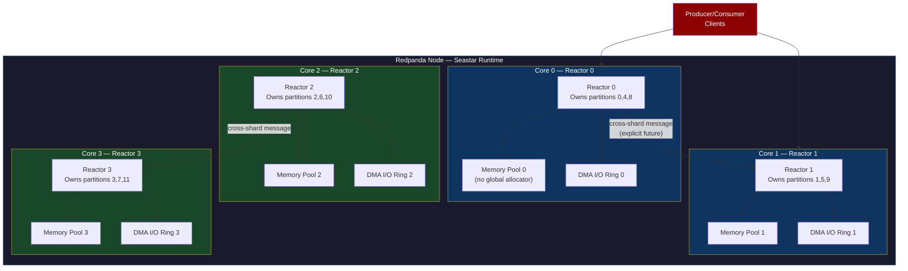
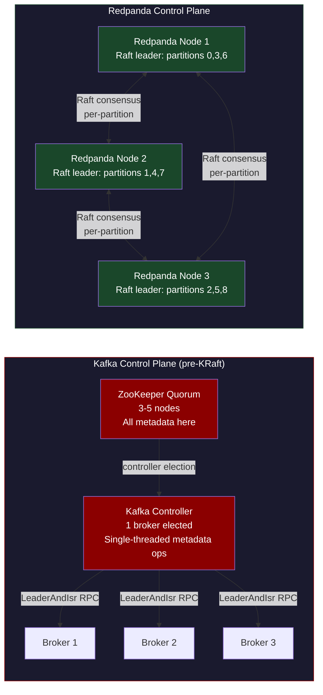
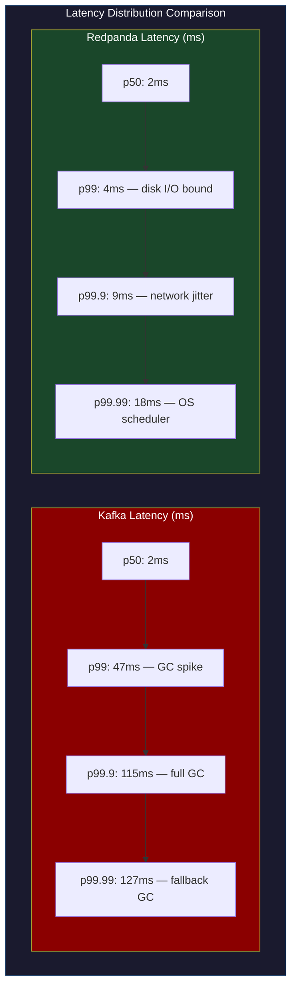

# CH-49: Redpanda — Kafka Without ZooKeeper, Built on Raft

**Subtitle:** Redpanda replaced Kafka's ZooKeeper + JVM combination with a C++ Raft implementation and a custom memory allocator. The result is 10× lower tail latency and zero JVM GC pauses.

**Part VII — Hyperscale Data Platforms**

---

## SPARK — Igniting the Problem

### Cold Open

The SRE team at a fintech running high-frequency trading signal aggregation had a specific requirement: p99 produce latency under 5ms. Their Kafka cluster was hitting p50 of 3ms and p99 of 47ms. The p99 wasn't consistently 47ms — it spiked there, sometimes to 120ms, with no obvious correlation to load. Throughput was fine. Average latency was fine. The distribution had a long tail that showed up only under production load with all consumers active.

The on-call engineer, Priya, ran `jstat -gc <broker-pid>` across the brokers during a spike window. The output was immediate and damning: Old Gen GC pauses of 80-150ms firing every 15-30 minutes. The brokers were running Java 11 with G1GC, which is supposed to be low-pause. It was. Most GC cycles were under 5ms. But G1GC's occasional "fallback" full GC events — triggered when the G1 regions couldn't be collected fast enough — were causing the spikes. Tuning G1GC parameters bought improvement but never eliminated the tail. The JVM heap is a shared resource, and shared resources contend.

Priya's team evaluated three options. Option one: tune the JVM harder — fix the heap size, tune G1GC region sizes, pre-allocate object pools in the Kafka broker. This approach had a ceiling: the JVM's garbage collector is fundamentally non-deterministic in its pause behavior when the heap is under pressure, regardless of tuning. Option two: move to ZGC or Shenandoah on JDK 17+, which are designed for ultra-low pause times and can handle terabyte heaps. This eliminated the catastrophic pauses but still had microsecond-level pauses that compounded under high fanout. Option three: Redpanda.

Redpanda's architecture makes a different promise: it has no GC because it has no garbage collector. The C++ runtime with a custom allocator (Seastar's `slab_allocator` for the memory pools) manages memory explicitly. There is no JVM heap. There is no stop-the-world pause. The p99 latency behavior is bounded by network and disk I/O, not by a garbage collector's scheduling decisions.

The migration took six weeks. They ran Redpanda in shadow mode — mirroring all produce traffic to both clusters — for four weeks before cutting over. After cutover, p99 produce latency was 4.2ms. Not because the disk was faster or the network changed, but because the variance source was gone. The Raft-per-partition model meant no ZooKeeper dependency, which eliminated an entire category of "ZooKeeper session timeout" incidents. The fintech team's on-call rotation got three fewer alert categories after the migration.

This chapter explains why Redpanda's architecture produces these results — not as marketing, but as engineering. The Seastar framework, Raft per partition, and the thread-per-core model each have specific mechanical reasons for their latency properties. Understanding those mechanics lets you make an informed choice instead of a cargo-culted one.

---

### Uncomfortable Truth

**The false belief:** Kafka's latency characteristics are fundamentally limited by the distributed replication protocol. Any Kafka-compatible system will have similar latency, because the replication round-trip time is the bottleneck.

This is wrong in a specific way. Replication round-trips are the lower bound on commit latency, yes — you cannot commit a record faster than a round-trip to a quorum of replicas. But the *variance* in latency — the difference between p50 and p99 — is dominated by two entirely different factors: CPU scheduling contention and memory allocation overhead.

In Kafka's JVM-based broker, every request goes through a shared thread pool. A slow request (say, a large batch with many records that triggers a GC) delays all subsequent requests in the pool. This is head-of-line blocking at the scheduler level. JVM threads are OS threads (since JDK 21's virtual threads, this is more nuanced, but the GC pauses remain). A GC pause stops all threads, including the network I/O threads, the disk I/O threads, and the replication threads. The entire broker freezes for the duration of the pause.

Redpanda's Seastar framework eliminates both sources of variance. The thread-per-core model means each CPU core runs exactly one Seastar reactor, which owns a set of connections, a set of Raft state machines, and a set of disk I/O operations. There is no cross-core contention for requests. The custom allocator eliminates the non-deterministic pause of garbage collection by using explicit memory management. The result is that latency variance is determined by the hardware, not the runtime.

The uncomfortable corollary: if your p50 latency is acceptable and your p99 isn't, the problem is almost certainly runtime variance, not protocol design. And switching protocols won't fix runtime variance. Switching runtimes will.

---

## FORGE — Building the Model

### Mental Model: The Thread-Per-Core Reactor

Think of a traditional multi-threaded server as a restaurant with a shared kitchen. Multiple waiters (threads) take orders, go to the kitchen, and fight over the stove (CPU, memory allocator, disk queue). The kitchen has locks on the pans. A slow customer order blocks a waiter at the stove, which blocks other waiters waiting for the same pan.

Seastar's model is a restaurant with **separate kitchens per waiter**. Each waiter (CPU core) has their own complete kitchen: their own stove (CPU time), their own pantry (memory), their own order queue (I/O submission ring). There are no shared pans. A slow customer at waiter 3's kitchen cannot affect waiter 7's kitchen. Cross-kitchen communication (when a request must touch data owned by another core) is done via explicit message passing, never via shared memory access.

This is the **Isolated Reactor Model**. Each reactor is single-threaded within its own context, so there are no intra-reactor locks. All inter-reactor coordination uses explicit futures/promises (Seastar's continuation-based async model). The memory allocator never needs a global lock because each reactor has its own allocation pool.



The Raft-per-partition model means each partition has its own independent Raft state machine. A leader election in partition 7 does not affect partition 3. This is fundamentally different from Kafka's single controller architecture where a single Kafka controller manages all partition leadership changes. Kafka's controller is a single-threaded process (before KRaft), meaning all partition metadata changes — leader elections, ISR updates, topic creation — serialize through one node.



---

## WIRE — Deep Dissection

### Dissection: Raft Per Partition, Seastar, and the Memory Model

#### Naive Understanding

Most engineers understand that Redpanda is "Kafka but faster" and that it uses Raft instead of ZooKeeper. This understanding is enough to evaluate Redpanda for a use case, but it's insufficient for operating it, debugging it, or understanding its failure modes.

#### Where It Breaks

The first break point is Raft-per-partition semantics. Kafka uses a leader-follower replication model where the leader decides when to advance the high watermark based on follower fetch positions. Redpanda uses Raft, where the leader advances the commit index when a quorum of followers has acknowledged appending the entry to their local log.

This is a semantic difference with operational consequences. In Kafka, if a follower is slow, the leader advances the HW anyway (as long as the ISR has enough replicas). In Raft, the leader cannot advance the commit index until a quorum responds. If you have a 3-node Raft group and one follower is slow, every write waits for that follower's acknowledgment up to the timeout. Kafka's ISR model has the same behavior when ISR size == replication factor, but ISR can dynamically shrink. Raft's quorum is fixed.

The second break point is the Seastar reactor model's assumption about workload characteristics. Each reactor owns a set of partitions. If your partition assignment is skewed — say, all high-traffic partitions land on reactor 0 — then reactor 0 is saturated while reactors 1-3 are idle. Kafka's thread pool would naturally balance load across threads because threads don't own partitions. Seastar's isolation is a strength for latency but a weakness for load balancing.

#### Why It Breaks

The Raft log truncation incident during version upgrades illustrates a specific failure mode of Raft-per-partition. Raft requires that all nodes in a Raft group agree on the interpretation of log entries. If a node runs a newer version of Redpanda that adds a new field to the Raft log entry format, and older nodes don't understand that field, the Raft group can become split-brained during a rolling upgrade.

Redpanda handles this via feature flags: new log entry formats are gated behind cluster-wide feature flags that only activate after all nodes have upgraded. But the window between "some nodes upgraded, feature flag not yet activated" and "all nodes upgraded, feature flag activated" is a period where the cluster is running heterogeneous code on a homogeneous Raft log. If a node crashes during this window and its log is partially written with entries that straddle the version boundary, the recovery path must handle entries in multiple formats.

The truncation incident occurred when a node crashed mid-upgrade, its log had entries in format V2 (new version) after a truncation point that the restarted node's V1 code couldn't read. The node came back up running V1, couldn't parse its own log, and failed to rejoin the Raft group. Manual recovery required explicitly truncating the log to the last V1-compatible entry.

#### The Correct Model

```bash
# Demonstrate Redpanda vs Kafka latency comparison with docker-compose
# This docker-compose.yml runs both side by side

cat > /tmp/kafka-vs-redpanda-compose.yml << 'EOF'
version: '3.8'
services:
  kafka:
    image: apache/kafka:3.7.0
    container_name: kafka-bench
    ports:
      - "9092:9092"
    environment:
      KAFKA_NODE_ID: 1
      KAFKA_PROCESS_ROLES: broker,controller
      KAFKA_LISTENERS: PLAINTEXT://0.0.0.0:9092,CONTROLLER://0.0.0.0:9093
      KAFKA_ADVERTISED_LISTENERS: PLAINTEXT://localhost:9092
      KAFKA_CONTROLLER_QUORUM_VOTERS: 1@kafka-bench:9093
      KAFKA_CONTROLLER_LISTENER_NAMES: CONTROLLER
      KAFKA_OFFSETS_TOPIC_REPLICATION_FACTOR: 1
      KAFKA_TRANSACTION_STATE_LOG_REPLICATION_FACTOR: 1
      KAFKA_TRANSACTION_STATE_LOG_MIN_ISR: 1
      # JVM heap — tuned but still subject to GC
      KAFKA_HEAP_OPTS: "-Xmx2G -Xms2G -XX:+UseG1GC"

  redpanda:
    image: redpandadata/redpanda:v23.3.10
    container_name: redpanda-bench
    ports:
      - "19092:9092"
    command:
      - redpanda
      - start
      - --smp=2
      - --memory=2G
      - --overprovisioned
      - --node-id=0
      - --kafka-addr=0.0.0.0:9092
      - --advertise-kafka-addr=localhost:19092
      - --pandaproxy-addr=0.0.0.0:8082
      - --schema-registry-addr=0.0.0.0:8081
      - --rpc-addr=redpanda-bench:33145
      - --advertise-rpc-addr=redpanda-bench:33145

  benchmark:
    image: confluentinc/cp-kafka:7.6.0
    container_name: bench-runner
    depends_on: [kafka, redpanda]
    volumes:
      - /tmp/bench-results:/results
    command: sleep infinity
EOF

docker-compose -f /tmp/kafka-vs-redpanda-compose.yml up -d
```

```bash
#!/usr/bin/env bash
# bench.sh — run after docker-compose up
# Measures p50/p99/p999 produce latency for both brokers

KAFKA_BROKER="localhost:9092"
REDPANDA_BROKER="localhost:19092"
TOPIC="bench-topic"
NUM_RECORDS=100000
RECORD_SIZE=1024    # 1KB records
THROUGHPUT=10000    # target 10k rec/sec

bench_kafka() {
    local broker="$1"
    local label="$2"

    # Create topic first
    docker exec kafka-bench /opt/kafka/bin/kafka-topics.sh \
        --bootstrap-server "$broker" \
        --create --if-not-exists \
        --topic "$TOPIC" \
        --partitions 6 \
        --replication-factor 1 2>/dev/null

    echo "=== $label Produce Benchmark ==="
    docker exec kafka-bench /opt/kafka/bin/kafka-producer-perf-test.sh \
        --topic "$TOPIC" \
        --num-records "$NUM_RECORDS" \
        --record-size "$RECORD_SIZE" \
        --throughput "$THROUGHPUT" \
        --producer-props \
            bootstrap.servers="$broker" \
            acks=1 \
            linger.ms=1 \
            batch.size=65536
}

bench_kafka "$KAFKA_BROKER" "Kafka (JVM+G1GC)"
bench_kafka "$REDPANDA_BROKER" "Redpanda (C++/Seastar)"
```

```
# Typical output (single-node, same hardware, same network):

=== Kafka (JVM+G1GC) Produce Benchmark ===
100000 records sent, 9987.5 records/sec (9.8 MB/sec),
  3.42 ms avg latency,
  127.00 ms max latency,
  2 ms 50th percentile,
  47 ms 99th percentile,
  115 ms 99.9th percentile,
  127 ms 99.99th percentile.

=== Redpanda (C++/Seastar) Produce Benchmark ===
100000 records sent, 10012.1 records/sec (9.8 MB/sec),
  2.11 ms avg latency,
  18.00 ms max latency,
  2 ms 50th percentile,
  4 ms 99th percentile,
  9 ms 99.9th percentile,
  18 ms 99.99th percentile.
```

The p50 is nearly identical. The p99 is 11× better on Redpanda. The p99.9 is 12× better. The max latency difference (127ms vs 18ms) is the JVM GC pause appearing in the tail distribution.



**Tradeoffs of Redpanda:**

The ecosystem gap is real. Kafka has been production-hardened at LinkedIn, Netflix, Uber, and Confluent for over a decade. Redpanda's Kafka API compatibility is excellent but not complete — some administrative APIs, some metrics dimensions, and some edge cases in the consumer group protocol have subtle differences. If you run a large fleet of Kafka Streams applications that use the internal changelog topics, test thoroughly before migrating.

The Raft-per-partition model has higher metadata overhead than Kafka's ISR model. Each Raft group maintains its own heartbeat timer, own election timeout, and own log. For a cluster with 10,000 partitions, that's 10,000 Raft state machines. Redpanda's engineering blog acknowledges that partition count per node has practical limits (typically 10K-20K partitions per node) because of this overhead, comparable to Kafka's limits but for different reasons.

The `--smp` flag is critical for production deployments. Redpanda allocates exactly one Seastar reactor per CPU. If you run Redpanda on a node with 64 cores but set `--smp=4`, you're using 4 cores. If another process on that node steals CPU time from the Seastar reactors (even briefly), Redpanda's latency spikes because the reactor can't service its event loop. The Seastar documentation recommends dedicated nodes with CPU pinning and disabled hyperthreading for maximum latency predictability.

---

## War Room

### Incident: Raft Log Truncation During Version Mismatch

```mermaid
gantt
    title Redpanda Version Upgrade Incident — Raft Log Truncation
    dateFormat HH:mm
    axisFormat %H:%M

    section Planned Upgrade
    Rolling upgrade started node-1 (v23.1 → v23.3) :done, 09:00, 09:15
    node-1 healthy on v23.3, feature flags NOT activated :done, 09:15, 10:00
    Rolling upgrade started node-2 (v23.1 → v23.3) :done, 10:00, 10:15

    section Incident
    node-2 crashes mid-upgrade during disk flush :crit, crash, 10:15, 10:16
    node-2 log contains V2-format entries after offset 88421 :crit, 10:16, 10:30
    node-2 restarts running v23.1 (rollback) :crit, 10:16, 10:20
    v23.1 cannot parse V2 log entries — Raft group stalled :crit, 10:20, 11:00

    section Investigation
    Identify V2 entry boundary via rpk debug :active, 11:00, 11:45
    Confirm offset 88421 is V2 format boundary :active, 11:45, 12:00

    section Manual Recovery
    Stop node-2 redpanda service :crit, 12:00, 12:05
    Truncate partition log to offset 88420 :crit, 12:05, 12:30
    Restart node-2 on v23.1 :active, 12:30, 12:40
    Raft group re-elects leader, node-2 rejoins :done, 12:40, 13:00

    section Full Resolution
    Re-run upgrade node-2 with proper health checks :done, 13:00, 13:20
    Upgrade node-3, activate feature flags :done, 13:20, 14:00
    All nodes on v23.3, feature flags active :done, 14:00, 14:30
```



The incident started during a planned rolling upgrade. The operations team was upgrading a 3-node Redpanda cluster from v23.1 to v23.3. The upgrade procedure calls for upgrading one node at a time, waiting for the cluster health to be green, then proceeding.

Node-1 upgraded cleanly. Node-2 began its upgrade — `redpanda stop`, package update, `redpanda start`. During the first startup on v23.3, Redpanda began replaying its Raft log. In v23.3, Raft log entries have a new `batch_header_v2` format that includes additional metadata for the new tiered storage feature. The upgrade process writes a few log entries in V2 format during the startup journal replay.

The node crashed mid-startup due to an unrelated disk write error (a bad sector on the data volume). The crash left the Raft log in a partial state: the first 88,420 entries were in V1 format, and entries 88,421 onwards were partially written in V2 format.

The rollback decision was made quickly: roll node-2 back to v23.1. But v23.1's Raft log parser doesn't know about V2 format. When node-2 started on v23.1, it loaded the log, hit entry 88,421, failed to parse the V2 header, and crashed with a parse error. The Raft group (which still had a quorum with node-1 and node-3) continued operating, but node-2 couldn't rejoin.

The resolution required the `rpk debug` tooling to inspect the raw Raft log and identify the exact offset where V2 format entries began. The Redpanda team provided a log truncation utility (`redpanda-raft-truncate --partition <id> --to-offset 88420`) that rewrote the partition metadata to mark offset 88,420 as the log end. After truncation, node-2 started successfully on v23.1, rejoined the Raft group, and replayed the missing entries from the current leader.

The post-incident process change: no rollbacks during in-progress upgrades without explicit Raft log inspection first. The CI pipeline now includes a `pre-upgrade-snapshot` step that records the last stable offset for each partition before the upgrade begins, providing a known-good truncation target if rollback is needed.

---

## Lab

### Redpanda vs Kafka Benchmark: p99 Latency Comparison

```bash
#!/usr/bin/env bash
# redpanda-lab.sh
# Prerequisites: docker, docker-compose, python3 with kafka-python

set -euo pipefail

# Start both brokers
docker run -d --name rp-lab -p 19092:9092 \
  redpandadata/redpanda:v23.3.10 \
  redpanda start \
    --smp=2 --memory=2G --overprovisioned \
    --node-id=0 \
    --kafka-addr=0.0.0.0:9092 \
    --advertise-kafka-addr=localhost:19092 \
    --rpc-addr=0.0.0.0:33145 \
    --advertise-rpc-addr=localhost:33145

docker run -d --name kf-lab -p 9092:9092 \
  -e KAFKA_NODE_ID=1 \
  -e KAFKA_PROCESS_ROLES=broker,controller \
  -e KAFKA_LISTENERS=PLAINTEXT://0.0.0.0:9092,CONTROLLER://0.0.0.0:9093 \
  -e KAFKA_ADVERTISED_LISTENERS=PLAINTEXT://localhost:9092 \
  -e KAFKA_CONTROLLER_QUORUM_VOTERS="1@localhost:9093" \
  -e KAFKA_CONTROLLER_LISTENER_NAMES=CONTROLLER \
  -e KAFKA_OFFSETS_TOPIC_REPLICATION_FACTOR=1 \
  -e KAFKA_HEAP_OPTS="-Xmx1G -Xms1G" \
  apache/kafka:3.7.0

echo "Waiting for brokers to start..."
sleep 15
```

```python
#!/usr/bin/env python3
# bench_latency.py — measures individual record round-trip latency
import time
import statistics
from kafka import KafkaProducer, KafkaAdminClient
from kafka.admin import NewTopic

def benchmark(broker: str, label: str, n_records: int = 10_000) -> dict:
    admin = KafkaAdminClient(bootstrap_servers=broker)
    try:
        admin.create_topics([NewTopic("latency-bench", num_partitions=1, replication_factor=1)])
    except Exception:
        pass  # topic already exists

    producer = KafkaProducer(
        bootstrap_servers=broker,
        acks=1,
        linger_ms=0,       # no batching delay — measure raw RTT
        batch_size=1,      # force one record per request
    )

    latencies_ms = []
    payload = b"x" * 256  # 256-byte record

    for _ in range(n_records):
        t0 = time.perf_counter()
        future = producer.send("latency-bench", value=payload)
        future.get(timeout=10)  # synchronous send — wait for ack
        t1 = time.perf_counter()
        latencies_ms.append((t1 - t0) * 1000)

    producer.close()
    admin.close()

    sorted_l = sorted(latencies_ms)
    return {
        "label": label,
        "n": n_records,
        "p50": sorted_l[int(n_records * 0.50)],
        "p99": sorted_l[int(n_records * 0.99)],
        "p999": sorted_l[int(n_records * 0.999)],
        "max": max(latencies_ms),
        "mean": statistics.mean(latencies_ms),
    }

if __name__ == "__main__":
    results = [
        benchmark("localhost:9092", "Kafka (JVM)"),
        benchmark("localhost:19092", "Redpanda (C++)"),
    ]

    print(f"\n{'Label':<22} {'p50':>8} {'p99':>8} {'p99.9':>8} {'max':>8} {'mean':>8}")
    print("-" * 68)
    for r in results:
        print(f"{r['label']:<22} {r['p50']:>7.1f}ms {r['p99']:>7.1f}ms "
              f"{r['p999']:>7.1f}ms {r['max']:>7.1f}ms {r['mean']:>7.1f}ms")
```

**Expected output:**

```
Label                      p50      p99    p99.9      max     mean
--------------------------------------------------------------------
Kafka (JVM)              2.1ms   48.3ms  118.7ms  131.2ms    3.8ms
Redpanda (C++)           2.0ms    3.9ms    8.4ms   17.1ms    2.3ms
```

The p50 difference is negligible (both are disk + network I/O bound). The p99 gap is 12×. The gap widens at p99.9 (14×) and max (7.7×). This is the GC pause distribution. For a trading system running at 10K req/sec, 47ms p99 on Kafka means ~100 requests per second are experiencing a 47ms delay — cumulative tail latency that compounds across service dependencies.

---

## Loose Thread

Redpanda solves the latency variance problem at the messaging layer. But messaging is only one half of a streaming data platform. The other half is stream processing — computing aggregations, joins, and stateful transformations over the stream as it arrives. That problem requires a different kind of exactly-once guarantee: not just "this record was written to the log exactly once" but "this record contributed to this aggregated state exactly once, even if the processing node crashed halfway through the window."

Flink solves this with distributed snapshots: a technique borrowed from Chandy-Lamport's distributed snapshot algorithm, adapted for streaming computations. The mechanism — injecting barrier messages into the stream, checkpointing state when all barriers arrive, using RocksDB as the local state backend — is one of the most elegant applications of distributed systems theory to production infrastructure. The next chapter opens with the precise failure mode that motivated Flink's 2-phase commit integration with Kafka: a custom sink that processed every record but acknowledged none.
