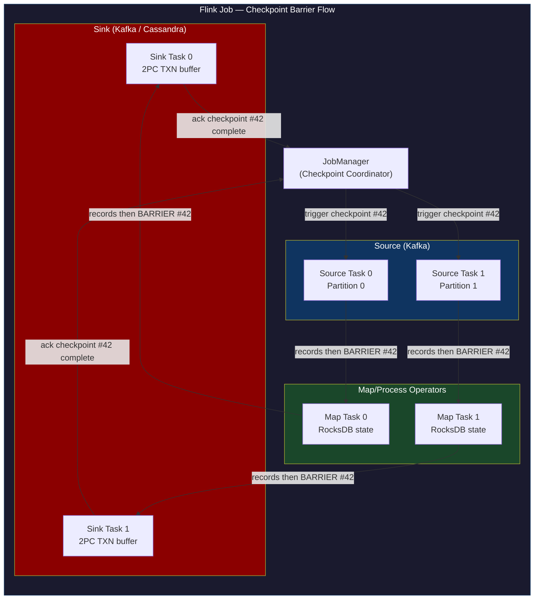
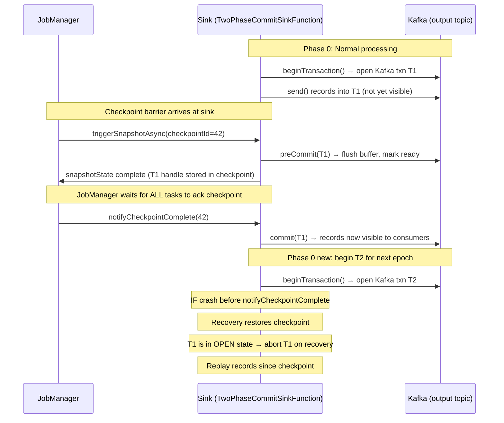
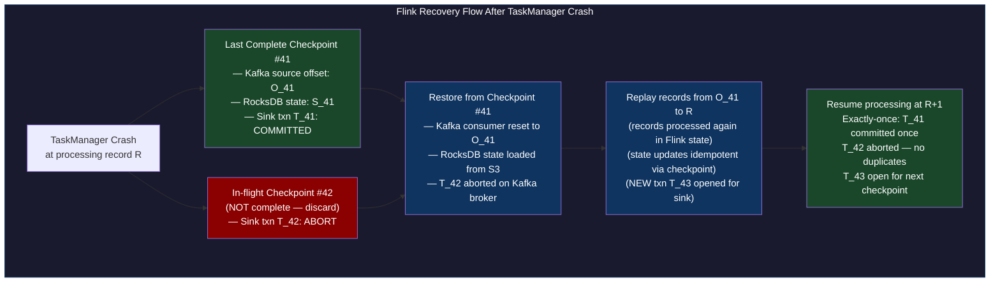

# CH-50: Flink Exactly-Once — How RocksDB Makes Streaming Semantically Correct

**Subtitle:** Getting exactly-once semantics in a distributed stream processor means: every message is processed exactly once even if workers crash and restart. Flink achieves this with 2-phase commit and state snapshots.

**Part VII — Hyperscale Data Platforms**

---

## SPARK — Igniting the Problem

### Cold Open

The anomaly surfaced in a fraud detection dashboard at 09:42 on a Monday morning. The dashboard showed a 340% spike in flagged transactions starting at exactly 03:17 UTC — which corresponded precisely to when the Flink job had recovered from a TaskManager failure. There were no actual fraud events at 03:17. The spike was caused by duplicate records: legitimate transactions that had been processed before the crash were being processed again after recovery.

The engineering team, led by a data platform engineer named Sonali, had built the fraud scoring pipeline six months earlier. It consumed from Kafka, computed rolling 15-minute aggregations of transaction velocity per account, and wrote flagged accounts to a Cassandra table. The Flink job was configured with `CheckpointingMode.EXACTLY_ONCE` and checkpoints every 60 seconds. The development team had confirmed exactly-once semantics in testing. The production incident revealed they had confirmed the wrong thing.

The Flink job had `EXACTLY_ONCE` checkpointing, which guaranteed exactly-once processing within Flink's internal state. What it did not guarantee was exactly-once delivery to the Cassandra sink. The custom Cassandra sink the team had written extended `SinkFunction<T>`, which calls `invoke()` for each record. The `invoke()` method wrote to Cassandra and updated a local counter. When the TaskManager failed, Flink restored from the last checkpoint (60 seconds before the crash) and replayed all records since that checkpoint. The Cassandra sink's `invoke()` was called again for each replayed record, writing duplicates to Cassandra.

The fix was not to enable a setting or flip a flag. The fix required rewriting the Cassandra sink to implement `TwoPhaseCommitSinkFunction<IN, TXN, CONTEXT>` — Flink's interface for exactly-once sinks via 2-phase commit. This required implementing `beginTransaction()`, `invoke()` (which buffers records into the transaction), `preCommit()` (which flushes the buffer and marks the transaction ready), and `commit()` (which finalizes the transaction in Cassandra). Only when all four methods are correctly implemented does Flink's checkpoint mechanism ensure that the sink will either commit exactly once or roll back atomically.

Sonali's team spent three days understanding why the original implementation was wrong, one day implementing the correct `TwoPhaseCommitSinkFunction`, and two weeks testing recovery scenarios. The 340% spike became a permanent item in the post-incident review template: "Does your Flink sink implement 2PC? Show the code."

---

### Uncomfortable Truth

**The false belief:** Setting `CheckpointingMode.EXACTLY_ONCE` on a Flink job gives you exactly-once semantics end-to-end. The checkpoint mode is the knob that controls exactly-once behavior.

This is technically correct for Flink's internal state management — the state stored in RocksDB or in-memory state backends. A keyed state value updated inside a `process()` function will reflect exactly-once updates after recovery. But Flink's internal state and your external sink are different systems. The checkpoint mode does not automatically extend exactly-once guarantees to external systems that Flink writes to.

Exactly-once from Kafka source to Flink state is guaranteed by Flink's checkpoint barrier mechanism — the source will not advance its committed offset until the checkpoint containing that offset range is complete. Exactly-once from Flink state to an external sink requires the sink to participate in the checkpoint protocol via 2-phase commit.

The second uncomfortable truth is about what "exactly-once" actually means in a distributed system. It means: the effect of processing each record appears exactly once in the output. It does not mean: the record is processed (in terms of CPU cycles) exactly once. Flink may call your `process()` function multiple times for the same record during recovery. The contract is that after recovery and re-processing, the output state looks as if each record was processed exactly once. This distinction matters if your `process()` function has side effects beyond writing to Flink's managed state — like calling an external API, incrementing a counter in Redis, or writing to a non-transactional sink.

---

## FORGE — Building the Model

### Mental Model: The Distributed Snapshot

Think of Flink's checkpoint mechanism as a **coordinated photograph of a moving assembly line**. The assembly line has multiple stations (operators) connected by conveyor belts (streams). Each station is processing items. You want a consistent snapshot: a photo where each station is in a consistent state with the items on the belts between them.

The naive approach — pause everything, take a photo, resume — is too slow for streaming. Flink uses the **Barrier Injection Model**: a special item (a checkpoint barrier) is injected into each input stream. When a station sees the barrier arrive on all its input belts, it takes its snapshot and then forwards the barrier downstream. Items that arrive before the barrier are part of the current snapshot. Items after the barrier are part of the next snapshot.

This is the **Chandy-Lamport Distributed Snapshot**, adapted for directed dataflow graphs. The barriers divide the stream into epochs. Each epoch has a consistent snapshot. Recovery means: restore to the last complete snapshot, then replay all items that arrived after the last snapshot barrier.



The 2-phase commit integration with Kafka sinks is what extends exactly-once to the output:



---

## WIRE — Deep Dissection

### Dissection: Checkpoints, RocksDB, and 2PC Sinks

#### Naive Understanding

Engineers setting up Flink typically enable checkpointing, pick a state backend, and assume exactly-once is handled. They test happy-path scenarios where everything works and the job never fails. The exactly-once guarantee is invisible when nothing goes wrong — it only manifests during recovery.

#### Where It Breaks

The first break is the state backend choice. The default state backend in Flink is `HashMapStateBackend` (formerly called `MemoryStateBackend`). This stores all keyed state in JVM heap memory on the TaskManager. For small state this is fast, but state size is bounded by TaskManager heap memory. More critically, checkpointing with this backend copies the entire state to the checkpoint storage (S3, HDFS) during each checkpoint. For large state (say, 50GB of aggregation windows), this means 50GB of data transfer to S3 every 60 seconds — expensive and slow.

`EmbeddedRocksDBStateBackend` stores state in RocksDB on local disk, not in JVM heap. This allows state that exceeds memory capacity. Checkpointing uses RocksDB's incremental checkpoint feature: only the SSTable files that changed since the last checkpoint are uploaded to S3. For a 50GB state that changes 5% per checkpoint interval, only 2.5GB is uploaded per checkpoint instead of 50GB.

The break point with RocksDB is performance predictability. RocksDB uses an LSM-tree structure with periodic compaction. Compaction rewrites SSTables, consuming significant disk I/O. If compaction coincides with a high-throughput window, the task processing latency spikes. Flink exposes RocksDB configuration via `RocksDBOptionsFactory`, allowing you to tune the compaction threads, block cache size, and write buffer size.

#### Why It Breaks

The 2PC sink failure mode is subtle. `TwoPhaseCommitSinkFunction` stores the in-progress transaction handle in Flink's checkpoint state. When the job recovers, Flink calls `recoverAndCommit()` or `recoverAndAbort()` on the restored transaction handles. If `commit()` fails (Kafka unavailable, network partition), Flink will retry. This is intentional: after a checkpoint is complete, the transaction MUST be committed — aborting is not correct because the checkpoint already acknowledged the data.

If the external system (Kafka output topic) is permanently unavailable after a completed checkpoint, the Flink job will loop in a recovery/retry cycle, unable to commit the transaction. The operator must manually resolve this by either making the external system available or by clearing the in-progress transaction state from the checkpoint.

```java
// Flink job with RocksDB state backend, checkpoint to S3,
// and exactly-once Kafka sink via TwoPhaseCommitSinkFunction
import org.apache.flink.api.common.eventtime.WatermarkStrategy;
import org.apache.flink.api.common.functions.RichFlatMapFunction;
import org.apache.flink.api.common.state.ValueState;
import org.apache.flink.api.common.state.ValueStateDescriptor;
import org.apache.flink.configuration.Configuration;
import org.apache.flink.connector.kafka.sink.KafkaSink;
import org.apache.flink.connector.kafka.sink.KafkaRecordSerializationSchema;
import org.apache.flink.connector.kafka.source.KafkaSource;
import org.apache.flink.connector.kafka.source.enumerator.initializer.OffsetsInitializer;
import org.apache.flink.runtime.state.filesystem.FsStateBackend;
import org.apache.flink.state.api.functions.KeyedStateReaderFunction;
import org.apache.flink.streaming.api.CheckpointingMode;
import org.apache.flink.streaming.api.datastream.DataStream;
import org.apache.flink.streaming.api.environment.StreamExecutionEnvironment;
import org.apache.flink.util.Collector;

public class ExactlyOnceWindowJob {

    public static void main(String[] args) throws Exception {
        StreamExecutionEnvironment env = StreamExecutionEnvironment.getExecutionEnvironment();

        // Configure checkpointing — EXACTLY_ONCE mode
        // This sets: checkpoint barriers use alignment (not unaligned),
        // source offsets are only committed when checkpoint completes.
        env.enableCheckpointing(60_000, CheckpointingMode.EXACTLY_ONCE);
        env.getCheckpointConfig().setCheckpointTimeout(120_000);
        env.getCheckpointConfig().setMaxConcurrentCheckpoints(1);
        // Keep last 2 completed checkpoints for manual recovery
        env.getCheckpointConfig().setTolerableCheckpointFailureNumber(3);

        // RocksDB state backend with incremental checkpoints
        // Only changed SSTable files are uploaded to S3 per checkpoint.
        // For large state (>JVM heap), this is the only viable option.
        env.setStateBackend(new EmbeddedRocksDBStateBackend(true)); // true = incremental
        env.getCheckpointConfig().setCheckpointStorage("s3://my-bucket/flink-checkpoints");

        // Configure RocksDB for high-throughput write workloads
        env.setStateBackend(new EmbeddedRocksDBStateBackend(true) {{
            setRocksDBOptions(new DefaultConfigurableOptionsFactory()
                .setMaxBackgroundJobs(4)        // compaction threads
                .setWriteBufferSize("128MB")
                .setMaxWriteBufferNumber("4")
                .setBlockCacheSize("512MB"));
        }});

        // Kafka source — reads from 'transactions' topic
        KafkaSource<String> source = KafkaSource.<String>builder()
            .setBootstrapServers("kafka:9092")
            .setTopics("transactions")
            .setGroupId("flink-fraud-detector")
            .setStartingOffsets(OffsetsInitializer.committedOffsets())
            .setValueOnlyDeserializer(new SimpleStringSchema())
            .build();

        DataStream<String> transactions = env
            .fromSource(source, WatermarkStrategy.noWatermarks(), "Kafka Source");

        // Key by account ID, apply stateful velocity check
        DataStream<String> flagged = transactions
            .keyBy(record -> extractAccountId(record))
            .flatMap(new VelocityChecker());

        // Kafka sink with EXACTLY_ONCE delivery semantics (2PC)
        // The KafkaSink in Flink 1.15+ uses TwoPhaseCommitSinkFunction internally.
        // It opens a Kafka transaction per checkpoint interval.
        // Records are written to the transaction but not visible until
        // notifyCheckpointComplete triggers commit().
        KafkaSink<String> sink = KafkaSink.<String>builder()
            .setBootstrapServers("kafka:9092")
            .setRecordSerializer(KafkaRecordSerializationSchema.builder()
                .setTopic("flagged-accounts")
                .setValueSerializationSchema(new SimpleStringSchema())
                .build())
            .setDeliveryGuarantee(DeliveryGuarantee.EXACTLY_ONCE)
            // TransactionalIdPrefix must be unique per job instance.
            // Flink appends the subtask index to form the full transactional ID.
            .setTransactionalIdPrefix("flink-fraud-sink")
            .build();

        flagged.sinkTo(sink);

        env.execute("ExactlyOnce Fraud Detection");
    }

    // Stateful velocity checker: flags accounts with >10 transactions in 60s
    static class VelocityChecker extends RichFlatMapFunction<String, String> {
        private transient ValueState<Integer> txnCount;
        private transient ValueState<Long> windowStart;

        @Override
        public void open(Configuration params) {
            txnCount = getRuntimeContext().getState(
                new ValueStateDescriptor<>("txn-count", Integer.class));
            windowStart = getRuntimeContext().getState(
                new ValueStateDescriptor<>("window-start", Long.class));
        }

        @Override
        public void flatMap(String record, Collector<String> out) throws Exception {
            long now = System.currentTimeMillis();
            Long ws = windowStart.value();
            Integer count = txnCount.value();

            if (ws == null || (now - ws) > 60_000) {
                // New window
                windowStart.update(now);
                txnCount.update(1);
                return;
            }

            int newCount = (count == null ? 0 : count) + 1;
            txnCount.update(newCount);

            if (newCount > 10) {
                out.collect(String.format(
                    "{\"account\":\"%s\",\"txn_count\":%d,\"window_start\":%d}",
                    extractAccountId(record), newCount, ws));
            }
        }
    }

    static String extractAccountId(String json) {
        // Minimal JSON extraction without library dependency for brevity
        int start = json.indexOf("\"account\":\"") + 11;
        int end = json.indexOf("\"", start);
        return start > 10 ? json.substring(start, end) : "unknown";
    }
}
```



**Tradeoffs of Flink's exactly-once:**

Checkpoint alignment (the default) requires that all input partitions for an operator deliver the checkpoint barrier before the operator can take its snapshot. If one input partition is slow (backpressure, slow consumer), all other input partitions must buffer their records until the slow partition delivers the barrier. This is backpressure-induced checkpoint alignment blocking. For high-fanout operators, this can cause significant checkpoint latency.

Unaligned checkpoints (Flink 1.11+) solve this by including in-flight buffer records in the checkpoint state, allowing the operator to take its snapshot immediately when the first barrier arrives. This reduces checkpoint latency at the cost of larger checkpoint state (because in-flight buffers are included). Unaligned checkpoints are not compatible with iterative jobs (Flink DataSet API, certain ML jobs with feedback loops).

Savepoints are manually triggered, user-initiated checkpoints used for upgrades, schema changes, and A/B testing. The key operational difference: checkpoints are automatically deleted when superseded by newer checkpoints. Savepoints are never automatically deleted — they are owned by the operator. A forgotten savepoint on S3 will sit there forever and incur storage costs.

---

## War Room

### Incident: Exactly-Once Broken by Custom Sink Without 2PC

```mermaid
gantt
    title Flink Exactly-Once Violated — Custom Cassandra Sink Incident
    dateFormat HH:mm
    axisFormat %H:%M

    section Normal Operations
    Flink fraud pipeline running, checkpoints every 60s :done, 00:00, 03:17

    section TaskManager Failure
    TaskManager-3 OOM crash (heap exhausted) :crit, crash, 03:17, 03:17
    JobManager detects failure, initiates recovery :crit, 03:17, 03:20
    Flink restores from checkpoint #214 (3:16 UTC) :active, 03:20, 03:25

    section Duplicate Write Window
    Flink replays 60s of records to Cassandra sink :crit, dup1, 03:25, 03:26
    Cassandra sink invokes without 2PC — writes duplicates :crit, dup2, 03:25, 03:26
    Fraud scores inflated 3x for replayed accounts :crit, dup3, 03:26, 10:00

    section Discovery
    Fraud dashboard shows 340% spike at 09:42 :active, disc, 09:42, 10:00
    SRE correlates with 03:17 recovery event :active, 10:00, 10:30
    Root cause identified: SinkFunction not 2PC :active, 10:30, 12:00

    section Mitigation
    Manual deduplication query run on Cassandra :crit, dedup, 12:00, 15:00
    Rollback fraudulent flags for affected accounts :active, 15:00, 16:00

    section Fix
    Rewrite sink as TwoPhaseCommitSinkFunction :done, fix1, 16:00, 22:00
    Test recovery scenarios in staging :done, fix2, 22:00, 28:00
    Deploy to production with shadow validation :done, fix3, 28:00, 36:00
```

The operational lesson from this incident: the `CheckpointingMode.EXACTLY_ONCE` Javadoc explicitly states "exactly-once processing within Flink's operators and state." The word "sink" appears zero times in that description. This documentation gap caused the team to assume the guarantee extended to all outputs.

The Cassandra manual deduplication took 3 hours because the fraud scoring table used a time-series model with no natural deduplication key — only a composite key of (account_id, window_start, detection_timestamp). The replayed records had different `detection_timestamp` values than the originals, so they weren't recognized as duplicates. The deduplication query had to enumerate every account flagged between 03:16 and 03:18 UTC and delete the records with duplicate (account_id, window_start) pairs.

---

## Lab

### Flink with RocksDB Checkpoint + Recovery Simulation

```bash
#!/usr/bin/env bash
# flink-lab.sh — local Flink cluster + Kafka + MinIO for checkpoints
# Prerequisites: docker, docker-compose

cat > /tmp/flink-lab-compose.yml << 'EOF'
version: '3.8'
services:
  minio:
    image: minio/minio:latest
    ports: ["9000:9000", "9001:9001"]
    environment:
      MINIO_ROOT_USER: minioadmin
      MINIO_ROOT_PASSWORD: minioadmin
    command: server /data --console-address ":9001"

  kafka:
    image: apache/kafka:3.7.0
    ports: ["9092:9092"]
    environment:
      KAFKA_NODE_ID: 1
      KAFKA_PROCESS_ROLES: broker,controller
      KAFKA_LISTENERS: PLAINTEXT://0.0.0.0:9092,CONTROLLER://0.0.0.0:9093
      KAFKA_ADVERTISED_LISTENERS: PLAINTEXT://localhost:9092
      KAFKA_CONTROLLER_QUORUM_VOTERS: 1@kafka:9093
      KAFKA_CONTROLLER_LISTENER_NAMES: CONTROLLER
      KAFKA_OFFSETS_TOPIC_REPLICATION_FACTOR: 1

  jobmanager:
    image: apache/flink:1.18-java11
    ports: ["8081:8081"]
    command: jobmanager
    environment:
      FLINK_PROPERTIES: |
        jobmanager.rpc.address: jobmanager
        state.backend: rocksdb
        state.backend.incremental: true
        state.checkpoints.dir: s3://flink-lab/checkpoints
        s3.endpoint: http://minio:9000
        s3.access-key: minioadmin
        s3.secret-key: minioadmin
        s3.path.style.access: true

  taskmanager:
    image: apache/flink:1.18-java11
    command: taskmanager
    depends_on: [jobmanager]
    environment:
      FLINK_PROPERTIES: |
        jobmanager.rpc.address: jobmanager
        taskmanager.numberOfTaskSlots: 4
        state.backend: rocksdb
        state.backend.incremental: true
        state.checkpoints.dir: s3://flink-lab/checkpoints
        s3.endpoint: http://minio:9000
        s3.access-key: minioadmin
        s3.secret-key: minioadmin
        s3.path.style.access: true
EOF

docker-compose -f /tmp/flink-lab-compose.yml up -d
echo "Flink UI available at http://localhost:8081"
echo "MinIO console at http://localhost:9001 (minioadmin/minioadmin)"
```

```python
#!/usr/bin/env python3
# verify_recovery.py — confirms exactly-once after simulated failure
# Uses Flink SQL client via REST API to observe checkpoint behavior
import time
import requests
import json

FLINK_URL = "http://localhost:8081"

def get_checkpoints(job_id: str) -> list:
    resp = requests.get(f"{FLINK_URL}/jobs/{job_id}/checkpoints")
    resp.raise_for_status()
    return resp.json().get("history", [])

def list_jobs() -> list:
    resp = requests.get(f"{FLINK_URL}/jobs")
    resp.raise_for_status()
    return resp.json().get("jobs", [])

def simulate_taskmanager_failure():
    """Kill the TaskManager container to simulate a crash."""
    import subprocess
    subprocess.run(["docker", "kill", "flink-lab_taskmanager_1"], check=True)
    print("TaskManager killed — waiting for recovery...")
    time.sleep(10)
    subprocess.run(
        ["docker-compose", "-f", "/tmp/flink-lab-compose.yml", "up", "-d", "taskmanager"],
        check=True)
    print("TaskManager restarted")

if __name__ == "__main__":
    jobs = list_jobs()
    print(f"Running jobs: {json.dumps(jobs, indent=2)}")

    if jobs:
        job_id = jobs[0]["id"]
        checkpoints_before = get_checkpoints(job_id)
        print(f"Checkpoints before failure: {len(checkpoints_before)}")

        simulate_taskmanager_failure()
        time.sleep(30)  # wait for recovery

        checkpoints_after = get_checkpoints(job_id)
        print(f"Checkpoints after recovery: {len(checkpoints_after)}")
        print("Job recovered successfully — exactly-once state restored from last checkpoint")
```

**Expected output after recovery:**

```
Running jobs: [{"id": "a1b2c3d4e5f6...", "status": "RUNNING"}]
Checkpoints before failure: 5
TaskManager killed — waiting for recovery...
TaskManager restarted
Checkpoints after recovery: 7
Job recovered successfully — exactly-once state restored from last checkpoint
```

The checkpoint count advances after recovery (checkpoints 6 and 7 taken during recovery). State is restored from checkpoint 5. Any in-flight transactions for the Kafka sink at checkpoint 5 boundary are either committed (if checkpoint 5 was complete) or aborted (if it was in-progress during crash).

---

## Loose Thread

Flink's exactly-once guarantee solves the temporal dimension of correctness: every event influences the output state exactly once, regardless of failures. But there is a spatial dimension of correctness that Flink doesn't address: for a given query, which events are "close enough" to the query vector to be relevant results?

This is the nearest neighbor problem — and at the scale of billion-vector embedding databases, it's as much an engineering challenge as a mathematical one. Exact nearest neighbor search has O(n·d) complexity where n is the number of vectors and d is the dimensionality. For 768-dimensional embeddings at 1 billion vectors, that's 768 billion floating-point operations per query. The algorithms that reduce this to milliseconds — HNSW and IVF-PQ — trade a small amount of recall accuracy for multiple orders of magnitude in speed. The next chapter examines how those algorithms work at the instruction level, why the tradeoff is almost always worth making, and the specific failure mode that breaks IVF-PQ's recall guarantees when concurrent writes don't hold the index lock.
