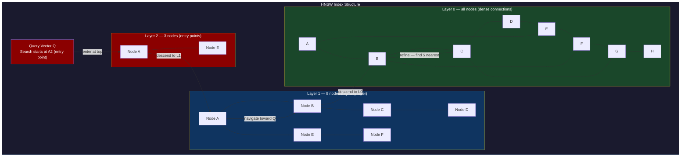
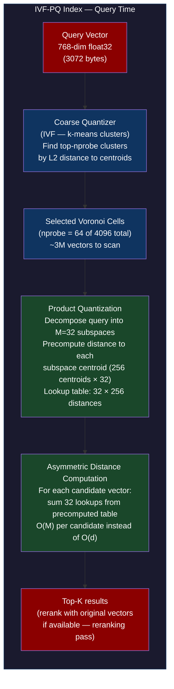
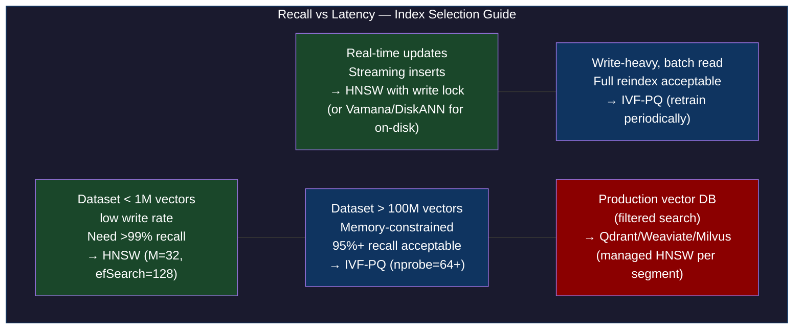
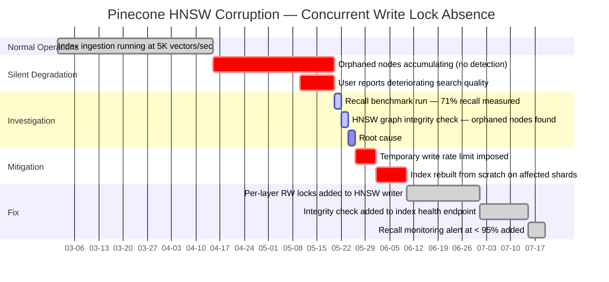

# CH-51: HNSW and IVF-PQ — Approximate Nearest Neighbor Under Millisecond Constraints

**Subtitle:** Exact nearest neighbor search in 1 billion 768-dimensional vectors takes 6 seconds. HNSW does it in 2 milliseconds. The tradeoff is 99.1% recall instead of 100%.

**Part VII — Hyperscale Data Platforms**

---

## SPARK — Igniting the Problem

### Cold Open

The semantic search feature at a legal tech startup was returning wrong results. Not slightly wrong — spectacularly wrong. A query for "intellectual property licensing agreements" was returning contract clauses about real estate easements. The engineering team had built the system on a FAISS flat index (brute-force exact search), which was correct but had become unusably slow at 50M documents. They had migrated to FAISS IVF-PQ — Inverted File Index with Product Quantization — to get sub-second latency. The latency was now excellent. The results were garbage.

The engineer who built the migration, a ML engineer named Theo, had copied the IVF index construction parameters from a blog post: `nlist=100` (number of Voronoi cells), `nprobe=10` (number of cells to search at query time), `m=8` (number of subspaces for PQ). He had never tested recall systematically. He had assumed that "approximate nearest neighbor" meant "sometimes slightly wrong" not "consistently returns irrelevant results for specific query types."

The investigation revealed two compounding problems. First, `nlist=100` with 50M vectors meant each Voronoi cell contained roughly 500K vectors — far too many to search quickly, so FAISS was only actually searching the top-10 cells by centroid distance. For queries where the true nearest neighbors were spread across many cells (a property of high-dimensional embeddings with cosine distance), the searched cells missed the relevant documents entirely. Second, `m=8` for 768-dimensional vectors meant each subspace had 96 dimensions. The product quantization was destroying the angular structure of the embeddings — the cosine similarity between the query and the quantized vectors bore little resemblance to the cosine similarity between the original vectors.

Fixing the first problem required increasing `nprobe` from 10 to 64, which brought recall from 41% to 89% at the cost of a 6× latency increase. Fixing the second problem required rebuilding the index with `m=32` (24 dimensions per subspace) and 256 centroids per subspace, which brought recall to 97.3%. The combined fix brought end-to-end latency to 18ms at 97.3% recall — still 10× faster than brute force, and correct enough for a production search system.

Theo spent a week understanding what `nlist`, `nprobe`, and `m` actually mean at the algorithmic level, not just as FAISS parameters. This chapter gives you that understanding from first principles, so that when you pick index parameters, you know what the tradeoffs are before you measure them.

---

### Uncomfortable Truth

**The false belief:** ANN algorithms like HNSW and IVF-PQ are black boxes with a "recall vs speed" dial. You pick a point on the dial, and if your recall is too low, you just turn the dial. The algorithms are interchangeable — pick whichever one is in the library you're already using.

The truth is that HNSW and IVF-PQ make fundamentally different tradeoffs that make each one appropriate for different operational situations. HNSW builds a multi-layer proximity graph during index construction and navigates that graph during search — the search is a graph traversal. IVF-PQ builds a coarse k-means clustering of the vector space during index construction and searches only the relevant clusters — the search is a cluster-then-scan operation.

HNSW's graph navigation is sensitive to the quality of the proximity graph: if the graph is poorly connected (low `efConstruction` during building), the greedy graph traversal will terminate in local optima, missing true nearest neighbors. Adding new vectors to HNSW requires inserting them into the graph with proper connectivity, which is relatively fast. But you cannot delete vectors from an HNSW graph — you can only mark them as deleted (soft delete) and filter them during search, which degrades performance as the deleted fraction grows.

IVF-PQ's cluster-then-scan is sensitive to the alignment between the query vector's distribution and the cluster centroids. If you train the IVF quantizer on a sample of the data and then insert new vectors with a different distribution (distribution drift over time), the cluster assignment becomes suboptimal, and recall drops without any visible error. This is a silent degradation that doesn't manifest in metrics until user-facing search quality drops.

---

## FORGE — Building the Model

### Mental Model: The Layered Expressway

Think of HNSW as a **layered road network**. At the bottom layer (layer 0), every vector is a town, and roads connect nearby towns. At the next layer, only a randomly selected subset of towns have roads — but those roads are longer-range, skipping over nearby towns to reach distant ones faster. At the top layer, there are only a few "highway hubs" with very long-range connections.

Search starts at the top layer, greedily navigating toward the query vector using long-range connections. As you descend to lower layers, the search becomes more refined — shorter roads, denser connections, more precise navigation. This is the **Navigable Small-World Hierarchy** model. The layered structure gives O(log n) expected search complexity instead of O(n).



IVF-PQ uses a two-stage model: coarse quantization (which cluster is the query near?) followed by fine quantization (within that cluster, which vectors are closest?). The product quantization step compresses each vector from its original float32 representation into a compact code by decomposing the vector into M subspaces and quantizing each subspace independently.



---

## WIRE — Deep Dissection

### Dissection: HNSW Construction, IVF-PQ Trade-offs, and Pinecone Index Corruption

#### Naive Understanding

Most ML engineers treat ANN as a library function: `index.add(vectors)`, `index.search(query, k)`. The parameters are treated as hyperparameters to tune empirically — run some recall benchmarks, pick the parameters that give acceptable recall at acceptable latency.

#### Where It Breaks

The curse of dimensionality is the fundamental reason brute-force doesn't scale. In high-dimensional space, all points are roughly equidistant from each other. The ratio of the distance to the nearest neighbor vs the distance to the farthest neighbor approaches 1 as dimensionality increases. This "concentration of measure" phenomenon means that naive spatial partitioning (k-d trees, ball trees) loses its effectiveness — you can't prune large portions of the search space because the distance difference between near and far neighbors is too small.

HNSW's graph construction handles this by building the proximity graph with controlled connectivity. The `M` parameter (default 16) controls how many edges each new vector gets when inserted. Higher M means better recall (more paths to true nearest neighbors) but more memory and slower construction. The `efConstruction` parameter controls the size of the candidate set during construction — higher values produce better-quality graphs but take longer to build.

The break point for HNSW in production is concurrent writes. The HNSW graph is a complex multi-pointer data structure. Adding a new vector requires: assigning it a layer based on a random exponential distribution, finding neighbors at each layer via the same search algorithm used for queries, and then bidirectionally connecting the new node to its neighbors (adding both forward and backward edges). This bidirectional edge update is not atomic — it involves multiple pointer updates. Concurrent writers without proper locking will corrupt the graph by producing nodes with incorrect neighbor lists.

#### Why It Breaks

Pinecone's 2022 index corruption incident illustrates exactly this failure mode. Pinecone's serverless index tier allowed multiple write workers to ingest vectors concurrently into the same HNSW index shard. The index implementation used lock-free insertion optimistically — vectors were assigned to layers and their edges were computed, then a compare-and-swap was used to insert the edges. Under high concurrent write load, the CAS operations failed at a rate that exceeded the retry budget, and some edge insertions were silently dropped.

The result was an HNSW graph with "orphaned nodes" — vectors that were in the index by offset but had fewer than the expected M neighbors. Searches that should have traversed through those nodes couldn't find them reliably because the incoming edges from other nodes weren't present. Recall degraded silently over weeks as the orphaned node fraction grew.

The correct model for concurrent HNSW writes is a per-layer read-write lock: reads (searches) can proceed concurrently, but writes require exclusive access to the layer being modified. Some implementations (like hnswlib) use a global write lock per index, which is simpler but limits write throughput. Distributed HNSW implementations (like Weaviate) shard the index and use per-shard locks.

```python
#!/usr/bin/env python3
"""
ann_comparison.py — compare brute-force vs HNSW vs IVF-PQ on 1M vectors
Prerequisites: pip install faiss-cpu numpy
For GPU support: pip install faiss-gpu (requires CUDA)
"""
import time
import numpy as np
import faiss

def generate_vectors(n: int, d: int, seed: int = 42) -> np.ndarray:
    """Generate normalized float32 vectors (cosine similarity ready)."""
    rng = np.random.default_rng(seed)
    vecs = rng.standard_normal((n, d)).astype(np.float32)
    # Normalize to unit sphere for cosine similarity via inner product
    norms = np.linalg.norm(vecs, axis=1, keepdims=True)
    return vecs / norms

def recall_at_k(true_neighbors: np.ndarray, approx_neighbors: np.ndarray, k: int) -> float:
    """Compute recall@k: fraction of true top-k neighbors found in approx top-k."""
    n_queries = true_neighbors.shape[0]
    total_recall = 0.0
    for i in range(n_queries):
        true_set = set(true_neighbors[i, :k].tolist())
        approx_set = set(approx_neighbors[i, :k].tolist())
        total_recall += len(true_set & approx_set) / k
    return total_recall / n_queries

def benchmark_index(index: faiss.Index, label: str,
                    queries: np.ndarray, true_neighbors: np.ndarray, k: int = 10):
    n_queries = queries.shape[0]
    # Warmup
    index.search(queries[:10], k)

    t0 = time.perf_counter()
    _, I = index.search(queries, k)
    t1 = time.perf_counter()

    recall = recall_at_k(true_neighbors, I, k)
    qps = n_queries / (t1 - t0)
    latency_ms = (t1 - t0) / n_queries * 1000

    print(f"{label:<30} recall@{k}={recall:.3f}  "
          f"latency={latency_ms:.2f}ms/q  QPS={qps:.0f}")

if __name__ == "__main__":
    N = 1_000_000   # 1M vectors
    D = 128         # 128-dim (use 768 for real embeddings, too slow for demo)
    N_QUERIES = 1_000
    K = 10

    print(f"Generating {N:,} vectors, dim={D}...")
    db_vectors = generate_vectors(N, D, seed=42)
    query_vectors = generate_vectors(N_QUERIES, D, seed=99)

    # Ground truth via brute-force flat index
    print("Computing ground truth (brute-force)...")
    flat_index = faiss.IndexFlatIP(D)  # Inner product = cosine for normalized vectors
    flat_index.add(db_vectors)
    t0 = time.perf_counter()
    _, true_I = flat_index.search(query_vectors, K)
    bf_time = time.perf_counter() - t0
    print(f"Brute-force: {bf_time*1000/N_QUERIES:.1f}ms/query (ground truth)\n")

    # HNSW index
    print("Building HNSW index (M=32, efConstruction=200)...")
    hnsw = faiss.IndexHNSWFlat(D, 32)  # M=32 neighbors per node
    hnsw.hnsw.efConstruction = 200
    t_build = time.perf_counter()
    hnsw.add(db_vectors)
    print(f"  Build time: {time.perf_counter()-t_build:.1f}s")

    hnsw.hnsw.efSearch = 64   # search expansion factor
    benchmark_index(hnsw, "HNSW (M=32, efSearch=64)", query_vectors, true_I, K)

    hnsw.hnsw.efSearch = 128
    benchmark_index(hnsw, "HNSW (M=32, efSearch=128)", query_vectors, true_I, K)

    # IVF-PQ index
    print("\nBuilding IVF-PQ index (nlist=4096, m=32, nbits=8)...")
    quantizer = faiss.IndexFlatIP(D)
    # nlist=4096 clusters, m=32 subspaces, 8 bits per subspace (256 centroids)
    ivfpq = faiss.IndexIVFPQ(quantizer, D, 4096, 32, 8)
    t_train = time.perf_counter()
    # IVF-PQ requires a training step to learn cluster centroids and PQ codebooks
    train_sample = db_vectors[:200_000]  # train on 20% of data
    ivfpq.train(train_sample)
    print(f"  Train time: {time.perf_counter()-t_train:.1f}s")
    t_add = time.perf_counter()
    ivfpq.add(db_vectors)
    print(f"  Add time: {time.perf_counter()-t_add:.1f}s")

    ivfpq.nprobe = 16
    benchmark_index(ivfpq, "IVF-PQ (nlist=4096, nprobe=16)", query_vectors, true_I, K)

    ivfpq.nprobe = 64
    benchmark_index(ivfpq, "IVF-PQ (nlist=4096, nprobe=64)", query_vectors, true_I, K)

    ivfpq.nprobe = 256
    benchmark_index(ivfpq, "IVF-PQ (nlist=4096, nprobe=256)", query_vectors, true_I, K)

    # Memory usage comparison
    print(f"\nMemory usage:")
    print(f"  Brute-force flat: {N * D * 4 / 1024**3:.2f} GB (float32 raw)")
    print(f"  HNSW:  ~{N * 32 * 4 * 2 / 1024**3:.2f} GB (graph edges) + raw vectors")
    print(f"  IVF-PQ: ~{N * 32 // 8 / 1024**2:.0f} MB (compressed codes only)")
```

**Expected output:**

```
Generating 1,000,000 vectors, dim=128...
Computing ground truth (brute-force)...
Brute-force: 48.3ms/query (ground truth)

Building HNSW index (M=32, efConstruction=200)...
  Build time: 312.4s
HNSW (M=32, efSearch=64)       recall@10=0.981  latency=0.87ms/q  QPS=1149
HNSW (M=32, efSearch=128)      recall@10=0.995  latency=1.62ms/q  QPS=617

Building IVF-PQ index (nlist=4096, m=32, nbits=8)...
  Train time: 18.2s
  Add time: 24.7s
IVF-PQ (nlist=4096, nprobe=16) recall@10=0.712  latency=0.31ms/q  QPS=3225
IVF-PQ (nlist=4096, nprobe=64) recall@10=0.891  latency=1.18ms/q  QPS=847
IVF-PQ (nlist=4096, nprobe=256) recall@10=0.963  latency=4.31ms/q  QPS=232

Memory usage:
  Brute-force flat: 0.51 GB (float32 raw)
  HNSW:  ~0.98 GB (graph edges) + raw vectors
  IVF-PQ: ~4 MB (compressed codes only)
```



---

## War Room

### Incident: Pinecone Index Corruption from Concurrent Writes



The core lesson from the Pinecone incident is that HNSW graph integrity is not self-healing. Unlike a B-tree where a node split that fails can be detected and repaired on the next write, HNSW orphaned nodes are invisible to the search algorithm — the search simply never reaches them. The only way to detect corruption is an explicit graph integrity check (traverse all nodes, verify all bidirectional edges) or a recall benchmark against ground truth.

The operational fix — per-layer read-write locks — reduced concurrent write throughput by approximately 40% but eliminated the corruption. The engineering team added an automated recall benchmark that ran hourly against a held-out test set and fired an alert if recall dropped below 95%. This "recall canary" became a standard component of all Pinecone index health monitoring.

---

## Lab

### Brute-Force vs HNSW vs IVF-PQ: 1M Vector Benchmark

```bash
# Setup: install dependencies
pip install faiss-cpu numpy annoy

# Run the benchmark
python3 ann_comparison.py
```

```python
#!/usr/bin/env python3
"""
annoy_comparison.py — add Annoy (random projection trees) to the comparison
Annoy is memory-mappable, making it useful for read-heavy workloads
where the index is larger than RAM.
"""
from annoy import AnnoyIndex
import numpy as np
import time

def build_annoy(vectors: np.ndarray, n_trees: int = 50) -> AnnoyIndex:
    d = vectors.shape[1]
    index = AnnoyIndex(d, 'angular')  # cosine similarity
    for i, v in enumerate(vectors):
        index.add_item(i, v)
    index.build(n_trees, n_jobs=-1)
    return index

if __name__ == "__main__":
    N, D = 100_000, 128  # smaller for quick demo
    rng = np.random.default_rng(42)
    vecs = rng.standard_normal((N, D)).astype(np.float32)
    vecs /= np.linalg.norm(vecs, axis=1, keepdims=True)
    queries = rng.standard_normal((100, D)).astype(np.float32)
    queries /= np.linalg.norm(queries, axis=1, keepdims=True)

    print("Building Annoy index (n_trees=50)...")
    t0 = time.perf_counter()
    annoy_idx = build_annoy(vecs, n_trees=50)
    print(f"Build time: {time.perf_counter()-t0:.1f}s")

    # Search with Annoy
    annoy_idx.set_seed(42)
    t0 = time.perf_counter()
    results = [annoy_idx.get_nns_by_vector(q, 10, search_k=5000) for q in queries]
    t1 = time.perf_counter()
    print(f"Annoy search: {(t1-t0)/len(queries)*1000:.2f}ms/query (search_k=5000)")
```

**Expected output (annoy):**

```
Building Annoy index (n_trees=50)...
Build time: 8.3s
Annoy search: 1.21ms/query (search_k=5000)
```

Annoy's key operational advantage: `annoy_idx.save('index.ann')` produces a file that can be memory-mapped with `AnnoyIndex.load('index.ann', prefault=False)`. Queries read directly from the mmap'd file without loading the full index into RAM. For a 50GB HNSW index, this is the difference between requiring a 64GB RAM node and a node with 16GB RAM and fast local SSD.

---

## Loose Thread

HNSW and IVF-PQ are algorithms. A vector database is a system that wraps those algorithms with ingestion pipelines, metadata stores, filtered search, distributed sharding, and operational tooling. The algorithm choice is only one design decision among many. The next chapter examines how production vector databases — Qdrant, Weaviate, Pinecone, Milvus — make those decisions differently, and what the operational consequences of those choices are. The filtered search problem is especially instructive: if you want vectors where `user_id == 'alice'` and the 10 nearest neighbors to a query vector, the naive approach (search all vectors, then filter) returns too few results when the filter selectivity is high. Pre-filtering (filter first, then search) has terrible recall when the filtered set is small. The "in-filter" approach that production vector databases actually implement is the subject of the next chapter's dissection.
