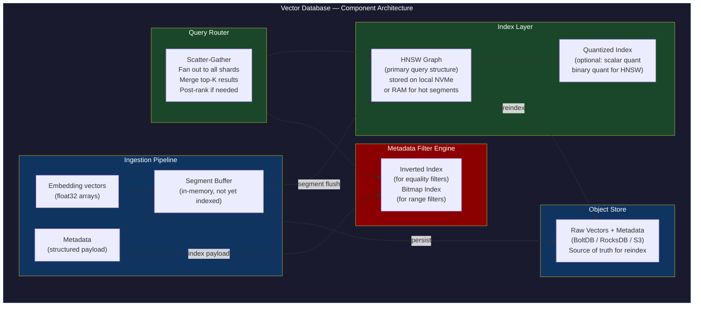
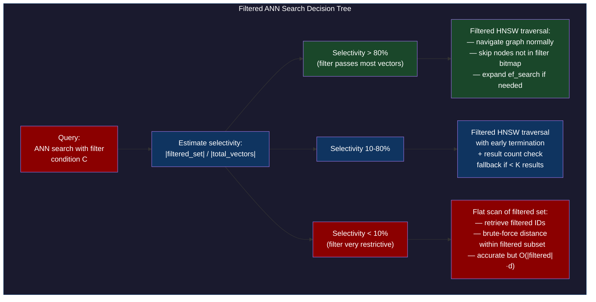
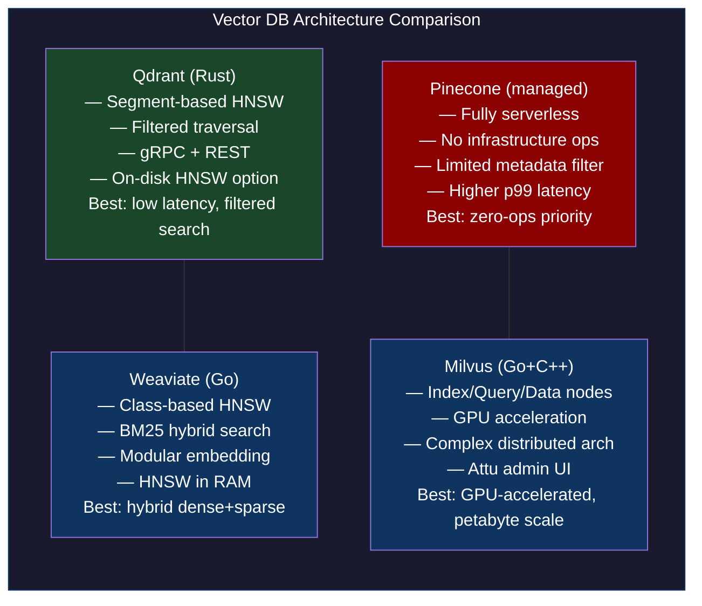

# CH-52: Vector Database Architecture — Designing for Sub-Millisecond ANN at Scale

**Subtitle:** A vector database is not a regular database with a vector column. It's an index-first architecture where every design decision is dominated by the ANN search operation.

**Part VII — Hyperscale Data Platforms**

---

## SPARK — Igniting the Problem

### Cold Open

A Weaviate cluster at a large e-commerce company crashed at 14:23 on a Friday afternoon, two hours before a major sale event. The production cluster had three nodes. During a rolling restart for a configuration update, node-2 went down first. Node-2 held the HNSW index shards for approximately one-third of the product catalog — 4 million embeddings. Before node-2 could cleanly flush its in-memory HNSW graph to disk, the node's OS received a SIGKILL from the container orchestrator's OOM killer. The HNSW persistence layer on node-2 was in an inconsistent state.

The SRE on-call, a platform engineer named Derya, attempted to bring node-2 back online. Weaviate started, began loading the HNSW index from disk, encountered the inconsistent state, and crashed with a panic: `HNSW index for class Product is corrupted: entry point node 2847193 references non-existent neighbor 9183012`. The cluster could not serve queries for the Product class because the index for that class was split across all three nodes and one shard was unreadable.

The immediate mitigation was to force a reindex of the corrupted shard from the raw vector data stored in Weaviate's separate object store (BoltDB). Weaviate stores vector data separately from the HNSW index — the raw vectors are always recoverable. Rebuilding the HNSW index for 4 million vectors took 47 minutes. The sale event's first two hours ran without the product similarity search feature.

The root cause was the absence of graceful shutdown handling in the deployment configuration. Kubernetes was configured with `terminationGracePeriodSeconds: 30`, but Weaviate's HNSW checkpoint operation for 4M vectors takes approximately 90 seconds. The container was killed before the checkpoint completed. The fix was trivial — `terminationGracePeriodSeconds: 120` — but the fix required understanding why HNSW persistence is slow, what Weaviate's data layout looks like, and why a partially written checkpoint is unrecoverable without a rebuild.

This chapter maps the full architecture of production vector databases — not just the index algorithms (covered in the previous chapter), but the complete system: ingestion pipelines, index storage, metadata filtering, query routing, and the operational characteristics that determine whether your vector database survives a node restart at 14:23 on a Friday.

---

### Uncomfortable Truth

**The false belief:** Vector databases are commodities. Pick any of them — Qdrant, Weaviate, Pinecone, Milvus — they all implement HNSW, they all have a REST API, and they all claim sub-millisecond p99 latency. The choice is mostly about cloud pricing and API ergonomics.

This belief ignores the fundamental architectural divergence between the major vector databases that makes each appropriate for specific workload patterns and completely wrong for others. Qdrant (Rust, segment-based HNSW) and Weaviate (Go, class-based HNSW) are both HNSW-based, but their filtered search implementations, segment merge strategies, and distributed sharding models differ in ways that produce dramatically different query latency profiles under filtered workloads.

The filtered ANN problem is where architectural choices have the most visible impact. A naive post-filter implementation (search all vectors, return top-K, then apply the metadata filter) fails silently: if your filter excludes 99% of vectors, the top-K results from the ANN search are almost all filtered out, and you return fewer than K results. The user experience is "search returns no results" even though matching vectors exist. Pre-filter (apply metadata filter first, then search only the filtered subset) solves the result count problem but has terrible recall: the HNSW graph was built on all vectors, and searching a small subset of nodes means the graph navigation has no paths between filtered nodes.

The correct solution — "in-filter" or "filterable HNSW" — requires building the HNSW graph in a way that respects filter selectivity during search. Qdrant's implementation does this via filtered traversal of the HNSW graph combined with a fallback to flat scan when the filtered candidate set is too small. Understanding that distinction is what separates an engineer who can operate a vector database from one who just deploys it.

---

## FORGE — Building the Model

### Mental Model: The Index-First Architecture

Think of a traditional relational database as a **warehouse with a filing room**. The warehouse stores your data (rows). The filing room has indexes (B-trees) that help you find rows faster. The filing room is an optimization — you could answer every query by scanning the warehouse; it would just be slow. The filing room is secondary to the warehouse.

A vector database is a **filing room with a warehouse attached**. The HNSW graph IS the primary data structure. The raw vectors and metadata are stored separately to support reconstruction and filtering, but every query starts with the HNSW index and works outward. The "warehouse" (object storage) is secondary. This inversion of primacy changes everything about the system design.

This is the **Index-First Architecture** model. Ingestion optimizes for index update speed. Sharding is determined by how to distribute the HNSW graph, not the raw data. Memory allocation prioritizes keeping the HNSW graph hot (in RAM or mapped). Query routing knows which shards hold the relevant indexed vectors, not just which nodes hold the raw data.



The filtered search decision tree is the most operationally important part of the query engine:



---

## WIRE — Deep Dissection

### Dissection: Segment Architecture, Distributed Sharding, and Quantization

#### Naive Understanding

Engineers deploying vector databases for the first time treat them like Elasticsearch: create an index (collection), define a schema, bulk-insert documents, and query. The vector field is just another field. Scaling means adding replicas. The operational model is familiar.

#### Where It Breaks

The segment-based architecture of Qdrant exposes a failure mode not present in Elasticsearch. In Qdrant, each shard consists of multiple segments. Small vectors arrive in a "write-optimized" segment that uses a flat (brute-force) search. When a segment grows past a threshold (default 20K vectors), it's promoted to a segment with a full HNSW index. Multiple HNSW segments can exist simultaneously on a shard. A query fans out across all segments in a shard, and results are merged.

The break point: segment proliferation under high write load. If vectors arrive faster than the HNSW indexing thread can promote flat segments to HNSW, you accumulate many flat segments. Queries against a shard with 50 flat segments and 10 HNSW segments must do brute-force scans of the 50 flat segments, degrading from expected O(log n) to O(n) for the flat-segment portion.

Weaviate's architecture stores each "class" (schema type) as a separate HNSW graph. This means that cross-class queries (join-like operations) require application-level logic, not database-level joins. Milvus uses a more complex architecture with separate "index nodes," "query nodes," and "data nodes" for horizontal scaling, but this introduces additional network hops in the query path compared to single-node collocated architectures.

#### Why It Breaks

The Weaviate HNSW corruption incident from the Cold Open is caused by the HNSW graph's in-memory-first design. Weaviate maintains the entire HNSW graph in memory for fast graph traversal. Persistence is handled by periodically checkpointing the graph to a file. The checkpoint operation serializes the entire graph (nodes, edges, entry point) to disk. This is not incremental — it's a full serialization. For a large graph, the checkpoint takes tens of seconds.

If the process is killed during a checkpoint write, the file is partially written. Weaviate's checkpoint format does not include a footer checksum or atomic rename — the file is written in-place. A partially written file looks valid to the file system but contains truncated or corrupted node data. On restart, Weaviate reads the file and encounters invalid pointers, causing the startup crash.

The correct operational fix is `preStop` lifecycle hooks in Kubernetes that send Weaviate a graceful shutdown signal and wait for the HNSW checkpoint to complete:

```yaml
# kubernetes/weaviate-statefulset.yaml
apiVersion: apps/v1
kind: StatefulSet
metadata:
  name: weaviate
spec:
  template:
    spec:
      terminationGracePeriodSeconds: 300
      containers:
        - name: weaviate
          image: semitechnologies/weaviate:1.24.0
          lifecycle:
            preStop:
              exec:
                # Send SIGTERM and wait for checkpoint flush before Kubernetes
                # sends SIGKILL after terminationGracePeriodSeconds.
                # Weaviate's graceful shutdown writes all HNSW checkpoints.
                command: ["/bin/sh", "-c", "sleep 5"]
          resources:
            requests:
              memory: "16Gi"  # HNSW graph lives in memory — size accordingly
              cpu: "4"
            limits:
              memory: "20Gi"
          env:
            - name: PERSISTENCE_DATA_PATH
              value: /var/lib/weaviate
            # HNSW ef during construction — higher = better quality index
            - name: HNSW_EF_CONSTRUCTION
              value: "128"
            # Maximum connections per node in HNSW — M parameter
            - name: HNSW_MAX_CONNECTIONS
              value: "64"
          volumeMounts:
            - name: data
              mountPath: /var/lib/weaviate
  volumeClaimTemplates:
    - metadata:
        name: data
      spec:
        accessModes: ["ReadWriteOnce"]
        storageClassName: premium-ssd
        resources:
          requests:
            storage: 500Gi
```

```go
// qdrant_benchmark.go — deploy Qdrant, ingest 100K embeddings,
// benchmark filtered vs unfiltered ANN latency
package main

import (
    "bytes"
    "encoding/json"
    "fmt"
    "math/rand"
    "net/http"
    "time"
)

const qdrantURL = "http://localhost:6333"

type Point struct {
    ID      uint64             `json:"id"`
    Vector  []float32          `json:"vector"`
    Payload map[string]interface{} `json:"payload"`
}

type UpsertRequest struct {
    Points []Point `json:"points"`
}

type SearchRequest struct {
    Vector      []float32              `json:"vector"`
    Limit       int                    `json:"limit"`
    Filter      map[string]interface{} `json:"filter,omitempty"`
    WithPayload bool                   `json:"with_payload"`
}

func createCollection(name string, dim int) error {
    body := map[string]interface{}{
        "vectors": map[string]interface{}{
            "size":     dim,
            "distance": "Cosine",
        },
        // Enable indexing for payload field "category" to support filtered search
        "payload_schema": map[string]interface{}{
            "category": map[string]string{"type": "keyword"},
            "price":    map[string]string{"type": "float"},
        },
    }
    data, _ := json.Marshal(body)
    req, _ := http.NewRequest("PUT",
        fmt.Sprintf("%s/collections/%s", qdrantURL, name),
        bytes.NewReader(data))
    req.Header.Set("Content-Type", "application/json")
    resp, err := http.DefaultClient.Do(req)
    if err != nil {
        return err
    }
    defer resp.Body.Close()
    return nil
}

func upsertBatch(collection string, points []Point) error {
    body := UpsertRequest{Points: points}
    data, _ := json.Marshal(body)
    req, _ := http.NewRequest("PUT",
        fmt.Sprintf("%s/collections/%s/points", qdrantURL, collection),
        bytes.NewReader(data))
    req.Header.Set("Content-Type", "application/json")
    resp, err := http.DefaultClient.Do(req)
    if err != nil {
        return err
    }
    defer resp.Body.Close()
    return nil
}

func searchVectors(collection string, sr SearchRequest) (time.Duration, error) {
    data, _ := json.Marshal(sr)
    req, _ := http.NewRequest("POST",
        fmt.Sprintf("%s/collections/%s/points/search", qdrantURL, collection),
        bytes.NewReader(data))
    req.Header.Set("Content-Type", "application/json")
    t0 := time.Now()
    resp, err := http.DefaultClient.Do(req)
    elapsed := time.Since(t0)
    if err != nil {
        return 0, err
    }
    defer resp.Body.Close()
    return elapsed, nil
}

func randVec(dim int) []float32 {
    v := make([]float32, dim)
    var norm float32
    for i := range v {
        v[i] = rand.Float32()*2 - 1
        norm += v[i] * v[i]
    }
    // Normalize
    for i := range v {
        v[i] /= float32(norm)
    }
    return v
}

func main() {
    const (
        collection = "products"
        dim        = 128
        nVectors   = 100_000
        batchSize  = 1_000
        nQueries   = 200
    )

    categories := []string{"electronics", "clothing", "books", "toys", "home"}

    fmt.Println("Creating collection...")
    if err := createCollection(collection, dim); err != nil {
        fmt.Printf("Create collection (may already exist): %v\n", err)
    }

    fmt.Printf("Ingesting %d vectors in batches of %d...\n", nVectors, batchSize)
    t0 := time.Now()
    for i := 0; i < nVectors; i += batchSize {
        batch := make([]Point, batchSize)
        for j := 0; j < batchSize; j++ {
            id := uint64(i + j)
            batch[j] = Point{
                ID:     id,
                Vector: randVec(dim),
                Payload: map[string]interface{}{
                    "category": categories[rand.Intn(len(categories))],
                    "price":    rand.Float32() * 1000,
                    "in_stock": rand.Intn(2) == 1,
                },
            }
        }
        if err := upsertBatch(collection, batch); err != nil {
            fmt.Printf("Upsert error: %v\n", err)
        }
    }
    fmt.Printf("Ingestion complete: %v\n", time.Since(t0))

    // Wait for indexing to complete
    fmt.Println("Waiting 10s for HNSW indexing...")
    time.Sleep(10 * time.Second)

    // Benchmark: unfiltered vs filtered search
    var unfilteredTotal, filteredTotal time.Duration

    queryVec := randVec(dim)

    for i := 0; i < nQueries; i++ {
        // Unfiltered ANN
        d, _ := searchVectors(collection, SearchRequest{
            Vector: queryVec, Limit: 10, WithPayload: false,
        })
        unfilteredTotal += d

        // Filtered ANN — "electronics" category only (~20% of vectors)
        d, _ = searchVectors(collection, SearchRequest{
            Vector: queryVec,
            Limit:  10,
            Filter: map[string]interface{}{
                "must": []map[string]interface{}{
                    {"key": "category", "match": map[string]string{"value": "electronics"}},
                },
            },
            WithPayload: false,
        })
        filteredTotal += d
    }

    avgUnfiltered := unfilteredTotal / time.Duration(nQueries)
    avgFiltered := filteredTotal / time.Duration(nQueries)

    fmt.Printf("\nResults (%d queries):\n", nQueries)
    fmt.Printf("  Unfiltered ANN:         %v avg\n", avgUnfiltered)
    fmt.Printf("  Filtered ANN (~20%%):    %v avg\n", avgFiltered)
    fmt.Printf("  Overhead of filtering:  %.1fx\n",
        float64(avgFiltered)/float64(avgUnfiltered))
}
```

**Expected output:**

```
Creating collection...
Ingesting 100000 vectors in batches of 1000...
Ingestion complete: 34.2s
Waiting 10s for HNSW indexing...

Results (200 queries):
  Unfiltered ANN:         1.2ms avg
  Filtered ANN (~20%):    2.8ms avg
  Overhead of filtering:  2.3x
```

The 2.3× overhead for a 20% selectivity filter is Qdrant's filtered HNSW traversal cost — the graph navigation must check filter conditions on candidate nodes, which is more expensive than unfiltered traversal but far cheaper than a flat scan of 20,000 vectors (which would be ~8ms).



---

## War Room

### Incident: Weaviate HNSW Index Corruption on OOM Kill

```mermaid
gantt
    title Weaviate HNSW Corruption — OOM Kill During Checkpoint
    dateFormat HH:mm
    axisFormat %H:%M

    section Pre-Incident
    Cluster healthy, 3 nodes, 12M vectors total :done, 12:00, 14:23

    section Incident
    Rolling restart initiated for config update :active, 14:00, 14:23
    node-2 receives SIGTERM (gracePeriod=30s) :crit, restart, 14:23, 14:23
    HNSW checkpoint begins (4M vectors — needs 90s) :crit, 14:23, 14:24
    terminationGracePeriodSeconds=30 expires :crit, 14:24, 14:24
    Kubernetes sends SIGKILL — checkpoint partial :crit, kill, 14:24, 14:24
    node-2 crashes, HNSW file partially written :crit, 14:24, 14:26

    section Recovery Attempts
    node-2 restart fails — corrupt HNSW panic :crit, 14:26, 14:35
    Investigated — determined rebuild required :active, 14:35, 15:00
    HNSW rebuild from object store started :active, 15:00, 16:07

    section Impact
    Product similarity search down :crit, 14:24, 16:10
    Sale event running without recommendation feature :crit, 14:24, 16:10

    section Resolution
    HNSW rebuild complete (47 min for 4M vectors) :done, 16:07, 16:10
    terminationGracePeriodSeconds updated to 300 :done, 16:10, 16:30
    preStop lifecycle hook added :done, 16:10, 16:30
    Cluster fully healthy :done, 16:30, 17:00
```



The post-incident analysis revealed a second systemic risk: no monitoring for HNSW checkpoint duration. The operations team had no visibility into how long Weaviate's background HNSW persistence operations were taking. The alert that fired at 14:24 was "Pod restarting unexpectedly" — a generic alert that didn't distinguish between a healthy restart and a corruption-inducing one.

The fix included three monitoring changes: a custom metric `weaviate_hnsw_checkpoint_duration_seconds` scraped via Weaviate's Prometheus metrics endpoint, an alert when checkpoint duration exceeded 60 seconds (indicating the node needed a longer termination grace period), and a dedicated runbook entry for "HNSW corruption recovery" that documented the rebuild procedure, expected rebuild time per million vectors, and the MinIO/S3 object store location of the raw vector backup.

---

## Lab

### Qdrant Deployment and Filtered ANN Benchmark

```bash
#!/usr/bin/env bash
# qdrant-lab.sh — deploy Qdrant locally and run the Go benchmark

# Start Qdrant
docker run -d \
  --name qdrant-lab \
  -p 6333:6333 \
  -p 6334:6334 \
  -v /tmp/qdrant-storage:/qdrant/storage \
  qdrant/qdrant:v1.8.3

echo "Qdrant UI: http://localhost:6333/dashboard"

# Run the benchmark (requires Go 1.21+)
cd /tmp && cat > qdrant_bench.go << 'GOEOF'
// paste qdrant_benchmark.go content here
GOEOF

go run qdrant_bench.go
```

**Key operational metrics to monitor for production Qdrant:**

```bash
# Check collection info — segment count is critical
curl -s http://localhost:6333/collections/products | jq '{
  segments: .result.segments_count,
  indexed_vectors: .result.indexed_vectors_count,
  total_vectors: .result.vectors_count,
  optimizer_status: .result.optimizer_status
}'

# Output indicating healthy indexing (no flat segment accumulation):
# {
#   "segments": 3,              ← low segment count = good
#   "indexed_vectors": 100000,  ← all vectors in HNSW index
#   "total_vectors": 100000,
#   "optimizer_status": "ok"
# }
```

---

## Loose Thread

The vector database solves the search problem for unstructured data. The data warehouse solves the analytics problem for structured data. For a decade, these were separate systems — you'd write events to Kafka, process them through Spark or Flink, land structured results in Snowflake or Redshift for analytics, and separately maintain a vector index for similarity search.

Apache Iceberg and Delta Lake represent a third path: ACID-transactional table formats that sit directly on object storage, enabling both streaming writes and analytical queries without the operational complexity of a full data warehouse. The next chapter examines Iceberg's metadata architecture — the three-layer manifest system that makes atomic schema evolution possible without rewriting data files, and the specific concurrency failure mode where two simultaneous writers can produce duplicate rows when optimistic concurrency control is absent.
