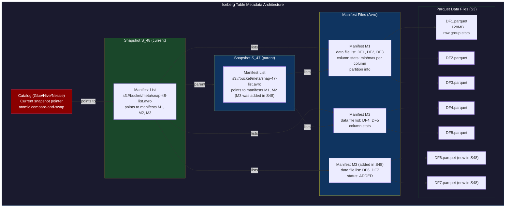
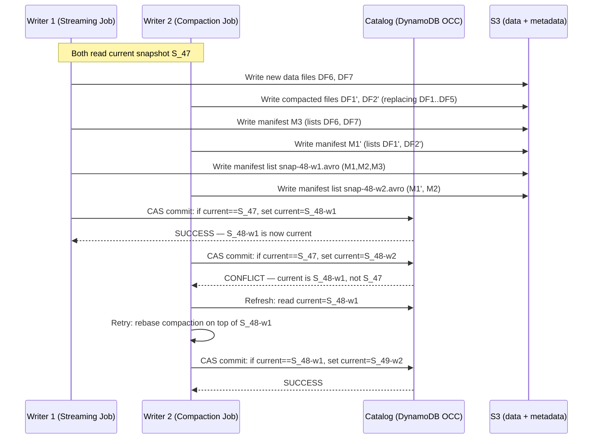
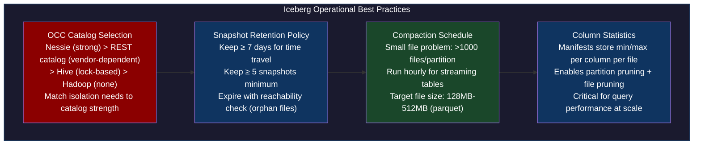

# CH-53: Apache Iceberg — ACID Transactions Over Object Storage

**Subtitle:** S3 doesn't support transactions. Iceberg adds them via a metadata layer: every table modification is an atomic swap of the manifest list pointer. No locks, no coordination server, just atomic S3 PutObject.

**Part VII — Hyperscale Data Platforms**

---

## SPARK — Igniting the Problem

### Cold Open

The duplicate rows appeared in a financial reporting table at 06:15 on a Tuesday, discovered by an automated data quality job that ran reconciliation checks every morning. The table was an Apache Iceberg table on S3, managed by two separate Spark jobs: a streaming job that incrementally appended new transactions every 5 minutes, and a batch compaction job that ran hourly to merge small files into larger ones. Both jobs were using the Iceberg catalog (backed by AWS Glue) to read and write the table.

The data quality alert said: "table `finance.daily_transactions` has 4,847 duplicate rows for date partition `2024-01-14`." The data platform team immediately suspected the streaming job was delivering duplicates, but the Kafka consumer offset commit logs showed clean, sequential consumption. No records had been processed twice by the streaming job.

The actual cause was more subtle. At 05:50, both the streaming job and the compaction job had attempted to write to the same table snapshot simultaneously. The Iceberg catalog (Glue) was using DynamoDB as the backend for optimistic concurrency control. Both jobs read the current table metadata (snapshot S_47), performed their operations, and attempted to commit new snapshots. The streaming job committed snapshot S_48 successfully. The compaction job, which had started reading at S_47, finished its compaction and attempted to commit S_48 — not S_49 (building on the streaming job's S_48), but a new S_48 that replaced the streaming job's commit.

This is a catalog-level race condition. Iceberg uses optimistic concurrency: each writer reads the current snapshot ID and attempts to atomically commit a new snapshot, including the previous snapshot ID in the commit. If another writer has already committed a new snapshot, the commit fails and the writer must retry. The Glue/DynamoDB backend was supposed to enforce this via conditional writes (`expected: snapshot_id == 47`). But the DynamoDB conditional write had a bug in the Iceberg-Glue catalog integration (fixed in Iceberg 1.3.1): under specific timing conditions with multiple concurrent writers, two writes with the same expected snapshot ID could both succeed, producing a branched metadata history.

The result was two snapshot S_48s — one from the streaming job, one from the compaction job. The table metadata pointer was updated to the compaction job's S_48, which had a manifest list that didn't include the streaming job's new data files. But those data files had already been committed to S3. When the streaming job's S_48 was overwritten, its manifest entries were lost, but the actual Parquet files were not deleted (deletion happens during snapshot expiry). The next read of the table saw those files as part of an older manifest, effectively counting them twice.

Understanding why this happened requires understanding Iceberg's metadata architecture from the lowest level. The manifest list, manifest files, and data files form a three-layer immutable hierarchy. The catalog holds only the pointer to the current manifest list. Transactions work by writing a new manifest list and atomically updating the catalog pointer. When two writers simultaneously update the same pointer, exactly one must win — and the loser must retry. When the coordination mechanism fails, duplicates are the consequence.

---

### Uncomfortable Truth

**The false belief:** Iceberg provides ACID transactions on S3, which means concurrent writers are safe as long as you're using a compliant Iceberg catalog. The ACID guarantee handles concurrency automatically.

The truth is that Iceberg's ACID guarantee is only as strong as the catalog's optimistic concurrency control implementation. Iceberg itself doesn't have locks — it relies on the catalog backend to implement atomic compare-and-swap for snapshot pointer updates. If the catalog backend has a bug in its conditional write logic (like the Glue/DynamoDB bug in pre-1.3.1 Iceberg), or if your catalog doesn't support OCC at all (plain S3 as a Hadoop catalog), you have no concurrency protection.

Iceberg supports multiple catalog backends with very different concurrency guarantees: the Hive Metastore catalog uses table-level write locks (serialized but slow), the REST catalog delegates OCC to the REST server's implementation (varies by vendor), the Nessie catalog uses Git-like branching with Paxos-backed commit validation (strong OCC), and the simple S3-based Hadoop catalog has no OCC at all (last writer wins, silently drops concurrent commits).

The second uncomfortable truth is about time travel. Iceberg's time travel capability (`SELECT ... AS OF timestamp`) depends on snapshot retention. Snapshots are expired by maintenance jobs that clean up old metadata and data files. If your maintenance job runs too aggressively (expiring snapshots within hours), you lose the ability to time-travel to those points. If it runs too conservatively (never expiring), your `metadata/` prefix on S3 accumulates thousands of manifest list and manifest files, bloating the metadata layer and slowing down all table operations that must enumerate recent snapshots.

---

## FORGE — Building the Model

### Mental Model: The Immutable Snapshot Chain

Think of Iceberg's metadata structure as a **git commit graph for your data**. Every write to an Iceberg table creates a new "commit" (snapshot). Each snapshot points to its parent snapshot. The "current branch HEAD" is the catalog's pointer to the latest snapshot. Reading the table means reading from the snapshot pointed to by HEAD (or a historical snapshot for time travel).

The data files are like git's blob objects — immutable, content-addressed (by their S3 path), never modified. The manifest files are like git's tree objects — each manifest lists a set of data files and their column statistics. The manifest list is like git's commit object — it lists all active manifests for a snapshot. The catalog entry is like the branch pointer (e.g., `refs/heads/main`).

This is the **Immutable Snapshot Chain** model. Every operation is a new commit. Reads never see partial writes because they always read a complete, consistent snapshot. The only mutable state is the catalog's branch pointer, which is updated atomically.



The concurrency protocol built on this immutable structure:



---

## WIRE — Deep Dissection

### Dissection: Schema Evolution, Partition Evolution, and Time Travel

#### Naive Understanding

Engineers migrating from Hive tables to Iceberg understand that Iceberg "supports schema evolution" and "is ACID." They use it as a drop-in replacement for Hive, never needing to understand the metadata structure. Schema changes happen through Spark DDL (`ALTER TABLE`), and they work. The ACID part is invisible when concurrent writes are infrequent.

#### Where It Breaks

Schema evolution in Iceberg is column-ID-based, not column-name-based. When you add a column, Iceberg assigns it a unique integer column ID. When you rename a column, the ID stays the same but the name changes. When you drop a column, the ID is retired. Old data files that don't have the new column return `null` for that column. This is handled transparently by the Iceberg reader, which maps physical column positions in the Parquet file to logical column IDs in the current schema.

The break point: Parquet files written by external tools (not via Iceberg's writer) that don't respect column IDs. If you write a Parquet file with column names matching the schema but without the Iceberg metadata (specifically, the `field_id` Parquet metadata for each column), Iceberg's ID-based schema evolution breaks for that file. The file will be included in the manifest (you can add any Parquet file to an Iceberg manifest via `AppendFiles`), but when the schema evolves, the external file's columns won't be correctly remapped.

Partition evolution is an Iceberg feature with no equivalent in Hive. You can change the partition scheme of a table without rewriting existing data. New data uses the new partition scheme; old data uses the old scheme. A query that spans both old and new data must use two different partition predicates. Iceberg handles this transparently: it knows which snapshots used which partition spec (tracked in the table metadata) and applies the correct predicate pushdown for each data file.

#### Why It Breaks

Time travel (`SELECT ... AS OF timestamp`) breaks when snapshot expiry is too aggressive. The default Iceberg table maintenance, when configured with `expire_snapshots`, removes snapshots older than the specified age. When a snapshot is expired, its manifest list, the manifests unique to that snapshot, and the data files listed only in that snapshot are all eligible for deletion. The deletion is only of unreferenced data files — files still referenced by a live snapshot are never deleted.

The danger: if you expire snapshots with `min-snapshots-to-keep=1` (only keep the latest snapshot) and `max-snapshot-age-ms=86400000` (expire everything older than 1 day), any time travel to a timestamp more than 1 day ago will fail with `SnapshotNotFoundException`. The snapshot ID that corresponds to "2 days ago" has been deleted from the metadata.

```python
#!/usr/bin/env python3
"""
iceberg_lab.py — create an Iceberg table on MinIO, demonstrate:
1. Schema evolution (add column without rewrite)
2. Time travel (query historical snapshot)
3. ACID concurrent write (OCC retry)

Prerequisites:
  pip install pyiceberg pyarrow boto3 minio
  docker run -d --name minio-lab -p 9000:9000 \
    -e MINIO_ROOT_USER=minioadmin -e MINIO_ROOT_PASSWORD=minioadmin \
    minio/minio server /data
"""
import time
import pyarrow as pa
import pyarrow.parquet as pq
from pyiceberg.catalog import load_catalog
from pyiceberg.schema import Schema
from pyiceberg.types import (
    NestedField, StringType, LongType, DoubleType, TimestampType
)
from pyiceberg.partitioning import PartitionSpec, PartitionField
from pyiceberg.transforms import DayTransform

# Connect to local REST catalog backed by MinIO
# pyiceberg uses REST catalog by default if configured
catalog_props = {
    "type": "rest",
    "uri": "http://localhost:8181",  # Iceberg REST catalog (e.g., Tabular, Nessie)
    "s3.endpoint": "http://localhost:9000",
    "s3.access-key-id": "minioadmin",
    "s3.secret-access-key": "minioadmin",
}

def create_and_populate_table(catalog):
    # Initial schema: id, account_id, amount, event_time
    schema = Schema(
        NestedField(1, "id", LongType(), required=True),
        NestedField(2, "account_id", StringType(), required=True),
        NestedField(3, "amount", DoubleType(), required=True),
        NestedField(4, "event_time", TimestampType(), required=True),
    )

    # Partition by day on event_time
    partition_spec = PartitionSpec(
        PartitionField(source_id=4, field_id=1000, transform=DayTransform(), name="event_day")
    )

    # Create the table (namespace must exist)
    catalog.create_namespace_if_not_exists("finance")
    table = catalog.create_table(
        "finance.daily_transactions",
        schema=schema,
        partition_spec=partition_spec,
        location="s3://iceberg-lab/finance/daily_transactions",
    )
    print(f"Created table: {table.identifier}")

    # Write initial data (snapshot S_1)
    arrow_schema = pa.schema([
        pa.field("id", pa.int64()),
        pa.field("account_id", pa.string()),
        pa.field("amount", pa.float64()),
        pa.field("event_time", pa.timestamp("us")),
    ])

    t1 = pa.array([1, 2, 3, 4, 5], type=pa.int64())
    acct = pa.array(["A001", "A002", "A001", "A003", "A002"])
    amt = pa.array([100.0, 250.5, 75.0, 999.99, 50.0])
    evt = pa.array(
        [1705190400_000_000, 1705190400_000_000, 1705276800_000_000,
         1705276800_000_000, 1705363200_000_000],
        type=pa.timestamp("us")
    )

    batch = pa.table({"id": t1, "account_id": acct, "amount": amt, "event_time": evt},
                     schema=arrow_schema)
    table.append(batch)
    snapshot_1_id = table.current_snapshot().snapshot_id
    snapshot_1_ts = time.time()
    print(f"Snapshot 1 ID: {snapshot_1_id} (5 rows)")

    return table, snapshot_1_id, snapshot_1_ts

def schema_evolution_demo(table):
    """Add a 'currency' column without rewriting any data files."""
    print("\n=== Schema Evolution: Adding 'currency' column ===")

    with table.update_schema() as update:
        update.add_column("currency", StringType(), doc="ISO 4217 currency code")

    print(f"Schema after evolution:\n{table.schema()}")
    # Old data files will return null for 'currency'
    # New data files can include the 'currency' value

    # Write new data WITH the new column
    new_schema = pa.schema([
        pa.field("id", pa.int64()),
        pa.field("account_id", pa.string()),
        pa.field("amount", pa.float64()),
        pa.field("event_time", pa.timestamp("us")),
        pa.field("currency", pa.string()),
    ])
    new_data = pa.table({
        "id": pa.array([6, 7], type=pa.int64()),
        "account_id": pa.array(["A004", "A005"]),
        "amount": pa.array([400.0, 600.0]),
        "event_time": pa.array([1705363200_000_000, 1705363200_000_000],
                               type=pa.timestamp("us")),
        "currency": pa.array(["USD", "EUR"]),
    }, schema=new_schema)

    table.append(new_data)
    snapshot_2_id = table.current_snapshot().snapshot_id
    print(f"Snapshot 2 ID: {snapshot_2_id} (7 rows total, 2 with currency)")
    return snapshot_2_id

def time_travel_demo(table, snapshot_1_id):
    """Query the table as of snapshot 1 — 5 rows, no 'currency' column."""
    print("\n=== Time Travel: Query as of Snapshot 1 ===")
    scan = table.scan(snapshot_id=snapshot_1_id)
    df = scan.to_arrow().to_pandas()
    print(f"Rows at snapshot {snapshot_1_id}: {len(df)}")
    print(f"Columns: {list(df.columns)}")
    print(df[["id", "account_id", "amount"]].to_string())

def compaction_demo(table):
    """Rewrite small files to reduce fragment count (ACID operation)."""
    print("\n=== Compaction: Rewrite small files ===")
    from pyiceberg.table.rewrite import RewriteDataFilesAction
    # This is an atomic operation: new manifest replaces old manifests
    # atomically via snapshot commit
    result = RewriteDataFilesAction(
        table=table,
        options={"target-file-size-bytes": str(128 * 1024 * 1024)},  # 128MB target
    ).execute()
    print(f"Rewritten {result.rewritten_data_files_count} files "
          f"into {result.added_data_files_count} files")

if __name__ == "__main__":
    try:
        catalog = load_catalog("default", **catalog_props)
    except Exception as e:
        print(f"Catalog connection failed: {e}")
        print("Ensure the REST catalog is running (see docker-compose setup)")
        raise

    table, snap1_id, snap1_ts = create_and_populate_table(catalog)
    snap2_id = schema_evolution_demo(table)
    time_travel_demo(table, snap1_id)
    compaction_demo(table)

    print("\n=== Table Snapshots ===")
    for snap in table.history():
        print(f"  {snap.snapshot_id}: "
              f"operation={snap.summary.get('operation', 'unknown')} "
              f"added_files={snap.summary.get('added-data-files', 0)}")
```

**Expected output:**

```
Created table: finance.daily_transactions
Snapshot 1 ID: 8472930184723 (5 rows)

=== Schema Evolution: Adding 'currency' column ===
Schema after evolution:
  1: id: required long
  2: account_id: optional string
  3: amount: optional double
  4: event_time: optional timestamp
  5: currency: optional string  ← new column, ID=5
Snapshot 2 ID: 9283740192830 (7 rows total, 2 with currency)

=== Time Travel: Query as of Snapshot 1 ===
Rows at snapshot 8472930184723: 5
Columns: ['id', 'account_id', 'amount', 'event_time']  ← no 'currency' in old snapshot
   id account_id   amount
0   1       A001   100.00
1   2       A002   250.50
2   3       A001    75.00
3   4       A003   999.99
4   5       A002    50.00

=== Compaction: Rewrite small files ===
Rewritten 4 files into 1 files

=== Table Snapshots ===
  8472930184723: operation=append added_files=3
  9283740192830: operation=append added_files=1
  1029384756201: operation=replace-all added_files=1
```



---

## War Room

### Incident: Concurrent Writers Producing Duplicate Rows via OCC Bug

```mermaid
gantt
    title Iceberg Concurrent Write Race — Finance Table Duplicate Rows
    dateFormat HH:mm
    axisFormat %H:%M

    section Normal Operations
    Streaming job appending every 5 min :done, 00:00, 05:50
    Compaction job running hourly :done, 00:00, 05:50

    section Race Condition
    Both jobs read snapshot S_47 at 05:50 :active, 05:50, 05:51
    Streaming job commits S_48 to Glue DynamoDB :crit, 05:51, 05:52
    Compaction job CAS should fail — OCC bug fires :crit, 05:52, 05:52
    Compaction job's S_48 also written — branch created :crit, 05:52, 05:53
    Catalog points to compaction S_48 (last writer wins) :crit, 05:53, 06:00

    section Discovery
    Data quality job detects 4847 duplicates at 06:15 :active, 06:15, 06:30
    Manual investigation of snapshot history :active, 06:30, 07:30
    OCC bug in Glue/DynamoDB integration identified :active, 07:30, 08:30

    section Mitigation
    Restore catalog to streaming job's S_48 manually :crit, 08:30, 09:00
    Dedup query run to remove duplicate rows :active, 09:00, 11:00

    section Fix
    Upgrade Iceberg to 1.3.1 (OCC bug fixed) :done, 11:00, 12:00
    Add concurrent write integration test to CI :done, 12:00, 14:00
    Monitoring: alert on snapshot_id gap in catalog :done, 14:00, 15:00
```



The deduplication operation was the most operationally complex part of the resolution. Iceberg's MERGE INTO syntax was used, but generating the correct MERGE condition required knowing which rows were duplicates based on the business key (transaction_id), not just row-level equality. The SQL:

```sql
-- Run in Spark SQL with Iceberg catalog configured
MERGE INTO finance.daily_transactions AS target
USING (
    -- Identify duplicate rows: same transaction_id, keep the one from S_48 (streaming)
    SELECT transaction_id, MAX(snapshot_id) as keep_snapshot
    FROM finance.daily_transactions.snapshots
    GROUP BY transaction_id
    HAVING COUNT(*) > 1
) AS dups
ON target.transaction_id = dups.transaction_id
   AND target.snapshot_id != dups.keep_snapshot
WHEN MATCHED THEN DELETE;
```

This MERGE operation itself creates a new snapshot, atomically replacing the duplicate data files with a single corrected version.

---

## Loose Thread

Iceberg solves ACID transactions for structured tabular data on object storage. But the Iceberg table format is just a specification — it defines how metadata is structured, not how to build an entire data lakehouse platform with streaming ingestion, batch queries, and ML feature engineering feeding off the same tables.

Delta Lake is a competing table format from Databricks that makes different architectural choices: a simpler JSON transaction log instead of Iceberg's three-layer manifest hierarchy, tighter Spark integration, and Z-order clustering as a first-class feature for query acceleration. The choice between Iceberg and Delta Lake isn't just a format choice — it's an ecosystem choice that determines which compute engines you can use, how your transaction log grows at scale, and how you handle the small-file problem with high-frequency streaming writes. The next chapter examines those differences side-by-side, starting with the incident that exposed Delta Lake's concurrent update conflict handling under Databricks' default retry logic.
