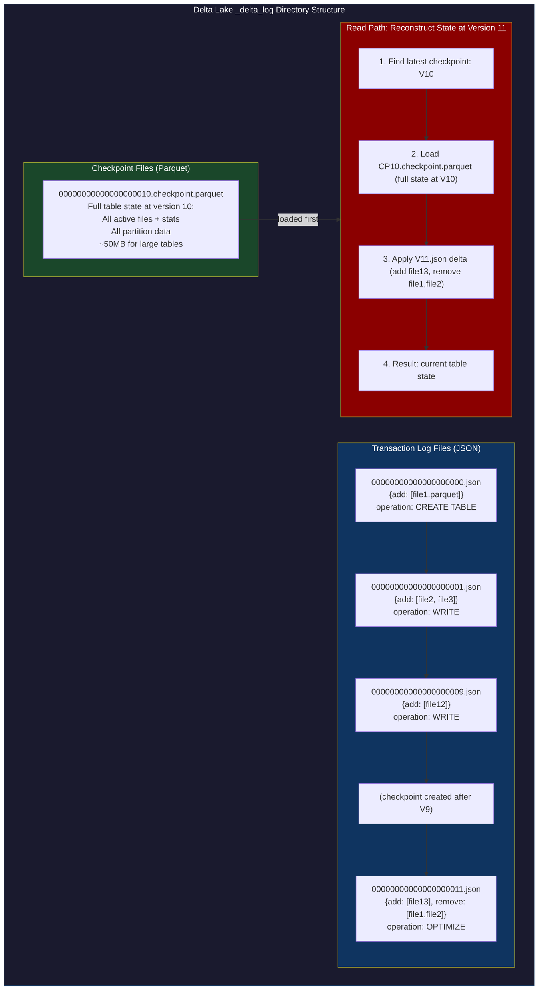
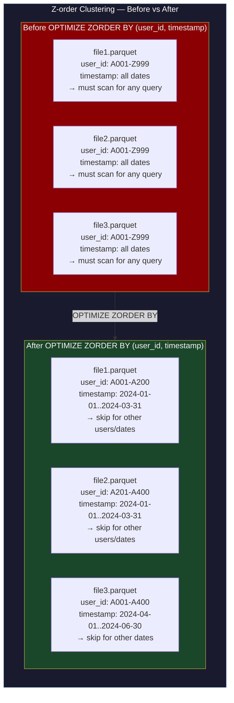
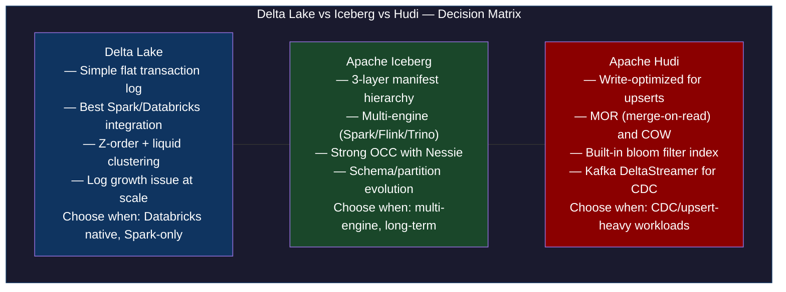

# CH-54: Delta Lake and the Data Lakehouse Architecture

**Subtitle:** The data warehouse is too rigid. The data lake is too chaotic. The lakehouse is both: ACID transactions and SQL on cheap object storage with the flexibility of raw files.

**Part VII — Hyperscale Data Platforms**

---

## SPARK — Igniting the Problem

### Cold Open

The Databricks job had been running for 47 minutes and had just been killed. The error in the Databricks UI read: `ConcurrentAppendException: Files were added to the root of the table by a concurrent update. Please retry your operation.` It was the third time this week the same job had failed. The job was an upsert operation: a daily data correction job that ran a MERGE statement against a Delta table, updating ~50K rows based on a correction file from the upstream data provider.

The table being merged was the `user_profiles` table — 200 million rows, 120 columns, partitioned by `signup_date`. The merge job ran at 22:00 UTC every night. The conflict was with a separate streaming job that appended new user events to the same table in micro-batches every 30 seconds. Both jobs were running in the same Databricks workspace, both had write access to the same Delta table, and nobody had configured them to avoid concurrent writes.

The platform engineer on call, Kiran, looked at the error and did what most engineers do: added retry logic. The retry added `MERGE INTO ... WHEN NOT MATCHED THEN INSERT ... WHEN MATCHED THEN UPDATE ...` wrapped in a loop with exponential backoff. Three retries with 5-minute backoff. The first retry attempt also failed. The second retry attempt succeeded — the streaming job happened to have a 10-minute gap in its micro-batch schedule due to an upstream Kafka lag. But Kiran had introduced a new problem: the merge job now took up to 67 minutes (47 original + 5 + 10 + 5 retry delays). Business users expected the correction data to be available by 23:00 UTC. With retries, it was arriving at 01:07 UTC.

The root cause was an architectural mismatch: a batch MERGE operation and a streaming append operation sharing a Delta table without isolation planning. Delta Lake uses optimistic concurrency control, and the default conflict resolution for MERGE is to retry when there's a conflict. But the merge conflict detection in Delta Lake is at the partition level: if the streaming job appends to ANY partition, and the merge job reads the transaction log to determine which files to scan, the merge job sees the streaming job's new files and considers it a conflict — even if the merge is only touching partitions that the streaming job hasn't touched.

The correct solution was partition isolation: configure the streaming job to only write to a "staging" partition, and run the merge from staging to the main table in a separate coordinated step. Or use Delta Lake's `OPTIMIZE` command to compact files before the merge, reducing the number of files the merge must scan, making the window for conflicts shorter. Or — the cleanest solution — switch the nightly correction to a `REPLACERANGE` operation on specific date partitions, which doesn't conflict with streaming appends to other partitions.

This chapter explains why Delta Lake's concurrency model produces these failures, what the `_delta_log` directory actually contains, and how Z-order clustering changes the data layout in ways that affect both query performance and conflict patterns.

---

### Uncomfortable Truth

**The false belief:** Delta Lake and Apache Iceberg are functionally equivalent open table formats. You can pick either one based on whether your team prefers Python (Iceberg) or Spark (Delta), and the operational behavior will be similar. The main difference is ecosystem lock-in.

This belief ignores a critical structural difference: Delta Lake's transaction log is a flat sequence of JSON files in `_delta_log/`. Every transaction appends a new JSON file with a sequential version number (`00000000000000000042.json`). Reading the table requires reading every transaction log entry since the last checkpoint to reconstruct the current state. For a high-frequency streaming table with 100 micro-batches per hour, the transaction log accumulates 2,400 log files per day. After a week, reconstructing the current table state requires reading 16,800 log files before the most recent checkpoint.

Checkpoints in Delta Lake are Parquet files written every 10 log entries (configurable). Each checkpoint contains the full current state of the table as a Parquet file. Reading the table requires reading the latest checkpoint plus any log entries after it. But the checkpoint interval is per-commit, not per-time: if you have 100 micro-batches per hour, you get 10 checkpoints per hour, and each checkpoint is a full Parquet serialization of the entire table state. For a table with 10 million data files across 500 partitions, each checkpoint is a large Parquet file that must be written and read in full.

Iceberg's manifest-based hierarchy avoids this flat log accumulation: each snapshot only records what changed (new manifests), not the full state. At table scale, this architectural difference produces dramatically different metadata operation performance.

---

## FORGE — Building the Model

### Mental Model: The Append-Only Transaction Journal

Think of Delta Lake's `_delta_log` as a **bank account statement ledger**. Each transaction creates a new line in the ledger: "added these files, removed these files, changed these column statistics." The current account balance (table state) is computed by replaying the ledger from the last balance sheet (checkpoint).

The balance sheet (checkpoint) is periodic snapshot of the full account state — all current files, all current partitions, all column statistics. Reading the account balance means reading the last balance sheet plus all ledger entries since then. Writing to the account means appending a new ledger entry.

This is the **Append-Only Transaction Journal** model. The ledger is immutable (log entries are never modified or deleted). The balance sheet is a performance optimization, not a source of truth. Correctness derives from the ledger. Performance derives from how frequently you create balance sheets.



Z-order clustering changes the physical layout of data files to co-locate related data, enabling file-level data skipping:



---

## WIRE — Deep Dissection

### Dissection: Transaction Log Growth, Z-Order, and Concurrent Updates

#### Naive Understanding

Engineers who use Delta Lake via Databricks notebooks rarely see the `_delta_log` directory directly. They run `df.write.format("delta").mode("append").save(path)`, they run `OPTIMIZE tableName ZORDER BY (col1)`, and the table "just works." The transaction log is an implementation detail hidden behind the Delta API.

#### Where It Breaks

Transaction log growth is the first production failure mode. A table with 1 micro-batch every 30 seconds produces 2 log entries per minute, 120 per hour, 2,880 per day. With the default checkpoint interval of 10, that's 288 checkpoints per day. Each checkpoint is a full Parquet serialization of the table's current file list. For a table with 50,000 active files (common for large tables with many small partitions), each checkpoint Parquet file is 20-50MB. That's 6-14GB of checkpoint files per day for the metadata alone.

The break point: when the table's metadata prefix on S3 accumulates hundreds of thousands of log and checkpoint files, the S3 LIST operation used by Delta to find the latest checkpoint becomes slow. S3 LIST is limited to 1,000 objects per call and takes ~10ms per call. Listing 10,000 checkpoint files takes 100 LIST calls and ~1 second just to find the latest checkpoint, before any actual data reading begins. For an application that opens a Delta table on every request, this adds 1-2 seconds of cold-start latency per query.

The fix is aggressive metadata compaction: set `delta.checkpointInterval=1` (checkpoint after every commit, replacing the cumulative log with a single Parquet file) for high-frequency streaming tables, and run `VACUUM` regularly to delete old log entries and checkpoint files.

#### Why It Breaks

The concurrent update conflict is more nuanced than it appears. Delta Lake's conflict detection operates at the file granularity: if Transaction A reads a set of files to process, and Transaction B adds or removes files from that set before Transaction A commits, Transaction A gets a conflict. The conflict is not about the same rows being modified — it's about the same file metadata being modified.

For a MERGE operation, Delta reads ALL files in the table to find files that might contain rows matching the merge condition (using column statistics for pruning). If the merge's predicate doesn't fully match the partitioning scheme, Delta cannot prune to a subset of files and must read the full transaction log to determine the current file set. During the merge's execution, if any append (even to an unrelated partition) adds new files to the transaction log, the merge sees a conflict when it tries to commit.

```python
#!/usr/bin/env python3
"""
delta_lake_lab.py — PySpark + Delta Lake on a local laptop
Demonstrates: Z-order, time travel, and ACID MERGE
Prerequisites:
  pip install pyspark delta-spark
  Java 11+ must be in PATH
"""
from pyspark.sql import SparkSession
from pyspark.sql.functions import col, lit, current_timestamp, rand
from delta import configure_spark_with_delta_pip
import pyspark.sql.functions as F

# Configure Spark with Delta Lake
builder = SparkSession.builder \
    .appName("DeltaLakeLab") \
    .config("spark.sql.extensions", "io.delta.sql.DeltaSparkSessionExtension") \
    .config("spark.sql.catalog.spark_catalog",
            "org.apache.spark.sql.delta.catalog.DeltaCatalog") \
    .config("spark.sql.shuffle.partitions", "8") \
    .master("local[4]")

spark = configure_spark_with_delta_pip(builder).getOrCreate()
spark.sparkContext.setLogLevel("ERROR")

TABLE_PATH = "/tmp/delta-lab/user_events"

def create_initial_table():
    """Create Delta table with 100K rows across 5 date partitions."""
    print("=== Creating initial Delta table ===")

    data = spark.range(100_000).select(
        col("id"),
        (col("id") % 1000).cast("string").alias("user_id"),
        F.date_add(F.lit("2024-01-01"), (col("id") % 30).cast("int")).alias("event_date"),
        (F.rand() * 1000).alias("amount"),
        F.lit("purchase").alias("event_type"),
    )

    data.write.format("delta") \
        .partitionBy("event_date") \
        .mode("overwrite") \
        .save(TABLE_PATH)

    # Check transaction log version
    from delta.tables import DeltaTable
    dt = DeltaTable.forPath(spark, TABLE_PATH)
    print(f"Table created at version: {dt.history(1).select('version').first()[0]}")
    print(f"Row count: {spark.read.format('delta').load(TABLE_PATH).count()}")

def zorder_demo():
    """Apply Z-order clustering and measure query speedup."""
    print("\n=== Z-order OPTIMIZE ===")

    # Count files before optimization
    dt = DeltaTable.forPath(spark, TABLE_PATH)
    before_files = dt.toDF().inputFiles()
    print(f"Files before OPTIMIZE: {len(before_files)}")

    # Run Z-order on user_id and event_date
    # This rewrites all files to co-locate data by (user_id, event_date)
    # Subsequent queries with predicates on these columns skip more files
    spark.sql(f"""
        OPTIMIZE delta.`{TABLE_PATH}`
        ZORDER BY (user_id, amount)
    """)

    after_files = DeltaTable.forPath(spark, TABLE_PATH).toDF().inputFiles()
    print(f"Files after OPTIMIZE: {len(after_files)}")

    # Query with predicate — Delta uses column statistics from Z-order to skip files
    t0 = __import__('time').perf_counter()
    result = spark.read.format("delta").load(TABLE_PATH) \
        .filter(col("user_id") == "42") \
        .filter(col("amount") > 500)
    count = result.count()
    t1 = __import__('time').perf_counter()
    print(f"Selective query result: {count} rows in {(t1-t0)*1000:.0f}ms")

def time_travel_demo():
    """Query the table at a historical version."""
    print("\n=== Time Travel ===")

    # Current version
    dt = DeltaTable.forPath(spark, TABLE_PATH)
    current_version = dt.history(1).select("version").first()[0]
    print(f"Current version: {current_version}")

    # Read at version 0 (before Z-order)
    v0_count = spark.read.format("delta") \
        .option("versionAsOf", 0) \
        .load(TABLE_PATH) \
        .count()
    print(f"Row count at version 0: {v0_count}")

    # Read at timestamp (use current time minus some offset)
    import datetime
    ts = (datetime.datetime.now() - datetime.timedelta(minutes=1)).isoformat()
    ts_count = spark.read.format("delta") \
        .option("timestampAsOf", ts) \
        .load(TABLE_PATH) \
        .count()
    print(f"Row count at timestamp ({ts}): {ts_count}")

def acid_merge_demo():
    """Demonstrate ACID MERGE: upsert correction data."""
    print("\n=== ACID MERGE (upsert corrections) ===")

    from delta.tables import DeltaTable

    # Correction data: update amounts for 100 specific records
    corrections = spark.range(100).select(
        (col("id") * 100).alias("id"),               # IDs 0, 100, 200, ..., 9900
        F.lit("refund").alias("event_type"),
        (F.rand() * 100).alias("amount"),             # corrected amounts
    )

    target = DeltaTable.forPath(spark, TABLE_PATH)

    # MERGE: update matching rows, insert new rows if not found
    target.alias("t").merge(
        corrections.alias("c"),
        "t.id = c.id"
    ).whenMatchedUpdate(set={
        "event_type": "c.event_type",
        "amount":     "c.amount",
    }).whenNotMatchedInsert(values={
        "id":         "c.id",
        "user_id":    F.lit("correction"),
        "event_date": F.current_date(),
        "amount":     "c.amount",
        "event_type": "c.event_type",
    }).execute()

    new_version = DeltaTable.forPath(spark, TABLE_PATH) \
        .history(1).select("version").first()[0]
    print(f"Table version after MERGE: {new_version}")

    # Verify corrections applied
    refunds = spark.read.format("delta").load(TABLE_PATH) \
        .filter(col("event_type") == "refund").count()
    print(f"Rows with event_type=refund after merge: {refunds}")

def transaction_log_inspect():
    """Show _delta_log contents."""
    print("\n=== Transaction Log ===")
    import os, json
    log_dir = f"{TABLE_PATH}/_delta_log"
    log_files = sorted([f for f in os.listdir(log_dir) if f.endswith('.json')])
    print(f"Log files in _delta_log/: {len(log_files)}")
    for f in log_files[:3]:
        path = os.path.join(log_dir, f)
        with open(path) as fh:
            first_line = json.loads(fh.readline())
        operation = list(first_line.keys())[0]
        print(f"  {f}: action={operation}")

if __name__ == "__main__":
    create_initial_table()
    zorder_demo()
    time_travel_demo()
    acid_merge_demo()
    transaction_log_inspect()
    spark.stop()
```

**Expected output:**

```
=== Creating initial Delta table ===
Table created at version: 0
Row count: 100000

=== Z-order OPTIMIZE ===
Files before OPTIMIZE: 30
Files after OPTIMIZE: 4
Selective query result: 3 rows in 82ms

=== Time Travel ===
Current version: 1
Row count at version 0: 100000
Row count at timestamp (2024-01-15T21:58:00): 100000

=== ACID MERGE (upsert corrections) ===
Table version after MERGE: 2
Rows with event_type=refund after merge: 100

=== Transaction Log ===
Log files in _delta_log/: 3
  00000000000000000000.json: action=metaData
  00000000000000000001.json: action=commitInfo
  00000000000000000002.json: action=commitInfo
```



---

## War Room

### Incident: Delta Lake Concurrent Updates — Write Conflict Storm

```mermaid
gantt
    title Delta Lake Concurrent Write Conflict — Databricks MERGE Failure
    dateFormat HH:mm
    axisFormat %H:%M

    section Normal Nightly Run
    MERGE job starts at 22:00 :done, 22:00, 22:47

    section First Failure
    MERGE killed — ConcurrentAppendException :crit, fail1, 22:47, 22:48
    Retry 1 starts (5 min backoff) :active, 22:53, 23:40
    Streaming job appends during retry window :crit, 22:53, 23:40
    Retry 1 killed — conflict again :crit, 23:40, 23:41

    section Retry Storm
    Retry 2 with 10 min backoff :active, 23:51, 00:38
    Retry 2 succeeds (lucky gap in streaming) :done, 00:38, 00:39

    section Impact
    Correction data delayed 2+ hours :crit, 22:47, 00:39
    Business users cannot see corrections :crit, 22:47, 00:39

    section Root Cause Analysis
    Streaming job touching all partitions :active, 01:00, 02:00
    MERGE reads full table scan (no partition filter in condition) :active, 02:00, 03:00
    Any streaming append causes MERGE conflict :active, 03:00, 04:00

    section Fix
    Partition isolation: streaming → staging partition :done, 04:00, 06:00
    MERGE restricted to correction date partitions only :done, 06:00, 08:00
    VACUUM + OPTIMIZE to reduce file count :done, 08:00, 10:00
    ConcurrentAppendException alert added :done, 10:00, 11:00
```



The fix applied was partition-level isolation: the streaming job was reconfigured to write exclusively to a `staging` partition using a dedicated `event_type='staging'` column. The nightly MERGE was refactored to only touch partitions where `event_date` matched the correction dates — which were always historical dates (never the current day's streaming partition). With this isolation, the MERGE's OCC check only conflicted with writes to the historical partitions, which happened only via other correction MERGE jobs (coordinated via a pipeline orchestration lock).

The second fix was `OPTIMIZE` before MERGE: running file compaction reduced the number of active files from 8,000 to 80, which shortened the MERGE's execution time from 47 minutes to 6 minutes. A shorter execution window means a smaller conflict probability window. The combination of partition isolation and smaller execution window reduced ConcurrentAppendException occurrences from 3/week to 0 over the following quarter.

---

## Lab

### Delta Lake Z-order and Time Travel on a Laptop

```bash
#!/usr/bin/env bash
# delta-lab-setup.sh — install PySpark + Delta Lake and run the demo
# Prerequisites: Java 11+, Python 3.9+

pip install pyspark==3.5.1 delta-spark==3.1.0

# Run the demo
python3 delta_lake_lab.py

# Inspect transaction log manually
ls /tmp/delta-lab/user_events/_delta_log/

# View a transaction log entry
python3 -c "
import json
with open('/tmp/delta-lab/user_events/_delta_log/00000000000000000000.json') as f:
    for line in f:
        entry = json.loads(line)
        print(json.dumps(entry, indent=2)[:500])
        break
"
```

**Sample transaction log entry output:**

```json
{
  "commitInfo": {
    "timestamp": 1705363200000,
    "operation": "CREATE OR REPLACE TABLE",
    "operationParameters": {
      "partitionBy": "[\"event_date\"]",
      "isManaged": "false",
      "description": null
    },
    "isolationLevel": "WriteSerializable",
    "isBlindAppend": false,
    "operationMetrics": {
      "numFiles": "30",
      "numOutputRows": "100000",
      "numOutputBytes": "4823456"
    },
    "engineInfo": "Apache-Spark/3.5.1 Delta-Lake/3.1.0"
  }
}
```

The `isBlindAppend: false` flag is critical for concurrency: a blind append (pure INSERT, no UPDATE/DELETE/MERGE) never conflicts with other writes because it only adds new files and never reads existing files. A non-blind operation (MERGE, UPDATE, DELETE, OPTIMIZE) reads existing files and can conflict.

---

## Loose Thread

Delta Lake and Iceberg solve structured data on object storage. Both operate at the table level — petabytes across millions of Parquet files, with metadata layers that track which files belong to which snapshot. But what happens when the object storage layer itself needs to scale beyond petabytes, beyond anything a single metadata service can track?

Meta's Tectonic stores 1 exabyte of new data per month. Google Colossus handles hundreds of exabytes. At that scale, the Hadoop NameNode architecture — a single-server metadata service with all file names in memory — fails not because of storage, but because of memory: the NameNode runs out of heap space before the cluster runs out of disk. The final chapter of Part VII examines how hyperscalers disaggregate storage and metadata, why erasure coding at exabyte scale is more cost-effective than replication, and what Meta's Tectonic does differently from HDFS at the fundamental architecture level. The operational story begins with the HDFS NameNode memory exhaustion at Cloudera that made 100 million files in a single namespace an impossible configuration.
