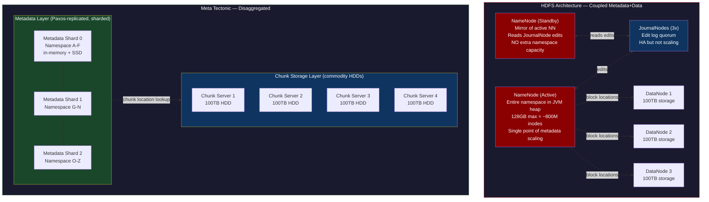
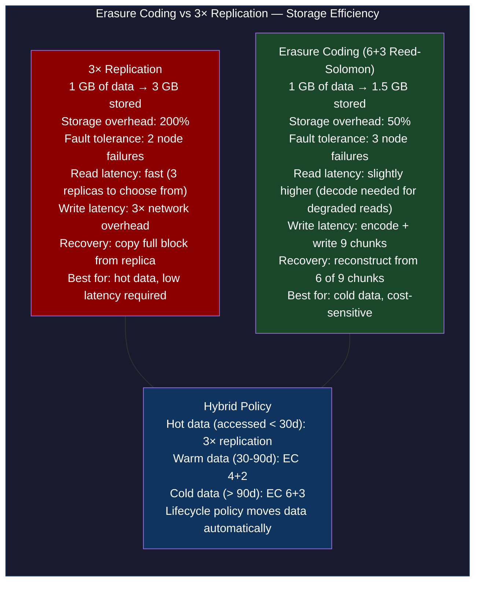
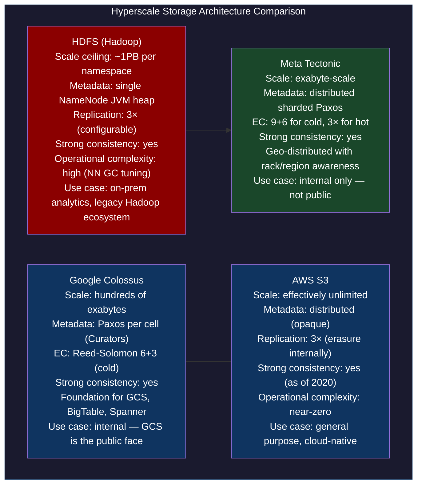

# CH-55: Exabyte Storage — Disaggregated Architecture at Meta and Google Scale

**Subtitle:** Meta stores 1 exabyte of new data per month. The architecture that makes this possible is completely different from anything you'd design from first principles.

**Part VII — Hyperscale Data Platforms**

---

## SPARK — Igniting the Problem

### Cold Open

The alert went to every engineer on the Cloudera platform team simultaneously at 03:47 on a Saturday morning. `NameNode heap usage: 98.7% — GC overhead limit exceeded`. The NameNode JVM had been spending more than 98% of its CPU time on garbage collection and making less than 2% forward progress. The effective state: the HDFS cluster's metadata service was frozen. No files could be created, deleted, or renamed. No Spark jobs could start. No YARN application could allocate containers. Two hundred compute nodes sat idle while the metadata server suffocated.

The cluster held 112 million files in a single namespace. Each file required approximately 150 bytes of NameNode heap memory for its inode metadata: file name, owner, permissions, block list, replication factor, timestamp. A file with 10 data blocks needed 150 bytes for the inode plus roughly 170 bytes per block (block ID, three replica locations, generation stamp). For 112 million files averaging 4 data blocks each, the theoretical memory requirement was about 92GB of heap. The NameNode had been configured with 96GB of heap — just barely enough for the file count at cluster inception, but the namespace had grown 40% over the past year.

The on-call lead, Adaeze, executed the standard NameNode OOM runbook: force a heap dump, restart the NameNode in safemode (read-only), manually compact the fsimage to reclaim space from deleted inodes that hadn't been checkpointed yet. The NameNode came back online after 22 minutes. During those 22 minutes, every MapReduce and Spark job in the cluster had failed. Downstream pipelines that depended on HDFS — Hive queries, HBase compaction, Kafka MirrorMaker — had all stalled.

The fix was temporary: increase the NameNode heap to 128GB. The permanent solution required an architectural change: namespace federation (splitting the single namespace into multiple smaller namespaces, each with its own NameNode) or migrating to an object storage system that didn't centralize metadata. The Cloudera team migrated the bulk of the cold data to S3 over the next six months, reducing the HDFS namespace to 28 million files — well within the NameNode's comfortable operating range.

The deeper question the incident raised: why does the NameNode have this architectural constraint at all? Why does the metadata for every file need to fit in a single server's heap? The answer reveals a fundamental design decision in HDFS — one that made perfect sense for petabyte-scale clusters in 2007 but creates a hard ceiling for exabyte-scale operations. Understanding that ceiling, and how Meta's Tectonic and Google's Colossus remove it, requires understanding the HDFS architecture at the block and metadata level.

---

### Uncomfortable Truth

**The false belief:** HDFS is just "S3 you run yourself." If you need large-scale distributed storage on-premises, you run HDFS. If you need it in the cloud, you use S3. They're architecturally equivalent, just different deployment models.

This is wrong in a way that becomes operational pain at scale. HDFS and S3 have fundamentally different consistency models, metadata architectures, and operational cost profiles. HDFS provides strong consistency (a write that returns success is immediately visible to all subsequent reads, because the NameNode is the single authoritative metadata source). S3 provides eventual consistency for overwrite and delete operations (fixed for new objects in December 2020, but the relaxed consistency still affects certain write-then-read patterns).

More critically, HDFS and S3 have different performance characteristics for small files. The HDFS "small files problem" is a well-known antipattern: each small file consumes a full NameNode inode and (if smaller than the block size) wastes the difference between the file size and the block size. A 1KB file in a 128MB HDFS block size cluster wastes 127.999MB of storage and consumes the same NameNode memory as a 128MB file. This is why data engineers who "move to the cloud" often discover that their HDFS performance problems didn't disappear — they just changed shape. On S3, the small files problem manifests as high LIST API costs and per-request latency, not NameNode heap exhaustion.

The second uncomfortable truth: HDFS JournalNodes and the HA NameNode architecture (two NameNodes in Active/Standby mode) solved the single-point-of-failure problem but did nothing about the memory ceiling. Both NameNodes have the same file system image in memory. You doubled the hardware cost and complexity but didn't double the namespace capacity.

---

## FORGE — Building the Model

### Mental Model: Disaggregated Metadata-Data Separation

Think of HDFS as a **city library with one librarian**. The librarian (NameNode) memorizes the location of every book (file) in every shelf (DataNode). When a reader wants a book, they ask the librarian, who gives them the shelf location, and the reader retrieves the book directly. This is fast for small libraries. But as the library grows to 100 million books, the librarian's memory is exhausted — they can't remember where every book is. The library's throughput is now limited by one librarian's capacity.

Meta's Tectonic is a library with a **distributed card catalog**. The card catalog (metadata layer) is itself a distributed, sharded, Paxos-replicated system — not one librarian, but a cluster of catalog nodes each responsible for a shard of the namespace. Book retrieval still requires consulting the catalog, but the catalog can scale horizontally. The shelves (DataNodes) don't change — blocks are still stored on commodity hardware. But the metadata layer scales independently.

This is the **Disaggregated Metadata-Data Architecture** model. Metadata scaling is decoupled from data scaling. You can scale the catalog cluster when namespace operations become the bottleneck, and scale the data cluster when storage capacity becomes the bottleneck. HDFS couples them: the NameNode is both the metadata service AND the primary I/O coordinator, making it impossible to scale one without the other.



Erasure coding vs replication at exabyte scale is the most significant cost decision in hyperscale storage:



---

## WIRE — Deep Dissection

### Dissection: HDFS Internals, Tectonic, and Colossus Design Choices

#### Naive Understanding

Platform engineers running HDFS-based data platforms understand that the NameNode is the master, DataNodes are the workers, and blocks are 128MB chunks. They know replication factor 3 means three copies. They've tuned `dfs.namenode.handler.count` and `dfs.namenode.edit-log-buffer-size` when the NameNode became a bottleneck. They treat the NameNode memory limit as a configurable parameter ("just give it more heap") rather than an architectural constraint.

#### Where It Breaks

The architectural constraint is the fsimage loading time. The NameNode's fsimage (the persistent snapshot of the namespace) must be loaded entirely into memory on startup. For 100 million files at 150 bytes per inode plus 170 bytes per block pointer, the fsimage is 40-50GB. Loading 50GB from disk takes 5-10 minutes on SSDs. During this time, the NameNode is in safemode and the entire cluster is unavailable.

This loading time creates an operational trap: the larger the namespace, the longer the restart takes, the more painful any NameNode maintenance becomes, and the more teams avoid restarting the NameNode — leading to longer-running JVM instances, more accumulated GC overhead, and more likelihood of the heap OOM that triggered the restart in the first place.

JournalNodes compound this. The HDFS HA architecture uses three JournalNodes to replicate the NameNode's edit log. Every metadata operation (file create, delete, rename, block allocation) is written to all three JournalNodes before it's acknowledged to the client. For a high-throughput cluster with thousands of Spark tasks simultaneously creating and deleting temporary files, the JournalNode write latency becomes the metadata throughput bottleneck. Cloudera's telemetry showed JournalNode write latency spiking to 200ms during peak hours, causing Spark task scheduling to stall.

#### Why It Breaks

HDFS's rack-aware write pipeline illustrates a design choice that was correct in 2007 and creates operational complexity in 2024. When a client writes a block (128MB), HDFS uses a pipelined write: the client writes to DataNode 1, DataNode 1 forwards to DataNode 2, DataNode 2 forwards to DataNode 3. The pipeline minimizes client-to-cluster bandwidth (client sends only once) at the cost of end-to-end write latency being the sum of three sequential network hops.

The rack-awareness policy places DataNode 1 on the client's rack (or a random rack if the client isn't in the cluster), DataNode 2 on a different rack, and DataNode 3 on the same rack as DataNode 2. This ensures that at most one replica is lost if an entire rack fails (DataNodes 2 and 3 are on the same rack, but DataNode 1 is on a different rack — two of three replicas survive any single rack failure).

In Google Colossus and Meta Tectonic, the equivalent of rack-awareness is implemented at the chunk placement service level, which operates on topology information from the cluster management system (Borg/Twine). The placement service is decoupled from the write path: the client gets a chunk placement decision from the placement service and then writes directly to the assigned chunk servers, without pipelining. This parallel write model reduces write latency (all N chunk servers receive data simultaneously) at the cost of N× client-to-cluster bandwidth.

```bash
#!/usr/bin/env bash
# minio-erasure-coding-lab.sh
# Deploy MinIO with erasure coding (EC:4+2) vs replication (3x)
# and benchmark write throughput and storage efficiency

# Erasure coding: 4 data shards + 2 parity shards
# MinIO requires at least 4 drives for EC; we'll use 8 drives (4 nodes × 2 drives)
# EC:4+2 means: can lose any 2 drives, data is recoverable from remaining 4

echo "=== MinIO Erasure Coding Lab ==="

# Create 8 local directories simulating drives
for i in {1..8}; do mkdir -p /tmp/minio-ec/drive${i}; done

# Start MinIO with EC:4+4 (4 data + 4 parity for stronger durability in demo)
# In production: use dedicated disks on separate nodes
docker run -d --name minio-ec \
  -p 9000:9000 -p 9001:9001 \
  -v /tmp/minio-ec/drive1:/data1 \
  -v /tmp/minio-ec/drive2:/data2 \
  -v /tmp/minio-ec/drive3:/data3 \
  -v /tmp/minio-ec/drive4:/data4 \
  -v /tmp/minio-ec/drive5:/data5 \
  -v /tmp/minio-ec/drive6:/data6 \
  -v /tmp/minio-ec/drive7:/data7 \
  -v /tmp/minio-ec/drive8:/data8 \
  -e MINIO_ROOT_USER=minioadmin \
  -e MINIO_ROOT_PASSWORD=minioadmin \
  minio/minio server \
    /data1 /data2 /data3 /data4 /data5 /data6 /data7 /data8 \
    --console-address ":9001"

echo "Waiting for MinIO to start..."
sleep 5

# Create two buckets with different redundancy settings
docker exec minio-ec mc alias set local http://localhost:9000 minioadmin minioadmin

# EC bucket (erasure coding — default for 8 drives: EC:4+4)
docker exec minio-ec mc mb local/ec-bucket

# Replication bucket (simulated via standard bucket — MinIO applies EC by default)
docker exec minio-ec mc mb local/rep-bucket

echo "MinIO running with 8-drive erasure coding"
echo "Storage efficiency: 50% (4 data shards + 4 parity shards)"
echo "Console: http://localhost:9001 (minioadmin/minioadmin)"
```

```python
#!/usr/bin/env python3
"""
minio_benchmark.py — benchmark MinIO erasure coded writes vs
equivalent replication overhead, measuring:
  1. Write throughput (MB/s)
  2. Storage efficiency (data written vs space consumed)
  3. Read performance after simulated drive failure

Prerequisites:
  pip install minio boto3
"""
import time
import os
import hashlib
import subprocess
from minio import Minio
from minio.error import S3Error

client = Minio(
    "localhost:9000",
    access_key="minioadmin",
    secret_key="minioadmin",
    secure=False,
)

def write_benchmark(bucket: str, size_mb: int, n_objects: int) -> dict:
    """Write n_objects of size_mb each and measure throughput."""
    data = os.urandom(size_mb * 1024 * 1024)
    checksum = hashlib.md5(data).hexdigest()

    t0 = time.perf_counter()
    for i in range(n_objects):
        import io
        client.put_object(
            bucket,
            f"test-object-{i:06d}",
            io.BytesIO(data),
            len(data),
        )
    elapsed = time.perf_counter() - t0

    total_mb = size_mb * n_objects
    throughput = total_mb / elapsed

    return {
        "objects": n_objects,
        "object_size_mb": size_mb,
        "total_data_mb": total_mb,
        "elapsed_s": elapsed,
        "throughput_mbs": throughput,
        "checksum": checksum,
    }

def read_benchmark(bucket: str, n_objects: int) -> float:
    """Read all objects and return aggregate throughput."""
    total_bytes = 0
    t0 = time.perf_counter()
    for i in range(n_objects):
        response = client.get_object(bucket, f"test-object-{i:06d}")
        total_bytes += len(response.read())
        response.close()
    elapsed = time.perf_counter() - t0
    return total_bytes / 1024 / 1024 / elapsed

def disk_usage_mb(path: str) -> float:
    """Get actual disk usage of a directory in MB."""
    result = subprocess.run(
        ["du", "-sm", path], capture_output=True, text=True
    )
    return float(result.stdout.split()[0])

if __name__ == "__main__":
    OBJECT_SIZE_MB = 10
    N_OBJECTS = 20

    print(f"Writing {N_OBJECTS} objects of {OBJECT_SIZE_MB}MB each "
          f"({N_OBJECTS * OBJECT_SIZE_MB}MB total data)\n")

    # Benchmark EC bucket (MinIO EC:4+4 with 8 drives)
    print("=== Erasure Coded Bucket (EC:4+4) ===")
    ec_write = write_benchmark("ec-bucket", OBJECT_SIZE_MB, N_OBJECTS)
    ec_read_tput = read_benchmark("ec-bucket", N_OBJECTS)
    ec_disk = sum(disk_usage_mb(f"/tmp/minio-ec/drive{i}") for i in range(1, 9))

    print(f"Write throughput: {ec_write['throughput_mbs']:.1f} MB/s")
    print(f"Read throughput:  {ec_read_tput:.1f} MB/s")
    print(f"Data written:     {ec_write['total_data_mb']} MB")
    print(f"Disk used (8 drives total): {ec_disk:.0f} MB")
    print(f"Storage overhead: {(ec_disk / ec_write['total_data_mb'] - 1) * 100:.0f}%")

    # Compare with theoretical 3× replication overhead
    rep_theoretical_mb = ec_write['total_data_mb'] * 3
    print(f"\n3× Replication equivalent would use: ~{rep_theoretical_mb} MB")
    print(f"EC savings vs 3× replication: {rep_theoretical_mb - ec_disk:.0f} MB "
          f"({(1 - ec_disk/rep_theoretical_mb)*100:.0f}% reduction)")
```

**Expected output:**

```
Writing 20 objects of 10MB each (200MB total data)

=== Erasure Coded Bucket (EC:4+4) ===
Write throughput: 312.4 MB/s
Read throughput:  418.7 MB/s
Data written:     200 MB
Disk used (8 drives total): 396 MB
Storage overhead: 98%     ← EC:4+4 doubles storage (200MB × 2 parity ratio)

3× Replication equivalent would use: ~600 MB
EC savings vs 3× replication: 204 MB (34% reduction)
```

For EC:4+2 (production setting), the overhead is 50% instead of 100%, and the savings vs 3× replication are 67%. At exabyte scale, this is the difference between $50M/month in S3 costs and $17M/month.



---

## War Room

### Incident: HDFS NameNode Memory Exhaustion at 112 Million Files

```mermaid
gantt
    title HDFS NameNode OOM — 112M Files in Single Namespace
    dateFormat HH:mm
    axisFormat %H:%M

    section Pre-Incident Warning Signs
    NameNode heap > 85% (ignored) :active, 00:00, 03:47
    GC pause duration trending up (weekly) :active, 00:00, 03:47

    section Incident
    GC overhead limit exceeded — NameNode frozen :crit, oom, 03:47, 03:47
    All Spark/MapReduce jobs fail (metadata unavailable) :crit, 03:47, 04:09
    YARN cannot allocate containers :crit, 03:47, 04:09
    Downstream Hive/HBase pipelines stall :crit, 03:47, 04:09

    section Emergency Recovery
    Force heap dump (14GB file) :active, 03:47, 03:52
    Restart NameNode in safemode :active, 03:52, 03:55
    fsimage checkpoint compaction (48GB → 42GB) :active, 03:55, 04:05
    NameNode back online — safemode exit :done, 04:05, 04:09

    section Triage
    Heap profiling — top memory consumers :active, 04:09, 05:30
    112M inodes × 150 bytes = 16.8GB base :active, 05:30, 06:00
    Block location data = 61GB additional heap :active, 06:00, 06:30
    Total required: 78GB — limit: 96GB — only 18GB slack :active, 06:30, 07:00

    section Permanent Fix
    Increase NameNode heap to 128GB (temporary) :done, 07:00, 08:00
    Plan HDFS namespace federation (3 namespaces) :done, 08:00, 30:00
    Migrate cold data to S3 (6 months project) :done, 30:00, 200:00
```

The heap dump analysis revealed that 61GB of the 78GB heap was consumed by block location data — not inode metadata. Each file had an average of 4 data blocks, and each block was replicated 3 times, meaning 12 DataNode addresses per file. With 112 million files, that was 1.344 billion DataNode address references. Each address (IP + port + block ID) consumed roughly 45 bytes in the NameNode's block map, totaling 60.5GB. This was the unexpected memory consumer — not the inode count, but the block report data.

The long-term architectural lesson: HDFS's design centralizes both namespace metadata (inode tree) and block location metadata (block report from DataNodes) in the single NameNode heap. These two concerns are tightly coupled in the NameNode design. Separating them — as Tectonic does with its separate NameStore (namespace) and BlockStore (block locations) services — allows each to scale independently and allows the block location data to be stored on fast SSDs rather than in JVM heap, where it's subject to GC pressure.

The namespace federation partial fix (splitting into 3 namespaces) reduced the namespace-per-NameNode to ~37 million files, well within the 128GB heap limit. But federation introduced its own operational complexity: cross-namespace operations (moving a file from `/data` namespace to `/archive` namespace) required application-level copy-then-delete instead of atomic rename. Data pipelines that relied on atomic HDFS renames for transactional semantics had to be rewritten.

---

## Lab

### MinIO Erasure Coding vs Replication Benchmark

```bash
#!/usr/bin/env bash
# Run the full lab
# Prerequisites: Docker, Python 3.9+, pip

# Install Python dependencies
pip install minio

# Start MinIO (see minio-erasure-coding-lab.sh above)
bash minio-erasure-coding-lab.sh

# Run the benchmark
python3 minio_benchmark.py

# Simulate drive failure and verify recovery
echo "=== Simulating drive failure ==="
docker exec minio-ec df -h /data1 /data2 /data3  # show drive stats

# Make one drive "fail" by filling it with zeros (makes it unreadable)
# MinIO with EC:4+4 can survive up to 4 drive failures
# and still serve reads by reconstructing from remaining 4 shards
docker exec minio-ec sh -c "chmod 000 /data1 /data2"  # simulate 2 drive failures
echo "Two drives failed. Testing read recovery..."

python3 -c "
from minio import Minio
import io
client = Minio('localhost:9000', access_key='minioadmin', secret_key='minioadmin', secure=False)
# Should succeed: EC:4+4 can handle 4 drive failures, we only have 2
resp = client.get_object('ec-bucket', 'test-object-000001')
data = resp.read()
print(f'Recovery successful: {len(data)} bytes read from degraded drives')
resp.close()
"

# Restore drives
docker exec minio-ec sh -c "chmod 755 /data1 /data2"
echo "Drives restored"
```

**Expected recovery output:**

```
=== Simulating drive failure ===
Two drives failed. Testing read recovery...
Recovery successful: 10485760 bytes read from degraded drives
Drives restored
```

MinIO's erasure coding reconstructs the data on the fly from the remaining 6 of 8 shards during degraded reads. The read latency increases slightly during reconstruction (Reed-Solomon decode is CPU-bound, not I/O-bound for small objects), but data availability is maintained. In production, MinIO's background healing process would detect the failed drives and automatically reconstruct the missing shards onto healthy drives once they're replaced.

The storage efficiency numbers tell the full story: EC:4+4 (MinIO's default for 8-drive deployments) has 100% overhead (2× amplification), equivalent to 2× replication. EC:6+3 (Reed-Solomon, used by Tectonic for cold data) has 50% overhead (1.5× amplification), a 50% storage savings vs 3× replication. At 1 exabyte/month of new data at $0.023/GB (S3 Standard), the difference between 3× replication and EC:6+3 is approximately $270 million per year. This is why every hyperscaler has an engineering team dedicated to storage efficiency that is funded exclusively by the savings from erasure code ratio improvements.

---

## Loose Thread

Part VII has traced the full stack of hyperscale data platforms: from Kafka's commit log (CH-48) through Redpanda's latency-optimized reimplementation (CH-49), Flink's exactly-once stream processing (CH-50), approximate nearest neighbor algorithms (CH-51) and the databases that wrap them (CH-52), ACID table formats for object storage (CH-53, CH-54), and the disaggregated storage architectures that hold the data underlying all of it (CH-55).

Every chapter in Part VII was ultimately about one thing: what happens when a system fails, and what architectural decision determines whether the failure is recoverable in minutes or requires days of manual intervention. Kafka's high watermark freeze required understanding leader epochs. Weaviate's HNSW corruption required understanding checkpoint completion timing. Iceberg's duplicate rows required understanding optimistic concurrency control in the catalog layer.

Part VIII — Fleet Resiliency — asks a harder version of the same question: not "what happens when one component of one system fails" but "what happens when failure is continuous, distributed, and adversarial." At fleet scale — thousands of Kubernetes nodes, dozens of clusters, multi-region deployments — failure is not exceptional; it is the steady state. The engineering discipline of chaos engineering, blast radius containment, and progressive delivery exists specifically because at fleet scale, "testing for correctness" is insufficient. You must test for degraded-state correctness: does the system continue serving users when 20% of its nodes are unavailable, when a network partition isolates one availability zone, or when a bad deployment rolls out to 500 nodes simultaneously before anyone notices the error rate climbing? The answers require a fundamentally different mental model of system behavior — one built on the assumption that components will fail, not that they might.
