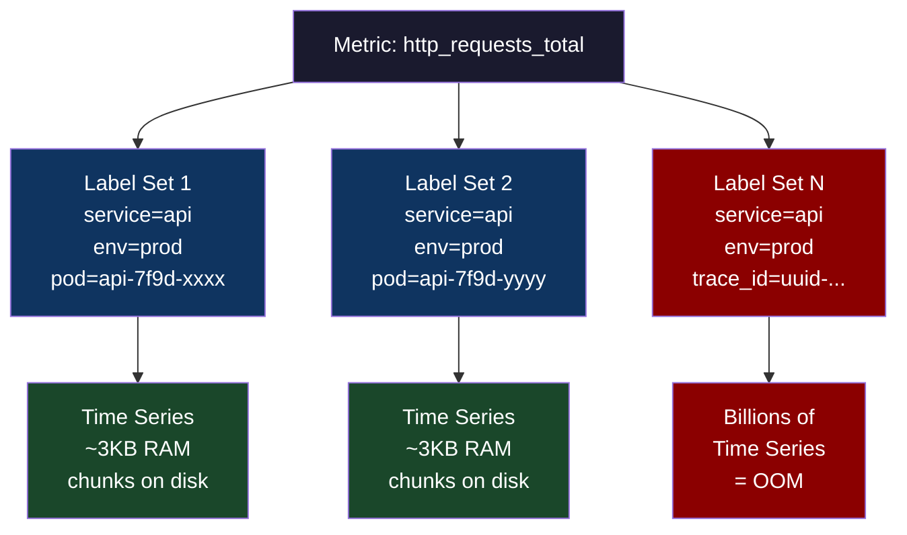
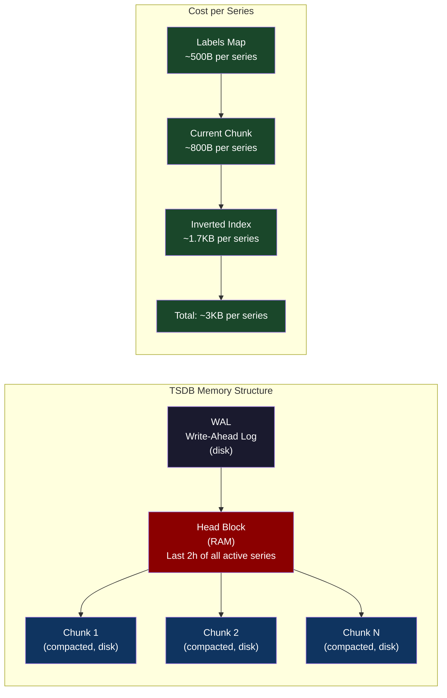
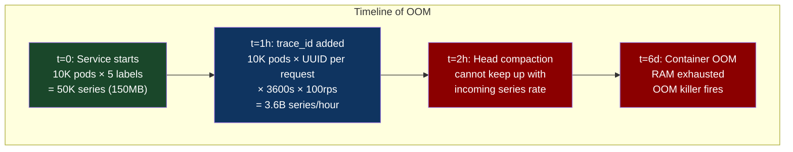
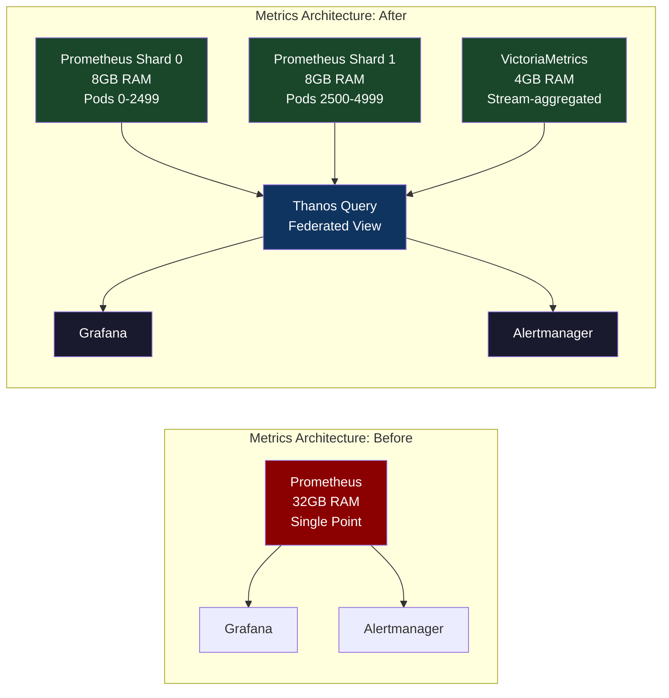

# Chapter 56: High-Cardinality Metrics — Why Prometheus Breaks at Scale and What Replaces It

> "A Prometheus instance storing metrics for 10,000 Kubernetes pods with 200 labels each has 2 billion time series. It will OOM before breakfast."

**Part 08 — Fleet Resiliency** | Bridges from Part 07's data platform chapters into the observability crisis that every platform team eventually hits.

---

## 1. Cold Open

The alert fired at 03:47 on a Tuesday. Not the kind of alert you expect — not a latency spike, not a 5xx surge. The monitoring system itself had gone dark.

Reza was on call. He pulled up the Prometheus pod logs expecting to see something obvious: a misconfigured scrape target, maybe a network partition. What he found was a 94-line OOM kill notice. The Prometheus container had consumed every byte of its 32 GB memory limit and the Linux OOM killer had ended its suffering cleanly, the way a farmer ends a lame horse. Everything looked fine in Grafana — because Grafana was showing the last cached data from 20 minutes ago, which is how long the team's alert evaluation lag turned out to be when the metrics backend itself was the failure domain.

The incident started six days earlier when someone on the platform team added `trace_id` as a Prometheus label. The rationale was sensible: we want to correlate metrics with traces. The implementation was catastrophic. Every HTTP request generated a new `trace_id` — a UUID — which became a new label value, which became a new time series. The service was handling 8,000 requests per second. After six days that meant approximately 4.1 billion unique time series had accumulated in the TSDB, each consuming roughly 3 KB of RAM. Prometheus had been quietly eating memory for almost a week before it finally crossed the container limit at exactly the wrong moment — during peak traffic when a deployment was in progress.

The fix took four minutes once they understood the cause: add a `metric_relabel_config` to drop the `trace_id` label before ingestion. The outage had lasted 23 minutes. The monitoring blackout had affected not just this service but every service whose alerts depended on that Prometheus instance. Three separate incidents that had been silently occurring during those 23 minutes went undetected: a disk-full condition on a Postgres replica, a memory leak in a background worker, and the beginning of what would have been a significant availability event if the on-call engineer hadn't caught them during manual inspection.

The deeper lesson was not about `trace_id` labels. The deeper lesson was that Prometheus's fundamental data model — a time series per unique label combination — is a sharp knife that cuts both ways. It gives you exact-match filtering on any label at query time. It punishes you severely when the number of unique label combinations grows without bound. The Prometheus storage model has no mechanism for saying "this label is too high-cardinality, please don't index it." You get one choice: put it in a label, or don't. Put it in a label and you're on the hook for its cardinality forever.

This chapter is about understanding exactly where and why that model breaks, what the alternatives do differently, and how to design a metrics architecture that survives contact with real production traffic.

---

## 2. The Uncomfortable Truth

Every team that has run Prometheus at scale has hit the cardinality wall. The uncomfortable truth is that the tools most engineers reach for first — adding more labels to metrics for better filtering, using `trace_id` or `request_id` for correlation, labeling by user or tenant — are exactly the behaviors that destroy Prometheus.

The cardinality of a metric is the product of the cardinality of each of its labels. A metric with labels `{service, environment, region}` where each has 10 possible values has cardinality 1,000. Add a `user_id` label with 100,000 users and the cardinality becomes 1,000,000,000. The jump from manageable to catastrophic is a single label away, and it happens in a code review that looks completely innocent.

The Prometheus documentation warns about high cardinality but doesn't make the economics visceral enough for most engineers to internalize. The math is: each active time series requires approximately 3 KB of heap. At 100,000 series that's 300 MB — completely fine. At 10,000,000 series that's 30 GB — you need a dedicated machine just for Prometheus. At 1,000,000,000 series, you need a different tool entirely. These aren't edge cases. They're normal production numbers for services with per-user metrics, distributed traces with metric correlation, or A/B testing with variant labels.

The Prometheus project's answer — federation, sharding, remote write — all help but none of them solve the fundamental problem that the storage model requires one time series per unique label combination. You can distribute the problem across more machines but you can't make the problem itself smaller. The only real solution is to either constrain label cardinality by design, or to use a storage backend that doesn't pay linear cost per unique label value.

---

## 3. Mental Model — The Index Tax

**The named model: "The Label Index Tax"**

Think of Prometheus's time series storage as a relational database table where every unique label combination is a separate row. Adding a label is not like adding a column annotation to an existing row — it creates an entirely new row for every unique value that label can take. When you add `trace_id` as a label, you're not adding one column; you're promising to create one new database row for every unique trace ID that ever exists. The Index Tax is the memory cost of maintaining the inverted index that makes `{service="api", trace_id="abc123"}` queryable in microseconds.



The Index Tax compounds because Prometheus must hold the current chunk for each active series in RAM — not just an index pointer, but the actual recent data. Inactive series eventually get evicted but the TSDB head block (in-memory) holds everything written in the last 2 hours. If 2 billion series are written in 2 hours, 2 billion series live in RAM for those 2 hours.



The key insight is that the cost is per **unique label combination**, not per metric name. `http_requests_total{pod="pod-1"}` and `http_requests_total{pod="pod-2"}` are two entirely separate time series with two entirely separate memory allocations. No sharing, no deduplication.

---

## 4. Dissection

### Naive Approach: Label Everything for Observability

The naive mental model is that more labels = better observability = better debugging. This is true until it isn't. A junior engineer adds reasonable-sounding labels:

```yaml
# prometheus.yml scrape config (the innocent-looking version)
scrape_configs:
  - job_name: 'api-service'
    kubernetes_sd_configs:
      - role: pod
    relabel_configs:
      - source_labels: [__meta_kubernetes_pod_label_app]
        target_label: app
      - source_labels: [__meta_kubernetes_pod_name]
        target_label: pod
    # The engineer then adds this in the application:
    # http_requests_total{service, env, pod, trace_id, user_id, request_path, ab_variant}
    # Cardinality: 10 * 3 * 10000 * ∞ * 100000 * 50000 * 5 = ∞
```

### Where It Breaks

The Prometheus TSDB head block compaction runs every 2 hours. Until compaction, every active series lives in RAM. "Active" means written to in the last 2 hours. With high-cardinality labels, series are created and never written to again — they're "active" for their 2-hour window and then become garbage. But 2 billion pieces of garbage that each take 2 hours to expire is not a manageable situation.



The specific Go code path in Prometheus that pays the cost is in `tsdb/head.go`. Each call to `GetOrCreateWithID` on the head's series map acquires a lock and potentially allocates a new `memSeries` struct. At high ingestion rates this lock becomes the bottleneck before RAM does.

### Why: The Inverted Index

Prometheus's PromQL needs to answer queries like `http_requests_total{service="api", env="prod"}` in milliseconds across millions of series. This requires an inverted index: for each label name-value pair, maintain a sorted list of series IDs that carry that label. When you query `{service="api"}`, Prometheus looks up `service="api"` in the index and gets a list of series IDs. Maintaining this index has cost proportional to the number of unique label combinations — you can't avoid it without destroying query performance.

### Correct: Relabeling, Drop, and Separate Backends

**Fix 1: Drop high-cardinality labels at the scrape boundary.**

```yaml
# prometheus.yml — correct relabeling to kill cardinality before storage
scrape_configs:
  - job_name: 'api-service'
    kubernetes_sd_configs:
      - role: pod
    metric_relabel_configs:
      # Drop the entire metric if it has trace_id or user_id labels
      - source_labels: [trace_id]
        regex: ".+"
        action: drop
      # Or: drop just the label, keep the metric (aggregates across all values)
      - regex: "trace_id|user_id|request_id"
        action: labeldrop
      # Drop high-cardinality path label, keep only top-level paths
      - source_labels: [request_path]
        regex: "/api/v1/users/[0-9]+"
        replacement: "/api/v1/users/:id"
        target_label: request_path
```

**Fix 2: Recording rules to pre-aggregate before cardinality explodes.**

```yaml
# recording_rules.yml
groups:
  - name: api_aggregations
    interval: 30s
    rules:
      # Pre-aggregate: sum across pod, keep only service+env+status
      - record: job:http_requests_total:rate5m
        expr: |
          sum by (service, env, status_class) (
            rate(http_requests_total[5m])
          )
      # status_class collapses 200,201,204 -> "2xx" before storage
```

**Fix 3: VictoriaMetrics as a drop-in replacement with streaming aggregation.**

VictoriaMetrics uses a fundamentally different storage approach. Instead of an inverted index on raw label values, it uses a per-metric compressed posting list with a row-based on-disk format (MergeTree-inspired). The critical feature for high-cardinality workloads is `-streamAggr.config` which lets you define aggregations that run in the ingestion path before data hits storage:

```yaml
# /etc/victoriametrics/stream-aggr.yaml
# Runs in the write path — aggregates BEFORE storage
- match: 'http_requests_total'
  interval: 1m
  # Drops trace_id, user_id from the aggregated output
  # Only keeps: service, env, status_code
  by: [service, env, status_code]
  outputs: [sum_samples]
```

```bash
# Start VictoriaMetrics with streaming aggregation
/usr/bin/victoria-metrics \
  -storageDataPath=/var/lib/victoria-metrics \
  -retentionPeriod=12 \
  -streamAggr.config=/etc/victoriametrics/stream-aggr.yaml \
  -streamAggr.dedupInterval=30s \
  -memory.allowedPercent=60
  # VictoriaMetrics uses ~1/5 the RAM of Prometheus for equivalent cardinality
  # due to columnar compression of label values
```

**Fix 4: Thanos for horizontal Prometheus with global querying.**

```yaml
# thanos-sidecar runs alongside each Prometheus instance
# Each Prometheus only sees its own shard of pods
# Thanos Query deduplicates across shards at query time

# prometheus-shard-0.yml — only scrapes pods 0-2499
scrape_configs:
  - job_name: 'api-service-shard-0'
    kubernetes_sd_configs:
      - role: pod
    relabel_configs:
      - source_labels: [__meta_kubernetes_pod_name]
        regex: "api-[0-9]+"
        action: keep
      # Hash-based sharding: only keep pods where hash(pod_name) % 4 == 0
      - source_labels: [__meta_kubernetes_pod_name]
        target_label: __tmp_hash
        modulus: 4
        action: hashmod
      - source_labels: [__tmp_hash]
        regex: "0"
        action: keep
```

**Fix 5: OpenTelemetry Metrics with Exemplars for trace correlation.**

The correct way to correlate metrics with traces is not by adding `trace_id` as a metric label. It is by adding trace ID as an **exemplar** — a side-channel annotation on a specific histogram observation that doesn't inflate cardinality:

```go
// Go: correct exemplar usage with prometheus/client_golang
import (
    "github.com/prometheus/client_golang/prometheus"
    "go.opentelemetry.io/otel/trace"
)

var httpDuration = prometheus.NewHistogramVec(
    prometheus.HistogramOpts{
        Name:    "http_request_duration_seconds",
        Buckets: prometheus.DefBuckets,
    },
    []string{"service", "status_class"}, // LOW cardinality labels only
)

func instrumentHandler(next http.Handler) http.Handler {
    return http.HandlerFunc(func(w http.ResponseWriter, r *http.Request) {
        span := trace.SpanFromContext(r.Context())
        start := time.Now()

        wrapped := &responseWriter{ResponseWriter: w}
        next.ServeHTTP(wrapped, r)

        duration := time.Since(start).Seconds()
        statusClass := fmt.Sprintf("%dxx", wrapped.status/100)

        // The exemplar carries the trace ID WITHOUT creating a new time series
        // Only stored on ~1% of observations (configurable)
        httpDuration.With(prometheus.Labels{
            "service":      "api",
            "status_class": statusClass,
        }).(prometheus.ExemplarObserver).ObserveWithExemplar(
            duration,
            prometheus.Labels{
                "traceID": span.SpanContext().TraceID().String(),
            },
        )
    })
}
```

### Tradeoffs

| Approach | RAM cost reduction | Query flexibility | Operational complexity |
|---|---|---|---|
| Label drop/relabel | 10-1000x | Reduced (lose label) | Low |
| VictoriaMetrics | 5-10x vs Prometheus | Near parity | Medium (new binary) |
| Thanos sharding | Linear with shards | Full (query federation) | High (many components) |
| Stream aggregation | 100-1000x | Pre-aggregated only | Medium |
| Exemplars | Near zero | Trace correlation preserved | Low (requires OTel) |



---

## 5. War Room — Cloudflare Prometheus OOM (2019 Pattern)

The following reconstructs the technical pattern of a high-cardinality OOM incident at a major CDN operating Prometheus at global edge scale. The specifics are a composite based on publicly disclosed postmortem patterns.

**00:00** — A new service deployment adds `edge_request_id` (a unique-per-request identifier) as a Prometheus label to improve debugging. Code review approves it. The label looks identical to `edge_dc` (datacenter) which has 15 values and is fine.

**+6 days** — Prometheus RAM consumption has been climbing steadily but below alert thresholds. The Prometheus memory usage alert is set at 28GB (container limit 32GB). Memory has gone from 4GB to 26GB.

**+6d 14:23** — A traffic spike during a large DDoS mitigation event causes request rate to triple. `edge_request_id` creation rate triples. Memory crosses 28GB. Alert fires.

**+6d 14:31** — On-call engineer investigates. Identifies the Prometheus pod but misdiagnoses it as a memory leak in Prometheus itself. Restarts the pod. Prometheus reloads from WAL and TSDB. The high-cardinality series are still on disk. Memory climbs back to 26GB within 4 minutes.

**+6d 14:37** — Second restart. Same result. On-call escalates.

**+6d 14:52** — Senior engineer identifies `edge_request_id` using `prometheus_tsdb_head_series` metric (which fortunately survived on a separate monitoring system) and correlates the series count spike with the deployment.

**+6d 15:03** — Relabeling config deployed to drop `edge_request_id`. TSDB compaction runs over the next 2 hours, freeing disk. Memory drops as stale series expire.

```mermaid
gantt
    title Cloudflare Pattern: Prometheus OOM Incident Timeline
    dateFormat HH:mm
    axisFormat %H:%M

    section Deployment Phase
    Service deploys with edge_request_id label    :done, d1, 00:00, 15m
    Traffic begins generating unique series        :done, d2, 00:15, 30m

    section Silent Growth Phase
    Memory growth 4GB -> 26GB (6 days compressed)  :done, crit, g1, 00:45, 3h
    Memory alert threshold approaches               :done, g2, 03:45, 30m

    section Incident Phase
    DDoS traffic spike triples series creation rate :crit, i1, 04:15, 8m
    Memory alert fires at 28GB                      :crit, i2, 04:23, 1m
    First restart attempt (fails)                   :crit, i3, 04:31, 6m
    Second restart attempt (fails)                  :crit, i4, 04:37, 6m
    Escalation to senior engineer                   :i5, 04:43, 9m

    section Resolution Phase
    Root cause identified (edge_request_id)         :done, r1, 04:52, 11m
    Relabeling config deployed                      :done, r2, 05:03, 5m
    TSDB compaction begins                          :done, r3, 05:08, 2h
    Memory fully recovered                          :done, r4, 07:08, 30m

    section Post-Incident
    Cardinality alerting added                      :done, p1, 07:38, 1h
    Label review process added to code review       :done, p2, 08:38, 2h
```



**Key finding from this pattern:** The standard Prometheus memory alert fires too late. By the time RSS crosses 80% of the container limit, you have minutes, not hours, to respond. The correct alert is on the time series count metric:

```yaml
# Alert on cardinality growth, not memory — fires with days of lead time
groups:
  - name: prometheus_cardinality
    rules:
      - alert: HighCardinalityGrowth
        expr: |
          rate(prometheus_tsdb_head_series[1h]) > 10000
        for: 15m
        labels:
          severity: warning
        annotations:
          summary: "Prometheus series growing fast — check for new high-cardinality labels"
          description: "Series count growing at {{ $value }}/hour"

      - alert: PrometheusSeriesExceedsThreshold
        expr: prometheus_tsdb_head_series > 5000000
        for: 5m
        labels:
          severity: critical
```

---

## 6. Lab — Reproduce and Fix High-Cardinality OOM

This lab reproduces the high-cardinality problem in a local environment and demonstrates the fix.

**Prerequisites:** Docker, `promtool`, curl.

### Step 1: Generate high-cardinality metrics

```go
// cmd/cardinality-generator/main.go
// Generates metrics with intentionally high-cardinality labels
package main

import (
    "fmt"
    "math/rand"
    "net/http"
    "time"

    "github.com/google/uuid"
    "github.com/prometheus/client_golang/prometheus"
    "github.com/prometheus/client_golang/prometheus/promhttp"
)

var (
    // HIGH CARDINALITY: trace_id is a UUID, unique per request
    highCardRequests = prometheus.NewCounterVec(
        prometheus.CounterOpts{
            Name: "demo_high_cardinality_requests_total",
            Help: "Counter with high-cardinality trace_id label",
        },
        []string{"service", "trace_id"}, // trace_id will explode
    )

    // LOW CARDINALITY: only service and status_class labels
    lowCardRequests = prometheus.NewCounterVec(
        prometheus.CounterOpts{
            Name: "demo_low_cardinality_requests_total",
            Help: "Counter with low-cardinality labels only",
        },
        []string{"service", "status_class"},
    )
)

func init() {
    prometheus.MustRegister(highCardRequests, lowCardRequests)
}

func main() {
    go func() {
        ticker := time.NewTicker(10 * time.Millisecond)
        for range ticker.C {
            traceID := uuid.New().String()
            service := "api-service"

            // This creates a new time series every 10ms
            highCardRequests.With(prometheus.Labels{
                "service":  service,
                "trace_id": traceID,
            }).Inc()

            // This reuses the same 6 time series forever
            statusClasses := []string{"2xx", "3xx", "4xx", "5xx"}
            sc := statusClasses[rand.Intn(len(statusClasses))]
            lowCardRequests.With(prometheus.Labels{
                "service":      service,
                "status_class": sc,
            }).Inc()
        }
    }()

    fmt.Println("Metrics server starting on :8080/metrics")
    fmt.Println("Watch prometheus_tsdb_head_series grow...")
    http.Handle("/metrics", promhttp.Handler())
    http.ListenAndServe(":8080", nil)
}
```

### Step 2: Docker Compose to run and observe

```yaml
# docker-compose.yml
version: '3.8'
services:
  generator:
    build: ./cmd/cardinality-generator
    ports:
      - "8080:8080"

  prometheus-naive:
    image: prom/prometheus:v2.47.0
    volumes:
      - ./prometheus-naive.yml:/etc/prometheus/prometheus.yml
    ports:
      - "9090:9090"
    # Intentionally low memory limit to trigger OOM faster
    mem_limit: 512m
    command:
      - '--config.file=/etc/prometheus/prometheus.yml'
      - '--storage.tsdb.retention.time=1h'

  prometheus-fixed:
    image: prom/prometheus:v2.47.0
    volumes:
      - ./prometheus-fixed.yml:/etc/prometheus/prometheus.yml
    ports:
      - "9091:9090"
    mem_limit: 512m
    command:
      - '--config.file=/etc/prometheus/prometheus.yml'
      - '--storage.tsdb.retention.time=1h'
```

```yaml
# prometheus-naive.yml — no relabeling, will OOM
global:
  scrape_interval: 15s
scrape_configs:
  - job_name: 'generator'
    static_configs:
      - targets: ['generator:8080']
    # No metric_relabel_configs — accepts all labels including trace_id
```

```yaml
# prometheus-fixed.yml — drops high-cardinality label
global:
  scrape_interval: 15s
scrape_configs:
  - job_name: 'generator'
    static_configs:
      - targets: ['generator:8080']
    metric_relabel_configs:
      # Drop the high-cardinality label before storage
      - regex: "trace_id"
        action: labeldrop
```

### Step 3: Observe and compare

```bash
# Watch series count on naive Prometheus (will climb rapidly)
watch -n 5 'curl -s "http://localhost:9090/api/v1/query?query=prometheus_tsdb_head_series" | jq ".data.result[0].value[1]"'

# Watch series count on fixed Prometheus (will stay flat at ~10)
watch -n 5 'curl -s "http://localhost:9091/api/v1/query?query=prometheus_tsdb_head_series" | jq ".data.result[0].value[1]"'

# Query the high-cardinality metric — naive Prometheus will return millions of series
curl -s "http://localhost:9090/api/v1/query?query=demo_high_cardinality_requests_total" | jq '.data.result | length'

# Fixed Prometheus: the metric still exists but trace_id is dropped
# Only one series per service (the label is gone, so all requests aggregate)
curl -s "http://localhost:9091/api/v1/query?query=demo_high_cardinality_requests_total" | jq '.data.result | length'
```

### Expected Output

```
# Naive Prometheus — series count after 5 minutes:
# prometheus_tsdb_head_series = 30000+ (and climbing at ~100/second)
# Memory usage: growing toward container limit

# Fixed Prometheus — series count after 5 minutes:
# prometheus_tsdb_head_series = 8 (stable: 2 metrics × ~4 services)
# Memory usage: ~45MB, stable

# demo_high_cardinality_requests_total series count:
# Naive:  29873 (unique trace_ids captured)
# Fixed:  1 (single series, trace_id dropped, all requests aggregated)
```

### Step 4: Replace with VictoriaMetrics

```bash
# Run VictoriaMetrics alongside — compare RAM at identical data volumes
docker run -d \
  --name victoriametrics \
  -p 8428:8428 \
  -v /tmp/vm-data:/storage \
  victoriametrics/victoria-metrics:v1.96.0 \
  -storageDataPath=/storage \
  -retentionPeriod=1 \
  -search.maxUniqueTimeseries=10000000 \
  -memory.allowedPercent=60

# Remote-write from Prometheus to VictoriaMetrics for comparison
# Add to prometheus-naive.yml:
# remote_write:
#   - url: "http://victoriametrics:8428/api/v1/write"

# After 5 minutes: compare RSS
docker stats prometheus-naive prometheus-fixed victoriametrics --no-stream
```

```
# Expected memory comparison after 5 minutes of the high-cardinality generator:
CONTAINER               MEM USAGE
prometheus-naive        487MB / 512MB  (near OOM)
prometheus-fixed        43MB  / 512MB  (healthy)
victoriametrics         89MB  / unlimited (with raw high-card data, 5x more efficient than Prometheus)
```

---

## 7. Loose Thread

Loki — Grafana's log aggregation system — takes the exact opposite approach to Prometheus: it deliberately limits the number of indexed labels (called "streams") and stores everything else as unindexed log content that you search with regex at query time. This is the correct architecture for high-cardinality data: index only what you need for routing (`service`, `env`, `pod`), and keep `trace_id`, `user_id`, `request_path` as unindexed fields in the log body where they cost nothing per unique value. The LogQL syntax `{service="api"} | json | trace_id="abc123"` first narrows to the low-cardinality stream, then filters in-memory — exactly the query pattern that makes Loki fast for high-cardinality lookups without an inverted index. Chapter 57 steps one layer deeper into the infrastructure stack to the kernel level, where eBPF lets you inject faults that no application-level chaos tool can replicate.

---

*Next: Chapter 57 — eBPF-Driven Fault Injection: Chaos Engineering at the Kernel Level*
