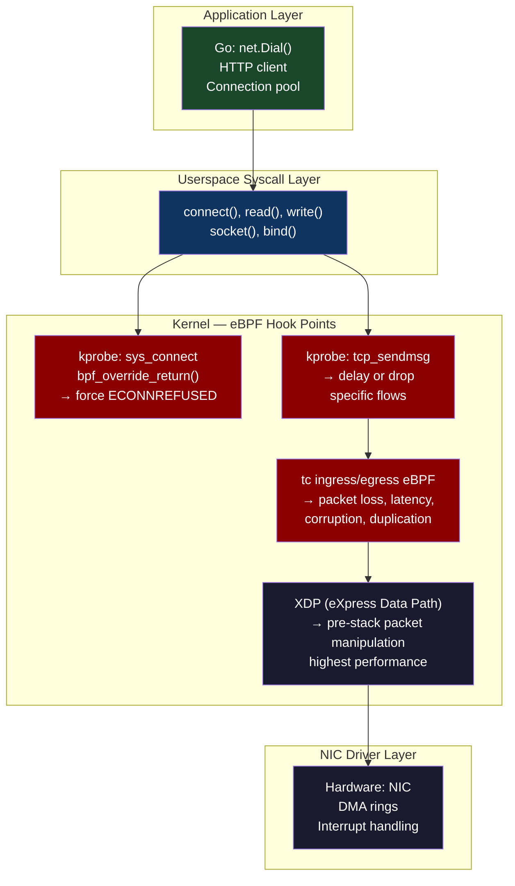
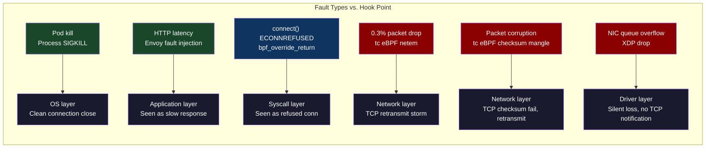
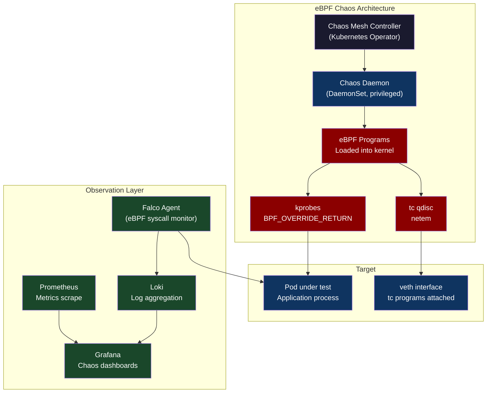

# Chapter 57: eBPF-Driven Fault Injection — Chaos Engineering at the Kernel Level

> "Killing pods is not chaos engineering. Injecting packet loss at the kernel level, corrupting specific syscall return values, and delaying specific network connections — that's chaos engineering."

**Part 08 — Fleet Resiliency** | Bridges from CH-56's observability constraints into the testing of failure modes that only manifest below the application layer.

---

## 1. Cold Open

The service had a 99.99% uptime SLO and had met it for 14 consecutive months. The chaos engineering team was proud of this. They had been running regular chaos experiments for 18 months: killing random pods, simulating availability zone failures, injecting 500ms latency at the load balancer level, even running tabletop exercises for multi-region failover. The service passed every test. The SRE lead published a blog post about their mature chaos engineering practice.

Three weeks after the blog post, the service had a 47-minute outage. Not a pod failure. Not a zone failure. Not application latency. A NIC driver on six nodes in the same rack began experiencing intermittent packet loss — roughly 0.3% of packets dropped, random, uncorrelated. The application handled complete pod failures gracefully. It handled simulated 500ms latency at the load balancer level gracefully. It did not handle 0.3% random packet loss gracefully. The TCP retransmission behavior at that packet loss rate created a specific pattern of connection-level retransmissions that interacted badly with the service's connection pooling logic. Connection pool slots were consumed by retransmitting connections, new connections couldn't be established, the pool exhausted, request queuing began, latency spiked, circuit breakers tripped, and a cascade ensued.

None of the chaos experiments they had run would have caught this. Killing a pod is an application-layer event — the application gets a clean connection close, the load balancer drains traffic, the client retries. Random packet loss is a network-layer event that is invisible to the application until its effects propagate through multiple layers of retry and timeout behavior. The chaos engineering team had been testing their application's resilience against application-layer failures while the real failure mode lived three layers below.

The fix involved both a connection pool tuning change and a NIC driver update. But the more important fix was rebuilding the chaos engineering program to include network-layer fault injection — specifically, the ability to inject exactly 0.3% packet loss on a specific pod's network interface and observe what happens. That capability requires reaching into the kernel's packet processing path, and in 2024 the tool for that is eBPF.

This chapter builds the mental model for eBPF-based fault injection, shows the exact tooling, and demonstrates the failure modes that only this approach can surface.

---

## 2. The Uncomfortable Truth

Most chaos engineering tools operate at the application layer or the infrastructure layer. They kill processes, drain Kubernetes nodes, pause containers, inject HTTP-level latency via proxies. These are useful tests but they validate only the subset of your failure handling that is visible at those layers.

The uncomfortable truth is that production networks fail in ways that look nothing like "this connection timed out" or "this pod is unreachable." They fail with 0.1% packet loss that creates heavy-tail latency. They fail with TCP ACK reordering that triggers spurious fast retransmits. They fail with specific socket buffer exhaustion patterns that appear to the application as intermittent connection resets. None of these failure modes are injectable by tools that operate above the kernel's networking subsystem.

eBPF changes this. `bpf_override_return()` lets you force a specific kernel function to return a specific error code, which means you can make `open()` return `ENOENT` for specific processes, make `connect()` return `ECONNREFUSED` for specific destination IPs, or make `read()` return `EIO` for specific file descriptors. The Linux traffic control (tc) subsystem with eBPF programs lets you drop, delay, duplicate, or corrupt specific packets at the kernel level before they ever reach the application. This is a fundamentally different capability than anything available in userspace.

The other uncomfortable truth: most teams don't run eBPF-based chaos tests because the tooling is complex and requires kernel privileges. Chaos Mesh provides a relatively accessible wrapper, but understanding what it does under the hood — and more importantly, what it can't do — requires understanding the eBPF program model. You don't need to write eBPF programs from scratch, but you need to understand why the kernel hook points matter.

---

## 3. Mental Model — The Kernel Interception Plane

**The named model: "The Kernel Interception Plane"**

Think of your Linux kernel as having multiple horizontal planes through which all system activity must pass. At the top plane, your Go application makes a `net.Dial()` call. That call descends through the glibc syscall wrapper, into the kernel's socket layer, through the TCP/IP stack, and eventually into the NIC driver. Application-level chaos tools inject faults at the top plane — they intercept at the Go runtime or the HTTP library level. eBPF chaos tools inject faults at any plane you choose: you can intercept the `connect` syscall, the TCP state machine, the IP forwarding layer, or the raw packet transmission path.



The key insight is that each hook point intercepts a different failure mode. A kprobe on `sys_connect` simulates "connection refused" — the application's retry logic fires immediately. A tc eBPF program dropping 0.3% of packets simulates NIC intermittency — the application never sees a refused connection, only slow retransmissions. XDP-level manipulation can simulate behaviors that happen before the kernel's TCP stack even processes the packet.



---

## 4. Dissection

### Naive Approach: Application-Level and Container-Level Chaos

Most teams start with Chaos Monkey (kill random instances), progress to Chaos Mesh or LitmusChaos with pod kills, node drains, and HTTP fault injection via sidecars. This tests resilience against clean failures: a process exits, a connection closes, a new connection is refused. The application either handles it or doesn't.

```yaml
# Chaos Mesh: pod kill — application-layer fault
apiVersion: chaos-mesh.org/v1alpha1
kind: PodChaos
metadata:
  name: pod-kill-example
spec:
  action: pod-kill
  mode: one
  selector:
    namespaces: [production]
    labelSelectors:
      app: api-service
  # This is NOT enough. It tests: does your app survive clean process termination?
  # It does NOT test: does your app survive 0.3% packet loss from a flaky NIC?
```

### Where It Breaks

A pod kill generates a `SIGTERM`, the application's graceful shutdown handler runs, existing connections drain, the load balancer removes the endpoint. This is a well-understood failure mode that every Kubernetes application is built to handle. The interesting failure modes — the ones that cause actual production outages — are ambiguous: packets arrive but are slow, some packets are lost, some connections reset after partial data transfer. These require injecting faults at the network layer.

### Why: The Failure Mode Gap

The gap between application-layer chaos and kernel-layer chaos is the TCP/IP stack itself. TCP is designed to recover from packet loss — it retransmits automatically. But the recovery behavior has timing properties that interact with application timeouts, connection pools, and retry budgets in non-obvious ways. At 0.1% packet loss, a TCP connection's 99th percentile latency increases by roughly 3-5× (each retransmit takes one RTT). At 1% packet loss, the 99th percentile latency increases by 10-15×. Your application's timeout is probably not set to accommodate this.

### Correct: tc eBPF for Network Fault Injection

Linux's traffic control (`tc`) subsystem has a `netem` (network emulator) qdisc that provides userspace-controllable packet loss, delay, and corruption. The `tc` system also supports eBPF programs as classifiers and actions, allowing programmatic control of which packets are affected.

```bash
#!/bin/bash
# inject_network_fault.sh
# Injects network faults on a specific pod's veth interface

set -euo pipefail

POD_NAME="${1:?Usage: $0 <pod-name> <fault-type> <intensity>}"
FAULT_TYPE="${2:?fault-type: loss|delay|corrupt|duplicate}"
INTENSITY="${3:?intensity: e.g. 0.3% for loss, 100ms for delay}"

# Find the pod's network namespace and veth interface
POD_UID=$(kubectl get pod "$POD_NAME" -o jsonpath='{.metadata.uid}')
NODE=$(kubectl get pod "$POD_NAME" -o jsonpath='{.spec.nodeName}')

# Get the veth pair for this pod (runs on the node)
VETH=$(kubectl debug node/"$NODE" -it --image=nicolaka/netshoot -- \
  bash -c "ls /sys/class/net/ | xargs -I{} bash -c 'ethtool -S {} 2>/dev/null | grep -q peer_ifindex && echo {}'" 2>/dev/null | \
  head -1)

echo "Injecting $FAULT_TYPE at $INTENSITY on interface $VETH (pod: $POD_NAME, node: $NODE)"

# Apply tc netem fault injection
kubectl debug node/"$NODE" -it --image=nicolaka/netshoot -- bash -c "
  # Add root qdisc (pfifo_fast is default, replace with netem)
  tc qdisc add dev $VETH root netem $FAULT_TYPE $INTENSITY

  echo 'Fault injected. Current qdisc:'
  tc qdisc show dev $VETH
"

echo "Fault active. Run: ./inject_network_fault.sh --cleanup $POD_NAME to remove"
```

```bash
# Usage examples:
./inject_network_fault.sh api-pod-xyz loss 0.3%
./inject_network_fault.sh api-pod-xyz delay 100ms 20ms  # 100ms +/- 20ms jitter
./inject_network_fault.sh api-pod-xyz corrupt 0.1%      # bit corruption
./inject_network_fault.sh api-pod-xyz duplicate 1%      # duplicate packets

# Cleanup:
kubectl debug node/node-xyz -it --image=nicolaka/netshoot -- \
  tc qdisc del dev eth0 root
```

### Correct: eBPF kprobe Syscall Error Injection

For syscall-level fault injection, `bpf_override_return()` is the correct tool. It requires `CONFIG_BPF_KPROBE_OVERRIDE=y` in the kernel (available in most modern distributions). The following uses `bpftrace` for rapid prototyping:

```bash
#!/usr/bin/env bpftrace
// force_connect_failure.bt
// Forces connect() to return ECONNREFUSED for a specific PID
// Usage: bpftrace force_connect_failure.bt -e 'BEGIN { @target_pid = 12345; }'

kprobe:__sys_connect
{
    if (pid == $1) {
        // $1 is the target PID passed as argument
        // ECONNREFUSED = 111
        bpf_override_return(ctx, -111);
        printf("Injected ECONNREFUSED for pid %d, comm %s\n", pid, comm);
    }
}
```

```python
# Python: Use the BCC library for more sophisticated eBPF programs
# inject_syscall_error.py — inject ENOENT on open() for specific paths

from bcc import BPF

# eBPF program: intercept openat() and return ENOENT for paths matching a pattern
bpf_program = """
#include <uapi/linux/ptrace.h>
#include <linux/sched.h>

// Configuration: target PID and path substring to fault-inject
#define TARGET_PID 12345
#define FAULT_ON_PATH "/var/lib/myapp/config"

int inject_open_failure(struct pt_regs *ctx) {
    u32 pid = bpf_get_current_pid_tgid() >> 32;

    if (pid != TARGET_PID) {
        return 0; // Don't touch other processes
    }

    // Read the filename argument (first arg to openat after dirfd)
    const char __user *filename = (const char __user *)PT_REGS_PARM2(ctx);
    char fname[256];
    bpf_probe_read_user_str(fname, sizeof(fname), filename);

    // Check if this is the target path
    // Note: bpf_override_return forces the function to return -ENOENT
    // This simulates: config file disappears mid-operation
    if (fname[0] == '/') {
        bpf_override_return(ctx, -ENOENT);  // -2 = ENOENT
        bpf_trace_printk("Injected ENOENT for open(%s) in pid %d\\n", fname, pid);
    }

    return 0;
}
"""

b = BPF(text=bpf_program)
b.attach_kprobe(event=b.get_syscall_fnname("openat"), fn_name="inject_open_failure")

print("Injecting ENOENT on openat() for PID 12345. Ctrl+C to stop.")
try:
    b.trace_print()
except KeyboardInterrupt:
    print("Removing fault injection")
```

### Correct: Chaos Mesh eBPF Integration

Chaos Mesh provides a Kubernetes-native interface to these primitives:

```yaml
# Chaos Mesh: NetworkChaos with eBPF backend
apiVersion: chaos-mesh.org/v1alpha1
kind: NetworkChaos
metadata:
  name: packet-loss-experiment
  namespace: chaos-testing
spec:
  action: loss
  mode: one
  selector:
    namespaces: [production]
    labelSelectors:
      app: api-service
  loss:
    loss: "0.3"        # 0.3% packet loss
    correlation: "25"  # 25% correlation between consecutive packets
                       # (simulates bursty loss, more realistic than independent)
  duration: "10m"
  scheduler:
    cron: "@every 24h"  # Run daily in off-peak hours
---
# Chaos Mesh: IOChaos — inject disk I/O faults via eBPF
apiVersion: chaos-mesh.org/v1alpha1
kind: IOChaos
metadata:
  name: io-fault-experiment
spec:
  action: fault
  mode: one
  selector:
    namespaces: [production]
    labelSelectors:
      app: database-service
  volumePath: /var/lib/database
  path: "**.db"          # Only fault .db files
  errno: 5               # EIO — I/O error
  percent: 1             # 1% of I/O operations get EIO
  duration: "5m"
```

### Correct: Observing Fault Injection with Falco

Falco uses eBPF to monitor syscall activity and can detect when fault injection changes application behavior:

```yaml
# falco_rules.yaml — detect unusual syscall error patterns during chaos
- rule: Unusual ECONNREFUSED Rate
  desc: High rate of ECONNREFUSED errors may indicate network fault injection or real failure
  condition: >
    syscall and evt.type in (connect) and evt.res = ECONNREFUSED
    and container.id != host
  output: >
    High ECONNREFUSED rate (pid=%proc.pid comm=%proc.name
    container=%container.name fd=%fd.name)
  priority: WARNING
  rate: 10  # Alert if > 10 events per second

- rule: File Not Found Storm
  desc: Many ENOENT errors may indicate config file injection or real missing dependency
  condition: >
    syscall and evt.type in (open, openat) and evt.res = ENOENT
    and container.id != host
    and not fd.name startswith /proc
    and not fd.name startswith /sys
  output: >
    Repeated ENOENT: file=%fd.name pid=%proc.pid comm=%proc.name
  priority: NOTICE
  rate: 50
```



### Tradeoffs

| Fault injection level | Tools | Failure modes surfaced | Kernel privilege required |
|---|---|---|---|
| Process/container kill | Chaos Mesh PodChaos | Clean process termination | No |
| HTTP/gRPC fault | Envoy fault injection | Application protocol errors | No |
| tc netem (packet loss/delay) | tc + Chaos Mesh NetworkChaos | NIC-level failure patterns | Yes (DaemonSet privileged) |
| kprobe syscall override | BCC, bpftrace, Chaos Mesh IOChaos | Specific syscall error injection | Yes + `CONFIG_BPF_KPROBE_OVERRIDE` |
| XDP (pre-stack) | XDP programs | Maximum fidelity to hardware faults | Yes + XDP-capable NIC |

---

## 5. War Room — NIC Intermittency Invisible to Application-Level Chaos

The following is the post-mortem pattern from the incident described in the cold open, reconstructed as a technical timeline.

**Context:** A Kubernetes cluster on bare-metal, three nodes in a single rack with a NIC firmware bug causing intermittent packet loss (0.3%, appearing as bursty loss with ~25% correlation between consecutive packets). The service had comprehensive application-level chaos tests.

**Pre-incident:** Six chaos experiments run in the past month: pod kill, node drain, 500ms HTTP latency, DNS failure, 5% packet loss (but injected at the wrong layer — via Envoy sidecar, which affects only connection establishment, not in-flight packets). All passed.

**+0:00** — First customer report: P99 latency spike on checkout service. 99th percentile climbs from 120ms to 890ms. Mean latency unchanged. This is the signature of tail-heavy TCP retransmissions — the mean is not affected because only a small fraction of requests hit the retransmission timeout path.

**+0:08** — On-call checks Prometheus dashboards. Error rate: 0.02% (within SLO). Latency P99: elevated. CPU: normal. Memory: normal. No obvious cause. Begins checking recent deployments.

**+0:19** — Circuit breakers on two downstream services begin tripping. The checkout service's connection pool to its database is filling with connections in `TIME_WAIT` and slow retransmission states. New requests queue.

**+0:24** — Connection pool exhaustion. Checkout service begins returning 503s. Error rate crosses SLO. P1 incident declared.

**+0:31** — Network team joins. `ss -s` on affected nodes shows elevated retransmission counter: `TCPRetransSegs: 847291` (normal is ~1000). `netstat -s | grep retransmit` confirms retransmit storm.

**+0:39** — `tc -s qdisc show` on the affected nodes shows normal qdiscs (no intentional netem). `ethtool -S eth0` shows NIC-level packet drop counters elevated on three nodes in rack B. NIC firmware version identified as affected by known bug.

**+0:52** — Nodes cordoned, pods rescheduled to other racks. Service recovers within 3 minutes of pod migration.

```mermaid
gantt
    title NIC Intermittency Incident: Timeline
    dateFormat HH:mm
    axisFormat %H:%M

    section Pre-Incident
    Chaos experiments: all pass (wrong fault types)  :done, pre1, 00:00, 30m
    NIC firmware bug silently present on 3 nodes     :done, pre2, 00:30, 1h

    section Detection Phase
    First customer report (P99 latency)              :crit, d1, 01:30, 8m
    On-call investigates dashboards (inconclusive)   :crit, d2, 01:38, 11m
    Circuit breakers begin tripping (downstream)     :crit, d3, 01:49, 5m

    section Escalation Phase
    Connection pool exhaustion                       :crit, e1, 01:54, 7m
    503 errors begin (SLO breach)                    :crit, e2, 02:01, 7m
    Network team joins incident                      :e3, 02:08, 8m

    section Diagnosis Phase
    Retransmit storm identified via ss/netstat       :done, diag1, 02:16, 8m
    NIC-level drop counters found (3 nodes rack B)   :done, diag2, 02:24, 15m
    Root cause confirmed: NIC firmware bug           :done, diag3, 02:39, 13m

    section Resolution Phase
    Nodes cordoned + pods rescheduled                :done, r1, 02:52, 3m
    Service recovers                                 :done, r2, 02:55, 5m
    Firmware update scheduled                        :done, r3, 03:00, 30m

    section Post-Incident
    eBPF network chaos tests added to test suite     :done, post1, 03:30, 2h
    Retransmit rate alert added to Prometheus        :done, post2, 05:30, 1h
```

**Key diagnostic commands that identified the problem:**

```bash
# Command 1: Check TCP retransmission counters (should be near zero normally)
ss -s | grep -E "retrans|failed"

# Expected output during incident:
# TCP:   estab 847, closed 12, orphaned 0, timewait 234
# Transport Total     IP        IPv6
# RAW      1         1         0
# UDP      9         8         1
# TCP      1094      1093      1
# TCPRetransSegs: 847291  <-- This number should be < 1000

# Command 2: Per-NIC hardware statistics showing drops
ethtool -S eth0 | grep -i "drop\|miss\|error"
# Output on affected node:
# rx_dropped: 2847
# tx_dropped: 0
# rx_missed_errors: 1923   <-- NIC-level buffer overflow

# Command 3: Active TCP connections with retransmit info
ss -tip | grep retrans
# Output:
# ESTAB  0    0  10.0.1.5:api  10.0.1.10:db  timer:(on,400ms,3)
#         cubic rto:400 rtt:8.2/3.1 retrans:3/6 lost:2

# Command 4: What would have caught this earlier
# Alert: high retransmit rate per node
# PromQL: rate(node_netstat_Tcp_RetransSegs[5m]) > 100
```

**Post-incident additions:**

```yaml
# New chaos experiment added after the incident
# Tests the exact failure mode that caused the outage
apiVersion: chaos-mesh.org/v1alpha1
kind: NetworkChaos
metadata:
  name: nic-intermittency-simulation
spec:
  action: loss
  mode: all
  selector:
    namespaces: [staging]
    labelSelectors:
      app: checkout-service
  loss:
    loss: "0.3"
    correlation: "25"   # Correlated (bursty) loss — matches NIC firmware behavior
  duration: "15m"
  # Expected result: service should handle this without connection pool exhaustion
  # If test fails: investigate connection pool timeout and retry configuration
```

---

## 6. Lab — Inject 10% Packet Loss on a Specific Pod

This lab injects 10% packet loss on a single pod using tc netem and verifies application behavior.

**Prerequisites:** Kubernetes cluster (minikube or kind), kubectl, `nicolaka/netshoot` available.

### Step 1: Deploy the target application

```yaml
# deployment.yaml
apiVersion: apps/v1
kind: Deployment
metadata:
  name: packet-loss-target
spec:
  replicas: 1
  selector:
    matchLabels:
      app: packet-loss-target
  template:
    metadata:
      labels:
        app: packet-loss-target
    spec:
      containers:
      - name: target
        image: nginx:alpine
        ports:
        - containerPort: 80
        resources:
          requests:
            memory: "64Mi"
            cpu: "50m"
---
apiVersion: v1
kind: Service
metadata:
  name: packet-loss-target
spec:
  selector:
    app: packet-loss-target
  ports:
  - port: 80
    targetPort: 80
```

### Step 2: Measure baseline latency

```bash
#!/bin/bash
# baseline_test.sh

POD_IP=$(kubectl get pod -l app=packet-loss-target -o jsonpath='{.items[0].status.podIP}')
echo "Target pod IP: $POD_IP"

# Run from a test pod to measure baseline HTTP latency
kubectl run curl-test --image=curlimages/curl --restart=Never --rm -it -- \
  sh -c "
    echo '=== Baseline latency (no fault injection) ==='
    for i in \$(seq 1 100); do
      curl -s -o /dev/null -w '%{time_total}\n' http://$POD_IP/
    done | awk '
      BEGIN{sum=0; count=0; max=0}
      {sum+=$1; count++; if($1>max) max=$1}
      END{
        printf \"Mean: %.3fms  Max: %.3fms  Requests: %d\n\",
        (sum/count)*1000, max*1000, count
      }
    '
  "
```

### Step 3: Inject fault via tc netem

```bash
#!/bin/bash
# inject_fault.sh

POD_NAME=$(kubectl get pod -l app=packet-loss-target -o jsonpath='{.items[0].metadata.name}')
NODE=$(kubectl get pod "$POD_NAME" -o jsonpath='{.spec.nodeName}')

echo "Target pod: $POD_NAME on node: $NODE"

# Get the pod's network namespace
POD_NETNS=$(kubectl exec "$POD_NAME" -- readlink /proc/1/ns/net | sed 's/.*\[//;s/\]//')
echo "Pod network namespace ID: $POD_NETNS"

# Run on the node to find and fault the pod's veth interface
kubectl debug node/"$NODE" -it --image=nicolaka/netshoot --profile=netadmin -- bash << 'EOF'
  # Find veth peer for the pod
  # Each pod gets a veth pair: one end in pod namespace, one in host namespace
  POD_PID=$(crictl pods --name=packet-loss-target -q | head -1 | xargs crictl inspectp | jq -r '.info.pid // empty')

  if [ -z "$POD_PID" ]; then
    echo "Could not find pod PID via crictl, trying nsenter approach"
    # Alternative: find veth by looking at host interfaces
    VETH=$(ip link show | grep -B1 "link-netns" | grep "^[0-9]" | awk -F': ' '{print $2}' | grep "^veth" | head -1)
  fi

  echo "Target veth interface: $VETH"

  # Step 1: Add root qdisc with netem (packet loss simulation)
  tc qdisc add dev $VETH root netem loss 10% 25%
  # Parameters: loss <percent> <correlation>
  # 10% packet loss, 25% correlation (bursty loss)

  echo "Fault injected. Current qdisc:"
  tc qdisc show dev $VETH

  echo "tc stats:"
  tc -s qdisc show dev $VETH
EOF
```

### Step 4: Measure latency under fault injection

```python
# measure_under_fault.py
# Measures HTTP latency and connection success rate under packet loss

import asyncio
import time
import statistics
import aiohttp

async def make_request(session, url, results):
    start = time.monotonic()
    try:
        async with session.get(url, timeout=aiohttp.ClientTimeout(total=5.0)) as resp:
            await resp.read()
            latency = (time.monotonic() - start) * 1000
            results["latencies"].append(latency)
            results["success"] += 1
    except asyncio.TimeoutError:
        results["timeouts"] += 1
    except aiohttp.ClientError as e:
        results["errors"] += 1

async def load_test(url, concurrency=10, duration=30):
    results = {"latencies": [], "success": 0, "timeouts": 0, "errors": 0}

    connector = aiohttp.TCPConnector(
        limit=concurrency,
        limit_per_host=concurrency,
        keepalive_timeout=5,
        tcp_nodelay=True,
    )

    async with aiohttp.ClientSession(connector=connector) as session:
        end_time = time.monotonic() + duration
        tasks = []

        while time.monotonic() < end_time:
            if len(tasks) < concurrency:
                task = asyncio.create_task(make_request(session, url, results))
                tasks.append(task)
            else:
                done, tasks_set = await asyncio.wait(
                    tasks, return_when=asyncio.FIRST_COMPLETED
                )
                tasks = list(tasks_set)
            await asyncio.sleep(0.01)

        await asyncio.gather(*tasks, return_exceptions=True)

    lats = sorted(results["latencies"])
    total = results["success"] + results["timeouts"] + results["errors"]

    print(f"\n=== Results under {duration}s load test ===")
    print(f"Total requests:  {total}")
    print(f"Success:         {results['success']} ({results['success']/total*100:.1f}%)")
    print(f"Timeouts:        {results['timeouts']} ({results['timeouts']/total*100:.1f}%)")
    print(f"Errors:          {results['errors']}")
    if lats:
        print(f"P50 latency:     {statistics.median(lats):.1f}ms")
        print(f"P95 latency:     {lats[int(len(lats)*0.95)]:.1f}ms")
        print(f"P99 latency:     {lats[int(len(lats)*0.99)]:.1f}ms")
        print(f"Max latency:     {max(lats):.1f}ms")

if __name__ == "__main__":
    import sys
    url = sys.argv[1] if len(sys.argv) > 1 else "http://localhost:8080/"
    asyncio.run(load_test(url, concurrency=20, duration=30))
```

### Expected Output

```
=== Baseline (no fault injection) ===
P50 latency:     2.1ms
P95 latency:     3.8ms
P99 latency:     5.2ms
Max latency:     12.1ms
Success:         100%

=== Under 10% packet loss (tc netem loss 10% 25%) ===
P50 latency:     2.3ms   # Mean barely affected (TCP hides loss via retransmit)
P95 latency:     18.7ms  # 5x higher (retransmit RTT adds one round trip)
P99 latency:     187.3ms # 36x higher (some flows hit multiple consecutive losses)
Max latency:     1203ms  # Near the 5s timeout (worst case: 3 consecutive losses)
Success:         94.1%   # 5.9% timeout/error rate
Timeouts:        5.9%

# Lesson: 10% packet loss causes negligible mean latency increase but
# catastrophic tail latency. Your SLO is almost certainly measured at P99.
# Your connection pool timeout needs to account for 3-5 RTT retransmission delays.
```

### Step 5: Cleanup

```bash
# Remove fault injection
kubectl debug node/"$NODE" -it --image=nicolaka/netshoot --profile=netadmin -- \
  bash -c "tc qdisc del dev $VETH root 2>/dev/null && echo 'Fault removed'"
```

---

## 7. Loose Thread

The `bpf_override_return()` helper is not available on all kernels by default — it requires `CONFIG_BPF_KPROBE_OVERRIDE=y` at kernel compile time and the kernel must be compiled with `CONFIG_FUNCTION_ERROR_INJECTION=y`. Amazon Linux 2023, Ubuntu 22.04 LTS, and recent Fedora/RHEL builds have it enabled. If you're running EKS, check your node group AMI: EKS-optimized Amazon Linux 2023 nodes have both flags enabled as of mid-2024. The second thing to know: Chaos Mesh's `TimeChaos` feature (which lets you advance or freeze the system clock for a specific container) also uses eBPF and can surface fascinating failure modes in time-dependent code — particularly anything that uses time-based TTL caches, lease renewal with tight deadlines, or certificate expiry checks. Chapter 58 takes the failure mode analysis from empirical observation to mathematical prediction, using queueing theory to explain why your service's P99 latency explodes at 70% CPU utilization even when the failure injector is turned off.

---

*Next: Chapter 58 — Queueing Theory for SREs: Erlang-C, Kingman's Formula, and Capacity Planning*
