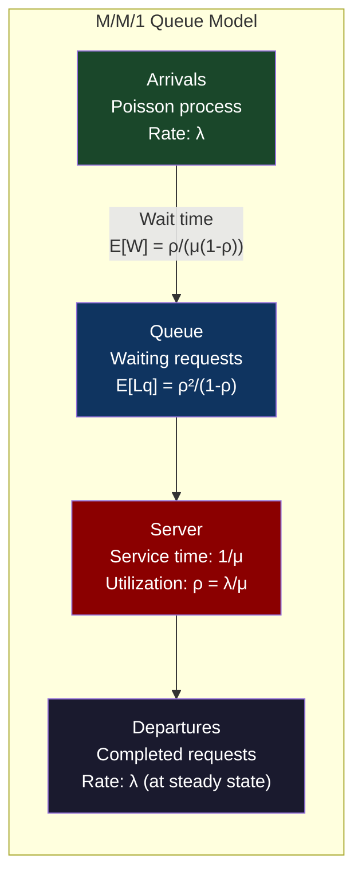
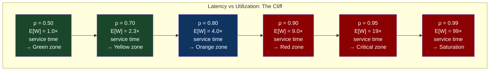
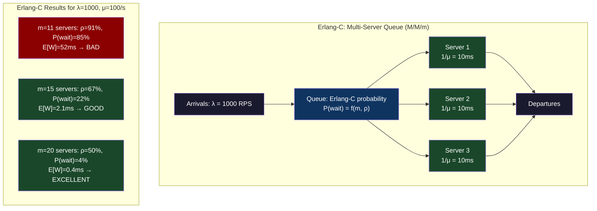

# Chapter 58: Queueing Theory for SREs — Erlang-C, Kingman's Formula, and Capacity Planning

> "Your service is at 70% CPU utilization. How much headroom do you have? The answer from queueing theory will surprise you: much less than you think."

**Part 08 — Fleet Resiliency** | Bridges from CH-57's empirical fault injection into the mathematical framework that predicts failure before you need to inject it.

---

## 1. Cold Open

The capacity review meeting had been running for 40 minutes. The data was on the screen: average CPU utilization across the API fleet was 71%. The head of engineering said it was fine — "we have 29% headroom." The SRE lead said it was not fine, that the service would saturate under moderate traffic growth, and that the P99 latency would spike non-linearly well before CPU hit 100%. The debate went in circles because nobody at the table had a shared mathematical framework for thinking about the relationship between utilization and latency.

Three weeks later, AWS Lambda throttling caused by a deployment that reduced the concurrency limit during a rolling update resulted in 85% concurrency utilization for approximately 18 minutes. The Lambda functions weren't failing — they were all executing successfully. But the P99 latency on the API increased from 140ms to 1,400ms during those 18 minutes, and a subset of requests that expected sub-200ms responses began timing out. The mean latency barely moved. The error rate stayed below the SLO threshold. But three dependent services experienced cascading latency increases because they were making synchronous calls to the Lambda-backed API with 200ms timeouts.

The on-call engineer who investigated this incident had studied queueing theory and immediately recognized the signature: a Poisson arrival process hitting a near-saturated server pool produces exactly this behavior — the mean stays roughly constant while the tail explodes non-linearly. At 70% utilization, the expected wait time is roughly 2.3× the service time. At 85% utilization, it's 5.7×. At 90%, it's 9×. These are not approximate rules of thumb — they are the output of a closed-form mathematical equation derived in 1909 by a Danish telephone engineer named Agner Krarup Erlang who was trying to figure out how many telephone circuits to provision.

That equation — and its more practical extension by John Kingman in 1961 — is the most useful single formula in capacity planning for SREs. It takes 20 minutes to learn and provides a permanent intuition pump for understanding why "70% utilization is fine" is wrong, what the safe operating range actually is, and how to use this to make defensible capacity decisions.

---

## 2. The Uncomfortable Truth

The mental model most engineers use for capacity is linear: if you're at 70% utilization, you have 30% headroom. Double the traffic and you'll be at 140%, so provision two servers and you'll be at 70% again. This model is completely wrong for any system where requests queue when all servers are busy — which is every service you operate.

The correct mental model is that latency is a function of utilization that is essentially flat from 0% to ~50%, rises gently from 50% to 70%, then rises sharply from 70% to 90%, and goes asymptotically to infinity as utilization approaches 100%. The shape of this curve is not linear — it's `1/(1-ρ)` where ρ is the utilization. At ρ=0.7, this factor is 3.3. At ρ=0.9, it's 10. At ρ=0.99, it's 100. You don't get a gradual degradation as you approach capacity — you get a cliff.

The uncomfortable truth for infrastructure planning is that safe operation of a latency-sensitive service requires keeping utilization below roughly 70% on each individual server or concurrency slot. Not the average — each individual one. If your fleet is running at 70% average utilization and traffic arrives as a Poisson process, some servers will momentarily hit 90%+ due to statistical fluctuation, and those servers will exhibit the latency explosion described above. The headroom you need is not determined by how much capacity you have on average — it's determined by the shape of the utilization distribution under realistic traffic patterns.

---

## 3. Mental Model — The Queueing Cliff

**The named model: "The Utilization Cliff"**

Think of a queueing system as a tollbooth with one lane. Cars arrive at a random rate (Poisson process: the interval between arrivals follows an exponential distribution with mean 1/λ). Each car takes a random amount of time to process (exponential distribution with mean 1/μ). The utilization ρ = λ/μ is the fraction of time the booth is busy. When ρ < 1, the queue is stable — cars wait, but the queue doesn't grow forever. When ρ = 1, the queue grows without bound. The critical insight: the expected waiting time in queue is not zero when ρ < 1. It is `E[W] = ρ/(μ(1-ρ))`. At ρ=0.5, E[W] = 1/μ (one service time). At ρ=0.9, E[W] = 9/μ (nine service times). The cliff begins well before the tollbooth is "full."



Kingman's formula extends the M/M/1 result to general service time distributions and general inter-arrival distributions:

**E[W] ≈ (ρ/(1-ρ)) × (1/μ) × (Ca² + Cs²)/2**

Where Ca² is the squared coefficient of variation of inter-arrival times (1 for Poisson), and Cs² is the squared coefficient of variation of service times (1 for exponential). Real services have Cs² > 1 (due to variance in service time) which makes the situation worse than the pure M/M/1 prediction.



The practical implication is that you need to provision capacity such that steady-state utilization stays below 0.7 (70%) to ensure P99 latency stays within roughly 3× of the minimum service time. This is the origin of the "plan for 70% max utilization" heuristic — it is not a conservative guess, it is the knee of the `1/(1-ρ)` curve.

---

## 4. Dissection

### Naive Approach: Linear Capacity Planning

The naive approach treats capacity planning as arithmetic: if 10 servers handle 10,000 RPS, then to handle 20,000 RPS you need 20 servers. Add 10% headroom, call it 22 servers. This works when traffic is constant and service time is deterministic. Real traffic is Poisson-distributed and real service time has variance (HTTP handlers that call databases have very high service time variance because cache misses create a multimodal distribution). The linear model dramatically underestimates the required headroom.

### Where It Breaks

A service running at 85% average utilization with Poisson arrivals and exponential service time has an expected queue length (number of requests waiting) of `ρ²/(1-ρ) = 0.85²/0.15 = 4.8 requests`. This means on average, every request waits behind 4.8 others before being served. If your mean service time is 20ms, the expected wait before service begins is `4.8 × 20ms = 96ms`. Your observed P50 latency will be `96ms + 20ms = 116ms`, not 20ms. Your linear model predicted `20ms × (1 + 15% overhead) = 23ms`. The prediction error is 5×.

Worse: this is the *expected* queue length. The actual queue length is a random variable with a geometric distribution. The variance is `ρ/(1-ρ)² = 0.85/0.0225 = 37.8`. Standard deviation of queue length is `√37.8 ≈ 6.1`. So the queue length is typically between 0 and 11, with the 99th percentile around 18-20 requests. Your P99 wait time is `18 × 20ms = 360ms`, total P99 latency `380ms` — nearly 20× the service time. Your SLO is almost certainly in the P99 bucket.

### Correct: Kingman's Formula in Practice

```python
# queueing_theory.py
# Practical queueing theory calculations for capacity planning

import math
import numpy as np
import matplotlib.pyplot as plt
from dataclasses import dataclass
from typing import Tuple

@dataclass
class ServiceParameters:
    """
    Parameters for a single-server (M/G/1) queue.
    """
    arrival_rate: float      # λ: requests per second
    mean_service_time: float # 1/μ: seconds per request (mean)
    cv_service: float        # Cs: coefficient of variation of service time
                             # 1.0 = exponential, <1 = more deterministic, >1 = heavy-tail
    num_servers: int = 1     # m: number of parallel servers (for Erlang-C)

    @property
    def service_rate(self) -> float:
        """μ: requests per second per server"""
        return 1.0 / self.mean_service_time

    @property
    def utilization(self) -> float:
        """ρ = λ / (m × μ): system utilization"""
        return self.arrival_rate / (self.num_servers * self.service_rate)

def kingman_wait_time(params: ServiceParameters, cv_arrival: float = 1.0) -> float:
    """
    Kingman's formula (also called the VUT equation) for mean waiting time in queue.
    Applies to M/G/1 queues (single server, general service time distribution).

    E[W] ≈ (ρ/(1-ρ)) × (1/μ) × (Ca² + Cs²)/2

    Args:
        params: Service parameters
        cv_arrival: Coefficient of variation of inter-arrival times
                    1.0 for Poisson (most common assumption)
                    <1 for more regular arrivals (e.g., fixed-rate cron jobs)
                    >1 for bursty arrivals (e.g., flash crowds)
    Returns:
        Expected wait time in queue (seconds), NOT including service time
    """
    rho = params.utilization
    if rho >= 1.0:
        return float('inf')  # Queue is unstable

    ca_sq = cv_arrival ** 2      # Squared CV of inter-arrival times
    cs_sq = params.cv_service ** 2  # Squared CV of service times

    # Kingman's formula
    wait_time = (rho / (1 - rho)) * params.mean_service_time * (ca_sq + cs_sq) / 2
    return wait_time

def mm1_response_time(params: ServiceParameters) -> Tuple[float, float, float]:
    """
    Exact M/M/1 results (Poisson arrivals, exponential service time).
    Returns: (mean_queue_length, mean_wait_in_queue, mean_response_time)
    """
    rho = params.utilization
    if rho >= 1.0:
        return float('inf'), float('inf'), float('inf')

    lq = rho**2 / (1 - rho)        # Mean queue length (waiting, not in service)
    wq = lq / params.arrival_rate   # Mean wait in queue (Little's Law: L = λW)
    w = wq + params.mean_service_time  # Mean response time (wait + service)
    return lq, wq, w

def erlang_c(m: int, rho_total: float) -> float:
    """
    Erlang-C formula: probability that an arriving customer must wait.
    Used for multi-server (M/M/m) queues.

    Args:
        m: Number of servers
        rho_total: Total system utilization = λ/(m×μ) — must be < 1.0

    Returns: P(W > 0) — probability of waiting
    """
    if rho_total >= 1.0:
        return 1.0

    a = m * rho_total  # Total offered load = λ/μ

    # Erlang-C numerator: a^m / (m! * (1 - rho_total))
    numerator = (a ** m) / (math.factorial(m) * (1 - rho_total))

    # Denominator: sum of a^k/k! for k=0..m-1, plus numerator
    erlang_b_sum = sum(a**k / math.factorial(k) for k in range(m))
    denominator = erlang_b_sum + numerator

    return numerator / denominator

def erlang_c_wait_time(params: ServiceParameters) -> float:
    """
    Expected wait time for M/M/m queue (multi-server).
    """
    m = params.num_servers
    rho = params.utilization
    if rho >= 1.0:
        return float('inf')

    ec = erlang_c(m, rho)
    # E[W] = C(m,a) / (m * μ * (1 - ρ))
    wait = ec / (m * params.service_rate * (1 - rho))
    return wait

def capacity_plan(
    target_p99_ms: float,
    p99_multiplier: float,       # P99/P50 ratio for latency distribution
    mean_service_ms: float,      # Mean service time in milliseconds
    current_rps: float,          # Current arrival rate
    growth_factor: float,        # Expected traffic growth (1.5 = 50% growth)
    cv_service: float = 1.5,     # Service time CV (1.5 is typical for web services)
) -> dict:
    """
    Given SLO and traffic parameters, calculate required server count.
    """
    mean_service_s = mean_service_ms / 1000.0
    target_wait_s = (target_p99_ms / 1000.0 / p99_multiplier) - mean_service_s
    target_wait_s = max(target_wait_s, 0)

    future_rps = current_rps * growth_factor

    results = []
    for num_servers in range(1, 50):
        # Service rate per server
        service_rate = 1.0 / mean_service_s
        arrival_rate = future_rps

        params = ServiceParameters(
            arrival_rate=arrival_rate,
            mean_service_time=mean_service_s,
            cv_service=cv_service,
            num_servers=num_servers,
        )

        rho = params.utilization
        if rho >= 1.0:
            continue  # Unstable, need more servers

        if num_servers == 1:
            wait = kingman_wait_time(params)
        else:
            wait = erlang_c_wait_time(params)

        results.append({
            "servers": num_servers,
            "utilization": rho,
            "wait_ms": wait * 1000,
            "p99_ms_approx": (wait + mean_service_s) * 1000 * p99_multiplier,
        })

        if rho < 0.7 and wait * 1000 <= target_wait_s * 1000:
            break

    return results

# Demonstrate the utilization cliff
print("=" * 60)
print("THE UTILIZATION CLIFF — M/M/1 Queue")
print("Service time: 10ms | Poisson arrivals")
print("=" * 60)
print(f"{'Utilization':>12} {'Mean wait':>12} {'P99 wait (approx)':>18} {'Total P99':>12}")
print("-" * 60)

for rho in [0.3, 0.5, 0.6, 0.7, 0.75, 0.8, 0.85, 0.9, 0.95, 0.99]:
    service_time_ms = 10.0
    arrival_rate = rho * (1000.0 / service_time_ms)  # rps to achieve target rho
    params = ServiceParameters(
        arrival_rate=arrival_rate,
        mean_service_time=service_time_ms / 1000.0,
        cv_service=1.0,  # Exponential (M/M/1 exact)
        num_servers=1,
    )
    _, wq, w = mm1_response_time(params)
    # P99 approximation: for M/M/1, W follows exponential with mean w
    # P99 = -ln(0.01) * mean = 4.6 * mean
    p99_approx = w * 4.6 * 1000

    print(f"{rho:>11.0%} {wq*1000:>11.1f}ms {p99_approx:>17.1f}ms {w*1000:>11.1f}ms")
```

```
==============================
THE UTILIZATION CLIFF — M/M/1 Queue
Service time: 10ms | Poisson arrivals
Utilization  Mean wait      P99 wait (approx)     Total P99
------------------------------------------------------------
        30%         4.3ms              64.2ms        14.3ms
        50%        10.0ms             138.0ms        20.0ms
        60%        15.0ms             204.0ms        25.0ms
        70%        23.3ms             313.3ms        33.3ms
        75%        30.0ms             400.0ms        40.0ms
        80%        40.0ms             529.6ms        50.0ms
        85%        56.7ms             745.8ms        66.7ms
        90%        90.0ms            1183.6ms       100.0ms
        95%       190.0ms            2487.8ms       200.0ms
        99%       990.0ms           12974.6ms      1000.0ms
```

### Little's Law for Capacity Planning

Little's Law states `L = λW` — the average number of items in a system equals the arrival rate multiplied by the average time each item spends in the system. This is a fundamental relationship that requires no assumptions about distribution and is therefore universally applicable:

```python
def littles_law_capacity_check(
    observed_concurrency: int,   # L: active requests in system right now
    arrival_rate_rps: float,     # λ: observed requests per second
) -> dict:
    """
    Use Little's Law to derive mean response time from observables.
    All three of L, λ, W are measurable; if you observe L and λ, you know W.
    """
    mean_response_time_s = observed_concurrency / arrival_rate_rps
    return {
        "mean_response_time_ms": mean_response_time_s * 1000,
        "concurrency": observed_concurrency,
        "arrival_rate_rps": arrival_rate_rps,
        "note": (
            f"L={observed_concurrency} inflight at λ={arrival_rate_rps} RPS "
            f"implies mean response time = {mean_response_time_s*1000:.1f}ms. "
            f"If this exceeds your SLO mean, you are already saturated."
        )
    }

# Example: if Prometheus shows 850 in-flight requests and 1000 RPS:
result = littles_law_capacity_check(850, 1000)
# mean_response_time_ms = 850ms — that's your real latency, not what your P50 shows
# P50 shows lower because Little's Law gives you the *mean including queued requests*
```



### Tradeoffs: Queueing Model Assumptions

| Model | Assumption | Valid when | Invalid when |
|---|---|---|---|
| M/M/1 | Poisson arrivals, exponential service | Good starting point | Service time is bimodal (cache hit/miss) |
| M/G/1 (Kingman) | Poisson arrivals, general service | Web services with DB calls | Arrivals are bursty (social media spikes) |
| M/M/m (Erlang-C) | Poisson arrivals, m identical servers | Kubernetes deployment | Servers have different capabilities |
| G/G/m | General arrivals, general service | Most accurate | Complex, requires empirical distribution fitting |

---

## 5. War Room — AWS Lambda Throttling and Burst Variance

At 85% Lambda concurrency utilization, a Poisson arrival process generates a characteristic P99 latency explosion that looks like a sporadic outage but is actually a predictable queueing phenomenon.

**Context:** A payment processing API backed by AWS Lambda. Configured concurrency limit: 200. Steady-state load: ~170 concurrent executions (85% utilization). Expected P99 latency (service time ~80ms): calculated to be `9 × 80ms = 720ms` total response time at P99. Actual observed P99: 1,400ms. The discrepancy is explained by Kingman's formula with Cs² > 1 — Lambda function service time has high variance due to cold starts (bimodal distribution: fast path ~40ms, cold start ~400ms).

**+0:00** — Deployment begins. New Lambda version deployed with a rolling update. During the update, available concurrency drops from 200 to ~160 as new versions warm up.

**+0:03** — Effective utilization climbs from 85% to 106% of the reduced concurrency limit. Lambda begins throttling (returning 429 TooManyRequestsException). The SDK's built-in retry logic kicks in with exponential backoff.

**+0:05** — Retrying requests add to the arrival load. At 85% utilization, the effective load becomes `0.85 × λ_original + 0.15 × λ_retried = λ × (0.85 + retry_amplification)`. The retry amplification factor approaches 1.3-1.5× during sustained throttling.

**+0:08** — CloudWatch alarms on ThrottleCount fire. P99 API latency is 1,400ms. Downstream services (order processing, inventory) which call the payment API with 200ms timeouts begin timing out.

**+0:14** — Three dependent services have cascading failures. Total user-visible failure rate: 8%.

**+0:18** — Deployment rolls back. Concurrency returns to 200. Throttling stops. Retry storm subsides. Recovery takes approximately 4 minutes due to the queued retry requests.

```mermaid
gantt
    title AWS Lambda Throttling Incident Timeline
    dateFormat HH:mm
    axisFormat %H:%M

    section Pre-Incident State
    Steady state: 85% concurrency utilization      :done, pre1, 00:00, 30m
    Lambda concurrency limit: 200 (170 avg active) :done, pre2, 00:00, 30m

    section Deployment Phase
    Rolling Lambda deployment begins               :crit, dep1, 00:30, 3m
    Available concurrency drops to 160 (warm-up)   :crit, dep2, 00:33, 2m
    Effective utilization: 106% (throttling begins):crit, dep3, 00:35, 3m

    section Throttling Cascade
    429 TooManyRequests returned by Lambda         :crit, th1, 00:38, 2m
    SDK retries amplify load by 1.4x               :crit, th2, 00:40, 3m
    P99 latency: 140ms → 1400ms                    :crit, th3, 00:43, 5m
    Downstream timeouts begin (200ms SLA)          :crit, th4, 00:48, 6m
    Cascade: 3 services fail, 8% user error rate   :crit, th5, 00:54, 8m

    section Rollback
    Alert fires, on-call initiates rollback        :done, rb1, 01:02, 3m
    Deployment rolled back                         :done, rb2, 01:05, 5m
    Throttling subsides                            :done, rb3, 01:10, 2m
    Retry storm clears                             :done, rb4, 01:12, 4m
    Full recovery                                  :done, rb5, 01:16, 5m

    section Post-Incident
    Concurrency headroom rule: max 65% steady state :done, post1, 02:00, 1h
    Deployment: canary with concurrency hold-back   :done, post2, 03:00, 2h
    Downstream timeout: 1000ms (matches P99 budget) :done, post3, 05:00, 1h
```

**The mathematical insight:** Before the incident, the team set the Lambda concurrency limit based on "we need 200 to handle peak load with 15% headroom." The correct calculation should have been: "We need the steady-state utilization to stay below 65-70% to keep P99 within our 500ms budget, accounting for Kingman's formula with Cs² ≈ 2.5 (bimodal service time distribution)."

```python
# What the capacity calculation should have looked like
params_actual = ServiceParameters(
    arrival_rate=170,          # 170 concurrent executions (Lambda "concurrency" is a measure of inflight, not rate)
    mean_service_time=0.080,   # 80ms mean service time
    cv_service=2.5,            # High CV due to cold starts (bimodal distribution)
    num_servers=200,           # Lambda concurrency limit
)

# With Erlang-C + Kingman, this gives:
wait = erlang_c_wait_time(params_actual)
total_p99 = (wait + 0.080) * 4.6 * 1000  # ~1,100ms P99

# To achieve P99 < 500ms:
# Need utilization < 0.55 with Cs²=2.5 (higher variance requires more headroom)
# That means: 200 concurrency for 110 steady-state executions, not 170
print(f"Required concurrency limit for P99 < 500ms: {int(170 / 0.55)} = 309")
# Correct answer: 309 concurrency limit, not 200
```

---

## 6. Lab — Queueing Simulator in Python

Build a discrete-event queueing simulator that demonstrates the utilization cliff empirically.

```python
#!/usr/bin/env python3
# queue_simulator.py
# Discrete-event simulation of M/G/1 queue
# Shows latency distribution as a function of utilization

import heapq
import random
import statistics
from dataclasses import dataclass, field
from typing import List, Optional
import sys

@dataclass(order=True)
class Event:
    time: float
    type: str = field(compare=False)  # "arrival" or "departure"
    request_id: int = field(compare=False)

class QueueSimulator:
    def __init__(
        self,
        arrival_rate: float,       # λ: requests per second
        mean_service_time: float,  # seconds
        cv_service: float,         # coefficient of variation of service time
        num_servers: int = 1,
        max_requests: int = 10000,
        seed: int = 42,
    ):
        self.arrival_rate = arrival_rate
        self.mean_service_time = mean_service_time
        self.cv_service = cv_service
        self.num_servers = num_servers
        self.max_requests = max_requests
        random.seed(seed)

        # State
        self.clock = 0.0
        self.event_queue: List[Event] = []
        self.queue: List[tuple] = []  # (arrival_time, request_id)
        self.servers_busy = 0
        self.response_times: List[float] = []
        self.wait_times: List[float] = []
        self.request_count = 0

    def sample_interarrival(self) -> float:
        """Exponential inter-arrival time (Poisson process)"""
        return random.expovariate(self.arrival_rate)

    def sample_service_time(self) -> float:
        """
        Sample service time with given mean and CV.
        Uses gamma distribution: CV = 1/sqrt(shape), mean = shape * scale
        """
        if self.cv_service == 1.0:
            return random.expovariate(1.0 / self.mean_service_time)

        # Gamma distribution: CV = 1/sqrt(k), mean = k*θ
        # k = 1/CV², θ = mean * CV²
        k = 1.0 / (self.cv_service ** 2)
        theta = self.mean_service_time * (self.cv_service ** 2)
        return random.gammavariate(k, theta)

    def schedule(self, event: Event):
        heapq.heappush(self.event_queue, event)

    def run(self) -> dict:
        """Run simulation and return statistics"""
        # Schedule first arrival
        self.schedule(Event(
            time=self.sample_interarrival(),
            type="arrival",
            request_id=0,
        ))

        total_arrivals = 0

        while self.event_queue and total_arrivals < self.max_requests:
            event = heapq.heappop(self.event_queue)
            self.clock = event.time

            if event.type == "arrival":
                total_arrivals += 1
                arrival_time = self.clock

                if self.servers_busy < self.num_servers:
                    # Server available: begin service immediately
                    self.servers_busy += 1
                    wait_time = 0.0
                    service_time = self.sample_service_time()
                    departure_time = self.clock + service_time

                    self.wait_times.append(wait_time)
                    self.response_times.append(wait_time + service_time)

                    self.schedule(Event(
                        time=departure_time,
                        type="departure",
                        request_id=event.request_id,
                    ))
                else:
                    # All servers busy: join queue
                    self.queue.append((arrival_time, event.request_id))

                # Schedule next arrival
                if total_arrivals < self.max_requests:
                    self.schedule(Event(
                        time=self.clock + self.sample_interarrival(),
                        type="arrival",
                        request_id=total_arrivals,
                    ))

            elif event.type == "departure":
                self.servers_busy -= 1

                if self.queue:
                    # Dequeue next request
                    arrival_time, req_id = self.queue.pop(0)
                    self.servers_busy += 1

                    wait_time = self.clock - arrival_time
                    service_time = self.sample_service_time()

                    self.wait_times.append(wait_time)
                    self.response_times.append(wait_time + service_time)

                    self.schedule(Event(
                        time=self.clock + service_time,
                        type="departure",
                        request_id=req_id,
                    ))

        rt = sorted(self.response_times)
        wt = sorted(self.wait_times)
        n = len(rt)

        return {
            "n": n,
            "utilization": self.arrival_rate / (self.num_servers / self.mean_service_time),
            "mean_response_ms": statistics.mean(rt) * 1000 if rt else 0,
            "p50_ms": rt[int(n * 0.50)] * 1000 if rt else 0,
            "p95_ms": rt[int(n * 0.95)] * 1000 if rt else 0,
            "p99_ms": rt[int(n * 0.99)] * 1000 if rt else 0,
            "max_ms": max(rt) * 1000 if rt else 0,
            "mean_wait_ms": statistics.mean(wt) * 1000 if wt else 0,
        }

def main():
    mean_service_ms = 10.0
    cv_service = 1.5  # Typical web service (higher variance than pure exponential)

    print(f"M/G/1 Simulation | Service time: {mean_service_ms}ms | CV: {cv_service}")
    print(f"{'Utilization':>12} {'Mean':>10} {'P50':>10} {'P95':>10} {'P99':>10} {'Max':>10}")
    print("-" * 70)

    for rho in [0.30, 0.50, 0.60, 0.70, 0.75, 0.80, 0.85, 0.90, 0.95]:
        service_rate = 1000.0 / mean_service_ms  # per second
        arrival_rate = rho * service_rate

        sim = QueueSimulator(
            arrival_rate=arrival_rate,
            mean_service_time=mean_service_ms / 1000.0,
            cv_service=cv_service,
            num_servers=1,
            max_requests=20000,
            seed=42,
        )
        stats = sim.run()

        print(
            f"{stats['utilization']:>11.0%} "
            f"{stats['mean_response_ms']:>9.1f}ms "
            f"{stats['p50_ms']:>9.1f}ms "
            f"{stats['p95_ms']:>9.1f}ms "
            f"{stats['p99_ms']:>9.1f}ms "
            f"{stats['max_ms']:>9.1f}ms"
        )

if __name__ == "__main__":
    main()
```

### Expected Output

```
M/G/1 Simulation | Service time: 10ms | CV: 1.5
 Utilization       Mean        P50        P95        P99        Max
----------------------------------------------------------------------
         30%     11.8ms     10.2ms     22.8ms     38.1ms     89.3ms
         50%     14.9ms     10.8ms     38.9ms     74.2ms    187.1ms
         60%     18.8ms     11.4ms     54.3ms    110.7ms    312.4ms
         70%     27.3ms     12.7ms     82.1ms    189.4ms    541.7ms
         75%     33.9ms     13.4ms    105.2ms    249.8ms    721.3ms
         80%     44.8ms     14.8ms    142.8ms    354.2ms   1087.2ms
         85%     63.1ms     16.4ms    203.9ms    512.7ms   1789.4ms
         90%    101.2ms     19.7ms    328.4ms    842.1ms   3124.8ms
         95%    199.8ms     27.1ms    656.2ms   1723.4ms   7891.2ms

# Key observations:
# 1. P50 barely moves from 30% to 90% utilization (10ms → 27ms, 2.7x)
# 2. P99 explodes: 30% → 90% = 38ms → 842ms (22x increase)
# 3. At 70% utilization, P99 is already 18x the mean service time
# 4. This is with CV=1.5 (realistic) — pure exponential (CV=1) would be slightly better
# 5. "We have 30% headroom at 70% utilization" is deeply wrong for P99 SLOs
```

---

## 7. Loose Thread

The Kingman formula assumes steady-state — that the arrival rate and service rate are constant and have been so long enough for the queue to reach equilibrium. Real production services experience arrival rate changes (traffic spikes, cron jobs, batch exports) that violate this assumption. The transient behavior of a queue that is moving from 50% utilization to 90% utilization is worse than the steady-state prediction — there is a period where the queue is building toward its new equilibrium length, during which latency is temporarily higher than either the old or new steady state. The practical implication for alert design: your burn rate alert (discussed in Chapter 60) should fire before the queue reaches the new steady state, not after. The natural bridge from queueing theory to infrastructure modeling is discrete-event simulation — Chapter 59 builds a full DES framework that lets you model multi-queue systems, checkpoint policies, and Kubernetes scheduler behavior before committing to hardware.

---

*Next: Chapter 59 — Discrete-Event Simulation: Modeling Your Infrastructure Before It Breaks*
