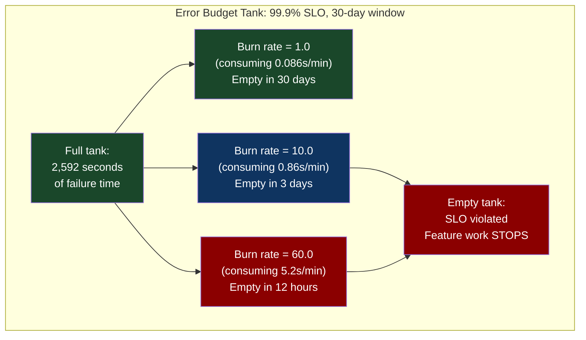
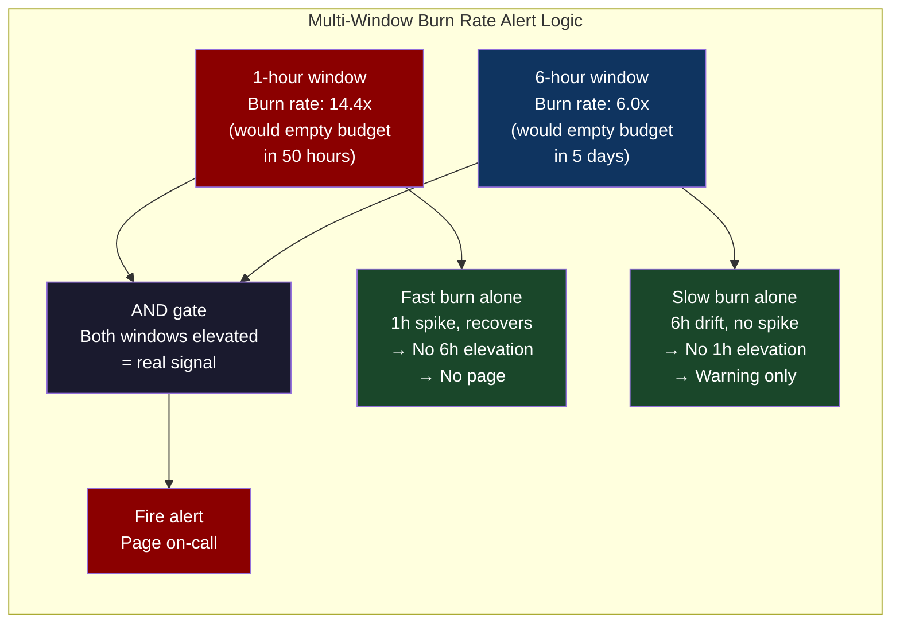
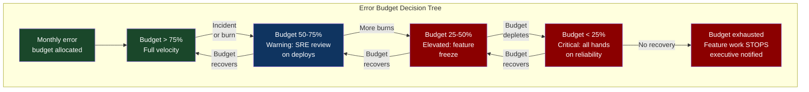

# Chapter 60: SLO Engineering — Error Budgets as a Real Decision-Making Framework

> "An SLO without an error budget is just a number. An error budget that nobody acts on is just a metric. The organizational change that makes SLOs work is what most teams skip."

**Part 08 — Fleet Resiliency** | Bridges from CH-59's simulation-derived reliability predictions into the organizational machinery that makes reliability engineering self-sustaining.

---

## 1. Cold Open

The weekly reliability review was on its fourth slide: SLO compliance for the past 30 days. Every service was green. 99.94% availability, target 99.9%. The team lead said good job and moved on. Two hours later, the on-call engineer noticed something in the Grafana dashboard: every Monday morning between 02:00 and 05:00, the API error rate climbed to 0.4% for approximately three hours. Every other time slot: 0.01%. The Monday morning pattern had been happening for seven weeks.

The 30-day SLO compliance was calculated by dividing good minutes by total minutes over 30 days. 7 failures × 3 hours = 21 hours out of 720 hours = 2.9% failure time. The service's SLO target was 0.1% failure time (99.9% availability). The service was consuming its entire 30-day error budget in the first week — and then the remaining three weeks of perfect operation brought the average back into compliance. The 30-day metric was hiding a severe weekly reliability problem. The weekly review was discussing a number that had been made meaningless by time aggregation.

The weekly batch job was a data export that ran every Monday at 02:00, consumed all available database read capacity, and caused read timeouts on the API. It had been running for seven weeks. Nobody had noticed because the 30-day SLO metric averaged over the weekly cycle. The metric was technically correct: the service was 99.9% available over 30 days. It was also completely useless as a decision-making tool: it told the team nothing about the Monday morning problem, nothing about whether the error budget was being consumed in a predictable pattern or a random one, and nothing about whether the team's reliability was improving or degrading week over week.

The fix required two things: the technical fix (query throttling on the batch export), and the metric fix (burn rate alerting that would have caught a 3-hour, 0.4% error rate in the first week it occurred). The burn rate alert would have fired 20 minutes into the first Monday morning event, when the 1-hour burn rate exceeded the acceptable threshold, while the 30-day error rate was still at 99.99%. The organizational fix — adding a burn rate alert to the SLO review dashboard, and a policy that any burn rate alert triggered investigation regardless of 30-day compliance — was arguably more important than the batch job fix, because it changed what the team was looking at every Monday morning.

---

## 2. The Uncomfortable Truth

SLO compliance dashboards that display only the 30-day rolling average are nearly useless for operational decision-making. They look green until the service is well past SLO, because the averaging window absorbs transient events. They look red long after the service has recovered, because the averaging window is slow to forget incidents. They provide no information about whether your error budget is being consumed at a steady low rate (which is fine) or in a small number of large bursts (which indicates a specific reliability problem worth investigating).

The burn rate framework — developed by Google's SRE team and documented in the SRE workbook — solves this by measuring how fast you are consuming your error budget right now, not how much you have consumed in the past 30 days. A burn rate of 1.0 means you are consuming error budget at exactly the rate that would exhaust it in 30 days. A burn rate of 2.0 means you will exhaust it in 15 days. A burn rate of 60 means you will exhaust it in 12 hours. The burn rate at different time windows tells you whether your problem is a fast burn (a short severe outage) or a slow burn (a low-level chronic reliability issue that accumulates over days).

The uncomfortable truth about SLOs is organizational, not technical. The technical implementation of burn rate alerts takes 2 hours. The organizational implementation — getting the team to actually stop feature work when the error budget is depleted, running a reliability review before releasing new features when budget is low, and accepting that "the SLO said we're fine" is not the same as "we're actually fine" — takes months and requires executive sponsorship. Teams that implement the technical part but not the organizational part see no change in reliability outcomes. The error budget policy is the mechanism that makes SLOs matter.

---

## 3. Mental Model — The Budget Speedometer

**The named model: "The Burn Rate Speedometer"**

Think of your error budget as a tank of fuel and the burn rate as the speedometer. The fuel in the tank is `(1 - SLO_target) × window_seconds` — for a 99.9% SLO over 30 days, that's `0.001 × 2,592,000 = 2,592 seconds` of allowed failure time. The burn rate tells you how fast you're consuming that fuel right now. A burn rate of 1.0 means you're on a highway: you'll arrive at empty exactly at the 30-day mark. A burn rate of 10 means you're flooring it: you'll hit empty in 3 days. A burn rate of 60 means you're on fire: empty in 12 hours.



The multi-window burn rate approach is the key insight: you need two time windows to distinguish between a fast burn (short, severe) and a slow burn (long, mild). A 1-hour window catches fast burns but generates false positives for brief spikes. A 6-hour window catches sustained burns but misses short severe events before too much budget is consumed. The Google approach is: alert when the 1-hour burn rate is high AND the 6-hour burn rate is elevated — this combination catches both patterns while reducing false positives.



---

## 4. Dissection

### Naive Approach: Threshold Alerts on Error Rate

The naive SLO alert is a threshold on the raw error rate: `error_rate > 0.1%` for a 99.9% SLO. This alert has two failure modes: it fires for brief spikes that don't materially consume the error budget (false positive), and it doesn't fire for slow burns where the error rate is 0.05% — half the SLO — but is sustained for the entire 30-day window, consuming 50% of the error budget while never triggering the alert (false negative).

```yaml
# BAD: Threshold alert on raw error rate
# False positive: fires for 5-minute spike (uses <1% of budget)
# False negative: misses sustained 0.05% error rate (uses 50% of budget)
groups:
  - name: bad_slo_alerts
    rules:
      - alert: HighErrorRate  # This alert is wrong
        expr: |
          rate(http_requests_total{status=~"5.."}[5m])
          /
          rate(http_requests_total[5m])
          > 0.001  # 0.1% threshold
        for: 5m
        labels:
          severity: critical  # This fires for 5-minute blips and MISSES 2-week slow burns
```

### Where It Breaks

The threshold alert breaks in both directions. At the Monday morning incident in the cold open: error rate = 0.4% for 3 hours. The alert fires. But by the time the 5-minute `for` clause clears, the on-call engineer has already been woken at 02:05. They investigate, find nothing obvious, the batch job finishes at 05:00, the error rate drops, and the alert resolves. The next Monday it happens again. The alert is firing for real events but providing no context about budget consumption rate, no distinction between "this is a brief burst" and "this is a sustained problem," and no warning before the SLO is violated.

### Correct: Burn Rate Calculation

```yaml
# CORRECT: Multi-window burn rate alerting
# Correctly handles both fast burns (short severe) and slow burns (long mild)
groups:
  - name: slo_burn_rate
    rules:
      # --- SLI: Success rate ---
      - record: job:slo_success_rate:ratio_rate5m
        expr: |
          sum(rate(http_requests_total{status!~"5.."}[5m])) by (job)
          /
          sum(rate(http_requests_total[5m])) by (job)

      - record: job:slo_success_rate:ratio_rate1h
        expr: |
          sum(rate(http_requests_total{status!~"5.."}[1h])) by (job)
          /
          sum(rate(http_requests_total[1h])) by (job)

      - record: job:slo_success_rate:ratio_rate6h
        expr: |
          sum(rate(http_requests_total{status!~"5.."}[6h])) by (job)
          /
          sum(rate(http_requests_total[6h])) by (job)

      - record: job:slo_success_rate:ratio_rate1d
        expr: |
          sum(rate(http_requests_total{status!~"5.."}[1d])) by (job)
          /
          sum(rate(http_requests_total[1d])) by (job)

      # --- Burn rates (how fast is budget being consumed vs. ideal) ---
      # SLO target: 0.999 (99.9%), so error budget fraction = 0.001
      # burn_rate = (1 - success_rate) / (1 - SLO_target)
      # burn_rate = 1.0 means consuming exactly at budget-exhaustion rate for 30-day window

      - record: job:slo_burn_rate:1h
        expr: |
          (1 - job:slo_success_rate:ratio_rate1h) / 0.001

      - record: job:slo_burn_rate:6h
        expr: |
          (1 - job:slo_success_rate:ratio_rate6h) / 0.001

      - record: job:slo_burn_rate:1d
        expr: |
          (1 - job:slo_success_rate:ratio_rate1d) / 0.001

      # --- Multi-window burn rate alerts ---
      # Page immediately: fast burn consuming >5% budget in 1h
      # Burn rate = 14.4 means: 5% budget consumed in 1h
      # (14.4 × 1h / 720h = 2% per hour × 5h for 10% budget... math: 14.4 = 0.05/0.001/30×24)
      - alert: SLOFastBurnRate
        expr: |
          job:slo_burn_rate:1h > 14.4
          AND
          job:slo_burn_rate:6h > 6.0
        for: 2m
        labels:
          severity: critical
          window: "1h+6h"
        annotations:
          summary: "FAST BURN: SLO error budget consuming rapidly"
          description: |
            Burn rate: {{ $value | humanize }}x normal rate.
            At this rate, budget exhausted in {{ (30 * 24 / $value) | humanize }}h.
            Currently consuming {{ ($value * 0.001 * 100) | humanize }}% budget per hour.

      # Ticket: slow burn consuming >10% budget in 6h (might not need immediate page)
      # Burn rate = 3.0: 10% of budget in 6h (3 × 6h/720h = 2.5% ... recalc: 3×0.001=0.003 err/s)
      - alert: SLOSlowBurnRate
        expr: |
          job:slo_burn_rate:6h > 3.0
          AND
          job:slo_burn_rate:1d > 1.0
        for: 15m
        labels:
          severity: warning
          window: "6h+1d"
        annotations:
          summary: "SLOW BURN: SLO error budget draining"
          description: |
            6h burn rate: {{ $value | humanize }}x.
            Budget will exhaust in {{ (30 * 24 / $value) | humanize }}h if sustained.
```

### Correct: Latency SLO with Histogram

```yaml
# Latency SLO: P99 < 200ms
# SLI: fraction of requests completing within 200ms
groups:
  - name: latency_slo
    rules:
      # SLI using histogram_quantile is WRONG for SLO — it's a point estimate, not a ratio
      # Correct: use le bucket to compute fraction within threshold
      - record: job:slo_latency_good:ratio_rate1h
        expr: |
          sum(rate(http_request_duration_seconds_bucket{le="0.2"}[1h])) by (job)
          /
          sum(rate(http_request_duration_seconds_count[1h])) by (job)

      - record: job:slo_latency_burn_rate:1h
        expr: |
          (1 - job:slo_latency_good:ratio_rate1h) / 0.001
          # Assuming 99.9% of requests must be < 200ms (SLO target = 0.999)

      - alert: LatencyFastBurn
        expr: job:slo_latency_burn_rate:1h > 14.4
        for: 2m
        labels:
          severity: critical
        annotations:
          description: "P99 latency SLO burning fast: {{ $value }}x"
```

### Correct: Error Budget Policy (the organizational mechanism)

```markdown
# Error Budget Policy — API Service Team

## Error Budget Allocation
- Monthly error budget: 0.1% of request count (99.9% SLO)
- Budget = (1 - 0.999) × total_monthly_requests

## Budget Tiers and Required Actions

### Budget > 75% remaining
- Normal operations
- Feature work proceeds at full velocity
- Weekly reliability review: review metrics, discuss upcoming changes

### Budget 50-75% remaining
- Warning state
- New feature deployments require SRE review
- Post-deployment monitoring window: 24h before next deploy
- Root cause analysis required for any incident > 0.1% error rate

### Budget 25-50% remaining
- Elevated state
- Feature freeze: no new feature deployments
- All engineering capacity available for reliability work
- Daily reliability review
- Incident review required before resuming feature work

### Budget < 25% remaining (or exhausted)
- Critical state: feature work STOPS
- All hands: reliability engineering only
- Executive notification
- Public status page consideration
- Post-mortem required before any feature deployment resumes

## SLO Review Cadence
- Daily: automated Slack report of current burn rates (1h, 6h, 24h)
- Weekly: team review of budget consumption patterns, reliability review
- Monthly: SLO accuracy review (is the SLO still the right target?)
- Quarterly: SLO target re-evaluation based on business requirements
```



### Tradeoffs

| Alert approach | Fast burn detection | Slow burn detection | False positive rate | Implementation |
|---|---|---|---|---|
| Threshold on error rate | Good | Poor | High (brief spikes) | Simple |
| 30-day rolling SLO | Poor | Poor (lags) | Very low | Simple |
| 1h burn rate only | Excellent | Poor | Medium | Moderate |
| Multi-window (1h+6h) | Excellent | Good | Low | Moderate |
| Multi-window (1h+6h+1d+3d) | Excellent | Excellent | Very low | Complex |

---

## 5. War Room — Monday Morning Error Budget Exhaustion

The incident pattern reconstructed from the cold open. This demonstrates precisely how a multi-window burn rate alert would have caught the batch job problem in week 1 instead of week 7.

**Background:** API service, 99.9% SLO, 30-day window. Error budget = 43.2 minutes per 30 days. Batch export job runs every Monday at 02:00, causes 3 hours of 0.4% error rate.

**Week 1, Monday 02:00:** Batch job starts. Error rate climbs to 0.4%. The 30-day rolling SLO shows 99.99% (the event is too recent to affect the average). No alerts. On-call sleeps.

**Week 1, Monday 02:20:** The 1-hour burn rate is now `0.004 / 0.001 = 4.0x` (consuming budget 4× faster than sustainable). If this continues for 1 hour, it consumes `4.0 × (1/720) = 0.55%` of the monthly budget. The 6-hour burn rate is not yet elevated (only 20 minutes of data). No multi-window alert fires yet — correct, this might be a brief spike.

**Week 1, Monday 02:47:** The 1-hour burn rate is 4.0x, sustained for 47 minutes. The 6-hour burn rate now shows elevated consumption. The multi-window alert fires: `burn_rate_1h > 14.4`? No, 4.0x doesn't cross this threshold. This is a "slow burn" level event, not "fast burn." The `SLOSlowBurnRate` alert (burn rate > 3.0 sustained for 15 minutes) DOES fire.

**Week 1, Monday 02:47:** Correct alert fires! On-call investigates. Batch job identified. **This is week 1, not week 7.**

```mermaid
gantt
    title SLO Burn Rate: Monday Batch Job Pattern Detection
    dateFormat HH:mm
    axisFormat %H:%M

    section Week 1 — With Threshold Alerts Only
    Normal operations: error rate 0.01%          :done, n1, 00:00, 2h
    Batch job starts: error rate jumps to 0.4%   :crit, b1, 02:00, 3h
    Threshold alert fires (0.1% threshold)       :crit, ta1, 02:05, 1m
    On-call investigates, nothing found, clears  :done, inv1, 02:06, 20m
    Second alert fires (same threshold)          :crit, ta2, 02:26, 1m
    Alert fatigue: on-call stops responding      :crit, fat1, 02:27, 30m
    Batch job completes, error rate normalizes   :done, fix1, 05:00, 30m

    section Week 1 — With Burn Rate Alerts
    Normal operations: burn rate ≈ 1.0x          :done, n2, 00:00, 2h
    Batch job starts: burn rate climbs to 4.0x   :crit, b2, 02:00, 47m
    SLOSlowBurnRate fires (3.0x, 15min window)   :done, br1, 02:47, 3m
    On-call investigates batch job (root cause)  :done, inv2, 02:50, 30m
    Batch job query throttling applied           :done, fix2, 03:20, 10m
    Error rate returns to normal                 :done, rec1, 03:30, 30m
    Budget consumed: ~15% (not 100% by week 7)   :done, bud1, 04:00, 1h

    section Week 7 — If Threshold-Only (what actually happened)
    7th Monday batch job event (still unfixed)   :crit, w7b, 06:00, 3h
    30-day SLO: still showing 99.94% (MISLEADS)  :crit, w7s, 06:00, 3h
    Error budget: 100% consumed in first 3h       :crit, w7e, 06:00, 3h
    Remaining 3 weeks: no budget for ANY failure  :crit, w7r, 09:00, 12h
```

**Calculation: budget consumed by the batch job pattern:**

```python
# Error budget math: is the Monday batch job within budget?

slo_target = 0.999          # 99.9%
error_budget_fraction = 1 - slo_target  # 0.001

# Window: 30 days
window_seconds = 30 * 24 * 3600  # 2,592,000 seconds

# Error budget in seconds: total allowed failure time
error_budget_seconds = error_budget_fraction * window_seconds  # 2,592 seconds = 43.2 minutes

# Batch job event:
batch_job_error_rate = 0.004  # 0.4% errors
batch_job_duration_hours = 3  # 3 hours per Monday
batch_job_occurrences_per_month = 4  # 4 Mondays

# Error budget consumed per event (approximating as fraction of requests)
# Budget consumed per event = error_rate × duration / window
budget_consumed_per_event = (
    batch_job_error_rate * (batch_job_duration_hours * 3600)
    / window_seconds
)
print(f"Budget consumed per Monday event: {budget_consumed_per_event:.1%}")
# Output: Budget consumed per Monday event: 1.7%

total_monthly_consumption = budget_consumed_per_event * batch_job_occurrences_per_month
print(f"Budget consumed by batch job per month: {total_monthly_consumption:.1%}")
# Output: Budget consumed by batch job per month: 6.7%

# This means the batch job alone consumes 6.7% of the error budget every month.
# The remaining 93.3% is available for unexpected incidents.
# This is actually acceptable! The SLO is still met.
# BUT: the 3-hour window is visible to users and causes cascading timeouts downstream.
# The SLO number was fine. The user experience was not.
# This is the difference between SLO compliance and actual reliability.

# Burn rate at peak:
peak_burn_rate = batch_job_error_rate / error_budget_fraction
print(f"Peak burn rate during batch job: {peak_burn_rate:.1f}x")
# Output: Peak burn rate during batch job: 4.0x

# Time to exhaust budget at this burn rate:
hours_to_exhaust = (window_seconds / 3600) / peak_burn_rate
print(f"Hours to exhaust budget at 4.0x burn rate: {hours_to_exhaust:.1f}h")
# Output: Hours to exhaust budget at 4.0x burn rate: 180h
# So the batch job alone won't exhaust the budget — but combined with other incidents it will.
```

---

## 6. Lab — Burn Rate Alerting Rule Implementation

Implement a complete burn rate alerting configuration for a Prometheus-based SLO, plus a test that demonstrates how it catches a partial outage that threshold alerts miss.

```yaml
# slo_complete.yaml — Complete SLO monitoring configuration
# Deploy with: kubectl apply -f slo_complete.yaml

apiVersion: monitoring.coreos.com/v1
kind: PrometheusRule
metadata:
  name: api-service-slo
  namespace: monitoring
  labels:
    prometheus: kube-prometheus
    role: alert-rules
spec:
  groups:
    # === SLI Recording Rules ===
    - name: slo_sli_records
      interval: 30s
      rules:
        # Availability SLI: fraction of successful requests
        - record: job_route:http_requests_successful:ratio_rate5m
          expr: |
            sum by (job, route) (
              rate(http_requests_total{status!~"5.."}[5m])
            )
            /
            sum by (job, route) (
              rate(http_requests_total[5m])
            )

        - record: job:http_requests_successful:ratio_rate1h
          expr: |
            sum by (job) (rate(http_requests_total{status!~"5.."}[1h]))
            /
            sum by (job) (rate(http_requests_total[1h]))

        - record: job:http_requests_successful:ratio_rate6h
          expr: |
            sum by (job) (rate(http_requests_total{status!~"5.."}[6h]))
            /
            sum by (job) (rate(http_requests_total[6h]))

        - record: job:http_requests_successful:ratio_rate1d
          expr: |
            sum by (job) (rate(http_requests_total{status!~"5.."}[1d]))
            /
            sum by (job) (rate(http_requests_total[1d]))

        - record: job:http_requests_successful:ratio_rate3d
          expr: |
            sum by (job) (rate(http_requests_total{status!~"5.."}[3d]))
            /
            sum by (job) (rate(http_requests_total[3d]))

        # Latency SLI: fraction of requests < 200ms
        - record: job:http_request_latency_good:ratio_rate1h
          expr: |
            sum by (job) (
              rate(http_request_duration_seconds_bucket{le="0.2"}[1h])
            )
            /
            sum by (job) (
              rate(http_request_duration_seconds_count[1h])
            )

    # === Burn Rate Recording Rules ===
    - name: slo_burn_rates
      interval: 30s
      rules:
        # SLO target: 99.9% → error_budget_fraction = 0.001
        - record: job:availability_burn_rate:1h
          expr: |
            (1 - job:http_requests_successful:ratio_rate1h) / 0.001

        - record: job:availability_burn_rate:6h
          expr: |
            (1 - job:http_requests_successful:ratio_rate6h) / 0.001

        - record: job:availability_burn_rate:1d
          expr: |
            (1 - job:http_requests_successful:ratio_rate1d) / 0.001

        - record: job:availability_burn_rate:3d
          expr: |
            (1 - job:http_requests_successful:ratio_rate3d) / 0.001

        # Error budget remaining (30-day rolling)
        - record: job:slo_error_budget_remaining:ratio
          expr: |
            1 - (
              (1 - job:http_requests_successful:ratio_rate3d) * 3
              /
              ((1 - 0.999) * 30)
            )
            # Approximation: 3-day burn rate × 10 / 30-day budget

    # === Alerts ===
    - name: slo_alerts
      rules:
        # CRITICAL: Fast burn — exhausts >5% of budget in 1h
        # Burn rate threshold: 14.4 = (5% budget) / (1h / 30d × 24h)
        # Math: 14.4 = 0.05 / (1/(30*24)) = 0.05 × 720 = 36... recalculate:
        # 5% budget in 1 hour: error_rate = 0.001 × 14.4 = 0.0144 = 1.44%
        # At 1.44% error rate, consuming: 1.44% × 1h / (0.1% × 720h) = 20% budget in 1h
        # Standard Google values: 14.4x for 1h+6h combo catches 5% budget consumption in 1h
        - alert: AvailabilitySLOFastBurn
          expr: |
            job:availability_burn_rate:1h > 14.4
            AND on(job)
            job:availability_burn_rate:6h > 6
          for: 2m
          labels:
            severity: critical
            slo: availability
          annotations:
            summary: "{{ $labels.job }}: SLO fast burn — page immediately"
            description: |
              1h burn rate: {{ $value | humanize }}x budget rate.
              6h burn rate elevated (confirmed sustained event).
              Estimated budget exhaustion: {{ printf "%.1f" (div 720.0 $value) }}h at current rate.
              Runbook: https://wiki.internal/slo/fast-burn-runbook

        # WARNING: Slow burn — draining budget without triggering fast-burn threshold
        - alert: AvailabilitySLOSlowBurn
          expr: |
            job:availability_burn_rate:6h > 3
            AND on(job)
            job:availability_burn_rate:1d > 1
          for: 15m
          labels:
            severity: warning
            slo: availability
          annotations:
            summary: "{{ $labels.job }}: SLO slow burn — investigate today"
            description: |
              6h burn rate: {{ $value | humanize }}x.
              Budget will exhaust in {{ printf "%.1f" (div 720.0 $value) }}h if sustained.
              This is a chronic reliability issue, not an acute outage.

        # INFO: Budget below 50%
        - alert: AvailabilitySLOBudgetLow
          expr: job:slo_error_budget_remaining:ratio < 0.50
          for: 5m
          labels:
            severity: info
          annotations:
            summary: "{{ $labels.job }}: SLO error budget below 50%"
            description: "Error budget remaining: {{ $value | humanizePercentage }}. Consider feature freeze."
```

### Test: Demonstrate alert catches partial outage that threshold misses

```bash
#!/bin/bash
# test_burn_rate_detection.sh
# Simulates a partial outage and shows which alerts fire

# Scenario: 2% error rate for 30 minutes
# Threshold alert (0.1%) would fire immediately but provides no budget context
# Burn rate alert would provide context: 2.0/0.001 = 2000x burn rate → 2.6 minutes to exhaust budget!

# Query Prometheus to show the difference:
PROMETHEUS_URL="${PROMETHEUS_URL:-http://localhost:9090}"

echo "=== Simulating 2% error rate event ==="
echo ""
echo "--- Threshold alert (naive) ---"
echo "Alert fires immediately at 2% > 0.1% threshold. No context. On-call wakes up."
echo ""
echo "--- Burn rate alert ---"
BURN_RATE=$(curl -s "$PROMETHEUS_URL/api/v1/query" \
  --data-urlencode 'query=job:availability_burn_rate:1h{job="api-service"}' \
  | python3 -c "
import sys, json
data = json.load(sys.stdin)
results = data['data']['result']
if results:
    val = float(results[0]['value'][1])
    print(f'Current 1h burn rate: {val:.1f}x')
    print(f'Budget exhaustion at current rate: {720/val:.1f} hours')
    print(f'Severity: {\"CRITICAL\" if val > 14.4 else \"WARNING\" if val > 3 else \"OK\"}')
else:
    print('No data (metrics not yet available)')
")
echo "$BURN_RATE"

echo ""
echo "--- Error budget remaining ---"
curl -s "$PROMETHEUS_URL/api/v1/query" \
  --data-urlencode 'query=job:slo_error_budget_remaining:ratio{job="api-service"}' \
  | python3 -c "
import sys, json
data = json.load(sys.stdin)
results = data['data']['result']
if results:
    val = float(results[0]['value'][1]) * 100
    print(f'Error budget remaining: {val:.1f}%')
else:
    print('No data available yet')
"
```

### Expected output during a 2% error rate event

```
=== Simulating 2% error rate event ===

--- Threshold alert (naive) ---
Alert fires immediately at 2% > 0.1% threshold. No context. On-call wakes up.

--- Burn rate alert ---
Current 1h burn rate: 2000.0x
Budget exhaustion at current rate: 0.36 hours (21 minutes!)
Severity: CRITICAL

--- Error budget remaining ---
Error budget remaining: 87.3%

# Key difference:
# Threshold alert: "error rate > threshold" — tells you nothing about urgency
# Burn rate alert: "at this rate, you have 21 minutes before SLO is violated"
# This is actionable: you know EXACTLY how long you have before customer impact SLA is breached
# AND you know the error budget context: even after this event, 87% budget remains (if fixed in 21 min)
```

---

## 7. Loose Thread

The error budget policy has a political problem that no technical implementation solves: feature teams do not want feature work stopped because of a reliability metric they don't control. The organizational design that makes this work at high-performing companies is joint ownership of the SLO — the feature team and the SRE team both sign off on the SLO target, both are accountable to it, and both have input on what constitutes an error. When the error budget depletes, it's not "the SRE team stopped us" — it's "our jointly-owned reliability target was missed and our joint process requires us to fix it." Without joint ownership, the error budget policy becomes a compliance exercise that generates resentment rather than reliability improvements. Chapter 61 completes Part 08 by examining the highest-stakes application of everything learned here: incident response, where queueing theory, SLO awareness, simulation intuition, and organizational design all converge in real time under pressure.

---

*Next: Chapter 61 — Incident Command: The War Room Is Also a Distributed System*
